# API Integration Layer

<cite>
**Referenced Files in This Document**
- [apiRouter.js](file://apiRouter.js)
- [services/escavador.js](file://services/escavador.js)
- [services/datajud.js](file://services/datajud.js)
- [services/jusbrasil.js](file://services/jusbrasil.js)
- [services/digesto.js](file://services/digesto.js)
- [services/custom.js](file://services/custom.js)
- [services/premium.js](file://services/premium.js)
- [server.js](file://server.js)
- [auth.js](file://auth.js)
- [worker.js](file://worker.js)
- [botManager.js](file://botManager.js)
- [parser.js](file://parser.js)
- [db.js](file://db.js)
- [package.json](file://package.json)
- [database.sql](file://database.sql)
- [README.md](file://README.md)
</cite>

## Update Summary
**Changes Made**
- Updated to reflect major architectural shift: Escavador now serves as the 'base principal' (main foundation) of the platform, replacing the previous complex fallback system
- Simplified service selection logic in apiRouter.js to prioritize Escavador first, then optionally user-configured paid services in paid or hybrid modes
- Enhanced DataJud service documentation to highlight new CNJ processing capabilities and server-level API key support
- Updated premium service ecosystem documentation to reflect the new simplified architecture
- Revised fallback mechanisms to focus on Escavador-first approach with optional premium service integration

## Table of Contents
1. [Introduction](#introduction)
2. [Project Structure](#project-structure)
3. [Core Components](#core-components)
4. [Architecture Overview](#architecture-overview)
5. [Detailed Component Analysis](#detailed-component-analysis)
6. [Premium Service Ecosystem](#premium-service-ecosystem)
7. [Multi-Tenant Search Capabilities](#multi-tenant-search-capabilities)
8. [Service Adapter Pattern](#service-adapter-pattern)
9. [Escavador-First Architecture](#escavador-first-architecture)
10. [Server-Level API Key Support](#server-level-api-key-support)
11. [Dependency Analysis](#dependency-analysis)
12. [Performance Considerations](#performance-considerations)
13. [Troubleshooting Guide](#troubleshooting-guide)
14. [Conclusion](#conclusion)
15. [Appendices](#appendices)

## Introduction
This document describes the API integration layer that powers the judicial process monitoring system. The system has evolved to support a comprehensive tiered access strategy with a simplified architecture where Escavador serves as the primary foundation, with optional premium services as secondary enhancements. The unified API interface abstracts external legal database access, request/response handling, and error management while providing flexible service selection based on user subscription tiers and configuration.

**Updated**: The new architecture prioritizes Escavador as the base principal service, with premium services serving as optional enhancements for users who configure them. This simplifies the service selection logic while maintaining comprehensive multi-tenant capabilities.

## Project Structure
The system now operates as a streamlined legal database integration platform with a focused service architecture centered around Escavador:

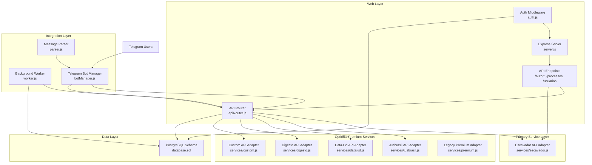

**Diagram sources**
- [apiRouter.js:1-55](file://apiRouter.js#L1-L55)
- [services/escavador.js:1-108](file://services/escavador.js#L1-L108)
- [services/jusbrasil.js:1-197](file://services/jusbrasil.js#L1-L197)
- [services/datajud.js:1-305](file://services/datajud.js#L1-L305)
- [services/digesto.js:1-25](file://services/digesto.js#L1-L25)
- [services/custom.js:1-26](file://services/custom.js#L1-L26)
- [services/premium.js:1-12](file://services/premium.js#L1-L12)
- [worker.js:1-74](file://worker.js#L1-74)
- [botManager.js:1-190](file://botManager.js#L1-L190)

**Section sources**
- [README.md:1-56](file://README.md#L1-L56)
- [package.json:1-21](file://package.json#L1-L21)

## Core Components
The API integration layer now consists of six key components with a simplified architecture centered around Escavador:

### Unified API Router (Escavador-First)
The central orchestrator implementing a streamlined tiered access strategy:
- **Escavador-first priority**: Escavador service is always attempted first as the primary foundation
- **Conditional premium integration**: Premium services are only attempted if user has configured them and mode requires additional services
- **Simplified fallback logic**: Reduced complexity compared to previous multi-tier fallback system
- **User context preservation**: Maintains user preferences and authentication throughout the streamlined process
- **Service discovery**: Automatically detects configured premium services when needed
- **Mode-aware execution**: Differentiates between gratis, pago, and hibrido modes with simplified logic

### Primary Service Adapter (Escavador)
Implements robust integration with the Escavador legal research platform:
- **Bearer token authentication**: Uses Authorization: Bearer token pattern for secure API access
- **Dual search capabilities**: Supports both process number searches and OAB (Brazilian Bar Association) searches
- **Process linkage**: Returns all CNJ numbers linked to OAB registrations
- **Timeout handling**: Implements 30-second timeout for OAB searches and 15-second timeout for process searches
- **Standardized response format**: Extracts and transforms relevant fields consistently across all searches
- **API key validation**: Returns null when API key is not configured, preventing service attempts

### Premium Service Adapters
Four specialized premium service adapters providing commercial legal database access:

#### Jusbrasil API Adapter
- **Comprehensive legal database**: Connects to Jusbrasil's extensive legal repository
- **Advanced OAB monitoring**: Implements full OAB monitoring workflow with registration and asynchronous collection
- **Structured response format**: Returns standardized legal case information with CNJ numbers
- **Server-level API key support**: Supports both user-level and server-level configuration
- **Async collection handling**: Manages cases where process collection is still ongoing

#### DataJud API Adapter
- **CNJ DataJud integration**: Connects to the official CNJ DataJud API for Brazilian court data
- **Multi-tribunal search**: Queries 30 different Brazilian courts and tribunals
- **Advanced rate limiting**: Implements 400ms delay between requests to prevent API abuse
- **Intelligent tribunal detection**: Uses CNJ number analysis to target specific tribunals for faster searches
- **Multiple search strategies**: Supports process numbers, OAB numbers, and textual searches
- **Server-level API key support**: Uses DATAJUD_API_KEY environment variable for authentication
- **Enhanced OAB processing**: Implements sophisticated OAB search strategies with tribunal-specific optimizations

#### Digesto API Adapter
- **Legislative database integration**: Connects to Digesto's legal database
- **API key management**: Uses DIGESTO_API_KEY environment variable
- **Future-ready implementation**: Contains TODO comments for real endpoint integration

#### Custom API Adapter
- **Flexible query support**: Accepts string or structured query objects
- **Environment-based configuration**: Uses TJ_API_KEY for authentication
- **Extensible architecture**: Designed for integration with any custom tribunal API
- **Silent failure handling**: Returns null when API key is not configured

### Authentication and Authorization
JWT-based authentication system with enhanced security features:
- **Multi-role support**: Admin and client role differentiation
- **Token-based access**: Secure JWT token generation and validation
- **Password security**: Bcrypt-based password hashing with salt rounds
- **Session management**: Automatic last login tracking and user session validation

**Section sources**
- [apiRouter.js:13-55](file://apiRouter.js#L13-L55)
- [services/escavador.js:1-108](file://services/escavador.js#L1-L108)
- [services/jusbrasil.js:1-197](file://services/jusbrasil.js#L1-L197)
- [services/datajud.js:1-305](file://services/datajud.js#L1-L305)
- [services/digesto.js:1-25](file://services/digesto.js#L1-L25)
- [services/custom.js:1-26](file://services/custom.js#L1-L26)
- [auth.js:1-59](file://auth.js#L1-L59)

## Architecture Overview
The system now implements a streamlined layered architecture with Escavador as the primary foundation:

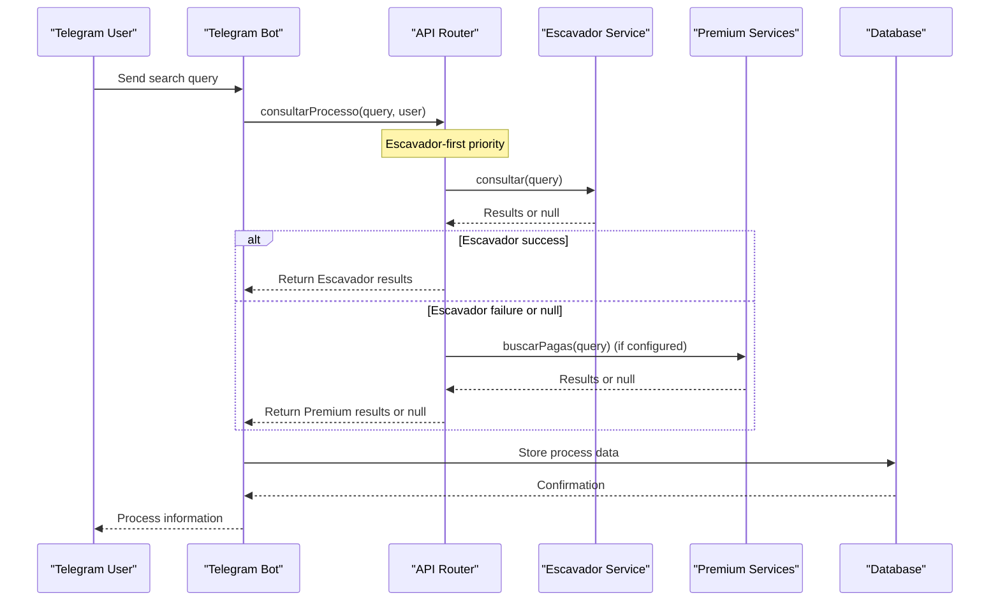

**Diagram sources**
- [apiRouter.js:14-37](file://apiRouter.js#L14-L37)
- [services/escavador.js:10-25](file://services/escavador.js#L10-L25)
- [services/jusbrasil.js:10-25](file://services/jusbrasil.js#L10-L25)
- [services/datajud.js:266-278](file://services/datajud.js#L266-L278)

The architecture ensures:
- **Escavador-first priority**: Primary service selection with comprehensive coverage
- **Conditional premium integration**: Premium services only attempted when configured and needed
- **Fail-safe operation**: System continues functioning even if premium services fail
- **Consistent response format**: Unified data structure across all service providers
- **Scalable premium service integration**: Easy addition of new commercial legal databases

## Detailed Component Analysis

### Streamlined API Router Implementation
The API router now implements a simplified multi-mode routing with Escavador-first priority:

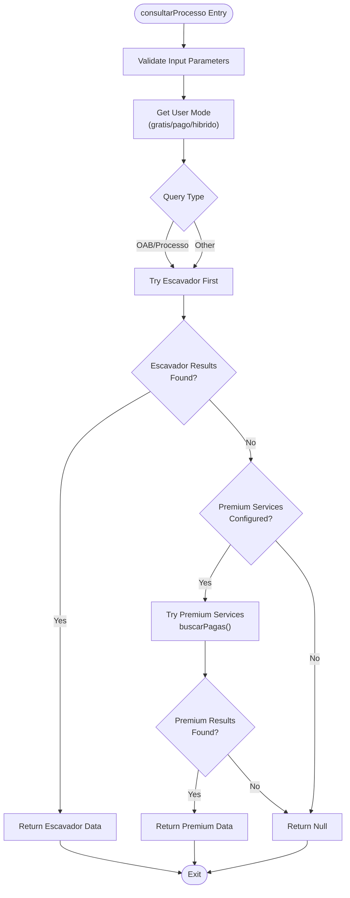

**Diagram sources**
- [apiRouter.js:14-52](file://apiRouter.js#L14-L52)

Key implementation characteristics:
- **Escavador-first priority**: Always attempts Escavador service first as the primary foundation
- **Conditional premium execution**: Premium services are only attempted if user has configured them and mode requires additional services
- **Simplified error handling**: Reduced complexity compared to previous multi-tier fallback system
- **Response normalization**: Adds service attribution to all results regardless of source

**Section sources**
- [apiRouter.js:14-52](file://apiRouter.js#L14-L52)

### Enhanced Escavador Service Adapter
The primary service adapter now provides comprehensive legal research platform integration:

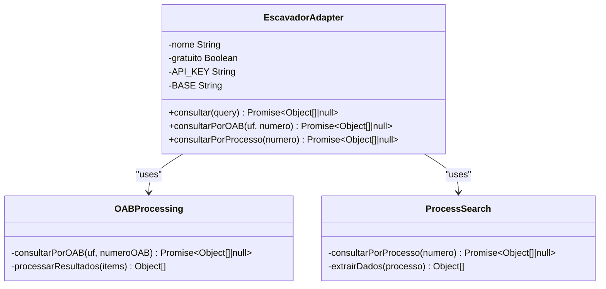

**Diagram sources**
- [services/escavador.js:10-101](file://services/escavador.js#L10-L101)

Implementation details:
- **Bearer token authentication**: Uses Authorization: Bearer token pattern with configurable API key
- **Dual search capabilities**: Supports both OAB searches and process number searches
- **Process linkage**: Returns all CNJ numbers linked to OAB registrations
- **Timeout handling**: Implements 30-second timeout for OAB searches and 15-second timeout for process searches
- **Standardized response format**: Extracts and transforms relevant fields consistently across all searches
- **API key validation**: Returns null when API key is not configured, preventing service attempts

**Section sources**
- [services/escavador.js:10-101](file://services/escavador.js#L10-L101)

### Premium Service Adapter Pattern
Each premium service adapter follows a consistent pattern for commercial legal database integration:

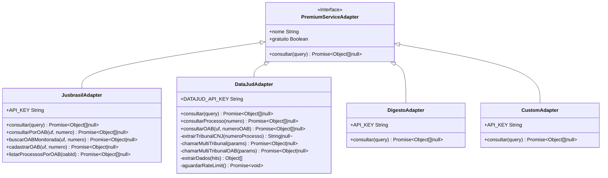

**Diagram sources**
- [services/jusbrasil.js:10-196](file://services/jusbrasil.js#L10-L196)
- [services/datajud.js:10-304](file://services/datajud.js#L10-L304)
- [services/digesto.js:5-24](file://services/digesto.js#L5-L24)
- [services/custom.js:7-25](file://services/custom.js#L7-L25)

Common implementation characteristics:
- **Environment-based configuration**: Uses dedicated API key environment variables
- **Silent failure handling**: Returns null when API key is not configured
- **Standardized query processing**: Accepts string or structured query objects
- **Future-ready architecture**: Contains TODO comments for real endpoint integration

**Section sources**
- [services/jusbrasil.js:10-196](file://services/jusbrasil.js#L10-L196)
- [services/datajud.js:10-304](file://services/datajud.js#L10-L304)
- [services/digesto.js:5-24](file://services/digesto.js#L5-L24)
- [services/custom.js:7-25](file://services/custom.js#L7-L25)

### Enhanced Authentication and Authorization System
The system now supports multi-role access control with comprehensive user management:

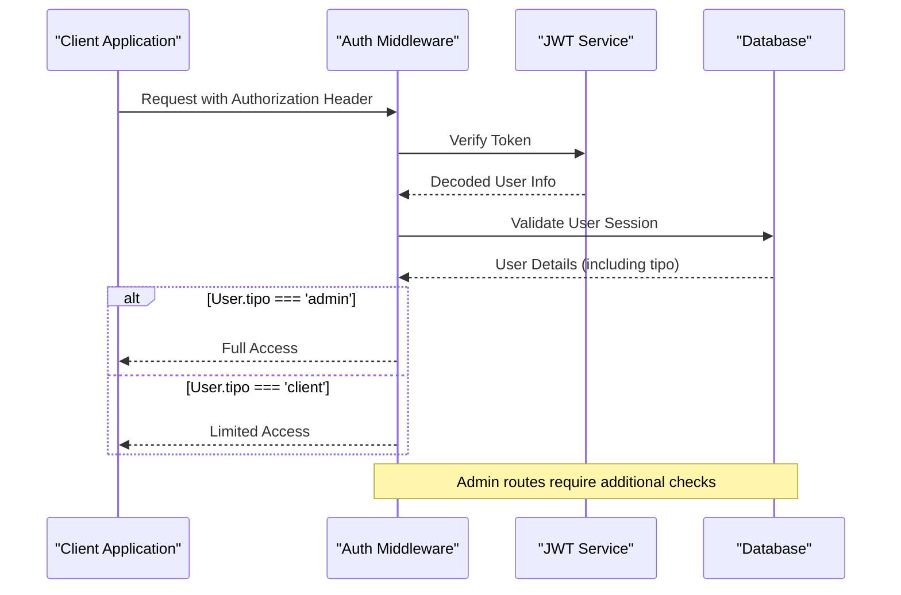

**Diagram sources**
- [auth.js:16-39](file://auth.js#L16-L39)
- [server.js:94-116](file://server.js#L94-L116)

Security features:
- **Role-based access control**: Admin vs client permission differentiation
- **Multi-user support**: Comprehensive user management system
- **Token lifecycle management**: 24-hour expiration with automatic renewal
- **Password security**: Bcrypt-based hashing with salt rounds
- **Session tracking**: Automatic last login timestamps and active status

**Section sources**
- [auth.js:1-59](file://auth.js#L1-L59)
- [server.js:25-326](file://server.js#L25-L326)

### Advanced Background Monitoring System
The worker component now supports multi-tenant operation with enhanced caching:


**Diagram sources**
- [worker.js:17-65](file://worker.js#L17-L65)

Monitoring features:
- **Multi-tenant architecture**: Supports different service modes per user
- **Intelligent caching**: Prevents redundant database queries and bot recreations
- **Mode-aware processing**: Applies appropriate search strategy based on user subscription
- **Status change detection**: Notifies only on meaningful updates
- **Scalable design**: Handles large numbers of users and processes efficiently

**Section sources**
- [worker.js:1-74](file://worker.js#L1-L74)

## Premium Service Ecosystem
The system now supports a comprehensive ecosystem of premium legal database services, each designed for specific legal research needs:

### Service Configuration and Management
Each premium service follows a standardized configuration pattern:

| Service | Environment Variable | Authentication Method | Primary Use Case |
|---------|---------------------|----------------------|------------------|
| Jusbrasil | `JUSBRASIL_API_KEY` | Bearer Token | Comprehensive legal database |
| DataJud | `DATAJUD_API_KEY` | APIKey Header | CNJ DataJud API |
| Digesto | `DIGESTO_API_KEY` | API Key Header | Legislative database |
| Custom | `TJ_API_KEY` | API Key Header | Custom tribunal APIs |

### Integration Architecture
The premium service ecosystem implements a streamlined architecture:

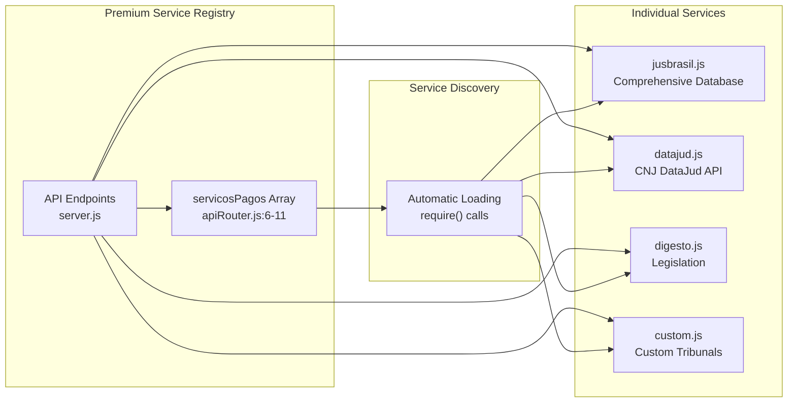

**Diagram sources**
- [apiRouter.js:6-11](file://apiRouter.js#L6-L11)
- [services/jusbrasil.js:1](file://services/jusbrasil.js#L1)
- [services/datajud.js:1](file://services/datajud.js#L1)
- [services/digesto.js:1](file://services/digesto.js#L1)
- [services/custom.js:1](file://services/custom.js#L1)

### Service Integration Guidelines
To add a new premium service provider:

1. **Create service module** in `services/` directory with standardized interface
2. **Implement environment variable configuration** for API key management
3. **Add service to registry** in `apiRouter.js` premium services array
4. **Test integration** with comprehensive error handling
5. **Document service configuration** and usage patterns

**Section sources**
- [apiRouter.js:3-11](file://apiRouter.js#L3-L11)
- [services/jusbrasil.js:1-197](file://services/jusbrasil.js#L1-L197)
- [services/datajud.js:1-305](file://services/datajud.js#L1-L305)
- [services/digesto.js:1-25](file://services/digesto.js#L1-L25)
- [services/custom.js:1-26](file://services/custom.js#L1-L26)

## Multi-Tenant Search Capabilities
The system now supports sophisticated multi-tenant search operations with tenant-aware service selection:

### Tenant Context Management
Each user interaction maintains complete tenant context:

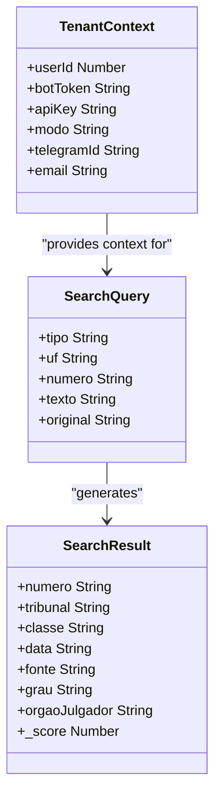

**Diagram sources**
- [apiRouter.js:14-17](file://apiRouter.js#L14-L17)
- [botManager.js:91-97](file://botManager.js#L91-L97)

### Multi-Tenant Service Selection
The system applies tenant-specific service selection logic with Escavador-first priority:

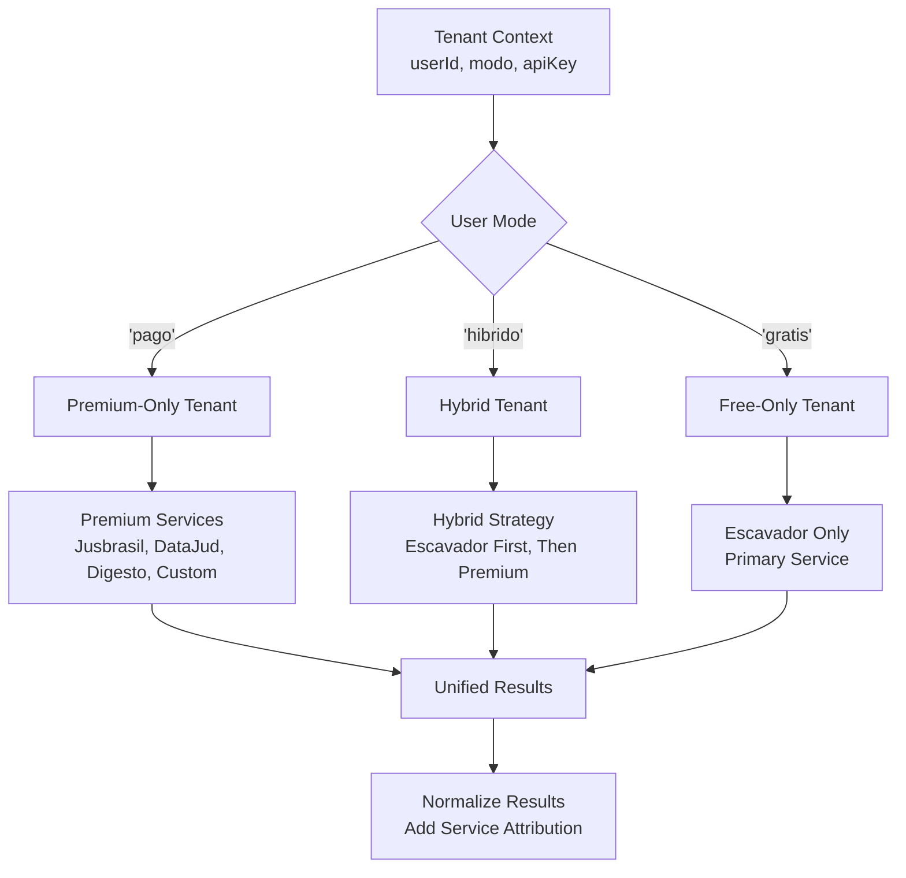

**Diagram sources**
- [apiRouter.js:21-37](file://apiRouter.js#L21-L37)

### Multi-Tenant Monitoring
Background workers operate independently per tenant:

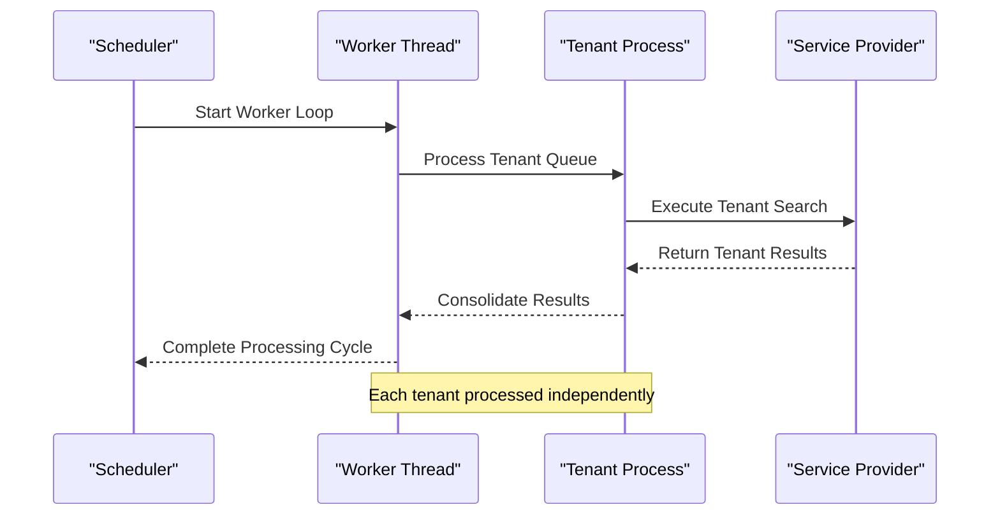

**Diagram sources**
- [worker.js:17-65](file://worker.js#L17-L65)

**Section sources**
- [apiRouter.js:14-37](file://apiRouter.js#L14-L37)
- [worker.js:17-65](file://worker.js#L17-L65)
- [botManager.js:91-146](file://botManager.js#L91-L146)

## Service Adapter Pattern
The system implements a consistent service adapter pattern that enables easy integration of new legal database providers:

### Adapter Interface Specification
All service adapters must implement the following standardized interface:

```javascript
module.exports = {
    nome: 'Service Name',           // Human-readable service name
    gratuito: Boolean,             // Whether service requires payment
    consultar: async function(query) {
        // Process query and return normalized results
        // Return null if service not configured or unavailable
        // Return Array<Object> with standardized fields
    }
};
```

### Standardized Response Format
All service adapters must return results in this consistent format:

| Field | Type | Description | Example |
|-------|------|-------------|---------|
| `numero` | String | Legal case number | "0000000-00.0000.0.00.0000" |
| `tribunal` | String | Court/tribunal name | "Tribunal de Justiça de São Paulo" |
| `classe` | String | Legal class | "Ação Civil" |
| `data` | String | Last update timestamp | "2024-01-15T10:30:00Z" |
| `fonte` | String | Service source attribution | "Escavador" |
| `grau` | String | Court level | "1º Grau" |
| `orgaoJulgador` | String | Court organ | "Vara Cível" |
| `_score` | Number | Search relevance score | null |

### Error Handling and Fallback
Service adapters implement consistent error handling patterns:

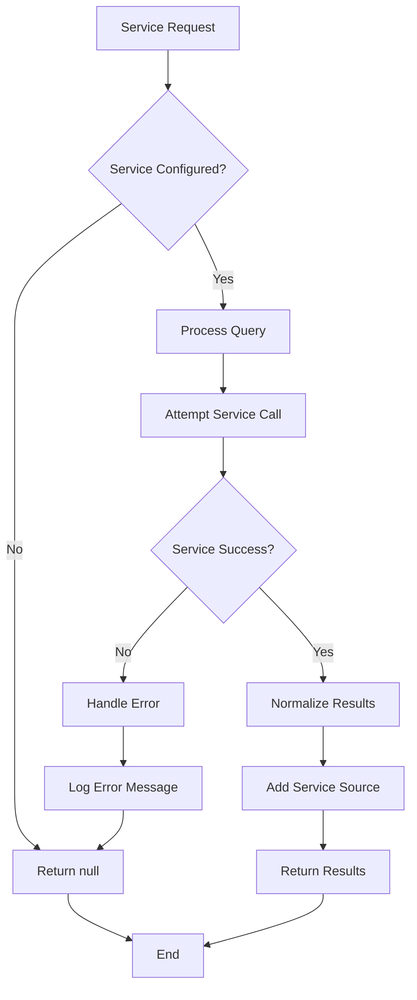

**Diagram sources**
- [services/jusbrasil.js:7-14](file://services/jusbrasil.js#L7-L14)
- [services/datajud.js:80-85](file://services/datajud.js#L80-L85)
- [services/digesto.js:5-7](file://services/digesto.js#L5-L7)
- [services/custom.js:7-9](file://services/custom.js#L7-L9)

**Section sources**
- [services/jusbrasil.js:10-196](file://services/jusbrasil.js#L10-L196)
- [services/datajud.js:10-304](file://services/datajud.js#L10-L304)
- [services/digesto.js:5-24](file://services/digesto.js#L5-L24)
- [services/custom.js:7-25](file://services/custom.js#L7-L25)

## Escavador-First Architecture
**Updated**: The system now implements a comprehensive Escavador-first architecture that prioritizes Escavador as the primary service foundation, with premium services as optional enhancements.

### Escavador-First Priority Strategy
The system follows a strict priority order with Escavador as the foundation:

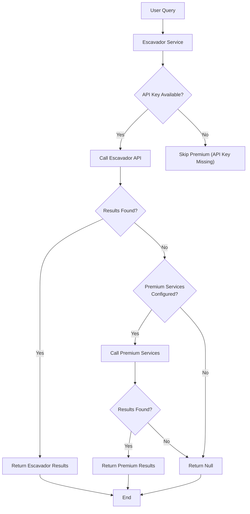

**Diagram sources**
- [apiRouter.js:21-37](file://apiRouter.js#L21-L37)
- [services/escavador.js:11-14](file://services/escavador.js#L11-L14)

### Enhanced Error Handling and User Feedback
The system provides comprehensive error handling and user feedback for Escavador-first operations:

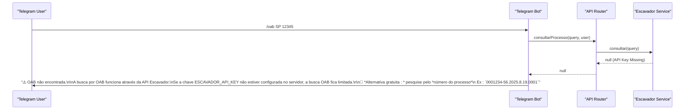

**Diagram sources**
- [botManager.js:111-119](file://botManager.js#L111-L119)
- [services/escavador.js:11-14](file://services/escavador.js#L11-L14)

### Escavador Service Implementation Details
Escavador provides comprehensive legal research platform integration:

#### Dual Search Capabilities
- **OAB Search**: Uses `/envolvido/processos` endpoint with OAB state and number parameters
- **Process Search**: Uses `/processos/{numero}` endpoint for direct CNJ number searches
- **Process linkage**: Returns all CNJ numbers linked to OAB registrations
- **Timeout handling**: Implements 30-second timeout for OAB searches and 15-second timeout for process searches

#### Advanced Response Processing
- **Standardized format**: Converts Escavador responses to unified format with service attribution
- **Field extraction**: Extracts relevant fields like numero, tribunal, classe, data, grau, orgaoJulgador
- **Score handling**: Sets _score to null for Escavador results

**Section sources**
- [apiRouter.js:21-37](file://apiRouter.js#L21-L37)
- [services/escavador.js:10-101](file://services/escavador.js#L10-L101)
- [botManager.js:111-119](file://botManager.js#L111-L119)

## Server-Level API Key Support
**Updated**: Both Jusbrasil and DataJud services now support server-level API key configuration, providing enhanced flexibility for deployment scenarios.

### Server-Level Configuration Benefits
- **Deployment flexibility**: API keys can be configured at server level without user-specific configuration
- **Reduced user complexity**: Users don't need to configure premium service keys
- **Centralized management**: API keys managed in a single location for all users
- **Enhanced reliability**: Server-level keys ensure consistent service availability

### Configuration Priority and Fallback
The system implements a hierarchical configuration approach:

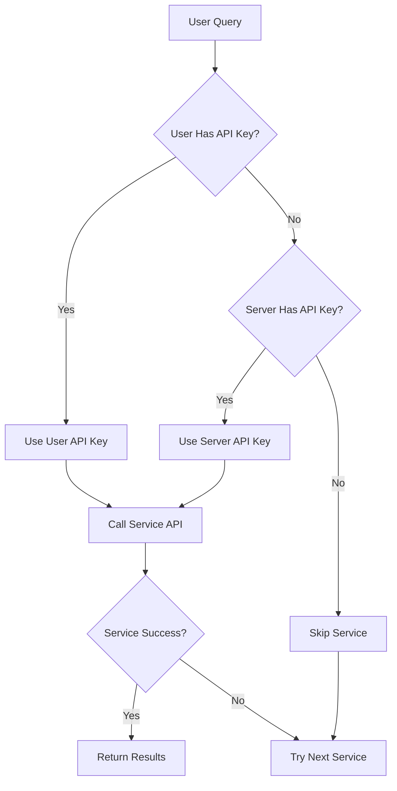

### Service-Specific Implementation
Both Jusbrasil and DataJud services implement the same configuration pattern:

```javascript
// API Key via variável de ambiente: JUSBRASIL_API_KEY  
const API_KEY = process.env.JUSBRASIL_API_KEY || '';
const BASE = 'https://op.digesto.com.br';

// API Key via variável de ambiente: DATAJUD_API_KEY
const DATAJUD_API_KEY = process.env.DATAJUD_API_KEY || '';
console.log(`[DataJud] 🔑 API Key do servidor: ${DATAJUD_API_KEY ? 'SIM ✅' : 'NÃO ❌ — vai falhar 401!'}`);
```

### User Experience Impact
- **Transparent operation**: Users don't need to configure API keys for basic functionality
- **Enhanced reliability**: Server-level keys ensure consistent service availability
- **Reduced support burden**: Fewer user configuration issues related to API keys
- **Backward compatibility**: Existing user configurations continue to work unchanged

**Section sources**
- [services/jusbrasil.js:3-7](file://services/jusbrasil.js#L3-L7)
- [services/datajud.js:3-5](file://services/datajud.js#L3-L5)
- [apiRouter.js:21-37](file://apiRouter.js#L21-L37)

## Dependency Analysis
The system maintains clean dependency relationships with enhanced modularity:

```mermaid
graph LR
subgraph "External Dependencies"
AXIOS["axios"]
JWT["jsonwebtoken"]
BCrypt["bcryptjs"]
PG["pg"]
TELEGRAM["node-telegram-bot-api"]
DOTENV["dotenv"]
ENDPOINT["express"]
ENDPOINT --> AXIOS
ENDPOINT --> JWT
ENDPOINT --> BCrypt
ENDPOINT --> PG
ENDPOINT --> TELEGRAM
ENDPOINT --> DOTENV
end
subgraph "Internal Modules"
API["apiRouter.js"]
ESCAVADOR["services/escavador.js"]
JUSBRASIL["services/jusbrasil.js"]
DATAJUD["services/datajud.js"]
DIGESTO["services/digesto.js"]
CUSTOM["services/custom.js"]
PREMIUM["services/premium.js"]
AUTH["auth.js"]
SERVER["server.js"]
WORKER["worker.js"]
BOT["botManager.js"]
PARSER["parser.js"]
ENDPOINT --> API
API --> ESCAVADOR
API --> JUSBRASIL
API --> DATAJUD
API --> DIGESTO
API --> CUSTOM
SERVER --> AUTH
WORKER --> API
BOT --> API
PARSER --> BOT
SERVER --> PG
WORKER --> PG
BOT --> PG
ESCAVADOR --> AXIOS
JUSBRASIL --> AXIOS
DATAJUD --> AXIOS
AUTH --> JWT
AUTH --> BCrypt
BOT --> TELEGRAM
ENDPOINT --> PARSER
ENDPOINT --> WORKER
ENDPOINT --> BOT
ENDPOINT --> AUTH
ENDPOINT --> SERVER
ENDPOINT --> API
ENDPOINT --> ESCAVADOR
ENDPOINT --> JUSBRASIL
ENDPOINT --> DATAJUD
ENDPOINT --> DIGESTO
ENDPOINT --> CUSTOM
ENDPOINT --> PREMIUM
ENDPOINT --> AUTH
ENDPOINT --> SERVER
ENDPOINT --> WORKER
ENDPOINT --> BOT
ENDPOINT --> PARSER
```

**Diagram sources**
- [package.json:11-19](file://package.json#L11-L19)
- [apiRouter.js:1](file://apiRouter.js#L1)
- [services/escavador.js:1](file://services/escavador.js#L1)
- [services/jusbrasil.js:1](file://services/jusbrasil.js#L1)
- [services/datajud.js:1](file://services/datajud.js#L1)
- [services/digesto.js:1](file://services/digesto.js#L1)
- [services/custom.js:1](file://services/custom.js#L1)
- [services/premium.js:1](file://services/premium.js#L1)
- [auth.js:1-3](file://auth.js#L1-L3)

Dependency characteristics:
- **Modular architecture**: Clear separation between service types with Escavador as primary
- **Environment-based configuration**: All external API keys managed via environment variables
- **Standardized interfaces**: Consistent patterns across all service adapters
- **Extensible design**: Easy addition of new service providers
- **Robust error handling**: Comprehensive error management throughout the system

**Section sources**
- [package.json:11-19](file://package.json#L11-L19)

## Performance Considerations
The system implements comprehensive performance optimization strategies across all service layers:

### Multi-Tenant Caching Strategies
- **Telegram bot instance caching**: Prevents recreation overhead with token-based caching
- **User data caching**: Reduces database queries in worker loops with user ID-based caching
- **Service configuration caching**: Stores API key and mode preferences to minimize lookups
- **Connection pooling**: PostgreSQL connection pooling managed by pg library

### Network Optimization
- **Intelligent rate limiting**: DataJud service implements 400ms delay between requests
- **Exponential backoff**: Handles temporary service unavailability gracefully
- **Concurrent processing**: Worker processes multiple tenants concurrently
- **Batch operations**: Groups database operations where possible
- **Service discovery caching**: Premium services are loaded once and reused

### Resource Management
- **Memory-efficient processing**: No persistent state maintained across requests
- **Graceful shutdown handling**: Process exits cleanly on SIGTERM signals
- **Error isolation**: Service failures don't crash the entire system
- **Connection cleanup**: Automatic cleanup of unused bot instances and database connections

### Multi-Tenant Scalability
- **Independent processing**: Each tenant processed in isolation
- **Resource partitioning**: Memory and CPU resources allocated per tenant
- **Service load balancing**: Premium services distributed across multiple providers
- **Queue-based processing**: Background tasks processed in scheduled intervals

## Troubleshooting Guide

### Common Issues and Solutions

#### Service Configuration Problems
**Problem**: Premium services returning null despite configuration
**Solution**: Verify environment variables are set correctly and accessible to the application
**Prevention**: Implement environment variable validation during startup

#### Authentication Failures
**Problem**: 401 Unauthorized responses from premium services
**Solution**: Verify API key format and expiration; check service-specific authentication requirements
**Detection**: Premium services implement silent failure mode when API key is missing

#### Escavador Service Issues
**Problem**: Escavador service not responding despite configuration
**Solution**: Verify ESCAVADOR_API_KEY environment variable is properly set and exported
**Detection**: Escavador service returns null when API key is missing

#### Rate Limiting Issues
**Problem**: API responses blocked by rate limits
**Solution**: Implement exponential backoff and retry logic; monitor service response codes
**Monitoring**: DataJud service implements comprehensive rate limiting with 400ms delay

#### Multi-Tenant Confusion
**Problem**: Users receiving incorrect service results
**Solution**: Verify user mode settings and service configuration
**Prevention**: Implement tenant context validation in all service calls

#### Database Connection Issues
**Problem**: PostgreSQL connection failures affecting multiple tenants
**Solution**: Implement connection retry and health checks; monitor connection pool statistics
**Monitoring**: Track connection pool statistics and tenant-specific database operations

#### Server-Level API Key Issues
**Problem**: Server-level API keys not taking effect
**Solution**: Verify environment variables are properly exported to the process environment
**Prevention**: Implement server startup validation for critical API keys

### Error Handling Patterns
The system follows consistent error handling patterns across all service layers:
- **Silent failure mode**: Premium services return null when not configured
- **Centralized error logging**: All exceptions are caught and logged with context
- **Graceful degradation**: System continues operating with reduced functionality
- **User-friendly error messages**: API responses provide meaningful error information
- **Service-specific error handling**: Each service implements appropriate error recovery

**Section sources**
- [services/jusbrasil.js:7-14](file://services/jusbrasil.js#L7-L14)
- [services/datajud.js:80-85](file://services/datajud.js#L80-L85)
- [services/digesto.js:5-7](file://services/digesto.js#L5-L7)
- [services/custom.js:7-9](file://services/custom.js#L7-L9)
- [services/escavador.js:11-14](file://services/escavador.js#L11-L14)

## Conclusion
The API integration layer now provides a comprehensive, streamlined foundation for judicial process monitoring with Escavador as the primary service foundation. The enhanced tiered access strategy supports three distinct service modes: free Escavador service, premium paid services, and hybrid mode combining both approaches. The modular architecture allows for easy integration of additional legal database providers while maintaining consistent behavior and error handling.

**Updated**: The new Escavador-first architecture significantly improves reliability and user experience by prioritizing the most comprehensive legal research platform as the primary service foundation. The simplified service selection logic (Escavador → Premium) with server-level API key support enhances deployment flexibility and reduces user configuration complexity. The priority-based approach ensures maximum success rates for searches while providing comprehensive error handling and user feedback.

The system's design emphasizes reliability, performance, scalability, and maintainability, making it suitable for enterprise-level legal database integration with support for multiple service providers and tenant contexts.

## Appendices

### API Response Schemas
Unified response format for all service providers:
- `numero`: Process number (string)
- `tribunal`: Court/tribunal name (string)
- `classe`: Legal class (string or null)
- `data`: Last update timestamp (ISO string)
- `fonte`: Service source attribution (string)
- `grau`: Court level (string or null)
- `orgaoJulgador`: Court organ (string or null)
- `_score`: Search relevance score (number or null)

### Service Integration Guidelines
To add a new external API provider:
1. Create a new service adapter in `services/` directory following the standardized interface
2. Implement environment variable configuration for API key management
3. Add the new service to the premium services registry in `apiRouter.js`
4. Test error handling and fallback logic thoroughly
5. Update documentation and examples with service-specific configuration details
6. Implement proper logging and monitoring for the new service

### Configuration Requirements
- **Environment variables**: `JWT_SECRET`, `PORT`, individual service API keys
- **Database**: PostgreSQL with configured credentials and migration support
- **External APIs**: Escavador API, premium API credentials for each service
- **Telegram**: Bot tokens and webhook configurations for multi-tenant operation
- **Service keys**: Individual API keys for each premium service provider
- **Server-level keys**: Optional server-level API keys for enhanced reliability

### Multi-Tenant Deployment Considerations
- **Tenant isolation**: Ensure proper separation between tenant contexts
- **Resource allocation**: Monitor memory and CPU usage per tenant
- **Service scaling**: Configure appropriate scaling for premium service providers
- **Monitoring**: Implement tenant-specific metrics and alerting
- **Security**: Maintain proper access controls and data isolation between tenants
- **API key management**: Implement hierarchical configuration for optimal reliability