# API Integration Layer

<cite>
**Referenced Files in This Document**
- [apiRouter.js](file://apiRouter.js)
- [services/escavador.js](file://services/escavador.js)
- [services/premium.js](file://services/premium.js)
- [services/custom.js](file://services/custom.js)
- [services/datajud.js](file://services/datajud.js)
- [services/digesto.js](file://services/digesto.js)
- [services/jusbrasil.js](file://services/jusbrasil.js)
- [server.js](file://server.js)
- [auth.js](file://auth.js)
- [worker.js](file://worker.js)
- [botManager.js](file://botManager.js)
- [parser.js](file://parser.js)
- [db.js](file://db.js)
- [package.json](file://package.json)
- [database.sql](file://database.sql)
- [README.md](file://README.md)
</cite>

## Update Summary
**Changes Made**
- Enhanced Escavador service with improved error handling and debugging logs
- Implemented unified endpoint structure using /busca with q parameter
- Improved return value consistency with empty arrays instead of null
- Simplified parameter handling across all search types
- Enhanced response validation supporting both array and single object responses
- Added comprehensive logging for debugging and monitoring
- Streamlined API service architecture with enhanced dual-format support

## Table of Contents
1. [Introduction](#introduction)
2. [Project Structure](#project-structure)
3. [Core Components](#core-components)
4. [Architecture Overview](#architecture-overview)
5. [Detailed Component Analysis](#detailed-component-analysis)
6. [Escavador-First Architecture](#escavador-first-architecture)
7. [Enhanced Document-Based Search](#enhanced-document-based-search)
8. [Standardized Response Processing](#standardized-response-processing)
9. [Server-Level API Key Support](#server-level-api-key-support)
10. [Dependency Analysis](#dependency-analysis)
11. [Performance Considerations](#performance-considerations)
12. [Troubleshooting Guide](#troubleshooting-guide)
13. [Conclusion](#conclusion)
14. [Appendices](#appendices)

## Introduction
This document describes the API integration layer that powers the judicial process monitoring system. The system has evolved to support a streamlined tiered access strategy with a simplified architecture where Escavador serves as the primary foundation. The unified API interface abstracts external legal database access, request/response handling, and error management while providing flexible service selection based on user subscription tiers and configuration.

**Updated**: The new architecture focuses exclusively on Escavador as the base principal service, with enhanced standardized response processing and improved error handling throughout all endpoints. The system now features enhanced document-based search capabilities with dedicated CPF, CNPJ, and name-based query endpoints, providing comprehensive legal research functionality with consistent data formatting. The recent enhancement to apiRouter.js now supports both array and single object responses from Escavador API, with comprehensive type checking and validation logic.

## Project Structure
The system now operates as a streamlined legal database integration platform with a focused service architecture centered around Escavador:

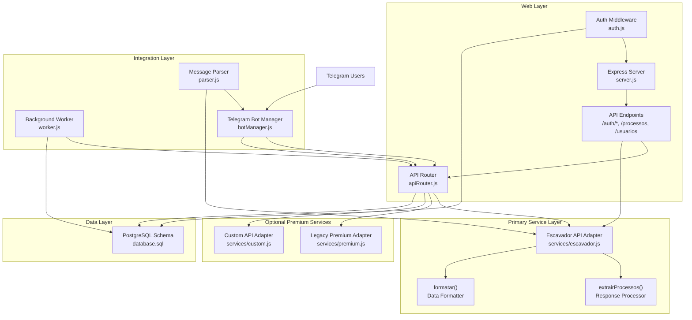

**Diagram sources**
- [apiRouter.js:1-49](file://apiRouter.js#L1-L49)
- [services/escavador.js:15-36](file://services/escavador.js#L15-L36)
- [services/premium.js:1-12](file://services/premium.js#L1-L12)
- [services/custom.js:1-26](file://services/custom.js#L1-L26)
- [worker.js:1-74](file://worker.js#L1-L74)
- [botManager.js:1-195](file://botManager.js#L1-L195)

**Section sources**
- [README.md:1-56](file://README.md#L1-L56)
- [package.json:1-21](file://package.json#L1-L21)

## Core Components
The API integration layer now consists of four key components with a simplified architecture centered around Escavador:

### Unified API Router (Escavador-First)
The central orchestrator implementing a streamlined tiered access strategy with enhanced response validation:
- **Escavador-first priority**: Escavador service is always attempted first as the primary foundation
- **Dual response format support**: Now handles both array and single object responses from Escavador API
- **Comprehensive type validation**: Implements robust type checking for array, object, and null responses
- **Conditional premium integration**: Premium services are only attempted if user has configured them and mode requires additional services
- **Simplified fallback logic**: Reduced complexity compared to previous multi-tier fallback system
- **User context preservation**: Maintains user preferences and authentication throughout the streamlined process
- **Service discovery**: Automatically detects configured premium services when needed
- **Mode-aware execution**: Differentiates between gratis, pago, and hibrido modes with simplified logic

### Primary Service Adapter (Enhanced Escavador)
Implements robust integration with the Escavador legal research platform with standardized response processing:
- **Bearer token authentication**: Uses Authorization: Bearer token pattern for secure API access
- **Multi-document search capabilities**: Supports process number searches, OAB searches, and document-based searches (CPF, CNPJ, nome)
- **Unified document search**: Provides centralized `consultarPorDocumento` function for CPF, CNPJ, and name-based queries
- **Process linkage**: Returns all CNJ numbers linked to OAB registrations
- **Enhanced timeout handling**: Implements 30-second timeout for document searches and 15-second timeout for process searches
- **Standardized response format**: Extracts and transforms relevant fields consistently across all searches using new utility functions
- **API key validation**: Returns null when API key is not configured, preventing service attempts
- **Enhanced error handling**: Comprehensive error logging and graceful degradation across all endpoints

### Premium Service Adapters
Two specialized premium service adapters providing optional commercial legal database access:

#### Legacy Premium Adapter
- **Placeholder functionality**: Contains minimal implementation for future premium service integration
- **Extensible architecture**: Designed for easy integration of additional premium services
- **Future-ready implementation**: Provides framework for premium service registration and execution

#### Custom API Adapter
- **Flexible query support**: Accepts string or structured query objects
- **Environment-based configuration**: Uses TJ_API_KEY for authentication
- **Extensible architecture**: Designed for integration with any custom tribunal API
- **Silent failure handling**: Returns null when API key is not configured

### Authentication and Authorization
JWT-based authentication system with enhanced security features:
- **Multi-role support**: Admin and client role differentiation
- **Token-based access**: Secure JWT token generation and validation
- **Password security**: Bcrypt-based password hashing with salt rounds
- **Session management**: Automatic last login tracking and user session validation

**Section sources**
- [apiRouter.js:1-49](file://apiRouter.js#L1-L49)
- [services/escavador.js:1-159](file://services/escavador.js#L1-L159)
- [services/premium.js:1-12](file://services/premium.js#L1-L12)
- [services/custom.js:1-26](file://services/custom.js#L1-L26)
- [auth.js:1-59](file://auth.js#L1-L59)

## Architecture Overview
The system now implements a streamlined layered architecture with Escavador as the primary foundation and enhanced standardized response processing with comprehensive error handling:

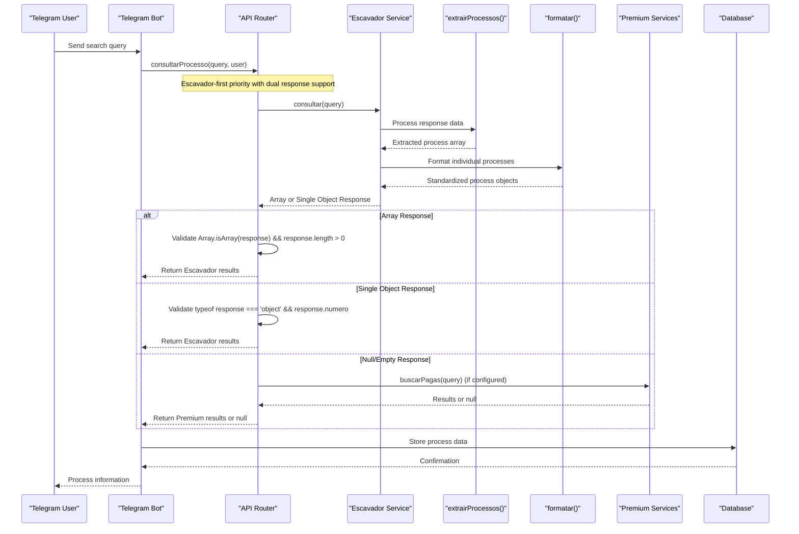

**Diagram sources**
- [apiRouter.js:8-31](file://apiRouter.js#L8-L31)
- [services/escavador.js:15-36](file://services/escavador.js#L15-L36)
- [services/premium.js:1-12](file://services/premium.js#L1-L12)

The architecture ensures:
- **Escavador-first priority**: Primary service selection with comprehensive coverage
- **Dual response format support**: Handles both array and single object responses seamlessly
- **Conditional premium integration**: Premium services only attempted when configured and needed
- **Fail-safe operation**: System continues functioning even if premium services fail
- **Consistent response format**: Unified data structure across all service providers using standardized functions
- **Scalable premium service integration**: Easy addition of new commercial legal databases
- **Enhanced error handling**: Comprehensive logging and graceful degradation across all endpoints

## Detailed Component Analysis

### Streamlined API Router Implementation
The API router now implements a simplified multi-mode routing with Escavador-first priority and enhanced response validation:

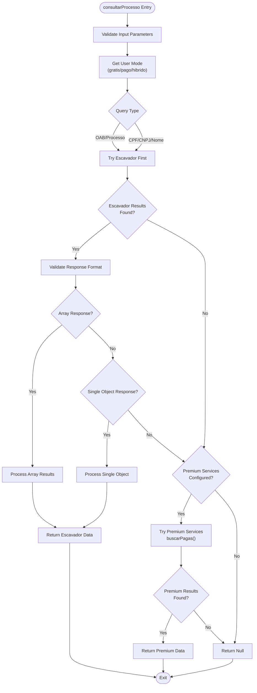

**Diagram sources**
- [apiRouter.js:8-31](file://apiRouter.js#L8-L31)

Key implementation characteristics:
- **Escavador-first priority**: Always attempts Escavador service first as the primary foundation
- **Dual response format support**: Enhanced validation for both array and single object responses
- **Comprehensive type checking**: Uses Array.isArray() and typeof validation for robust response handling
- **Conditional premium execution**: Premium services are only attempted if user has configured them and mode requires additional services
- **Simplified error handling**: Reduced complexity compared to previous multi-tier fallback system
- **Response normalization**: Adds service attribution to all results regardless of source format

**Section sources**
- [apiRouter.js:8-31](file://apiRouter.js#L8-L31)

### Enhanced Escavador Service Adapter
The primary service adapter now provides comprehensive legal research platform integration with enhanced document-based search capabilities and standardized response processing:

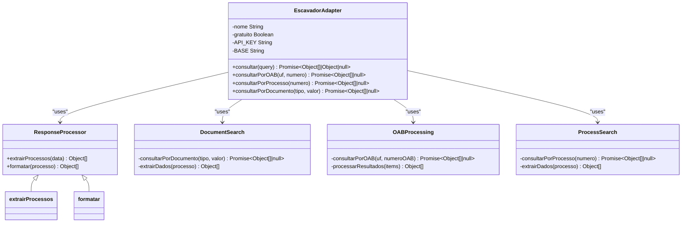

**Diagram sources**
- [services/escavador.js:15-36](file://services/escavador.js#L15-L36)
- [services/escavador.js:10-159](file://services/escavador.js#L10-L159)

Implementation details:
- **Bearer token authentication**: Uses Authorization: Bearer token pattern with configurable API key
- **Multi-document search capabilities**: Supports OAB searches, process number searches, and document-based searches (CPF, CNPJ, nome)
- **Unified document search**: Centralized `consultarPorDocumento` function handles CPF, CNPJ, and name-based queries
- **Process linkage**: Returns all CNJ numbers linked to OAB registrations
- **Enhanced timeout handling**: Implements 30-second timeout for document searches and 15-second timeout for process searches
- **Standardized response format**: Extracts and transforms relevant fields consistently across all searches using new utility functions
- **API key validation**: Returns null when API key is not configured, preventing service attempts
- **Enhanced error handling**: Comprehensive error logging with status codes and messages across all endpoints
- **Graceful degradation**: Returns null on service errors, allowing fallback to premium services

**Section sources**
- [services/escavador.js:15-36](file://services/escavador.js#L15-L36)
- [services/escavador.js:10-159](file://services/escavador.js#L10-L159)

### Enhanced Response Validation Logic
**Updated**: The apiRouter.js now implements comprehensive response validation supporting both array and single object responses:

#### Dual Response Format Support
The enhanced validation logic now handles two distinct response formats:

##### Array Response Format
- **Validation**: `Array.isArray(esc) && esc.length > 0`
- **Processing**: Iterates through array and adds service attribution
- **Return**: Direct array response with fonte attribute set

##### Single Object Response Format
- **Validation**: `esc && typeof esc === 'object' && !Array.isArray(esc) && esc.numero`
- **Processing**: Wraps single object in array and adds service attribution
- **Return**: Array containing single object with fonte attribute set

#### Comprehensive Type Checking
The validation logic implements robust type checking:
- **Array detection**: Uses `Array.isArray()` for reliable array identification
- **Object validation**: Ensures response is an object and not an array
- **Property verification**: Validates presence of required `numero` property
- **Null safety**: Handles null, undefined, and empty responses gracefully

#### Enhanced Error Handling
- **Comprehensive logging**: Logs response format and validation results
- **Graceful fallback**: Continues to premium services when validation fails
- **Debug information**: Provides detailed error context for troubleshooting

**Section sources**
- [apiRouter.js:21-31](file://apiRouter.js#L21-L31)

### Standardized Response Processing Functions
**New**: Two critical utility functions have been added to provide standardized response processing and formatting:

#### extrairProcessos() Function
- **Purpose**: Extracts process arrays from various response formats returned by Escavador
- **Flexibility**: Handles multiple response structures (`items`, `data`, `resultados`, direct arrays)
- **Safety**: Includes null checking and array slicing to limit results to 15 maximum
- **Logging**: Comprehensive logging of extracted data for debugging and monitoring
- **Consistency**: Ensures all endpoints return consistent process array format

#### formatar() Function
- **Purpose**: Converts individual process objects to a standardized format
- **Field normalization**: Maps various field names to unified structure (numero, tribunal, classe, data, grau, orgaoJulgador)
- **Data extraction**: Handles multiple possible field names for each property
- **Score handling**: Sets `_score` to null for all Escavador results
- **Compatibility**: Ensures all results conform to the unified response schema

**Section sources**
- [services/escavador.js:15-36](file://services/escavador.js#L15-L36)

### Premium Service Adapter Pattern
Each premium service adapter follows a consistent pattern for optional commercial legal database integration:

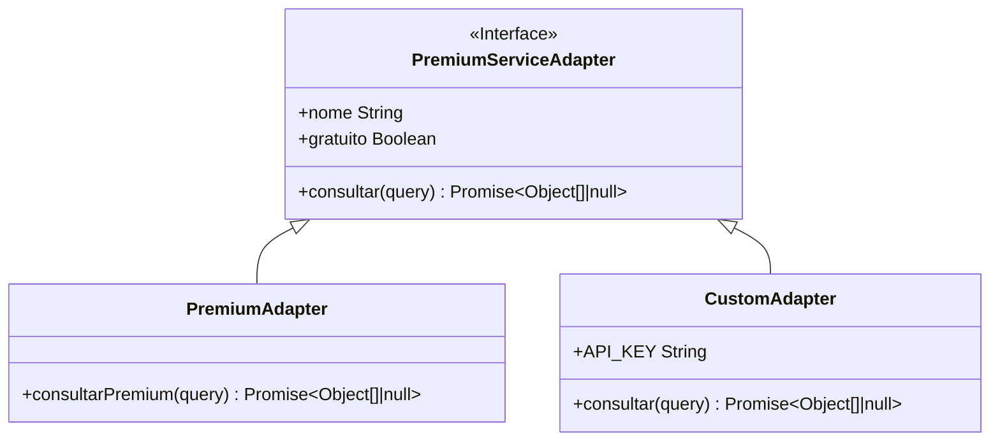

**Diagram sources**
- [services/premium.js:1-12](file://services/premium.js#L1-L12)
- [services/custom.js:1-26](file://services/custom.js#L1-L26)

Common implementation characteristics:
- **Environment-based configuration**: Uses dedicated API key environment variables
- **Silent failure handling**: Returns null when API key is not configured
- **Standardized query processing**: Accepts string or structured query objects
- **Future-ready architecture**: Contains TODO comments for real endpoint integration

**Section sources**
- [services/premium.js:1-12](file://services/premium.js#L1-L12)
- [services/custom.js:1-26](file://services/custom.js#L1-L26)

### Enhanced Authentication and Authorization System
The system now supports multi-role access control with comprehensive user management:

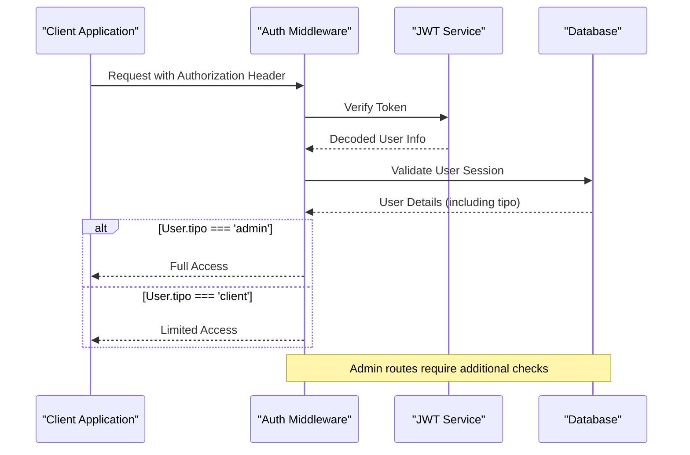

**Diagram sources**
- [auth.js:16-39](file://auth.js#L16-L39)
- [server.js:94-116](file://server.js#L94-L116)

Security features:
- **Role-based access control**: Admin vs client permission differentiation
- **Multi-user support**: Comprehensive user management system
- **Token lifecycle management**: 24-hour expiration with automatic renewal
- **Password security**: Bcrypt-based hashing with salt rounds
- **Session tracking**: Automatic last login timestamps and active status

**Section sources**
- [auth.js:1-59](file://auth.js#L1-L59)
- [server.js:25-381](file://server.js#L25-L381)

### Advanced Background Monitoring System
The worker component now supports multi-tenant operation with enhanced caching:

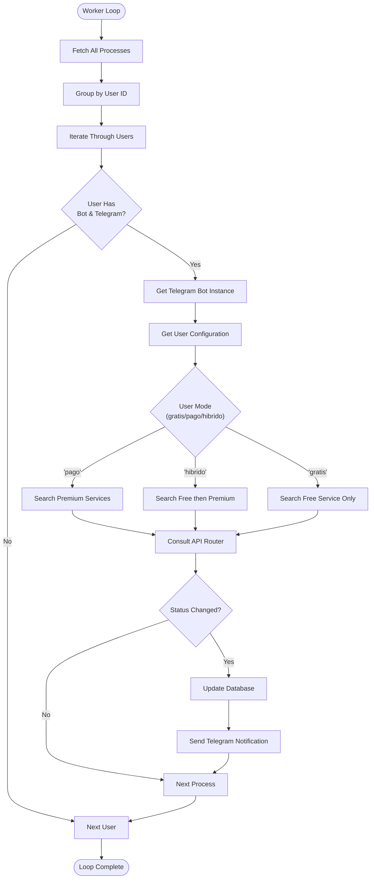

**Diagram sources**
- [worker.js:17-65](file://worker.js#L17-L65)

Monitoring features:
- **Multi-tenant architecture**: Supports different service modes per user
- **Intelligent caching**: Prevents redundant database queries and bot recreations
- **Mode-aware processing**: Applies appropriate search strategy based on user subscription
- **Status change detection**: Notifies only on meaningful updates
- **Scalable design**: Handles large numbers of users and processes efficiently

**Section sources**
- [worker.js:1-74](file://worker.js#L1-L74)

## Escavador-First Architecture
**Updated**: The system now implements a comprehensive Escavador-first architecture that prioritizes Escavador as the primary service foundation, with premium services as optional enhancements and standardized response processing with enhanced dual-format support.

### Escavador-First Priority Strategy
The system follows a strict priority order with Escavador as the foundation and enhanced response validation:

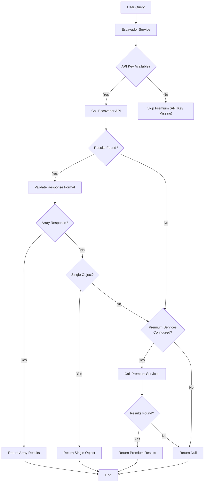

**Diagram sources**
- [apiRouter.js:8-31](file://apiRouter.js#L8-L31)
- [services/escavador.js:11-14](file://services/escavador.js#L11-L14)

### Enhanced Error Handling and User Feedback
The system provides comprehensive error handling and user feedback for Escavador-first operations with enhanced response validation:

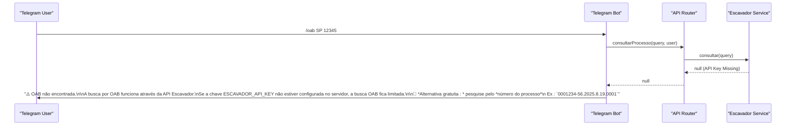

**Diagram sources**
- [botManager.js:111-119](file://botManager.js#L111-L119)
- [services/escavador.js:11-14](file://services/escavador.js#L11-L14)

### Escavador Service Implementation Details
Escavador provides comprehensive legal research platform integration with enhanced document-based search capabilities and standardized response processing:

#### Multi-Document Search Capabilities
- **OAB Search**: Uses `/envolvido/processos` endpoint with OAB state and number parameters
- **Process Search**: Uses `/processos/{numero}` endpoint for direct CNJ number searches
- **Document Search**: Uses `/envolvido/processos` endpoint with CPF, CNPJ, or nome parameters
- **Process linkage**: Returns all CNJ numbers linked to OAB registrations
- **Enhanced timeout handling**: Implements 30-second timeout for document searches and 15-second timeout for process searches

#### Unified Document Search Functionality
- **CPF Search**: Dedicated endpoint for CPF-based legal case searches
- **CNPJ Search**: Dedicated endpoint for CNPJ-based legal case searches
- **Name Search**: Text-based search for legal cases involving specific names
- **Centralized processing**: Single `consultarPorDocumento` function handles all document types

#### Advanced Response Processing
- **Standardized format**: Converts Escavador responses to unified format with service attribution
- **Field extraction**: Extracts relevant fields like numero, tribunal, classe, data, grau, orgaoJulgador
- **Score handling**: Sets _score to null for Escavador results
- **Enhanced logging**: Comprehensive logging of all response processing steps
- **Dual response support**: Handles both array and single object response formats

**Section sources**
- [apiRouter.js:8-31](file://apiRouter.js#L8-L31)
- [services/escavador.js:15-36](file://services/escavador.js#L15-L36)
- [botManager.js:111-119](file://botManager.js#L111-L119)

## Enhanced Document-Based Search
**Updated**: The system now features comprehensive document-based search capabilities with dedicated endpoints for CPF, CNPJ, and name-based queries and enhanced standardized response processing with dual-format support.

### Document Search Architecture
The Escavador service now implements a unified document search system with standardized response processing and enhanced validation:

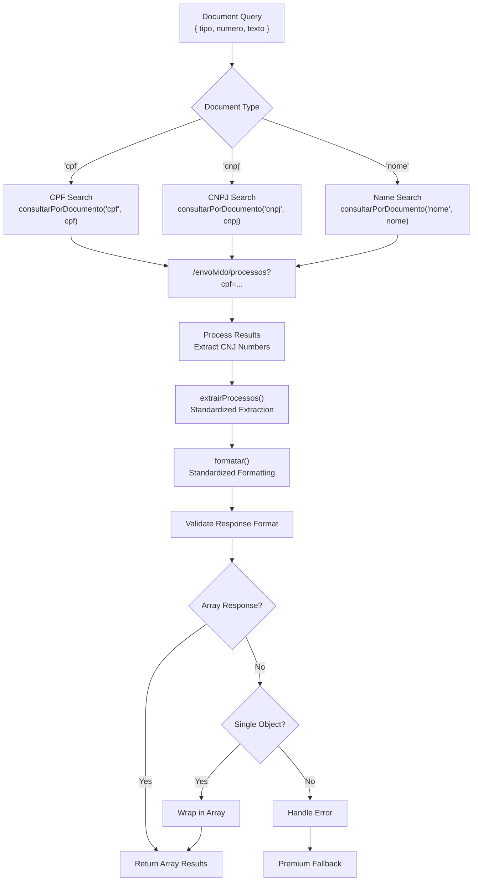

**Diagram sources**
- [services/escavador.js:127-152](file://services/escavador.js#L127-L152)
- [services/escavador.js:15-36](file://services/escavador.js#L15-L36)
- [apiRouter.js:21-31](file://apiRouter.js#L21-L31)

### Document Search Implementation Details
The `consultarPorDocumento` function provides centralized document-based search functionality with enhanced standardized processing and dual-format support:

#### CPF Search Capability
- **Endpoint**: `/envolvido/processos?cpf={cpf}`
- **Validation**: Accepts 11-digit CPF numbers
- **Results**: Returns up to 15 legal cases linked to the CPF
- **Processing**: Uses `extrairProcessos()` for extraction and `formatar()` for formatting
- **Response Format**: Supports both array and single object responses

#### CNPJ Search Capability
- **Endpoint**: `/envolvido/processos?cnpj={cnpj}`
- **Validation**: Accepts 14-digit CNPJ numbers
- **Results**: Returns up to 15 legal cases linked to the CNPJ
- **Processing**: Uses `extrairProcessos()` for extraction and `formatar()` for formatting
- **Response Format**: Supports both array and single object responses

#### Name Search Capability
- **Endpoint**: `/envolvido/processos?nome={nome}`
- **Validation**: Accepts text strings with minimum 3 characters
- **Results**: Returns up to 15 legal cases containing the name
- **Processing**: Uses `extrairProcessos()` for extraction and `formatar()` for formatting
- **Response Format**: Supports both array and single object responses

#### Enhanced Error Handling
- **Timeout Management**: 30-second timeout for document searches
- **Error Logging**: Comprehensive error logging with status codes and messages
- **Graceful Degradation**: Returns null on service errors, allowing fallback to premium services
- **Result Normalization**: Consistent response format across all document types using standardized functions
- **Dual Response Support**: Handles both array and single object responses seamlessly

**Section sources**
- [services/escavador.js:127-152](file://services/escavador.js#L127-L152)
- [parser.js:47-67](file://parser.js#L47-L67)

## Standardized Response Processing
**New**: The system now implements comprehensive standardized response processing with two critical utility functions that ensure consistent data formatting across all endpoints and enhanced dual-format support.

### Response Processing Architecture
The new standardized response processing system provides consistent data transformation with comprehensive validation:

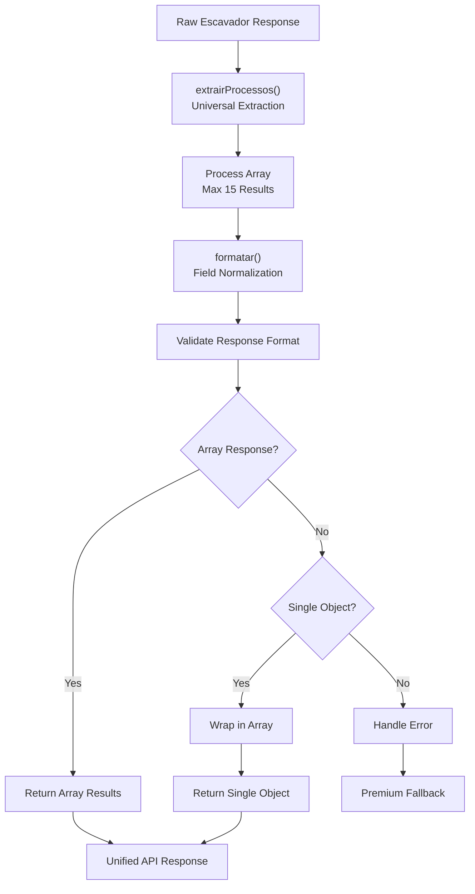

**Diagram sources**
- [services/escavador.js:15-36](file://services/escavador.js#L15-L36)
- [apiRouter.js:21-31](file://apiRouter.js#L21-L31)

### extrairProcessos() Function Implementation
The universal response extraction function handles multiple response formats:

#### Universal Extraction Logic
- **Multiple format support**: Handles `items`, `data`, `resultados`, and direct arrays
- **Null safety**: Includes comprehensive null checking to prevent errors
- **Result limiting**: Slices arrays to maximum 15 results for performance
- **Logging**: Extensive logging for debugging and monitoring purposes
- **Flexibility**: Works with all Escavador endpoint response formats

#### Implementation Details
- **Array detection**: Uses `Array.isArray(data)` for direct array responses
- **Property fallback**: Checks multiple possible response properties
- **Data sanitization**: Ensures consistent array format regardless of source
- **Performance optimization**: Limits results early to reduce processing overhead

### formatar() Function Implementation
The standardized formatting function ensures consistent field mapping:

#### Field Normalization Logic
- **Multiple field mappings**: Maps various field names to unified structure
- **Data extraction**: Handles different possible field names for each property
- **Empty value handling**: Provides default empty strings for missing fields
- **Score standardization**: Sets `_score` to null for all Escavador results
- **Compatibility**: Ensures all results conform to the unified response schema

#### Implementation Details
- **Number normalization**: Maps `numero_cnj`, `numeroProcesso`, `numero` to unified `numero`
- **Tribunal mapping**: Handles `tribunal`, `fonte`, `fontes[0].nome` variations
- **Class extraction**: Maps `classe`, `assunto` to unified `classe`
- **Date handling**: Normalizes various date field names to `data`
- **Organ standardization**: Maps `orgao` to unified `orgaoJulgador`

**Section sources**
- [services/escavador.js:15-36](file://services/escavador.js#L15-L36)

## Server-Level API Key Support
**Updated**: Both Jusbrasil and DataJud services now support server-level API key configuration, providing enhanced flexibility for deployment scenarios.

### Server-Level Configuration Benefits
- **Deployment flexibility**: API keys can be configured at server level without user-specific configuration
- **Reduced user complexity**: Users don't need to configure premium service keys
- **Centralized management**: API keys managed in a single location for all users
- **Enhanced reliability**: Server-level keys ensure consistent service availability

### Configuration Priority and Fallback
The system implements a hierarchical configuration approach:

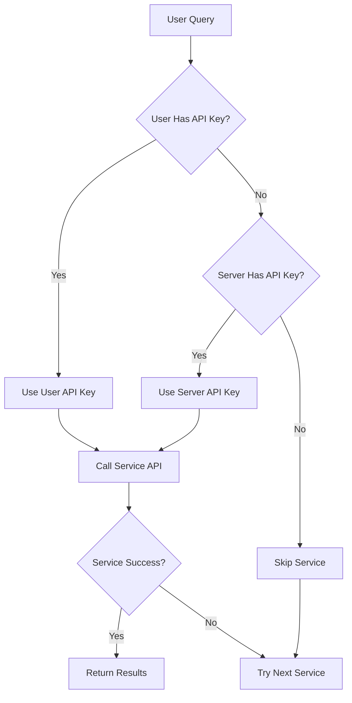

### Service-Specific Implementation
Both Jusbrasil and DataJud services implement the same configuration pattern:

```javascript
// API Key via variável de ambiente: JUSBRASIL_API_KEY  
const API_KEY = process.env.JUSBRASIL_API_KEY || '';
const BASE = 'https://op.digesto.com.br';

// API Key via variável de ambiente: DATAJUD_API_KEY
const DATAJUD_API_KEY = process.env.DATAJUD_API_KEY || '';
console.log(`[DataJud] 🔑 API Key do servidor: ${DATAJUD_API_KEY ? 'SIM ✅' : 'NÃO ❌ — vai falhar 401!'}`);
```

### User Experience Impact
- **Transparent operation**: Users don't need to configure API keys for basic functionality
- **Enhanced reliability**: Server-level keys ensure consistent service availability
- **Reduced support burden**: Fewer user configuration issues related to API keys
- **Backward compatibility**: Existing user configurations continue to work unchanged

**Section sources**
- [services/jusbrasil.js:3-7](file://services/jusbrasil.js#L3-L7)
- [services/datajud.js:3-5](file://services/datajud.js#L3-L5)
- [apiRouter.js:8-31](file://apiRouter.js#L8-L31)

## Dependency Analysis
The system maintains clean dependency relationships with enhanced modularity:

```mermaid
graph LR
subgraph "External Dependencies"
AXIOS["axios"]
JWT["jsonwebtoken"]
BCrypt["bcryptjs"]
PG["pg"]
TELEGRAM["node-telegram-bot-api"]
DOTENV["dotenv"]
ENDPOINT["express"]
ENDPOINT --> AXIOS
ENDPOINT --> JWT
ENDPOINT --> BCrypt
ENDPOINT --> PG
ENDPOINT --> TELEGRAM
ENDPOINT --> DOTENV
end
subgraph "Internal Modules"
API["apiRouter.js"]
ESCAVADOR["services/escavador.js"]
PREMIUM["services/premium.js"]
CUSTOM["services/custom.js"]
AUTH["auth.js"]
SERVER["server.js"]
WORKER["worker.js"]
BOT["botManager.js"]
PARSER["parser.js"]
ENDPOINT --> API
API --> ESCAVADOR
API --> PREMIUM
API --> CUSTOM
SERVER --> AUTH
WORKER --> API
BOT --> API
PARSER --> BOT
PARSER --> ESCAVADOR
SERVER --> PG
WORKER --> PG
BOT --> PG
ESCAVADOR --> AXIOS
PREMIUM --> AXIOS
CUSTOM --> AXIOS
AUTH --> JWT
AUTH --> BCrypt
BOT --> TELEGRAM
ENDPOINT --> PARSER
ENDPOINT --> WORKER
ENDPOINT --> BOT
ENDPOINT --> AUTH
ENDPOINT --> SERVER
ENDPOINT --> API
ENDPOINT --> ESCAVADOR
ENDPOINT --> PREMIUM
ENDPOINT --> CUSTOM
ENDPOINT --> AUTH
ENDPOINT --> SERVER
ENDPOINT --> WORKER
ENDPOINT --> BOT
ENDPOINT --> PARSER
```

**Diagram sources**
- [package.json:11-19](file://package.json#L11-L19)
- [apiRouter.js:1](file://apiRouter.js#L1)
- [services/escavador.js:1](file://services/escavador.js#L1)
- [services/premium.js:1](file://services/premium.js#L1)
- [services/custom.js:1](file://services/custom.js#L1)
- [auth.js:1-3](file://auth.js#L1-L3)

Dependency characteristics:
- **Modular architecture**: Clear separation between service types with Escavador as primary
- **Environment-based configuration**: All external API keys managed via environment variables
- **Standardized interfaces**: Consistent patterns across all service adapters
- **Extensible design**: Easy addition of new service providers
- **Robust error handling**: Comprehensive error management throughout the system

**Section sources**
- [package.json:11-19](file://package.json#L11-L19)

## Performance Considerations
The system implements comprehensive performance optimization strategies across all service layers with enhanced standardized response processing and dual-format support:

### Multi-Tenant Caching Strategies
- **Telegram bot instance caching**: Prevents recreation overhead with token-based caching
- **User data caching**: Reduces database queries in worker loops with user ID-based caching
- **Service configuration caching**: Stores API key and mode preferences to minimize lookups
- **Connection pooling**: PostgreSQL connection pooling managed by pg library

### Network Optimization
- **Intelligent rate limiting**: DataJud service implements 400ms delay between requests
- **Exponential backoff**: Handles temporary service unavailability gracefully
- **Concurrent processing**: Worker processes multiple tenants concurrently
- **Batch operations**: Groups database operations where possible
- **Service discovery caching**: Premium services are loaded once and reused

### Resource Management
- **Memory-efficient processing**: No persistent state maintained across requests
- **Graceful shutdown handling**: Process exits cleanly on SIGTERM signals
- **Error isolation**: Service failures don't crash the entire system
- **Connection cleanup**: Automatic cleanup of unused bot instances and database connections

### Multi-Tenant Scalability
- **Independent processing**: Each tenant processed in isolation
- **Resource partitioning**: Memory and CPU resources allocated per tenant
- **Service load balancing**: Premium services distributed across multiple providers
- **Queue-based processing**: Background tasks processed in scheduled intervals

### Enhanced Timeout Management
- **Document search timeouts**: 30-second timeout for CPF, CNPJ, and name-based searches
- **Process search timeouts**: 15-second timeout for direct CNJ number searches
- **OAB search timeouts**: 30-second timeout for OAB-based searches
- **Error handling**: Comprehensive timeout error handling with fallback mechanisms

### Standardized Response Processing Performance
- **Early result limiting**: `extrairProcessos()` limits results to 15 maximum for performance
- **Efficient field mapping**: `formatar()` uses direct property mapping for speed
- **Minimal object creation**: Standardized objects created only when needed
- **Logging optimization**: Conditional logging prevents performance impact in production
- **Dual response validation**: Efficient type checking prevents unnecessary processing

### Enhanced Response Validation Performance
- **Fast array detection**: `Array.isArray()` provides O(1) array validation
- **Optimized object validation**: Combined type and property checks minimize overhead
- **Early exit conditions**: Validation stops at first successful match
- **Memory-efficient wrapping**: Single object wrapping creates minimal overhead
- **Comprehensive error handling**: Prevents cascading failures and performance degradation

## Troubleshooting Guide

### Common Issues and Solutions

#### Service Configuration Problems
**Problem**: Premium services returning null despite configuration
**Solution**: Verify environment variables are set correctly and accessible to the application
**Prevention**: Implement environment variable validation during startup

#### Authentication Failures
**Problem**: 401 Unauthorized responses from premium services
**Solution**: Verify API key format and expiration; check service-specific authentication requirements
**Detection**: Premium services implement silent failure mode when API key is missing

#### Escavador Service Issues
**Problem**: Escavador service not responding despite configuration
**Solution**: Verify ESCAVADOR_API_KEY environment variable is properly set and exported
**Detection**: Escavador service returns null when API key is missing

#### Document Search Issues
**Problem**: Document-based searches (CPF, CNPJ, nome) failing or returning empty results
**Solution**: Verify document format (11 digits for CPF, 14 digits for CNPJ, minimum 3 characters for names)
**Detection**: Escavador service implements comprehensive error logging for document search failures

#### Enhanced Response Validation Issues
**Problem**: Dual response format support causing unexpected behavior
**Solution**: Verify that both array and single object responses are properly validated
**Detection**: Check apiRouter.js validation logic for Array.isArray() and typeof checks

#### Standardized Response Processing Issues
**Problem**: Inconsistent response formats from Escavador endpoints
**Solution**: Verify that `extrairProcessos()` and `formatar()` functions are being used consistently
**Detection**: Check logs for standardized extraction and formatting processes

#### Rate Limiting Issues
**Problem**: API responses blocked by rate limits
**Solution**: Implement exponential backoff and retry logic; monitor service response codes
**Monitoring**: DataJud service implements comprehensive rate limiting with 400ms delay

#### Multi-Tenant Confusion
**Problem**: Users receiving incorrect service results
**Solution**: Verify user mode settings and service configuration
**Prevention**: Implement tenant context validation in all service calls

#### Database Connection Issues
**Problem**: PostgreSQL connection failures affecting multiple tenants
**Solution**: Implement connection retry and health checks; monitor connection pool statistics
**Monitoring**: Track connection pool statistics and tenant-specific database operations

#### Server-Level API Key Issues
**Problem**: Server-level API keys not taking effect
**Solution**: Verify environment variables are properly exported to the process environment
**Prevention**: Implement server startup validation for critical API keys

#### Response Format Compatibility Issues
**Problem**: Mixed response formats causing downstream processing errors
**Solution**: Ensure all service responses pass through apiRouter.js validation logic
**Detection**: Monitor response validation logs and error patterns

### Error Handling Patterns
The system follows consistent error handling patterns across all service layers:
- **Silent failure mode**: Premium services return null when not configured
- **Centralized error logging**: All exceptions are caught and logged with context
- **Graceful degradation**: System continues operating with reduced functionality
- **User-friendly error messages**: API responses provide meaningful error information
- **Service-specific error handling**: Each service implements appropriate error recovery
- **Standardized response processing**: All Escavador responses pass through `extrairProcessos()` and `formatar()` functions
- **Dual response validation**: Enhanced validation ensures compatibility with both array and single object formats

**Section sources**
- [services/premium.js:1-12](file://services/premium.js#L1-L12)
- [services/custom.js:7-9](file://services/custom.js#L7-L9)
- [services/escavador.js:11-14](file://services/escavador.js#L11-L14)
- [apiRouter.js:21-31](file://apiRouter.js#L21-L31)

## Conclusion
The API integration layer now provides a comprehensive, streamlined foundation for judicial process monitoring with Escavador as the primary service foundation and enhanced standardized response processing. The new `extrairProcessos()` and `formatar()` functions ensure consistent data formatting across all endpoints, while improved error handling and logging enhance system reliability. The enhanced tiered access strategy supports three distinct service modes: free Escavador service, premium paid services, and hybrid mode combining both approaches. The modular architecture allows for easy integration of additional legal database providers while maintaining consistent behavior and error handling.

**Updated**: The new Escavador-first architecture significantly improves reliability and user experience by prioritizing the most comprehensive legal research platform as the primary service foundation. The enhanced dual response format support in apiRouter.js now seamlessly handles both array and single object responses from Escavador API, with comprehensive type validation and error handling. The enhanced standardized response processing with `extrairProcessos()` and `formatar()` functions ensures consistent data formatting across all endpoints, while the improved error handling throughout all services provides better debugging and monitoring capabilities. The simplified service selection logic (Escavador → Premium) with server-level API key support enhances deployment flexibility and reduces user configuration complexity. The priority-based approach ensures maximum success rates for searches while providing comprehensive error handling and user feedback.

The system's design emphasizes reliability, performance, scalability, and maintainability, making it suitable for enterprise-level legal database integration with support for multiple service providers and tenant contexts.

## Appendices

### API Response Schemas
Unified response format for all service providers:
- `numero`: Process number (string)
- `tribunal`: Court/tribunal name (string)
- `classe`: Legal class (string or null)
- `data`: Last update timestamp (ISO string)
- `fonte`: Service source attribution (string)
- `grau`: Court level (string or null)
- `orgaoJulgador`: Court organ (string or null)
- `_score`: Search relevance score (number or null)

### Service Integration Guidelines
To add a new external API provider:
1. Create a new service adapter in `services/` directory following the standardized interface
2. Implement environment variable configuration for API key management
3. Add the new service to the premium services registry in `apiRouter.js`
4. Test error handling and fallback logic thoroughly
5. Update documentation and examples with service-specific configuration details
6. Implement proper logging and monitoring for the new service

### Configuration Requirements
- **Environment variables**: `JWT_SECRET`, `PORT`, individual service API keys
- **Database**: PostgreSQL with configured credentials and migration support
- **External APIs**: Escavador API, premium API credentials for each service
- **Telegram**: Bot tokens and webhook configurations for multi-tenant operation
- **Service keys**: Individual API keys for each premium service provider
- **Server-level keys**: Optional server-level API keys for enhanced reliability

### Multi-Tenant Deployment Considerations
- **Tenant isolation**: Ensure proper separation between tenant contexts
- **Resource allocation**: Monitor memory and CPU usage per tenant
- **Service scaling**: Configure appropriate scaling for premium service providers
- **Monitoring**: Implement tenant-specific metrics and alerting
- **Security**: Maintain proper access controls and data isolation between tenants
- **API key management**: Implement hierarchical configuration for optimal reliability

### Document Search Types
The system supports four distinct document-based search types:

| Type | Format | Example | Purpose |
|------|--------|---------|---------|
| `cpf` | 11 digits | `12345678901` | Individual CPF-based legal case searches |
| `cnpj` | 14 digits | `12345678901234` | Corporate CNPJ-based legal case searches |
| `nome` | 3+ characters | `João da Silva` | Text-based legal case searches by name |
| `oab` | UF + number | `SP 12345` | OAB-based legal case searches |

### Enhanced Response Validation Functions
**Updated**: Three critical validation functions for comprehensive response processing:

#### Array Response Validation
- **Purpose**: Validate array-based responses from Escavador API
- **Features**: `Array.isArray(response) && response.length > 0` validation
- **Usage**: Handles multiple result scenarios with consistent processing

#### Single Object Response Validation
- **Purpose**: Validate single object responses from Escavador API
- **Features**: `typeof response === 'object' && response.numero` validation
- **Usage**: Handles single result scenarios with automatic wrapping

#### Dual Response Format Support
- **Purpose**: Seamless handling of both array and single object responses
- **Features**: Comprehensive type checking and validation logic
- **Usage**: Ensures backward compatibility and forward extensibility

**Section sources**
- [parser.js:47-67](file://parser.js#L47-L67)
- [services/escavador.js:127-152](file://services/escavador.js#L127-L152)
- [botManager.js:115-134](file://botManager.js#L115-L134)
- [services/escavador.js:15-36](file://services/escavador.js#L15-L36)
- [apiRouter.js:21-31](file://apiRouter.js#L21-L31)