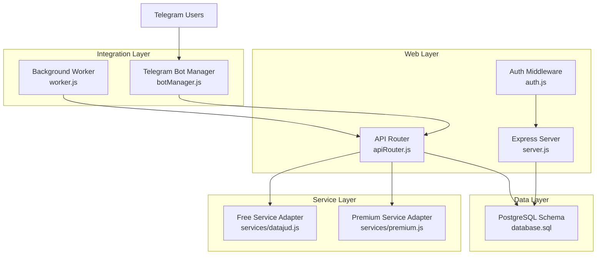
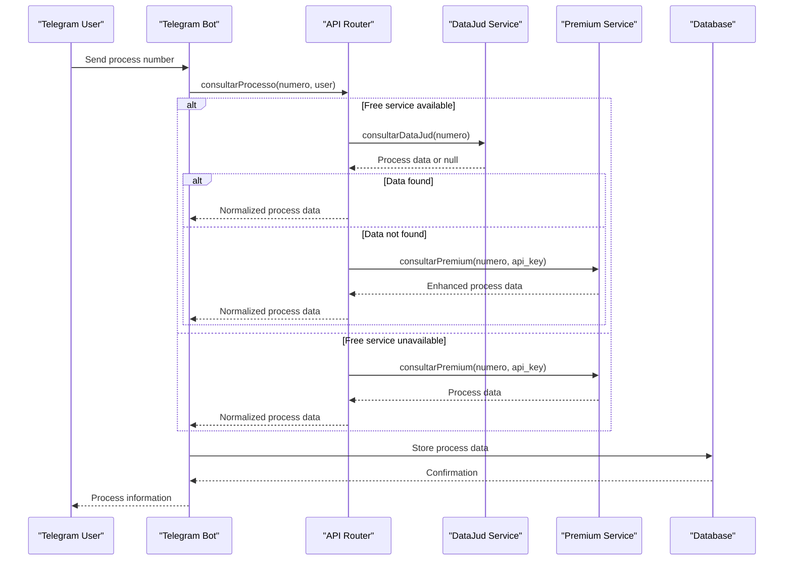
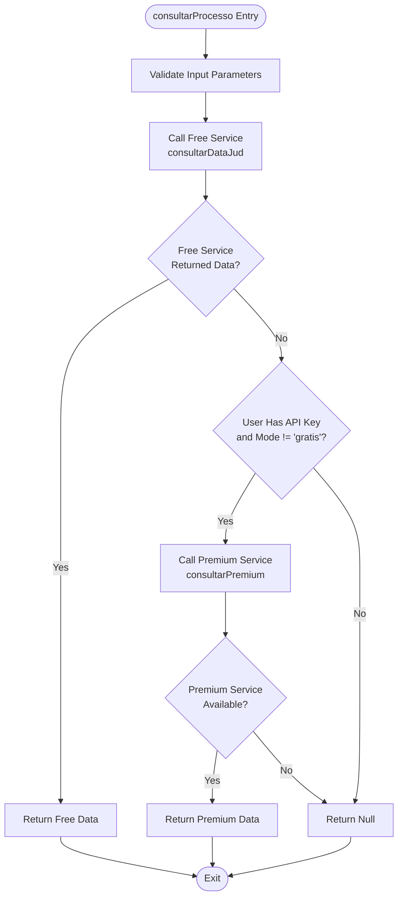
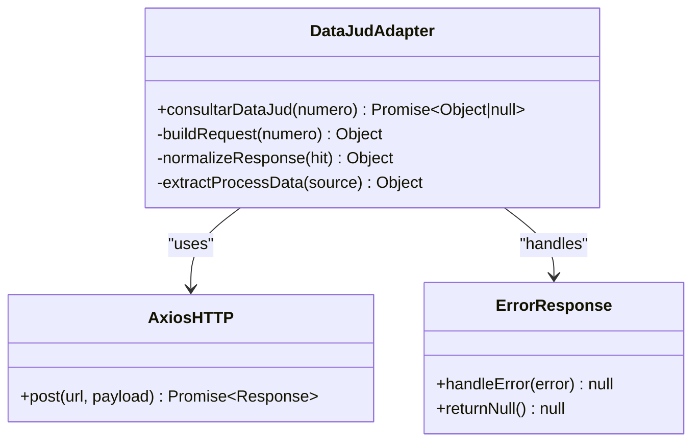
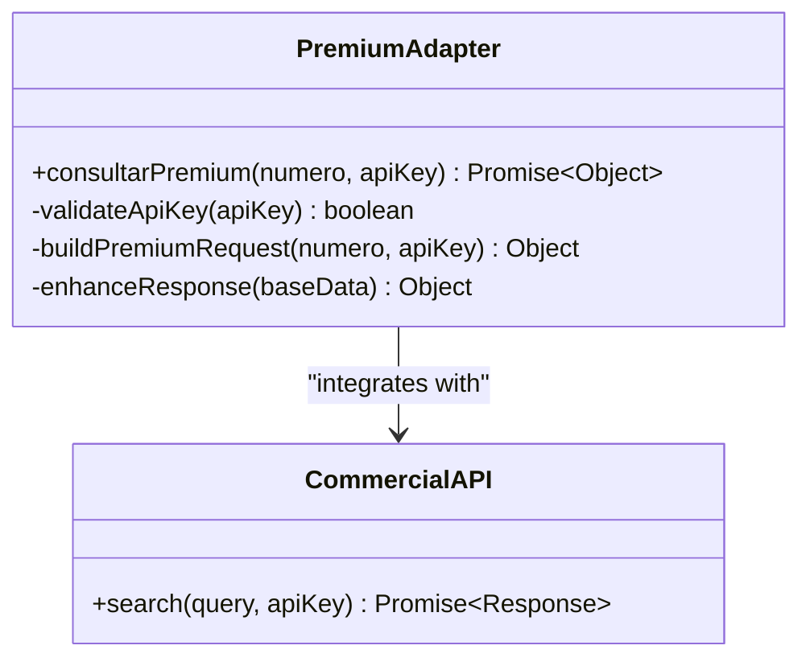
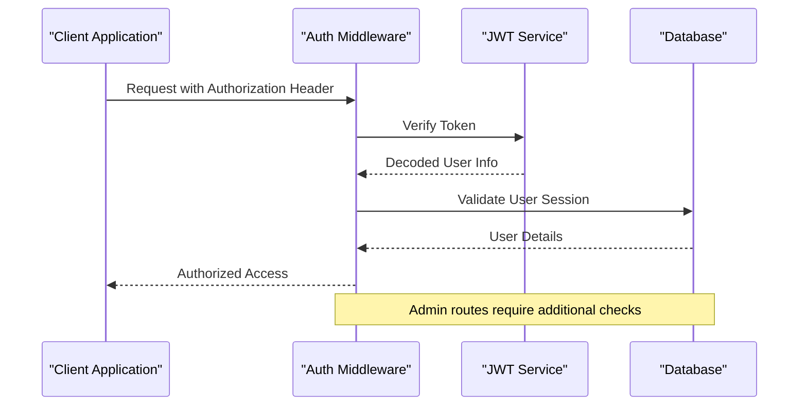
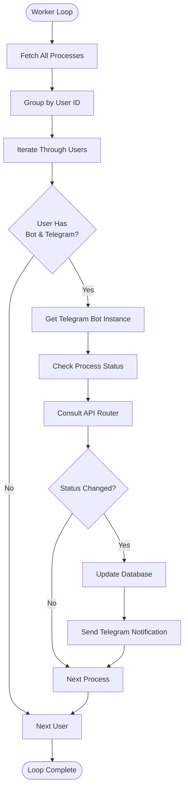
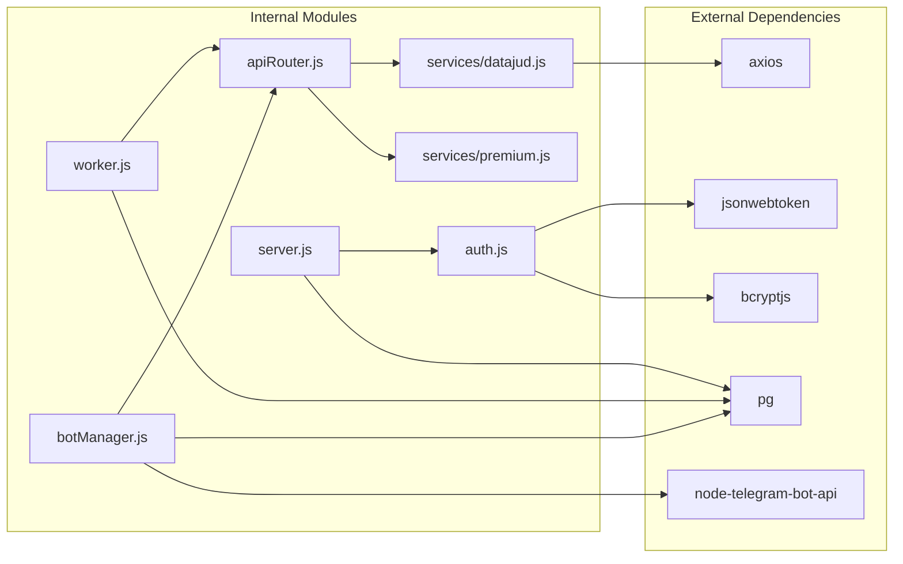

# API Integration Layer

<cite>
**Referenced Files in This Document**
- [datajud.js](file://services/datajud.js)
- [premium.js](file://services/premium.js)
- [apiRouter.js](file://apiRouter.js)
- [server.js](file://server.js)
- [auth.js](file://auth.js)
- [worker.js](file://worker.js)
- [botManager.js](file://botManager.js)
- [package.json](file://package.json)
- [database.sql](file://database.sql)
- [README.md](file://README.md)
</cite>

## Table of Contents
1. [Introduction](#introduction)
2. [Project Structure](#project-structure)
3. [Core Components](#core-components)
4. [Architecture Overview](#architecture-overview)
5. [Detailed Component Analysis](#detailed-component-analysis)
6. [Dependency Analysis](#dependency-analysis)
7. [Performance Considerations](#performance-considerations)
8. [Troubleshooting Guide](#troubleshooting-guide)
9. [Conclusion](#conclusion)
10. [Appendices](#appendices)

## Introduction
This document describes the API integration layer that powers the judicial process monitoring system. It covers the tiered access strategy where the free DataJud service acts as the primary provider, with a premium paid service as a fallback for enhanced features. The unified API interface abstracts external legal database access, request/response handling, and error management. The architecture is designed to be extensible, allowing easy addition of new external API providers while maintaining consistent behavior and graceful fallback mechanisms.

## Project Structure
The system is organized around a modular API integration layer with clear separation of concerns:
- Unified API router orchestrating free and premium services
- Free service adapter for DataJud (CNJ)
- Premium service adapter placeholder for commercial APIs
- Authentication and authorization middleware
- Background worker for automated monitoring
- Telegram bot integration for user interactions
- Database schema for user and process management

**Diagram sources**
- [apiRouter.js:1-19](file://apiRouter.js#L1-L19)
- [datajud.js:1-32](file://services/datajud.js#L1-L32)
- [premium.js:1-12](file://services/premium.js#L1-L12)
- [worker.js:1-70](file://worker.js#L1-L70)
- [botManager.js:1-53](file://botManager.js#L1-L53)
- [database.sql:1-25](file://database.sql#L1-L25)

**Section sources**
- [README.md:1-56](file://README.md#L1-L56)
- [package.json:1-21](file://package.json#L1-L21)

## Core Components
The API integration layer consists of several key components that work together to provide seamless access to legal databases:

### Unified API Router
The central orchestrator that implements the tiered access strategy:
- First attempts free DataJud service
- Falls back to premium service when available
- Handles user context and mode selection
- Returns normalized response format

### Free Service Adapter (DataJud)
Implements the free CNJ DataJud API integration with:
- Structured request formatting
- Robust error handling and null returns
- Response normalization to unified format
- Automatic fallback capability

### Premium Service Adapter
Provides a placeholder for commercial legal database APIs with:
- API key authentication support
- Enhanced data fields
- Extensible architecture for multiple providers

### Authentication and Authorization
JWT-based authentication system with:
- User registration and login
- Role-based access control (admin/client)
- Secure password hashing
- Token verification middleware

**Section sources**
- [apiRouter.js:4-16](file://apiRouter.js#L4-L16)
- [datajud.js:3-29](file://services/datajud.js#L3-L29)
- [premium.js:1-9](file://services/premium.js#L1-L9)
- [auth.js:8-31](file://auth.js#L8-L31)

## Architecture Overview
The system implements a layered architecture with clear separation between presentation, business logic, and data access layers:

**Diagram sources**
- [apiRouter.js:4-16](file://apiRouter.js#L4-L16)
- [datajud.js:3-29](file://services/datajud.js#L3-L29)
- [premium.js:1-9](file://services/premium.js#L1-L9)
- [botManager.js:13-39](file://botManager.js#L13-L39)

The architecture ensures:
- Fail-safe fallback from free to premium service
- Consistent response format regardless of provider
- User context preservation throughout the call chain
- Graceful degradation when services are unavailable

## Detailed Component Analysis

### API Router Implementation
The API router implements the core tiered access logic:

**Diagram sources**
- [apiRouter.js:4-16](file://apiRouter.js#L4-L16)

Key implementation characteristics:
- **Fail-fast approach**: Free service is attempted first
- **Context-aware fallback**: Depends on user's API key and mode
- **Null safety**: Returns null when no data is available
- **Normalized output**: Consistent response structure across providers

**Section sources**
- [apiRouter.js:4-16](file://apiRouter.js#L4-L16)

### DataJud Service Adapter
The free service adapter provides robust integration with the CNJ DataJud API:

**Diagram sources**
- [datajud.js:3-29](file://services/datajud.js#L3-L29)

Implementation details:
- **Structured request building**: Creates match query for process number
- **Robust error handling**: Catches all exceptions and returns null
- **Response normalization**: Extracts and transforms relevant fields
- **Optional field handling**: Safely handles missing class information

**Section sources**
- [datajud.js:3-29](file://services/datajud.js#L3-L29)

### Premium Service Adapter
The premium service adapter provides extensibility for commercial legal databases:

**Diagram sources**
- [premium.js:1-9](file://services/premium.js#L1-L9)

Current implementation characteristics:
- **Placeholder functionality**: Returns enhanced mock data
- **API key integration**: Accepts and validates API keys
- **Extensible design**: Ready for real commercial API integration
- **Enhanced fields**: Provides richer data than free service

**Section sources**
- [premium.js:1-9](file://services/premium.js#L1-L9)

### Authentication and Authorization System
The system implements JWT-based authentication with role-based access control:

**Diagram sources**
- [auth.js:17-31](file://auth.js#L17-L31)
- [server.js:125-135](file://server.js#L125-L135)

Security features:
- **JWT token generation**: 24-hour expiration
- **Password hashing**: bcrypt with salt rounds
- **Role-based access**: Admin vs client permissions
- **Token validation**: Middleware for all protected routes

**Section sources**
- [auth.js:8-31](file://auth.js#L8-L31)
- [server.js:12-68](file://server.js#L12-L68)

### Background Monitoring System
The worker component provides automated process monitoring:

**Diagram sources**
- [worker.js:17-61](file://worker.js#L17-L61)

Monitoring features:
- **Scheduled execution**: Runs every 5 minutes
- **User caching**: Prevents redundant database queries
- **Bot instance caching**: Reuses Telegram bot connections
- **Status change detection**: Notifies only on updates

**Section sources**
- [worker.js:17-61](file://worker.js#L17-L61)

## Dependency Analysis
The system maintains clean dependency relationships with minimal coupling:

**Diagram sources**
- [package.json:11-19](file://package.json#L11-L19)
- [apiRouter.js:1-2](file://apiRouter.js#L1-L2)
- [datajud.js:1](file://services/datajud.js#L1)
- [auth.js:1-3](file://auth.js#L1-L3)

Dependency characteristics:
- **Minimal external dependencies**: Only essential libraries used
- **Clear module boundaries**: Each component has single responsibility
- **Version pinning**: Specific versions ensure stability
- **Environment configuration**: All secrets loaded from environment

**Section sources**
- [package.json:11-19](file://package.json#L11-L19)

## Performance Considerations
The system implements several performance optimization strategies:

### Caching Strategies
- **Telegram bot instances**: Cached by token to avoid recreation overhead
- **User data caching**: Prevents repeated database queries in worker loops
- **Connection pooling**: PostgreSQL connection pooling managed by pg library

### Network Optimization
- **Timeout handling**: Free service adapter returns null on errors
- **Concurrent processing**: Worker processes multiple users concurrently
- **Batch operations**: Groups database operations where possible

### Resource Management
- **Memory cleanup**: No persistent state maintained
- **Graceful shutdown**: Process exits cleanly on SIGTERM
- **Error isolation**: Service failures don't crash the entire system

## Troubleshooting Guide

### Common Issues and Solutions

#### Service Unavailability
**Problem**: Free service returns null unexpectedly
**Solution**: Check network connectivity and service status
**Detection**: Free service adapter catches all errors and returns null

#### Authentication Failures
**Problem**: 401 Unauthorized responses
**Solution**: Verify JWT token validity and expiration
**Prevention**: Implement token refresh mechanism

#### Rate Limiting
**Problem**: API responses blocked by rate limits
**Solution**: Implement exponential backoff and retry logic
**Monitoring**: Track API response codes and timing

#### Database Connection Issues
**Problem**: PostgreSQL connection failures
**Solution**: Implement connection retry and health checks
**Monitoring**: Track connection pool statistics

### Error Handling Patterns
The system follows consistent error handling patterns:
- **Consistent null returns**: Services return null on failure
- **Centralized error logging**: All exceptions are caught and handled
- **Graceful degradation**: System continues operating with reduced functionality
- **User-friendly messages**: API responses provide meaningful error information

**Section sources**
- [datajud.js:26-28](file://services/datajud.js#L26-L28)
- [apiRouter.js:11-13](file://apiRouter.js#L11-L13)

## Conclusion
The API integration layer provides a robust, extensible foundation for judicial process monitoring. The tiered access strategy ensures reliable service delivery while offering premium capabilities for advanced users. The modular architecture allows for easy integration of additional legal database providers while maintaining consistent behavior and error handling. The system's design emphasizes reliability, performance, and maintainability, making it suitable for production deployment.

## Appendices

### API Response Schemas
Unified response format for all service providers:
- `numero`: Process number (string)
- `tribunal`: Court/tribunal name (string)
- `classe`: Legal class (string or null)
- `data`: Last update timestamp (ISO string)

### Integration Guidelines
To add a new external API provider:
1. Create a new service adapter in `services/` directory
2. Implement the same function signature as existing adapters
3. Add the new service to the API router
4. Test error handling and fallback logic
5. Update documentation and examples

### Configuration Requirements
- Environment variables: `JWT_SECRET`, `PORT`
- Database: PostgreSQL with configured credentials
- External APIs: DataJud endpoint and premium API credentials
- Telegram: Bot tokens and webhook configurations