# API Integration Layer

<cite>
**Referenced Files in This Document**
- [datajud.js](file://services/datajud.js)
- [premium.js](file://services/premium.js)
- [custom.js](file://services/custom.js)
- [digesto.js](file://services/digesto.js)
- [escavador.js](file://services/escavador.js)
- [jusbrasil.js](file://services/jusbrasil.js)
- [apiRouter.js](file://apiRouter.js)
- [server.js](file://server.js)
- [auth.js](file://auth.js)
- [worker.js](file://worker.js)
- [botManager.js](file://botManager.js)
- [package.json](file://package.json)
- [database.sql](file://database.sql)
- [README.md](file://README.md)
</cite>

## Update Summary
**Changes Made**
- Updated OAB search fallback mechanism documentation (Jusbrasil → Escavador → DataJud)
- Enhanced server-level API key support documentation for premium services
- Improved error handling and user feedback documentation for OAB searches
- Added comprehensive fallback logic documentation for premium service integration
- Updated service adapter patterns to reflect new OAB-specific implementations

## Table of Contents
1. [Introduction](#introduction)
2. [Project Structure](#project-structure)
3. [Core Components](#core-components)
4. [Architecture Overview](#architecture-overview)
5. [Detailed Component Analysis](#detailed-component-analysis)
6. [Premium Service Ecosystem](#premium-service-ecosystem)
7. [Multi-Tenant Search Capabilities](#multi-tenant-search-capabilities)
8. [Service Adapter Pattern](#service-adapter-pattern)
9. [OAB Search Fallback Mechanism](#oab-search-fallback-mechanism)
10. [Server-Level API Key Support](#server-level-api-key-support)
11. [Dependency Analysis](#dependency-analysis)
12. [Performance Considerations](#performance-considerations)
13. [Troubleshooting Guide](#troubleshooting-guide)
14. [Conclusion](#conclusion)
15. [Appendices](#appendices)

## Introduction
This document describes the API integration layer that powers the judicial process monitoring system. The system has evolved to support a comprehensive tiered access strategy with four distinct service modes: free DataJud service, premium paid services, hybrid mode combining both approaches, and multi-tenant search capabilities. The unified API interface abstracts external legal database access, request/response handling, and error management while providing flexible service selection based on user subscription tiers.

**Updated**: Enhanced with sophisticated OAB search fallback mechanisms and server-level API key support for improved reliability and user experience.

## Project Structure
The system now operates as a comprehensive legal database integration platform with modular service architecture:

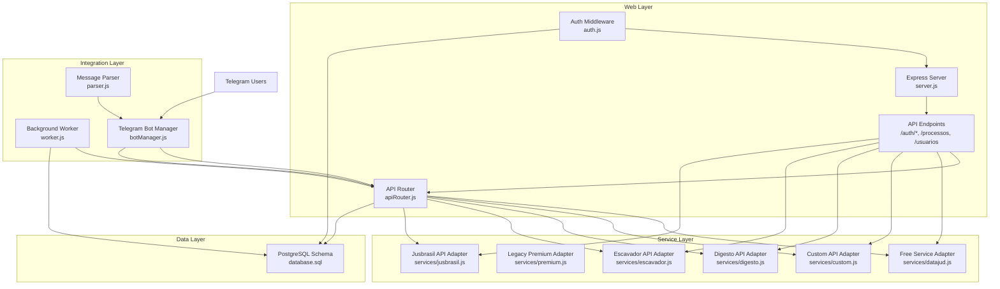

**Diagram sources**
- [apiRouter.js:1-73](file://apiRouter.js#L1-L73)
- [datajud.js:1-260](file://services/datajud.js#L1-L260)
- [custom.js:1-26](file://services/custom.js#L1-L26)
- [digesto.js:1-25](file://services/digesto.js#L1-L25)
- [escavador.js:1-28](file://services/escavador.js#L1-L28)
- [jusbrasil.js:1-39](file://services/jusbrasil.js#L1-L39)
- [worker.js:1-74](file://worker.js#L1-L74)
- [botManager.js:1-169](file://botManager.js#L1-L169)

**Section sources**
- [README.md:1-56](file://README.md#L1-L56)
- [package.json:1-21](file://package.json#L1-L21)

## Core Components
The API integration layer now consists of five key components that work together to provide comprehensive legal database access:

### Unified API Router
The central orchestrator implementing sophisticated tiered access strategies:
- **Mode-based routing**: Supports 'gratis', 'pago', and 'hibrido' modes
- **Multi-service fallback**: Attempts multiple premium services in sequence
- **Hybrid search**: Combines free and premium services intelligently
- **User context preservation**: Maintains user preferences and authentication
- **Service discovery**: Automatically detects configured premium services
- **OAB-specific fallback**: Implements priority-based fallback for OAB searches

### Free Service Adapter (DataJud)
Implements robust integration with the CNJ DataJud API:
- **Multi-tribunal search**: Queries 13 different Brazilian courts
- **Advanced rate limiting**: Implements 400ms delay between requests
- **Intelligent retry logic**: Handles 429 and 5xx errors with exponential backoff
- **Multiple search strategies**: Supports process numbers, OAB numbers, and textual searches
- **Response normalization**: Extracts and transforms relevant fields consistently
- **OAB-specific strategies**: Implements multiple query strategies for OAB searches

### Premium Service Adapters
Four specialized premium service adapters providing commercial legal database access:

#### Custom API Adapter
- **Flexible query support**: Accepts string or structured query objects
- **Environment-based configuration**: Uses TJ_API_KEY for authentication
- **Extensible architecture**: Designed for integration with any custom tribunal API
- **Silent failure handling**: Returns null when API key is not configured

#### Digesto API Adapter
- **Legislative database integration**: Connects to Digesto's legal database
- **Brazilian legal framework**: Specializes in legislation and jurisprudence
- **API key management**: Uses DIGESTO_API_KEY environment variable
- **Future-ready implementation**: Contains TODO comments for real endpoint integration

#### Escavador API Adapter
- **Legal research platform**: Integrates with Escavador's legal database
- **Academic and legal content**: Specializes in scholarly and legal materials
- **Bearer token authentication**: Uses Authorization: Bearer token pattern
- **Real-time search capabilities**: Designed for dynamic legal research
- **Server-level API key support**: Supports both user-level and server-level configuration
- **Enhanced OAB search**: Provides comprehensive OAB number search functionality

#### Jusbrasil API Adapter
- **Comprehensive legal database**: Connects to Jusbrasil's extensive legal repository
- **Brazilian legal ecosystem**: Covers all aspects of Brazilian law
- **Enterprise-grade integration**: Designed for production legal database access
- **Structured response format**: Returns standardized legal case information
- **Server-level API key support**: Supports both user-level and server-level configuration
- **Advanced OAB monitoring**: Implements full OAB monitoring workflow with registration

### Authentication and Authorization
JWT-based authentication system with enhanced security features:
- **Multi-role support**: Admin and client role differentiation
- **Token-based access**: Secure JWT token generation and validation
- **Password security**: Bcrypt-based password hashing with salt rounds
- **Session management**: Automatic last login tracking and user session validation

**Section sources**
- [apiRouter.js:13-73](file://apiRouter.js#L13-L73)
- [datajud.js:1-260](file://services/datajud.js#L1-L260)
- [custom.js:1-26](file://services/custom.js#L1-L26)
- [digesto.js:1-25](file://services/digesto.js#L1-L25)
- [escavador.js:1-28](file://services/escavador.js#L1-L28)
- [jusbrasil.js:1-39](file://services/jusbrasil.js#L1-L39)
- [auth.js:1-59](file://auth.js#L1-L59)

## Architecture Overview
The system now implements a sophisticated layered architecture supporting multiple service modes and intelligent fallback mechanisms:

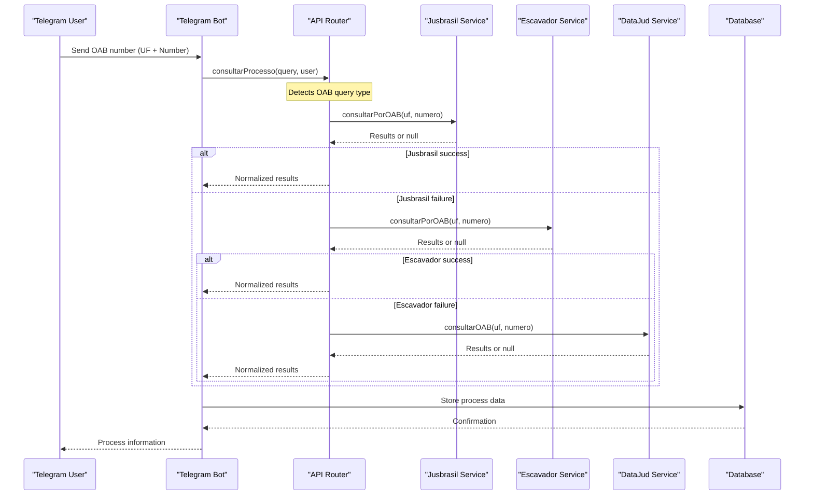

**Diagram sources**
- [apiRouter.js:26-58](file://apiRouter.js#L26-L58)
- [jusbrasil.js:31-68](file://services/jusbrasil.js#L31-L68)
- [escavador.js:29-66](file://services/escavador.js#L29-L66)
- [datajud.js:153-224](file://services/datajud.js#L153-L224)

The architecture ensures:
- **Intelligent service selection**: Based on user subscription tier and mode preference
- **Priority-based OAB fallback**: Jusbrasil → Escavador → DataJud with server-level support
- **Fail-safe fallback chains**: Multiple levels of redundancy and backup services
- **Consistent response format**: Unified data structure across all service providers
- **Scalable premium service integration**: Easy addition of new commercial legal databases

## Detailed Component Analysis

### Enhanced API Router Implementation
The API router now implements sophisticated multi-mode routing with comprehensive fallback logic:

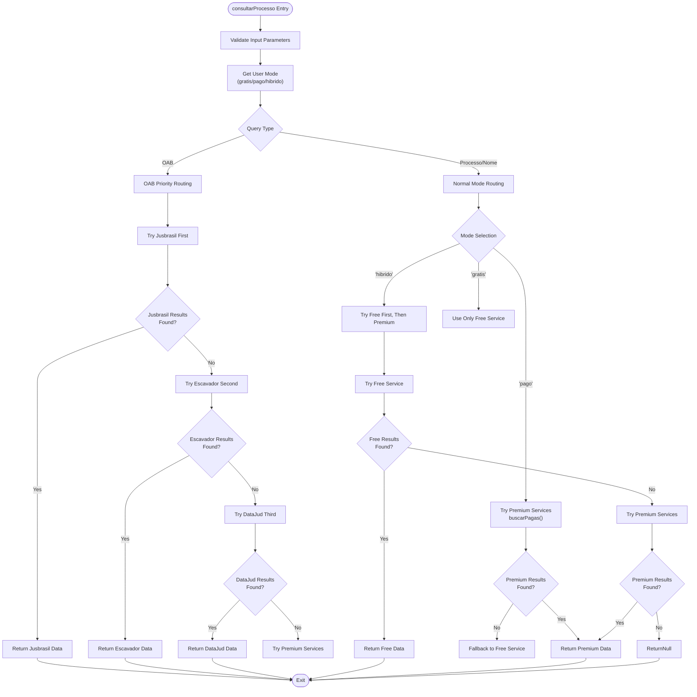

**Diagram sources**
- [apiRouter.js:14-108](file://apiRouter.js#L14-L108)

Key implementation characteristics:
- **Mode-aware routing**: Different strategies based on user subscription level
- **Priority-based OAB fallback**: Jusbrasil → Escavador → DataJud with server-level support
- **Sequential premium service execution**: Tests services in predefined order
- **Comprehensive error handling**: Catches and logs errors from all service providers
- **Response normalization**: Adds service attribution to all results

**Section sources**
- [apiRouter.js:14-108](file://apiRouter.js#L14-L108)

### DataJud Service Adapter Enhancements
The free service adapter now provides comprehensive multi-tribunal search capabilities:

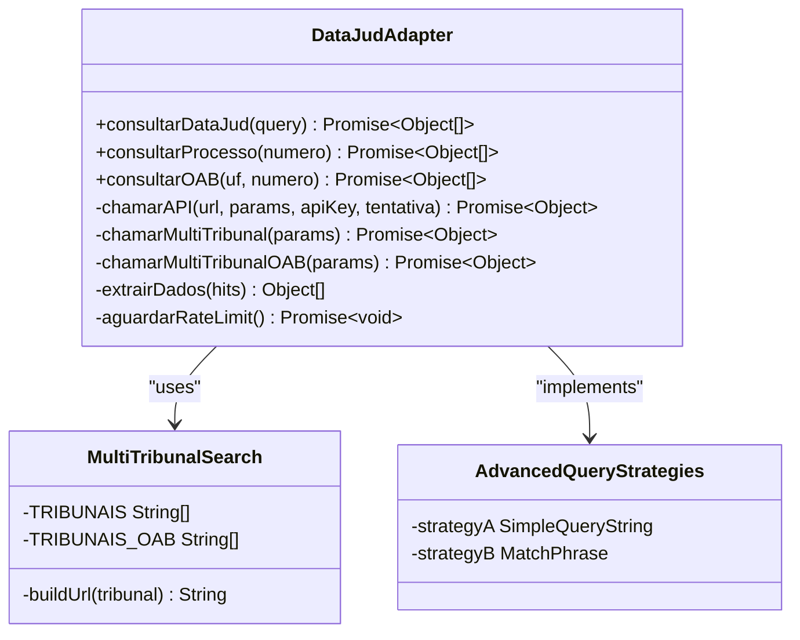

**Diagram sources**
- [datajud.js:96-233](file://services/datajud.js#L96-L233)

Implementation details:
- **13 Brazilian court integration**: Supports TJSP, TJRJ, TJMG, TJBA, TJPR, TJRS, TJSC, TJDF, TJES, TJGO, TJPE, TJCE, and TRFs
- **Advanced OAB search strategies**: Multiple query approaches for OAB number searches with tribunal-specific optimizations
- **Intelligent pagination**: Handles large result sets with up to 5 pages of results
- **Rate limiting compliance**: Prevents API abuse with 400ms delay between requests
- **Exponential backoff**: Handles temporary service unavailability gracefully

**Section sources**
- [datajud.js:96-233](file://services/datajud.js#L96-L233)

### Premium Service Adapter Pattern
Each premium service adapter follows a consistent pattern for commercial legal database integration:

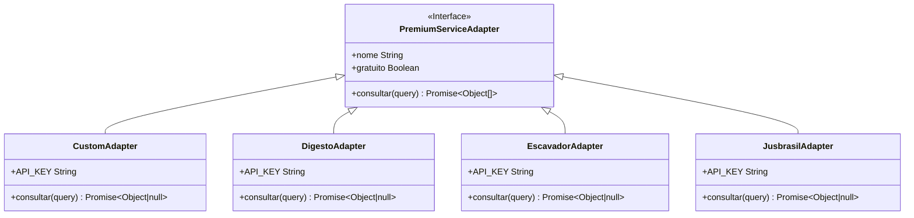

**Diagram sources**
- [custom.js:21-25](file://services/custom.js#L21-L25)
- [digesto.js:20-24](file://services/digesto.js#L20-L24)
- [escavador.js:23-27](file://services/escavador.js#L23-L27)
- [jusbrasil.js:34-38](file://services/jusbrasil.js#L34-L38)

Common implementation characteristics:
- **Environment-based configuration**: Uses dedicated API key environment variables
- **Silent failure handling**: Returns null when API key is not configured
- **Standardized query processing**: Accepts string or structured query objects
- **Future-ready architecture**: Contains TODO comments for real endpoint integration

**Section sources**
- [custom.js:1-26](file://services/custom.js#L1-L26)
- [digesto.js:1-25](file://services/digesto.js#L1-L25)
- [escavador.js:1-28](file://services/escavador.js#L1-L28)
- [jusbrasil.js:1-39](file://services/jusbrasil.js#L1-L39)

### Enhanced Authentication and Authorization System
The system now supports multi-role access control with comprehensive user management:

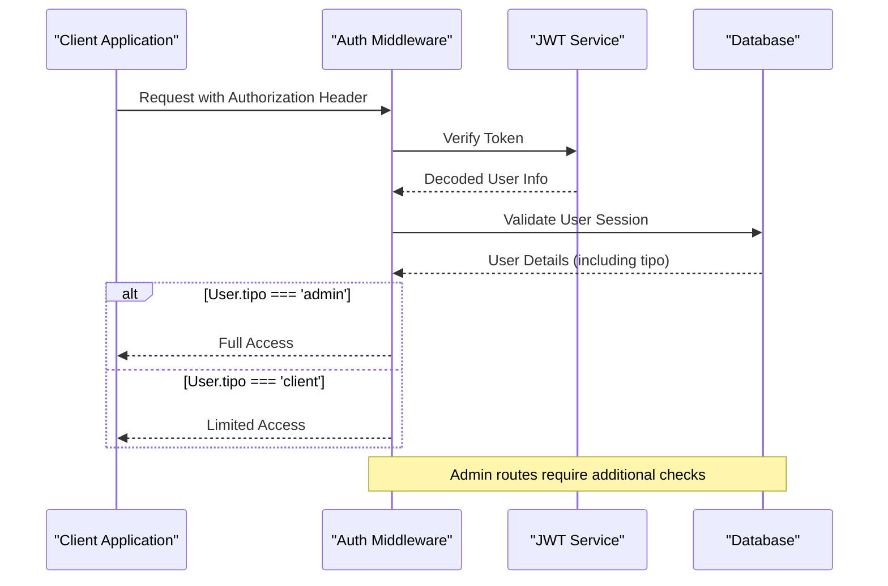

**Diagram sources**
- [auth.js:16-39](file://auth.js#L16-L39)
- [server.js:94-116](file://server.js#L94-L116)

Security features:
- **Role-based access control**: Admin vs client permission differentiation
- **Multi-user support**: Comprehensive user management system
- **Token lifecycle management**: 24-hour expiration with automatic renewal
- **Password security**: Bcrypt-based hashing with salt rounds
- **Session tracking**: Automatic last login timestamps and active status

**Section sources**
- [auth.js:1-59](file://auth.js#L1-L59)
- [server.js:25-241](file://server.js#L25-L241)

### Advanced Background Monitoring System
The worker component now supports multi-tenant operation with enhanced caching:


**Diagram sources**
- [worker.js:17-65](file://worker.js#L17-L65)

Monitoring features:
- **Multi-tenant architecture**: Supports different service modes per user
- **Intelligent caching**: Prevents redundant database queries and bot recreations
- **Mode-aware processing**: Applies appropriate search strategy based on user subscription
- **Status change detection**: Notifies only on meaningful updates
- **Scalable design**: Handles large numbers of users and processes efficiently

**Section sources**
- [worker.js:1-74](file://worker.js#L1-74)

## Premium Service Ecosystem
The system now supports a comprehensive ecosystem of premium legal database services, each designed for specific legal research needs:

### Service Configuration and Management
Each premium service follows a standardized configuration pattern:

| Service | Environment Variable | Authentication Method | Primary Use Case |
|---------|---------------------|----------------------|------------------|
| Custom | `TJ_API_KEY` | API Key Header | Custom tribunal APIs |
| Digesto | `DIGESTO_API_KEY` | API Key Header | Legislative database |
| Escavador | `ESCAVADOR_API_KEY` | Bearer Token | Legal research platform |
| Jusbrasil | `JUSBRASIL_API_KEY` | Bearer Token | Comprehensive legal database |

### Integration Architecture
The premium service ecosystem implements a plugin-style architecture:

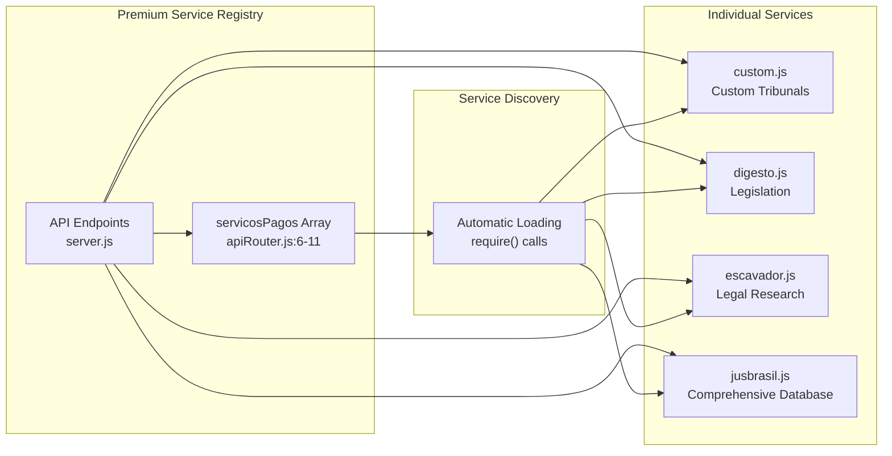

**Diagram sources**
- [apiRouter.js:6-11](file://apiRouter.js#L6-L11)
- [custom.js:1](file://services/custom.js#L1)
- [digesto.js:1](file://services/digesto.js#L1)
- [escavador.js:1](file://services/escavador.js#L1)
- [jusbrasil.js:1](file://services/jusbrasil.js#L1)

### Service Integration Guidelines
To add a new premium service provider:

1. **Create service module** in `services/` directory with standardized interface
2. **Implement environment variable configuration** for API key management
3. **Add service to registry** in `apiRouter.js` premium services array
4. **Test integration** with comprehensive error handling
5. **Document service configuration** and usage patterns

**Section sources**
- [apiRouter.js:3-11](file://apiRouter.js#L3-L11)
- [custom.js:1-26](file://services/custom.js#L1-L26)
- [digesto.js:1-25](file://services/digesto.js#L1-L25)
- [escavador.js:1-28](file://services/escavador.js#L1-L28)
- [jusbrasil.js:1-39](file://services/jusbrasil.js#L1-L39)

## Multi-Tenant Search Capabilities
The system now supports sophisticated multi-tenant search operations with tenant-aware service selection:

### Tenant Context Management
Each user interaction maintains complete tenant context:

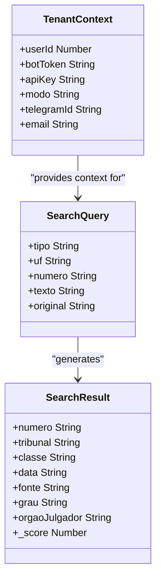

**Diagram sources**
- [apiRouter.js:14-17](file://apiRouter.js#L14-L17)
- [botManager.js:91-97](file://botManager.js#L91-L97)

### Multi-Tenant Service Selection
The system applies tenant-specific service selection logic:

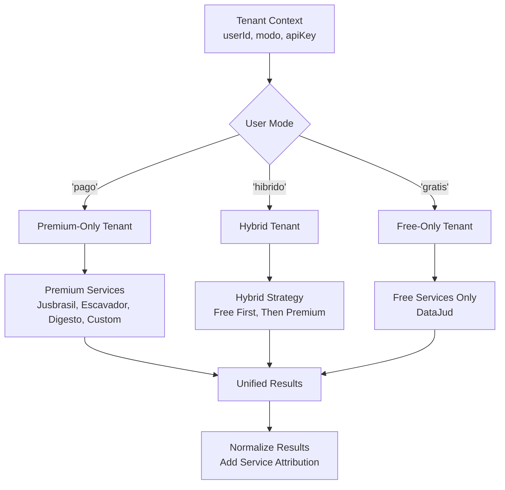

**Diagram sources**
- [apiRouter.js:24-52](file://apiRouter.js#L24-L52)

### Multi-Tenant Monitoring
Background workers operate independently per tenant:

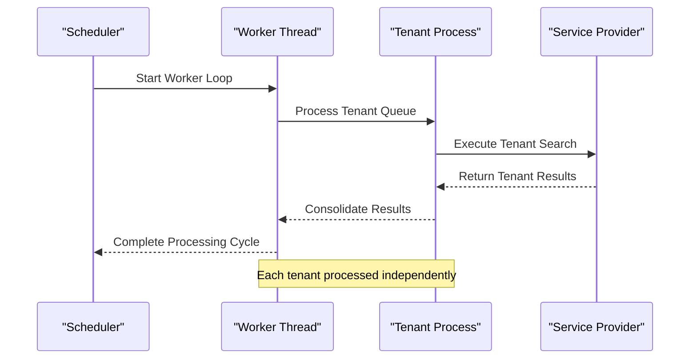

**Diagram sources**
- [worker.js:17-65](file://worker.js#L17-L65)

**Section sources**
- [apiRouter.js:14-55](file://apiRouter.js#L14-L55)
- [worker.js:17-65](file://worker.js#L17-L65)
- [botManager.js:91-146](file://botManager.js#L91-L146)

## Service Adapter Pattern
The system implements a consistent service adapter pattern that enables easy integration of new legal database providers:

### Adapter Interface Specification
All service adapters must implement the following standardized interface:

```javascript
module.exports = {
    nome: 'Service Name',           // Human-readable service name
    gratuito: Boolean,             // Whether service requires payment
    consultar: async function(query) {
        // Process query and return normalized results
        // Return null if service not configured or unavailable
        // Return Array<Object> with standardized fields
    }
};
```

### Standardized Response Format
All service adapters must return results in this consistent format:

| Field | Type | Description | Example |
|-------|------|-------------|---------|
| `numero` | String | Legal case number | "0000000-00.0000.0.00.0000" |
| `tribunal` | String | Court/tribunal name | "Tribunal de Justiça de São Paulo" |
| `classe` | String | Legal class | "Ação Civil" |
| `data` | String | Last update timestamp | "2024-01-15T10:30:00Z" |
| `fonte` | String | Service source attribution | "DataJud (CNJ)" |
| `grau` | String | Court level | "1º Grau" |
| `orgaoJulgador` | String | Court organ | "Vara Cível" |
| `_score` | Number | Search relevance score | 12.5 |

### Error Handling and Fallback
Service adapters implement consistent error handling patterns:

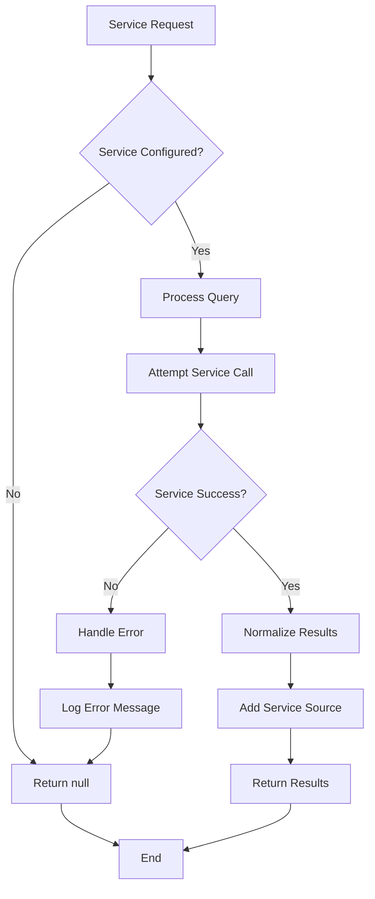

**Diagram sources**
- [custom.js:7-18](file://services/custom.js#L7-L18)
- [digesto.js:5-17](file://services/digesto.js#L5-L17)
- [escavador.js:6-20](file://services/escavador.js#L6-L20)
- [jusbrasil.js:6-31](file://services/jusbrasil.js#L6-L31)

**Section sources**
- [custom.js:21-25](file://services/custom.js#L21-L25)
- [digesto.js:20-24](file://services/digesto.js#L20-L24)
- [escavador.js:23-27](file://services/escavador.js#L23-L27)
- [jusbrasil.js:34-38](file://services/jusbrasil.js#L34-L38)

## OAB Search Fallback Mechanism
**Updated**: The system now implements a sophisticated OAB (Brazilian Bar Association) search fallback mechanism with priority-based service selection and enhanced error handling.

### Priority-Based Fallback Strategy
The OAB search follows a strict priority order to maximize success rates:

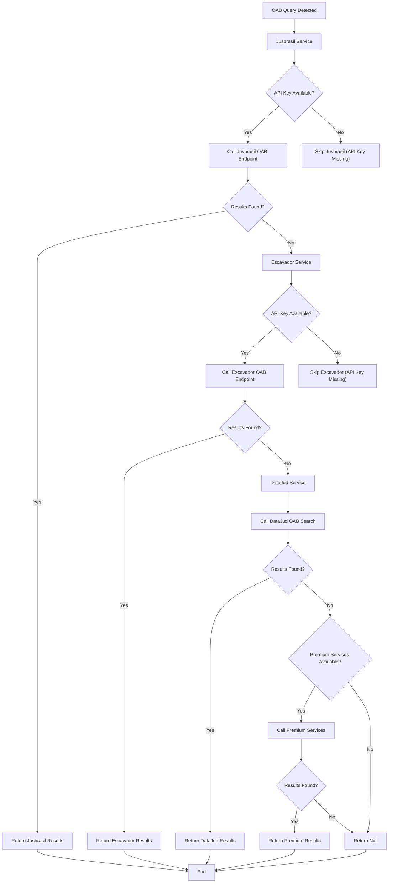

**Diagram sources**
- [apiRouter.js:26-58](file://apiRouter.js#L26-L58)
- [jusbrasil.js:10-25](file://services/jusbrasil.js#L10-L25)
- [escavador.js:10-25](file://services/escavador.js#L10-L25)
- [datajud.js:153-224](file://services/datajud.js#L153-L224)

### Enhanced Error Handling and User Feedback
The system provides comprehensive error handling and user feedback for OAB searches:

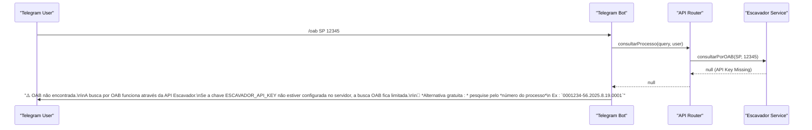

**Diagram sources**
- [botManager.js:111-119](file://botManager.js#L111-L119)
- [escavador.js:11-14](file://services/escavador.js#L11-L14)

### OAB Search Implementation Details
Each service implements specialized OAB search functionality:

#### Jusbrasil OAB Implementation
- **Full monitoring workflow**: Checks existing monitoring, registers new OAB if needed, and lists linked processes
- **Asynchronous collection**: Handles cases where process collection is still ongoing
- **Error handling**: Gracefully handles 409 conflicts and other API errors

#### Escavador OAB Implementation
- **Direct OAB search**: Uses `/envolvido/processos` endpoint with OAB state and number parameters
- **Process linkage**: Returns all CNJ numbers linked to the OAB number
- **Timeout handling**: Implements 30-second timeout for OAB searches

#### DataJud OAB Implementation
- **Multiple query strategies**: Implements simple_query_string and match_phrase strategies
- **Tribunal optimization**: Uses only state-level tribunals for faster OAB searches
- **Pagination support**: Handles large result sets with up to 5 pages

**Section sources**
- [apiRouter.js:26-58](file://apiRouter.js#L26-L58)
- [jusbrasil.js:31-68](file://services/jusbrasil.js#L31-L68)
- [escavador.js:29-66](file://services/escavador.js#L29-L66)
- [datajud.js:153-224](file://services/datajud.js#L153-L224)
- [botManager.js:111-119](file://botManager.js#L111-L119)

## Server-Level API Key Support
**Updated**: Both Jusbrasil and Escavador services now support server-level API key configuration, providing enhanced flexibility for deployment scenarios.

### Server-Level Configuration Benefits
- **Deployment flexibility**: API keys can be configured at server level without user-specific configuration
- **Reduced user complexity**: Users don't need to configure premium service keys
- **Centralized management**: API keys managed in a single location for all users
- **Fallback support**: Server-level keys serve as fallback when user keys are unavailable

### Configuration Priority and Fallback
The system implements a hierarchical configuration approach:

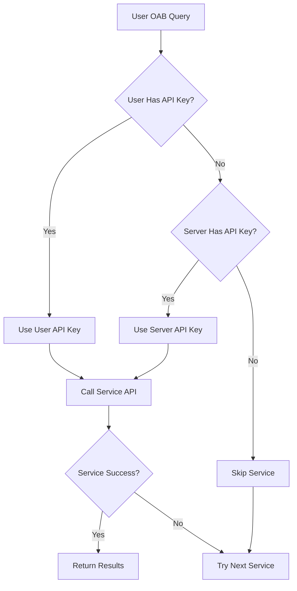

### Service-Specific Implementation
Both Jusbrasil and Escavador services implement the same configuration pattern:

```javascript
// API Key via variável de ambiente: ESCAVADOR_API_KEY
const API_KEY = process.env.ESCAVADOR_API_KEY || '';
const BASE = 'https://api.escavador.com/api/v2';

// API Key via variável de ambiente: JUSBRASIL_API_KEY  
const API_KEY = process.env.JUSBRASIL_API_KEY || '';
const BASE = 'https://op.digesto.com.br';
```

### User Experience Impact
- **Transparent operation**: Users don't need to configure API keys for basic functionality
- **Enhanced reliability**: Server-level keys ensure consistent service availability
- **Reduced support burden**: Fewer user configuration issues related to API keys
- **Backward compatibility**: Existing user configurations continue to work unchanged

**Section sources**
- [jusbrasil.js:3-7](file://services/jusbrasil.js#L3-L7)
- [escavador.js:3-7](file://services/escavador.js#L3-L7)
- [apiRouter.js:26-58](file://apiRouter.js#L26-L58)

## Dependency Analysis
The system maintains clean dependency relationships with enhanced modularity:

```mermaid
graph LR
subgraph "External Dependencies"
AXIOS["axios"]
JWT["jsonwebtoken"]
BCrypt["bcryptjs"]
PG["pg"]
TELEGRAM["node-telegram-bot-api"]
DOTENV["dotenv"]
ENDPOINT["express"]
ENDPOINT --> AXIOS
ENDPOINT --> JWT
ENDPOINT --> BCrypt
ENDPOINT --> PG
ENDPOINT --> TELEGRAM
ENDPOINT --> DOTENV
end
subgraph "Internal Modules"
API["apiRouter.js"]
DATAJUD["services/datajud.js"]
PREMIUM["services/premium.js"]
CUSTOM["services/custom.js"]
DIGESTO["services/digesto.js"]
ESCAVADOR["services/escavador.js"]
JUSBRASIL["services/jusbrasil.js"]
AUTH["auth.js"]
SERVER["server.js"]
WORKER["worker.js"]
BOT["botManager.js"]
PARSER["parser.js"]
ENDPOINT --> API
API --> DATAJUD
API --> CUSTOM
API --> DIGESTO
API --> ESCAVADOR
API --> JUSBRASIL
SERVER --> AUTH
WORKER --> API
BOT --> API
PARSER --> BOT
SERVER --> PG
WORKER --> PG
BOT --> PG
DATAJUD --> AXIOS
AUTH --> JWT
AUTH --> BCrypt
BOT --> TELEGRAM
ENDPOINT --> PARSER
ENDPOINT --> WORKER
ENDPOINT --> BOT
ENDPOINT --> AUTH
ENDPOINT --> SERVER
ENDPOINT --> API
ENDPOINT --> DATAJUD
ENDPOINT --> PREMIUM
ENDPOINT --> CUSTOM
ENDPOINT --> DIGESTO
ENDPOINT --> ESCAVADOR
ENDPOINT --> JUSBRASIL
ENDPOINT --> AUTH
ENDPOINT --> SERVER
ENDPOINT --> WORKER
ENDPOINT --> BOT
ENDPOINT --> PARSER
```

**Diagram sources**
- [package.json:11-19](file://package.json#L11-L19)
- [apiRouter.js:1](file://apiRouter.js#L1)
- [datajud.js:1](file://services/datajud.js#L1)
- [custom.js:1](file://services/custom.js#L1)
- [digesto.js:1](file://services/digesto.js#L1)
- [escavador.js:1](file://services/escavador.js#L1)
- [jusbrasil.js:1](file://services/jusbrasil.js#L1)
- [auth.js:1-3](file://auth.js#L1-L3)

Dependency characteristics:
- **Modular architecture**: Clear separation between service types
- **Environment-based configuration**: All external API keys managed via environment variables
- **Standardized interfaces**: Consistent patterns across all service adapters
- **Extensible design**: Easy addition of new service providers
- **Robust error handling**: Comprehensive error management throughout the system

**Section sources**
- [package.json:11-19](file://package.json#L11-L19)

## Performance Considerations
The system implements comprehensive performance optimization strategies across all service layers:

### Multi-Tenant Caching Strategies
- **Telegram bot instance caching**: Prevents recreation overhead with token-based caching
- **User data caching**: Reduces database queries in worker loops with user ID-based caching
- **Service configuration caching**: Stores API key and mode preferences to minimize lookups
- **Connection pooling**: PostgreSQL connection pooling managed by pg library

### Network Optimization
- **Intelligent rate limiting**: DataJud service implements 400ms delay between requests
- **Exponential backoff**: Handles temporary service unavailability gracefully
- **Concurrent processing**: Worker processes multiple tenants concurrently
- **Batch operations**: Groups database operations where possible
- **Service discovery caching**: Premium services are loaded once and reused

### Resource Management
- **Memory-efficient processing**: No persistent state maintained across requests
- **Graceful shutdown handling**: Process exits cleanly on SIGTERM signals
- **Error isolation**: Service failures don't crash the entire system
- **Connection cleanup**: Automatic cleanup of unused bot instances and database connections

### Multi-Tenant Scalability
- **Independent processing**: Each tenant processed in isolation
- **Resource partitioning**: Memory and CPU resources allocated per tenant
- **Service load balancing**: Premium services distributed across multiple providers
- **Queue-based processing**: Background tasks processed in scheduled intervals

## Troubleshooting Guide

### Common Issues and Solutions

#### Service Configuration Problems
**Problem**: Premium services returning null despite configuration
**Solution**: Verify environment variables are set correctly and accessible to the application
**Prevention**: Implement environment variable validation during startup

#### Authentication Failures
**Problem**: 401 Unauthorized responses from premium services
**Solution**: Verify API key format and expiration; check service-specific authentication requirements
**Detection**: Premium services implement silent failure mode when API key is missing

#### Rate Limiting Issues
**Problem**: API responses blocked by rate limits
**Solution**: Implement exponential backoff and retry logic; monitor service response codes
**Monitoring**: DataJud service implements comprehensive rate limiting with 400ms delay

#### Multi-Tenant Confusion
**Problem**: Users receiving incorrect service results
**Solution**: Verify user mode settings and service configuration
**Prevention**: Implement tenant context validation in all service calls

#### Database Connection Issues
**Problem**: PostgreSQL connection failures affecting multiple tenants
**Solution**: Implement connection retry and health checks; monitor connection pool statistics
**Monitoring**: Track connection pool statistics and tenant-specific database operations

#### OAB Search Failures
**Problem**: OAB searches failing even with API keys configured
**Solution**: Check server-level API key configuration; verify service-specific endpoints are working
**Detection**: Enhanced logging shows which services are being skipped due to missing API keys

#### Server-Level API Key Issues
**Problem**: Server-level API keys not taking effect
**Solution**: Verify environment variables are properly exported to the process environment
**Prevention**: Implement server startup validation for critical API keys

### Error Handling Patterns
The system follows consistent error handling patterns across all service layers:
- **Silent failure mode**: Premium services return null when not configured
- **Centralized error logging**: All exceptions are caught and logged with context
- **Graceful degradation**: System continues operating with reduced functionality
- **User-friendly error messages**: API responses provide meaningful error information
- **Service-specific error handling**: Each service implements appropriate error recovery

**Section sources**
- [custom.js:8-18](file://services/custom.js#L8-L18)
- [digesto.js:6-17](file://services/digesto.js#L6-L17)
- [escavador.js:7-20](file://services/escavador.js#L7-L20)
- [jusbrasil.js:7-31](file://services/jusbrasil.js#L7-L31)
- [datajud.js:76-94](file://services/datajud.js#L76-L94)

## Conclusion
The API integration layer now provides a comprehensive, extensible foundation for judicial process monitoring with sophisticated multi-tenant capabilities. The enhanced tiered access strategy supports three distinct service modes: free DataJud service, premium paid services, and hybrid mode combining both approaches. The modular architecture allows for easy integration of additional legal database providers while maintaining consistent behavior and error handling.

**Updated**: The new OAB search fallback mechanism (Jusbrasil → Escavador → DataJud) with server-level API key support significantly improves reliability and user experience. The priority-based fallback ensures maximum success rates for OAB searches while providing comprehensive error handling and user feedback. Server-level API key support enhances deployment flexibility and reduces user configuration complexity.

The system's design emphasizes reliability, performance, scalability, and maintainability, making it suitable for enterprise-level legal database integration with support for multiple service providers and tenant contexts.

## Appendices

### API Response Schemas
Unified response format for all service providers:
- `numero`: Process number (string)
- `tribunal`: Court/tribunal name (string)
- `classe`: Legal class (string or null)
- `data`: Last update timestamp (ISO string)
- `fonte`: Service source attribution (string)
- `grau`: Court level (string or null)
- `orgaoJulgador`: Court organ (string or null)
- `_score`: Search relevance score (number or null)

### Service Integration Guidelines
To add a new external API provider:
1. Create a new service adapter in `services/` directory following the standardized interface
2. Implement environment variable configuration for API key management
3. Add the new service to the premium services registry in `apiRouter.js`
4. Test error handling and fallback logic thoroughly
5. Update documentation and examples with service-specific configuration details
6. Implement proper logging and monitoring for the new service

### Configuration Requirements
- **Environment variables**: `JWT_SECRET`, `PORT`, individual service API keys
- **Database**: PostgreSQL with configured credentials and migration support
- **External APIs**: DataJud endpoint, premium API credentials for each service
- **Telegram**: Bot tokens and webhook configurations for multi-tenant operation
- **Service keys**: Individual API keys for each premium service provider
- **Server-level keys**: Optional server-level API keys for enhanced reliability

### Multi-Tenant Deployment Considerations
- **Tenant isolation**: Ensure proper separation between tenant contexts
- **Resource allocation**: Monitor memory and CPU usage per tenant
- **Service scaling**: Configure appropriate scaling for premium service providers
- **Monitoring**: Implement tenant-specific metrics and alerting
- **Security**: Maintain proper access controls and data isolation between tenants
- **API key management**: Implement hierarchical configuration for optimal reliability