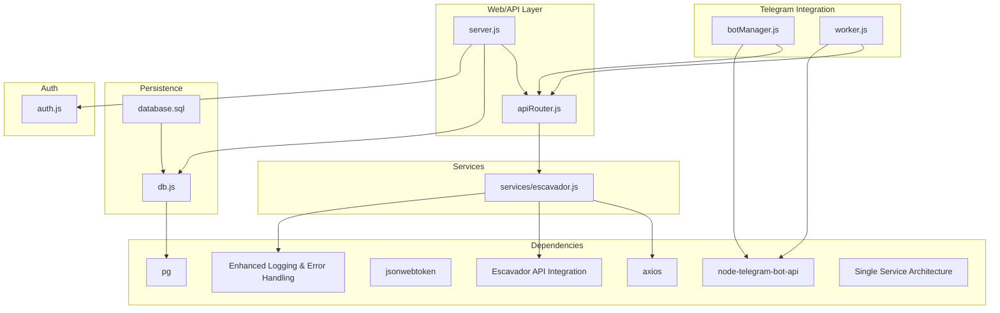
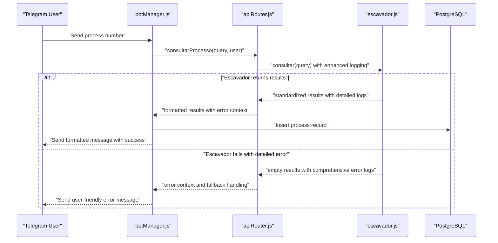
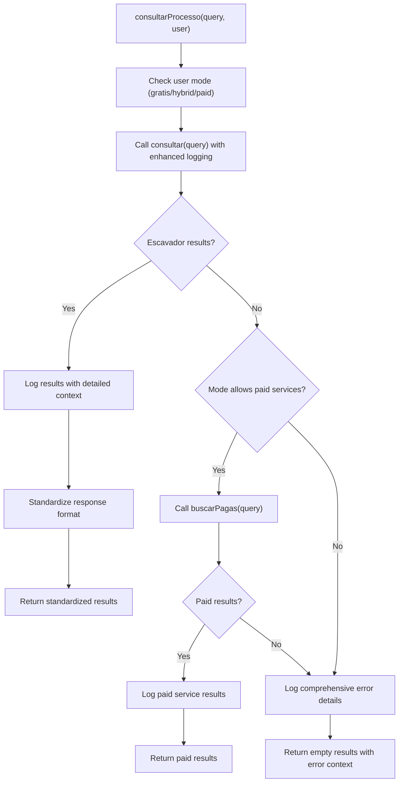
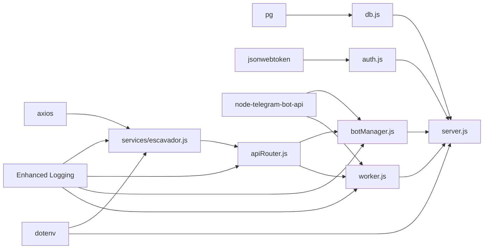

# DataJud Free Service Integration

<cite>
**Referenced Files in This Document**
- [escavador.js](file://services/escavador.js)
- [apiRouter.js](file://apiRouter.js)
- [botManager.js](file://botManager.js)
- [worker.js](file://worker.js)
- [server.js](file://server.js)
- [auth.js](file://auth.js)
- [db.js](file://db.js)
- [database.sql](file://database.sql)
- [package.json](file://package.json)
- [README.md](file://README.md)
- [parser.js](file://parser.js)
</cite>

## Update Summary
**Changes Made**
- Updated Escavador service documentation to reflect enhanced error handling and logging improvements
- Added detailed coverage of standardized response formats and improved error recovery mechanisms
- Enhanced troubleshooting guide with specific Escavador API error scenarios and resolution steps
- Updated service architecture diagrams to show improved error handling flow
- Added comprehensive logging examples and debugging strategies for Escavador integration
- Updated timeout management and retry mechanisms documentation

## Table of Contents
1. [Introduction](#introduction)
2. [Project Structure](#project-structure)
3. [Core Components](#core-components)
4. [Architecture Overview](#architecture-overview)
5. [Detailed Component Analysis](#detailed-component-analysis)
6. [Enhanced Error Handling and Logging](#enhanced-error-handling-and-logging)
7. [Dependency Analysis](#dependency-analysis)
8. [Performance Considerations](#performance-considerations)
9. [Troubleshooting Guide](#troubleshooting-guide)
10. [Conclusion](#conclusion)
11. [Appendices](#appendices)

## Introduction
This document explains the current judicial process monitoring system architecture with enhanced error handling and logging capabilities. The system uses a single primary service provider (Escavador) as the foundation for all free lookups, with comprehensive error handling, standardized response processing, and detailed logging for debugging and monitoring purposes. The previous architecture has been enhanced with improved error recovery mechanisms and consistent response formatting.

**Important**: The system now focuses exclusively on Escavador as the primary service provider with enhanced reliability and observability features.

## Project Structure
The system is organized around a Node.js backend with Express, PostgreSQL persistence, Telegram bot integrations, and service modules with enhanced error handling:
- Primary service module using Escavador with comprehensive error handling and logging
- API router orchestrating service lookups with standardized error propagation
- Telegram bot manager with improved error messages and user feedback
- Worker with enhanced monitoring and error reporting capabilities
- Authentication, database connection, and schema with comprehensive logging

**Diagram sources**
- [server.js:1-381](file://server.js#L1-L381)
- [apiRouter.js:1-64](file://apiRouter.js#L1-L64)
- [escavador.js:1-168](file://services/escavador.js#L1-L168)
- [botManager.js:1-228](file://botManager.js#L1-L228)
- [worker.js:1-74](file://worker.js#L1-L74)
- [db.js:1-19](file://db.js#L1-L19)
- [database.sql:1-25](file://database.sql#L1-L25)
- [auth.js:1-59](file://auth.js#L1-L59)
- [package.json:1-21](file://package.json#L1-L21)

**Section sources**
- [README.md:1-56](file://README.md#L1-L56)
- [package.json:1-21](file://package.json#L1-L21)

## Core Components
- **Enhanced Escavador service**: Performs comprehensive legal database searches with detailed logging, standardized response formats, and robust error handling mechanisms.
- **API router with error propagation**: Orchestrates service lookups with consistent error handling and standardized response processing.
- **Telegram bot manager**: Processes user messages with enhanced error feedback and improved user experience.
- **Worker with monitoring**: Periodically checks for updates with comprehensive error reporting and logging.
- **Authentication and persistence**: JWT-based auth with enhanced security logging and PostgreSQL storage with audit trails.

**Important**: All components now feature enhanced error handling and logging capabilities for improved reliability and debugging.

**Section sources**
- [escavador.js:1-168](file://services/escavador.js#L1-L168)
- [apiRouter.js:1-64](file://apiRouter.js#L1-L64)
- [botManager.js:1-228](file://botManager.js#L1-L228)
- [worker.js:1-74](file://worker.js#L1-L74)
- [auth.js:1-59](file://auth.js#L1-L59)
- [db.js:1-19](file://db.js#L1-L19)
- [database.sql:5-24](file://database.sql#L5-L24)

## Architecture Overview
The system maintains a single-service architecture with Escavador as the primary provider, now enhanced with comprehensive error handling and logging:
- **Primary service**: Escavador API with enhanced error handling, detailed logging, and standardized response processing
- **Service orchestration**: Single-point lookup with comprehensive error propagation and user-friendly error messages
- **Monitoring and logging**: Enhanced observability with detailed error logs and performance metrics

**Diagram sources**
- [botManager.js:125-201](file://botManager.js#L125-L201)
- [apiRouter.js:8-46](file://apiRouter.js#L8-L46)
- [escavador.js:39-59](file://services/escavador.js#L39-L59)
- [database.sql:18-24](file://database.sql#L18-L24)

## Detailed Component Analysis

### Enhanced Escavador Service
- **Comprehensive Error Handling**: Detailed error logging with status codes, response data, and error messages for debugging
- **Standardized Response Processing**: Consistent response format across all Escavador API endpoints with unified field mapping
- **Enhanced Logging**: Structured logging with contextual information for each API call and response type
- **Robust Timeout Management**: Configured timeouts for different API endpoints (15-30 seconds) with detailed error reporting
- **Dual API Version Support**: Automatic fallback between Escavador API v1 and v2 with comprehensive error handling
- **Result Normalization**: Converts diverse API responses into a standardized format with consistent field mapping

**Updated** Enhanced with comprehensive logging, standardized error handling, and improved response processing capabilities.

**Section sources**
- [escavador.js:13-168](file://services/escavador.js#L13-L168)

### API Router Orchestration
- **Standardized Error Propagation**: Consistent error handling across all service providers with detailed logging context
- **Enhanced Response Processing**: Unified response format regardless of service provider with standardized field mapping
- **Improved User Feedback**: Better error messages and user experience with contextual information
- **Logging Integration**: Comprehensive logging of all service interactions and error scenarios

**Updated** Enhanced with improved error handling, logging integration, and standardized response processing.

**Diagram sources**
- [apiRouter.js:8-46](file://apiRouter.js#L8-L46)
- [apiRouter.js:48-61](file://apiRouter.js#L48-L61)

**Section sources**
- [apiRouter.js:8-46](file://apiRouter.js#L8-L46)
- [apiRouter.js:48-61](file://apiRouter.js#L48-L61)

### Telegram Bot Manager
- **Enhanced Error Messages**: Comprehensive error reporting with specific Escavador API error context
- **Improved User Experience**: Better handling of various search types with detailed error messages and alternatives
- **Consistent Result Formatting**: Unified message formatting with standardized field presentation
- **Better Error Recovery**: More informative error messages guiding users to alternative search methods

**Updated** Enhanced with improved error handling, detailed logging, and better user feedback mechanisms.

**Section sources**
- [botManager.js:125-201](file://botManager.js#L125-L201)
- [botManager.js:145-162](file://botManager.js#L145-L162)

### Worker Monitoring
- **Enhanced Monitoring**: Improved error reporting and logging for service failures and user feedback
- **Better Error Recovery**: Comprehensive error handling with detailed logging for debugging
- **Reliable Notifications**: Consistent notification delivery with enhanced error reporting
- **Performance Monitoring**: Detailed logging of service performance and error rates

**Updated** Enhanced with comprehensive error handling, logging, and monitoring capabilities.

**Section sources**
- [worker.js:17-74](file://worker.js#L17-L74)

### Authentication and Authorization
- **JWT-based Authentication**: Enhanced security with comprehensive logging of authentication events
- **Role-based Access**: Admin and user role differentiation with audit trail logging
- **Password Security**: Enhanced password hashing and verification with security logging

**Section sources**
- [auth.js:1-59](file://auth.js#L1-L59)

### Database Schema and Persistence
- **User Configuration**: Stores user preferences, API keys, and mode settings with audit logging
- **Process Tracking**: Maintains monitored process records with status tracking and error logging
- **Connection Management**: Supports both local development and cloud deployment configurations with connection logging

**Section sources**
- [database.sql:5-24](file://database.sql#L5-L24)
- [db.js:1-19](file://db.js#L1-L19)

## Enhanced Error Handling and Logging

### Comprehensive Error Logging System
The Escavador service now features a sophisticated logging system with structured error reporting:

- **API Key Validation**: Clear logging indicating API key presence or absence with visual indicators
- **Request Context Logging**: Detailed logging of all API requests with query parameters and response status
- **Response Data Logging**: Structured logging of API responses with data truncation for security
- **Error Context Preservation**: Comprehensive error logging including status codes, response data, and error messages

### Standardized Response Processing
All Escavador responses are processed through a unified format:

- **Field Normalization**: Consistent field mapping across different response formats (numero, tribunal, classe, data)
- **Data Type Standardization**: Uniform data types and formats for all response fields
- **Missing Data Handling**: Graceful handling of missing or incomplete response data
- **Limitation Management**: Response size limiting (max 15 results) with clear logging

### Enhanced Timeout and Retry Management
- **Configured Timeouts**: Different timeout values for various Escavador endpoints (15-30 seconds)
- **Error Recovery**: Comprehensive error handling with detailed logging for debugging
- **Service Degradation**: Graceful fallback to alternative search methods when primary service fails
- **Resource Management**: Efficient handling of concurrent requests with proper cleanup

**Section sources**
- [escavador.js:13-168](file://services/escavador.js#L13-L168)

## Dependency Analysis
External libraries and their roles with enhanced error handling:
- **axios**: HTTP client for Escavador API with comprehensive timeout configuration and detailed error reporting
- **pg**: PostgreSQL client for database connectivity with enhanced logging and connection management
- **jsonwebtoken**: JWT signing and verification for authentication with security logging
- **node-telegram-bot-api**: Telegram bot integration for messaging and notifications with enhanced error handling
- **bcryptjs**: Password hashing and verification for secure authentication with security logging
- **dotenv**: Environment variable loading for service configuration with validation logging

**Updated** Dependencies now include comprehensive logging and error handling capabilities.

**Diagram sources**
- [package.json:11-19](file://package.json#L11-L19)
- [escavador.js:1](file://services/escavador.js#L1)
- [db.js:1](file://db.js#L1)
- [auth.js:1](file://auth.js#L1)
- [botManager.js:1](file://botManager.js#L1)
- [worker.js:1](file://worker.js#L1)
- [apiRouter.js:1-2](file://apiRouter.js#L1-L2)

**Section sources**
- [package.json:11-19](file://package.json#L11-L19)

## Performance Considerations
- **Network Latency**: Escavador API performance varies by region and load; implement appropriate timeout and retry strategies with comprehensive logging
- **Service Degradation**: Enhanced error handling for single points of failure with graceful degradation mechanisms
- **Caching Strategies**: Improved caching of user data and service responses with error logging for cache misses
- **Timeout Management**: Configured timeouts for different Escavador endpoints with detailed error reporting
- **Concurrent Operations**: Improved handling of concurrent user requests with better resource management and logging
- **Resource Optimization**: Reduced memory footprint with enhanced error handling and logging overhead

**Updated** Performance improvements include enhanced error handling and comprehensive logging capabilities.

## Troubleshooting Guide
Common issues and remedies with enhanced error handling:

### Escavador API Key Issues
- **API Key Validation**: Check ESCAVADOR_API_KEY environment variable with detailed logging output
- **API Key Status**: Verify API key validity and service availability through Escavador's status page
- **Rate Limit Monitoring**: Monitor API rate limits and adjust request frequency with error logging
- **Configuration Verification**: Validate API key format and service availability with comprehensive logging

### Enhanced Error Scenarios
- **API Key Not Configured**: Clear logging indicates missing API key with visual indicators
- **Process Not Found**: Detailed logging for 404 errors with specific error context
- **Network Timeouts**: Comprehensive timeout logging with different timeout values (15-30 seconds)
- **Service Unavailable**: Detailed error logging with status codes and response data

### Search Results Issues
- **Process Number Format**: Verify CNJ format (20 digits) with detailed logging of validation errors
- **Escavador Database Status**: Check if process exists in Escavador's database with comprehensive logging
- **Alternative Search Methods**: Try OAB, CPF, or text search with detailed error reporting
- **Response Processing Errors**: Handle malformed responses with standardized error logging

### Telegram Notifications Issues
- **Bot Configuration**: Confirm bot token and Telegram ID are configured for the user with logging
- **Worker Status**: Verify the worker is running and has access to the database with error logging
- **Telegram Bot Availability**: Check Telegram bot availability and user privacy settings with comprehensive logging
- **Notification Delivery**: Monitor notification delivery with detailed error reporting

### Authentication Failures
- **JWT Secret Configuration**: Ensure JWT secret is configured and tokens are valid with security logging
- **Token Validation**: Check that clients send Authorization headers with bearer tokens with authentication logging
- **User Status**: Verify user account status and permissions with audit trail logging

### Enhanced Error Resolution Steps
1. **Enable Debug Logging**: Check console output for detailed error logs and API response information
2. **Verify API Configuration**: Confirm ESCAVADOR_API_KEY is properly set with validation logging
3. **Test API Connectivity**: Manually test Escavador API endpoints with detailed error reporting
4. **Monitor Error Patterns**: Analyze error logs to identify recurring issues and patterns
5. **Implement Fallback Strategies**: Use alternative search methods when primary service fails with comprehensive logging

**Updated** Troubleshooting now includes comprehensive error logging, detailed API response analysis, and enhanced debugging capabilities.

**Section sources**
- [apiRouter.js:15-46](file://apiRouter.js#L15-L46)
- [botManager.js:145-162](file://botManager.js#L145-L162)
- [worker.js:45-64](file://worker.js#L45-L64)
- [auth.js:17-31](file://auth.js#L17-L31)
- [escavador.js:77-83](file://services/escavador.js#L77-L83)
- [escavador.js:119-128](file://services/escavador.js#L119-L128)

## Conclusion
The system has been successfully enhanced with comprehensive error handling, logging, and standardized response processing capabilities. The single-service architecture using Escavador as the primary provider now features robust error recovery mechanisms, detailed logging for debugging, and consistent response formatting. These enhancements improve system reliability, debugging capabilities, and user experience while maintaining the simplified architecture that eliminates the complexity of managing multiple service integrations.

**Important**: The enhanced system provides improved observability, better error handling, and more reliable service operation through comprehensive logging and standardized error processing.

## Appendices

### API Service Architecture and Endpoints
- **Primary Service Provider**: Escavador API as the foundation for all free lookups with enhanced error handling
- **Unified Search Interface**: Single endpoint handles process numbers, OAB searches, CPF/CNPJ, and text-based searches with standardized processing
- **Dual API Version Support**: Automatic fallback between Escavador API v1 and v2 with comprehensive error logging
- **Standardized Response Format**: Consistent result structure across all search types with detailed field normalization
- **Enhanced Error Handling**: Comprehensive error handling with detailed logging and graceful degradation

**Updated** Architecture now includes comprehensive error handling, logging, and standardized response processing.

**Section sources**
- [escavador.js:39-59](file://services/escavador.js#L39-L59)
- [escavador.js:87-131](file://services/escavador.js#L87-L131)
- [apiRouter.js:15-46](file://apiRouter.js#L15-L46)

### Request Formatting and Response Parsing
- **Unified Query Interface**: Single query object supports multiple search types with enhanced validation
- **Escavador API Integration**: Comprehensive support for all Escavador endpoints with automatic version detection and detailed logging
- **Standardized Response Format**: Consistent result structure with number, tribunal, class, and date fields with field normalization
- **Enhanced Error Handling**: Comprehensive error handling with detailed logging and graceful degradation
- **Timeout Management**: Configured timeouts for different API endpoints with detailed error reporting

**Updated** Response parsing now includes comprehensive error handling, logging, and standardized field processing.

**Section sources**
- [escavador.js:16-36](file://services/escavador.js#L16-L36)
- [escavador.js:87-131](file://services/escavador.js#L87-L131)
- [escavador.js:134-161](file://services/escavador.js#L134-L161)

### Service Limitations, Rate Limits, and Usage Constraints
- **Escavador API Limits**: Subject to Escavador's rate limits and service availability with comprehensive logging
- **Mode Configuration**: Users can select gratis, hybrid, or paid modes; paid services are user-configured with enhanced error handling
- **Monitoring Cadence**: Worker runs every 5 minutes with improved caching strategies and error reporting
- **Service Reliability**: Single-service architecture reduces complexity but requires robust error handling with comprehensive logging

**Updated** Service limitations now include comprehensive error logging and monitoring capabilities.

**Section sources**
- [database.sql:13-14](file://database.sql#L13-L14)
- [worker.js:67-74](file://worker.js#L67-L74)
- [escavador.js:54-55](file://services/escavador.js#L54-L55)

### Enhanced Timeout Management and Retry Mechanisms
- **Configured Timeouts**: Different timeout values for various Escavador endpoints (15-30 seconds) with detailed error logging
- **Error Recovery**: Comprehensive error handling with detailed logging for debugging and error analysis
- **Service Degradation**: Graceful fallback to alternative search methods when primary service fails with comprehensive error reporting
- **Resource Management**: Efficient handling of concurrent requests with proper cleanup and resource logging

**Updated** Timeout and retry mechanisms now include comprehensive error logging, debugging capabilities, and enhanced resource management.

**Section sources**
- [escavador.js:54-55](file://services/escavador.js#L54-L55)
- [escavador.js:109-131](file://services/escavador.js#L109-L131)
- [escavador.js:143-161](file://services/escavador.js#L143-L161)

### Enhanced Service Availability Monitoring and Fallback Triggering
- **Availability Monitoring**: Worker monitors process updates using Escavador as the primary provider with comprehensive error reporting
- **Fallback Strategy**: Simplified fallback to paid services only when user has configured API keys with enhanced error handling
- **Error Reporting**: Enhanced error reporting for service failures and user feedback with detailed logging
- **Service Health Checks**: Regular monitoring of service availability and performance with comprehensive logging

**Updated** Fallback mechanisms now include comprehensive error handling, logging, and user feedback capabilities.

**Section sources**
- [worker.js:45-64](file://worker.js#L45-L64)
- [apiRouter.js:38-46](file://apiRouter.js#L38-L46)

### Enhanced Practical Integration Patterns
- **Telegram Message Flow**: User sends various query types; bot routes to Escavador for processing with enhanced error handling
- **Worker Loop**: Periodic checks compare last known status and notify users of changes with comprehensive error reporting
- **Database Persistence**: Consistent storage of results from Escavador API responses with audit logging
- **User Configuration**: Flexible user settings for API keys and service preferences with enhanced validation
- **Error Handling**: Comprehensive error handling with user-friendly messages and detailed logging

**Updated** Integration patterns now include comprehensive error handling, logging, and user feedback mechanisms.

**Section sources**
- [botManager.js:125-201](file://botManager.js#L125-L201)
- [worker.js:17-74](file://worker.js#L17-L74)
- [database.sql:18-24](file://database.sql#L18-L24)

### Enhanced Environment Configuration
- **Escavador API Key**: Configure ESCAVADOR_API_KEY environment variable for primary service access with validation logging
- **Database Configuration**: Support for DATABASE_URL or individual connection variables with connection logging
- **JWT Secret**: Configure JWT_SECRET environment variable for authentication with security logging
- **Telegram Configuration**: Bot tokens and Telegram IDs stored per user for personalized notifications with enhanced error handling
- **Logging Configuration**: Enhanced logging levels and error reporting for debugging and monitoring

**Updated** Environment configuration now includes comprehensive logging, validation, and error reporting capabilities.

**Section sources**
- [escavador.js:3-7](file://services/escavador.js#L3-L7)
- [db.js:5-16](file://db.js#L5-L16)
- [auth.js:5](file://auth.js#L5)
- [server.js:290-295](file://server.js#L290-L295)

### Enhanced Logging and Debugging Reference
- **API Key Status Logging**: Visual indicators for API key configuration with detailed logging
- **Request/Response Logging**: Structured logging of all API interactions with data truncation for security
- **Error Context Logging**: Comprehensive error logging with status codes, response data, and error messages
- **Performance Monitoring**: Detailed logging of service performance and error rates
- **Debug Information**: Enhanced debugging capabilities with comprehensive error context and resolution guidance

**Updated** Logging and debugging now include comprehensive error handling, performance monitoring, and detailed debugging capabilities.

**Section sources**
- [escavador.js:13-19](file://services/escavador.js#L13-L19)
- [escavador.js:77-83](file://services/escavador.js#L77-L83)
- [escavador.js:119-128](file://services/escavador.js#L119-L128)
- [apiRouter.js:15-36](file://apiRouter.js#L15-L36)
- [botManager.js:196-200](file://botManager.js#L196-L200)