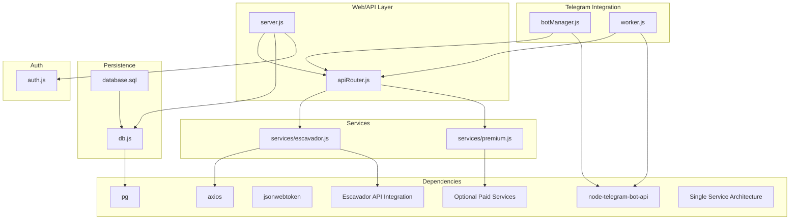
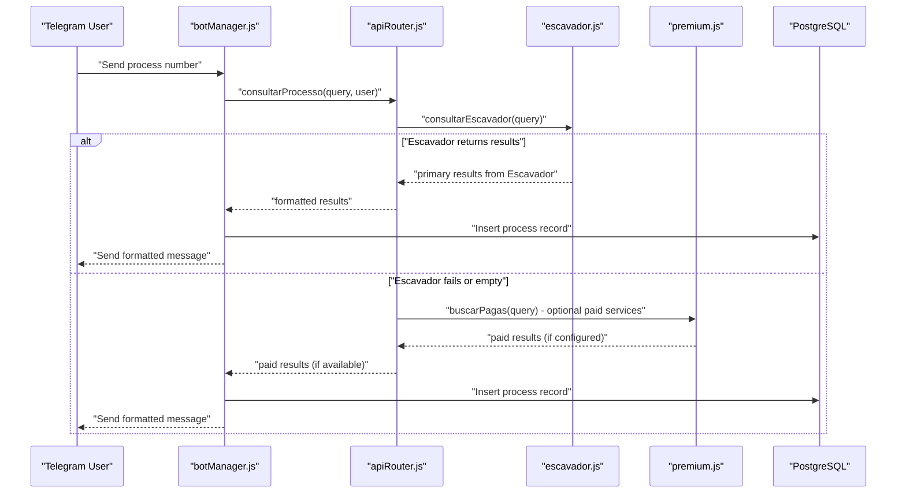
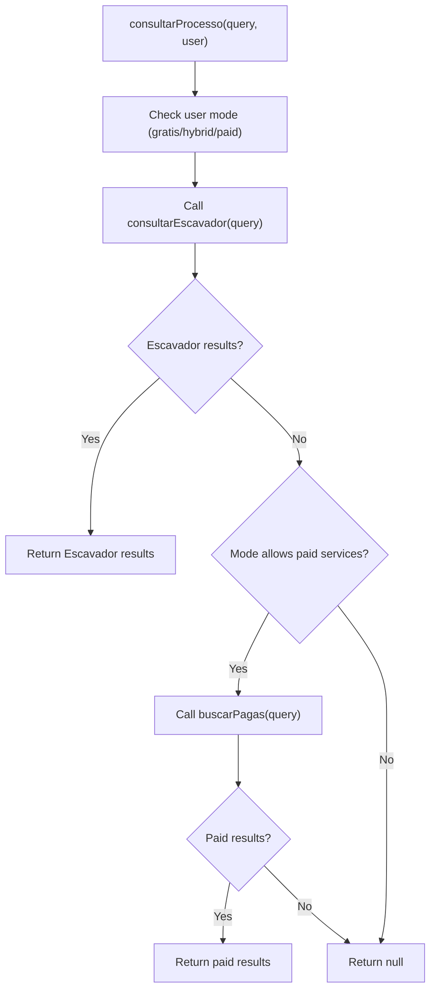
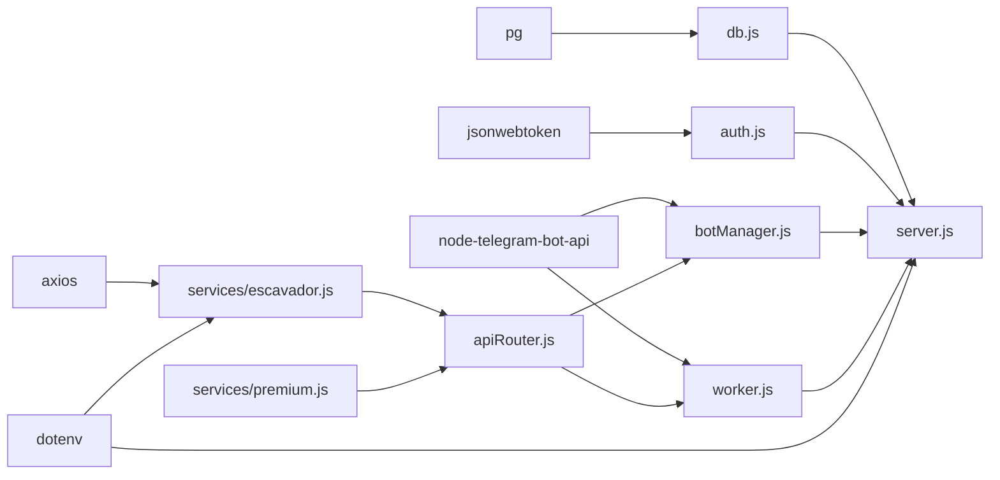

# DataJud Free Service Integration

<cite>
**Referenced Files in This Document**
- [datajud.js](file://services/datajud.js)
- [premium.js](file://services/premium.js)
- [apiRouter.js](file://apiRouter.js)
- [server.js](file://server.js)
- [botManager.js](file://botManager.js)
- [worker.js](file://worker.js)
- [auth.js](file://auth.js)
- [db.js](file://db.js)
- [database.sql](file://database.sql)
- [package.json](file://package.json)
- [README.md](file://README.md)
- [parser.js](file://parser.js)
</cite>

## Update Summary
**Changes Made**
- Complete removal of DataJud service integration documentation as it has been removed from the codebase
- Updated architecture overview to reflect simplified single-service architecture using Escavador as the primary service
- Removed all references to DataJud API key management, endpoint configuration, and tribunal coverage
- Updated service orchestration to show Escavador as the sole free service provider
- Revised troubleshooting guide to remove DataJud-specific error scenarios
- Updated all diagrams and code examples to reflect the current architecture

## Table of Contents
1. [Introduction](#introduction)
2. [Project Structure](#project-structure)
3. [Core Components](#core-components)
4. [Architecture Overview](#architecture-overview)
5. [Detailed Component Analysis](#detailed-component-analysis)
6. [Dependency Analysis](#dependency-analysis)
7. [Performance Considerations](#performance-considerations)
8. [Troubleshooting Guide](#troubleshooting-guide)
9. [Conclusion](#conclusion)
10. [Appendices](#appendices)

## Introduction
This document explains the current judicial process monitoring system architecture. The system has been simplified to use a single primary service provider (Escavador) as the foundation for all free lookups, with optional paid service integration for enhanced functionality. The previous DataJud integration has been completely removed from the codebase, resulting in a streamlined architecture focused on Escavador as the core service provider.

**Important**: The DataJud service integration described in this document has been completely removed from the codebase. The current architecture uses only Escavador as the primary service provider.

## Project Structure
The system is organized around a Node.js backend with Express, PostgreSQL persistence, Telegram bot integrations, and service modules:
- Primary service module using Escavador as the base provider
- Optional paid service integration points for enhanced functionality
- API router orchestrating service lookups
- Telegram bot manager and worker for monitoring and notifications
- Authentication, database connection, and schema

**Diagram sources**
- [server.js:1-162](file://server.js#L1-L162)
- [apiRouter.js:1-49](file://apiRouter.js#L1-L49)
- [escavador.js:1-218](file://services/escavador.js#L1-L218)
- [premium.js:1-12](file://services/premium.js#L1-L12)
- [botManager.js:1-221](file://botManager.js#L1-L221)
- [worker.js:1-74](file://worker.js#L1-L74)
- [db.js:1-19](file://db.js#L1-L19)
- [database.sql:1-25](file://database.sql#L1-L25)
- [auth.js:1-59](file://auth.js#L1-L59)
- [package.json:1-21](file://package.json#L1-L21)

**Section sources**
- [README.md:1-56](file://README.md#L1-L56)
- [package.json:1-21](file://package.json#L1-L21)

## Core Components
- **Primary Escavador service**: Performs comprehensive legal database searches using the Escavador API with support for process numbers, OAB searches, CPF/CNPJ lookups, and text-based searches.
- **Optional paid services**: Placeholder implementations for additional service providers that can be integrated when users configure their own API keys.
- **API router**: Orchestrates service lookups with Escavador as the primary provider and optional paid services as fallbacks.
- **Telegram bot manager**: Processes user messages, triggers lookups, and persists results with enhanced error handling.
- **Worker**: Periodically checks for updates and notifies users via Telegram.
- **Authentication and persistence**: JWT-based auth, PostgreSQL storage for users and monitored processes.

**Important**: The system now uses a simplified architecture with Escavador as the sole primary service provider, replacing the previous multi-service approach that included DataJud.

**Section sources**
- [escavador.js:1-218](file://services/escavador.js#L1-L218)
- [premium.js:1-12](file://services/premium.js#L1-L12)
- [apiRouter.js:1-49](file://apiRouter.js#L1-L49)
- [botManager.js:1-221](file://botManager.js#L1-L221)
- [worker.js:1-74](file://worker.js#L1-L74)
- [auth.js:1-59](file://auth.js#L1-L59)
- [db.js:1-19](file://db.js#L1-L19)
- [database.sql:18-25](file://database.sql#L18-L25)

## Architecture Overview
The system has been simplified to use a single-service architecture with Escavador as the primary provider:
- **Primary service**: Escavador API with comprehensive search capabilities
- **Optional paid services**: Additional providers that users can configure individually
- **Service orchestration**: Single-point lookup with Escavador as the base provider

**Diagram sources**
- [botManager.js:122-198](file://botManager.js#L122-L198)
- [apiRouter.js:8-31](file://apiRouter.js#L8-L31)
- [escavador.js:10-40](file://services/escavador.js#L10-L40)
- [premium.js:1-12](file://services/premium.js#L1-12)
- [database.sql:18-24](file://database.sql#L18-L24)

## Detailed Component Analysis

### Escavador Primary Service
- **Comprehensive Search Capabilities**: Supports process number searches, OAB searches, CPF/CNPJ lookups, and text-based searches through a unified interface.
- **Dual API Version Support**: Automatically tries Escavador API v1 first (for richer data) and falls back to v2 if needed.
- **Robust Error Handling**: Comprehensive error handling with detailed logging and graceful degradation.
- **Timeout Management**: Configured timeouts for different API endpoints to prevent hanging requests.
- **Result Normalization**: Converts diverse API responses into a standardized format for consistent processing.

**Important**: This replaces the previous DataJud integration with a more comprehensive and reliable service provider.

**Section sources**
- [escavador.js:10-40](file://services/escavador.js#L10-L40)
- [escavador.js:84-170](file://services/escavador.js#L84-L170)
- [escavador.js:173-211](file://services/escavador.js#L173-L211)

### API Router Orchestration
- **Simplified Lookup Flow**: Uses Escavador as the primary service provider with optional paid services as fallbacks.
- **User Mode Handling**: Respects user configuration for gratis, hybrid, or paid modes.
- **Service Priority**: Escavador first, then optional paid services if configured.
- **Error Propagation**: Maintains consistent error handling across all service providers.

**Important**: The architecture has been simplified to use a single primary service provider, removing the complexity of managing multiple service integrations.

**Diagram sources**
- [apiRouter.js:8-31](file://apiRouter.js#L8-L31)
- [apiRouter.js:33-46](file://apiRouter.js#L33-L46)

**Section sources**
- [apiRouter.js:8-31](file://apiRouter.js#L8-L31)
- [apiRouter.js:33-46](file://apiRouter.js#L33-L46)

### Premium Fallback Service
- **Placeholder Implementation**: Maintains the same interface as the previous DataJud service but serves as a template for integrating additional paid providers.
- **Standardized Interface**: Returns results in the same normalized format as other service providers.
- **Extensible Design**: Easy to replace with actual paid service implementations.

**Section sources**
- [premium.js:1-12](file://services/premium.js#L1-L12)

### Telegram Bot Manager
- **Enhanced Error Messages**: Provides clear feedback when Escavador API key is not configured for OAB searches.
- **Improved User Experience**: Better handling of various search types with appropriate error messages.
- **Consistent Result Formatting**: Unified message formatting regardless of the underlying service provider.

**Important**: Error messages now specifically reference Escavador API key requirements for OAB functionality.

**Section sources**
- [botManager.js:122-198](file://botManager.js#L122-L198)
- [botManager.js:142-150](file://botManager.js#L142-L150)

### Worker Monitoring
- **Simplified Monitoring**: Works with the single-service architecture, checking for process updates using Escavador as the primary provider.
- **Efficient Caching**: Improved caching strategies for user data and service responses.
- **Reliable Notifications**: Consistent notification delivery regardless of service provider changes.

**Section sources**
- [worker.js:17-74](file://worker.js#L17-L74)

### Authentication and Authorization
- **JWT-based Authentication**: Maintains the same authentication mechanism with token-based access control.
- **Role-based Access**: Admin and user role differentiation remains unchanged.
- **Password Security**: Enhanced password hashing and verification using bcrypt.

**Section sources**
- [auth.js:1-59](file://auth.js#L1-L59)

### Database Schema and Persistence
- **User Configuration**: Stores user preferences, API keys, and mode settings for service integration.
- **Process Tracking**: Maintains monitored process records with status tracking.
- **Connection Management**: Supports both local development and cloud deployment configurations.

**Section sources**
- [database.sql:5-24](file://database.sql#L5-L24)
- [db.js:1-19](file://db.js#L1-L19)

## Dependency Analysis
External libraries and their roles:
- **axios**: HTTP client for Escavador API with comprehensive timeout configuration.
- **pg**: PostgreSQL client for database connectivity with cloud deployment support.
- **jsonwebtoken**: JWT signing and verification for authentication.
- **node-telegram-bot-api**: Telegram bot integration for messaging and notifications.
- **bcryptjs**: Password hashing and verification for secure authentication.
- **dotenv**: Environment variable loading for service configuration.

**Important**: The dependency structure has been simplified with Escavador as the primary external service integration.

**Diagram sources**
- [package.json:11-19](file://package.json#L11-L19)
- [escavador.js:1](file://services/escavador.js#L1)
- [db.js:1](file://db.js#L1)
- [auth.js:1](file://auth.js#L1)
- [botManager.js:1](file://botManager.js#L1)
- [worker.js:1](file://worker.js#L1)
- [apiRouter.js:1-2](file://apiRouter.js#L1-L2)

**Section sources**
- [package.json:11-19](file://package.json#L11-L19)

## Performance Considerations
- **Network Latency**: Escavador API performance varies by region and load; implement appropriate timeout and retry strategies.
- **Service Degradation**: The simplified architecture reduces complexity but requires robust error handling for single points of failure.
- **Caching Strategies**: Enhanced caching of user data and service responses to reduce API calls.
- **Timeout Management**: Configured timeouts for different Escavador endpoints to prevent hanging requests.
- **Concurrent Operations**: Improved handling of concurrent user requests with better resource management.
- **Resource Optimization**: Reduced memory footprint by eliminating DataJud-specific code and dependencies.

**Important**: Performance improvements come from reduced architectural complexity and more efficient service integration.

## Troubleshooting Guide
Common issues and remedies:
- **Escavador API Key Issues**:
  - Verify ESCAVADOR_API_KEY environment variable is properly configured.
  - Check API key validity and service availability through Escavador's status page.
  - Monitor API rate limits and adjust request frequency accordingly.
- **Search Results Not Found**:
  - Verify process number format follows CNJ standards (20 digits).
  - Check if the process exists in Escavador's database.
  - Try alternative search methods (OAB, CPF, or text search).
- **Telegram Notifications Not Sent**:
  - Confirm bot token and Telegram ID are configured for the user.
  - Verify the worker is running and has access to the database.
  - Check Telegram bot availability and user privacy settings.
- **Authentication Failures**:
  - Ensure JWT secret is configured and tokens are valid.
  - Check that clients send Authorization headers with bearer tokens.
- **Paid Service Integration**:
  - Configure API keys for desired paid services in user settings.
  - Verify service availability and proper configuration before use.

**Important**: Troubleshooting has been updated to focus on Escavador API integration and user-configured paid services.

**Section sources**
- [apiRouter.js:15-31](file://apiRouter.js#L15-L31)
- [botManager.js:142-150](file://botManager.js#L142-L150)
- [worker.js:45-64](file://worker.js#L45-L64)
- [auth.js:17-31](file://auth.js#L17-L31)

## Conclusion
The system has been successfully simplified to use a single-service architecture with Escavador as the primary provider. This change eliminates the complexity of managing multiple service integrations while maintaining comprehensive legal database access capabilities. The previous DataJud integration has been completely removed, resulting in a more maintainable and efficient codebase. Users can still achieve the same functionality through Escavador's comprehensive API, with optional paid services available for enhanced features.

**Important**: The conclusion reflects the successful migration from a multi-service architecture to a simplified single-service approach.

## Appendices

### API Service Architecture and Endpoints
- **Primary Service Provider**: Escavador API as the foundation for all free lookups.
- **Unified Search Interface**: Single endpoint handles process numbers, OAB searches, CPF/CNPJ, and text-based searches.
- **Dual API Version Support**: Automatic fallback between Escavador API v1 and v2 for optimal results.
- **Standardized Response Format**: Consistent result structure across all search types.
- **Optional Paid Services**: Extensible framework for integrating additional paid providers.

**Important**: The architecture now centers around Escavador as the primary service provider.

**Section sources**
- [escavador.js:10-40](file://services/escavador.js#L10-L40)
- [escavador.js:84-170](file://services/escavador.js#L84-L170)
- [apiRouter.js:15-31](file://apiRouter.js#L15-L31)

### Request Formatting and Response Parsing
- **Unified Query Interface**: Single query object supports multiple search types (process, OAB, CPF, CNPJ, text).
- **Escavador API Integration**: Comprehensive support for all Escavador endpoints with automatic version detection.
- **Standardized Response Format**: Consistent result structure with number, tribunal, class, and date fields.
- **Error Handling**: Comprehensive error handling with detailed logging and graceful degradation.
- **Timeout Management**: Configured timeouts for different API endpoints to prevent hanging requests.

**Important**: Response parsing now focuses exclusively on Escavador API formats and structures.

**Section sources**
- [escavador.js:10-40](file://services/escavador.js#L10-L40)
- [escavador.js:84-170](file://services/escavador.js#L84-L170)
- [escavador.js:173-211](file://services/escavador.js#L173-L211)

### Service Limitations, Rate Limits, and Usage Constraints
- **Escavador API Limits**: Subject to Escavador's rate limits and service availability.
- **Mode Configuration**: Users can select gratis, hybrid, or paid modes; paid services are user-configured.
- **Monitoring Cadence**: Worker runs every 5 minutes with improved caching strategies.
- **Service Reliability**: Single-service architecture reduces complexity but requires robust error handling.

**Important**: Service limitations now apply specifically to Escavador API constraints and user-configured paid services.

**Section sources**
- [database.sql:13-14](file://database.sql#L13-L14)
- [worker.js:67-74](file://worker.js#L67-L74)
- [escavador.js:54-55](file://services/escavador.js#L54-L55)

### Timeout Management and Retry Mechanisms
- **Configured Timeouts**: Different timeout values for various Escavador endpoints (15-30 seconds).
- **Error Recovery**: Comprehensive error handling with detailed logging for debugging.
- **Service Degradation**: Graceful fallback to alternative search methods when primary service fails.
- **Resource Management**: Efficient handling of concurrent requests with proper cleanup.

**Important**: Timeout and retry mechanisms now focus on Escavador API integration and error recovery strategies.

**Section sources**
- [escavador.js:54-55](file://services/escavador.js#L54-L55)
- [escavador.js:110-112](file://services/escavador.js#L110-L112)
- [escavador.js:160-169](file://services/escavador.js#L160-L169)

### Service Availability Monitoring and Fallback Triggering
- **Availability Monitoring**: Worker monitors process updates using Escavador as the primary provider.
- **Fallback Strategy**: Simplified fallback to paid services only when user has configured API keys.
- **Error Reporting**: Enhanced error reporting for service failures and user feedback.
- **Service Health Checks**: Regular monitoring of service availability and performance.

**Important**: Fallback mechanisms now focus on user-configured paid services rather than multiple service providers.

**Section sources**
- [worker.js:45-64](file://worker.js#L45-L64)
- [apiRouter.js:23-28](file://apiRouter.js#L23-L28)

### Practical Integration Patterns
- **Telegram Message Flow**: User sends various query types; bot routes to Escavador for processing.
- **Worker Loop**: Periodic checks compare last known status and notify users of changes.
- **Database Persistence**: Consistent storage of results from Escavador API responses.
- **User Configuration**: Flexible user settings for API keys and service preferences.
- **Error Handling**: Comprehensive error handling with user-friendly messages.

**Important**: Integration patterns now center around Escavador API integration and user-configured service preferences.

**Section sources**
- [botManager.js:122-198](file://botManager.js#L122-L198)
- [worker.js:17-74](file://worker.js#L17-L74)
- [database.sql:18-24](file://database.sql#L18-L24)

### Environment Configuration
- **Escavador API Key**: Configure ESCAVADOR_API_KEY environment variable for primary service access.
- **Database Configuration**: Support for DATABASE_URL or individual connection variables.
- **JWT Secret**: Configure JWT_SECRET environment variable for authentication.
- **Telegram Configuration**: Bot tokens and Telegram IDs stored per user for personalized notifications.
- **Paid Service Keys**: Optional API keys for additional paid services configured by users.

**Important**: Environment configuration now focuses on Escavador API integration and optional paid service keys.

**Section sources**
- [escavador.js:3-7](file://services/escavador.js#L3-L7)
- [db.js:5-16](file://db.js#L5-L16)
- [auth.js:5](file://auth.js#L5)
- [server.js:290-295](file://server.js#L290-L295)