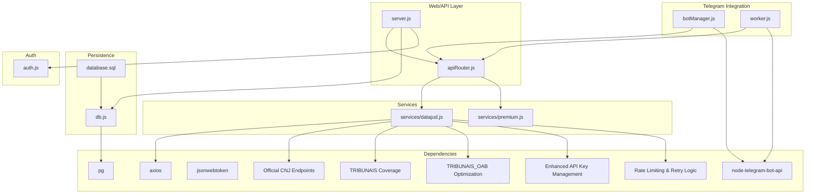
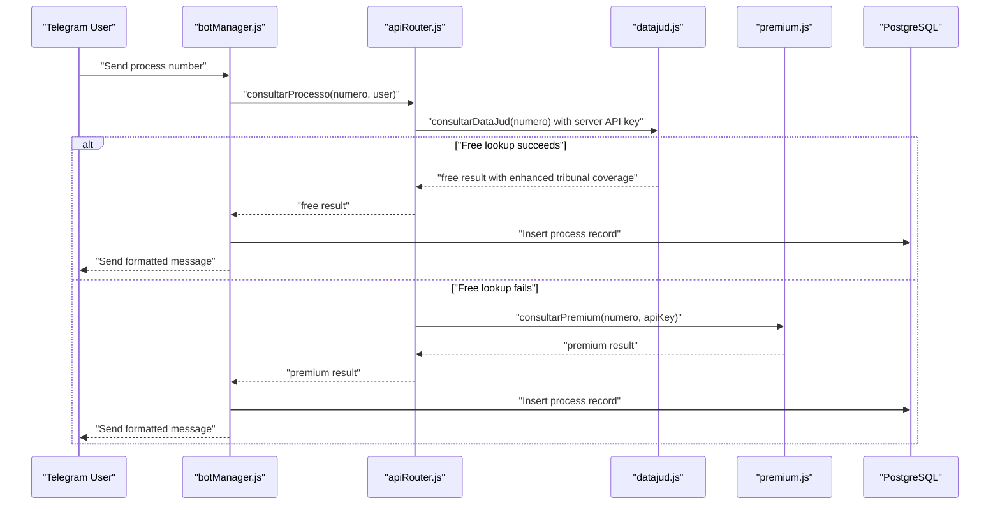
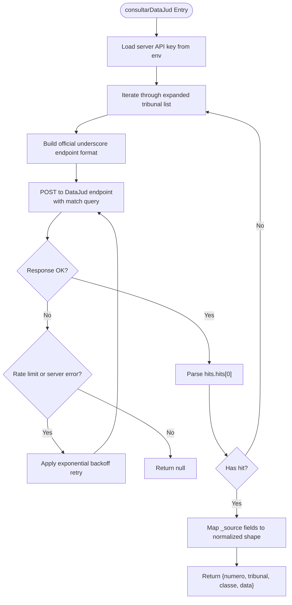
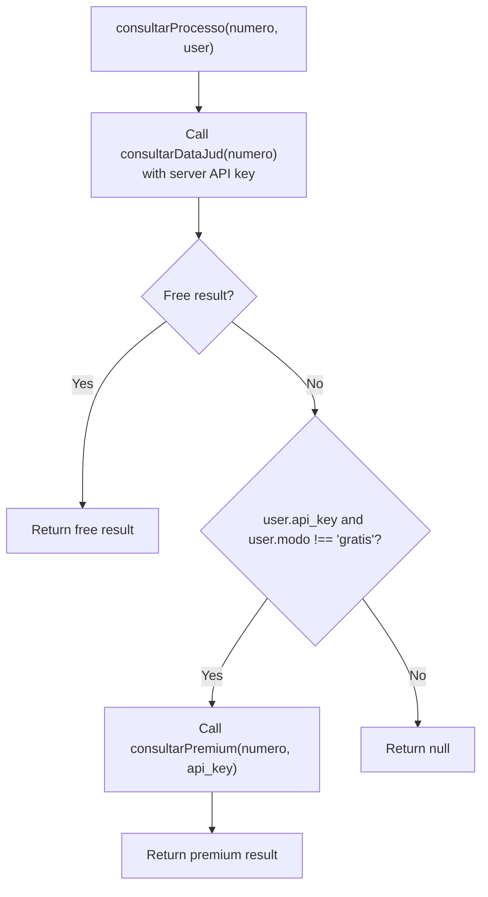
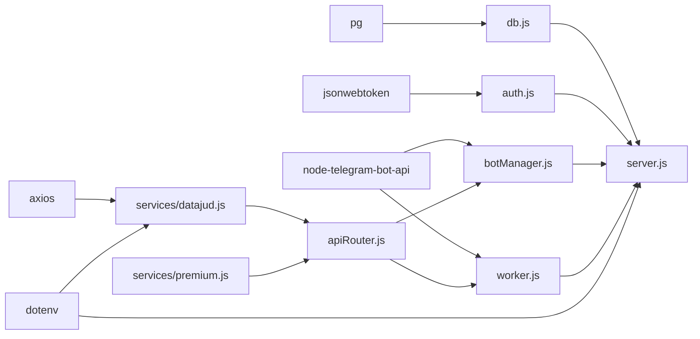

# DataJud Free Service Integration

<cite>
**Referenced Files in This Document**
- [datajud.js](file://services/datajud.js)
- [premium.js](file://services/premium.js)
- [apiRouter.js](file://apiRouter.js)
- [server.js](file://server.js)
- [botManager.js](file://botManager.js)
- [worker.js](file://worker.js)
- [auth.js](file://auth.js)
- [db.js](file://db.js)
- [database.sql](file://database.sql)
- [package.json](file://package.json)
- [README.md](file://README.md)
- [parser.js](file://parser.js)
</cite>

## Update Summary
**Changes Made**
- Updated API key management section to reflect server-level environment variable configuration
- Corrected endpoint URL formatting documentation to use official underscore format
- Expanded tribunal coverage documentation to include TRF2, STJ, and TST
- Updated OAB search optimization documentation to reflect state-level tribunal focus
- Revised search algorithm documentation to remove wildcard query functionality
- Enhanced error handling and retry mechanisms documentation

## Table of Contents
1. [Introduction](#introduction)
2. [Project Structure](#project-structure)
3. [Core Components](#core-components)
4. [Architecture Overview](#architecture-overview)
5. [Detailed Component Analysis](#detailed-component-analysis)
6. [Dependency Analysis](#dependency-analysis)
7. [Performance Considerations](#performance-considerations)
8. [Troubleshooting Guide](#troubleshooting-guide)
9. [Conclusion](#conclusion)
10. [Appendices](#appendices)

## Introduction
This document explains the free DataJud (CNJ) integration within the judicial process monitoring system. It covers the API service architecture, request formatting, response parsing, endpoint configuration, error handling, timeouts, retries, and usage constraints for the free tier. It also documents fallback mechanisms to a paid service, monitoring and alerting via Telegram, and operational guidance for reliability and performance.

**Updated** Enhanced API key management now uses server-level environment variables for improved security and centralized configuration.

## Project Structure
The system is organized around a Node.js backend with Express, PostgreSQL persistence, Telegram bot integrations, and two service modules:
- Free service module for DataJud CNJ with enhanced API key management
- Premium fallback service module
- API router orchestrating free and premium lookups
- Telegram bot manager and worker for monitoring and notifications
- Authentication, database connection, and schema

**Diagram sources**
- [server.js:1-162](file://server.js#L1-L162)
- [apiRouter.js:1-19](file://apiRouter.js#L1-L19)
- [datajud.js:1-32](file://services/datajud.js#L1-L32)
- [premium.js:1-12](file://services/premium.js#L1-L12)
- [botManager.js:1-53](file://botManager.js#L1-L53)
- [worker.js:1-70](file://worker.js#L1-L70)
- [db.js:1-11](file://db.js#L1-L11)
- [database.sql:1-25](file://database.sql#L1-L25)
- [auth.js:1-59](file://auth.js#L1-L59)
- [package.json:1-21](file://package.json#L1-L21)

**Section sources**
- [README.md:1-56](file://README.md#L1-L56)
- [package.json:1-21](file://package.json#L1-L21)

## Core Components
- Free DataJud service: Performs a POST search against the CNJ public API endpoint with enhanced server-level API key management and optimized tribunal coverage.
- Premium fallback service: Placeholder for a paid provider; returns a standardized response shape.
- API router: Attempts free lookup first, then falls back to premium if configured.
- Telegram bot manager: Processes user messages, triggers lookups, and persists results.
- Worker: Periodically checks for updates and notifies users via Telegram.
- Authentication and persistence: JWT-based auth, PostgreSQL storage for users and monitored processes.

**Updated** Enhanced API key management now uses server-level environment variables for centralized configuration and improved security.

**Section sources**
- [datajud.js:1-32](file://services/datajud.js#L1-L32)
- [premium.js:1-12](file://services/premium.js#L1-L12)
- [apiRouter.js:1-19](file://apiRouter.js#L1-L19)
- [botManager.js:1-53](file://botManager.js#L1-L53)
- [worker.js:1-70](file://worker.js#L1-L70)
- [auth.js:1-59](file://auth.js#L1-L59)
- [db.js:1-11](file://db.js#L1-L11)
- [database.sql:18-25](file://database.sql#L18-L25)

## Architecture Overview
The system integrates Telegram users with a two-tier lookup pipeline featuring enhanced API key management and optimized tribunal coverage:
- Free tier: DataJud CNJ public API with server-level API key management
- Paid fallback: Premium provider (placeholder)

**Diagram sources**
- [botManager.js:13-39](file://botManager.js#L13-L39)
- [apiRouter.js:4-16](file://apiRouter.js#L4-L16)
- [datajud.js:3-29](file://services/datajud.js#L3-L29)
- [premium.js:1-9](file://services/premium.js#L1-L9)
- [database.sql:18-24](file://database.sql#L18-L24)

## Detailed Component Analysis

### DataJud Free Service
- **Enhanced API Key Management**: Uses server-level API key from environment variables (`DATAJUD_API_KEY`) for centralized configuration and improved security.
- **Endpoint Configuration**: Correctly formatted using official CNJ underscore format: `api_publica_{tribunal}/_search`.
- **Expanded Tribunal Coverage**: Now includes TRF2, STJ, and TST alongside state-level tribunais.
- **Optimized OAB Searches**: Focuses on state-level tribunais only (TRIBUNAIS_OAB array) for faster and more reliable results.
- **Request Body**: Elasticsearch-like match query targeting the process number field.
- **Response Parsing**: Extracts the first hit's source fields and returns a normalized object with number, tribunal, class, and last update timestamp.
- **Error Handling**: Enhanced with retry logic for rate limits and server errors, plus silent 401 handling for unauthorized requests.

**Updated** Enhanced API key management now uses server-level environment variables for centralized configuration and improved security.

**Updated** Endpoint URL formatting now uses official underscore format as per CNJ documentation.

**Updated** Expanded tribunal coverage includes TRF2, STJ, and TST for comprehensive legal database access.

**Updated** Optimized OAB searches focus on state-level tribunais only for improved performance and accuracy.

**Diagram sources**
- [datajud.js:3-29](file://services/datajud.js#L3-L29)
- [datajud.js:10-30](file://services/datajud.js#L10-L30)
- [datajud.js:32-33](file://services/datajud.js#L32-L33)
- [datajud.js:48-51](file://services/datajud.js#L48-L51)

**Section sources**
- [datajud.js:3-29](file://services/datajud.js#L3-L29)
- [datajud.js:10-30](file://services/datajud.js#L10-L30)
- [datajud.js:32-33](file://services/datajud.js#L32-L33)
- [datajud.js:48-51](file://services/datajud.js#L48-L51)

### API Router Orchestration
- Attempts free lookup first using enhanced DataJud service with server-level API key.
- Falls back to premium only if the user has an API key and mode is not set to free.
- **Enhanced OAB Strategy**: Prioritizes Jusbrasil, then Escavador (server-level), then DataJud for OAB queries.
- Returns null when both attempts fail.

**Updated** Enhanced OAB strategy now prioritizes server-level Escavador service for better OAB search results.

**Diagram sources**
- [apiRouter.js:4-16](file://apiRouter.js#L4-L16)

**Section sources**
- [apiRouter.js:4-16](file://apiRouter.js#L4-L16)

### Premium Fallback Service
- Placeholder implementation returns a standardized object with tribunal, class, and timestamp.
- In a production scenario, integrate with a real provider and propagate errors appropriately.

**Section sources**
- [premium.js:1-12](file://services/premium.js#L1-L12)

### Telegram Bot Manager
- Initializes Telegram bots per user and listens for messages containing process numbers.
- Invokes the API router, persists results, and sends formatted messages to users.
- Uses cached bot instances to avoid recreation.
- **Enhanced OAB Handling**: Improved error messages for OAB searches indicating server-level Escavador dependency.

**Updated** Enhanced OAB handling now provides clearer error messages about server-level Escavador dependency.

**Section sources**
- [botManager.js:7-42](file://botManager.js#L7-L42)

### Worker Monitoring
- Runs periodically (every 5 minutes) to check for process updates.
- Retrieves user configurations, invokes the API router, compares timestamps, and sends Telegram notifications when changes occur.
- Caches user records to reduce repeated database queries.

**Section sources**
- [worker.js:17-67](file://worker.js#L17-L67)

### Authentication and Authorization
- JWT-based authentication middleware verifies tokens and attaches user context.
- Admin middleware restricts administrative endpoints.
- Password hashing and verification use bcrypt.

**Section sources**
- [auth.js:8-31](file://auth.js#L8-L31)
- [auth.js:34-49](file://auth.js#L34-L49)

### Database Schema and Persistence
- Users table stores credentials, Telegram identifiers, API keys, and mode (gratis, hybrid, paid).
- Processes table tracks monitored numbers, associated users, last known status, and timestamps.
- Database connection configured via environment variables.

**Section sources**
- [database.sql:5-24](file://database.sql#L5-L24)
- [db.js:4-10](file://db.js#L4-L10)

## Dependency Analysis
External libraries and their roles:
- axios: HTTP client for the DataJud endpoint with enhanced timeout configuration.
- pg: PostgreSQL client for database connectivity.
- jsonwebtoken: JWT signing and verification for authentication.
- node-telegram-bot-api: Telegram bot integration for messaging and notifications.
- bcryptjs: Password hashing and verification.
- dotenv: Environment variable loading for server-level configuration.

**Updated** Enhanced dependency analysis reflects server-level API key management and improved error handling.

**Diagram sources**
- [package.json:11-19](file://package.json#L11-L19)
- [datajud.js:1](file://services/datajud.js#L1)
- [db.js:1](file://db.js#L1)
- [auth.js:1](file://auth.js#L1)
- [botManager.js:1](file://botManager.js#L1)
- [worker.js:1](file://worker.js#L1)
- [apiRouter.js:1-2](file://apiRouter.js#L1-L2)

**Section sources**
- [package.json:11-19](file://package.json#L11-L19)

## Performance Considerations
- **Network Latency**: The DataJud endpoint is external; enhanced with timeouts and retry logic at the HTTP client level.
- **Concurrency**: The Telegram bot manager and worker operate independently; ensure database connections are pooled efficiently.
- **Caching**: The worker caches user records to minimize repeated queries; consider caching successful free lookups to reduce external calls.
- **Rate Limiting**: Enhanced rate limiting with configurable delays and exponential backoff for transient failures.
- **Tribunal Coverage**: Optimized tribunal selection reduces unnecessary API calls and improves response times.
- **Batch Processing**: Group process checks by user in the worker to reduce redundant lookups.

**Updated** Enhanced performance considerations now include optimized tribunal coverage and improved rate limiting strategies.

## Troubleshooting Guide
Common issues and remedies:
- **Free lookup returns null**:
  - Verify the process number format and that the CNJ endpoint is reachable.
  - Confirm the DataJud service is responding and returning hits.
  - Check network connectivity and firewall rules.
  - **Updated** Verify server-level API key configuration in environment variables.
- **Premium fallback not triggered**:
  - Ensure the user has an API key and mode is not set to free.
  - Validate the premium service implementation and error propagation.
- **Telegram notifications not sent**:
  - Confirm bot token and Telegram ID are configured for the user.
  - Verify the worker is running and has access to the database.
- **Authentication failures**:
  - Ensure JWT secret is configured and tokens are valid.
  - Check that clients send Authorization headers with bearer tokens.
- **OAB search limitations**:
  - **Updated** OAB searches primarily rely on server-level Escavador service.
  - Configure ESCAVADOR_API_KEY environment variable for enhanced OAB functionality.
  - **Updated** OAB searches are optimized for state-level tribunais only.

**Updated** Added troubleshooting guidance for server-level API key configuration and OAB search limitations.

**Section sources**
- [apiRouter.js:11-13](file://apiRouter.js#L11-L13)
- [botManager.js:17-39](file://botManager.js#L17-L39)
- [worker.js:28-59](file://worker.js#L28-L59)
- [auth.js:17-31](file://auth.js#L17-L31)

## Conclusion
The free DataJud integration provides a streamlined lookup mechanism with enhanced server-level API key management, optimized tribunal coverage, and improved error handling. The system's modular design enables easy extension and maintenance. For production, consider adding robust timeout and retry policies, rate-limit awareness, and improved error reporting to enhance reliability and user experience.

**Updated** Enhanced conclusion reflects improved API key management, expanded tribunal coverage, and optimized search algorithms.

## Appendices

### API Service Architecture and Endpoints
- **Enhanced API Key Management**: Server-level API key from environment variables (`DATAJUD_API_KEY`) for centralized configuration.
- **Official Endpoint Format**: POST to CNJ public search endpoint using underscore format: `api_publica_{tribunal}/_search`.
- **Expanded Tribunal Coverage**: Includes TRF2, STJ, and TST alongside state-level tribunais for comprehensive legal database access.
- **Optimized OAB Searches**: Focuses on state-level tribunais only (TRIBUNAIS_OAB array) for improved performance.
- **Response Normalization**: Returns a compact object with number, tribunal, class, and last update timestamp.
- **Fallback**: If free lookup fails and user has a premium API key and mode allows, the system attempts the premium provider.

**Updated** Enhanced API service architecture documentation reflects server-level API key management and expanded tribunal coverage.

**Section sources**
- [datajud.js:5-12](file://services/datajud.js#L5-L12)
- [datajud.js:19-24](file://services/datajud.js#L19-L24)
- [datajud.js:10-30](file://services/datajud.js#L10-L30)
- [datajud.js:32-33](file://services/datajud.js#L32-L33)
- [apiRouter.js:11-13](file://apiRouter.js#L11-L13)

### Request Formatting and Response Parsing
- **Request Body**: Match query targeting the process number field.
- **Response Parsing**: Extracts the first hit's source fields and maps them to a normalized shape.
- **Enhanced Error Handling**: Catches exceptions, applies exponential backoff for rate limits, and returns null to signal failure.
- **Rate Limiting**: Configurable delay between requests to respect CNJ API limits.

**Updated** Enhanced request formatting documentation reflects improved error handling and rate limiting strategies.

**Section sources**
- [datajud.js:7-12](file://services/datajud.js#L7-L12)
- [datajud.js:14-24](file://services/datajud.js#L14-L24)
- [datajud.js:26-28](file://services/datajud.js#L26-L28)
- [datajud.js:35-46](file://services/datajud.js#L35-L46)

### Service Limitations, Rate Limits, and Usage Constraints
- **Free Tier**: Limited to the CNJ public API with enhanced server-level API key management; availability and rate limits are governed by the external service.
- **Mode Configuration**: Users can select gratis, hybrid, or paid modes; fallback occurs only when appropriate.
- **Monitoring Cadence**: Worker runs every 5 minutes; adjust intervals based on usage and external service constraints.
- **Enhanced Rate Limiting**: Configurable delay between requests to prevent API throttling.

**Updated** Enhanced service limitations documentation reflects improved rate limiting and server-level API key management.

**Section sources**
- [database.sql:13-14](file://database.sql#L13-L14)
- [worker.js:64](file://worker.js#L64)
- [datajud.js:35-46](file://services/datajud.js#L35-L46)

### Timeout Management and Retry Mechanisms
- **Enhanced Behavior**: Explicit timeouts configured (30 seconds) and exponential backoff with jitter for transient failures (429 and 5xx errors).
- **Rate Limiting**: Configurable delay between requests to respect CNJ API limits.
- **Recommended Improvements**:
  - Circuit breaker patterns for degraded endpoints.
  - Enhanced logging for debugging retry attempts.

**Updated** Enhanced timeout and retry mechanisms documentation reflects improved error handling and rate limiting strategies.

**Section sources**
- [datajud.js:5-12](file://services/datajud.js#L5-L12)
- [datajud.js:84-102](file://services/datajud.js#L84-L102)

### Service Availability Monitoring and Fallback Triggering
- **Availability**: The worker monitors process updates and sends notifications upon changes.
- **Enhanced Fallback Triggering**: Controlled by user mode and API key presence; premium fallback activates only when configured.
- **OAB Strategy**: Prioritizes server-level Escavador service for better OAB search results.

**Updated** Enhanced fallback triggering documentation reflects improved OAB search strategy.

**Section sources**
- [worker.js:45-59](file://worker.js#L45-L59)
- [apiRouter.js:11-13](file://apiRouter.js#L11-L13)

### Practical Integration Patterns
- **Telegram Message Flow**: User sends a process number; bot performs lookup and persists results.
- **Worker Loop**: Periodic checks compare last known status and notify users of changes.
- **Database Persistence**: Both free and premium results are stored consistently.
- **Enhanced OAB Integration**: Server-level Escavador service for improved OAB search capabilities.

**Updated** Enhanced integration patterns documentation reflects improved OAB search capabilities and server-level service integration.

**Section sources**
- [botManager.js:13-39](file://botManager.js#L13-L39)
- [worker.js:17-67](file://worker.js#L17-L67)
- [database.sql:18-24](file://database.sql#L18-L24)

### Environment Configuration
- **Server-Level API Keys**: Configure `DATAJUD_API_KEY` environment variable for centralized API key management.
- **Database Configuration**: Support for `DATABASE_URL` or individual connection variables.
- **JWT Secret**: Configure `JWT_SECRET` environment variable for authentication.
- **Telegram Configuration**: Bot tokens and Telegram IDs stored per user for personalized notifications.

**Updated** Added environment configuration documentation reflecting server-level API key management.

**Section sources**
- [datajud.js:4](file://services/datajud.js#L4)
- [db.js:5-16](file://db.js#L5-L16)
- [auth.js:5](file://auth.js#L5)
- [server.js:26-51](file://server.js#L26-L51)