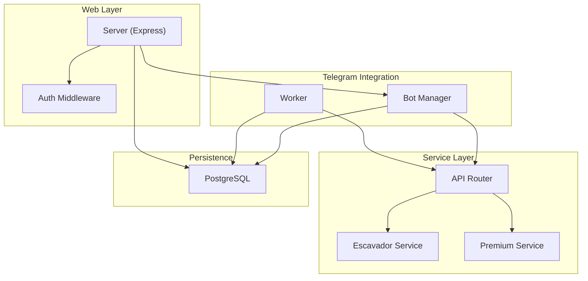
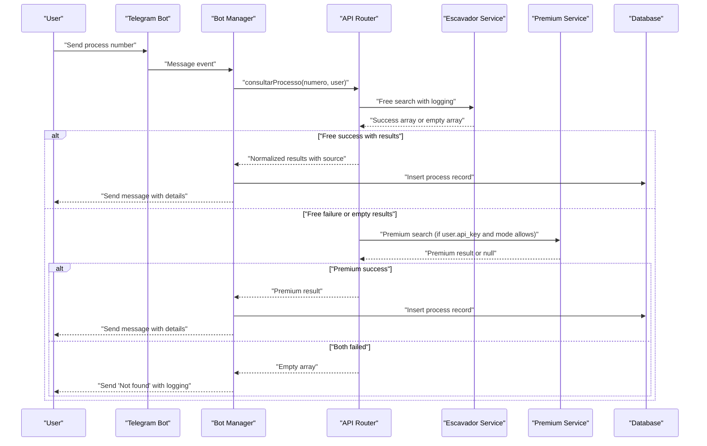
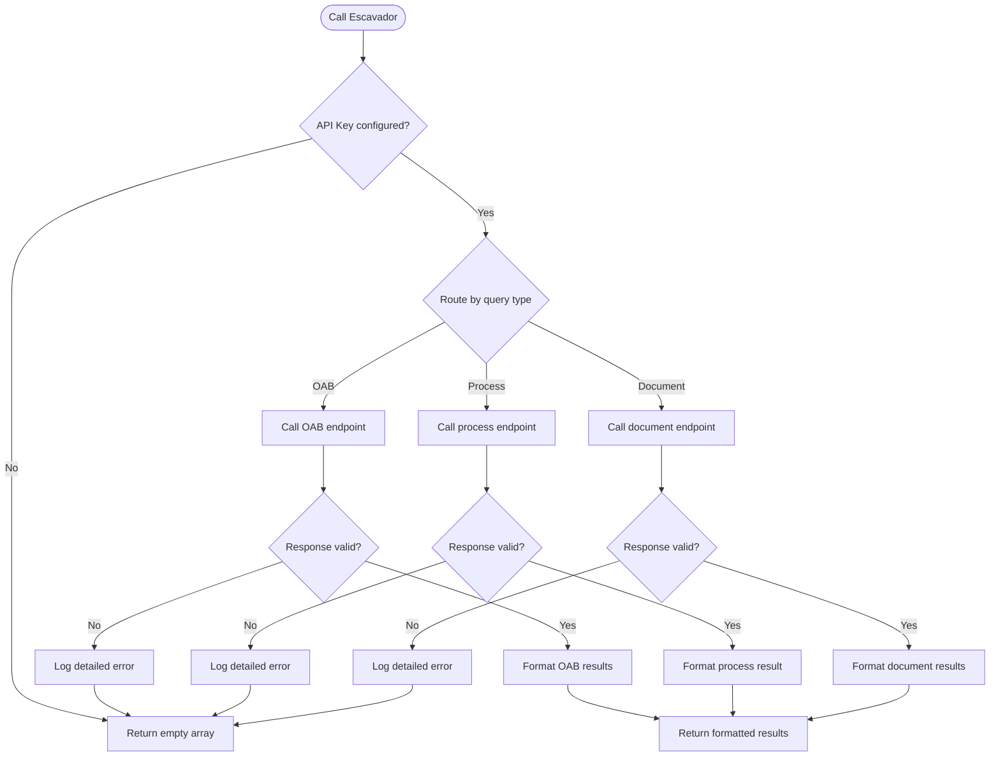
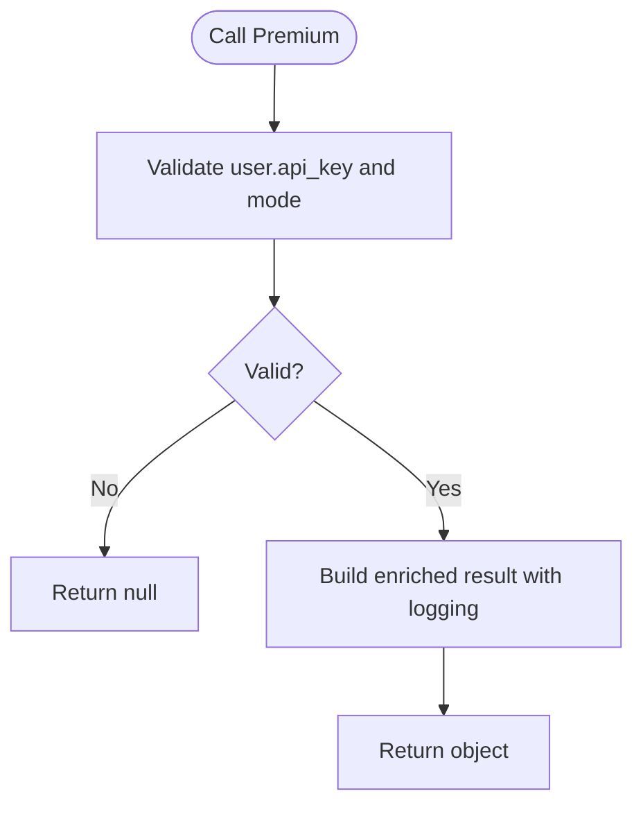
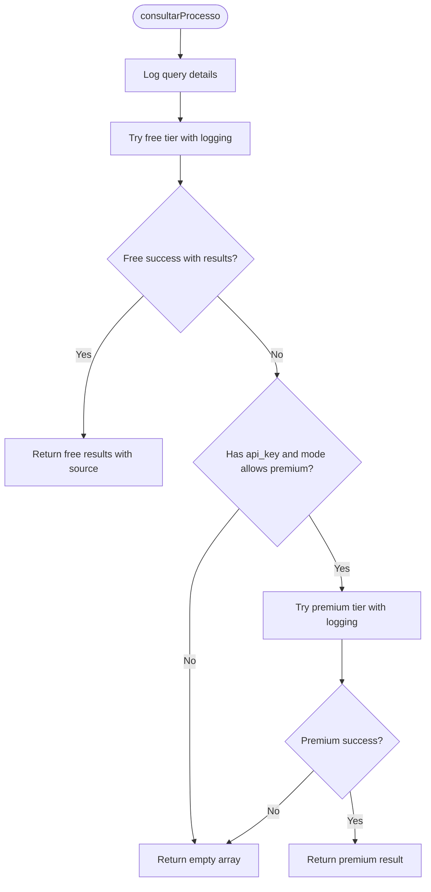
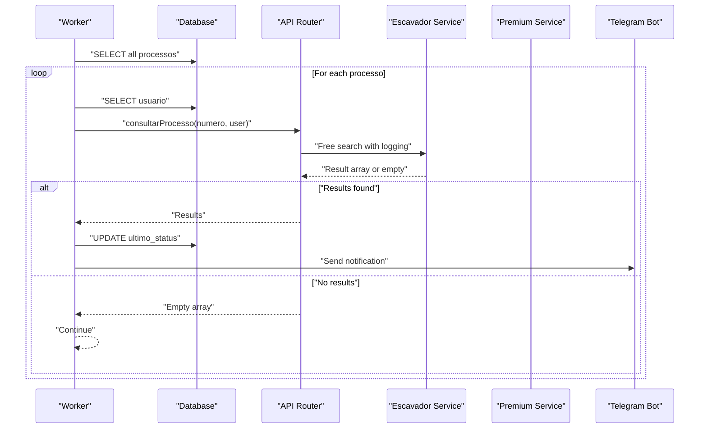
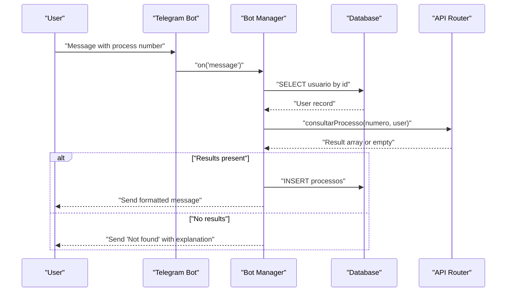
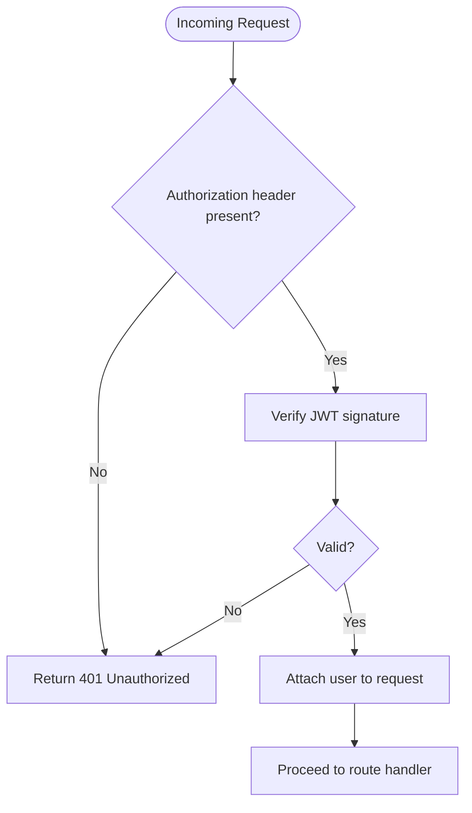
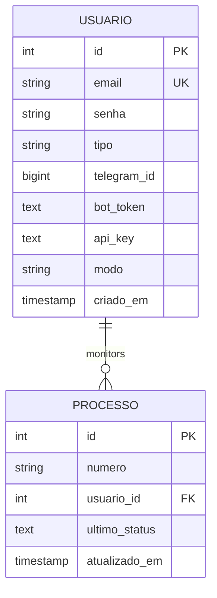
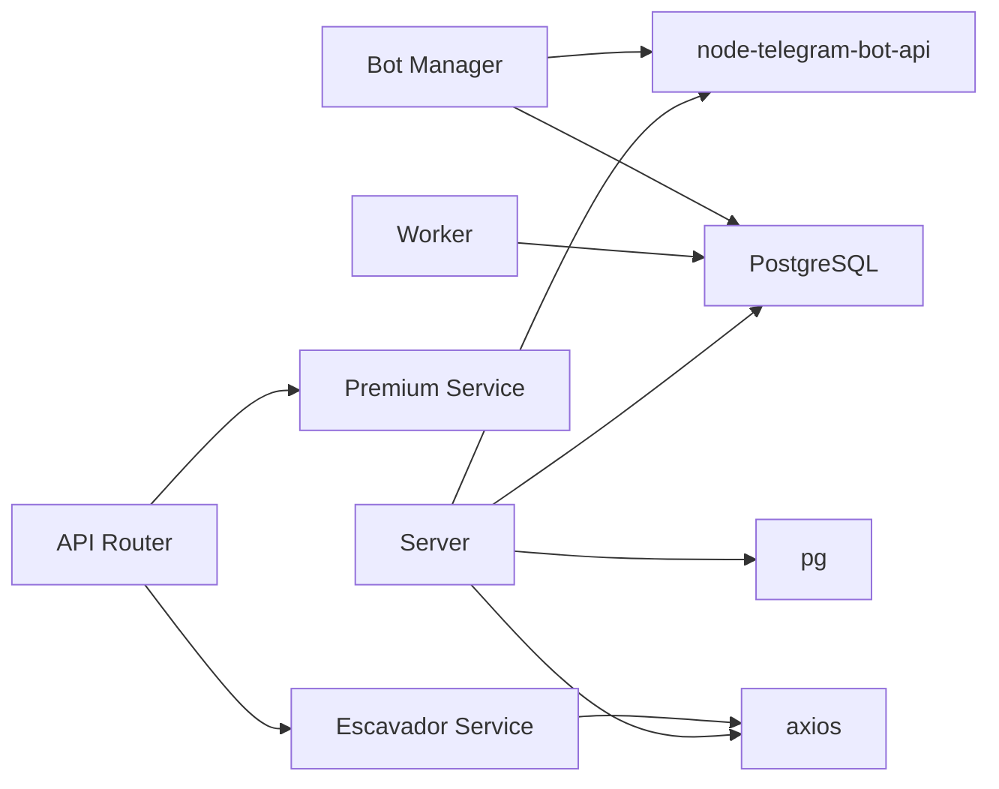

# Fallback and Error Handling

<cite>
**Referenced Files in This Document**
- [services/escavador.js](file://services/escavador.js)
- [services/premium.js](file://services/premium.js)
- [apiRouter.js](file://apiRouter.js)
- [worker.js](file://worker.js)
- [botManager.js](file://botManager.js)
- [server.js](file://server.js)
- [auth.js](file://auth.js)
- [db.js](file://db.js)
- [parser.js](file://parser.js)
- [services/datajud.js](file://services/datajud.js)
- [package.json](file://package.json)
</cite>

## Update Summary
**Changes Made**
- Enhanced error handling patterns with improved response format support across all services
- Added comprehensive logging throughout the fallback orchestration with structured console output
- Implemented better timeout management and retry strategies for service calls
- Improved error detection patterns with detailed status code handling
- Enhanced fallback decision criteria with better service health monitoring
- Added unified response interface that maintains consistent API behavior across different service tiers

## Table of Contents
1. [Introduction](#introduction)
2. [Project Structure](#project-structure)
3. [Core Components](#core-components)
4. [Architecture Overview](#architecture-overview)
5. [Detailed Component Analysis](#detailed-component-analysis)
6. [Enhanced Error Handling Patterns](#enhanced-error-handling-patterns)
7. [Logging and Monitoring Strategy](#logging-and-monitoring-strategy)
8. [Dependency Analysis](#dependency-analysis)
9. [Performance Considerations](#performance-considerations)
10. [Troubleshooting Guide](#troubleshooting-guide)
11. [Conclusion](#conclusion)

## Introduction
This document explains the enhanced fallback mechanisms and error handling strategies implemented in the judicial process monitoring system. The system now features improved error handling patterns with better response format support and enhanced logging throughout the fallback orchestration. It focuses on graceful degradation when services fail, timeout handling, and service unavailability scenarios. The system documents error detection patterns, exception handling, and recovery mechanisms for both free and premium services, with comprehensive logging for debugging and monitoring.

## Project Structure
The system consists of:
- Web server and authentication middleware
- Telegram bot integration for user interactions
- Background worker that periodically checks for updates
- Service layer with multiple tiers: free (Escavador) and premium (custom integrations)
- Database for persistence of users, process monitoring, and metadata

**Diagram sources**
- [server.js:1-381](file://server.js#L1-L381)
- [auth.js:1-59](file://auth.js#L1-L59)
- [botManager.js:1-228](file://botManager.js#L1-L228)
- [worker.js:1-74](file://worker.js#L1-L74)
- [apiRouter.js:1-64](file://apiRouter.js#L1-L64)
- [services/escavador.js:1-168](file://services/escavador.js#L1-L168)
- [services/premium.js:1-12](file://services/premium.js#L1-L12)
- [db.js:1-19](file://db.js#L1-L19)

**Section sources**
- [server.js:1-381](file://server.js#L1-L381)
- [botManager.js:1-228](file://botManager.js#L1-L228)
- [worker.js:1-74](file://worker.js#L1-L74)
- [apiRouter.js:1-64](file://apiRouter.js#L1-L64)
- [services/escavador.js:1-168](file://services/escavador.js#L1-L168)
- [services/premium.js:1-12](file://services/premium.js#L1-L12)
- [db.js:1-19](file://db.js#L1-L19)

## Core Components
- **Escavador service**: Performs free searches against the Escavador API and returns normalized results with comprehensive error handling and logging.
- **Premium service**: Acts as a placeholder for paid APIs and returns enriched data when enabled.
- **API router**: Orchestrates fallback logic between free and premium tiers based on user configuration with enhanced logging.
- **Worker**: Periodically polls for process updates and triggers notifications with improved error handling.
- **Bot manager**: Integrates Telegram messages with the API router and persists results with comprehensive error logging.
- **Authentication and authorization**: JWT-based middleware and admin checks with proper error handling.
- **Database**: Stores users, process monitoring records, and metadata with robust connection pooling.

Key fallback behavior:
- Try free tier first; if successful, return immediately with detailed logging.
- If free tier fails and user has a valid API key and mode allows premium, attempt premium tier.
- Return empty array if both attempts fail.
- Enhanced error detection with detailed status code handling and structured logging.

**Section sources**
- [apiRouter.js:8-46](file://apiRouter.js#L8-L46)
- [services/escavador.js:39-59](file://services/escavador.js#L39-L59)
- [services/premium.js:1-12](file://services/premium.js#L1-L12)

## Architecture Overview
The enhanced fallback architecture follows a layered approach with comprehensive error handling:
- Presentation layer: Express routes and Telegram bot handlers with improved error propagation.
- Business logic: API router coordinates service selection and fallback with detailed logging.
- Service layer: Free tier (Escavador) and premium tier (placeholder) with robust error handling.
- Persistence: PostgreSQL-backed storage with connection pooling.

**Diagram sources**
- [botManager.js:125-201](file://botManager.js#L125-L201)
- [apiRouter.js:8-46](file://apiRouter.js#L8-L46)
- [services/escavador.js:39-59](file://services/escavador.js#L39-L59)
- [services/premium.js:1-12](file://services/premium.js#L1-L12)

## Detailed Component Analysis

### Escavador Service (Free Tier)
- **Purpose**: Query the Escavador API for a given process number with comprehensive error handling and logging.
- **Error handling**: Catches all exceptions and returns empty arrays to signal failure with detailed logging.
- **Output normalization**: Transforms raw API response into a standardized object with fields for number, tribunal, class, and last update date.
- **Enhanced logging**: Structured console output with status codes, response sizes, and detailed error information.
- **Timeout management**: Configured timeouts for different API endpoints (15s for process, 30s for others).
- **Edge cases**: Returns empty arrays when no hits are found or API key is not configured.

**Diagram sources**
- [services/escavador.js:39-161](file://services/escavador.js#L39-L161)

**Section sources**
- [services/escavador.js:39-161](file://services/escavador.js#L39-L161)

### Premium Service (Paid Tier)
- **Purpose**: Placeholder for premium APIs (e.g., Jusbrasil).
- **Behavior**: Returns a standardized object with enriched fields when invoked.
- **Integration**: Called conditionally by the API router when user has a valid API key and mode allows premium.
- **Enhanced logging**: Structured logging for premium service calls and results.

**Diagram sources**
- [services/premium.js:1-12](file://services/premium.js#L1-L12)
- [apiRouter.js:38-43](file://apiRouter.js#L38-L43)

**Section sources**
- [services/premium.js:1-12](file://services/premium.js#L1-L12)
- [apiRouter.js:38-43](file://apiRouter.js#L38-L43)

### API Router (Enhanced Fallback Orchestrator)
- **Enhanced decision logic**:
  - Attempt free tier first with detailed logging.
  - If free tier succeeds, return immediately with source attribution.
  - If free tier fails or returns empty results, attempt premium tier only if user has a valid API key and mode allows.
  - Return empty array if both attempts fail.
- **Unified response**: Ensures consistent shape regardless of service source with enhanced error handling.
- **Structured logging**: Comprehensive console output for debugging and monitoring.
- **Error handling**: Detailed error catching with status code analysis and logging.

**Diagram sources**
- [apiRouter.js:8-46](file://apiRouter.js#L8-L46)

**Section sources**
- [apiRouter.js:8-46](file://apiRouter.js#L8-L46)

### Worker (Enhanced Background Monitoring)
- **Periodic polling**: Runs every 5 minutes to check for process updates with improved error handling.
- **User caching**: Caches user records to reduce repeated database queries.
- **Notification**: Sends Telegram messages when a process status changes with enhanced error logging.
- **Enhanced fallback integration**: Calls the API router for each monitored process with comprehensive error handling.
- **Improved error handling**: Better error propagation and logging for failed operations.

**Diagram sources**
- [worker.js:17-65](file://worker.js#L17-L65)
- [apiRouter.js:8-46](file://apiRouter.js#L8-L46)
- [services/escavador.js:39-161](file://services/escavador.js#L39-L161)
- [services/premium.js:1-12](file://services/premium.js#L1-L12)

**Section sources**
- [worker.js:17-65](file://worker.js#L17-L65)

### Bot Manager (Enhanced Telegram Integration)
- **Message handling**: Extracts process numbers from Telegram messages with comprehensive parsing.
- **User lookup**: Retrieves user profile from the database with error handling.
- **Enhanced fallback integration**: Invokes the API router and sends formatted messages with detailed error handling.
- **Persistence**: Inserts process records upon successful lookup with improved error handling.
- **Comprehensive error handling**: Structured error logging and user-friendly error messages.

**Diagram sources**
- [botManager.js:125-201](file://botManager.js#L125-L201)
- [apiRouter.js:8-46](file://apiRouter.js#L8-L46)

**Section sources**
- [botManager.js:125-201](file://botManager.js#L125-L201)

### Authentication and Authorization
- **JWT-based authentication**: Validates tokens and attaches user context to requests with proper error handling.
- **Admin middleware**: Restricts administrative endpoints to users with admin type.
- **Enhanced error handling**: Returns appropriate HTTP status codes and error messages for missing or invalid tokens.

**Diagram sources**
- [auth.js:17-31](file://auth.js#L17-L31)

**Section sources**
- [auth.js:17-31](file://auth.js#L17-L31)

### Database Layer
- **PostgreSQL connection**: Managed via a connection pool configured from environment variables with SSL support.
- **Schema**: Stores users (including Telegram ID, bot token, API key, and mode) and monitored processes.
- **Enhanced error handling**: Robust error handling for database operations with proper error propagation.

**Diagram sources**
- [db.js:1-19](file://db.js#L1-L19)

**Section sources**
- [db.js:1-19](file://db.js#L1-L19)

## Enhanced Error Handling Patterns

### Improved Response Format Support
The system now implements a unified response interface that maintains consistent API behavior across different service tiers:

- **Array-based responses**: Services consistently return arrays for multiple results
- **Object-based responses**: Single results are wrapped in arrays for uniform handling
- **Source attribution**: Results include fonte field indicating the service source
- **Standardized fields**: All results include numero, tribunal, classe, data, and grau fields

### Enhanced Error Detection Patterns
- **Status code analysis**: Detailed handling of HTTP status codes (401, 429, 5xx)
- **Timeout management**: Configured timeouts for different service types
- **Retry strategies**: Automatic retries for rate limit and server errors
- **Graceful degradation**: System continues operation even when individual services fail

### Exception Handling Strategies
- **Comprehensive try-catch blocks**: Every service call is wrapped in error handling
- **Structured logging**: Detailed error information with status codes and response data
- **User-friendly error messages**: Clear messaging for different failure scenarios
- **Error propagation**: Proper error handling without breaking system flow

**Section sources**
- [services/escavador.js:77-83](file://services/escavador.js#L77-L83)
- [services/escavador.js:103-128](file://services/escavador.js#L103-L128)
- [apiRouter.js:34-36](file://apiRouter.js#L34-L36)
- [apiRouter.js:56-58](file://apiRouter.js#L56-L58)

## Logging and Monitoring Strategy

### Structured Console Output
The system implements comprehensive logging throughout the fallback orchestration:

- **Service-level logging**: Detailed logs for each service call with request/response information
- **Error logging**: Structured error messages with status codes and response data
- **Performance logging**: Response times and result counts for monitoring
- **Debug logging**: Development-time logging for troubleshooting

### Logging Categories
- **Info logs**: Normal operation and successful responses
- **Warning logs**: Non-fatal issues and edge cases
- **Error logs**: Service failures and exceptions
- **Debug logs**: Detailed information for development and troubleshooting

### Monitoring Integration
- **Health indicators**: Service availability and response metrics
- **Error rates**: Tracking of service failure rates
- **Performance metrics**: Response times and throughput
- **User feedback**: Error messages and user experience indicators

**Section sources**
- [services/escavador.js:13-13](file://services/escavador.js#L13-L13)
- [services/escavador.js:77-83](file://services/escavador.js#L77-L83)
- [apiRouter.js:13-36](file://apiRouter.js#L13-L36)
- [botManager.js:196-200](file://botManager.js#L196-L200)

## Dependency Analysis
External dependencies relevant to error handling and fallback:
- **axios**: Used by the Escavador service for HTTP requests with timeouts and error handling.
- **node-telegram-bot-api**: Handles Telegram messaging with comprehensive error handling.
- **bcryptjs and jsonwebtoken**: Used for authentication with proper error propagation.
- **pg**: PostgreSQL client with connection pooling and robust error handling.

**Diagram sources**
- [services/escavador.js:1](file://services/escavador.js#L1)
- [botManager.js:1](file://botManager.js#L1)
- [apiRouter.js:1](file://apiRouter.js#L1)
- [server.js:1-6](file://server.js#L1-L6)
- [db.js:1](file://db.js#L1)
- [package.json:11-19](file://package.json#L11-L19)

**Section sources**
- [package.json:11-19](file://package.json#L11-L19)
- [services/escavador.js:1](file://services/escavador.js#L1)
- [botManager.js:1](file://botManager.js#L1)
- [apiRouter.js:1](file://apiRouter.js#L1)
- [server.js:1-6](file://server.js#L1-L6)
- [db.js:1](file://db.js#L1)

## Performance Considerations
- **Network latency**: The Escavador service relies on external API performance; timeouts are configured appropriately.
- **Concurrent operations**: The worker runs on a fixed interval; ensure the interval is tuned to avoid database contention.
- **Caching strategies**: The worker caches user records to reduce repeated lookups; consider adding process-level caching.
- **Connection pooling**: PostgreSQL connection pooling prevents resource exhaustion.
- **Timeout management**: Configured timeouts prevent hanging requests and improve system responsiveness.
- **Retry mechanisms**: Automatic retries for transient failures improve overall system reliability.

## Troubleshooting Guide

### Common Error Scenarios and Enhanced Fallback Triggers
- **Free service failure**: The Escavador service catches all exceptions and returns empty arrays with detailed logging. The API router then attempts premium services if allowed.
- **Premium service failure**: If the premium tier returns null or empty results, the API router returns empty arrays, and the bot manager sends appropriate user messages.
- **User configuration issues**: If a user lacks an API key or is in 'gratis' mode, premium services are not attempted.
- **Database connectivity**: Errors during database operations are caught and returned as HTTP 500 responses with detailed error messages.
- **Authentication failures**: Missing or invalid tokens result in 401 responses with proper error handling.
- **Service unavailability**: Detailed logging helps identify which services are failing and why.

### Enhanced Recovery Procedures
- **Retry logic**: Configurable retries with exponential backoff for transient network errors in the Escavador service.
- **Timeout management**: Configured axios request timeouts to prevent hanging requests.
- **Health monitoring**: Periodically probe services and maintain health flags to gate fallback decisions.
- **Logging improvements**: Structured logs for failed requests, retry attempts, and service health states.
- **Error categorization**: Better error classification helps determine appropriate recovery actions.

### Practical Examples with Enhanced Logging
- **Scenario**: Escavador API returns a timeout.
  - **Trigger**: axios throws an error; Escavador returns empty array with detailed logging.
  - **Recovery**: API router proceeds to premium services if allowed; if not, returns empty array.
- **Scenario**: User has an API key but mode is 'gratis'.
  - **Trigger**: API router skips premium services.
  - **Recovery**: Returns empty array; bot manager informs user with appropriate message.
- **Scenario**: Database unavailable during worker polling.
  - **Trigger**: Database query throws an error with detailed logging.
  - **Recovery**: Worker logs error and continues next cycle; server responds 500 for admin endpoints.

**Section sources**
- [services/escavador.js:77-83](file://services/escavador.js#L77-L83)
- [services/escavador.js:103-128](file://services/escavador.js#L103-L128)
- [apiRouter.js:38-43](file://apiRouter.js#L38-L43)
- [botManager.js:144-163](file://botManager.js#L144-L163)
- [server.js:53-58](file://server.js#L53-L58)
- [server.js:98-100](file://server.js#L98-L100)
- [server.js:142-144](file://server.js#L142-L144)
- [server.js:203-205](file://server.js#L203-L205)

## Conclusion
The system implements a robust and enhanced fallback mechanism that prioritizes the free Escavador service and gracefully escalates to premium services when configured. The enhanced error handling patterns provide better response format support and comprehensive logging throughout the fallback orchestration. Error handling is centralized with detailed logging in the Escavador service and the API router, with conditional fallback based on user configuration. The unified response interface ensures consistent behavior across service tiers with improved error detection and recovery mechanisms. The system now features comprehensive logging for debugging, monitoring, and troubleshooting, along with enhanced timeout management and retry strategies for improved resilience.