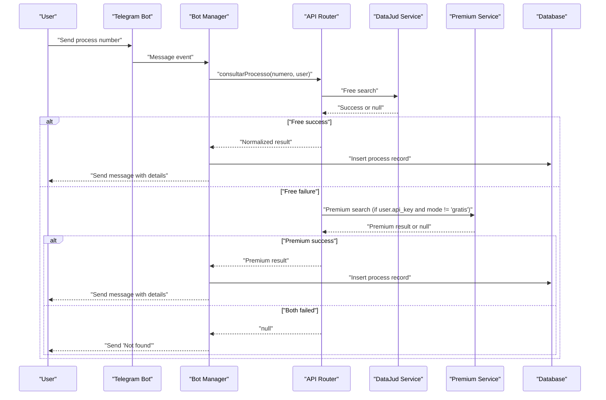
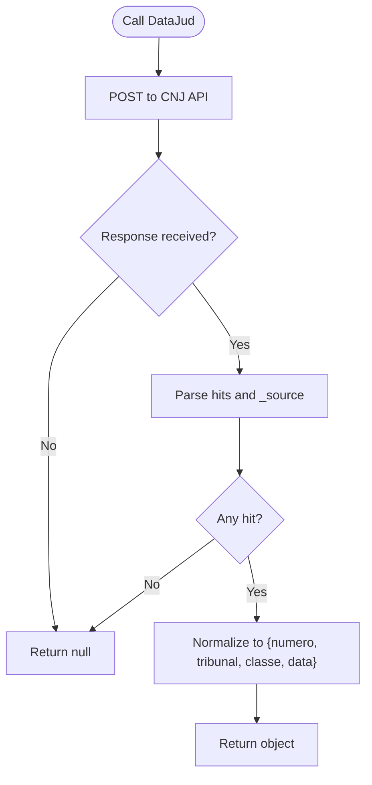
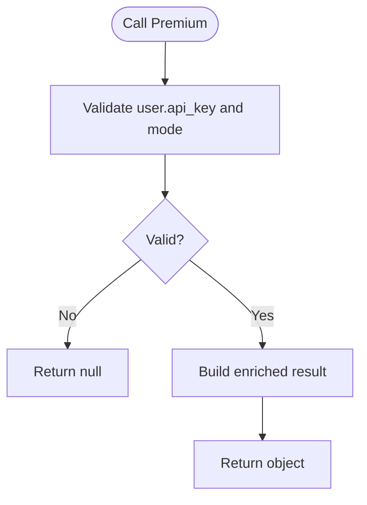
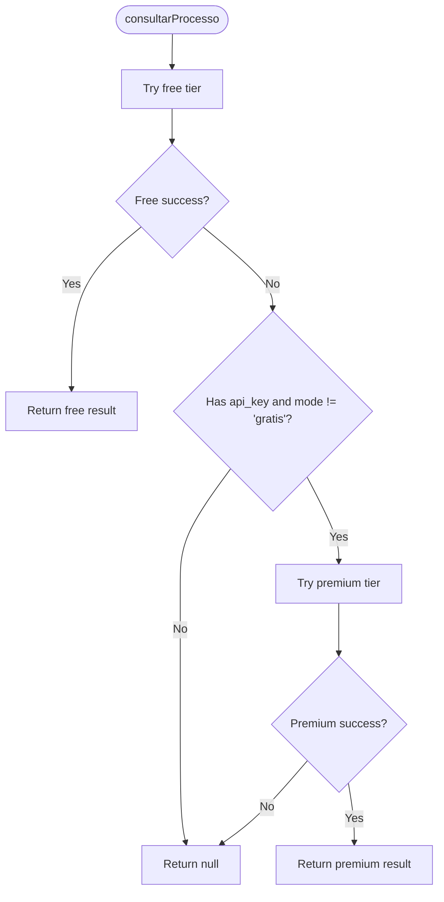
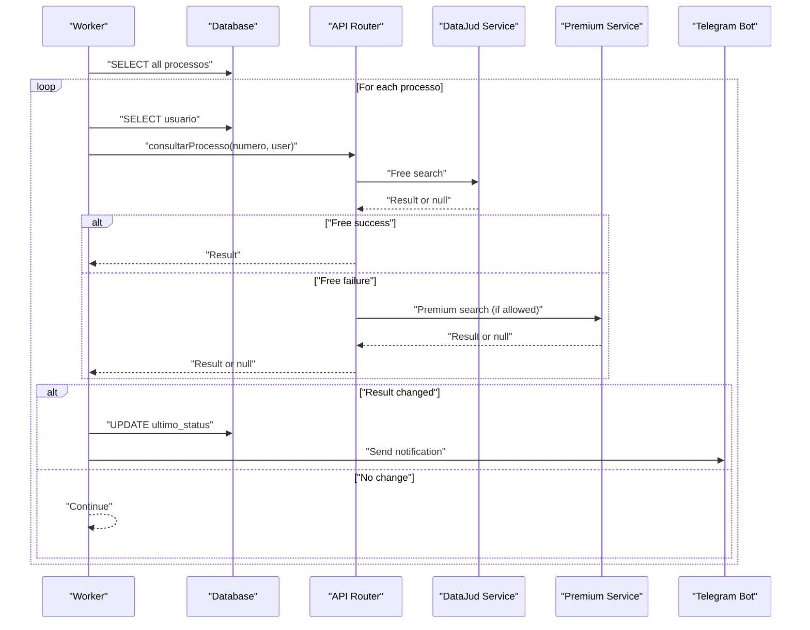
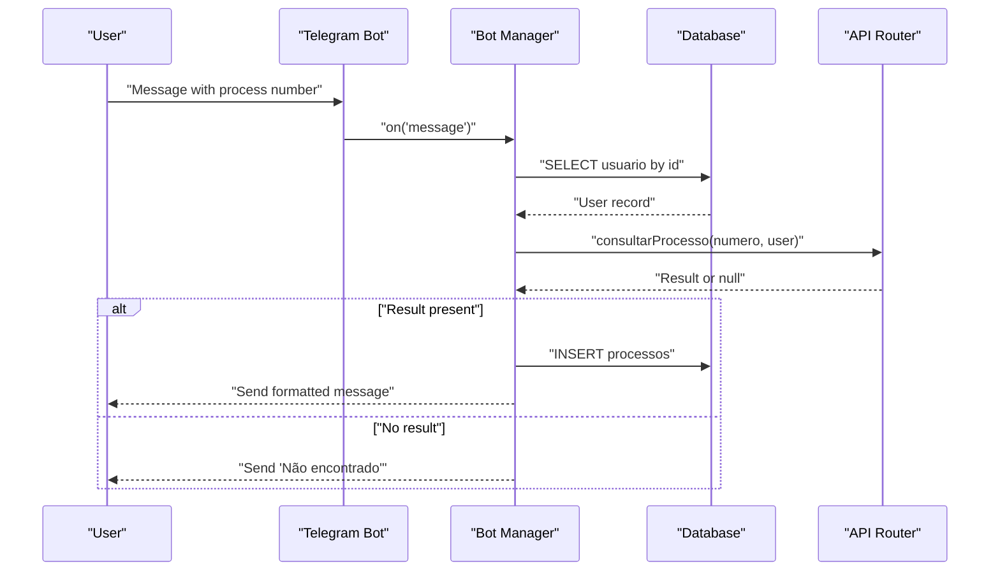
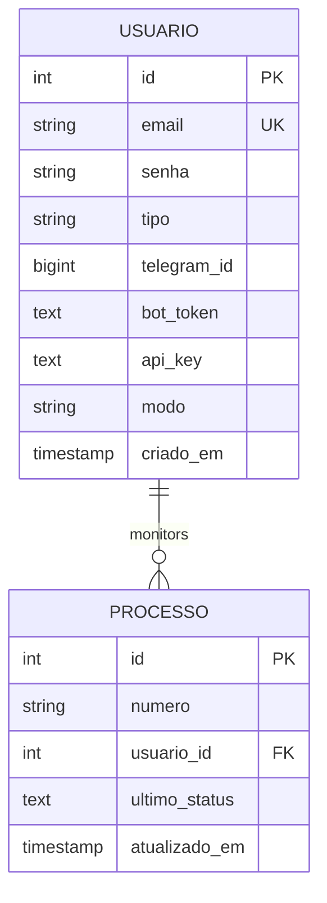
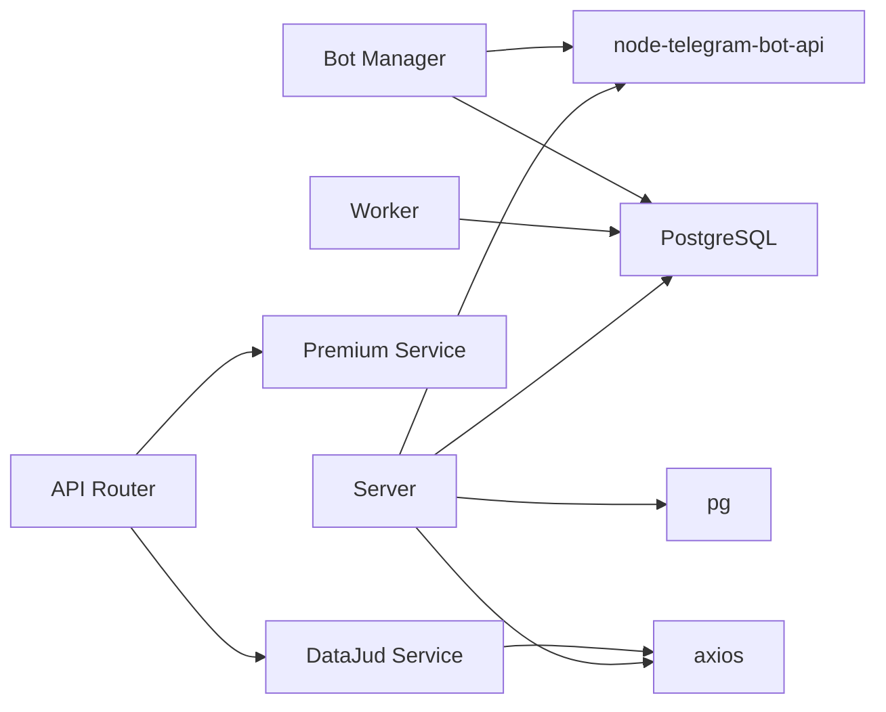

# Fallback and Error Handling

<cite>
**Referenced Files in This Document**
- [datajud.js](file://services/datajud.js)
- [premium.js](file://services/premium.js)
- [apiRouter.js](file://apiRouter.js)
- [worker.js](file://worker.js)
- [botManager.js](file://botManager.js)
- [server.js](file://server.js)
- [auth.js](file://auth.js)
- [db.js](file://db.js)
- [database.sql](file://database.sql)
- [package.json](file://package.json)
</cite>

## Table of Contents
1. [Introduction](#introduction)
2. [Project Structure](#project-structure)
3. [Core Components](#core-components)
4. [Architecture Overview](#architecture-overview)
5. [Detailed Component Analysis](#detailed-component-analysis)
6. [Dependency Analysis](#dependency-analysis)
7. [Performance Considerations](#performance-considerations)
8. [Troubleshooting Guide](#troubleshooting-guide)
9. [Conclusion](#conclusion)

## Introduction
This document explains the fallback mechanisms and error handling strategies implemented in the judicial process monitoring system. It focuses on graceful degradation when the free DataJud service fails, timeout handling, and service unavailability scenarios. It documents error detection patterns, exception handling, and recovery mechanisms for both free and premium services. It also covers fallback decision criteria, service health monitoring, automatic failover processes, and the unified response interface that abstracts service differences while maintaining consistent API behavior across service tiers.

## Project Structure
The system consists of:
- Web server and authentication middleware
- Telegram bot integration for user interactions
- Background worker that periodically checks for updates
- Service layer with two tiers: free (DataJud) and premium (fallback)
- Database for persistence of users, process monitoring, and metadata

**Diagram sources**
- [server.js:1-162](file://server.js#L1-L162)
- [auth.js:1-59](file://auth.js#L1-L59)
- [botManager.js:1-53](file://botManager.js#L1-L53)
- [worker.js:1-70](file://worker.js#L1-L70)
- [apiRouter.js:1-19](file://apiRouter.js#L1-L19)
- [datajud.js:1-32](file://services/datajud.js#L1-L32)
- [premium.js:1-12](file://services/premium.js#L1-L12)
- [db.js:1-11](file://db.js#L1-L11)

**Section sources**
- [server.js:1-162](file://server.js#L1-L162)
- [botManager.js:1-53](file://botManager.js#L1-L53)
- [worker.js:1-70](file://worker.js#L1-L70)
- [apiRouter.js:1-19](file://apiRouter.js#L1-L19)
- [datajud.js:1-32](file://services/datajud.js#L1-L32)
- [premium.js:1-12](file://services/premium.js#L1-L12)
- [db.js:1-11](file://db.js#L1-L11)
- [database.sql:1-25](file://database.sql#L1-L25)

## Core Components
- DataJud service: performs free searches against the CNJ public API and returns normalized results or null on failure.
- Premium service: acts as a placeholder for paid APIs and returns enriched data when enabled.
- API router: orchestrates fallback logic between free and premium tiers based on user configuration.
- Worker: periodically polls for process updates and triggers notifications.
- Bot manager: integrates Telegram messages with the API router and persists results.
- Authentication and authorization: JWT-based middleware and admin checks.
- Database: stores users, process monitoring records, and metadata.

Key fallback behavior:
- Try free tier first; if successful, return immediately.
- If free tier fails and user has a valid API key and mode allows premium, attempt premium tier.
- Return null if both attempts fail.

**Section sources**
- [apiRouter.js:4-16](file://apiRouter.js#L4-L16)
- [datajud.js:3-29](file://services/datajud.js#L3-L29)
- [premium.js:1-9](file://services/premium.js#L1-L9)

## Architecture Overview
The fallback architecture follows a layered approach:
- Presentation layer: Express routes and Telegram bot handlers.
- Business logic: API router coordinates service selection and fallback.
- Service layer: Free tier (DataJud) and premium tier (placeholder).
- Persistence: PostgreSQL-backed storage.

**Diagram sources**
- [botManager.js:13-39](file://botManager.js#L13-L39)
- [apiRouter.js:4-16](file://apiRouter.js#L4-L16)
- [datajud.js:3-29](file://services/datajud.js#L3-L29)
- [premium.js:1-9](file://services/premium.js#L1-L9)

## Detailed Component Analysis

### DataJud Service (Free Tier)
- Purpose: Query the CNJ public API for a given process number.
- Error handling: Catches all exceptions and returns null to signal failure.
- Output normalization: Transforms raw API response into a standardized object with fields for number, tribunal, class, and last update date.
- Edge cases: Returns null when no hits are found.

**Diagram sources**
- [datajud.js:3-29](file://services/datajud.js#L3-L29)

**Section sources**
- [datajud.js:3-29](file://services/datajud.js#L3-L29)

### Premium Service (Paid Tier)
- Purpose: Placeholder for premium APIs (e.g., Jusbrasil).
- Behavior: Returns a standardized object with enriched fields when invoked.
- Integration: Called conditionally by the API router when user has a valid API key and mode allows premium.

**Diagram sources**
- [premium.js:1-9](file://services/premium.js#L1-L9)
- [apiRouter.js:11-12](file://apiRouter.js#L11-L12)

**Section sources**
- [premium.js:1-9](file://services/premium.js#L1-L9)
- [apiRouter.js:11-12](file://apiRouter.js#L11-L12)

### API Router (Fallback Orchestrator)
- Decision logic:
  - Attempt free tier first.
  - If free tier succeeds, return immediately.
  - If free tier fails, attempt premium tier only if user has a valid API key and mode is not set to 'gratis'.
  - Return null if both attempts fail.
- Unified response: Ensures consistent shape regardless of service source.

**Diagram sources**
- [apiRouter.js:4-16](file://apiRouter.js#L4-L16)

**Section sources**
- [apiRouter.js:4-16](file://apiRouter.js#L4-L16)

### Worker (Background Monitoring)
- Periodic polling: Runs every 5 minutes to check for process updates.
- User caching: Caches user records to reduce repeated database queries.
- Notification: Sends Telegram messages when a process status changes.
- Fallback integration: Calls the API router for each monitored process.

**Diagram sources**
- [worker.js:17-61](file://worker.js#L17-L61)
- [apiRouter.js:4-16](file://apiRouter.js#L4-L16)
- [datajud.js:3-29](file://services/datajud.js#L3-L29)
- [premium.js:1-9](file://services/premium.js#L1-L9)

**Section sources**
- [worker.js:17-61](file://worker.js#L17-L61)

### Bot Manager (Telegram Integration)
- Message handling: Extracts process numbers from Telegram messages.
- User lookup: Retrieves user profile from the database.
- Fallback integration: Invokes the API router and sends formatted messages.
- Persistence: Inserts process records upon successful lookup.

**Diagram sources**
- [botManager.js:13-39](file://botManager.js#L13-L39)
- [apiRouter.js:4-16](file://apiRouter.js#L4-L16)

**Section sources**
- [botManager.js:13-39](file://botManager.js#L13-L39)

### Authentication and Authorization
- JWT-based authentication: Validates tokens and attaches user context to requests.
- Admin middleware: Restricts administrative endpoints to users with admin type.
- Error handling: Returns appropriate HTTP status codes and error messages for missing or invalid tokens.

**Diagram sources**
- [auth.js:17-31](file://auth.js#L17-L31)

**Section sources**
- [auth.js:17-31](file://auth.js#L17-L31)

### Database Layer
- PostgreSQL connection: Managed via a connection pool configured from environment variables.
- Schema: Stores users (including Telegram ID, bot token, API key, and mode) and monitored processes.

**Diagram sources**
- [database.sql:5-24](file://database.sql#L5-L24)
- [db.js:4-10](file://db.js#L4-L10)

**Section sources**
- [database.sql:5-24](file://database.sql#L5-L24)
- [db.js:4-10](file://db.js#L4-L10)

## Dependency Analysis
External dependencies relevant to error handling and fallback:
- axios: Used by the DataJud service for HTTP requests; failures are caught and treated as null results.
- node-telegram-bot-api: Handles Telegram messaging; errors in initialization or sending are not explicitly handled in the worker/bot manager, so failures could bubble up.
- bcryptjs and jsonwebtoken: Used for authentication; errors propagate to HTTP responses.
- pg: PostgreSQL client; errors during queries are caught and mapped to HTTP responses.

**Diagram sources**
- [datajud.js:1](file://services/datajud.js#L1)
- [botManager.js:1](file://botManager.js#L1)
- [apiRouter.js:1-2](file://apiRouter.js#L1-L2)
- [server.js:1-6](file://server.js#L1-L6)
- [db.js:1](file://db.js#L1)
- [package.json:11-19](file://package.json#L11-L19)

**Section sources**
- [package.json:11-19](file://package.json#L11-L19)
- [datajud.js:1](file://services/datajud.js#L1)
- [botManager.js:1](file://botManager.js#L1)
- [apiRouter.js:1-2](file://apiRouter.js#L1-L2)
- [server.js:1-6](file://server.js#L1-L6)
- [db.js:1](file://db.js#L1)

## Performance Considerations
- Network latency: The DataJud service relies on external API performance; consider adding timeouts and retries at the HTTP client level.
- Concurrency: The worker runs on a fixed interval; ensure the interval is tuned to avoid database contention.
- Caching: The worker caches user records to reduce repeated lookups; consider adding process-level caching for frequently accessed numbers.
- Circuit breaker: Implement a simple circuit breaker pattern to prevent cascading failures when the free tier is down.

[No sources needed since this section provides general guidance]

## Troubleshooting Guide

Common error scenarios and fallback triggers:
- Free service failure: The DataJud service catches all exceptions and returns null. The API router then attempts the premium tier if allowed by user configuration.
- Premium service failure: If the premium tier returns null, the API router returns null, and the bot manager sends a "Not found" message to the user.
- User configuration issues: If a user lacks an API key or is in 'gratis' mode, the premium tier is not attempted.
- Database connectivity: Errors during database operations are caught and returned as HTTP 500 responses with error messages.
- Authentication failures: Missing or invalid tokens result in 401 responses.

Recovery procedures:
- Retry logic: Add configurable retries with exponential backoff for transient network errors in the DataJud service.
- Timeout management: Configure axios request timeouts to prevent hanging requests.
- Circuit breaker: Track consecutive failures and temporarily disable the free tier until a cooldown period elapses.
- Health monitoring: Periodically probe the DataJud endpoint and maintain a health flag to gate fallback decisions.
- Logging: Add structured logs for failed requests, retry attempts, and circuit breaker state transitions.

Practical examples:
- Scenario: DataJud API returns a timeout.
  - Trigger: axios throws an error; DataJud returns null.
  - Recovery: API router proceeds to premium tier if allowed; if not, return null.
- Scenario: User has an API key but mode is 'gratis'.
  - Trigger: API router skips premium tier.
  - Recovery: Return null; bot manager informs user with "Not found".
- Scenario: Database unavailable during worker polling.
  - Trigger: Database query throws an error.
  - Recovery: Worker logs error and continues next cycle; server responds 500 for admin endpoints.

**Section sources**
- [datajud.js:26-28](file://services/datajud.js#L26-L28)
- [apiRouter.js:11-12](file://apiRouter.js#L11-L12)
- [botManager.js:26-29](file://botManager.js#L26-L29)
- [server.js:30-35](file://server.js#L30-L35)
- [server.js:65-67](file://server.js#L65-L67)
- [server.js:107-109](file://server.js#L107-L109)
- [server.js:119-121](file://server.js#L119-L121)
- [server.js:132-134](file://server.js#L132-L134)

## Conclusion
The system implements a robust fallback mechanism that prioritizes the free DataJud service and gracefully escalates to a premium tier when configured. Error handling is centralized in the DataJud service (catch-all to null) and the API router (conditional fallback). The unified response interface ensures consistent behavior across service tiers. To enhance resilience, consider adding timeouts, retries, circuit breakers, and health monitoring for the free tier, along with improved error logging and user feedback for transient failures.