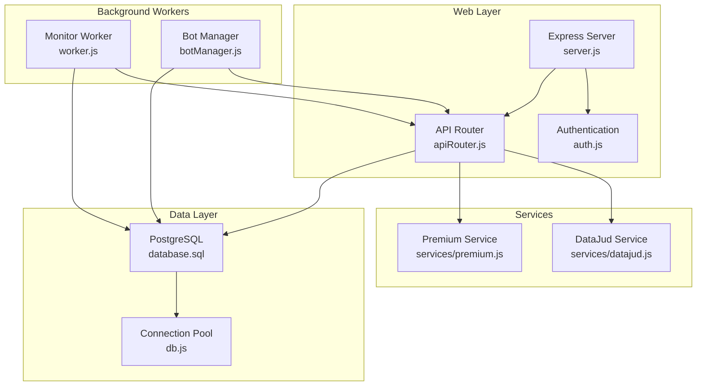
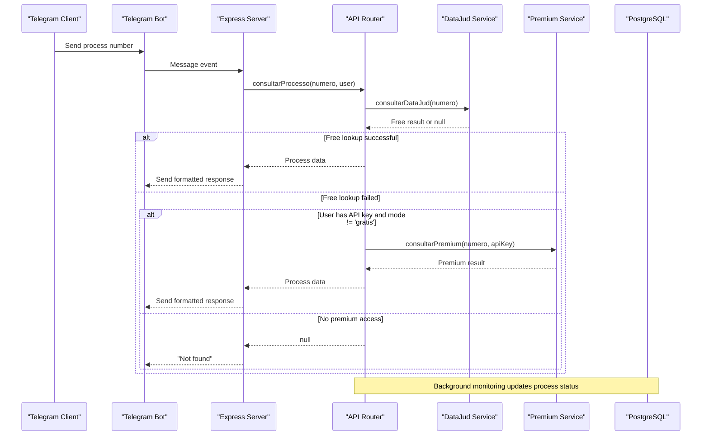
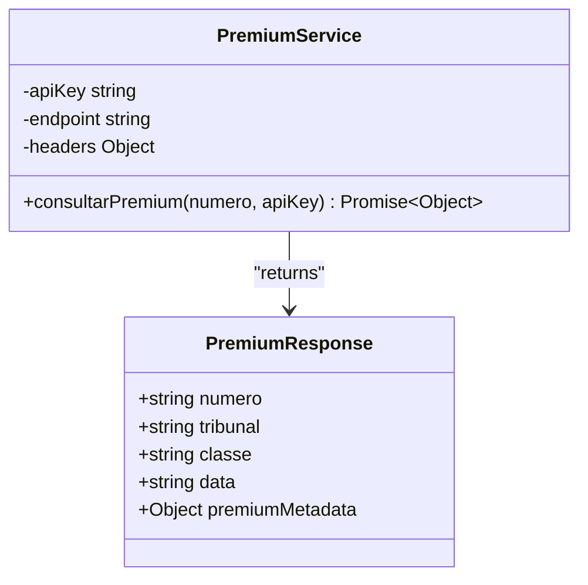
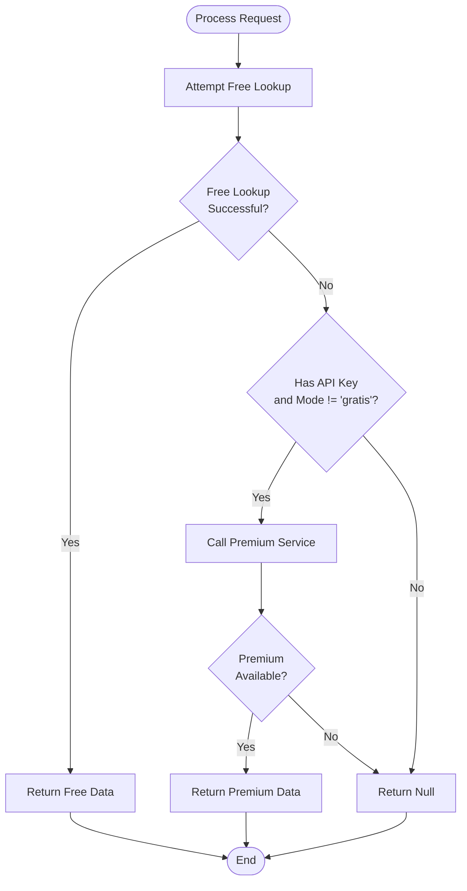
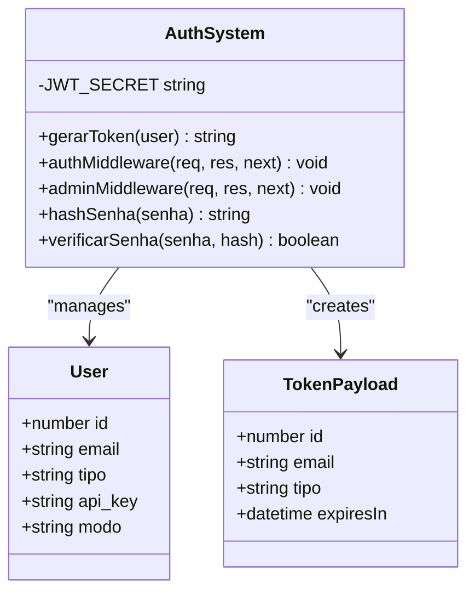
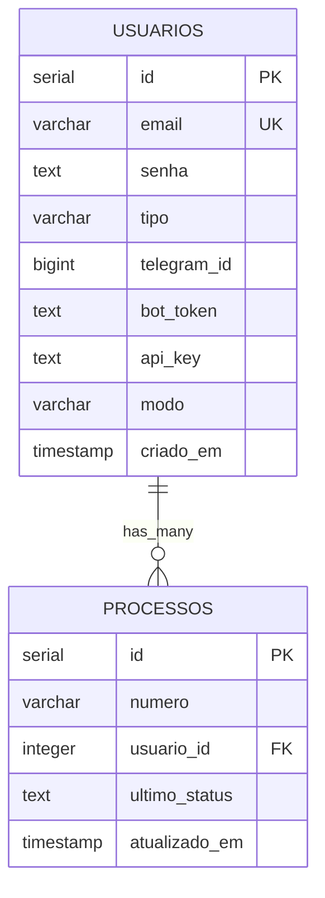
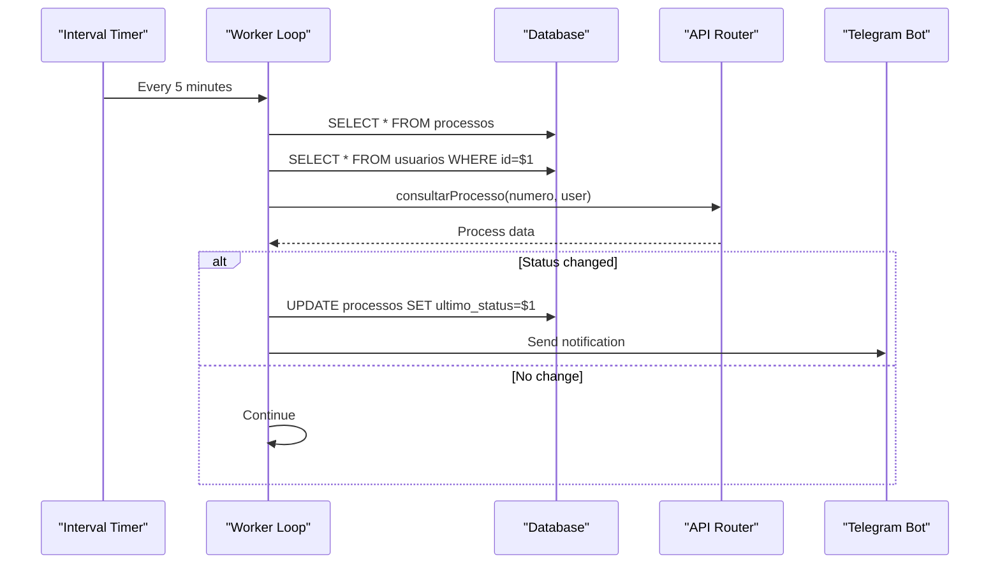
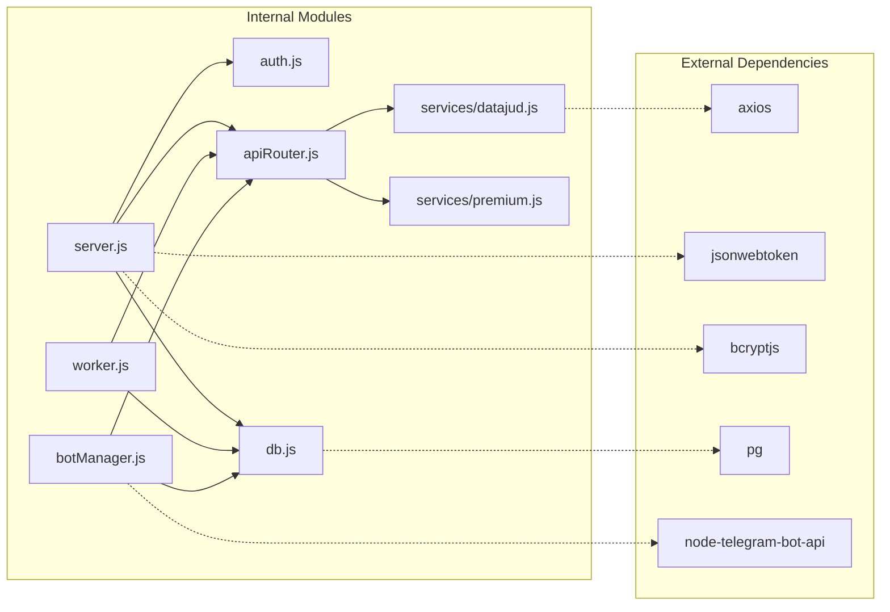

# Premium Paid Service Integration

<cite>
**Referenced Files in This Document**
- [premium.js](file://services/premium.js)
- [datajud.js](file://services/datajud.js)
- [apiRouter.js](file://apiRouter.js)
- [auth.js](file://auth.js)
- [server.js](file://server.js)
- [worker.js](file://worker.js)
- [botManager.js](file://botManager.js)
- [db.js](file://db.js)
- [database.sql](file://database.sql)
- [package.json](file://package.json)
- [README.md](file://README.md)
</cite>

## Table of Contents
1. [Introduction](#introduction)
2. [Project Structure](#project-structure)
3. [Core Components](#core-components)
4. [Architecture Overview](#architecture-overview)
5. [Detailed Component Analysis](#detailed-component-analysis)
6. [Dependency Analysis](#dependency-analysis)
7. [Performance Considerations](#performance-considerations)
8. [Troubleshooting Guide](#troubleshooting-guide)
9. [Conclusion](#conclusion)
10. [Appendices](#appendices)

## Introduction
This document describes the premium paid service integration for the judicial process monitoring SaaS. The system provides:
- Free tier using CNJ's DataJud API
- Premium tier as a fallback for enhanced data retrieval
- Telegram bot integration for user interaction
- Admin panel for managing users and configurations
- Automated monitoring of process updates

The premium service acts as an optional enhancement to the free DataJud integration, enabling richer data when the free tier does not return results.

## Project Structure
The project follows a modular Node.js architecture with clear separation of concerns:
- Services: Data access and external API integrations
- Authentication: JWT-based user authentication and authorization
- Web server: Express-based API endpoints and static file serving
- Background workers: Automated monitoring and Telegram bot management
- Database: PostgreSQL schema for user and process data

**Diagram sources**
- [server.js:1-162](file://server.js#L1-L162)
- [apiRouter.js:1-19](file://apiRouter.js#L1-L19)
- [datajud.js:1-32](file://services/datajud.js#L1-L32)
- [premium.js:1-12](file://services/premium.js#L1-L12)
- [worker.js:1-70](file://worker.js#L1-L70)
- [botManager.js:1-53](file://botManager.js#L1-L53)
- [database.sql:1-25](file://database.sql#L1-L25)
- [db.js:1-11](file://db.js#L1-L11)

**Section sources**
- [README.md:1-56](file://README.md#L1-L56)
- [package.json:1-21](file://package.json#L1-L21)

## Core Components
The premium service integration consists of several key components working together:

### Premium Service Implementation
The premium service is implemented as a placeholder that demonstrates the integration pattern. It accepts a process number and API key, returning enriched data with premium attributes.

### API Router Logic
The router implements a tiered approach:
1. Attempt free DataJud lookup first
2. Fall back to premium service if user has API key and mode is not 'gratis'
3. Return null if neither source has results

### Authentication and Authorization
The system uses JWT tokens for user authentication and role-based access control for administrative functions.

### Database Schema
The schema supports user profiles, Telegram integration, and premium configuration through dedicated fields.

**Section sources**
- [premium.js:1-12](file://services/premium.js#L1-L12)
- [apiRouter.js:4-16](file://apiRouter.js#L4-L16)
- [auth.js:16-39](file://auth.js#L16-L39)
- [database.sql:5-24](file://database.sql#L5-L24)

## Architecture Overview
The premium service architecture implements a hybrid approach combining free and paid tiers:

**Diagram sources**
- [botManager.js:13-39](file://botManager.js#L13-L39)
- [apiRouter.js:4-16](file://apiRouter.js#L4-L16)
- [datajud.js:3-29](file://services/datajud.js#L3-L29)
- [premium.js:1-9](file://services/premium.js#L1-L9)

## Detailed Component Analysis

### Premium Service Module
The premium service module provides the interface for enhanced data retrieval:

**Diagram sources**
- [premium.js:1-12](file://services/premium.js#L1-L12)

Key characteristics:
- Accepts process number and API key as parameters
- Returns structured data with premium attributes
- Designed as a placeholder for real API integration
- Maintains consistent response format with free tier

### API Router Logic Flow
The router implements sophisticated fallback logic:

**Diagram sources**
- [apiRouter.js:4-16](file://apiRouter.js#L4-L16)

**Section sources**
- [apiRouter.js:4-16](file://apiRouter.js#L4-L16)

### Authentication and Authorization System
The authentication system provides comprehensive security:

**Diagram sources**
- [auth.js:8-58](file://auth.js#L8-L58)

**Section sources**
- [auth.js:16-39](file://auth.js#L16-L39)

### Database Schema Design
The database schema supports the premium service integration:

**Diagram sources**
- [database.sql:5-24](file://database.sql#L5-L24)

**Section sources**
- [database.sql:5-24](file://database.sql#L5-L24)

### Background Monitoring System
The worker system provides automated process monitoring:

**Diagram sources**
- [worker.js:17-61](file://worker.js#L17-L61)

**Section sources**
- [worker.js:17-61](file://worker.js#L17-L61)

## Dependency Analysis
The system exhibits clean dependency management with clear separation of concerns:

**Diagram sources**
- [package.json:11-19](file://package.json#L11-L19)
- [server.js:1-10](file://server.js#L1-L10)
- [datajud.js:1](file://services/datajud.js#L1)

**Section sources**
- [package.json:11-19](file://package.json#L11-L19)

## Performance Considerations
The premium service integration includes several performance optimizations:

### Caching Strategies
- **Bot instances caching**: Prevents recreation of Telegram bot instances
- **User data caching**: Reduces repeated database queries in worker loops
- **Connection pooling**: Efficient database connection management

### Asynchronous Processing
- Non-blocking API calls using async/await
- Parallel processing where safe (avoiding concurrent database operations)
- Background processing for monitoring tasks

### Resource Management
- Connection limits and timeouts for external API calls
- Graceful degradation when premium service is unavailable
- Efficient database queries with proper indexing

## Troubleshooting Guide

### Common Issues and Solutions

#### Authentication Problems
- **Symptom**: 401 Token inválido
- **Cause**: Expired or malformed JWT token
- **Solution**: Regenerate token using login endpoint

#### Premium Service Access Issues
- **Symptom**: Premium fallback not triggered
- **Cause**: Missing API key or incorrect mode configuration
- **Solution**: Verify user.api_key and user.modo fields in database

#### Database Connectivity
- **Symptom**: Connection pool errors
- **Cause**: Incorrect database credentials or network issues
- **Solution**: Check environment variables and database availability

#### Telegram Integration
- **Symptom**: Bot not responding to messages
- **Cause**: Invalid bot token or missing Telegram ID
- **Solution**: Verify bot configuration in admin panel

**Section sources**
- [auth.js:20-30](file://auth.js#L20-L30)
- [apiRouter.js:11-12](file://apiRouter.js#L11-L12)
- [db.js:4-10](file://db.js#L4-L10)

## Conclusion
The premium paid service integration provides a robust foundation for extending the free DataJud service with enhanced capabilities. The modular architecture ensures scalability, maintainability, and clear separation of concerns. Key strengths include:

- **Flexible fallback architecture** enabling seamless transition between free and premium tiers
- **Comprehensive authentication system** supporting both user and administrative access
- **Efficient background processing** for automated monitoring and notifications
- **Scalable database design** supporting user growth and feature expansion

The implementation demonstrates best practices in API integration, error handling, and performance optimization while maintaining security and reliability standards.

## Appendices

### API Endpoint Reference
- **POST /auth/registro**: User registration with premium configuration
- **POST /auth/login**: User authentication and token generation
- **GET /auth/me**: Current user profile information
- **GET /processos**: Process monitoring list (with role-based filtering)
- **GET /usuarios**: Admin-only user management

### Premium Configuration Fields
- **api_key**: Premium service authentication token
- **modo**: Access mode ('gratis', 'hibrido', 'pago')
- **tipo**: User role ('cliente', 'admin')

### Environment Variables
- **JWT_SECRET**: Secret key for JWT token generation
- **DB_HOST**, **DB_USER**, **DB_PASSWORD**, **DB_NAME**, **DB_PORT**: Database connection details