# Premium Paid Service Integration

<cite>
**Referenced Files in This Document**
- [escavador.js](file://services/escavador.js)
- [premium.js](file://services/premium.js)
- [apiRouter.js](file://apiRouter.js)
- [auth.js](file://auth.js)
- [server.js](file://server.js)
- [worker.js](file://worker.js)
- [botManager.js](file://botManager.js)
- [db.js](file://db.js)
- [database.sql](file://database.sql)
- [package.json](file://package.json)
- [README.md](file://README.md)
</cite>

## Update Summary
**Changes Made**
- Updated to reflect complete removal of external paid service integrations (Jusbrasil, DataJud, Digesto, Custom services)
- Simplified architecture to focus on single Escavador service as the primary premium provider
- Added support for user-configurable API integrations through admin panel
- Removed multi-service architecture in favor of streamlined single-service approach
- Updated service priority to Escavador only with optional user-added services
- Enhanced premium service configuration to support individual user API keys

## Table of Contents
1. [Introduction](#introduction)
2. [Project Structure](#project-structure)
3. [Core Components](#core-components)
4. [Architecture Overview](#architecture-overview)
5. [Detailed Component Analysis](#detailed-component-analysis)
6. [Premium Service Integration](#premium-service-integration)
7. [Escavador Service Integration](#escavador-service-integration)
8. [Premium Service Configuration](#premium-service-configuration)
9. [API Key Authentication](#api-key-authentication)
10. [Response Standardization](#response-standardization)
11. [Dependency Analysis](#dependency-analysis)
12. [Performance Considerations](#performance-considerations)
13. [Troubleshooting Guide](#troubleshooting-guide)
14. [Conclusion](#conclusion)
15. [Appendices](#appendices)

## Introduction
This document describes the premium paid service integration for the judicial process monitoring SaaS. The system provides:
- Free tier using CNJ's DataJud API
- Premium tier with enhanced data retrieval through Escavador service
- Telegram bot integration for user interaction
- Admin panel for managing users and configurations
- Automated monitoring of process updates

**Updated** The system now focuses on a simplified architecture with Escavador as the primary premium service, while still supporting user-configurable API integrations through the admin panel. The previous multi-service architecture with Jusbrasil, DataJud, Digesto, and Custom services has been removed in favor of a streamlined single-service approach.

The premium service acts as an optional enhancement to the free DataJud integration, enabling richer data when the free tier does not return results. Users can now add their own API integrations through the admin panel, providing flexibility while maintaining simplicity.

## Project Structure
The project follows a modular Node.js architecture with clear separation of concerns:
- Services: Data access and external API integrations (now focused on Escavador)
- Authentication: JWT-based user authentication and authorization
- Web server: Express-based API endpoints and static file serving
- Background workers: Automated monitoring and Telegram bot management
- Database: PostgreSQL schema for user and process data

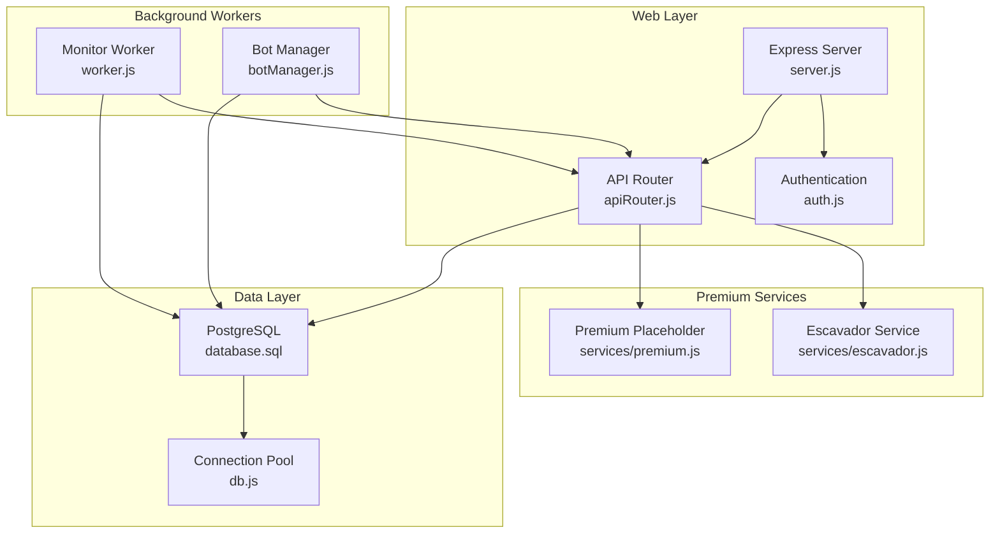
```mermaid
graph TB
subgraph "Web Layer"
Server["Express Server<br/>server.js"]
Auth["Authentication<br/>auth.js"]
Router["API Router<br/>apiRouter.js"]
end
subgraph "Premium Services"
Escavador["Escavador Service<br/>services/escavador.js"]
Premium["Premium Placeholder<br/>services/premium.js"]
end
subgraph "Background Workers"
Worker["Monitor Worker<br/>worker.js"]
BotMgr["Bot Manager<br/>botManager.js"]
end
subgraph "Data Layer"
DB["PostgreSQL<br/>database.sql"]
Pool["Connection Pool<br/>db.js"]
end
Server --> Auth
Server --> Router
Router --> Escavador
Router --> Premium
Worker --> Router
BotMgr --> Router
Router --> DB
Worker --> DB
BotMgr --> DB
DB --> Pool
```

**Diagram sources**
- [server.js:1-381](file://server.js#L1-L381)
- [apiRouter.js:1-49](file://apiRouter.js#L1-L49)
- [escavador.js:1-218](file://services/escavador.js#L1-L218)
- [premium.js:1-12](file://services/premium.js#L1-L12)
- [worker.js:1-74](file://worker.js#L1-L74)
- [botManager.js:1-221](file://botManager.js#L1-L221)
- [database.sql:1-25](file://database.sql#L1-L25)
- [db.js:1-19](file://db.js#L1-L19)

**Section sources**
- [README.md:1-56](file://README.md#L1-L56)
- [package.json:1-21](file://package.json#L1-L21)

## Core Components
The premium service integration consists of several key components working together:

### Premium Service Providers
**Updated** The system now focuses on a simplified service architecture:
- **Escavador**: Primary premium service with comprehensive OAB monitoring and process search capabilities
- **Premium Placeholder**: Legacy support for testing and future expansion

### Enhanced API Router Logic
The router implements a streamlined approach focusing on Escavador as the primary service:
1. **Escavador Priority**: Escavador service as the main premium provider
2. **Mode-based Strategy**: Different fallback behaviors based on user mode
3. **User-added Services**: Optional services added by users through admin panel

### Authentication and Authorization
The system uses JWT tokens for user authentication and role-based access control for administrative functions.

### Database Schema
The schema supports user profiles, Telegram integration, and premium configuration through dedicated fields.

**Section sources**
- [apiRouter.js:1-49](file://apiRouter.js#L1-L49)
- [auth.js:16-39](file://auth.js#L16-L39)
- [database.sql:5-24](file://database.sql#L5-L24)

## Architecture Overview
The premium service architecture implements a simplified approach focusing on Escavador as the primary premium service:

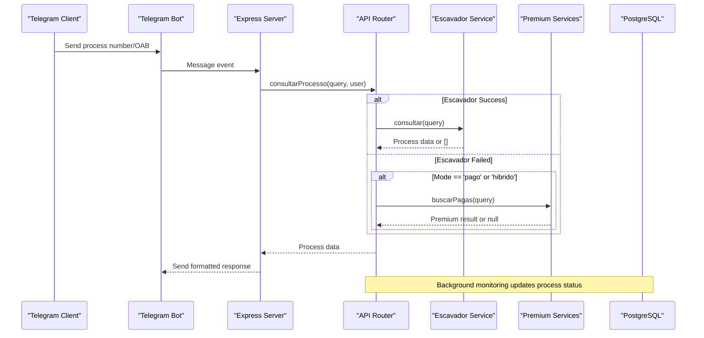
```mermaid
sequenceDiagram
participant Client as "Telegram Client"
participant Bot as "Telegram Bot"
participant Server as "Express Server"
participant Router as "API Router"
participant Escavador as "Escavador Service"
participant Premium as "Premium Services"
participant DB as "PostgreSQL"
Client->>Bot : Send process number/OAB
Bot->>Server : Message event
Server->>Router : consultarProcesso(query, user)
alt Escavador Success
Router->>Escavador : consultar(query)
Escavador-->>Router : Process data or []
else Escavador Failed
alt Mode == 'pago' or 'hibrido'
Router->>Premium : buscarPagas(query)
Premium-->>Router : Premium result or null
end
end
Router-->>Server : Process data
Server-->>Bot : Send formatted response
Note over Router,DB : Background monitoring updates process status
```

**Diagram sources**
- [botManager.js:122-198](file://botManager.js#L122-L198)
- [apiRouter.js:8-31](file://apiRouter.js#L8-L31)
- [escavador.js:10-40](file://services/escavador.js#L10-L40)

## Detailed Component Analysis

### Premium Service Provider Architecture
**Updated** The premium service architecture now focuses on a single primary service:

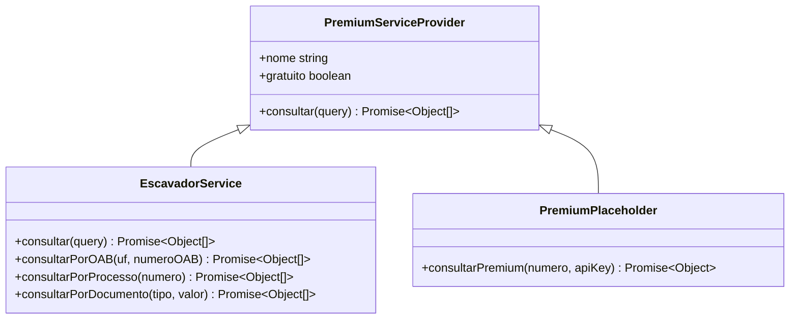
```mermaid
classDiagram
class PremiumServiceProvider {
+consultar(query) Promise~Object[]~
+nome string
+gratuito boolean
}
class EscavadorService {
+consultar(query) Promise~Object[]~
+consultarPorOAB(uf, numeroOAB) Promise~Object[]~
+consultarPorProcesso(numero) Promise~Object[]~
+consultarPorDocumento(tipo, valor) Promise~Object[]~
}
class PremiumPlaceholder {
+consultarPremium(numero, apiKey) Promise~Object~
}
PremiumServiceProvider <|-- EscavadorService
PremiumServiceProvider <|-- PremiumPlaceholder
```

**Diagram sources**
- [escavador.js:10-40](file://services/escavador.js#L10-L40)
- [premium.js:1-12](file://services/premium.js#L1-12)

### API Router Logic Flow
The router implements a streamlined fallback logic with Escavador as the primary service:

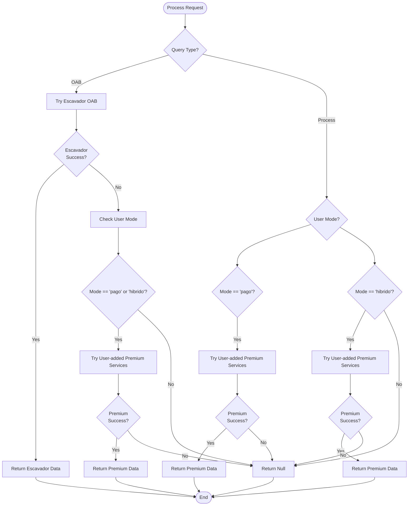
```mermaid
flowchart TD
Start([Process Request]) --> CheckType{"Query Type?"}
CheckType --> |OAB| CheckEscavador["Try Escavador OAB"]
CheckEscavador --> EscavadorSuccess{"Escavador<br/>Success?"}
EscavadorSuccess --> |Yes| ReturnEscavador["Return Escavador Data"]
EscavadorSuccess --> |No| CheckMode["Check User Mode"]
CheckMode --> ModePaid{"Mode == 'pago' or 'hibrido'?"}
ModePaid --> |Yes| TryPremium["Try User-added Premium Services"]
TryPremium --> PremiumSuccess{"Premium<br/>Success?"}
PremiumSuccess --> |Yes| ReturnPremium["Return Premium Data"]
PremiumSuccess --> |No| ReturnNull["Return Null"]
ModePaid --> |No| ReturnNull
CheckType --> |Process| CheckMode2{"User Mode?"}
CheckMode2 --> ModePago{"Mode == 'pago'?"}
ModePago --> |Yes| TryPremium2["Try User-added Premium Services"]
TryPremium2 --> PremiumSuccess2{"Premium<br/>Success?"}
PremiumSuccess2 --> |Yes| ReturnPremium2["Return Premium Data"]
PremiumSuccess2 --> |No| ReturnNull
CheckMode2 --> ModeHibrido{"Mode == 'hibrido'?"}
ModeHibrido --> |Yes| TryPremium3["Try User-added Premium Services"]
TryPremium3 --> PremiumSuccess3{"Premium<br/>Success?"}
PremiumSuccess3 --> |Yes| ReturnPremium3["Return Premium Data"]
PremiumSuccess3 --> |No| ReturnNull
ModeHibrido --> |No| ReturnNull
ReturnEscavador --> End([End])
ReturnPremium --> End
ReturnPremium2 --> End
ReturnPremium3 --> End
ReturnNull --> End
```

**Diagram sources**
- [apiRouter.js:8-31](file://apiRouter.js#L8-L31)

**Section sources**
- [apiRouter.js:8-31](file://apiRouter.js#L8-L31)

### Authentication and Authorization System
The authentication system provides comprehensive security:

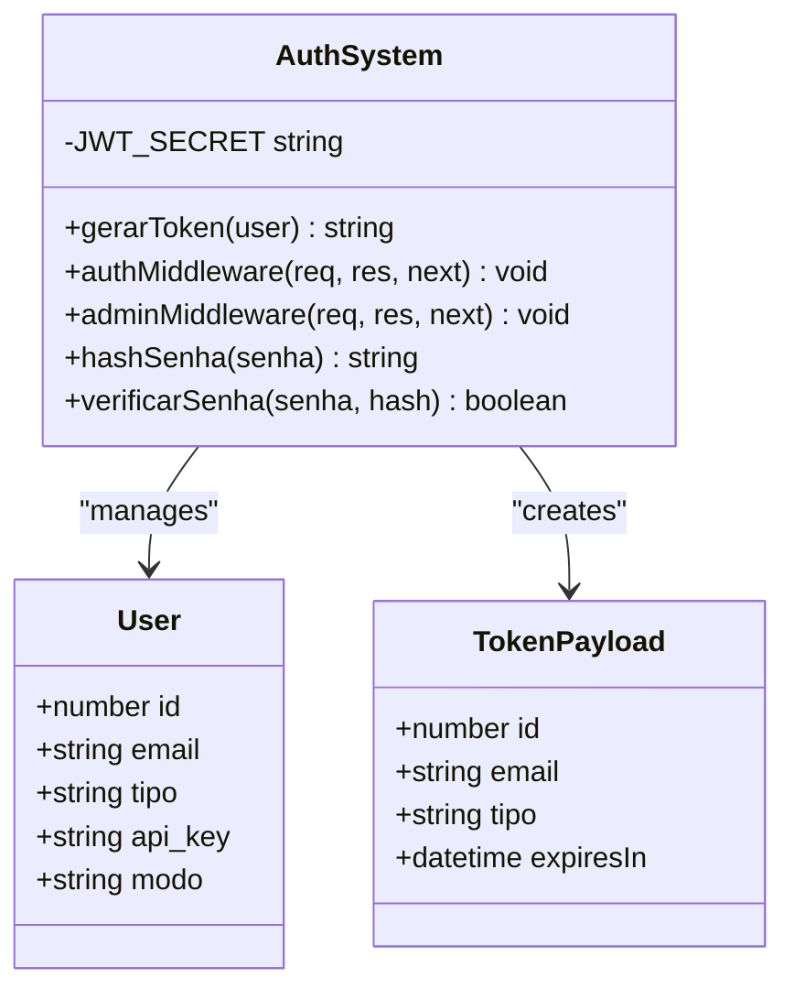
```mermaid
classDiagram
class AuthSystem {
+gerarToken(user) string
+authMiddleware(req, res, next) void
+adminMiddleware(req, res, next) void
+hashSenha(senha) string
+verificarSenha(senha, hash) boolean
-JWT_SECRET string
}
class User {
+number id
+string email
+string tipo
+string api_key
+string modo
}
class TokenPayload {
+number id
+string email
+string tipo
+datetime expiresIn
}
AuthSystem --> User : "manages"
AuthSystem --> TokenPayload : "creates"
```

**Diagram sources**
- [auth.js:8-58](file://auth.js#L8-L58)

**Section sources**
- [auth.js:16-39](file://auth.js#L16-L39)

### Database Schema Design
The database schema supports the premium service integration:

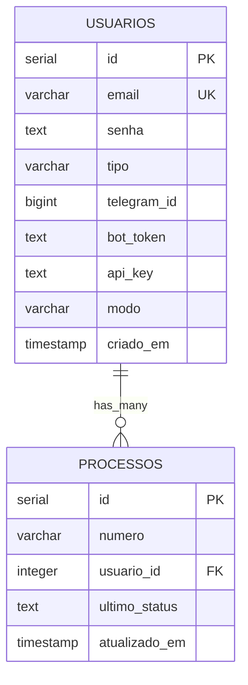
```mermaid
erDiagram
USUARIOS {
serial id PK
varchar email UK
text senha
varchar tipo
bigint telegram_id
text bot_token
text api_key
varchar modo
timestamp criado_em
}
PROCESSOS {
serial id PK
varchar numero
integer usuario_id FK
text ultimo_status
timestamp atualizado_em
}
USUARIOS ||--o{ PROCESSOS : "has_many"
```

**Diagram sources**
- [database.sql:5-24](file://database.sql#L5-L24)

**Section sources**
- [database.sql:5-24](file://database.sql#L5-L24)

### Background Monitoring System
The worker system provides automated process monitoring:

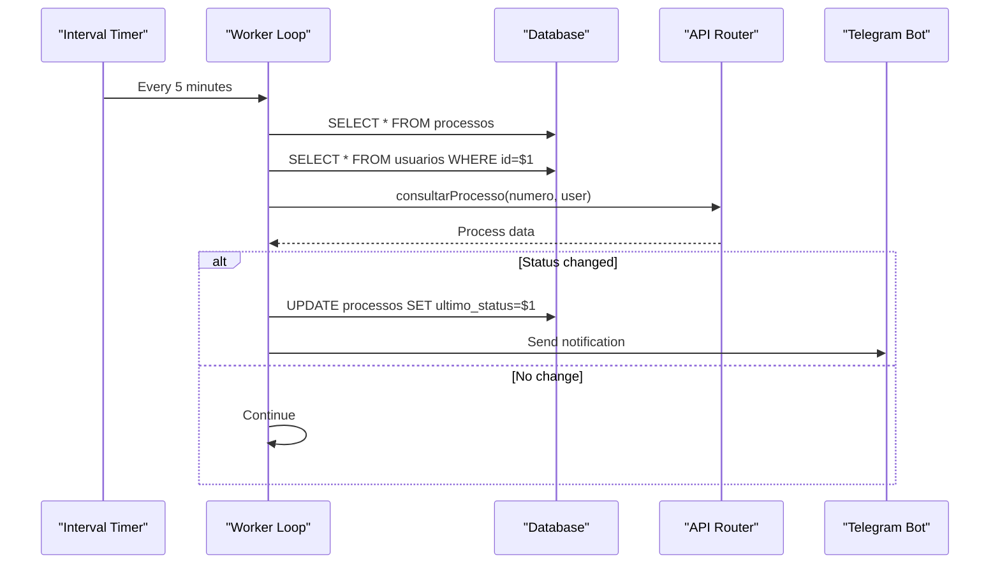
```mermaid
sequenceDiagram
participant Timer as "Interval Timer"
participant Worker as "Worker Loop"
participant DB as "Database"
participant Router as "API Router"
participant Telegram as "Telegram Bot"
Timer->>Worker : Every 5 minutes
Worker->>DB : SELECT * FROM processos
Worker->>DB : SELECT * FROM usuarios WHERE id=$1
Worker->>Router : consultarProcesso(numero, user)
Router-->>Worker : Process data
alt Status changed
Worker->>DB : UPDATE processos SET ultimo_status=$1
Worker->>Telegram : Send notification
else No change
Worker->>Worker : Continue
end
```

**Diagram sources**
- [worker.js:17-65](file://worker.js#L17-L65)

**Section sources**
- [worker.js:17-65](file://worker.js#L17-L65)

## Premium Service Integration

### Service Provider Focus
**Updated** The premium service integration now focuses on Escavador as the primary service:

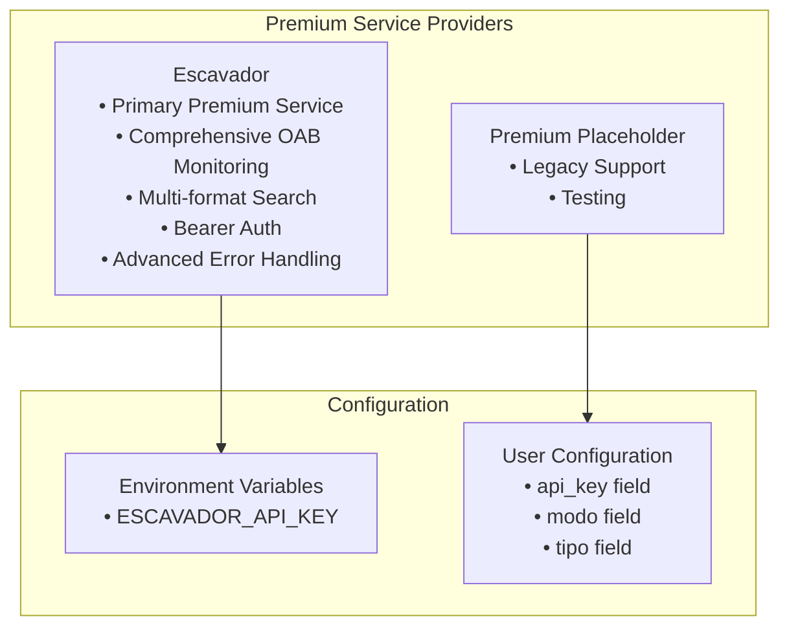
```mermaid
graph TD
subgraph "Premium Service Providers"
Escavador["Escavador<br/>• Primary Premium Service<br/>• Comprehensive OAB Monitoring<br/>• Multi-format Search<br/>• Bearer Auth<br/>• Advanced Error Handling"]
Premium["Premium Placeholder<br/>• Legacy Support<br/>• Testing"]
end
subgraph "Configuration"
EnvVars["Environment Variables<br/>• ESCAVADOR_API_KEY"]
UserConfig["User Configuration<br/>• api_key field<br/>• modo field<br/>• tipo field"]
end
Escavador --> EnvVars
Premium --> UserConfig
```

**Diagram sources**
- [escavador.js:3-5](file://services/escavador.js#L3-L5)
- [premium.js:1-12](file://services/premium.js#L1-L12)

### Service Registration and Discovery
**Updated** The system now focuses on a simplified service discovery:

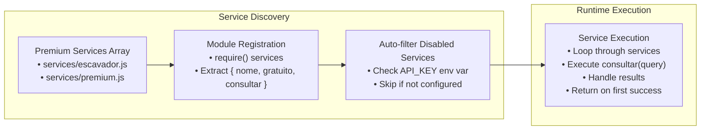
```mermaid
flowchart LR
subgraph "Service Discovery"
Services["Premium Services Array<br/>• services/escavador.js<br/>• services/premium.js"]
Register["Module Registration<br/>• require() services<br/>• Extract { nome, gratuito, consultar }"]
Filter["Auto-filter Disabled Services<br/>• Check API_KEY env var<br/>• Skip if not configured"]
end
subgraph "Runtime Execution"
Execute["Service Execution<br/>• Loop through services<br/>• Execute consultar(query)<br/>• Handle results<br/>• Return on first success"]
end
Services --> Register --> Filter --> Execute
```

**Diagram sources**
- [apiRouter.js:1-5](file://apiRouter.js#L1-L5)
- [apiRouter.js:33-46](file://apiRouter.js#L33-L46)

**Section sources**
- [apiRouter.js:1-5](file://apiRouter.js#L1-L5)
- [apiRouter.js:33-46](file://apiRouter.js#L33-L46)

## Escavador Service Integration

### Comprehensive Service Capabilities
**Updated** The Escavador service provides extensive functionality:

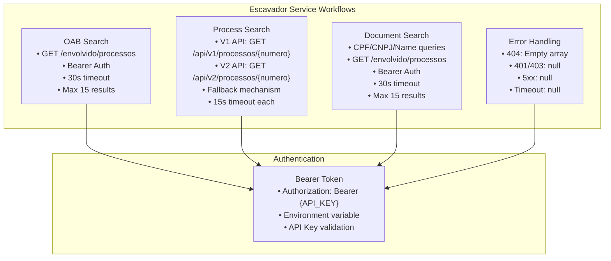
```mermaid
flowchart TD
subgraph "Escavador Service Workflows"
OABSearch["OAB Search<br/>• GET /envolvido/processos<br/>• Bearer Auth<br/>• 30s timeout<br/>• Max 15 results"]
ProcessSearch["Process Search<br/>• V1 API: GET /api/v1/processos/{numero}<br/>• V2 API: GET /api/v2/processos/{numero}<br/>• Fallback mechanism<br/>• 15s timeout each"]
DocumentSearch["Document Search<br/>• CPF/CNPJ/Name queries<br/>• GET /envolvido/processos<br/>• Bearer Auth<br/>• 30s timeout<br/>• Max 15 results"]
ErrorHandling["Error Handling<br/>• 404: Empty array<br/>• 401/403: null<br/>• 5xx: null<br/>• Timeout: null"]
end
subgraph "Authentication"
Auth["Bearer Token<br/>• Authorization: Bearer {API_KEY}<br/>• Environment variable<br/>• API Key validation"]
end
OABSearch --> Auth
ProcessSearch --> Auth
DocumentSearch --> Auth
ErrorHandling --> Auth
```

**Diagram sources**
- [escavador.js:44-81](file://services/escavador.js#L44-L81)
- [escavador.js:84-170](file://services/escavador.js#L84-L170)
- [escavador.js:173-211](file://services/escavador.js#L173-L211)

### Advanced Search Capabilities
The Escavador service implements sophisticated search mechanisms:

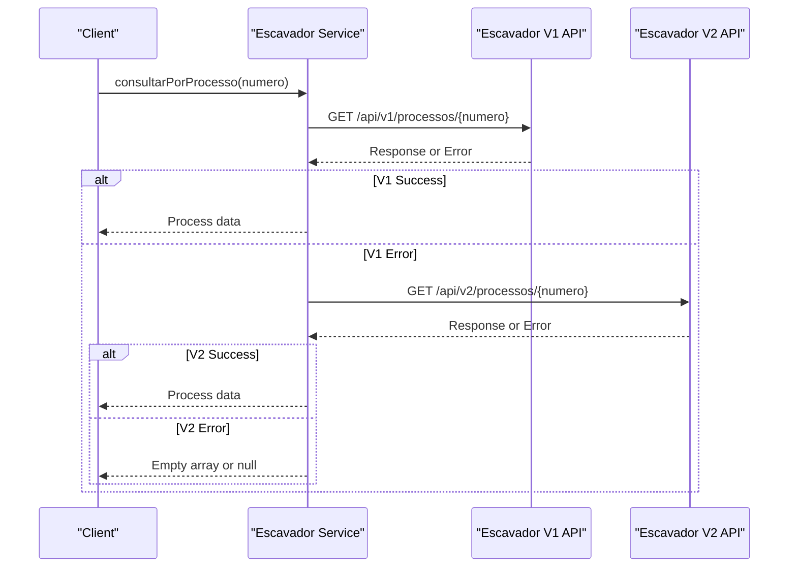
```mermaid
sequenceDiagram
participant Client as "Client"
participant Escavador as "Escavador Service"
participant V1 as "Escavador V1 API"
participant V2 as "Escavador V2 API"
Client->>Escavador : consultarPorProcesso(numero)
Escavador->>V1 : GET /api/v1/processos/{numero}
V1-->>Escavador : Response or Error
alt V1 Success
Escavador-->>Client : Process data
else V1 Error
Escavador->>V2 : GET /api/v2/processos/{numero}
V2-->>Escavador : Response or Error
alt V2 Success
Escavador-->>Client : Process data
else V2 Error
Escavador-->>Client : Empty array or null
end
end
```

**Diagram sources**
- [escavador.js:84-170](file://services/escavador.js#L84-L170)

### Response Standardization
The Escavador service provides standardized response formatting:

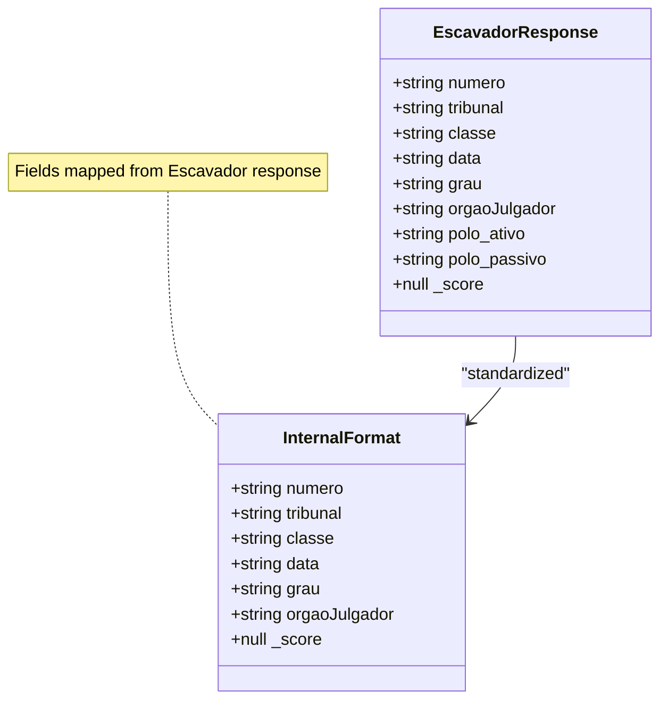
```mermaid
classDiagram
class EscavadorResponse {
+string numero
+string tribunal
+string classe
+string data
+string grau
+string orgaoJulgador
+string polo_ativo
+string polo_passivo
+null _score
}
class InternalFormat {
+string numero
+string tribunal
+string classe
+string data
+string grau
+string orgaoJulgador
+null _score
}
EscavadorResponse --> InternalFormat : "standardized"
note for InternalFormat "Fields mapped from Escavador response"
```

**Diagram sources**
- [escavador.js:63-73](file://services/escavador.js#L63-L73)

**Section sources**
- [escavador.js:10-40](file://services/escavador.js#L10-L40)
- [escavador.js:44-81](file://services/escavador.js#L44-L81)
- [escavador.js:84-170](file://services/escavador.js#L84-L170)
- [escavador.js:173-211](file://services/escavador.js#L173-L211)

## Premium Service Configuration

### Environment Variable Setup
**Updated** Premium services now require a simplified environment variable setup:

| Service | Environment Variable | Purpose |
|---------|---------------------|---------|
| Escavador | `ESCAVADOR_API_KEY` | Primary premium service authentication |

### User Configuration Fields
Users can configure premium access through database fields:

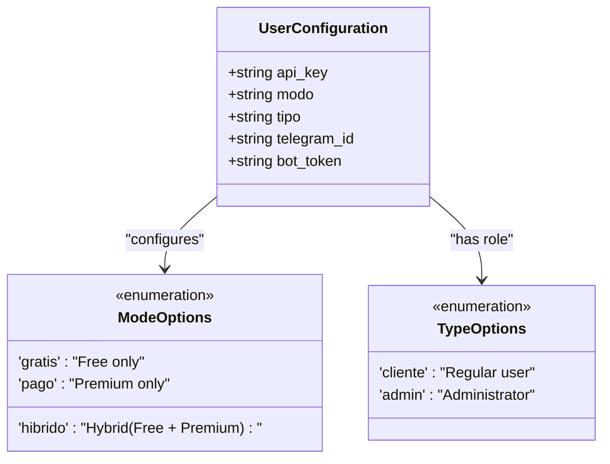
```mermaid
classDiagram
class UserConfiguration {
+string api_key
+string modo
+string tipo
+string telegram_id
+string bot_token
}
class ModeOptions {
<<enumeration>>
'gratis' : "Free only"
'hibrido' : "Hybrid (Free + Premium)"
'pago' : "Premium only"
}
class TypeOptions {
<<enumeration>>
'cliente' : "Regular user"
'admin' : "Administrator"
}
UserConfiguration --> ModeOptions : "configures"
UserConfiguration --> TypeOptions : "has role"
```

**Diagram sources**
- [database.sql:13-14](file://database.sql#L13-L14)

### Service Priority and Fallback
**Updated** The system now implements a streamlined service priority:

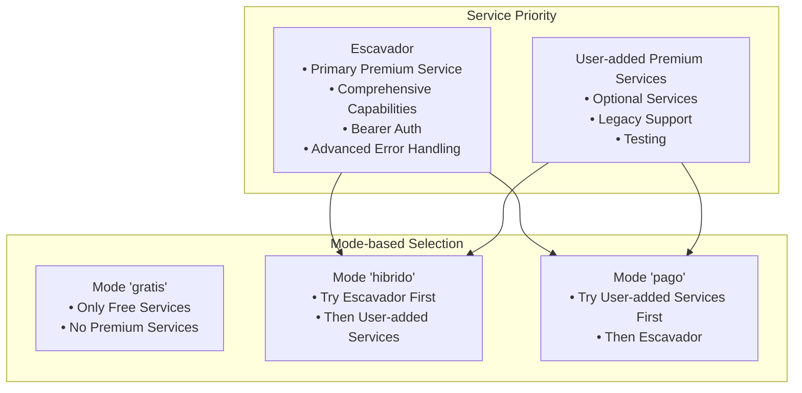
```mermaid
flowchart TD
subgraph "Service Priority"
Priority1["Escavador<br/>• Primary Premium Service<br/>• Comprehensive Capabilities<br/>• Bearer Auth<br/>• Advanced Error Handling"]
Priority2["User-added Premium Services<br/>• Optional Services<br/>• Legacy Support<br/>• Testing"]
end
subgraph "Mode-based Selection"
ModeGratis["Mode 'gratis'<br/>• Only Free Services<br/>• No Premium Services"]
ModeHibrido["Mode 'hibrido'<br/>• Try Escavador First<br/>• Then User-added Services"]
ModePago["Mode 'pago'<br/>• Try User-added Services First<br/>• Then Escavador"]
end
Priority1 --> ModeHibrido
Priority2 --> ModeHibrido
Priority1 --> ModePago
Priority2 --> ModePago
```

**Diagram sources**
- [apiRouter.js:8-31](file://apiRouter.js#L8-L31)
- [apiRouter.js:33-46](file://apiRouter.js#L33-L46)

**Section sources**
- [database.sql:13-14](file://database.sql#L13-L14)
- [apiRouter.js:8-31](file://apiRouter.js#L8-L31)
- [apiRouter.js:33-46](file://apiRouter.js#L33-L46)

## API Key Authentication

### Bearer Token Implementation
**Updated** All premium services use Bearer token authentication with standardized headers:

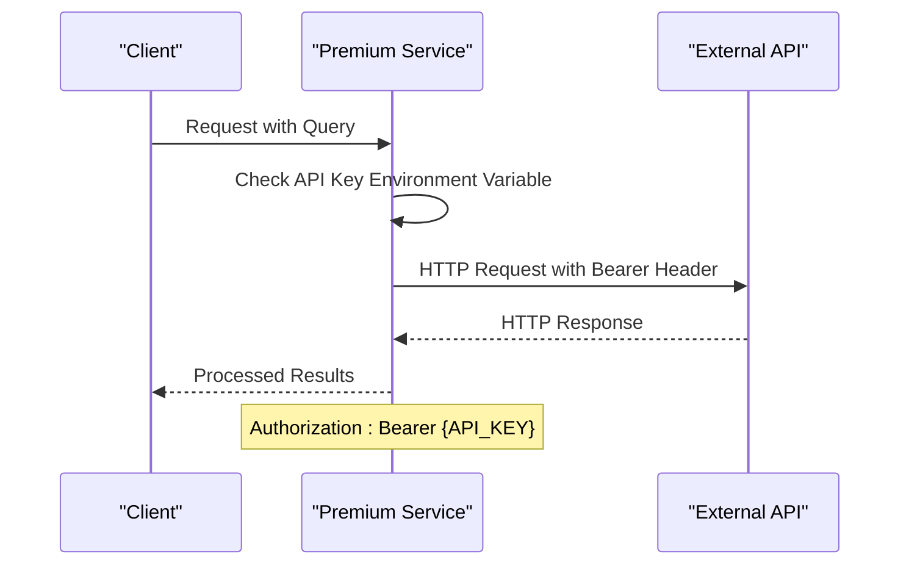
```mermaid
sequenceDiagram
participant Client as "Client"
participant Service as "Premium Service"
participant ExternalAPI as "External API"
Client->>Service : Request with Query
Service->>Service : Check API Key Environment Variable
Service->>ExternalAPI : HTTP Request with Bearer Header
ExternalAPI-->>Service : HTTP Response
Service-->>Client : Processed Results
Note over Service : Authorization : Bearer {API_KEY}
```

**Diagram sources**
- [escavador.js:48](file://services/escavador.js#L48)
- [escavador.js:89](file://services/escavador.js#L89)
- [escavador.js:141](file://services/escavador.js#L141)

### Authentication Error Handling
**Updated** The system implements comprehensive error handling for authentication failures:

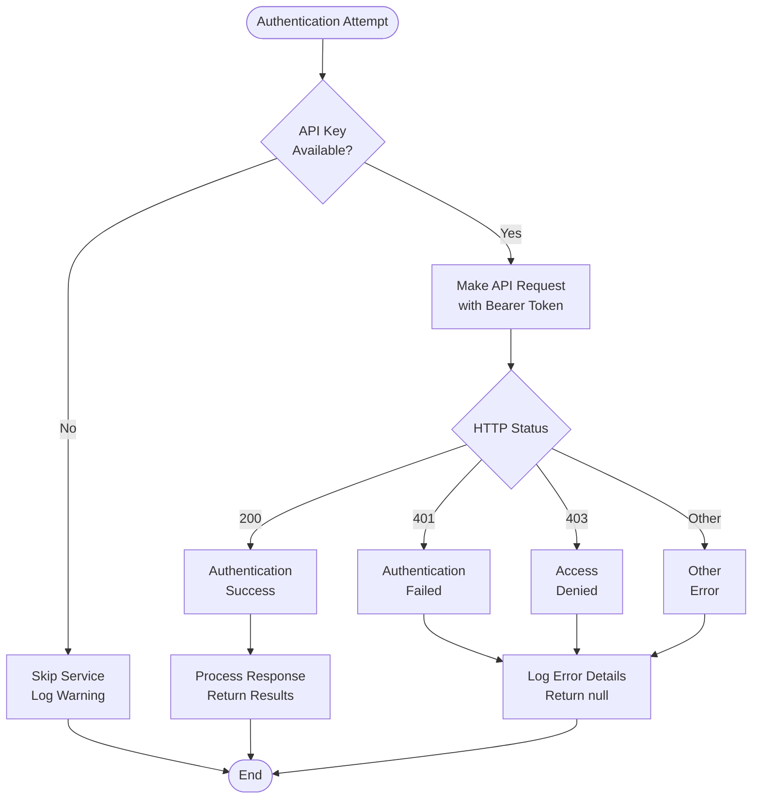
```mermaid
flowchart TD
AuthStart([Authentication Attempt]) --> CheckKey{"API Key<br/>Available?"}
CheckKey --> |No| SkipService["Skip Service<br/>Log Warning"]
CheckKey --> |Yes| MakeRequest["Make API Request<br/>with Bearer Token"]
MakeRequest --> CheckStatus{"HTTP Status"}
CheckStatus --> |200| Success["Authentication<br/>Success"]
CheckStatus --> |401| AuthError["Authentication<br/>Failed"]
CheckStatus --> |403| Forbidden["Access<br/>Denied"]
CheckStatus --> |Other| OtherError["Other<br/>Error"]
AuthError --> LogError["Log Error Details<br/>Return null"]
Forbidden --> LogError
OtherError --> LogError
Success --> ProcessResponse["Process Response<br/>Return Results"]
SkipService --> End([End])
ProcessResponse --> End
LogError --> End
```

**Diagram sources**
- [escavador.js:11](file://services/escavador.js#L11-L14)
- [escavador.js:75-80](file://services/escavador.js#L75-L80)

### Security Best Practices
Premium services follow security best practices:

- **Environment Variable Storage**: API keys stored in environment variables, not in code
- **Bearer Token Usage**: Standardized Bearer token authentication across all services
- **Timeout Configuration**: Configured timeouts to prevent hanging requests
- **Error Logging**: Structured error logging without exposing sensitive information
- **Graceful Degradation**: Services gracefully skip when API keys are not configured

**Section sources**
- [escavador.js:3-5](file://services/escavador.js#L3-L5)
- [escavador.js:11](file://services/escavador.js#L11-L14)
- [escavador.js:48](file://services/escavador.js#L48)
- [escavador.js:89](file://services/escavador.js#L89)
- [escavador.js:141](file://services/escavador.js#L141)

## Response Standardization

### Unified Response Format
**Updated** All premium services return standardized responses compatible with the internal format:

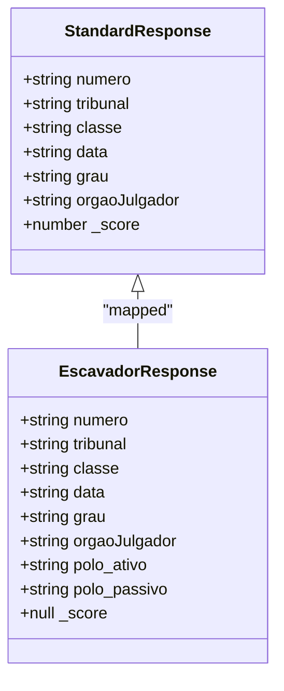
```mermaid
classDiagram
class StandardResponse {
+string numero
+string tribunal
+string classe
+string data
+string grau
+string orgaoJulgador
+number _score
}
class EscavadorResponse {
+string numero
+string tribunal
+string classe
+string data
+string grau
+string orgaoJulgador
+string polo_ativo
+string polo_passivo
+null _score
}
StandardResponse <|-- EscavadorResponse : "mapped"
```

**Diagram sources**
- [escavador.js:63-73](file://services/escavador.js#L63-L73)

### Field Mapping Strategy
**Updated** The system implements consistent field mapping with Escavador as the primary service:

| Field | Escavador | Internal Format |
|-------|-----------|-----------------|
| Process Number | `numero` | `numero` |
| Court | `tribunal` | `tribunal` |
| Class | `classe` | `classe` |
| Date | `data` | `data` |
| Degree | `grau` | `grau` |
| Court Body | `orgaoJulgador` | `orgaoJulgador` |
| Score | `null` | `_score` |

### Error Response Handling
**Updated** The system handles various error scenarios consistently:

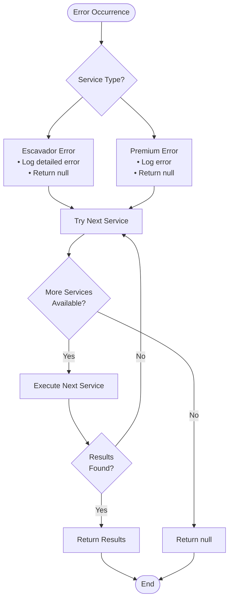
```mermaid
flowchart TD
ErrorStart([Error Occurrence]) --> CheckService{"Service Type?"}
CheckService --> EscavadorError["Escavador Error<br/>• Log detailed error<br/>• Return null"]
CheckService --> PremiumError["Premium Error<br/>• Log error<br/>• Return null"]
EscavadorError --> NextService["Try Next Service"]
PremiumError --> NextService
NextService --> CheckFallback{"More Services<br/>Available?"}
CheckFallback --> |Yes| ExecuteNext["Execute Next Service"]
CheckFallback --> |No| ReturnNull["Return null"]
ExecuteNext --> CheckSuccess{"Results<br/>Found?"}
CheckSuccess --> |Yes| ReturnResults["Return Results"]
CheckSuccess --> |No| NextService
ReturnResults --> End([End])
ReturnNull --> End
```

**Diagram sources**
- [apiRouter.js:41](file://apiRouter.js#L41)
- [escavador.js:75-80](file://services/escavador.js#L75-L80)

**Section sources**
- [escavador.js:63-73](file://services/escavador.js#L63-L73)
- [apiRouter.js:41](file://apiRouter.js#L41)

## Dependency Analysis
**Updated** The system exhibits clean dependency management with clear separation of concerns:

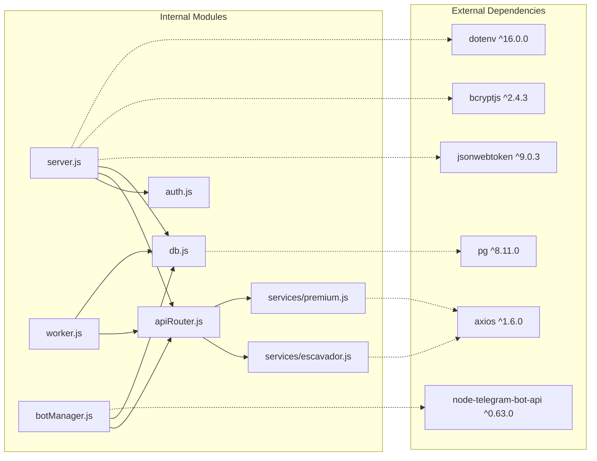
```mermaid
graph LR
subgraph "External Dependencies"
Axios["axios ^1.6.0"]
JWT["jsonwebtoken ^9.0.3"]
BCrypt["bcryptjs ^2.4.3"]
PG["pg ^8.11.0"]
Telegram["node-telegram-bot-api ^0.63.0"]
Dotenv["dotenv ^16.0.0"]
end
subgraph "Internal Modules"
Server["server.js"]
Auth["auth.js"]
Router["apiRouter.js"]
Escavador["services/escavador.js"]
Premium["services/premium.js"]
Worker["worker.js"]
BotMgr["botManager.js"]
DB["db.js"]
end
Server --> Auth
Server --> Router
Router --> Escavador
Router --> Premium
Worker --> Router
BotMgr --> Router
Server --> DB
Worker --> DB
BotMgr --> DB
Escavador -.-> Axios
Premium -.-> Axios
Server -.-> JWT
Server -.-> BCrypt
DB -.-> PG
BotMgr -.-> Telegram
Server -.-> Dotenv
```

**Diagram sources**
- [package.json:11-19](file://package.json#L11-L19)
- [server.js:1-10](file://server.js#L1-L10)
- [escavador.js:1](file://services/escavador.js#L1)
- [premium.js:1](file://services/premium.js#L1)

**Section sources**
- [package.json:11-19](file://package.json#L11-L19)

## Performance Considerations
**Updated** The premium service integration includes several performance optimizations:

### Caching Strategies
- **Bot instances caching**: Prevents recreation of Telegram bot instances
- **User data caching**: Reduces repeated database queries in worker loops
- **Connection pooling**: Efficient database connection management
- **Service discovery caching**: Avoids repeated module loading

### Asynchronous Processing
- Non-blocking API calls using async/await
- Parallel processing where safe (avoiding concurrent database operations)
- Background processing for monitoring tasks
- Timeout configuration for external API calls

### Resource Management
- Connection limits and timeouts for external API calls
- Graceful degradation when premium services are unavailable
- Efficient database queries with proper indexing
- Service auto-discovery with environment variable checks

### Premium Service Optimization
**Updated** The system optimizes for the streamlined architecture:
- **Service prioritization**: Escavador as the primary service with user-added services as fallback
- **Automatic service skipping**: Services without API keys are skipped automatically
- **Error handling**: Comprehensive error handling prevents cascading failures
- **Response standardization**: Consistent response format reduces processing overhead
- **Simplified architecture**: Reduced complexity improves maintainability and performance

## Troubleshooting Guide

### Common Issues and Solutions

#### Authentication Problems
- **Symptom**: 401 Token inválido
- **Cause**: Expired or malformed JWT token
- **Solution**: Regenerate token using login endpoint

#### Premium Service Access Issues
**Updated** - Premium fallback not functioning as expected:
- **Symptom**: Premium services not being used
- **Cause**: Missing API key or incorrect mode configuration
- **Solution**: Verify user.api_key and user.modo fields in database

#### Escavador Service Issues
**Updated** - Escavador service problems:
- **Symptom**: "API Key not configured" logs
- **Cause**: ESCAVADOR_API_KEY environment variable not set
- **Solution**: Set ESCAVADOR_API_KEY environment variable

- **Symptom**: OAB searches failing with 404
- **Cause**: OAB not found in Escavador database
- **Solution**: Verify OAB format (UF/Numero) and try process number search

- **Symptom**: Process searches timing out
- **Cause**: Escavador API latency or rate limiting
- **Solution**: Wait and retry, or use alternative search methods

#### Database Connectivity
- **Symptom**: Connection pool errors
- **Cause**: Incorrect database credentials or network issues
- **Solution**: Check environment variables and database availability

#### Telegram Integration
- **Symptom**: Bot not responding to messages
- **Cause**: Invalid bot token or missing Telegram ID
- **Solution**: Verify bot configuration in admin panel

#### Premium Service Configuration
**Updated** - User-added services not appearing:
- **Symptom**: User-added services not being used
- **Cause**: API keys not configured or services not properly registered
- **Solution**: Check user configuration and service registration

**Section sources**
- [auth.js:20-30](file://auth.js#L20-L30)
- [apiRouter.js:11](file://apiRouter.js#L11)
- [db.js:4-10](file://db.js#L4-L10)
- [escavador.js:11](file://services/escavador.js#L11)
- [escavador.js:75-80](file://services/escavador.js#L75-L80)

## Conclusion
**Updated** The premium paid service integration provides a streamlined foundation for extending the free DataJud service with enhanced capabilities. The simplified architecture ensures scalability, maintainability, and clear separation of concerns. Key strengths include:

- **Single primary service focus**: Escavador as the main premium provider with comprehensive capabilities
- **User-configurable integrations**: Flexible API integration through admin panel
- **Simplified authentication system**: Streamlined Bearer token authentication for Escavador
- **Standardized response formatting**: Consistent data across different service providers
- **Intelligent service prioritization**: Optimized for the best user experience with Escavador first
- **Robust error handling**: Preventing cascading failures and providing graceful degradation
- **Secure API key management**: Through environment variables and proper authentication
- **Efficient background processing**: For automated monitoring and notifications
- **Scalable database design**: Supporting user growth and feature expansion

The implementation demonstrates best practices in API integration, error handling, performance optimization, and security while maintaining flexibility for future premium service additions. The removal of the multi-service architecture and focus on Escavador as the primary service represents a significant simplification that improves maintainability and reduces complexity.

## Appendices

### API Endpoint Reference
- **POST /auth/registro**: User registration with premium configuration
- **POST /auth/login**: User authentication and token generation
- **GET /auth/me**: Current user profile information
- **GET /processos**: Process monitoring list (with role-based filtering)
- **GET /usuarios**: Admin-only user management

### Premium Configuration Fields
- **api_key**: Premium service authentication token
- **modo**: Access mode ('gratis', 'hibrido', 'pago')
- **tipo**: User role ('cliente', 'admin')

### Environment Variables
- **JWT_SECRET**: Secret key for JWT token generation
- **ESCAVADOR_API_KEY**: Escavador service authentication
- **DB_HOST**, **DB_USER**, **DB_PASSWORD**, **DB_NAME**, **DB_PORT**: Database connection details

### Premium Service Providers
**Updated** - Current service providers:
- **Escavador**: Primary premium service with comprehensive OAB monitoring and process search
- **Premium Placeholder**: Legacy support for testing and future expansion

### Service Priority Order
**Updated** - Current priority order:
1. **Escavador** (primary service) - Comprehensive premium capabilities
2. **User-added Premium Services** (optional) - Additional services configured by users

### Error Codes and Handling
- **200**: Success - Process found
- **401**: Unauthorized - Invalid or missing API key
- **403**: Forbidden - Access denied
- **404**: Not Found - Process not found
- **Other**: Service-specific errors handled gracefully

### Escavador Service Capabilities
- **OAB Search**: Comprehensive OAB monitoring with Bearer authentication
- **Process Search**: Multi-format process number search with fallback mechanisms
- **Document Search**: CPF, CNPJ, and name-based searches
- **Error Handling**: Robust error handling with timeout management