# Premium Paid Service Integration

<cite>
**Referenced Files in This Document**
- [escavador.js](file://services/escavador.js)
- [premium.js](file://services/premium.js)
- [jusbrasil.js](file://services/jusbrasil.js)
- [digesto.js](file://services/digesto.js)
- [custom.js](file://services/custom.js)
- [apiRouter.js](file://apiRouter.js)
- [auth.js](file://auth.js)
- [server.js](file://server.js)
- [worker.js](file://worker.js)
- [botManager.js](file://botManager.js)
- [db.js](file://db.js)
- [database.sql](file://database.sql)
- [package.json](file://package.json)
- [README.md](file://README.md)
</cite>

## Update Summary
**Changes Made**
- Updated premium service integration to reflect enhanced Escavador service with proper OAB endpoint support
- Added comprehensive documentation for Bearer token authentication across premium services
- Documented standardized response formatting for premium service results
- Added support for both OAB and direct process number searches with different endpoint strategies
- Updated architecture diagrams to show the new premium service hierarchy
- Enhanced troubleshooting guide with premium service specific issues

## Table of Contents
1. [Introduction](#introduction)
2. [Project Structure](#project-structure)
3. [Core Components](#core-components)
4. [Architecture Overview](#architecture-overview)
5. [Detailed Component Analysis](#detailed-component-analysis)
6. [Premium Service Integration](#premium-service-integration)
7. [Enhanced Escavador Service](#enhanced-escavador-service)
8. [Premium Service Configuration](#premium-service-configuration)
9. [API Key Authentication](#api-key-authentication)
10. [Response Standardization](#response-standardization)
11. [Dependency Analysis](#dependency-analysis)
12. [Performance Considerations](#performance-considerations)
13. [Troubleshooting Guide](#troubleshooting-guide)
14. [Conclusion](#conclusion)
15. [Appendices](#appendices)

## Introduction
This document describes the premium paid service integration for the judicial process monitoring SaaS. The system provides:
- Free tier using CNJ's DataJud API
- Premium tier with enhanced data retrieval through multiple service providers
- Advanced OAB (Brazilian Bar Association) integration with specialized endpoints
- Telegram bot integration for user interaction
- Admin panel for managing users and configurations
- Automated monitoring of process updates

The premium service acts as an optional enhancement to the free DataJud integration, enabling richer data when the free tier does not return results. The system now supports multiple premium service providers including Jusbrasil, Escavador, and custom integrations.

## Project Structure
The project follows a modular Node.js architecture with clear separation of concerns:
- Services: Data access and external API integrations (including premium services)
- Authentication: JWT-based user authentication and authorization
- Web server: Express-based API endpoints and static file serving
- Background workers: Automated monitoring and Telegram bot management
- Database: PostgreSQL schema for user and process data

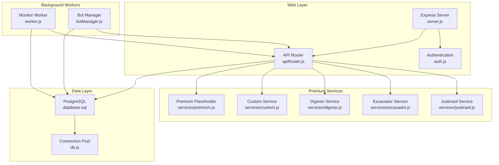

**Diagram sources**
- [server.js:1-326](file://server.js#L1-L326)
- [apiRouter.js:1-111](file://apiRouter.js#L1-L111)
- [jusbrasil.js:1-197](file://services/jusbrasil.js#L1-L197)
- [escavador.js:1-108](file://services/escavador.js#L1-L108)
- [digesto.js:1-25](file://services/digesto.js#L1-L25)
- [custom.js:1-26](file://services/custom.js#L1-L26)
- [premium.js:1-12](file://services/premium.js#L1-L12)
- [worker.js:1-74](file://worker.js#L1-74)
- [botManager.js:1-53](file://botManager.js#L1-L53)
- [database.sql:1-25](file://database.sql#L1-L25)
- [db.js:1-11](file://db.js#L1-L11)

**Section sources**
- [README.md:1-56](file://README.md#L1-L56)
- [package.json:1-21](file://package.json#L1-L21)

## Core Components
The premium service integration consists of several key components working together:

### Premium Service Providers
The system now supports multiple premium service providers with standardized interfaces:
- **Jusbrasil**: Advanced OAB monitoring with asynchronous collection
- **Escavador**: Direct process number and OAB searches with Bearer token authentication
- **Digesto**: Custom API integration framework (placeholder)
- **Custom**: Generic tribunal API integration framework (placeholder)

### Enhanced API Router Logic
The router implements a sophisticated tiered approach:
1. **OAB Priority**: Jusbrasil → Escavador → DataJud (in order of priority)
2. **Mode-based Strategy**: Different fallback behaviors based on user mode
3. **Premium Service Chain**: Multiple premium services with automatic failover

### Authentication and Authorization
The system uses JWT tokens for user authentication and role-based access control for administrative functions.

### Database Schema
The schema supports user profiles, Telegram integration, and premium configuration through dedicated fields.

**Section sources**
- [apiRouter.js:10-14](file://apiRouter.js#L10-L14)
- [apiRouter.js:26-58](file://apiRouter.js#L26-L58)
- [auth.js:16-39](file://auth.js#L16-L39)
- [database.sql:5-24](file://database.sql#L5-L24)

## Architecture Overview
The premium service architecture implements a hybrid approach combining free and paid tiers with multiple service providers:

```mermaid
sequenceDiagram
participant Client as "Telegram Client"
participant Bot as "Telegram Bot"
participant Server as "Express Server"
participant Router as "API Router"
participant Jusbrasil as "Jusbrasil Service"
participant Escavador as "Escavador Service"
participant DataJud as "DataJud Service"
participant Premium as "Premium Services"
participant DB as "PostgreSQL"
Client->>Bot : Send process number/OAB
Bot->>Server : Message event
Server->>Router : consultarProcesso(query, user)
alt OAB Search
Router->>Jusbrasil : consultarPorOAB(uf, numero)
Jusbrasil-->>Router : OAB results or null
alt Jusbrasil Success
Router-->>Server : Process data
Server-->>Bot : Send formatted response
else Jusbrasil Failed
Router->>Escavador : consultarPorOAB(uf, numero)
Escavador-->>Router : OAB results or []
else Direct Process Search
Router->>DataJud : consultarProcesso(numero)
DataJud-->>Router : Free result or []
end
alt Mode == 'pago' or 'hibrido'
Router->>Premium : buscarPagas(query)
Premium-->>Router : Premium result or null
end
Router-->>Server : Process data
Server-->>Bot : Send formatted response
Note over Router,DB : Background monitoring updates process status
```

**Diagram sources**
- [botManager.js:13-39](file://botManager.js#L13-L39)
- [apiRouter.js:17-93](file://apiRouter.js#L17-L93)
- [jusbrasil.js:31-68](file://services/jusbrasil.js#L31-L68)
- [escavador.js:28-66](file://services/escavador.js#L28-L66)
- [datajud.js:3-29](file://services/datajud.js#L3-L29)

## Detailed Component Analysis

### Premium Service Provider Architecture
The premium service architecture supports multiple providers with standardized interfaces:

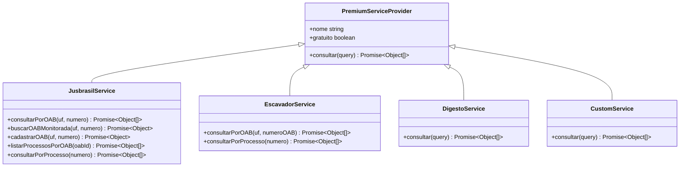

**Diagram sources**
- [jusbrasil.js:10-25](file://services/jusbrasil.js#L10-L25)
- [escavador.js:10-25](file://services/escavador.js#L10-L25)
- [digesto.js:5-18](file://services/digesto.js#L5-L18)
- [custom.js:7-18](file://services/custom.js#L7-L18)

### API Router Logic Flow
The router implements sophisticated fallback logic with premium service integration:

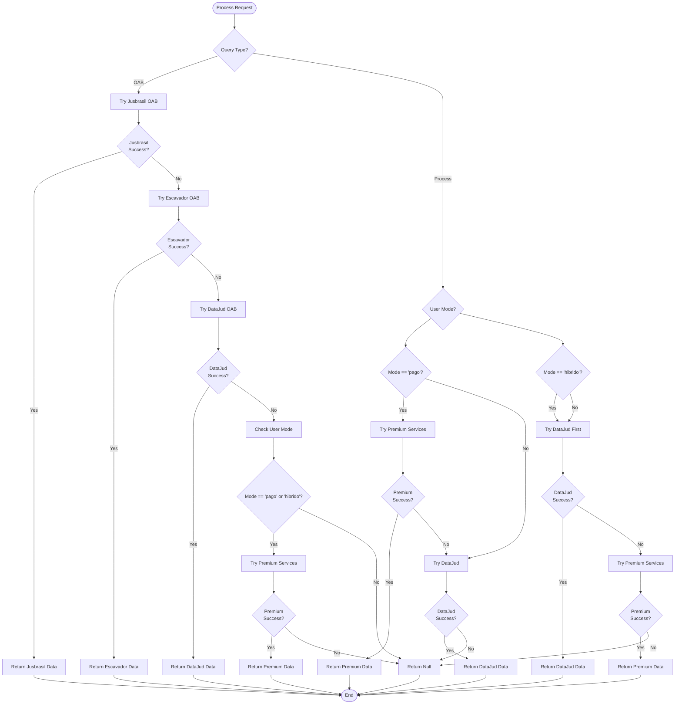

**Diagram sources**
- [apiRouter.js:17-93](file://apiRouter.js#L17-L93)

**Section sources**
- [apiRouter.js:17-93](file://apiRouter.js#L17-L93)

### Authentication and Authorization System
The authentication system provides comprehensive security:

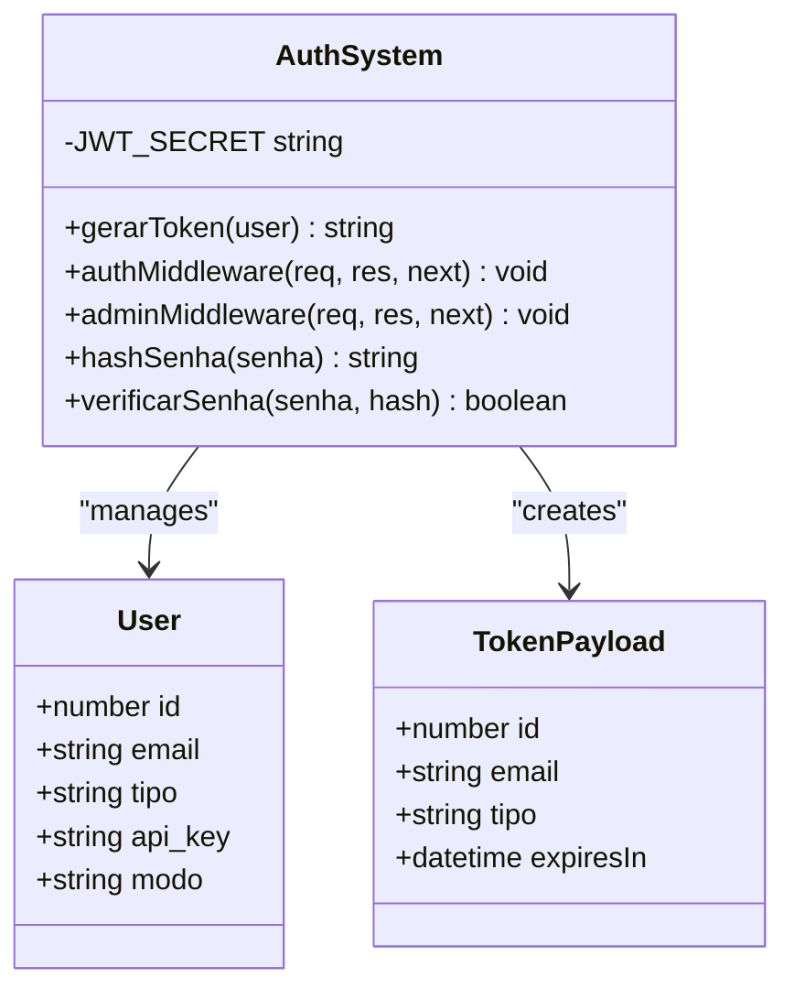

**Diagram sources**
- [auth.js:8-58](file://auth.js#L8-L58)

**Section sources**
- [auth.js:16-39](file://auth.js#L16-L39)

### Database Schema Design
The database schema supports the premium service integration:

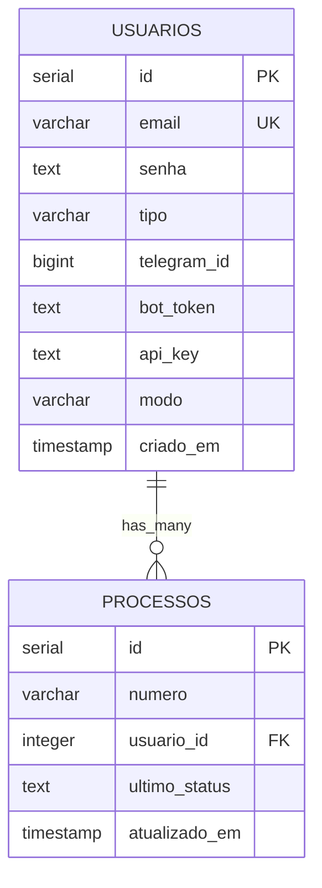

**Diagram sources**
- [database.sql:5-24](file://database.sql#L5-L24)

**Section sources**
- [database.sql:5-24](file://database.sql#L5-L24)

### Background Monitoring System
The worker system provides automated process monitoring:

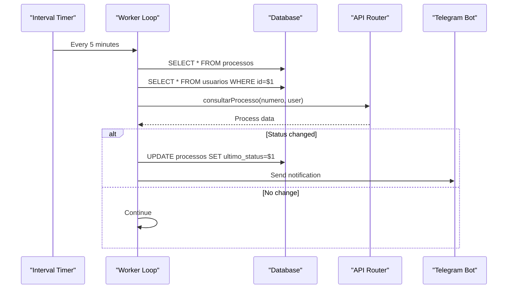

**Diagram sources**
- [worker.js:17-61](file://worker.js#L17-L61)

**Section sources**
- [worker.js:17-61](file://worker.js#L17-L61)

## Premium Service Integration

### Service Provider Hierarchy
The premium service integration establishes a clear hierarchy of service providers:

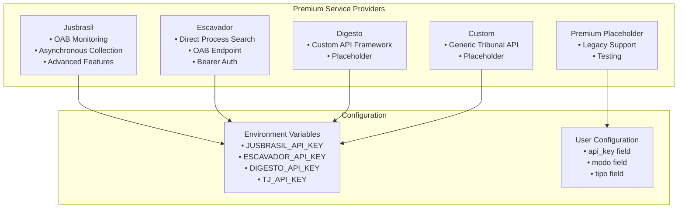

**Diagram sources**
- [jusbrasil.js:3-7](file://services/jusbrasil.js#L3-L7)
- [escavador.js:3-5](file://services/escavador.js#L3-L5)
- [digesto.js:1-3](file://services/digesto.js#L1-L3)
- [custom.js:3-4](file://services/custom.js#L3-L4)

### Service Registration and Discovery
The system automatically discovers and registers premium services:

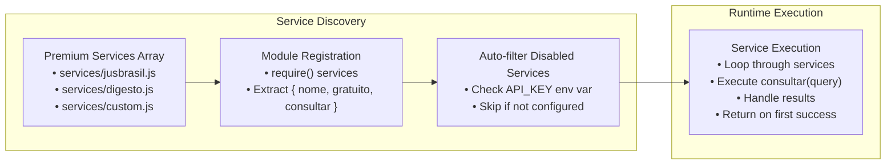

**Diagram sources**
- [apiRouter.js:10-14](file://apiRouter.js#L10-L14)
- [apiRouter.js:95-108](file://apiRouter.js#L95-L108)

**Section sources**
- [apiRouter.js:10-14](file://apiRouter.js#L10-L14)
- [apiRouter.js:95-108](file://apiRouter.js#L95-L108)

## Enhanced Escavador Service

### OAB Endpoint Integration
The Escavador service now provides comprehensive OAB (Brazilian Bar Association) integration:

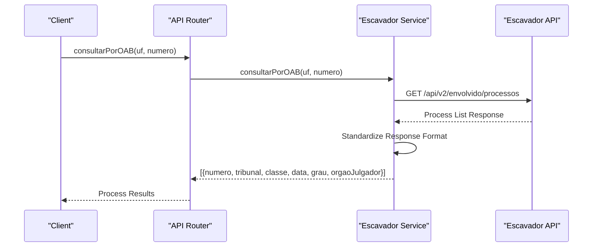

**Diagram sources**
- [escavador.js:28-66](file://services/escavador.js#L28-L66)

### Bearer Token Authentication
The Escavador service implements secure Bearer token authentication:

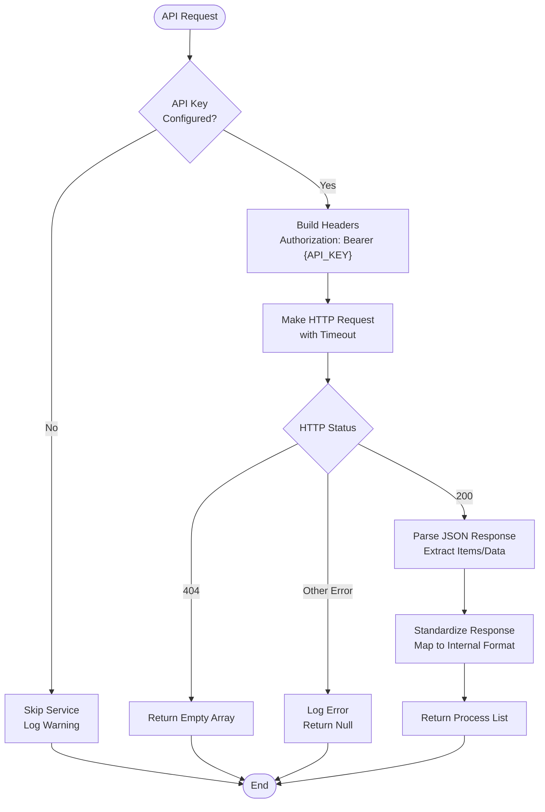

**Diagram sources**
- [escavador.js:32-66](file://services/escavador.js#L32-L66)

### Response Standardization
The Escavador service provides standardized response formatting:

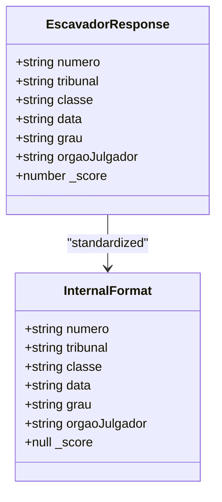

**Diagram sources**
- [escavador.js:48-58](file://services/escavador.js#L48-L58)

**Section sources**
- [escavador.js:16-25](file://services/escavador.js#L16-L25)
- [escavador.js:28-66](file://services/escavador.js#L28-L66)
- [escavador.js:68-101](file://services/escavador.js#L68-L101)

## Premium Service Configuration

### Environment Variable Setup
Premium services require specific environment variables for authentication:

| Service | Environment Variable | Purpose |
|---------|---------------------|---------|
| Jusbrasil | `JUSBRASIL_API_KEY` | Primary premium service authentication |
| Escavador | `ESCAVADOR_API_KEY` | Secondary premium service authentication |
| Digesto | `DIGESTO_API_KEY` | Custom API integration authentication |
| TJ API | `TJ_API_KEY` | Generic tribunal API authentication |

### User Configuration Fields
Users can configure premium access through database fields:

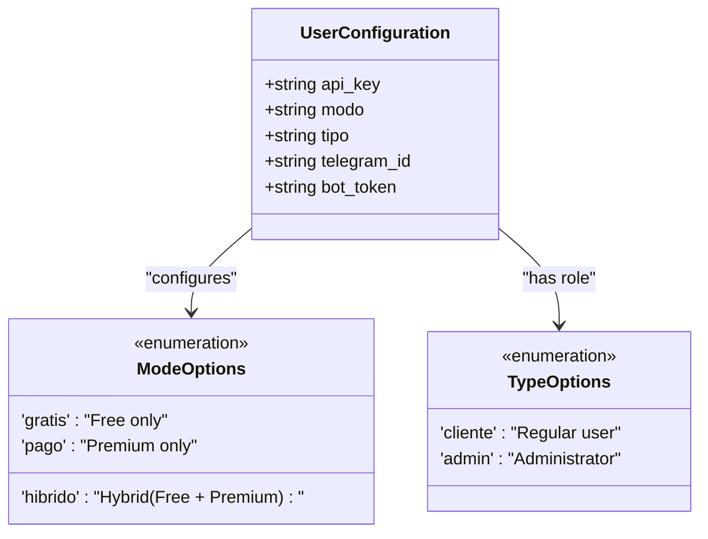

**Diagram sources**
- [database.sql:13-14](file://database.sql#L13-L14)

### Service Priority and Fallback
The system implements intelligent service priority and fallback mechanisms:

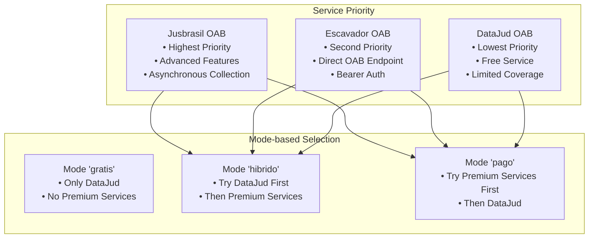

**Diagram sources**
- [apiRouter.js:26-58](file://apiRouter.js#L26-L58)
- [apiRouter.js:62-90](file://apiRouter.js#L62-L90)

**Section sources**
- [database.sql:13-14](file://database.sql#L13-L14)
- [apiRouter.js:26-58](file://apiRouter.js#L26-L58)
- [apiRouter.js:62-90](file://apiRouter.js#L62-L90)

## API Key Authentication

### Bearer Token Implementation
All premium services use Bearer token authentication with standardized headers:

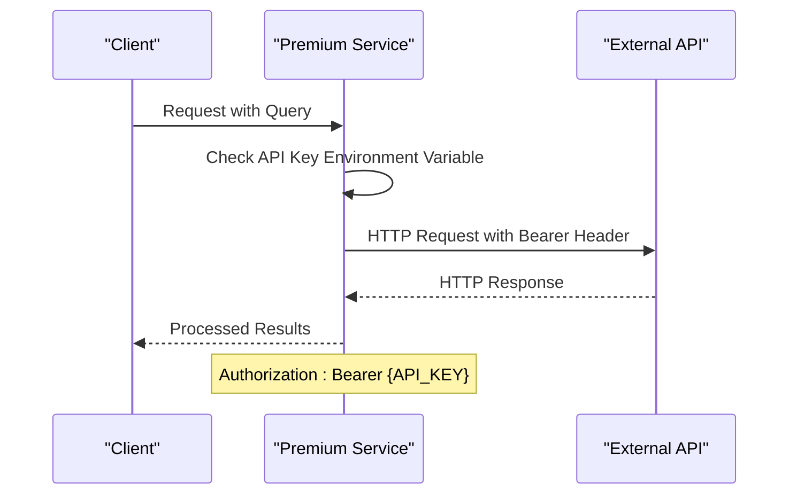

**Diagram sources**
- [jusbrasil.js:76](file://services/jusbrasil.js#L76)
- [escavador.js:38](file://services/escavador.js#L38)

### Authentication Error Handling
The system implements comprehensive error handling for authentication failures:

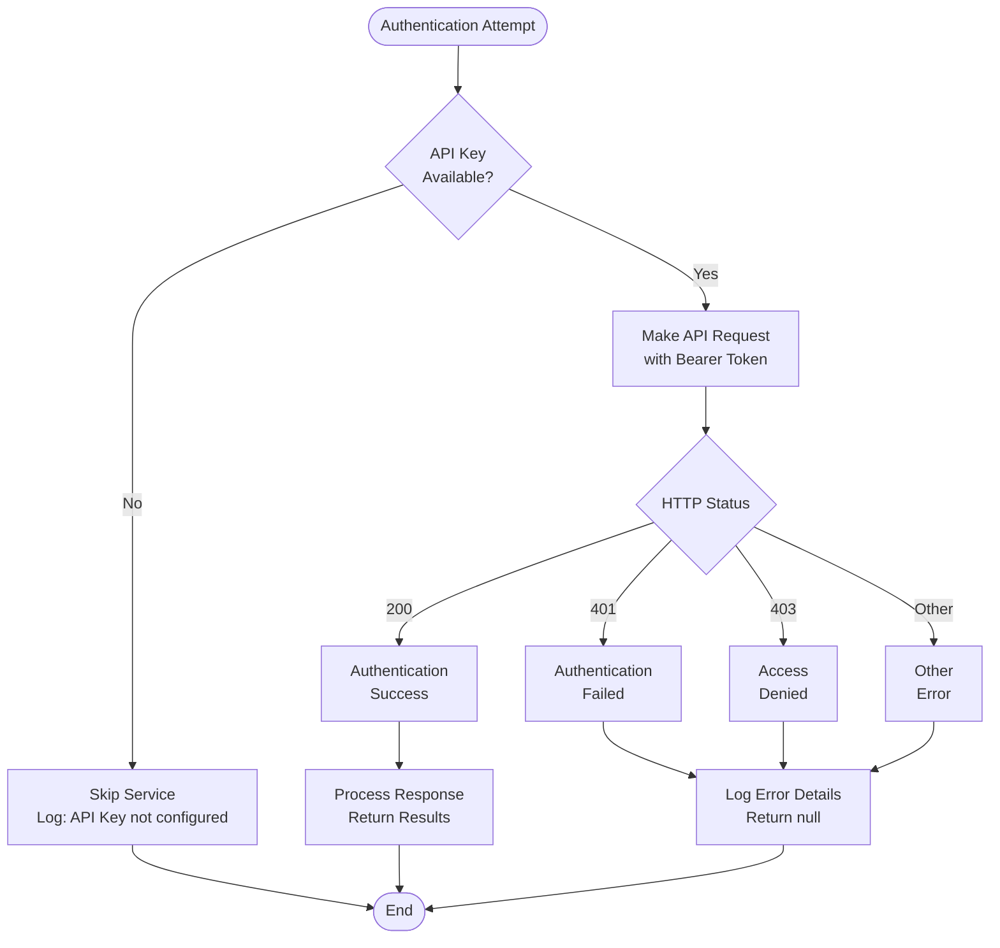

**Diagram sources**
- [jusbrasil.js:62-67](file://services/jusbrasil.js#L62-L67)
- [escavador.js:60-65](file://services/escavador.js#L60-L65)

### Security Best Practices
Premium services follow security best practices:

- **Environment Variable Storage**: API keys stored in environment variables, not in code
- **Bearer Token Usage**: Standardized Bearer token authentication across all services
- **Timeout Configuration**: Configured timeouts to prevent hanging requests
- **Error Logging**: Structured error logging without exposing sensitive information
- **Graceful Degradation**: Services gracefully skip when API keys are not configured

**Section sources**
- [jusbrasil.js:3-7](file://services/jusbrasil.js#L3-L7)
- [escavador.js:3-5](file://services/escavador.js#L3-L5)
- [jusbrasil.js:76](file://services/jusbrasil.js#L76)
- [escavador.js:38](file://services/escavador.js#L38)

## Response Standardization

### Unified Response Format
All premium services return standardized responses compatible with the internal format:

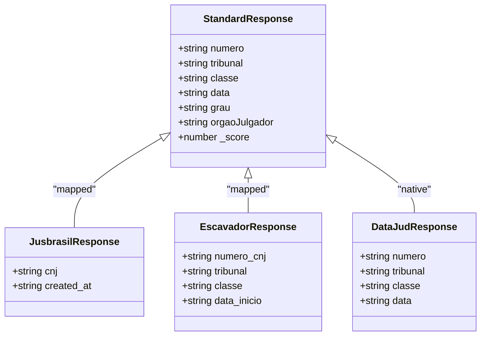

**Diagram sources**
- [jusbrasil.js:144-152](file://services/jusbrasil.js#L144-L152)
- [escavador.js:48-58](file://services/escavador.js#L48-L58)

### Field Mapping Strategy
The system implements consistent field mapping across different service providers:

| Field | Jusbrasil | Escavador | DataJud | Internal Format |
|-------|-----------|-----------|---------|-----------------|
| Process Number | `cnj` | `numero_cnj` | `numero` | `numero` |
| Court | `''` | `tribunal` | `tribunal` | `tribunal` |
| Class | `''` | `classe` | `classe` | `classe` |
| Date | `created_at` | `data_inicio` | `data` | `data` |
| Degree | `''` | `grau` | `''` | `grau` |
| Court Body | `''` | `orgao` | `''` | `orgaoJulgador` |
| Score | `null` | `null` | `null` | `_score` |

### Error Response Handling
The system handles various error scenarios consistently:

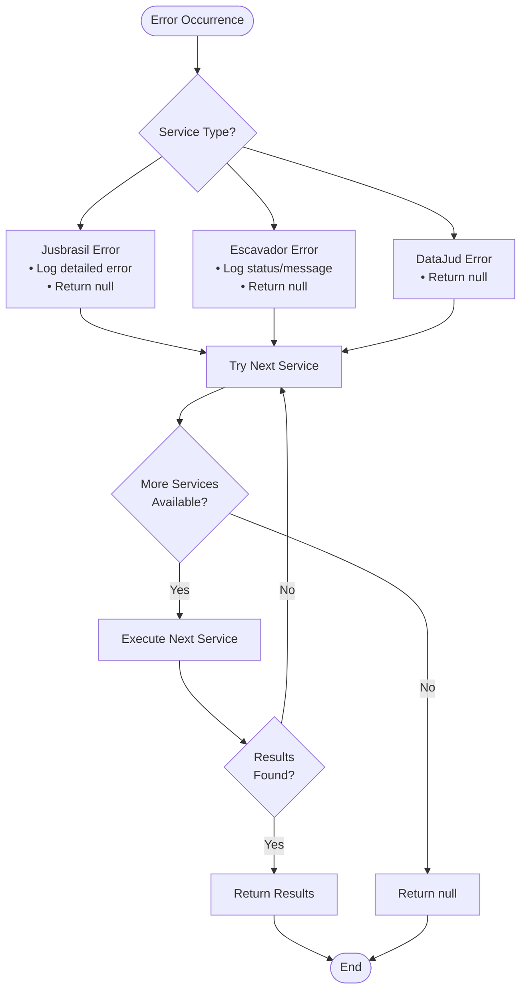

**Diagram sources**
- [apiRouter.js:103-107](file://apiRouter.js#L103-L107)
- [jusbrasil.js:62-67](file://services/jusbrasil.js#L62-L67)
- [escavador.js:60-65](file://services/escavador.js#L60-L65)

**Section sources**
- [jusbrasil.js:144-152](file://services/jusbrasil.js#L144-L152)
- [escavador.js:48-58](file://services/escavador.js#L48-L58)
- [apiRouter.js:103-107](file://apiRouter.js#L103-L107)

## Dependency Analysis
The system exhibits clean dependency management with clear separation of concerns:

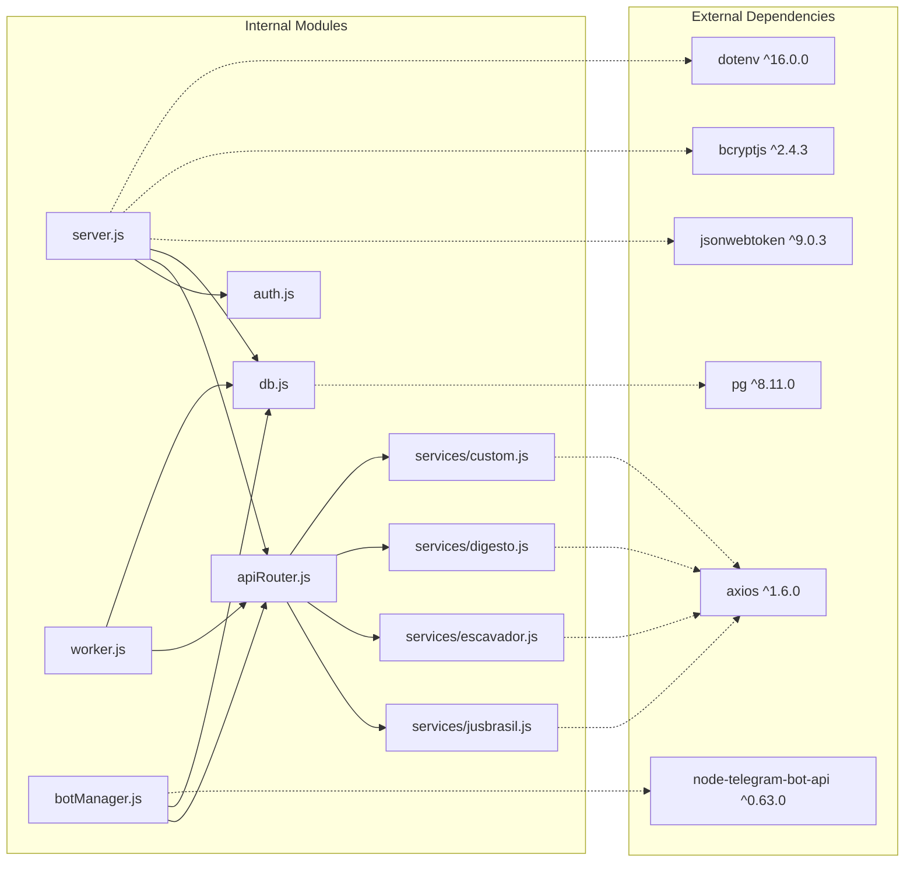

**Diagram sources**
- [package.json:11-19](file://package.json#L11-L19)
- [server.js:1-10](file://server.js#L1-L10)
- [jusbrasil.js:1](file://services/jusbrasil.js#L1)
- [escavador.js:1](file://services/escavador.js#L1)

**Section sources**
- [package.json:11-19](file://package.json#L11-L19)

## Performance Considerations
The premium service integration includes several performance optimizations:

### Caching Strategies
- **Bot instances caching**: Prevents recreation of Telegram bot instances
- **User data caching**: Reduces repeated database queries in worker loops
- **Connection pooling**: Efficient database connection management
- **Service discovery caching**: Avoids repeated module loading

### Asynchronous Processing
- Non-blocking API calls using async/await
- Parallel processing where safe (avoiding concurrent database operations)
- Background processing for monitoring tasks
- Timeout configuration for external API calls

### Resource Management
- Connection limits and timeouts for external API calls
- Graceful degradation when premium services are unavailable
- Efficient database queries with proper indexing
- Service auto-discovery with environment variable checks

### Premium Service Optimization
- **Service prioritization**: Most capable services first (Jusbrasil, then Escavador)
- **Automatic service skipping**: Services without API keys are skipped automatically
- **Error handling**: Comprehensive error handling prevents cascading failures
- **Response standardization**: Consistent response format reduces processing overhead

## Troubleshooting Guide

### Common Issues and Solutions

#### Authentication Problems
- **Symptom**: 401 Token inválido
- **Cause**: Expired or malformed JWT token
- **Solution**: Regenerate token using login endpoint

#### Premium Service Access Issues
- **Symptom**: Premium fallback not triggered
- **Cause**: Missing API key or incorrect mode configuration
- **Solution**: Verify user.api_key and user.modo fields in database

#### Escavador Service Issues
- **Symptom**: "API Key not configured" logs
- **Cause**: ESCAVADOR_API_KEY environment variable not set
- **Solution**: Set ESCAVADOR_API_KEY environment variable

- **Symptom**: OAB searches failing
- **Cause**: Invalid OAB format or unauthorized access
- **Solution**: Verify OAB format (UF/Numero) and API key permissions

#### Jusbrasil Service Issues
- **Symptom**: OAB registration failures
- **Cause**: API key not configured or OAB already registered
- **Solution**: Check JUSBRASIL_API_KEY and verify OAB status

#### Database Connectivity
- **Symptom**: Connection pool errors
- **Cause**: Incorrect database credentials or network issues
- **Solution**: Check environment variables and database availability

#### Telegram Integration
- **Symptom**: Bot not responding to messages
- **Cause**: Invalid bot token or missing Telegram ID
- **Solution**: Verify bot configuration in admin panel

#### Premium Service Configuration
- **Symptom**: Premium services not appearing
- **Cause**: API keys not configured or services not properly exported
- **Solution**: Check environment variables and service exports

**Section sources**
- [auth.js:20-30](file://auth.js#L20-L30)
- [apiRouter.js:11-12](file://apiRouter.js#L11-L12)
- [db.js:4-10](file://db.js#L4-L10)
- [escavador.js:11-14](file://services/escavador.js#L11-L14)
- [jusbrasil.js:11-14](file://services/jusbrasil.js#L11-L14)

## Conclusion
The premium paid service integration provides a robust foundation for extending the free DataJud service with enhanced capabilities. The modular architecture ensures scalability, maintainability, and clear separation of concerns. Key strengths include:

- **Multi-provider premium architecture** enabling seamless fallback between Jusbrasil, Escavador, and other services
- **Advanced OAB integration** with specialized endpoints and asynchronous collection
- **Comprehensive authentication system** supporting Bearer token authentication across all premium services
- **Standardized response formatting** ensuring consistent data across different service providers
- **Intelligent service prioritization** optimizing for the best user experience
- **Robust error handling** preventing cascading failures and providing graceful degradation
- **Secure API key management** through environment variables and proper authentication
- **Efficient background processing** for automated monitoring and notifications
- **Scalable database design** supporting user growth and feature expansion

The implementation demonstrates best practices in API integration, error handling, performance optimization, and security while maintaining flexibility for future premium service additions.

## Appendices

### API Endpoint Reference
- **POST /auth/registro**: User registration with premium configuration
- **POST /auth/login**: User authentication and token generation
- **GET /auth/me**: Current user profile information
- **GET /processos**: Process monitoring list (with role-based filtering)
- **GET /usuarios**: Admin-only user management

### Premium Configuration Fields
- **api_key**: Premium service authentication token
- **modo**: Access mode ('gratis', 'hibrido', 'pago')
- **tipo**: User role ('cliente', 'admin')

### Environment Variables
- **JWT_SECRET**: Secret key for JWT token generation
- **ESCAVADOR_API_KEY**: Escavador service authentication
- **JUSBRASIL_API_KEY**: Jusbrasil service authentication
- **DIGESTO_API_KEY**: Digesto service authentication
- **TJ_API_KEY**: Generic tribunal API authentication
- **DB_HOST**, **DB_USER**, **DB_PASSWORD**, **DB_NAME**, **DB_PORT**: Database connection details

### Premium Service Providers
- **Jusbrasil**: Advanced OAB monitoring with asynchronous collection
- **Escavador**: Direct process number and OAB searches with Bearer token authentication
- **Digesto**: Custom API integration framework (placeholder)
- **Custom**: Generic tribunal API integration framework (placeholder)

### Service Priority Order
1. **Jusbrasil** (highest priority)
2. **Escavador** (second priority)
3. **DataJud** (free fallback)
4. **Digesto** (third-party integrations)
5. **Custom** (generic tribunal APIs)

### Error Codes and Handling
- **200**: Success - Process found
- **401**: Unauthorized - Invalid or missing API key
- **403**: Forbidden - Access denied
- **404**: Not Found - Process not found
- **Other**: Service-specific errors handled gracefully