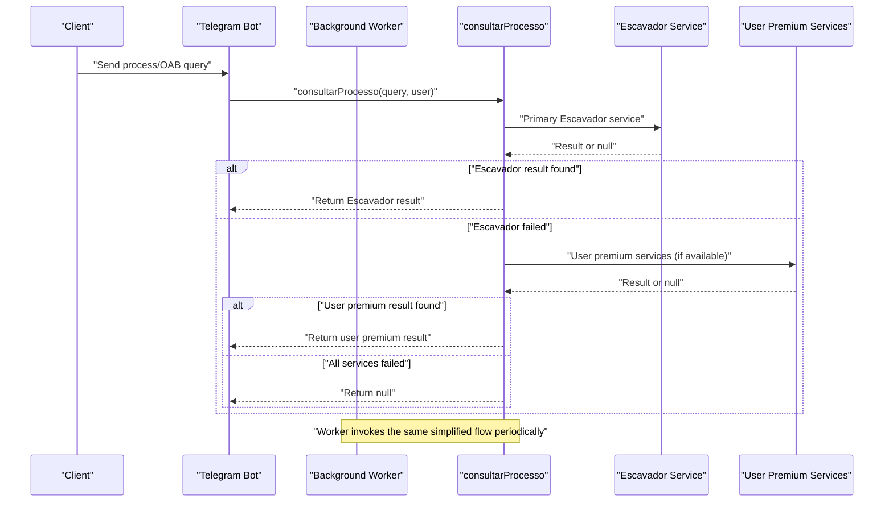
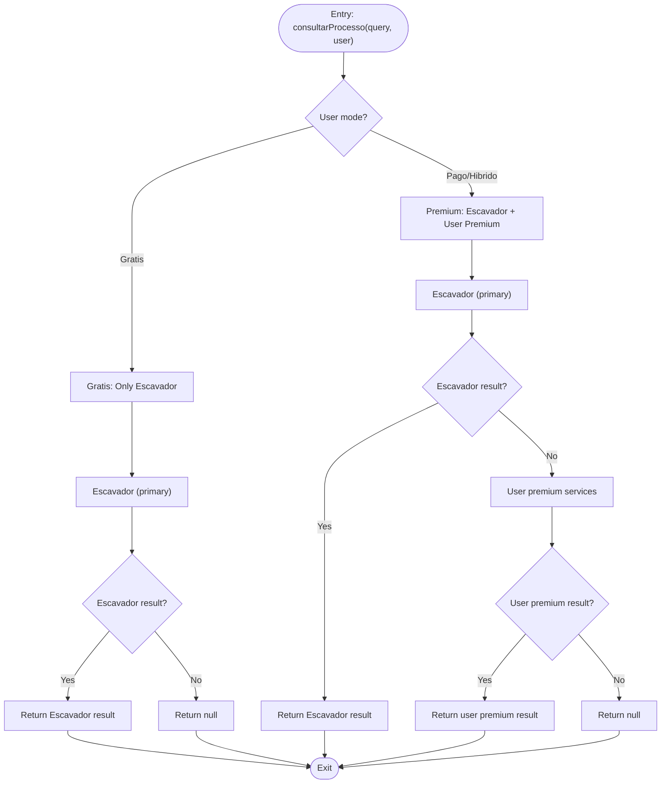
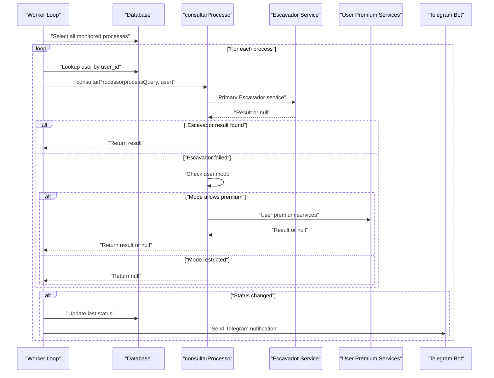
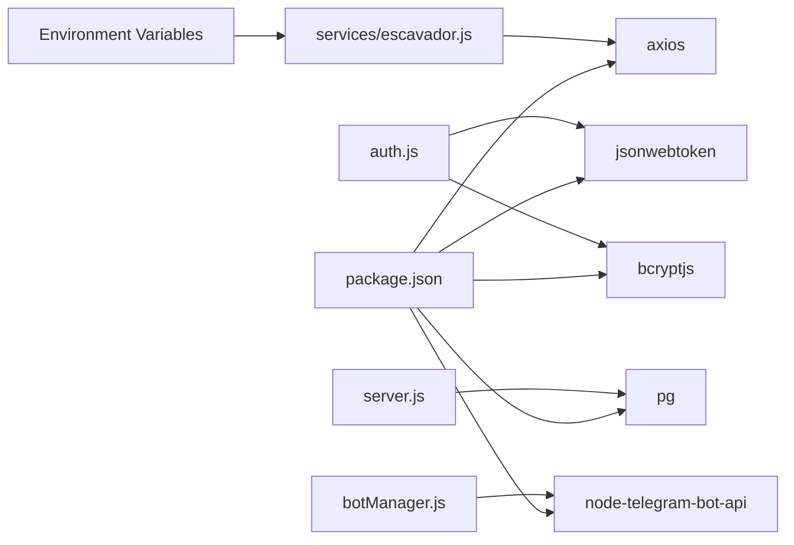

# Tiered Access Strategy

<cite>
**Referenced Files in This Document**
- [server.js](file://server.js)
- [apiRouter.js](file://apiRouter.js)
- [services/escavador.js](file://services/escavador.js)
- [services/premium.js](file://services/premium.js)
- [auth.js](file://auth.js)
- [worker.js](file://worker.js)
- [botManager.js](file://botManager.js)
- [database.sql](file://database.sql)
- [parser.js](file://parser.js)
- [package.json](file://package.json)
</cite>

## Update Summary
**Changes Made**
- **Simplified Architecture**: Removed multi-service fallback architecture in favor of single Escavador focus
- **Optional User API Keys**: Users can now add their own API keys in the panel for premium features
- **Streamlined Decision Logic**: The `consultarProcesso` function now follows a simple two-tier approach
- **Reduced Complexity**: Eliminated fallback mechanisms to DataJud, Jusbrasil, and other premium services
- **Enhanced User Control**: Users can manage their own API keys for enhanced functionality

## Table of Contents
1. [Introduction](#introduction)
2. [Project Structure](#project-structure)
3. [Core Components](#core-components)
4. [Architecture Overview](#architecture-overview)
5. [Detailed Component Analysis](#detailed-component-analysis)
6. [Dependency Analysis](#dependency-analysis)
7. [Performance Considerations](#performance-considerations)
8. [Troubleshooting Guide](#troubleshooting-guide)
9. [Conclusion](#conclusion)

## Introduction
This document explains the simplified tiered access strategy implemented for process and OAB searches with a streamlined approach focusing on Escavador as the primary service. The strategy follows a two-tier model optimized for simplicity and user control:

- **Primary access**: Escavador service (premium paid service with optional user API keys)
- **Secondary access**: User-added premium services (optional user API keys for enhanced functionality)

The decision logic for selecting the tier is encapsulated in the `consultarProcesso` function, which validates user modes and attempts to leverage available API keys for enhanced search capabilities. The simplified approach eliminates complex fallback mechanisms while maintaining flexibility for users who want to add their own premium services.

## Project Structure
The system is organized around a focused set of modules with streamlined service orchestration:
- Authentication and authorization middleware
- API orchestration for tiered lookup with Escavador as the primary service
- Escavador service adapter with comprehensive API key management
- Background worker for periodic updates
- Telegram bot integration for user interactions
- Database schema for users and monitored processes

```mermaid
graph TB
subgraph "HTTP Layer"
S["server.js"]
A["auth.js"]
end
subgraph "Orchestration"
R["apiRouter.js"]
W["worker.js"]
BM["botManager.js"]
end
subgraph "Primary Service"
ESC["services/escavador.js"]
END
subgraph "Optional Premium Services"
PREM["services/premium.js"]
END
subgraph "Persistence"
DB["database.sql"]
PARSER["parser.js"]
end
S --> A
S --> R
R --> ESC
R --> PREM
W --> R
BM --> R
S --> DB
DB --> PARSER
```

**Diagram sources**
- [server.js:1-381](file://server.js#L1-L381)
- [apiRouter.js:1-49](file://apiRouter.js#L1-L49)
- [services/escavador.js:1-218](file://services/escavador.js#L1-L218)
- [services/premium.js:1-12](file://services/premium.js#L1-L12)
- [worker.js:1-74](file://worker.js#L1-L74)
- [botManager.js:1-221](file://botManager.js#L1-L221)
- [database.sql:1-25](file://database.sql#L1-L25)
- [parser.js:1-102](file://parser.js#L1-L102)

**Section sources**
- [server.js:1-381](file://server.js#L1-L381)
- [apiRouter.js:1-49](file://apiRouter.js#L1-L49)
- [services/escavador.js:1-218](file://services/escavador.js#L1-L218)
- [services/premium.js:1-12](file://services/premium.js#L1-L12)
- [worker.js:1-74](file://worker.js#L1-L74)
- [botManager.js:1-221](file://botManager.js#L1-L221)
- [database.sql:1-25](file://database.sql#L1-L25)
- [parser.js:1-102](file://parser.js#L1-L102)

## Core Components
- **Simplified consult process function**: Implements a straightforward two-tier lookup logic with Escavador as primary service and optional user premium services
- **Escavador service adapter**: Comprehensive service with API key validation, multiple search endpoints, and robust error handling
- **Optional premium service integration**: Placeholder for user-added premium services that can be added through the panel
- **Authentication and authorization**: JWT-based middleware and admin guard
- **Service orchestration**: Worker and Telegram bot invoke the simplified consult process function
- **Persistence**: PostgreSQL-backed user and process records with mode validation

Key behaviors:
- **Primary service focus**: Escavador as the main service with optional user API keys
- **User-controlled premium access**: Users can add their own API keys for enhanced functionality
- **Graceful degradation**: Return null when Escavador is unavailable or user has no premium services
- **Mode-based access control**: Gratis, pago, and hibrido modes determine service availability and premium access

**Section sources**
- [apiRouter.js:8-31](file://apiRouter.js#L8-L31)
- [services/escavador.js:10-40](file://services/escavador.js#L10-L40)
- [auth.js:16-39](file://auth.js#L16-L39)
- [worker.js:45-45](file://worker.js#L45-L45)
- [botManager.js:24-24](file://botManager.js#L24-L24)

## Architecture Overview
The simplified consult process function orchestrates a streamlined tier selection focused on Escavador as the primary service. It receives a process number and user context, attempts the primary Escavador service, and falls back to user-added premium services when permitted by user mode and available API keys.



**Diagram sources**
- [botManager.js:122-198](file://botManager.js#L122-L198)
- [worker.js:17-65](file://worker.js#L17-L65)
- [apiRouter.js:8-31](file://apiRouter.js#L8-L31)
- [services/escavador.js:10-40](file://services/escavador.js#L10-L40)

## Detailed Component Analysis

### Simplified Consult Process Function Decision Logic
The consult process function enforces a straightforward two-tier selection:
- **Primary tier**: Escavador service with comprehensive search capabilities
- **Secondary tier**: User-added premium services when mode allows and API keys are configured
- **API key validation**: Escavador requires server-level API key, user premium services use user-provided keys
- **Error handling**: Comprehensive logging and graceful failure patterns



**Diagram sources**
- [apiRouter.js:8-31](file://apiRouter.js#L8-L31)

**Section sources**
- [apiRouter.js:8-31](file://apiRouter.js#L8-L31)

### Escavador Service Adapter

#### Primary Service Implementation
- **Purpose**: Main service for all search types with comprehensive API key management
- **API Key Management**: Uses `ESCAVADOR_API_KEY` environment variable for server-level authentication
- **Multi-endpoint Support**: Handles OAB, CPF, CNPJ, name, and process number searches
- **Dual API Version Support**: Tries V1 endpoints first, falls back to V2 when needed
- **Robust Error Handling**: Comprehensive logging and graceful failure patterns

#### Escavador Service Features
- **OAB Searches**: Direct OAB number lookup via `/api/v1/envolvido/processos`
- **Process Number Searches**: Multi-version support with V1 (more data) and V2 fallback
- **Document-Based Searches**: CPF, CNPJ, and name searches with standardized response format
- **Rate Limiting**: Built-in timeout handling (15-30 seconds) to prevent service overload
- **Graceful Degradation**: Returns null when API key is not configured or service fails

**Section sources**
- [services/escavador.js:1-218](file://services/escavador.js#L1-L218)

### Optional Premium Service Integration

#### User-Controlled Premium Services
- **Purpose**: Allow users to add their own premium API keys for enhanced functionality
- **Configuration**: Users can add API keys through the panel interface
- **Integration Point**: Placeholder service (`services/premium.js`) ready for real API integration
- **Mode Compatibility**: Only active when user has 'pago' or 'hibrido' mode
- **Error Isolation**: Failed user premium services don't affect main Escavador functionality

#### Current Implementation Status
- **Placeholder Service**: `services/premium.js` currently returns mock data for demonstration
- **Ready for Integration**: Structured to easily integrate real premium services like Jusbrasil
- **Extensible Design**: Easy to add new premium services without changing core logic

**Section sources**
- [services/premium.js:1-12](file://services/premium.js#L1-L12)
- [apiRouter.js:33-46](file://apiRouter.js#L33-L46)

### Authentication and Authorization
- **JWT-based authentication middleware**: Verifies tokens from Authorization headers
- **Admin middleware**: Restricts sensitive endpoints to administrators
- **Users identified**: By decoded JWT claims with role-based access control
- **Mode validation**: Users can have 'gratis', 'pago', or 'hibrido' modes affecting service access

Access enforcement:
- **Token presence**: Mandatory for protected routes
- **Role checks**: Admin-only routes gated by role verification
- **Mode-based restrictions**: Different service availability based on user mode

**Section sources**
- [auth.js:16-39](file://auth.js#L16-L39)
- [server.js:26-101](file://server.js#L26-L101)
- [server.js:104-206](file://server.js#L104-L206)

### Orchestration: Worker and Telegram Bot
- **Worker**: Periodically queries monitored processes and triggers simplified consult process
- **Telegram Bot**: Responds to user messages by invoking consult process and persists results
- **Consistent flow**: Both paths pass the same user context and query parameters to consult process
- **Simplified handling**: Automatic routing through primary Escavador service with optional user premium



**Diagram sources**
- [worker.js:17-65](file://worker.js#L17-L65)
- [botManager.js:122-198](file://botManager.js#L122-L198)
- [apiRouter.js:8-31](file://apiRouter.js#L8-L31)

**Section sources**
- [worker.js:17-65](file://worker.js#L17-L65)
- [botManager.js:122-198](file://botManager.js#L122-L198)

### Database Schema and User Mode Validation
- **Users table**: Includes fields for Telegram identifiers, bot token, API key, and mode
- **Default mode**: 'gratis' (free access)
- **Mode types**: 'gratis' (free only), 'pago' (premium only), 'hibrido' (hybrid)
- **Processes table**: References users and stores last observed status
- **Mode-based access**: Controls which services are available to users

User mode validation:
- **Gratis mode**: Only primary Escavador service is accessible
- **Pago mode**: Primary Escavador service plus user premium services
- **Hibrido mode**: Primary Escavador service plus user premium services
- **API key requirement**: Primary Escavador requires server-level API key, user premium services use user-provided keys

**Section sources**
- [database.sql:5-24](file://database.sql#L5-L24)
- [apiRouter.js:11](file://apiRouter.js#L11)

## Dependency Analysis
External dependencies relevant to the simplified tiered access:
- **axios**: HTTP client for Escavador service integration
- **jsonwebtoken**: JWT token verification for authentication
- **bcryptjs**: Password hashing for user registration and login
- **pg**: PostgreSQL client for database operations
- **node-telegram-bot-api**: Telegram bot integration
- **Environment variables**: API key management for primary service



**Diagram sources**
- [package.json:11-19](file://package.json#L11-L19)
- [services/escavador.js:1](file://services/escavador.js#L1)
- [auth.js:1-3](file://auth.js#L1-L3)
- [server.js:1-6](file://server.js#L1-L6)
- [botManager.js:1](file://botManager.js#L1)

**Section sources**
- [package.json:11-19](file://package.json#L11-L19)
- [services/escavador.js:1](file://services/escavador.js#L1)
- [auth.js:1-3](file://auth.js#L1-L3)
- [server.js:1-6](file://server.js#L1-L6)
- [botManager.js:1](file://botManager.js#L1)

## Performance Considerations
- **Simplified service calls**: Reduced complexity from multiple service calls to single primary service
- **Server-level caching**: Environment variable checks cached at module load time
- **Rate limiting**: Built-in timeouts (15-30 seconds) prevent long blocking operations
- **Service health monitoring**: Logging of API key configuration and service availability
- **Concurrent processing**: Parallel execution of user premium services in hybrid mode
- **Graceful degradation**: Comprehensive error handling ensures service continuity

## Troubleshooting Guide
Common issues and remedies for the simplified tiered access:

### Escavador Service Issues
- **API key not configured**: Check `ESCAVADOR_API_KEY` environment variable
- **Service unavailability**: Verify Escavador API status and reachability
- **Timeout errors**: Services use configurable timeouts (15-30 seconds)
- **Empty results**: Verify query format and service availability

### User Premium Service Issues
- **API key not configured**: Users need to add API keys through the panel
- **Integration not implemented**: `services/premium.js` is currently a placeholder
- **Mode restrictions**: Premium services only work when user has 'pago' or 'hibrido' mode
- **Service failures**: User premium services don't affect main Escavador functionality

### Authentication and Mode Issues
- **Gratis mode limitations**: Users in gratis mode only get primary Escavador results
- **Pago mode access**: Ensure user has valid API keys for premium services
- **Hybrid mode behavior**: Same as pago mode with user premium services
- **Token validation**: Confirm JWT token format and expiration

### Worker and Bot Integration
- **Worker notifications**: Verify Telegram bot token and chat ID configuration
- **Periodic updates**: Check worker scheduling and database connectivity
- **Service health**: Monitor service logs for API key warnings and error messages

**Section sources**
- [services/escavador.js:3-7](file://services/escavador.js#L3-L7)
- [apiRouter.js:11](file://apiRouter.js#L11)
- [auth.js:17-30](file://auth.js#L17-L30)
- [worker.js:39-44](file://worker.js#L39-L44)

## Conclusion
The simplified tiered access strategy provides a clean, maintainable solution for process and OAB searches with a focus on user control and flexibility:

**Key Improvements:**
- **Single service focus**: Escavador as the primary service reduces complexity and maintenance overhead
- **User-controlled premium access**: Users can add their own API keys for enhanced functionality
- **Graceful degradation**: Comprehensive error handling ensures service continuity
- **Mode-based access control**: Flexible user modes balance cost and functionality
- **Service health monitoring**: Logging and error handling improve system reliability

**System Benefits:**
- **Simplified architecture**: Easy to understand and maintain with fewer moving parts
- **User empowerment**: Users control their own premium services and API keys
- **Cost-effective**: Primary Escavador service provides good coverage for most use cases
- **Scalable design**: Easy to add new premium services through the user panel
- **User experience**: Seamless functionality without complex fallback logic

**Future Enhancements:**
- **Real premium service integration**: Replace placeholder with actual premium service implementations
- **Service health monitoring**: Implement automated health checks for premium services
- **Performance metrics**: Track query performance across different service tiers
- **Advanced rate limiting**: Implement client-side and server-side rate limiting
- **Service discovery**: Dynamic service configuration based on user preferences

The simplified system provides a solid foundation for expanding premium service capabilities while maintaining reliability and user satisfaction across all access tiers.