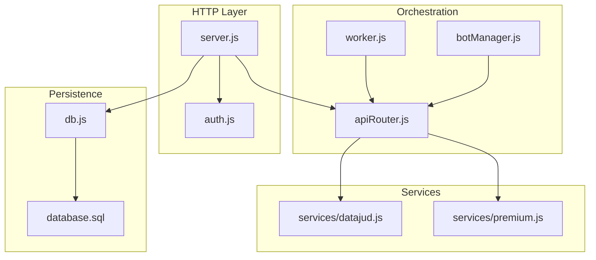
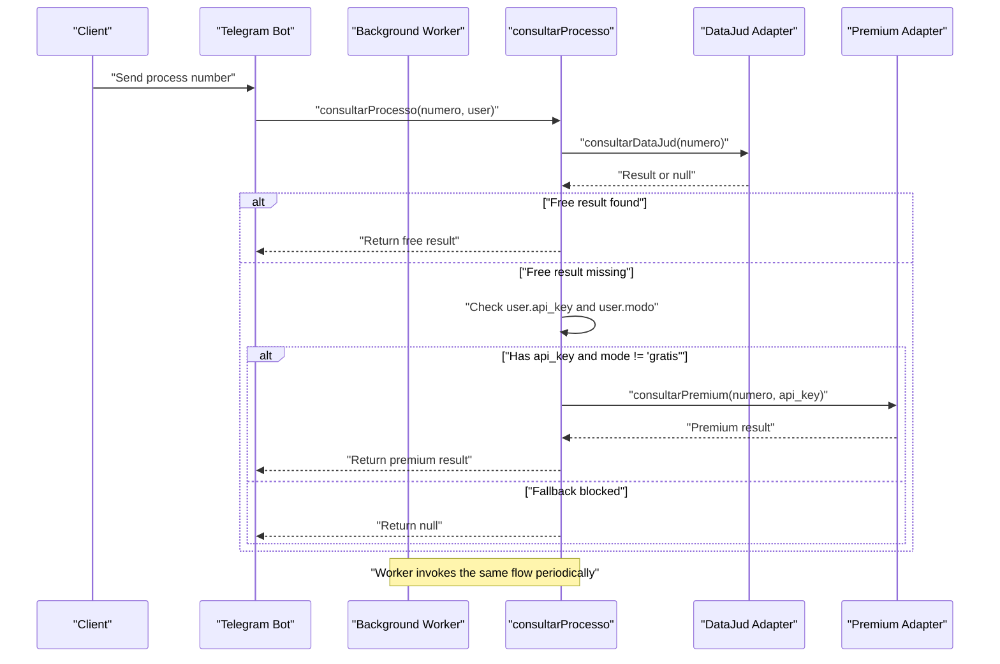
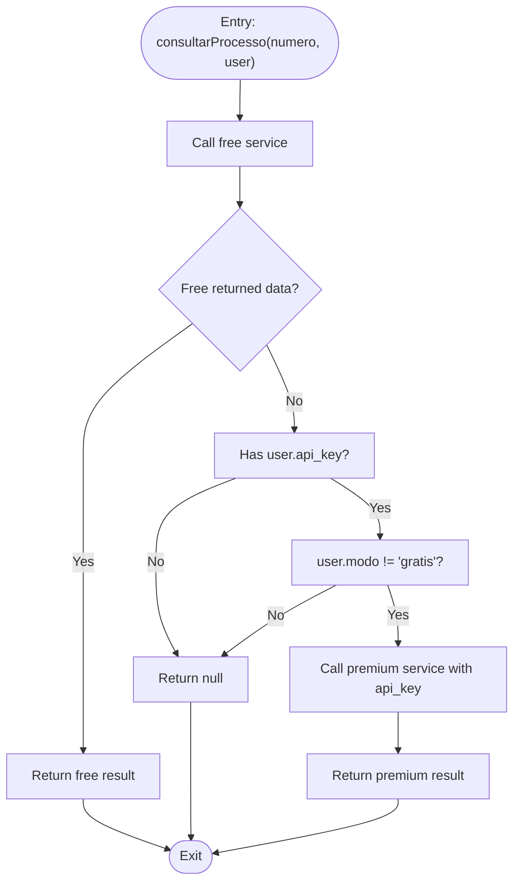
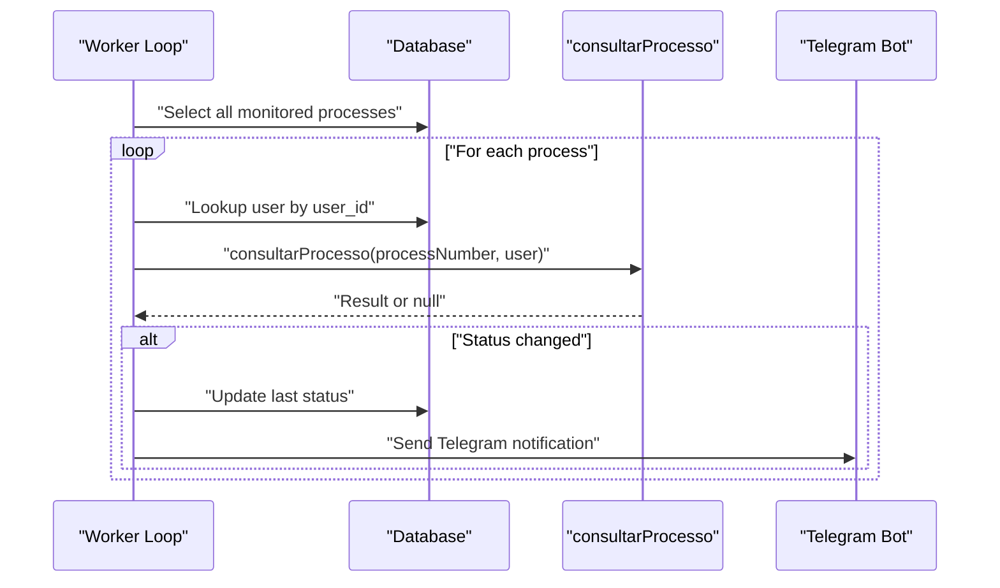
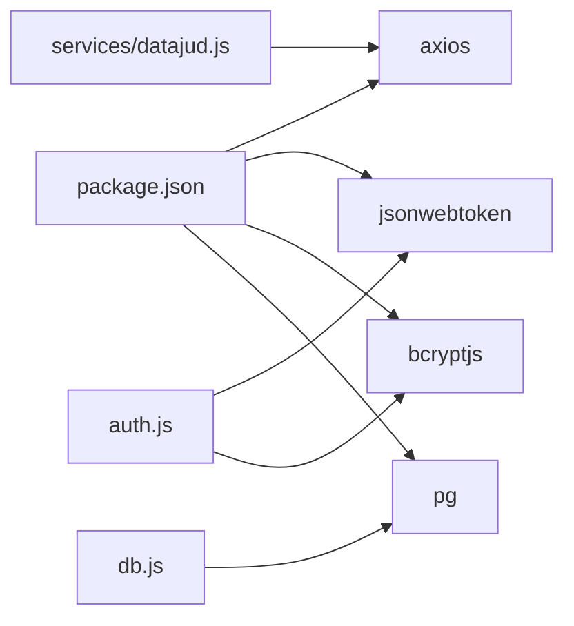

# Tiered Access Strategy

<cite>
**Referenced Files in This Document**
- [server.js](file://server.js)
- [apiRouter.js](file://apiRouter.js)
- [services/datajud.js](file://services/datajud.js)
- [services/premium.js](file://services/premium.js)
- [auth.js](file://auth.js)
- [worker.js](file://worker.js)
- [botManager.js](file://botManager.js)
- [database.sql](file://database.sql)
- [db.js](file://db.js)
- [package.json](file://package.json)
</cite>

## Table of Contents
1. [Introduction](#introduction)
2. [Project Structure](#project-structure)
3. [Core Components](#core-components)
4. [Architecture Overview](#architecture-overview)
5. [Detailed Component Analysis](#detailed-component-analysis)
6. [Dependency Analysis](#dependency-analysis)
7. [Performance Considerations](#performance-considerations)
8. [Troubleshooting Guide](#troubleshooting-guide)
9. [Conclusion](#conclusion)

## Introduction
This document explains the tiered access strategy implemented in the system. The strategy follows a two-tier model:
- Primary access via the free DataJud service
- Fallback to a premium paid service when conditions are met

The decision logic for selecting the tier is encapsulated in the consult process function, which validates user roles, API keys, and mode restrictions. The fallback mechanism is designed to gracefully degrade when the free tier does not yield results, while preserving user privacy and enforcing access controls.

## Project Structure
The system is organized around a small set of focused modules:
- Authentication and authorization middleware
- API orchestration for tiered lookup
- Free and premium service adapters
- Background worker for periodic updates
- Telegram bot integration for user interactions
- Database schema for users and monitored processes

**Diagram sources**
- [server.js:1-162](file://server.js#L1-L162)
- [apiRouter.js:1-19](file://apiRouter.js#L1-L19)
- [services/datajud.js:1-32](file://services/datajud.js#L1-L32)
- [services/premium.js:1-12](file://services/premium.js#L1-L12)
- [worker.js:1-70](file://worker.js#L1-L70)
- [botManager.js:1-53](file://botManager.js#L1-L53)
- [db.js:1-11](file://db.js#L1-L11)
- [database.sql:1-25](file://database.sql#L1-L25)

**Section sources**
- [server.js:1-162](file://server.js#L1-L162)
- [apiRouter.js:1-19](file://apiRouter.js#L1-L19)
- [services/datajud.js:1-32](file://services/datajud.js#L1-L32)
- [services/premium.js:1-12](file://services/premium.js#L1-L12)
- [worker.js:1-70](file://worker.js#L1-L70)
- [botManager.js:1-53](file://botManager.js#L1-L53)
- [db.js:1-11](file://db.js#L1-L11)
- [database.sql:1-25](file://database.sql#L1-L25)

## Core Components
- consult process function: Implements the two-tier lookup logic and fallback rules.
- Free service adapter: Queries the public DataJud API.
- Premium service adapter: Placeholder for a paid provider requiring an API key.
- Authentication and authorization: JWT-based middleware and admin guard.
- Orchestration: Worker and Telegram bot invoke the consult process function.
- Persistence: PostgreSQL-backed user and process records.

Key behaviors:
- Primary tier: Attempt free lookup using DataJud.
- Fallback tier: Use premium lookup only when the user has an API key and is not in gratis mode.
- Graceful degradation: Return null when neither tier yields results.

**Section sources**
- [apiRouter.js:4-16](file://apiRouter.js#L4-L16)
- [services/datajud.js:3-29](file://services/datajud.js#L3-L29)
- [services/premium.js:1-9](file://services/premium.js#L1-L9)
- [auth.js:16-39](file://auth.js#L16-L39)
- [worker.js:45-45](file://worker.js#L45-L45)
- [botManager.js:24-24](file://botManager.js#L24-L24)

## Architecture Overview
The consult process function orchestrates tier selection and fallback. It receives a process number and user context, attempts a free lookup, and falls back to premium when permitted by user mode and API key presence.

**Diagram sources**
- [botManager.js:13-39](file://botManager.js#L13-L39)
- [worker.js:17-61](file://worker.js#L17-L61)
- [apiRouter.js:4-16](file://apiRouter.js#L4-L16)
- [services/datajud.js:3-29](file://services/datajud.js#L3-L29)
- [services/premium.js:1-9](file://services/premium.js#L1-L9)

## Detailed Component Analysis

### consult process Function Decision Logic
The consult process function enforces:
- Try free tier first
- If free tier returns no result, evaluate fallback conditions
- Allow premium fallback only when:
  - The user possesses an API key
  - The user’s mode is not gratis

**Diagram sources**
- [apiRouter.js:4-16](file://apiRouter.js#L4-L16)

**Section sources**
- [apiRouter.js:4-16](file://apiRouter.js#L4-L16)

### Free Service Adapter (DataJud)
- Performs a POST request to the public DataJud endpoint
- Extracts the first matching hit and maps fields to a normalized shape
- Returns null on any error or empty response

Operational characteristics:
- Network latency and availability are external factors
- No authentication required for free tier
- Graceful failure by returning null

**Section sources**
- [services/datajud.js:3-29](file://services/datajud.js#L3-L29)

### Premium Service Adapter
- Placeholder implementation that returns a normalized record
- In a production scenario, this would integrate with a paid provider using the provided API key

Security and access:
- Requires a valid API key stored per user
- Only invoked when user mode indicates non-gratis access

**Section sources**
- [services/premium.js:1-9](file://services/premium.js#L1-L9)

### Authentication and Authorization
- JWT-based authentication middleware verifies tokens from Authorization headers
- Admin middleware restricts sensitive endpoints to administrators
- Users are identified by decoded JWT claims

Access enforcement:
- Token presence and validity are mandatory for protected routes
- Admin-only routes are gated by role checks

**Section sources**
- [auth.js:16-39](file://auth.js#L16-L39)
- [server.js:12-36](file://server.js#L12-L36)
- [server.js:70-92](file://server.js#L70-L92)

### Orchestration: Worker and Telegram Bot
- Worker periodically queries monitored processes and triggers consult process
- Telegram bot responds to user messages by invoking consult process and persists results
- Both paths pass the same user context to consult process

**Diagram sources**
- [worker.js:17-61](file://worker.js#L17-L61)
- [botManager.js:13-39](file://botManager.js#L13-L39)

**Section sources**
- [worker.js:17-61](file://worker.js#L17-L61)
- [botManager.js:7-42](file://botManager.js#L7-L42)

### Database Schema and User Mode Validation
- Users table includes fields for Telegram identifiers, bot token, API key, and mode
- Default mode is gratis
- Processes table references users and stores last observed status

User mode validation:
- Gratis mode blocks premium fallback
- API key presence is required for premium fallback

**Section sources**
- [database.sql:5-24](file://database.sql#L5-L24)
- [apiRouter.js:11-12](file://apiRouter.js#L11-L12)

## Dependency Analysis
External dependencies relevant to tiered access:
- axios: Used by the free service adapter for HTTP requests
- jsonwebtoken: Used by auth middleware for token verification
- bcryptjs: Used for password hashing during registration and login
- pg: PostgreSQL client for database operations

**Diagram sources**
- [package.json:11-19](file://package.json#L11-L19)
- [services/datajud.js:1-1](file://services/datajud.js#L1-L1)
- [auth.js:1-3](file://auth.js#L1-L3)
- [db.js:1-10](file://db.js#L1-L10)

**Section sources**
- [package.json:11-19](file://package.json#L11-L19)
- [services/datajud.js:1-1](file://services/datajud.js#L1-L1)
- [auth.js:1-3](file://auth.js#L1-L3)
- [db.js:1-10](file://db.js#L1-L10)

## Performance Considerations
- Two-tier lookup adds latency equal to the slower of the two tiers. To mitigate:
  - Prefer free tier first to leverage public data availability
  - Keep premium fallback minimal and only when necessary
- Rate limiting:
  - Apply client-side throttling when invoking consult process frequently
  - Consider server-side rate limits on consult endpoints if exposed externally
- Timeout handling:
  - Add timeouts to HTTP requests to the free service to prevent long blocking
  - Abort premium requests after a defined threshold when free tier is slow
- Caching:
  - Cache recent results per user to reduce repeated lookups
  - Cache user profiles to avoid repeated database reads in workers
- Concurrency:
  - Batch process updates in the worker to minimize database load
  - Limit concurrent premium requests to stay within provider quotas

[No sources needed since this section provides general guidance]

## Troubleshooting Guide
Common issues and remedies:
- Free tier returns null:
  - Verify process number format and public availability
  - Confirm network connectivity and endpoint responsiveness
- Premium fallback not triggered:
  - Ensure user has a non-empty API key
  - Verify user mode is not gratis
- Authentication failures:
  - Confirm Authorization header format and token validity
  - Check JWT secret configuration
- Worker not notifying:
  - Validate Telegram bot token and chat ID
  - Inspect database entries for monitored processes and user settings

**Section sources**
- [services/datajud.js:26-28](file://services/datajud.js#L26-L28)
- [apiRouter.js:11-12](file://apiRouter.js#L11-L12)
- [auth.js:17-30](file://auth.js#L17-L30)
- [worker.js:39-44](file://worker.js#L39-L44)

## Conclusion
The tiered access strategy cleanly separates free and premium capabilities:
- Free tier is the default and primary path
- Premium tier is reserved for users with valid API keys and non-gratis modes
- The consult process function centralizes decision logic and fallback behavior
- Worker and bot integrations consistently apply the same rules

To evolve the system:
- Instrument and monitor free/paid lookup latencies and error rates
- Introduce health checks for upstream services
- Add rate-limiting and circuit-breaker patterns for resilience
- Expand premium adapter to integrate with a real provider and enforce quotas

[No sources needed since this section summarizes without analyzing specific files]