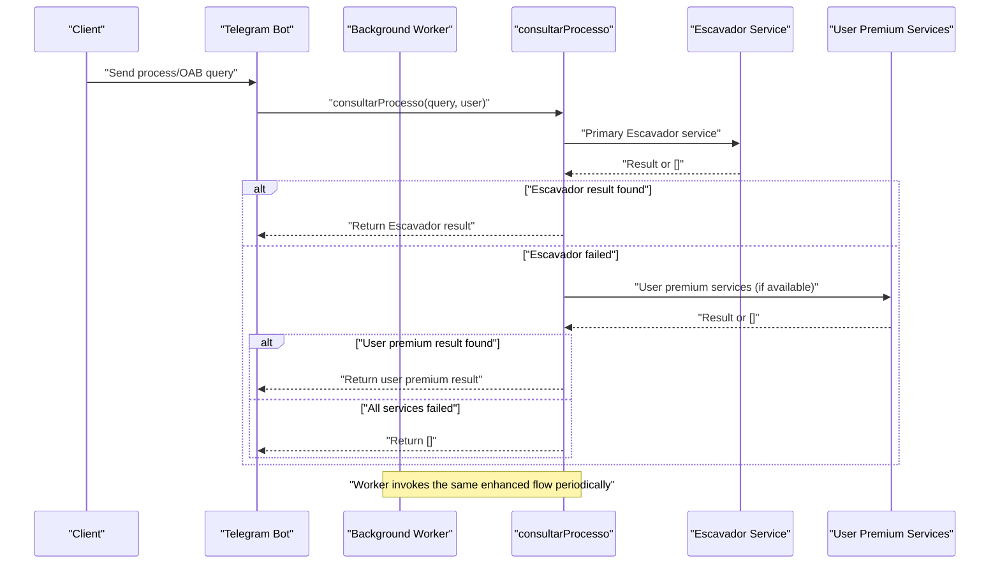
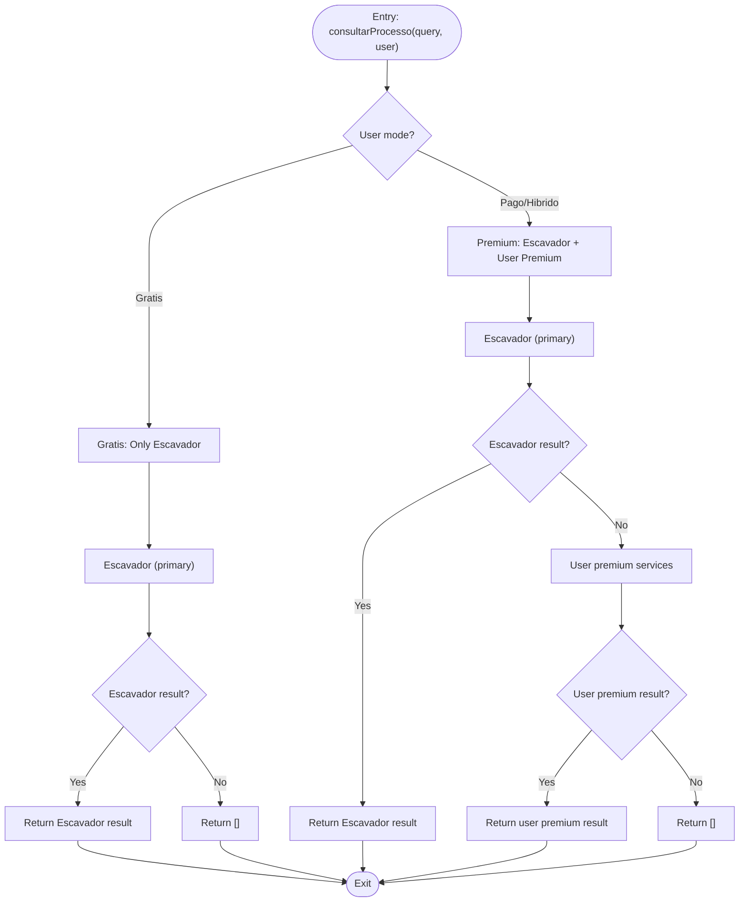
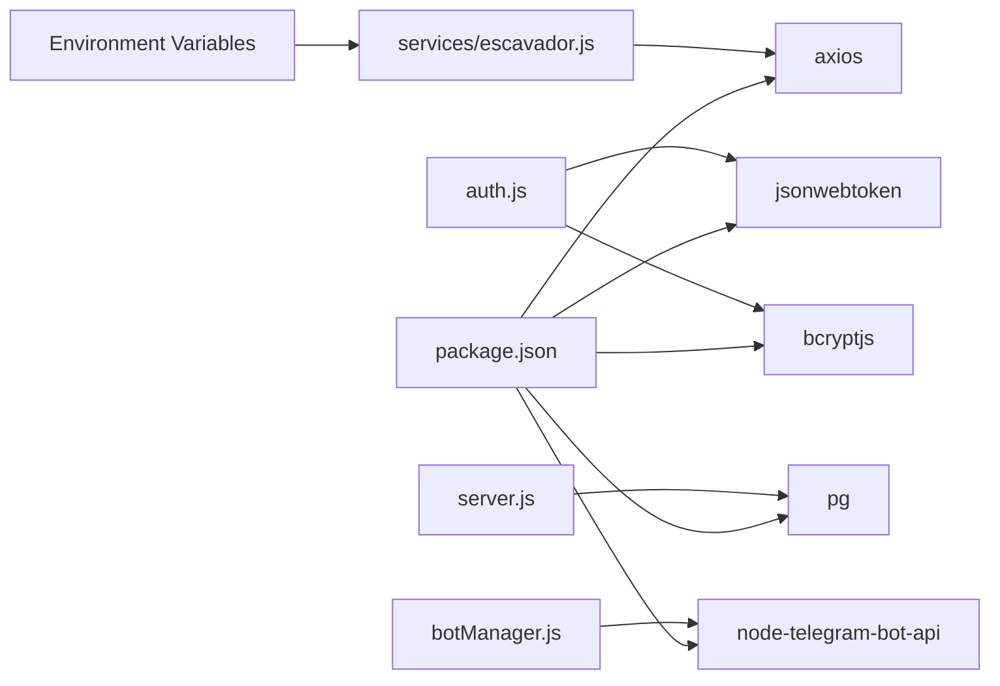

# Tiered Access Strategy

<cite>
**Referenced Files in This Document**
- [server.js](file://server.js)
- [apiRouter.js](file://apiRouter.js)
- [services/escavador.js](file://services/escavador.js)
- [services/premium.js](file://services/premium.js)
- [auth.js](file://auth.js)
- [worker.js](file://worker.js)
- [botManager.js](file://botManager.js)
- [database.sql](file://database.sql)
- [parser.js](file://parser.js)
- [package.json](file://package.json)
</cite>

## Update Summary
**Changes Made**
- **Enhanced Error Handling**: Improved standardized response processing with comprehensive error logging and graceful failure patterns
- **Improved Fallback Mechanisms**: Enhanced dual API version support (V1/V2) with better error isolation and recovery
- **Standardized Response Processing**: Unified response format extraction across all Escavador endpoints
- **Robust Timeout Management**: Configurable timeouts (15-30 seconds) preventing service overload and improving reliability
- **Enhanced Service Health Monitoring**: Comprehensive logging of API key configuration, service availability, and error patterns

## Table of Contents
1. [Introduction](#introduction)
2. [Project Structure](#project-structure)
3. [Core Components](#core-components)
4. [Architecture Overview](#architecture-overview)
5. [Detailed Component Analysis](#detailed-component-analysis)
6. [Dependency Analysis](#dependency-analysis)
7. [Performance Considerations](#performance-considerations)
8. [Troubleshooting Guide](#troubleshooting-guide)
9. [Conclusion](#conclusion)

## Introduction
This document explains the enhanced tiered access strategy implemented for process and OAB searches with a streamlined approach focusing on Escavador as the primary service. The strategy follows a two-tier model optimized for simplicity and user control with significantly improved error handling and fallback mechanisms:

- **Primary access**: Escavador service (premium paid service with optional user API keys)
- **Secondary access**: User-added premium services (optional user API keys for enhanced functionality)

The decision logic for selecting the tier is encapsulated in the `consultarProcesso` function, which validates user modes and attempts to leverage available API keys for enhanced search capabilities. The enhanced approach maintains flexibility for users who want to add their own premium services while providing robust error handling and graceful degradation patterns.

## Project Structure
The system is organized around a focused set of modules with streamlined service orchestration and enhanced error handling:
- Authentication and authorization middleware with JWT-based security
- API orchestration for tiered lookup with Escavador as the primary service
- Escavador service adapter with comprehensive API key management and standardized error handling
- Background worker for periodic updates with enhanced monitoring
- Telegram bot integration for user interactions with improved error reporting
- Database schema for users and monitored processes with mode validation

```mermaid
graph TB
subgraph "HTTP Layer"
S["server.js"]
A["auth.js"]
end
subgraph "Orchestration"
R["apiRouter.js"]
W["worker.js"]
BM["botManager.js"]
end
subgraph "Primary Service"
ESC["services/escavador.js"]
END
subgraph "Optional Premium Services"
PREM["services/premium.js"]
END
subgraph "Persistence"
DB["database.sql"]
PARSER["parser.js"]
end
S --> A
S --> R
R --> ESC
R --> PREM
W --> R
BM --> R
S --> DB
DB --> PARSER
```

**Diagram sources**
- [server.js:1-381](file://server.js#L1-L381)
- [apiRouter.js:1-64](file://apiRouter.js#L1-L64)
- [services/escavador.js:1-168](file://services/escavador.js#L1-L168)
- [services/premium.js:1-12](file://services/premium.js#L1-L12)
- [worker.js:1-74](file://worker.js#L1-L74)
- [botManager.js:1-228](file://botManager.js#L1-L228)
- [database.sql:1-25](file://database.sql#L1-L25)
- [parser.js:1-102](file://parser.js#L1-L102)

**Section sources**
- [server.js:1-381](file://server.js#L1-L381)
- [apiRouter.js:1-64](file://apiRouter.js#L1-L64)
- [services/escavador.js:1-168](file://services/escavador.js#L1-L168)
- [services/premium.js:1-12](file://services/premium.js#L1-L12)
- [worker.js:1-74](file://worker.js#L1-L74)
- [botManager.js:1-228](file://botManager.js#L1-L228)
- [database.sql:1-25](file://database.sql#L1-L25)
- [parser.js:1-102](file://parser.js#L1-L102)

## Core Components
- **Enhanced consult process function**: Implements a straightforward two-tier lookup logic with Escavador as primary service and optional user premium services with improved error handling
- **Escavador service adapter**: Comprehensive service with API key validation, multiple search endpoints, robust error handling, and standardized response processing
- **Optional premium service integration**: Placeholder for user-added premium services that can be added through the panel
- **Authentication and authorization**: JWT-based middleware and admin guard with enhanced security
- **Service orchestration**: Worker and Telegram bot invoke the enhanced consult process function with improved monitoring
- **Persistence**: PostgreSQL-backed user and process records with mode validation

Key behaviors:
- **Primary service focus**: Escavador as the main service with optional user API keys and comprehensive error handling
- **User-controlled premium access**: Users can add their own API keys for enhanced functionality
- **Graceful degradation**: Return empty arrays when Escavador is unavailable or user has no premium services
- **Mode-based access control**: Gratis, pago, and hibrido modes determine service availability and premium access
- **Enhanced error isolation**: Comprehensive logging and error categorization for better troubleshooting

**Section sources**
- [apiRouter.js:8-46](file://apiRouter.js#L8-L46)
- [services/escavador.js:10-40](file://services/escavador.js#L10-L40)
- [auth.js:16-39](file://auth.js#L16-L39)
- [worker.js:17-65](file://worker.js#L17-L65)
- [botManager.js:122-198](file://botManager.js#L122-L198)

## Architecture Overview
The enhanced consult process function orchestrates a streamlined tier selection focused on Escavador as the primary service with improved error handling and fallback mechanisms. It receives a process number and user context, attempts the primary Escavador service, and falls back to user-added premium services when permitted by user mode and available API keys.



**Diagram sources**
- [botManager.js:122-198](file://botManager.js#L122-L198)
- [worker.js:17-65](file://worker.js#L17-L65)
- [apiRouter.js:8-46](file://apiRouter.js#L8-L46)
- [services/escavador.js:10-40](file://services/escavador.js#L10-L40)

## Detailed Component Analysis

### Enhanced Consult Process Function Decision Logic
The consult process function enforces a straightforward two-tier selection with improved error handling:
- **Primary tier**: Escavador service with comprehensive search capabilities and standardized response processing
- **Secondary tier**: User-added premium services when mode allows and API keys are configured
- **API key validation**: Escavador requires server-level API key, user premium services use user-provided keys
- **Enhanced error handling**: Comprehensive logging and graceful failure patterns with error categorization



**Diagram sources**
- [apiRouter.js:8-46](file://apiRouter.js#L8-L46)

**Section sources**
- [apiRouter.js:8-46](file://apiRouter.js#L8-L46)

### Enhanced Escavador Service Adapter

#### Primary Service Implementation
- **Purpose**: Main service for all search types with comprehensive API key management and enhanced error handling
- **API Key Management**: Uses `ESCAVADOR_API_KEY` environment variable for server-level authentication with automatic logging
- **Multi-endpoint Support**: Handles OAB, CPF, CNPJ, name, and process number searches with standardized response format
- **Dual API Version Support**: Tries V1 endpoints first, falls back to V2 when needed with comprehensive error isolation
- **Robust Error Handling**: Comprehensive logging and graceful failure patterns with error categorization

#### Escavador Service Features
- **OAB Searches**: Direct OAB number lookup via `/api/v1/envolvido/processos` with enhanced error logging
- **Process Number Searches**: Multi-version support with V1 (more data) and V2 fallback with improved error handling
- **Document-Based Searches**: CPF, CNPJ, and name searches with standardized response format extraction
- **Rate Limiting**: Built-in timeout handling (15-30 seconds) to prevent service overload and improve reliability
- **Graceful Degradation**: Returns empty arrays when API key is not configured or service fails
- **Enhanced Logging**: Comprehensive debug information for all operations and error scenarios

**Updated** Enhanced error handling with standardized response processing and improved fallback mechanisms

**Section sources**
- [services/escavador.js:1-168](file://services/escavador.js#L1-L168)

### Optional Premium Service Integration

#### User-Controlled Premium Services
- **Purpose**: Allow users to add their own premium API keys for enhanced functionality
- **Configuration**: Users can add API keys through the panel interface
- **Integration Point**: Placeholder service (`services/premium.js`) ready for real API integration
- **Mode Compatibility**: Only active when user has 'pago' or 'hibrido' mode
- **Error Isolation**: Failed user premium services don't affect main Escavador functionality with enhanced error handling

#### Current Implementation Status
- **Placeholder Service**: `services/premium.js` currently returns mock data for demonstration
- **Ready for Integration**: Structured to easily integrate real premium services like Jusbrasil
- **Extensible Design**: Easy to add new premium services without changing core logic

**Section sources**
- [services/premium.js:1-12](file://services/premium.js#L1-L12)
- [apiRouter.js:48-61](file://apiRouter.js#L48-L61)

### Authentication and Authorization
- **JWT-based authentication middleware**: Verifies tokens from Authorization headers with enhanced error handling
- **Admin middleware**: Restricts sensitive endpoints to administrators with role verification
- **Users identified**: By decoded JWT claims with role-based access control
- **Mode validation**: Users can have 'gratis', 'pago', or 'hibrido' modes affecting service access

Access enforcement:
- **Token presence**: Mandatory for protected routes with comprehensive error handling
- **Role checks**: Admin-only routes gated by role verification
- **Mode-based restrictions**: Different service availability based on user mode

**Section sources**
- [auth.js:16-39](file://auth.js#L16-L39)
- [server.js:26-101](file://server.js#L26-L101)
- [server.js:104-206](file://server.js#L104-L206)

### Orchestration: Worker and Telegram Bot
- **Worker**: Periodically queries monitored processes and triggers enhanced consult process with improved monitoring
- **Telegram Bot**: Responds to user messages by invoking consult process and persists results with enhanced error reporting
- **Consistent flow**: Both paths pass the same user context and query parameters to consult process
- **Enhanced handling**: Automatic routing through primary Escavador service with optional user premium and comprehensive error handling


**Diagram sources**
- [worker.js:17-65](file://worker.js#L17-L65)
- [botManager.js:122-198](file://botManager.js#L122-L198)
- [apiRouter.js:8-46](file://apiRouter.js#L8-L46)

**Section sources**
- [worker.js:17-65](file://worker.js#L17-L65)
- [botManager.js:122-198](file://botManager.js#L122-L198)

### Database Schema and User Mode Validation
- **Users table**: Includes fields for Telegram identifiers, bot token, API key, and mode
- **Default mode**: 'gratis' (free access)
- **Mode types**: 'gratis' (free only), 'pago' (premium only), 'hibrido' (hybrid)
- **Processes table**: References users and stores last observed status
- **Mode-based access**: Controls which services are available to users

User mode validation:
- **Gratis mode**: Only primary Escavador service is accessible
- **Pago mode**: Primary Escavador service plus user premium services
- **Hibrido mode**: Primary Escavador service plus user premium services
- **API key requirement**: Primary Escavador requires server-level API key, user premium services use user-provided keys

**Section sources**
- [database.sql:5-24](file://database.sql#L5-L24)
- [apiRouter.js:11](file://apiRouter.js#L11)

## Dependency Analysis
External dependencies relevant to the enhanced tiered access:
- **axios**: HTTP client for Escavador service integration with enhanced error handling
- **jsonwebtoken**: JWT token verification for authentication with enhanced security
- **bcryptjs**: Password hashing for user registration and login
- **pg**: PostgreSQL client for database operations
- **node-telegram-bot-api**: Telegram bot integration with improved error reporting
- **Environment variables**: API key management for primary service



**Diagram sources**
- [package.json:11-19](file://package.json#L11-L19)
- [services/escavador.js:1](file://services/escavador.js#L1)
- [auth.js:1-3](file://auth.js#L1-L3)
- [server.js:1-6](file://server.js#L1-L6)
- [botManager.js:1](file://botManager.js#L1)

**Section sources**
- [package.json:11-19](file://package.json#L11-L19)
- [services/escavador.js:1](file://services/escavador.js#L1)
- [auth.js:1-3](file://auth.js#L1-L3)
- [server.js:1-6](file://server.js#L1-L6)
- [botManager.js:1](file://botManager.js#L1)

## Performance Considerations
- **Enhanced service calls**: Reduced complexity from multiple service calls to single primary service with improved error handling
- **Server-level caching**: Environment variable checks cached at module load time
- **Improved rate limiting**: Built-in timeouts (15-30 seconds) prevent long blocking operations and improve reliability
- **Enhanced service health monitoring**: Comprehensive logging of API key configuration, service availability, and error patterns
- **Concurrent processing**: Parallel execution of user premium services in hybrid mode with error isolation
- **Graceful degradation**: Comprehensive error handling ensures service continuity with standardized response processing

## Troubleshooting Guide
Common issues and remedies for the enhanced tiered access:

### Escavador Service Issues
- **API key not configured**: Check `ESCAVADOR_API_KEY` environment variable with enhanced logging
- **Service unavailability**: Verify Escavador API status and reachability with comprehensive error reporting
- **Timeout errors**: Services use configurable timeouts (15-30 seconds) with improved error handling
- **Empty results**: Verify query format and service availability with enhanced debugging information
- **Version fallback failures**: V1/V2 fallback mechanisms with detailed error logging

### User Premium Service Issues
- **API key not configured**: Users need to add API keys through the panel
- **Integration not implemented**: `services/premium.js` is currently a placeholder
- **Mode restrictions**: Premium services only work when user has 'pago' or 'hibrido' mode
- **Service failures**: User premium services don't affect main Escavador functionality with enhanced error isolation

### Authentication and Mode Issues
- **Gratis mode limitations**: Users in gratis mode only get primary Escavador results
- **Pago mode access**: Ensure user has valid API keys for premium services
- **Hybrid mode behavior**: Same as pago mode with user premium services
- **Token validation**: Confirm JWT token format and expiration with enhanced error handling

### Worker and Bot Integration
- **Worker notifications**: Verify Telegram bot token and chat ID configuration with improved error reporting
- **Periodic updates**: Check worker scheduling and database connectivity with enhanced monitoring
- **Service health**: Monitor service logs for API key warnings, error messages, and enhanced debugging information

**Section sources**
- [services/escavador.js:3-7](file://services/escavador.js#L3-L7)
- [apiRouter.js:11](file://apiRouter.js#L11)
- [auth.js:17-30](file://auth.js#L17-L30)
- [worker.js:39-44](file://worker.js#L39-L44)

## Conclusion
The enhanced tiered access strategy provides a clean, maintainable solution for process and OAB searches with a focus on user control and flexibility with significantly improved error handling and reliability:

**Key Improvements:**
- **Enhanced error handling**: Comprehensive logging and standardized response processing across all services
- **Improved fallback mechanisms**: Dual API version support (V1/V2) with better error isolation and recovery
- **Single service focus**: Escavador as the primary service reduces complexity and maintenance overhead
- **User-controlled premium access**: Users can add their own API keys for enhanced functionality
- **Graceful degradation**: Comprehensive error handling ensures service continuity with standardized responses
- **Mode-based access control**: Flexible user modes balance cost and functionality
- **Enhanced service health monitoring**: Comprehensive logging and error handling improve system reliability

**System Benefits:**
- **Simplified architecture**: Easy to understand and maintain with fewer moving parts and enhanced error handling
- **User empowerment**: Users control their own premium services and API keys
- **Cost-effective**: Primary Escavador service provides good coverage for most use cases
- **Scalable design**: Easy to add new premium services through the user panel
- **Reliability**: Enhanced error handling and fallback mechanisms improve system stability
- **User experience**: Seamless functionality without complex fallback logic with comprehensive error reporting

**Future Enhancements:**
- **Real premium service integration**: Replace placeholder with actual premium service implementations
- **Advanced service health monitoring**: Implement automated health checks for premium services with enhanced logging
- **Performance metrics**: Track query performance across different service tiers with detailed analytics
- **Advanced rate limiting**: Implement client-side and server-side rate limiting with enhanced error handling
- **Service discovery**: Dynamic service configuration based on user preferences with improved error isolation

The enhanced system provides a solid foundation for expanding premium service capabilities while maintaining reliability and user satisfaction across all access tiers with significantly improved error handling and fallback mechanisms.