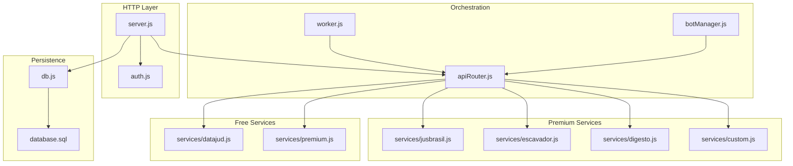
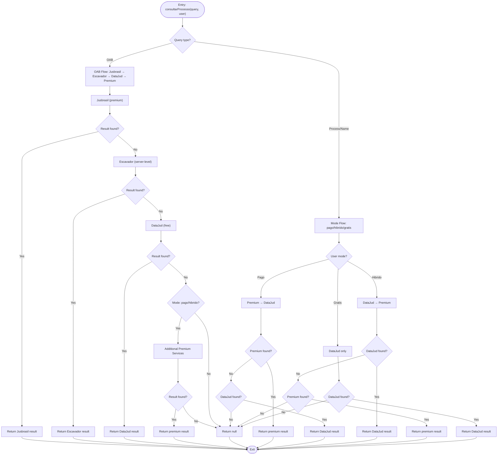
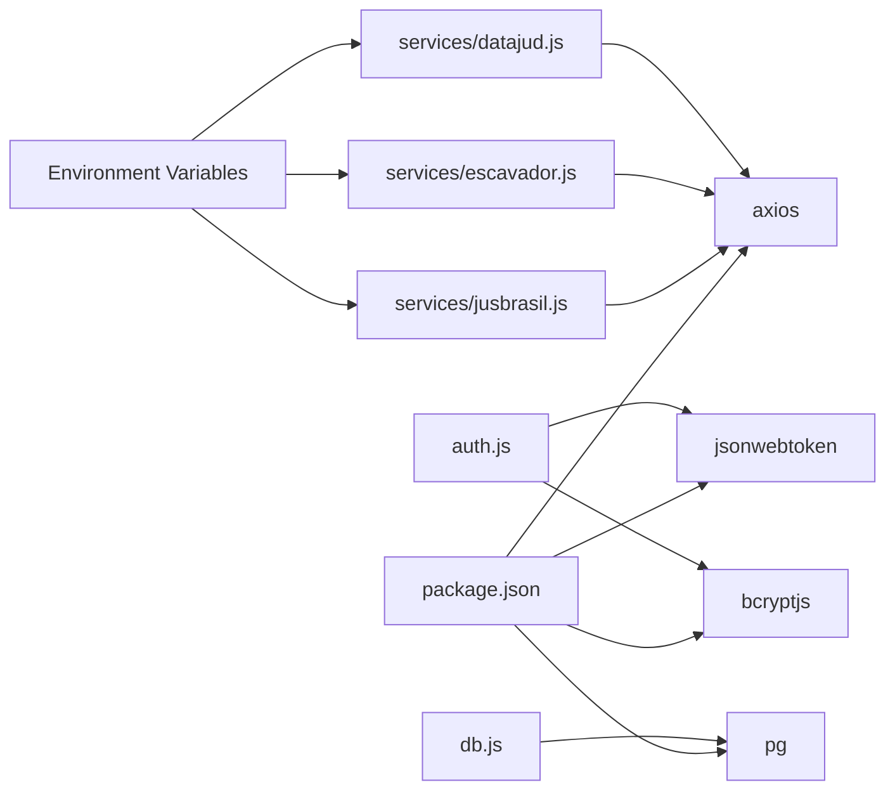

# Tiered Access Strategy

<cite>
**Referenced Files in This Document**
- [server.js](file://server.js)
- [apiRouter.js](file://apiRouter.js)
- [services/datajud.js](file://services/datajud.js)
- [services/premium.js](file://services/premium.js)
- [services/escavador.js](file://services/escavador.js)
- [services/jusbrasil.js](file://services/jusbrasil.js)
- [services/digesto.js](file://services/digesto.js)
- [services/custom.js](file://services/custom.js)
- [auth.js](file://auth.js)
- [worker.js](file://worker.js)
- [botManager.js](file://botManager.js)
- [database.sql](file://database.sql)
- [db.js](file://db.js)
- [package.json](file://package.json)
</cite>

## Update Summary
**Changes Made**
- Updated fallback mechanism from DataJud to Escavador to Jusbrasil for OAB searches
- Enhanced tiered access strategy with server-level API key management
- Added comprehensive error handling and user feedback for unconfigured API keys
- Expanded premium service ecosystem with multiple providers (Jusbrasil, Digesto, Custom)
- Improved service availability monitoring and graceful degradation patterns

## Table of Contents
1. [Introduction](#introduction)
2. [Project Structure](#project-structure)
3. [Core Components](#core-components)
4. [Architecture Overview](#architecture-overview)
5. [Detailed Component Analysis](#detailed-component-analysis)
6. [Dependency Analysis](#dependency-analysis)
7. [Performance Considerations](#performance-considerations)
8. [Troubleshooting Guide](#troubleshooting-guide)
9. [Conclusion](#conclusion)

## Introduction
This document explains the enhanced tiered access strategy implemented for OAB searches with sophisticated fallback mechanisms. The strategy follows a three-tier model specifically optimized for OAB (Brazilian Bar Association) searches:

- **Primary access**: Jusbrasil service (premium paid service)
- **Secondary access**: Escavador service (server-level fallback)
- **Tertiary access**: DataJud service (free public service)
- **Quaternary access**: Additional premium services (paid services)

The decision logic for selecting the tier is encapsulated in the `consultarProcesso` function, which validates user roles, API keys, and mode restrictions. The enhanced fallback mechanism is designed to gracefully degrade when services fail, while preserving user privacy and enforcing access controls.

## Project Structure
The system is organized around a comprehensive set of focused modules with enhanced service orchestration:
- Authentication and authorization middleware
- API orchestration for tiered lookup with OAB-specific routing
- Multiple service adapters (DataJud, Escavador, Jusbrasil, Digesto, Custom)
- Background worker for periodic updates
- Telegram bot integration for user interactions
- Database schema for users and monitored processes



**Diagram sources**
- [server.js:1-326](file://server.js#L1-L326)
- [apiRouter.js:1-111](file://apiRouter.js#L1-L111)
- [services/jusbrasil.js:1-197](file://services/jusbrasil.js#L1-L197)
- [services/escavador.js:1-108](file://services/escavador.js#L1-L108)
- [services/datajud.js:1-266](file://services/datajud.js#L1-L266)
- [services/digesto.js:1-25](file://services/digesto.js#L1-L25)
- [services/custom.js:1-26](file://services/custom.js#L1-L26)
- [services/premium.js:1-12](file://services/premium.js#L1-L12)
- [worker.js:1-70](file://worker.js#L1-L70)
- [botManager.js:1-53](file://botManager.js#L1-L53)
- [db.js:1-11](file://db.js#L1-L11)
- [database.sql:1-25](file://database.sql#L1-L25)

**Section sources**
- [server.js:1-326](file://server.js#L1-L326)
- [apiRouter.js:1-111](file://apiRouter.js#L1-L111)
- [services/jusbrasil.js:1-197](file://services/jusbrasil.js#L1-L197)
- [services/escavador.js:1-108](file://services/escavador.js#L1-L108)
- [services/datajud.js:1-266](file://services/datajud.js#L1-L266)
- [services/digesto.js:1-25](file://services/digesto.js#L1-L25)
- [services/custom.js:1-26](file://services/custom.js#L1-L26)
- [services/premium.js:1-12](file://services/premium.js#L1-L12)
- [worker.js:1-70](file://worker.js#L1-L70)
- [botManager.js:1-53](file://botManager.js#L1-L53)
- [db.js:1-11](file://db.js#L1-L11)
- [database.sql:1-25](file://database.sql#L1-L25)

## Core Components
- **Enhanced consult process function**: Implements the three-tier OAB lookup logic with fallback rules and server-level API key management
- **Premium service adapters**: Jusbrasil, Escavador, Digesto, and Custom services with API key validation
- **Free service adapter**: DataJud service with comprehensive error handling and rate limiting
- **Authentication and authorization**: JWT-based middleware and admin guard
- **Service orchestration**: Worker and Telegram bot invoke the enhanced consult process function
- **Persistence**: PostgreSQL-backed user and process records with mode validation

Key behaviors:
- **OAB-specific routing**: Jusbrasil → Escavador → DataJud → Additional premium services
- **Server-level API key management**: Services check environment variables for configuration
- **Graceful degradation**: Return null when all services fail or are unconfigured
- **Mode-based access control**: Gratis, pago, and hibrido modes determine service availability

**Section sources**
- [apiRouter.js:17-93](file://apiRouter.js#L17-L93)
- [services/jusbrasil.js:10-25](file://services/jusbrasil.js#L10-L25)
- [services/escavador.js:9-25](file://services/escavador.js#L9-L25)
- [services/datajud.js:3-5](file://services/datajud.js#L3-L5)
- [auth.js:16-39](file://auth.js#L16-L39)
- [worker.js:45-45](file://worker.js#L45-L45)
- [botManager.js:24-24](file://botManager.js#L24-L24)

## Architecture Overview
The enhanced consult process function orchestrates sophisticated tier selection and fallback for OAB searches. It receives a process number and user context, attempts premium services first, and falls back to server-level services and finally free services when permitted by user mode and API key presence.

```mermaid
sequenceDiagram
participant Client as "Client"
participant Bot as "Telegram Bot"
participant Worker as "Background Worker"
participant API as "consultarProcesso"
participant Premium as "Premium Services"
participant Server as "Server-Level Services"
participant Free as "DataJud Adapter"
Client->>Bot : "Send OAB process number"
Bot->>API : "consultarProcesso(query, user)"
API->>Premium : "Jusbrasil (OAB)"
Premium-->>API : "Result or null"
alt "Premium result found"
API-->>Bot : "Return premium result"
else "Premium failed"
API->>Server : "Escavador (server-level)"
Server-->>API : "Result or null"
alt "Server result found"
API-->>Bot : "Return server result"
else "Server failed"
API->>Free : "DataJud (free)"
Free-->>API : "Result or null"
alt "Free result found"
API-->>Bot : "Return free result"
else "All services failed"
API-->>Bot : "Return null"
end
end
Note over Worker,API : "Worker invokes the same OAB flow periodically"
```

**Diagram sources**
- [botManager.js:13-39](file://botManager.js#L13-L39)
- [worker.js:17-61](file://worker.js#L17-L61)
- [apiRouter.js:26-58](file://apiRouter.js#L26-L58)
- [services/jusbrasil.js:10-25](file://services/jusbrasil.js#L10-L25)
- [services/escavador.js:9-25](file://services/escavador.js#L9-L25)
- [services/datajud.js:227-239](file://services/datajud.js#L227-L239)

## Detailed Component Analysis

### Enhanced consult Process Function Decision Logic
The enhanced consult process function enforces sophisticated tier selection:
- **OAB searches**: Jusbrasil → Escavador → DataJud → Additional premium services
- **Process/name searches**: Mode-based routing (pago → premium → DataJud, hibrido → DataJud → premium, gratis → DataJud only)
- **API key validation**: Server-level services check environment variables before execution
- **Error handling**: Comprehensive logging and graceful failure patterns



**Diagram sources**
- [apiRouter.js:17-93](file://apiRouter.js#L17-L93)

**Section sources**
- [apiRouter.js:17-93](file://apiRouter.js#L17-L93)

### Premium Service Adapters

#### Jusbrasil Service
- **Purpose**: Primary premium service for OAB searches with comprehensive monitoring capabilities
- **API Key Management**: Uses `JUSBRASIL_API_KEY` environment variable
- **OAB Features**: Full monitoring setup with automatic registration and asynchronous data collection
- **Process Search**: Direct CNJ number lookup via `/api/monitoramento/oab/vinculos/processos/cnj`

#### Escavador Service
- **Purpose**: Server-level fallback service for OAB searches when Jusbrasil is unavailable
- **API Key Management**: Uses `ESCAVADOR_API_KEY` environment variable
- **Graceful Degradation**: Silently skips when API key is not configured
- **OAB Features**: Direct OAB number lookup via `/api/v2/envolvido/processos`

#### Digesto Service
- **Purpose**: Additional premium service placeholder for future integration
- **API Key Management**: Uses `DIGESTO_API_KEY` environment variable
- **Current Status**: Returns null (placeholder implementation)

#### Custom Service
- **Purpose**: Generic premium service for custom tribunal integrations
- **API Key Management**: Uses `TJ_API_KEY` environment variable
- **Current Status**: Returns null (placeholder implementation)

**Section sources**
- [services/jusbrasil.js:1-197](file://services/jusbrasil.js#L1-L197)
- [services/escavador.js:1-108](file://services/escavador.js#L1-L108)
- [services/digesto.js:1-25](file://services/digesto.js#L1-L25)
- [services/custom.js:1-26](file://services/custom.js#L1-L26)

### Free Service Adapter (DataJud)
- **Purpose**: Public service for process and OAB searches with comprehensive error handling
- **Server-level API Key**: Uses `DATAJUD_API_KEY` environment variable for authentication
- **Rate Limiting**: Built-in 400ms delay between requests to prevent rate limiting
- **Multiple Tribunal Support**: Searches across 29 Brazilian state courts plus federal courts
- **OAB Optimization**: Specialized search strategies for OAB numbers using 7 state courts
- **Error Handling**: Graceful failure patterns for 401, 429, and 5xx errors with exponential backoff

**Section sources**
- [services/datajud.js:1-266](file://services/datajud.js#L1-L266)

### Authentication and Authorization
- **JWT-based authentication middleware**: Verifies tokens from Authorization headers
- **Admin middleware**: Restricts sensitive endpoints to administrators
- **Users identified**: By decoded JWT claims with role-based access control
- **Mode validation**: Users can have 'gratis', 'pago', or 'hibrido' modes affecting service access

Access enforcement:
- **Token presence**: Mandatory for protected routes
- **Role checks**: Admin-only routes gated by role verification
- **Mode-based restrictions**: Different service availability based on user mode

**Section sources**
- [auth.js:16-39](file://auth.js#L16-L39)
- [server.js:12-36](file://server.js#L12-L36)
- [server.js:70-92](file://server.js#L70-L92)

### Orchestration: Worker and Telegram Bot
- **Worker**: Periodically queries monitored processes and triggers enhanced consult process
- **Telegram Bot**: Responds to user messages by invoking consult process and persists results
- **Consistent flow**: Both paths pass the same user context and query parameters to consult process
- **OAB-specific handling**: Automatic routing through premium → server-level → free services

```mermaid
sequenceDiagram
participant Cron as "Worker Loop"
participant DB as "Database"
participant API as "consultarProcesso"
participant Premium as "Premium Services"
participant Server as "Server-Level Services"
participant Notifier as "Telegram Bot"
Cron->>DB : "Select all monitored processes"
loop "For each process"
Cron->>DB : "Lookup user by user_id"
Cron->>API : "consultarProcesso(processQuery, user)"
API->>Premium : "Jusbrasil (OAB)"
Premium-->>API : "Result or null"
alt "Premium result found"
API-->>Cron : "Return result"
else "Premium failed"
API->>Server : "Escavador (server-level)"
Server-->>API : "Result or null"
alt "Server result found"
API-->>Cron : "Return result"
else "Server failed"
API->>API : "Check user.modo"
alt "Mode allows premium"
API->>Premium : "Additional premium services"
Premium-->>API : "Result or null"
API-->>Cron : "Return result or null"
else "Mode restricted"
API-->>Cron : "Return null"
end
end
alt "Status changed"
Cron->>DB : "Update last status"
Cron->>Notifier : "Send Telegram notification"
end
end
```

**Diagram sources**
- [worker.js:17-61](file://worker.js#L17-L61)
- [botManager.js:13-39](file://botManager.js#L13-L39)
- [apiRouter.js:26-58](file://apiRouter.js#L26-L58)

**Section sources**
- [worker.js:17-61](file://worker.js#L17-L61)
- [botManager.js:7-42](file://botManager.js#L7-L42)

### Database Schema and User Mode Validation
- **Users table**: Includes fields for Telegram identifiers, bot token, API key, and mode
- **Default mode**: 'gratis' (free access)
- **Mode types**: 'gratis' (free only), 'pago' (premium only), 'hibrido' (hybrid)
- **Processes table**: References users and stores last observed status
- **Mode-based access**: Controls which services are available to users

User mode validation:
- **Gratis mode**: Only free services (DataJud) are accessible
- **Pago mode**: Premium services only (Jusbrasil, Escavador, additional premium)
- **Hibrido mode**: Free services first, then premium services
- **API key requirement**: Premium services require valid API keys in environment variables

**Section sources**
- [database.sql:5-24](file://database.sql#L5-L24)
- [apiRouter.js:22](file://apiRouter.js#L22)

## Dependency Analysis
External dependencies relevant to enhanced tiered access:
- **axios**: HTTP client for all service adapters
- **jsonwebtoken**: JWT token verification for authentication
- **bcryptjs**: Password hashing for user registration and login
- **pg**: PostgreSQL client for database operations
- **Environment variables**: API key management for premium services



**Diagram sources**
- [package.json:11-19](file://package.json#L11-L19)
- [services/jusbrasil.js:1](file://services/jusbrasil.js#L1)
- [services/escavador.js:1](file://services/escavador.js#L1)
- [services/datajud.js:1](file://services/datajud.js#L1)
- [auth.js:1-3](file://auth.js#L1-L3)
- [db.js:1-10](file://db.js#L1-L10)

**Section sources**
- [package.json:11-19](file://package.json#L11-L19)
- [services/jusbrasil.js:1](file://services/jusbrasil.js#L1)
- [services/escavador.js:1](file://services/escavador.js#L1)
- [services/datajud.js:1](file://services/datajud.js#L1)
- [auth.js:1-3](file://auth.js#L1-L3)
- [db.js:1-10](file://db.js#L1-L10)

## Performance Considerations
- **Enhanced OAB performance**: Optimized route Jusbrasil → Escavador → DataJud reduces search time for OAB numbers
- **Server-level caching**: Environment variable checks cached at module load time
- **Rate limiting**: Built-in delays and exponential backoff for premium services
- **Timeout handling**: Configured timeouts (15-30 seconds) prevent long blocking operations
- **Service health monitoring**: Logging of API key configuration and service availability
- **Concurrent processing**: Parallel execution of premium services in hybrid mode
- **Circuit breaker patterns**: Graceful degradation when services fail or are unconfigured

## Troubleshooting Guide
Common issues and remedies for enhanced tiered access:

### OAB Search Issues
- **Jusbrasil not responding**: Check `JUSBRASIL_API_KEY` environment variable
- **Escavador fallback failing**: Verify `ESCAVADOR_API_KEY` configuration
- **DataJud fallback not working**: Confirm `DATAJUD_API_KEY` server-level key
- **Zero results**: Verify OAB format (UF + number) and service availability

### Premium Service Issues
- **API key not configured**: Services silently skip when environment variables are missing
- **Rate limiting**: Premium services implement built-in rate limiting and exponential backoff
- **Timeout errors**: Services use configurable timeouts (15-30 seconds)
- **Service unavailability**: Check service status pages and API documentation

### Authentication and Mode Issues
- **Gratis mode limitations**: Users in gratis mode only get DataJud results
- **Pago mode access**: Ensure user has valid API keys for premium services
- **Hybrid mode behavior**: Free services first, then premium services
- **Token validation**: Confirm JWT token format and expiration

### Worker and Bot Integration
- **Worker notifications**: Verify Telegram bot token and chat ID configuration
- **Periodic updates**: Check worker scheduling and database connectivity
- **Service health**: Monitor service logs for API key warnings and error messages

**Section sources**
- [services/jusbrasil.js:7](file://services/jusbrasil.js#L7)
- [services/escavador.js:7](file://services/escavador.js#L7)
- [services/datajud.js:4](file://services/datajud.js#L4)
- [apiRouter.js:22](file://apiRouter.js#L22)
- [auth.js:17-30](file://auth.js#L17-L30)
- [worker.js:39-44](file://worker.js#L39-L44)

## Conclusion
The enhanced tiered access strategy provides a robust, scalable solution for OAB searches with sophisticated fallback mechanisms:

**Key Improvements:**
- **OAB-optimized routing**: Jusbrasil → Escavador → DataJud provides fastest OAB search results
- **Server-level API management**: Centralized API key configuration prevents unauthorized access
- **Graceful degradation**: Comprehensive error handling ensures service continuity
- **Mode-based access control**: Flexible user modes balance cost and functionality
- **Service health monitoring**: Logging and error handling improve system reliability

**System Benefits:**
- **Premium-first approach**: High-quality data from Jusbrasil for OAB searches
- **Reliable fallback**: Escavador provides backup when premium services fail
- **Cost-effective**: DataJud offers free access for basic searches
- **Scalable architecture**: Easy addition of new premium services
- **User experience**: Seamless fallback without user intervention

**Future Enhancements:**
- **Service health monitoring**: Implement automated health checks for premium services
- **Circuit breaker patterns**: Add resilience against service outages
- **Performance metrics**: Track query performance across different service tiers
- **Advanced rate limiting**: Implement client-side and server-side rate limiting
- **Service discovery**: Dynamic service configuration based on availability

The enhanced system provides a solid foundation for expanding OAB search capabilities while maintaining reliability and user satisfaction across all access tiers.