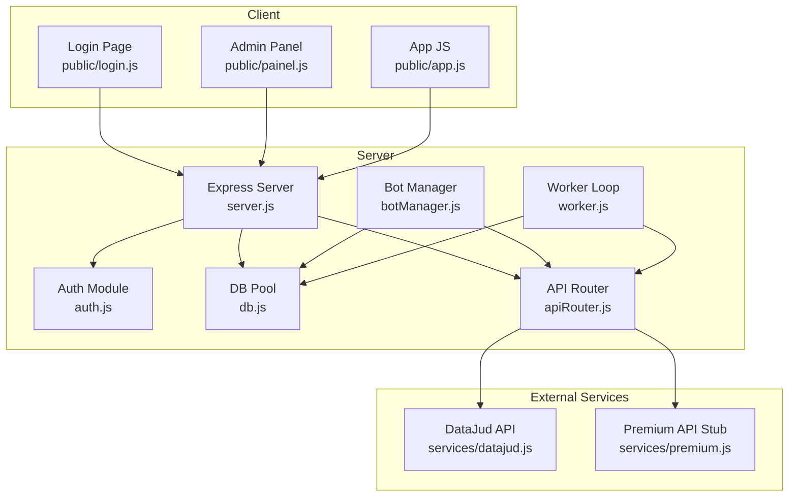
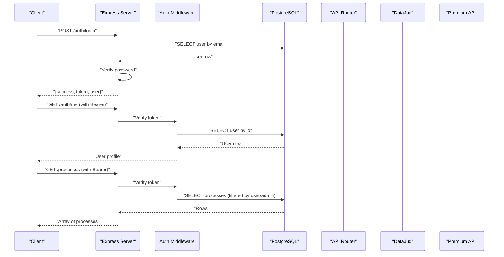
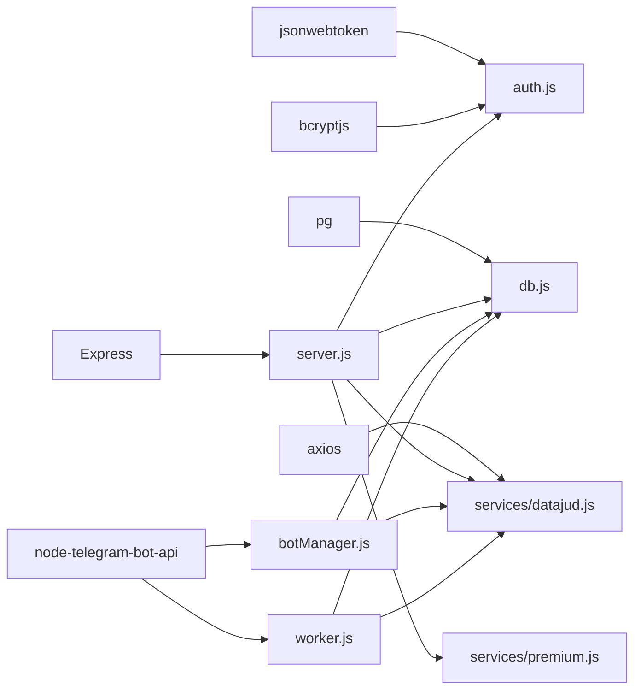

# API Reference

<cite>
**Referenced Files in This Document**
- [server.js](file://server.js)
- [auth.js](file://auth.js)
- [db.js](file://db.js)
- [apiRouter.js](file://apiRouter.js)
- [botManager.js](file://botManager.js)
- [worker.js](file://worker.js)
- [services/datajud.js](file://services/datajud.js)
- [services/premium.js](file://services/premium.js)
- [database.sql](file://database.sql)
- [package.json](file://package.json)
- [public/login.js](file://public/login.js)
- [public/painel.js](file://public/painel.js)
- [public/app.js](file://public/app.js)
</cite>

## Table of Contents
1. [Introduction](#introduction)
2. [Project Structure](#project-structure)
3. [Core Components](#core-components)
4. [Architecture Overview](#architecture-overview)
5. [Detailed Component Analysis](#detailed-component-analysis)
6. [Dependency Analysis](#dependency-analysis)
7. [Performance Considerations](#performance-considerations)
8. [Troubleshooting Guide](#troubleshooting-guide)
9. [Conclusion](#conclusion)
10. [Appendices](#appendices)

## Introduction
This document provides a comprehensive API reference for the judicial process monitoring service. It covers all RESTful endpoints, authentication mechanisms, request/response schemas, error handling, and operational details. It also documents administrative capabilities, process management, and integration patterns with Telegram bots and external APIs.

## Project Structure
The backend is an Express server with:
- Authentication and authorization middleware
- Database connectivity via PostgreSQL
- Telegram bot orchestration and monitoring worker
- Public web client for login, registration, and admin panel

**Diagram sources**
- [server.js:1-162](file://server.js#L1-L162)
- [auth.js:1-59](file://auth.js#L1-L59)
- [db.js:1-11](file://db.js#L1-L11)
- [apiRouter.js:1-19](file://apiRouter.js#L1-L19)
- [botManager.js:1-53](file://botManager.js#L1-L53)
- [worker.js:1-70](file://worker.js#L1-L70)
- [services/datajud.js:1-32](file://services/datajud.js#L1-L32)
- [services/premium.js:1-12](file://services/premium.js#L1-L12)
- [public/login.js:1-91](file://public/login.js#L1-L91)
- [public/painel.js:1-158](file://public/painel.js#L1-L158)
- [public/app.js:1-53](file://public/app.js#L1-L53)

**Section sources**
- [server.js:1-162](file://server.js#L1-L162)
- [package.json:1-21](file://package.json#L1-L21)

## Core Components
- Authentication and Authorization
  - JWT-based authentication with bearer tokens
  - Role-based access control (admin/client)
- Database Layer
  - PostgreSQL connection pool
  - Users and Processes tables
- Telegram Integration
  - Bot creation and message handling
  - Worker loop for periodic updates
- External API Integration
  - Free DataJud fallback
  - Premium API fallback

**Section sources**
- [auth.js:1-59](file://auth.js#L1-L59)
- [db.js:1-11](file://db.js#L1-L11)
- [database.sql:1-25](file://database.sql#L1-L25)
- [botManager.js:1-53](file://botManager.js#L1-L53)
- [worker.js:1-70](file://worker.js#L1-L70)
- [services/datajud.js:1-32](file://services/datajud.js#L1-L32)
- [services/premium.js:1-12](file://services/premium.js#L1-L12)

## Architecture Overview
The system exposes REST endpoints protected by JWT and role checks. Requests flow through Express routes to handlers that interact with the database and external services. Telegram bots are managed per user and periodically polled by a worker to send notifications on status changes.

**Diagram sources**
- [server.js:38-135](file://server.js#L38-L135)
- [auth.js:16-31](file://auth.js#L16-L31)
- [db.js:1-11](file://db.js#L1-L11)
- [apiRouter.js:4-16](file://apiRouter.js#L4-L16)
- [services/datajud.js:3-29](file://services/datajud.js#L3-L29)
- [services/premium.js:1-12](file://services/premium.js#L1-L12)

## Detailed Component Analysis

### Authentication Endpoints
- POST /auth/registro
  - Purpose: Register a new user account
  - Request body:
    - email: string (required)
    - senha: string (required)
    - telegram_id: number (optional)
    - bot_token: string (optional)
    - api_key: string (optional)
    - modo: string enum ['gratis','híbrido','pago'] (optional, defaults to 'gratis')
  - Response:
    - On success: { success: true, id: number, message: string }
    - On duplicate email: 400 { error: string }
    - On failure: 500 { error: string }
  - Notes:
    - If bot_token is provided, a Telegram bot is started for the user
    - Password is hashed before storage

- POST /auth/login
  - Purpose: Authenticate and issue JWT
  - Request body:
    - email: string (required)
    - senha: string (required)
  - Response:
    - On success: { success: true, token: string, user: { id, email, tipo } }
    - On invalid credentials: 401 { error: string }
    - On failure: 500 { error: string }

- GET /auth/me
  - Purpose: Retrieve current user profile
  - Headers:
    - Authorization: Bearer <token>
  - Response:
    - On success: User object { id, email, tipo, telegram_id, modo, criado_em }
    - On missing/invalid token: 401 { error: string }
    - On failure: 500 { error: string }

**Section sources**
- [server.js:11-68](file://server.js#L11-L68)
- [server.js:124-135](file://server.js#L124-L135)
- [auth.js:16-31](file://auth.js#L16-L31)
- [auth.js:41-49](file://auth.js#L41-L49)

### Administrative Endpoints
- POST /usuario
  - Purpose: Create a user (admin only)
  - Headers:
    - Authorization: Bearer <token>
  - Request body:
    - email: string (required)
    - senha: string (required)
    - telegram_id: number (optional)
    - bot_token: string (optional)
    - api_key: string (optional)
    - modo: string enum ['gratis','híbrido','pago'] (optional, defaults to 'gratis')
  - Response:
    - On success: { success: true, id: number, message: string }
    - On failure: 500 { error: string }
  - Notes:
    - Requires admin role

- GET /usuarios
  - Purpose: List all users (admin only)
  - Headers:
    - Authorization: Bearer <token>
  - Response:
    - On success: Array of users { id, email, tipo, telegram_id, modo, criado_em }
    - On failure: 500 { error: string }

**Section sources**
- [server.js:70-92](file://server.js#L70-L92)
- [server.js:112-122](file://server.js#L112-L122)
- [auth.js:33-39](file://auth.js#L33-L39)

### Process Management Endpoints
- GET /processos
  - Purpose: List processes for the authenticated user
  - Headers:
    - Authorization: Bearer <token>
  - Behavior:
    - Non-admin users see only their own processes
    - Admin users see all processes joined with user emails
  - Response:
    - On success: Array of process rows { id, numero, usuario_id, ultimo_status, atualizado_em, usuario_email }
    - On failure: 500 { error: string }

**Section sources**
- [server.js:94-110](file://server.js#L94-L110)

### External API Integration
- Consultation flow
  - Priority: Free DataJud -> Paid Premium (if configured)
  - Used by bot message handler and worker loop
  - Returns normalized structure: { numero, tribunal, classe, data }

**Section sources**
- [apiRouter.js:4-16](file://apiRouter.js#L4-L16)
- [services/datajud.js:3-29](file://services/datajud.js#L3-L29)
- [services/premium.js:1-12](file://services/premium.js#L1-L12)

### Telegram Bot Orchestration
- Message handling
  - On receiving a message, the bot consults process data and persists it
  - Sends formatted messages back to the user
- Worker loop
  - Periodic checks for process updates
  - Notifies users via Telegram when status changes

**Section sources**
- [botManager.js:7-42](file://botManager.js#L7-L42)
- [worker.js:17-61](file://worker.js#L17-L61)

## Dependency Analysis
Key runtime dependencies include Express, JSON Web Token, Bcrypt, Postgres, and Telegram Bot API client. The server depends on the auth module for middleware and JWT signing, and on the database pool for persistence.

**Diagram sources**
- [package.json:11-19](file://package.json#L11-L19)
- [server.js:1-10](file://server.js#L1-L10)
- [auth.js:1-3](file://auth.js#L1-L3)
- [db.js:1-10](file://db.js#L1-L10)
- [services/datajud.js:1](file://services/datajud.js#L1)
- [botManager.js:1](file://botManager.js#L1)
- [worker.js:1-4](file://worker.js#L1-L4)

**Section sources**
- [package.json:11-19](file://package.json#L11-L19)
- [server.js:1-10](file://server.js#L1-L10)

## Performance Considerations
- Rate limiting: Not implemented in the current codebase. Consider adding rate limiting per IP/token to protect endpoints.
- Pagination: Not implemented. For large datasets, implement limit/offset or cursor-based pagination on GET /usuarios and GET /processos.
- Caching: Consider caching user profiles and recent process statuses to reduce DB load.
- Worker interval: The worker runs every 5 minutes. Adjust interval based on workload and external API quotas.
- Indexes: Add indexes on frequently queried columns (e.g., usuarios.email, processos.usuario_id, processos.numero).

[No sources needed since this section provides general guidance]

## Troubleshooting Guide
Common errors and resolutions:
- 401 Unauthorized
  - Cause: Missing or invalid Authorization header
  - Resolution: Ensure Bearer token is present and valid
- 403 Forbidden
  - Cause: Non-admin attempting admin endpoint
  - Resolution: Authenticate as admin or use non-admin endpoints
- 400 Bad Request (registration)
  - Cause: Duplicate email
  - Resolution: Use a unique email address
- 500 Internal Server Error
  - Cause: Database or external API failures
  - Resolution: Check logs and retry; verify external service availability

**Section sources**
- [auth.js:16-31](file://auth.js#L16-L31)
- [auth.js:33-39](file://auth.js#L33-L39)
- [server.js:30-36](file://server.js#L30-L36)
- [server.js:107-109](file://server.js#L107-L109)

## Conclusion
The API provides a clear set of endpoints for user authentication, administrative management, and process monitoring. JWT-based authentication with role checks ensures secure access. The system integrates Telegram bots and external APIs to deliver timely updates. For production, consider adding rate limiting, pagination, caching, and robust monitoring.

[No sources needed since this section summarizes without analyzing specific files]

## Appendices

### Authentication and Authorization
- JWT Secret
  - Defined in environment or default fallback
  - Used to sign tokens with 24-hour expiration
- Middleware
  - authMiddleware validates Authorization header and decodes JWT
  - adminMiddleware enforces admin-only access

**Section sources**
- [auth.js:5](file://auth.js#L5)
- [auth.js:8-14](file://auth.js#L8-L14)
- [auth.js:16-31](file://auth.js#L16-L31)
- [auth.js:33-39](file://auth.js#L33-L39)

### Database Schema
- usuarios
  - Columns: id, nome, email (unique), senha, tipo (default 'cliente'), telegram_id, bot_token, api_key, modo (default 'gratis'), criado_em
- processos
  - Columns: id, numero, usuario_id (FK), ultimo_status, atualizado_em

**Section sources**
- [database.sql:5-24](file://database.sql#L5-L24)

### Request/Response Examples

- curl: Register
  - curl -X POST https://your-host/auth/registro -H "Content-Type: application/json" -d '{"email":"user@example.com","senha":"password","modo":"gratis"}'

- curl: Login
  - curl -X POST https://your-host/auth/login -H "Content-Type: application/json" -d '{"email":"user@example.com","senha":"password"}'

- curl: Get Profile
  - curl -H "Authorization: Bearer YOUR_TOKEN" https://your-host/auth/me

- curl: List Processes
  - curl -H "Authorization: Bearer YOUR_TOKEN" https://your-host/processos

- curl: Admin: Create User
  - curl -X POST -H "Authorization: Bearer YOUR_TOKEN" -H "Content-Type: application/json" https://your-host/usuario -d '{"email":"user@example.com","senha":"password","modo":"gratis"}'

- curl: Admin: List Users
  - curl -H "Authorization: Bearer YOUR_TOKEN" https://your-host/usuarios

- JavaScript fetch: Login
  - fetch('/auth/login', { method: 'POST', headers: {'Content-Type':'application/json'}, body: JSON.stringify({email, senha}) })

- JavaScript fetch: Get Profile
  - fetch('/auth/me', { headers: {'Authorization':'Bearer ' + token} })

- JavaScript fetch: List Processes
  - fetch('/processos', { headers: {'Authorization':'Bearer ' + token} })

- JavaScript fetch: Admin: Create User
  - fetch('/usuario', { method: 'POST', headers: {'Authorization':'Bearer ' + token,'Content-Type':'application/json'}, body: JSON.stringify({...}) })

**Section sources**
- [public/login.js:24-46](file://public/login.js#L24-L46)
- [public/painel.js:93-108](file://public/painel.js#L93-L108)
- [public/painel.js:37-62](file://public/painel.js#L37-L62)
- [public/painel.js:115-146](file://public/painel.js#L115-L146)

### API Versioning Strategy
- Current version: 2.0.0
- Recommendation: Use path-based versioning (e.g., /v2/auth/login) or header-based versioning to evolve endpoints safely

**Section sources**
- [package.json:3](file://package.json#L3)

### CORS and Security Headers
- CORS: Not configured in the current codebase
- Security headers: Not configured in the current codebase
- Recommendations:
  - Enable CORS for trusted origins
  - Add security headers (e.g., Content-Security-Policy, HSTS)
  - Enforce HTTPS in production

[No sources needed since this section provides general guidance]

### Production Deployment Considerations
- Environment variables
  - JWT_SECRET, DB_HOST, DB_USER, DB_PASSWORD, DB_NAME, DB_PORT
- Process management
  - Run server and worker as separate processes
  - Use process managers (PM2) for resilience
- Scaling
  - Horizontal scaling requires shared state or session affinity
  - Externalize bot sessions if needed
- Monitoring
  - Add logging, metrics, and health checks
  - Monitor external API availability and latency

**Section sources**
- [server.js:137-140](file://server.js#L137-L140)
- [package.json:5-10](file://package.json#L5-L10)