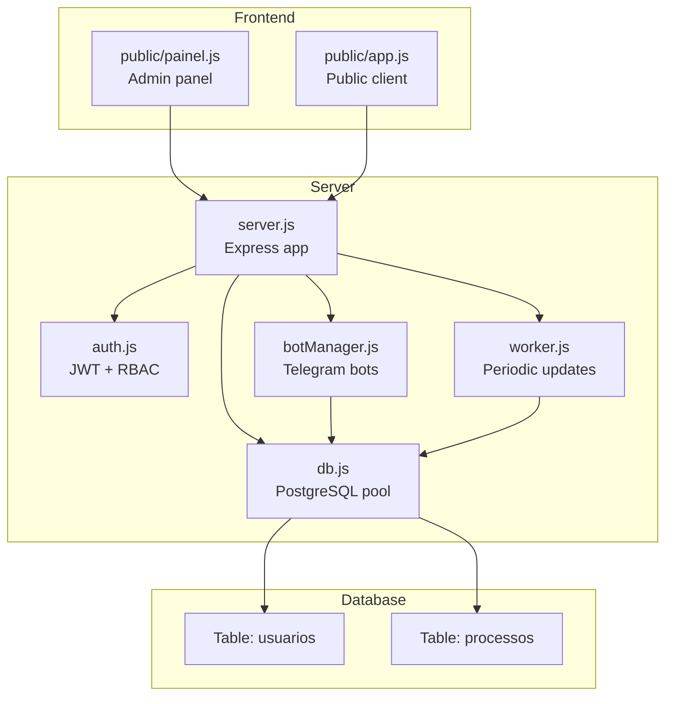
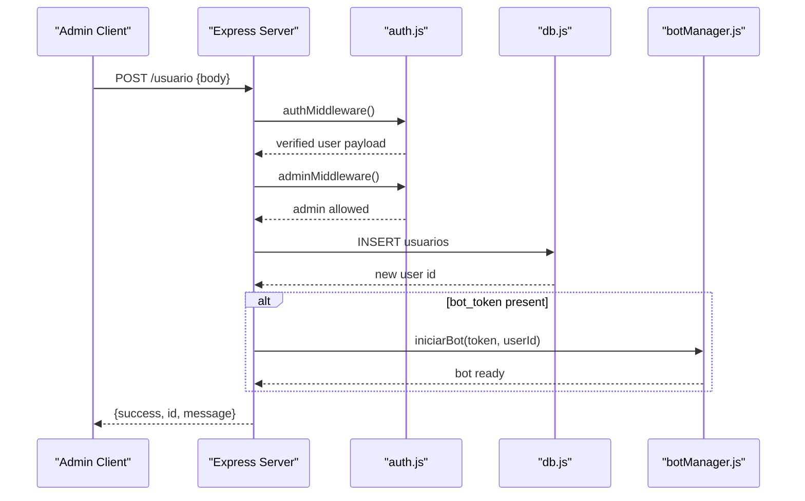
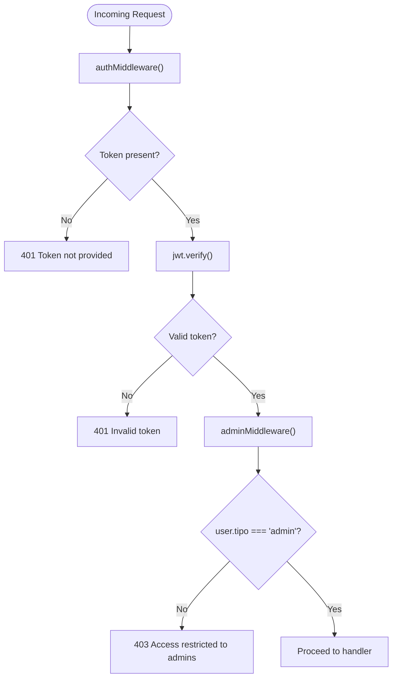
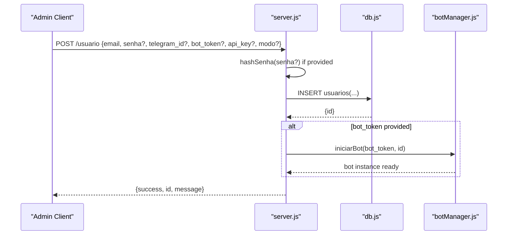
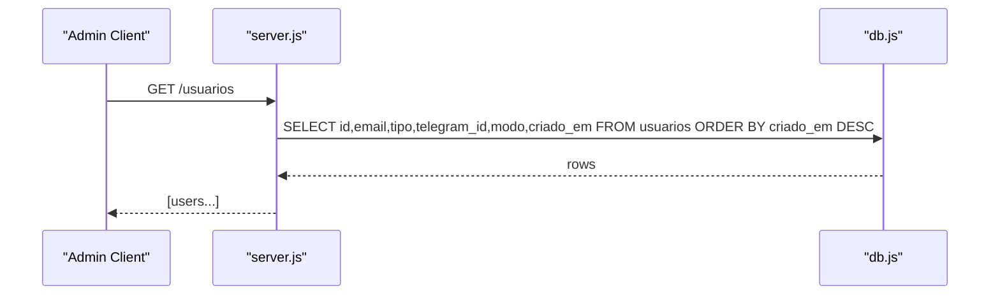
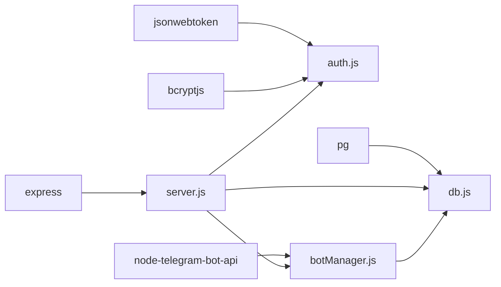

# Administrative Management Endpoints

<cite>
**Referenced Files in This Document**
- [server.js](file://server.js)
- [auth.js](file://auth.js)
- [botManager.js](file://botManager.js)
- [db.js](file://db.js)
- [database.sql](file://database.sql)
- [public/painel.js](file://public/painel.js)
- [public/app.js](file://public/app.js)
- [worker.js](file://worker.js)
- [package.json](file://package.json)
- [README.md](file://README.md)
</cite>

## Table of Contents
1. [Introduction](#introduction)
2. [Project Structure](#project-structure)
3. [Core Components](#core-components)
4. [Architecture Overview](#architecture-overview)
5. [Detailed Component Analysis](#detailed-component-analysis)
6. [Dependency Analysis](#dependency-analysis)
7. [Performance Considerations](#performance-considerations)
8. [Troubleshooting Guide](#troubleshooting-guide)
9. [Conclusion](#conclusion)
10. [Appendices](#appendices)

## Introduction
This document provides comprehensive API documentation for administrative endpoints focused on user management. It covers:
- Role-based access control requiring admin privileges for administrative endpoints
- The /usuario endpoint for creating new users with automatic bot initialization
- The /usuarios endpoint for listing all system users
- Request parameters, response formats, and error handling
- Security considerations, rate limiting, and audit logging recommendations
- Practical examples using various HTTP clients and programming languages

## Project Structure
The application is a Node.js/Express service with PostgreSQL persistence, Telegram bot integration, and a small admin panel. Administrative endpoints are implemented in the server module and protected by authentication and authorization middleware.

**Diagram sources**
- [server.js:1-162](file://server.js#L1-L162)
- [auth.js:1-59](file://auth.js#L1-L59)
- [botManager.js:1-53](file://botManager.js#L1-L53)
- [db.js:1-11](file://db.js#L1-L11)
- [database.sql:5-25](file://database.sql#L5-L25)
- [worker.js:1-70](file://worker.js#L1-L70)
- [public/painel.js:1-158](file://public/painel.js#L1-L158)
- [public/app.js:1-53](file://public/app.js#L1-L53)

**Section sources**
- [server.js:1-162](file://server.js#L1-L162)
- [database.sql:5-25](file://database.sql#L5-L25)
- [README.md:1-56](file://README.md#L1-L56)

## Core Components
- Authentication and Authorization:
  - JWT-based authentication middleware validates bearer tokens.
  - Admin-only middleware enforces role-based access control.
- User Management Endpoints:
  - POST /usuario: Creates a new user with optional password hashing and optional bot initialization.
  - GET /usuarios: Lists all users with ordering by creation date.
- Bot Management:
  - Automatic initialization of Telegram bots when a bot_token is provided during user creation.
- Database Access:
  - PostgreSQL connection pool for all data operations.
- Frontend Integration:
  - Admin panel demonstrates usage of /usuarios and /usuario endpoints.

Key implementation references:
- Authentication and RBAC: [auth.js:16-39](file://auth.js#L16-L39)
- POST /usuario: [server.js:70-92](file://server.js#L70-L92)
- GET /usuarios: [server.js:112-122](file://server.js#L112-L122)
- Bot initialization: [server.js:25-27](file://server.js#L25-L27), [server.js:84-86](file://server.js#L84-L86), [botManager.js:7-42](file://botManager.js#L7-L42)

**Section sources**
- [auth.js:16-39](file://auth.js#L16-L39)
- [server.js:70-92](file://server.js#L70-L92)
- [server.js:112-122](file://server.js#L112-L122)
- [botManager.js:7-42](file://botManager.js#L7-L42)

## Architecture Overview
The administrative endpoints are protected by two middleware layers:
- authMiddleware: Extracts and verifies JWT from Authorization header.
- adminMiddleware: Ensures the user’s type is admin.

**Diagram sources**
- [server.js:70-92](file://server.js#L70-L92)
- [auth.js:16-39](file://auth.js#L16-L39)
- [botManager.js:7-42](file://botManager.js#L7-L42)
- [db.js:1-11](file://db.js#L1-11)

## Detailed Component Analysis

### Role-Based Access Control (RBAC)
- JWT verification ensures requests carry a valid token.
- Admin-only enforcement prevents unauthorized access to administrative endpoints.
- Typical errors: 401 Unauthorized (missing/invalid token), 403 Forbidden (non-admin).

**Diagram sources**
- [auth.js:16-39](file://auth.js#L16-L39)

**Section sources**
- [auth.js:16-39](file://auth.js#L16-L39)

### Endpoint: POST /usuario (User Creation)
Purpose:
- Create a new user account with optional password, Telegram bot configuration, and mode selection.
- Automatically initialize a Telegram bot when bot_token is provided.

Request
- Method: POST
- Path: /usuario
- Headers:
  - Content-Type: application/json
  - Authorization: Bearer <JWT>
- Body fields:
  - email: string (required)
  - senha: string (optional; hashed if provided)
  - telegram_id: number (optional)
  - bot_token: string (optional; triggers bot initialization)
  - api_key: string (optional)
  - modo: string (optional; defaults to 'gratis')

Behavior
- Hashes password if provided.
- Inserts user record into usuarios table.
- If bot_token is provided, starts a Telegram bot instance and associates it with the user.
- Returns success with user id and message.

Response
- 200 OK on success: { success: true, id: number, message: string }
- 500 Internal Server Error on failure.

Security Notes
- Requires admin privileges.
- Passwords are hashed before storage.

Automatic Bot Initialization
- When bot_token is present, the server calls the bot manager to start a Telegram bot.
- The bot listens for messages and performs legal process lookups.

**Diagram sources**
- [server.js:70-92](file://server.js#L70-L92)
- [botManager.js:7-42](file://botManager.js#L7-L42)
- [db.js:1-11](file://db.js#L1-11)

**Section sources**
- [server.js:70-92](file://server.js#L70-L92)
- [botManager.js:7-42](file://botManager.js#L7-L42)
- [database.sql:5-16](file://database.sql#L5-L16)

### Endpoint: GET /usuarios (List Users)
Purpose:
- Retrieve a list of all users in the system.
- Admin-only endpoint.

Request
- Method: GET
- Path: /usuarios
- Headers:
  - Authorization: Bearer <JWT>

Behavior
- Executes a SELECT query on usuarios table.
- Orders results by creation timestamp descending.

Response
- 200 OK: Array of user records with selected fields.
- 500 Internal Server Error on failure.

Notes
- Filtering, sorting, and pagination are not implemented in this endpoint; results are ordered by creation date.

**Diagram sources**
- [server.js:112-122](file://server.js#L112-L122)
- [db.js:1-11](file://db.js#L1-11)

**Section sources**
- [server.js:112-122](file://server.js#L112-L122)
- [database.sql:5-16](file://database.sql#L5-L16)

### Supporting Components

#### Authentication and Token Generation
- JWT signing and verification with secret configured via environment.
- Token payload includes user id, email, and type.
- Expiration set to 24 hours.

References:
- [auth.js:8-14](file://auth.js#L8-L14)
- [auth.js:24-30](file://auth.js#L24-L30)

**Section sources**
- [auth.js:8-14](file://auth.js#L8-L14)
- [auth.js:24-30](file://auth.js#L24-L30)

#### Telegram Bot Manager
- Maintains a cache of bot instances keyed by token.
- On message events, performs legal process lookup and persists results.
- Loads existing bots at startup for users with bot_token.

References:
- [botManager.js:7-42](file://botManager.js#L7-L42)
- [botManager.js:44-50](file://botManager.js#L44-L50)

**Section sources**
- [botManager.js:7-42](file://botManager.js#L7-L42)
- [botManager.js:44-50](file://botManager.js#L44-L50)

#### Database Schema
- usuarios table defines user roles, credentials, Telegram integration, and modes.
- processos table stores monitored legal processes linked to users.

References:
- [database.sql:5-16](file://database.sql#L5-L16)
- [database.sql:18-24](file://database.sql#L18-L24)

**Section sources**
- [database.sql:5-16](file://database.sql#L5-L16)
- [database.sql:18-24](file://database.sql#L18-L24)

#### Frontend Integration
- Admin panel demonstrates:
  - Listing users via GET /usuarios
  - Creating users via POST /usuario
  - Using Authorization headers with Bearer tokens

References:
- [public/painel.js:64-89](file://public/painel.js#L64-L89)
- [public/painel.js:110-146](file://public/painel.js#L110-L146)

**Section sources**
- [public/painel.js:64-89](file://public/painel.js#L64-L89)
- [public/painel.js:110-146](file://public/painel.js#L110-L146)

## Dependency Analysis
External libraries and their roles:
- express: Web framework for routing and middleware.
- jsonwebtoken: JWT token generation and verification.
- bcryptjs: Password hashing and comparison.
- pg: PostgreSQL client for database operations.
- node-telegram-bot-api: Telegram bot integration.

**Diagram sources**
- [package.json:11-19](file://package.json#L11-L19)
- [server.js:1-10](file://server.js#L1-L10)
- [auth.js:1-3](file://auth.js#L1-L3)
- [botManager.js:1-2](file://botManager.js#L1-L2)
- [db.js:1-10](file://db.js#L1-L10)

**Section sources**
- [package.json:11-19](file://package.json#L11-L19)

## Performance Considerations
- Bot initialization overhead: Starting a Telegram bot per user can increase memory and CPU usage. Consider pooling and reuse strategies.
- Database queries: The /usuarios endpoint returns all users; for large datasets, implement pagination and filtering.
- Worker periodicity: The worker runs every 5 minutes; adjust interval based on workload and resource constraints.
- Caching: The worker caches user lookups to reduce repeated database queries.

[No sources needed since this section provides general guidance]

## Troubleshooting Guide
Common issues and resolutions:
- 401 Unauthorized:
  - Cause: Missing or invalid Authorization header.
  - Resolution: Ensure a valid JWT is included in the Authorization header.
- 403 Forbidden:
  - Cause: Non-admin user attempting administrative endpoint.
  - Resolution: Authenticate as an admin user.
- 500 Internal Server Error:
  - Cause: Database errors or unhandled exceptions.
  - Resolution: Check server logs and database connectivity.
- Duplicate email:
  - Cause: Email already registered.
  - Resolution: Use a unique email address.

Operational checks:
- Confirm JWT_SECRET environment variable is set.
- Verify PostgreSQL connection parameters.
- Ensure Telegram bot token and chat id are correctly configured.

**Section sources**
- [auth.js:16-39](file://auth.js#L16-L39)
- [server.js:25-35](file://server.js#L25-L35)
- [server.js:89-91](file://server.js#L89-L91)

## Conclusion
The administrative endpoints provide secure user management with role-based access control and integrated Telegram bot initialization. Administrators can create users and list all system users. For production deployments, consider adding pagination, filtering, rate limiting, and audit logging to enhance scalability and security.

[No sources needed since this section summarizes without analyzing specific files]

## Appendices

### API Definitions

- POST /usuario
  - Purpose: Create a new user with optional password, Telegram bot configuration, and mode.
  - Authentication: Bearer token required; admin only.
  - Request body:
    - email: string (required)
    - senha: string (optional)
    - telegram_id: number (optional)
    - bot_token: string (optional)
    - api_key: string (optional)
    - modo: string (optional; defaults to 'gratis')
  - Responses:
    - 200 OK: { success: true, id: number, message: string }
    - 500 Internal Server Error: { error: string }

- GET /usuarios
  - Purpose: List all users in the system.
  - Authentication: Bearer token required; admin only.
  - Responses:
    - 200 OK: Array of user records
    - 500 Internal Server Error: { error: string }

### Administrative Workflows and Examples

- Create a new user with bot:
  - Use a client with Authorization header to POST to /usuario with bot_token.
  - The server initializes the Telegram bot automatically.

- Bulk user creation:
  - Iterate POST /usuario with different email addresses.
  - Optionally include bot_token for each user to auto-start bots.

- List all users:
  - Send GET /usuarios with Authorization header to retrieve all users.

- Example clients and languages:
  - curl: Include Authorization: Bearer <token> header.
  - JavaScript (fetch): Set headers and send JSON body.
  - Python (requests): Set Authorization header and JSON payload.
  - Node.js (axios): Configure headers and body accordingly.

[No sources needed since this section provides general guidance]

### Security Considerations
- Rate Limiting:
  - Implement per-endpoint rate limits to prevent abuse.
- Audit Logging:
  - Log administrative actions (user creation, listing) with timestamps and actor identity.
- Secrets Management:
  - Store JWT_SECRET and database credentials in environment variables.
- Transport Security:
  - Use HTTPS/TLS to protect tokens and payloads.

[No sources needed since this section provides general guidance]