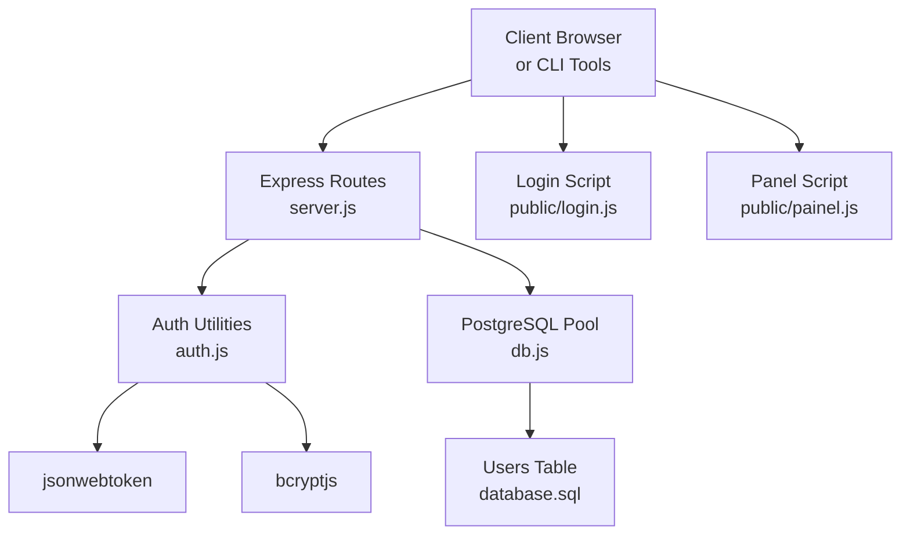
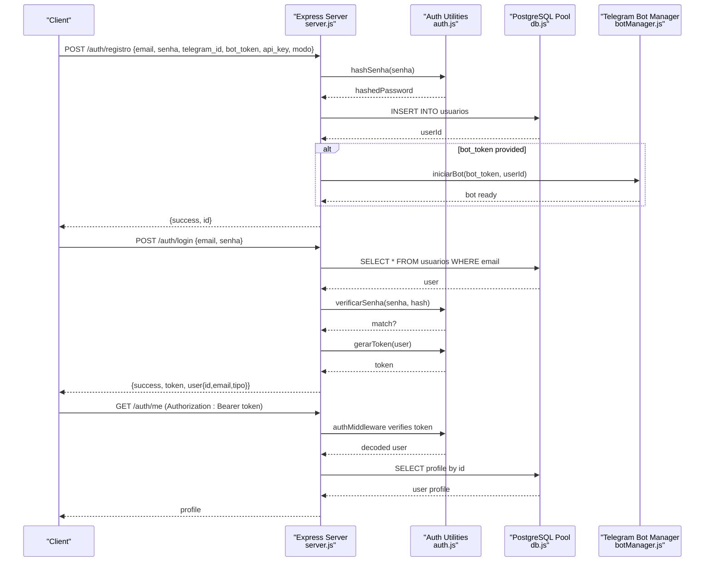
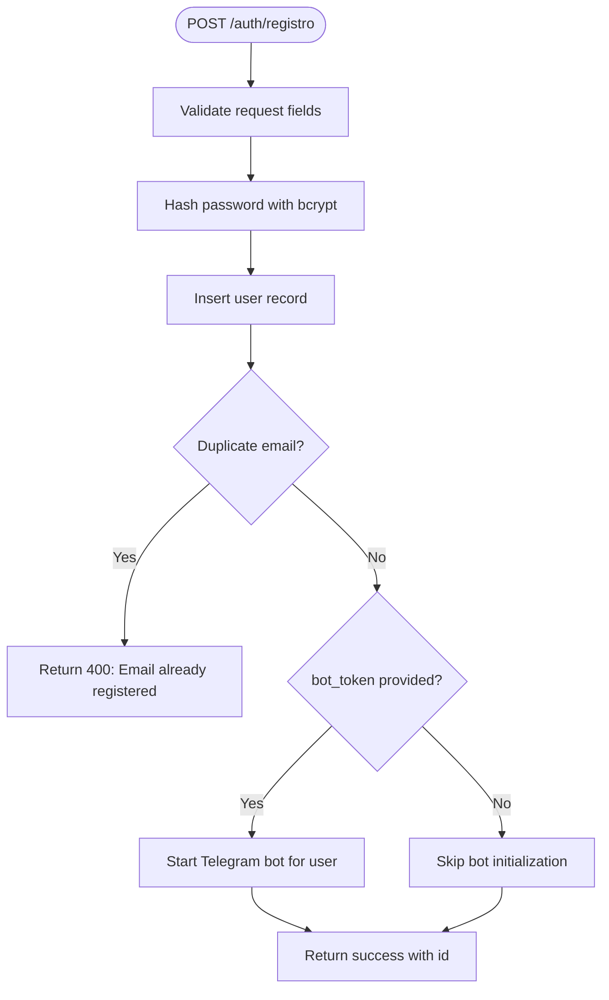
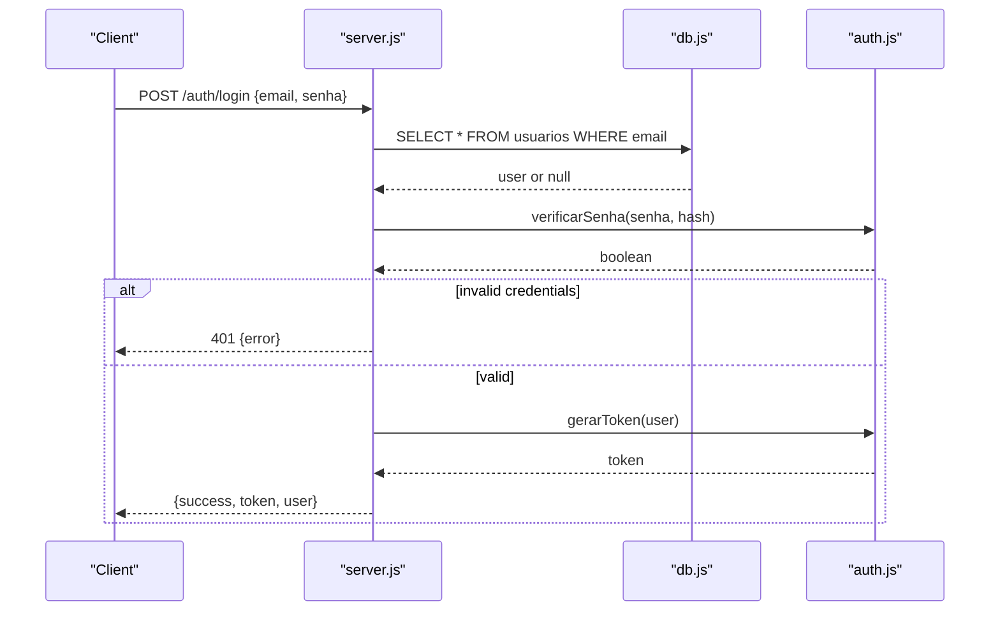
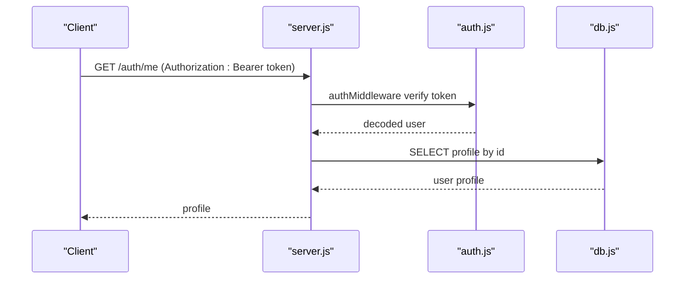
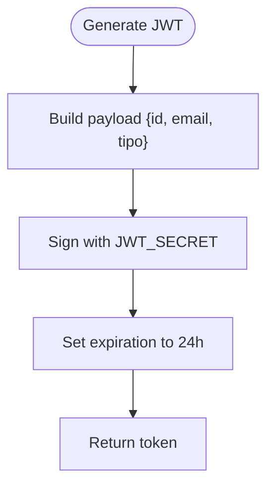
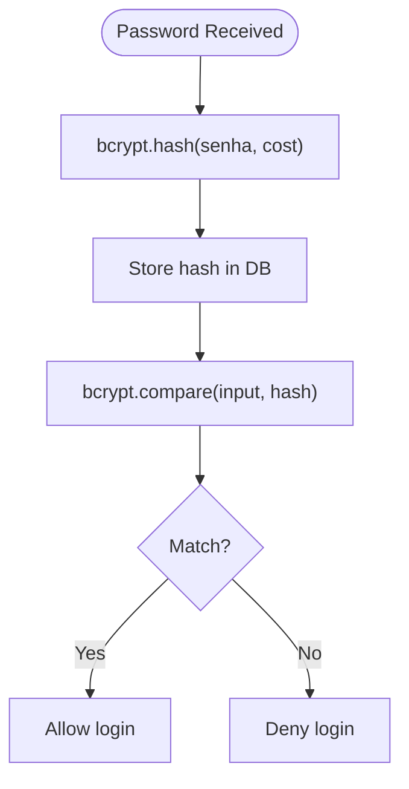
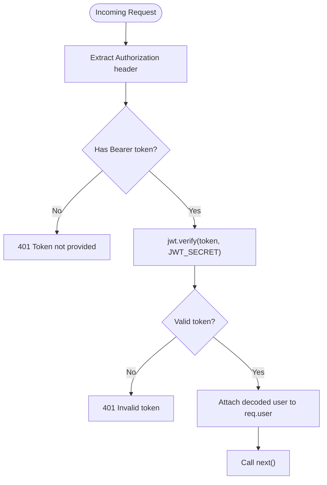
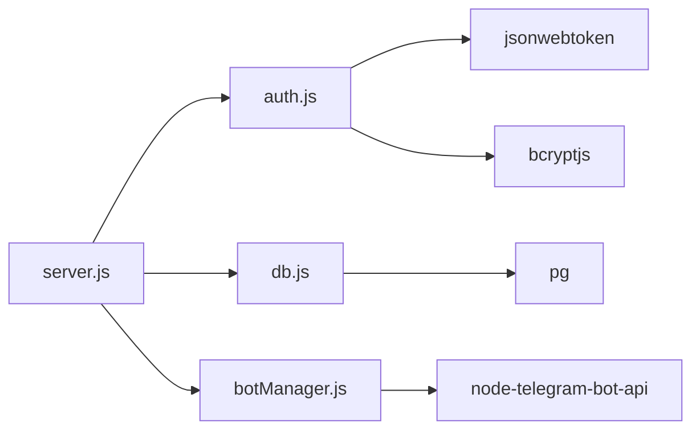

# Authentication Endpoints

<cite>
**Referenced Files in This Document**
- [server.js](file://server.js)
- [auth.js](file://auth.js)
- [db.js](file://db.js)
- [database.sql](file://database.sql)
- [public/login.js](file://public/login.js)
- [public/painel.js](file://public/painel.js)
- [package.json](file://package.json)
- [README.md](file://README.md)
- [botManager.js](file://botManager.js)
</cite>

## Table of Contents
1. [Introduction](#introduction)
2. [Project Structure](#project-structure)
3. [Core Components](#core-components)
4. [Architecture Overview](#architecture-overview)
5. [Detailed Component Analysis](#detailed-component-analysis)
6. [Dependency Analysis](#dependency-analysis)
7. [Performance Considerations](#performance-considerations)
8. [Troubleshooting Guide](#troubleshooting-guide)
9. [Conclusion](#conclusion)
10. [Appendices](#appendices)

## Introduction
This document provides comprehensive API documentation for the authentication endpoints used by the judicial process monitoring SaaS platform. It covers:
- Registration endpoint for new users
- Login endpoint for authentication
- Profile retrieval endpoint for authenticated users
- JWT token generation, structure, and expiration policy
- Password hashing using bcrypt
- Security considerations and best practices
- Practical examples for clients (curl, JavaScript fetch)
- Authentication middleware requirements and session management recommendations

## Project Structure
The authentication system spans backend routes, middleware, and frontend client integrations:
- Backend routes define the endpoints and request/response handling
- Authentication module provides JWT signing, verification, and bcrypt utilities
- Frontend scripts demonstrate client-side usage and token storage
- Database schema defines user profile fields and constraints



**Diagram sources**
- [server.js:11-135](file://server.js#L11-L135)
- [auth.js:1-59](file://auth.js#L1-L59)
- [db.js:1-11](file://db.js#L1-L11)
- [database.sql:5-16](file://database.sql#L5-L16)
- [public/login.js:18-90](file://public/login.js#L18-L90)
- [public/painel.js:37-108](file://public/painel.js#L37-L108)

**Section sources**
- [server.js:11-135](file://server.js#L11-L135)
- [auth.js:1-59](file://auth.js#L1-L59)
- [db.js:1-11](file://db.js#L1-L11)
- [database.sql:5-16](file://database.sql#L5-L16)
- [public/login.js:18-90](file://public/login.js#L18-L90)
- [public/painel.js:37-108](file://public/painel.js#L37-L108)

## Core Components
- Authentication endpoints:
  - POST /auth/registro: Creates a new user with hashed password and optional Telegram bot configuration
  - POST /auth/login: Authenticates a user and returns a signed JWT
  - GET /auth/me: Retrieves the authenticated user’s profile
- Authentication utilities:
  - JWT signing with 24-hour expiration
  - Bcrypt-based password hashing and verification
  - Express middleware for bearer token validation and admin checks
- Database model:
  - Users table with unique email, role, Telegram integration fields, and mode selection

**Section sources**
- [server.js:11-135](file://server.js#L11-L135)
- [auth.js:7-49](file://auth.js#L7-L49)
- [database.sql:5-16](file://database.sql#L5-L16)

## Architecture Overview
The authentication flow integrates route handlers, middleware, and database access. The frontend stores tokens locally and sends Authorization headers for protected routes.



**Diagram sources**
- [server.js:11-68](file://server.js#L11-L68)
- [server.js:124-135](file://server.js#L124-L135)
- [auth.js:7-49](file://auth.js#L7-L49)
- [db.js:1-11](file://db.js#L1-L11)
- [botManager.js:7-42](file://botManager.js#L7-L42)

## Detailed Component Analysis

### Endpoint: POST /auth/registro
- Purpose: Register a new user with credentials and optional Telegram bot configuration
- Request body schema:
  - email: string, required, unique
  - senha: string, required, minimum length enforced by bcrypt hashing
  - telegram_id: integer or null
  - bot_token: string or null
  - api_key: string or null
  - modo: string, enum ['gratis', 'hibrido', 'pago'], defaults to 'gratis'
- Response schema:
  - success: boolean
  - id: number
  - message: string
- Validation and errors:
  - Duplicate email triggers a 400 error with a specific message
  - Other database or server errors return 500
- Behavior:
  - Password is hashed before insertion
  - If bot_token is provided, a Telegram bot is started for the user
- Example request payload:
  - email: "user@example.com"
  - senha: "SecurePass123!"
  - telegram_id: 123456789
  - bot_token: "123456789:ABC-DEF123456789abcdef123456789abcde"
  - api_key: "sk_live_abc123"
  - modo: "pago"



**Diagram sources**
- [server.js:11-36](file://server.js#L11-L36)
- [auth.js:41-49](file://auth.js#L41-L49)
- [botManager.js:7-42](file://botManager.js#L7-L42)

**Section sources**
- [server.js:11-36](file://server.js#L11-L36)
- [auth.js:41-49](file://auth.js#L41-L49)
- [database.sql:5-16](file://database.sql#L5-L16)
- [botManager.js:7-42](file://botManager.js#L7-L42)

### Endpoint: POST /auth/login
- Purpose: Authenticate a user and issue a JWT
- Request body schema:
  - email: string, required
  - senha: string, required
- Response schema:
  - success: boolean
  - token: string (JWT)
  - user: object with id, email, tipo
- Validation and errors:
  - Incorrect credentials return 401 with a specific message
  - Server errors return 500
- Behavior:
  - Fetches user by email
  - Compares password against stored hash
  - Generates a JWT with 24-hour expiration containing user identity



**Diagram sources**
- [server.js:38-68](file://server.js#L38-L68)
- [auth.js:7-49](file://auth.js#L7-L49)
- [db.js:1-11](file://db.js#L1-L11)

**Section sources**
- [server.js:38-68](file://server.js#L38-L68)
- [auth.js:7-49](file://auth.js#L7-L49)
- [db.js:1-11](file://db.js#L1-L11)

### Endpoint: GET /auth/me
- Purpose: Retrieve the authenticated user’s profile
- Authentication:
  - Requires a valid Authorization: Bearer <token>
- Response schema:
  - id: number
  - email: string
  - tipo: string (e.g., "cliente", "admin")
  - telegram_id: integer or null
  - modo: string (e.g., "gratis", "hibrido", "pago")
  - criado_em: timestamp
- Validation and errors:
  - Missing/invalid token returns 401
  - Server errors return 500



**Diagram sources**
- [server.js:124-135](file://server.js#L124-L135)
- [auth.js:16-31](file://auth.js#L16-L31)
- [db.js:1-11](file://db.js#L1-L11)

**Section sources**
- [server.js:124-135](file://server.js#L124-L135)
- [auth.js:16-31](file://auth.js#L16-L31)
- [db.js:1-11](file://db.js#L1-L11)

### JWT Token Generation and Structure
- Secret:
  - JWT_SECRET is loaded from environment variables; defaults to a placeholder if not set
- Payload:
  - Contains id, email, tipo
- Expiration:
  - 24 hours
- Storage:
  - Clients receive the token in login response and must store it securely (see Best Practices)



**Diagram sources**
- [auth.js:7-14](file://auth.js#L7-L14)

**Section sources**
- [auth.js:5-14](file://auth.js#L5-L14)

### Password Hashing with bcrypt
- Hashing:
  - hashSenha uses bcrypt with a cost factor suitable for server environments
- Verification:
  - verificarSenha compares plaintext password against stored hash
- Security:
  - Salted hashes prevent rainbow table attacks
  - Cost factor balances security and performance



**Diagram sources**
- [auth.js:41-49](file://auth.js#L41-L49)

**Section sources**
- [auth.js:41-49](file://auth.js#L41-L49)
- [package.json:11-19](file://package.json#L11-L19)

### Authentication Middleware
- authMiddleware:
  - Extracts Bearer token from Authorization header
  - Verifies token signature and decodes payload
  - Attaches decoded user to request for downstream handlers
  - Returns 401 for missing/invalid tokens
- adminMiddleware:
  - Checks user.tipo equals "admin"
  - Returns 403 for non-admin access attempts



**Diagram sources**
- [auth.js:16-31](file://auth.js#L16-L31)

**Section sources**
- [auth.js:16-39](file://auth.js#L16-L39)

### Frontend Usage Patterns
- Login page:
  - Submits email and password to /auth/login
  - On success, stores token and user in localStorage
  - Redirects to dashboard
- Dashboard:
  - Sends Authorization: Bearer token with GET /auth/me and GET /processos
  - Uses token for admin endpoints requiring adminMiddleware

```mermaid
sequenceDiagram
participant Login as "login.js"
participant Server as "server.js"
participant Panel as "painel.js"
Login->>Server : POST /auth/login {email, senha}
Server-->>Login : {success, token, user}
Login->>Login : localStorage.setItem('token','...'); localStorage.setItem('user','...')
Login->>Panel : redirect to /painel.html
Panel->>Server : GET /auth/me (Authorization : Bearer token)
Server-->>Panel : user profile
```

**Diagram sources**
- [public/login.js:18-46](file://public/login.js#L18-L46)
- [public/painel.js:91-108](file://public/painel.js#L91-L108)

**Section sources**
- [public/login.js:18-90](file://public/login.js#L18-L90)
- [public/painel.js:37-108](file://public/painel.js#L37-L108)

## Dependency Analysis
- External libraries:
  - jsonwebtoken: JWT signing and verification
  - bcryptjs: Password hashing and comparison
  - pg: PostgreSQL connection pooling
  - dotenv: Environment configuration loading
- Internal dependencies:
  - server.js depends on auth.js for JWT and bcrypt utilities
  - server.js depends on db.js for database access
  - botManager.js depends on Telegram Bot API and db.js



**Diagram sources**
- [server.js:1-6](file://server.js#L1-L6)
- [auth.js:1-3](file://auth.js#L1-L3)
- [db.js:1-11](file://db.js#L1-L11)
- [package.json:11-19](file://package.json#L11-L19)
- [botManager.js:1-3](file://botManager.js#L1-L3)

**Section sources**
- [package.json:11-19](file://package.json#L11-L19)
- [server.js:1-6](file://server.js#L1-L6)
- [auth.js:1-3](file://auth.js#L1-L3)
- [db.js:1-11](file://db.js#L1-L11)
- [botManager.js:1-3](file://botManager.js#L1-L3)

## Performance Considerations
- Token lifetime: 24 hours balances usability and security; consider short-lived access tokens with refresh mechanisms for high-security deployments
- Hash cost: bcrypt cost factor is tuned for server environments; adjust based on hardware capabilities
- Database queries: Ensure indexes on frequently queried columns (e.g., email) to optimize login and profile retrieval
- Middleware overhead: authMiddleware performs signature verification per request; keep JWT_SECRET secure and consider caching verified tokens for high-throughput scenarios

[No sources needed since this section provides general guidance]

## Troubleshooting Guide
- Registration fails with duplicate email:
  - Cause: Email already exists in users table
  - Resolution: Use a different email or reset password
- Login returns incorrect credentials:
  - Cause: Wrong email or password
  - Resolution: Verify credentials and ensure bcrypt-compatibile hashing
- Missing token error on protected routes:
  - Cause: No Authorization header or malformed Bearer token
  - Resolution: Include Authorization: Bearer <token> in all authenticated requests
- Invalid token error:
  - Cause: Expired or tampered token
  - Resolution: Re-authenticate to obtain a new token
- Server errors (500):
  - Cause: Database connectivity or internal errors
  - Resolution: Check server logs and database connectivity

**Section sources**
- [server.js:30-35](file://server.js#L30-L35)
- [server.js:50-52](file://server.js#L50-L52)
- [auth.js:16-31](file://auth.js#L16-L31)

## Conclusion
The authentication system provides secure user registration, login, and profile retrieval with JWT-based session management and bcrypt-powered password hashing. The frontend demonstrates practical usage patterns for storing tokens and accessing protected endpoints. For production deployments, consider rotating secrets, implementing refresh tokens, and adding rate limiting and audit logging.

[No sources needed since this section summarizes without analyzing specific files]

## Appendices

### API Definitions

- POST /auth/registro
  - Headers: Content-Type: application/json
  - Body: { email, senha, telegram_id?, bot_token?, api_key?, modo? }
  - Success: 200 { success, id }
  - Errors: 400 (duplicate email), 500 (server error)

- POST /auth/login
  - Headers: Content-Type: application/json
  - Body: { email, senha }
  - Success: 200 { success, token, user }
  - Errors: 401 (incorrect credentials), 500 (server error)

- GET /auth/me
  - Headers: Authorization: Bearer <token>
  - Success: 200 { id, email, tipo, telegram_id, modo, criado_em }
  - Errors: 401 (missing/invalid token), 500 (server error)

**Section sources**
- [server.js:11-68](file://server.js#L11-L68)
- [server.js:124-135](file://server.js#L124-L135)

### Practical Examples

- curl: Registration
  - curl -X POST https://yourdomain.com/auth/registro -H "Content-Type: application/json" -d '{"email":"user@example.com","senha":"SecurePass123!","telegram_id":123456789,"bot_token":"123456789:ABC-DEF123456789abcdef123456789abcde","api_key":"sk_live_abc123","modo":"pago"}'

- curl: Login
  - curl -X POST https://yourdomain.com/auth/login -H "Content-Type: application/json" -d '{"email":"user@example.com","senha":"SecurePass123!"}'

- curl: Get Profile
  - curl -X GET https://yourdomain.com/auth/me -H "Authorization: Bearer YOUR_JWT_TOKEN"

- JavaScript fetch: Registration
  - fetch('/auth/registro', { method: 'POST', headers: {'Content-Type':'application/json'}, body: JSON.stringify({email, senha, telegram_id, bot_token, api_key, modo}) })

- JavaScript fetch: Login
  - fetch('/auth/login', { method: 'POST', headers: {'Content-Type':'application/json'}, body: JSON.stringify({email, senha}) })

- JavaScript fetch: Get Profile
  - fetch('/auth/me', { headers: {'Authorization':'Bearer YOUR_JWT_TOKEN'} })

**Section sources**
- [public/login.js:64-86](file://public/login.js#L64-L86)
- [public/painel.js:91-96](file://public/painel.js#L91-L96)

### Security Considerations and Best Practices
- Token storage:
  - Store JWT in secure, httpOnly cookies or secure local/session storage depending on threat model
  - Avoid long-term exposure of tokens
- Token rotation:
  - Implement refresh tokens for reduced exposure windows
- Environment configuration:
  - Ensure JWT_SECRET is strong and rotated periodically
- Rate limiting:
  - Apply rate limits on login and registration endpoints
- HTTPS:
  - Enforce TLS termination at the edge and in-app transport
- Audit logging:
  - Log authentication events and failed attempts for monitoring

[No sources needed since this section provides general guidance]