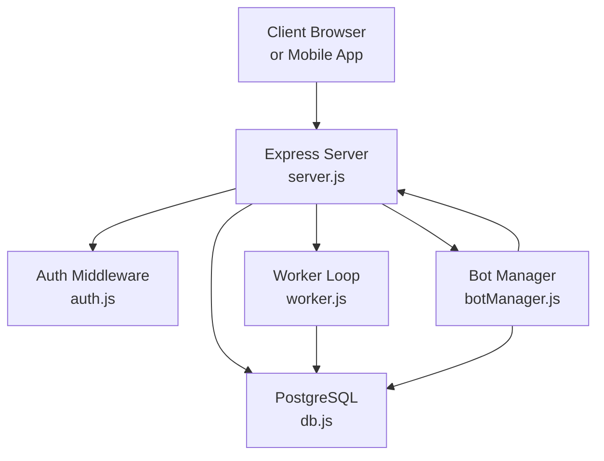
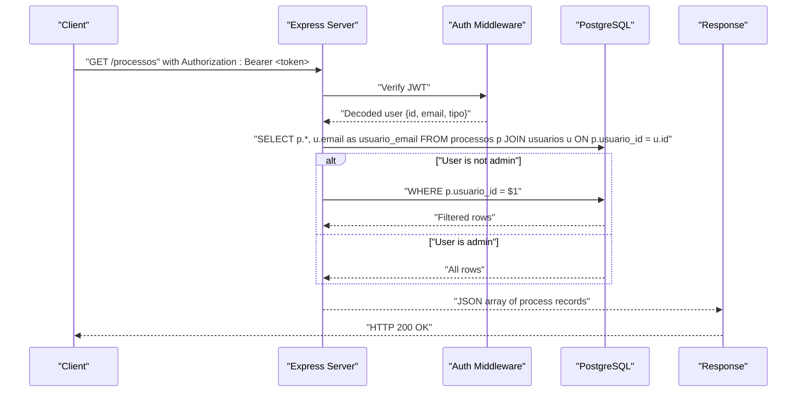
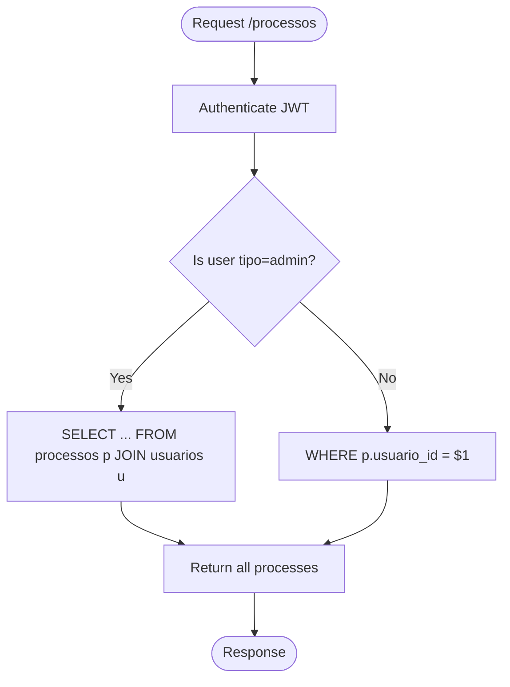
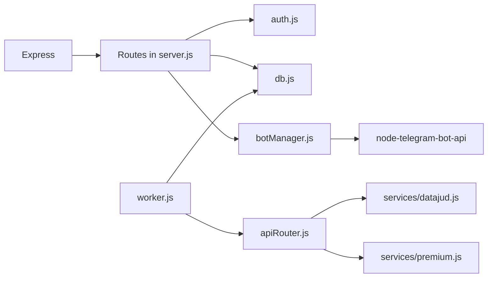
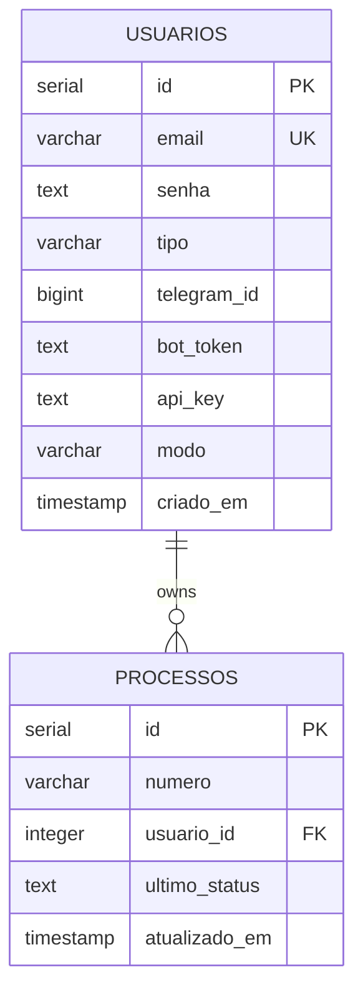

# Process Management Endpoints

<cite>
**Referenced Files in This Document**
- [server.js](file://server.js)
- [auth.js](file://auth.js)
- [db.js](file://db.js)
- [database.sql](file://database.sql)
- [apiRouter.js](file://apiRouter.js)
- [botManager.js](file://botManager.js)
- [worker.js](file://worker.js)
- [services/datajud.js](file://services/datajud.js)
- [services/premium.js](file://services/premium.js)
- [public/painel.js](file://public/painel.js)
- [public/app.js](file://public/app.js)
- [public/login.js](file://public/login.js)
- [package.json](file://package.json)
</cite>

## Table of Contents
1. [Introduction](#introduction)
2. [Project Structure](#project-structure)
3. [Core Components](#core-components)
4. [Architecture Overview](#architecture-overview)
5. [Detailed Component Analysis](#detailed-component-analysis)
6. [Dependency Analysis](#dependency-analysis)
7. [Performance Considerations](#performance-considerations)
8. [Troubleshooting Guide](#troubleshooting-guide)
9. [Conclusion](#conclusion)
10. [Appendices](#appendices)

## Introduction
This document provides comprehensive API documentation for the process management endpoints, focusing on the GET /processos endpoint used to list legal processes. It explains role-based access control (RBA), query parameters, filtering, response formatting, database query structure, and the integration with Telegram bot monitoring. It also covers performance considerations, pagination strategies, and practical frontend integration examples.

## Project Structure
The system is composed of:
- Express server exposing REST endpoints
- Authentication middleware and admin guard
- PostgreSQL database with users and processes tables
- Telegram bot integration for process monitoring
- Worker process that periodically checks for updates
- Frontend panels for clients and administrators

**Diagram sources**
- [server.js:94-110](file://server.js#L94-L110)
- [auth.js:17-39](file://auth.js#L17-L39)
- [db.js:1-11](file://db.js#L1-L11)
- [botManager.js:1-53](file://botManager.js#L1-L53)
- [worker.js:1-70](file://worker.js#L1-L70)

**Section sources**
- [server.js:1-162](file://server.js#L1-L162)
- [package.json:1-21](file://package.json#L1-L21)

## Core Components
- Authentication and Authorization:
  - JWT-based authentication with bearer tokens
  - Admin-only endpoints guarded by admin middleware
- Process Listing Endpoint:
  - GET /processos returns processes with user association
  - Role-based visibility: clients see only their own, admins see all
- Telegram Bot Integration:
  - Users can register Telegram bot credentials
  - Bots receive process numbers and respond with formatted data
  - Worker monitors statuses and notifies users via Telegram
- Data Services:
  - Free lookup via DataJud API
  - Premium fallback via external API integration point

Key implementation references:
- Authentication and RBAC: [auth.js:17-39](file://auth.js#L17-L39)
- Process listing endpoint: [server.js:94-110](file://server.js#L94-L110)
- Telegram bot registration and message handling: [botManager.js:7-42](file://botManager.js#L7-L42)
- Worker monitoring loop: [worker.js:17-67](file://worker.js#L17-L67)
- Data services: [services/datajud.js:3-29](file://services/datajud.js#L3-L29), [services/premium.js:1-12](file://services/premium.js#L1-L12)

**Section sources**
- [auth.js:17-39](file://auth.js#L17-L39)
- [server.js:94-110](file://server.js#L94-L110)
- [botManager.js:7-42](file://botManager.js#L7-L42)
- [worker.js:17-67](file://worker.js#L17-L67)
- [services/datajud.js:3-29](file://services/datajud.js#L3-L29)
- [services/premium.js:1-12](file://services/premium.js#L1-L12)

## Architecture Overview
The process listing endpoint orchestrates:
- Request authentication via JWT
- Role check to determine visibility scope
- Database query joining processes with users
- Response formatting with associated user email

**Diagram sources**
- [server.js:94-110](file://server.js#L94-L110)
- [auth.js:17-31](file://auth.js#L17-L31)
- [db.js:1-11](file://db.js#L1-L11)

## Detailed Component Analysis

### Endpoint Definition: GET /processos
- Purpose: List legal processes with user association and status information
- Authentication: Required (bearer token)
- Authorization:
  - Non-admin users: see only their own processes
  - Admin users: see all processes
- Query parameters: None
- Response format: Array of process objects with associated user email

Response schema outline:
- Process fields:
  - id: integer
  - numero: string
  - usuario_id: integer
  - ultimo_status: string
  - atualizado_em: timestamp
- Associated user field:
  - usuario_email: string

Implementation references:
- Endpoint definition and logic: [server.js:94-110](file://server.js#L94-L110)
- Database connection: [db.js:1-11](file://db.js#L1-L11)
- Database schema: [database.sql:18-24](file://database.sql#L18-L24)

Access control flow:

**Diagram sources**
- [server.js:94-110](file://server.js#L94-L110)
- [auth.js:17-31](file://auth.js#L17-L31)

**Section sources**
- [server.js:94-110](file://server.js#L94-L110)
- [auth.js:17-39](file://auth.js#L17-L39)
- [db.js:1-11](file://db.js#L1-L11)
- [database.sql:18-24](file://database.sql#L18-L24)

### Database Query Structure and JOIN Operations
- Base query joins processos and usuarios tables on usuario_id
- Admins receive all rows; non-admins are filtered by usuario_id
- Response includes usuario_email as a derived field

References:
- Query construction and execution: [server.js:97-105](file://server.js#L97-L105)
- Table schema: [database.sql:5-24](file://database.sql#L5-L24)

**Section sources**
- [server.js:97-105](file://server.js#L97-L105)
- [database.sql:5-24](file://database.sql#L5-L24)

### Telegram Bot Integration and Monitoring
- Registration:
  - Users can register Telegram ID and bot token during auth/registro or /usuario
  - Bots are initialized and cached for reuse
- Message handling:
  - On receiving a process number, the bot consults process data and persists it
  - Sends a formatted message with tribunal, class, and last update
- Monitoring:
  - Worker periodically checks all processes and compares last status
  - Notifies users via Telegram when status changes

References:
- Bot initialization and caching: [botManager.js:7-42](file://botManager.js#L7-L42)
- Worker loop and notifications: [worker.js:17-67](file://worker.js#L17-L67)
- Process lookup fallback: [apiRouter.js:4-16](file://apiRouter.js#L4-L16)
- DataJud service: [services/datajud.js:3-29](file://services/datajud.js#L3-L29)
- Premium service placeholder: [services/premium.js:1-12](file://services/premium.js#L1-L12)

**Section sources**
- [botManager.js:7-42](file://botManager.js#L7-L42)
- [worker.js:17-67](file://worker.js#L17-L67)
- [apiRouter.js:4-16](file://apiRouter.js#L4-L16)
- [services/datajud.js:3-29](file://services/datajud.js#L3-L29)
- [services/premium.js:1-12](file://services/premium.js#L1-L12)

### Frontend Integration Examples
- Web panel (client/admin):
  - Fetches /processos with Authorization header
  - Displays process number, last status, and last updated timestamp
  - Admins also see usuario_email column
- Mobile/web apps:
  - Use the same GET /processos endpoint with bearer token
  - Polling interval can be adjusted client-side

References:
- Panel fetching and rendering: [public/painel.js:37-62](file://public/painel.js#L37-L62)
- Admin user listing (for context): [server.js:112-122](file://server.js#L112-L122)
- Public app listing (no auth): [public/app.js:29-52](file://public/app.js#L29-L52)

**Section sources**
- [public/painel.js:37-62](file://public/painel.js#L37-L62)
- [server.js:112-122](file://server.js#L112-L122)
- [public/app.js:29-52](file://public/app.js#L29-L52)

## Dependency Analysis
External dependencies and their roles:
- Express: HTTP server and routing
- pg: PostgreSQL client
- jsonwebtoken: JWT signing and verification
- bcryptjs: Password hashing
- axios: HTTP client for DataJud API
- node-telegram-bot-api: Telegram bot integration

**Diagram sources**
- [server.js:1-162](file://server.js#L1-L162)
- [auth.js:1-59](file://auth.js#L1-L59)
- [db.js:1-11](file://db.js#L1-L11)
- [botManager.js:1-53](file://botManager.js#L1-L53)
- [worker.js:1-70](file://worker.js#L1-L70)
- [apiRouter.js:1-19](file://apiRouter.js#L1-L19)
- [services/datajud.js:1-32](file://services/datajud.js#L1-L32)
- [services/premium.js:1-12](file://services/premium.js#L1-L12)
- [package.json:11-19](file://package.json#L11-L19)

**Section sources**
- [package.json:11-19](file://package.json#L11-L19)
- [server.js:1-162](file://server.js#L1-L162)

## Performance Considerations
- Current state:
  - GET /processos performs a JOIN without explicit pagination
  - Worker loop scans all processes every 5 minutes
- Recommendations:
  - Pagination:
    - Add limit and offset query parameters to GET /processos
    - Example: GET /processos?limit=50&offset=0
  - Indexing:
    - Ensure usuario_id is indexed on processos table for filtering
    - Ensure id is indexed on usuarios table for JOIN
  - Caching:
    - Cache frequently accessed user records in worker to reduce repeated queries
  - Monitoring:
    - Track query duration and error rates
    - Consider rate limiting for Telegram notifications
- Data volume:
  - For large datasets, implement server-side pagination and cursor-based pagination
  - Consider partitioning processos by date or user_id if growth continues

[No sources needed since this section provides general guidance]

## Troubleshooting Guide
Common issues and resolutions:
- Authentication failures:
  - Ensure Authorization header includes Bearer token
  - Verify token validity and expiration
- Access denied:
  - Admin-only endpoints require tipo=admin
- Empty or unexpected results:
  - Confirm user type and ownership of processes
  - Check database entries for usuario_id and numero
- Telegram notifications not received:
  - Verify bot_token and telegram_id are set
  - Ensure worker is running and has access to database
- API fallback behavior:
  - Free mode uses DataJud; paid mode requires api_key and mode configuration

References:
- Auth middleware and admin guard: [auth.js:17-39](file://auth.js#L17-L39)
- Process listing logic: [server.js:94-110](file://server.js#L94-L110)
- Bot initialization and persistence: [botManager.js:7-42](file://botManager.js#L7-L42)
- Worker loop and updates: [worker.js:17-67](file://worker.js#L17-L67)

**Section sources**
- [auth.js:17-39](file://auth.js#L17-L39)
- [server.js:94-110](file://server.js#L94-L110)
- [botManager.js:7-42](file://botManager.js#L7-L42)
- [worker.js:17-67](file://worker.js#L17-L67)

## Conclusion
The GET /processos endpoint provides a clear, role-aware view of legal processes. With JWT-based authentication and admin guards, it ensures appropriate data visibility. The Telegram bot integration enables real-time monitoring and notifications, while the worker loop maintains status updates. For production deployments, implement pagination, indexing, and caching to scale effectively.

[No sources needed since this section summarizes without analyzing specific files]

## Appendices

### API Reference: GET /processos
- Method: GET
- Path: /processos
- Authentication: Required (Bearer token)
- Authorization: Non-admins see only their processes; admins see all
- Query parameters: None
- Response: Array of process objects with usuario_email included

Example request:
- Headers: Authorization: Bearer <token>

Example response (schema):
- Array of objects with keys:
  - id: integer
  - numero: string
  - usuario_id: integer
  - ultimo_status: string
  - atualizado_em: timestamp
  - usuario_email: string

References:
- Endpoint definition: [server.js:94-110](file://server.js#L94-L110)
- Response rendering: [public/painel.js:37-62](file://public/painel.js#L37-L62)

**Section sources**
- [server.js:94-110](file://server.js#L94-L110)
- [public/painel.js:37-62](file://public/painel.js#L37-L62)

### Database Schema
Tables and relationships:
- usuarios: stores user credentials, roles, Telegram settings, and API modes
- processos: stores process numbers, user associations, last status, and timestamps

**Diagram sources**
- [database.sql:5-24](file://database.sql#L5-L24)

**Section sources**
- [database.sql:5-24](file://database.sql#L5-L24)

### Frontend Integration Notes
- Client-side polling:
  - Use Authorization header with bearer token
  - Periodic refresh (e.g., every 5 seconds) for near-real-time updates
- Admin panel:
  - Displays usuario_email when available
  - Provides administrative controls for user management

References:
- Panel fetch and render: [public/painel.js:37-62](file://public/painel.js#L37-L62)
- Public app listing: [public/app.js:29-52](file://public/app.js#L29-L52)

**Section sources**
- [public/painel.js:37-62](file://public/painel.js#L37-L62)
- [public/app.js:29-52](file://public/app.js#L29-L52)