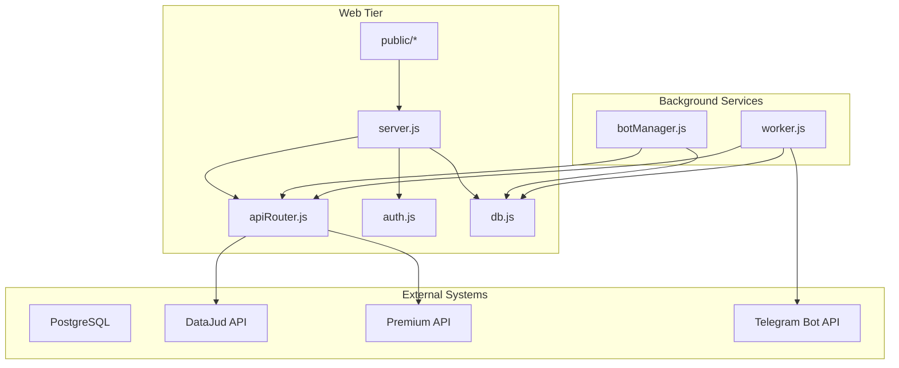
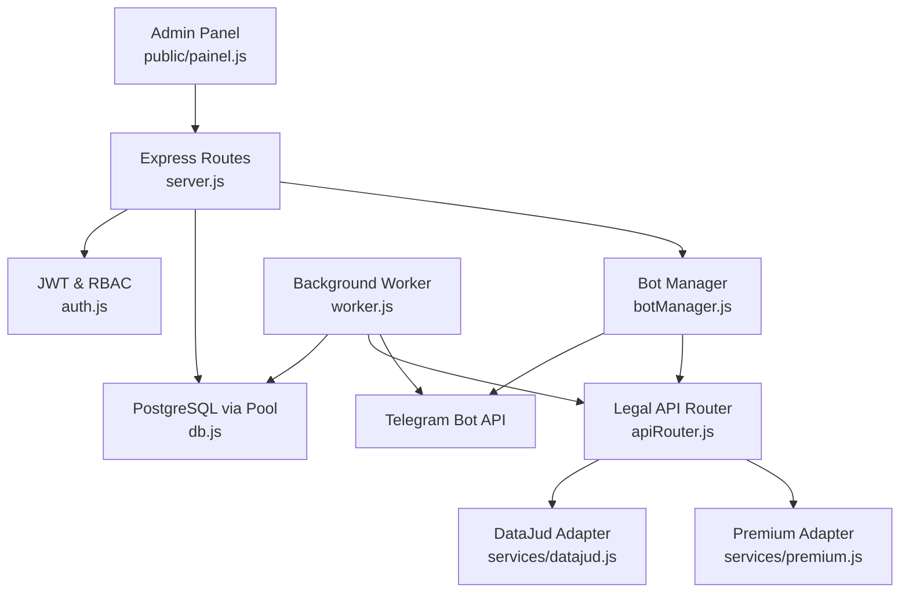
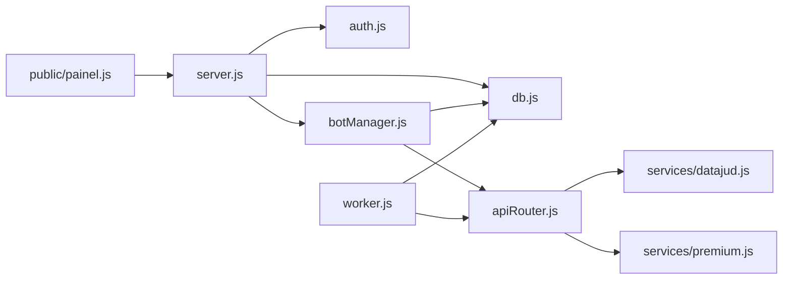
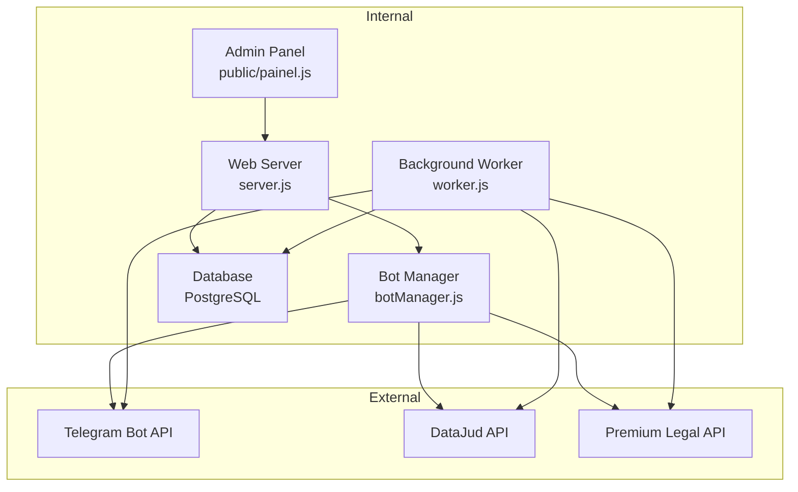
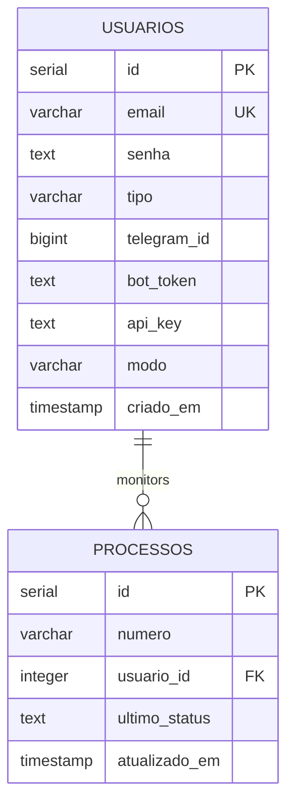
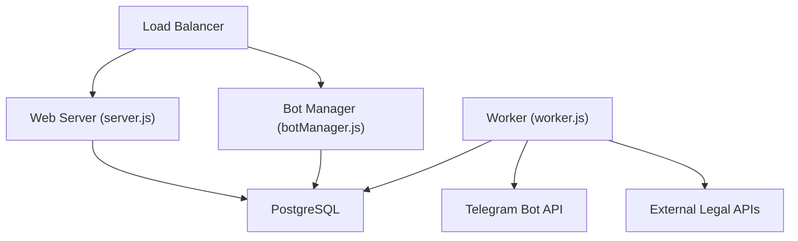

# Architecture Overview

<cite>
**Referenced Files in This Document**
- [server.js](file://server.js)
- [worker.js](file://worker.js)
- [botManager.js](file://botManager.js)
- [apiRouter.js](file://apiRouter.js)
- [db.js](file://db.js)
- [auth.js](file://auth.js)
- [services/datajud.js](file://services/datajud.js)
- [services/premium.js](file://services/premium.js)
- [database.sql](file://database.sql)
- [public/painel.js](file://public/painel.js)
- [public/app.js](file://public/app.js)
- [package.json](file://package.json)
- [README.md](file://README.md)
</cite>

## Table of Contents
1. [Introduction](#introduction)
2. [Project Structure](#project-structure)
3. [Core Components](#core-components)
4. [Architecture Overview](#architecture-overview)
5. [Detailed Component Analysis](#detailed-component-analysis)
6. [Dependency Analysis](#dependency-analysis)
7. [Performance Considerations](#performance-considerations)
8. [Troubleshooting Guide](#troubleshooting-guide)
9. [Conclusion](#conclusion)
10. [Appendices](#appendices)

## Introduction
This document describes the architecture of the Legal Process Monitoring System, a modular monolith with microservice characteristics. It integrates a web server, background workers, Telegram bots, and external legal APIs to provide multi-user monitoring of Brazilian judicial processes. The system follows patterns such as Model-View-Controller (MVC) for the web tier, Observer-like polling for monitoring, and Factory-like initialization for bot creation. It uses Express.js for the web framework, PostgreSQL for persistence, and Telegram bot integration for user interaction.

## Project Structure
The system is organized around a central server with complementary worker processes and a small admin panel. The backend is split into:
- Web server and API routes
- Authentication middleware and utilities
- Telegram bot orchestration
- Background monitoring worker
- Database abstraction and connection pooling
- External legal API adapters
- Frontend admin panel and client pages

**Diagram sources**
- [server.js:1-162](file://server.js#L1-L162)
- [apiRouter.js:1-19](file://apiRouter.js#L1-L19)
- [auth.js:1-59](file://auth.js#L1-L59)
- [db.js:1-11](file://db.js#L1-L11)
- [botManager.js:1-53](file://botManager.js#L1-L53)
- [worker.js:1-70](file://worker.js#L1-L70)
- [services/datajud.js:1-32](file://services/datajud.js#L1-L32)
- [services/premium.js:1-12](file://services/premium.js#L1-L12)

**Section sources**
- [README.md:1-56](file://README.md#L1-L56)
- [package.json:1-21](file://package.json#L1-L21)

## Core Components
- Web Server and API: Exposes REST endpoints for user registration, login, process listing, and administrative operations. It initializes the Telegram bots on startup and serves static assets for the admin panel.
- Authentication and Authorization: Implements JWT-based authentication and role-based access control (admin-only endpoints).
- Telegram Bot Orchestration: Manages bot instances keyed by token, handles incoming messages, and persists monitored processes.
- Background Worker: Periodically polls the database for monitored processes, queries external APIs, and notifies users via Telegram.
- Database Abstraction: Provides a PostgreSQL connection pool configured via environment variables.
- External Legal API Adapters: Free (DataJud) and paid (Premium) adapters with a unified router.
- Admin Panel: Lightweight SPA that communicates with the server using bearer tokens.

**Section sources**
- [server.js:1-162](file://server.js#L1-L162)
- [auth.js:1-59](file://auth.js#L1-L59)
- [botManager.js:1-53](file://botManager.js#L1-L53)
- [worker.js:1-70](file://worker.js#L1-L70)
- [db.js:1-11](file://db.js#L1-L11)
- [apiRouter.js:1-19](file://apiRouter.js#L1-L19)
- [services/datajud.js:1-32](file://services/datajud.js#L1-L32)
- [services/premium.js:1-12](file://services/premium.js#L1-L12)
- [public/painel.js:1-158](file://public/painel.js#L1-L158)

## Architecture Overview
The system is a modular monolith with clear separation of concerns:
- Web tier (Express) handles HTTP requests and serves the admin panel.
- Background worker performs long-running tasks independently of the web server.
- Telegram bots are managed centrally and react to user messages.
- Database layer abstracts PostgreSQL with connection pooling.
- External APIs are encapsulated behind a simple router.

**Diagram sources**
- [server.js:1-162](file://server.js#L1-L162)
- [auth.js:1-59](file://auth.js#L1-L59)
- [db.js:1-11](file://db.js#L1-L11)
- [botManager.js:1-53](file://botManager.js#L1-L53)
- [worker.js:1-70](file://worker.js#L1-L70)
- [apiRouter.js:1-19](file://apiRouter.js#L1-L19)
- [services/datajud.js:1-32](file://services/datajud.js#L1-L32)
- [services/premium.js:1-12](file://services/premium.js#L1-L12)
- [public/painel.js:1-158](file://public/painel.js#L1-L158)

## Detailed Component Analysis

### Web Server and API (server.js)
- Initializes Express, JSON parsing, and static serving for the admin panel.
- Authentication endpoints: registration, login, and profile retrieval.
- Administrative endpoints: create user and list users.
- Process listing with role-aware filtering.
- On startup, loads existing Telegram bots and ensures a default admin account exists.

Key interactions:
- Uses the database pool for all persistence operations.
- Invokes bot manager to initialize bots during startup.
- Applies authentication and authorization middleware on protected routes.

**Section sources**
- [server.js:1-162](file://server.js#L1-L162)

### Authentication and Authorization (auth.js)
- JWT signing and verification for session tokens.
- Password hashing and verification using bcrypt.
- Middleware to enforce bearer token presence and validity.
- Middleware to restrict endpoints to administrators.

Patterns:
- JWT-based stateless authentication.
- Role-based access control (RBAC) enforcement.

**Section sources**
- [auth.js:1-59](file://auth.js#L1-L59)

### Telegram Bot Orchestration (botManager.js)
- Central registry of Telegram bots keyed by token.
- Message handler extracts process numbers from Telegram messages.
- Validates user credentials and queries external APIs.
- Inserts monitored processes into the database and responds to users.

Patterns:
- Factory-like initialization of Telegram bot instances.
- Observer-like message handling reacting to user input.

**Section sources**
- [botManager.js:1-53](file://botManager.js#L1-L53)

### Background Worker (worker.js)
- Periodic polling loop (every 5 minutes) to check for process updates.
- Groups processes by user to minimize repeated queries.
- Queries external APIs and compares last known status with current status.
- Updates database and sends Telegram notifications when changes occur.
- Maintains a cache of Telegram bot instances to avoid recreation.

Patterns:
- Observer-like periodic monitoring.
- Factory-like caching of bot instances.

**Section sources**
- [worker.js:1-70](file://worker.js#L1-L70)

### Database Abstraction (db.js)
- Creates a PostgreSQL connection pool using environment variables.
- Used by all components for database operations.

**Section sources**
- [db.js:1-11](file://db.js#L1-L11)

### External Legal API Router (apiRouter.js)
- Unified interface to external legal APIs.
- Attempts free DataJud API first, then falls back to paid Premium API when configured.

**Section sources**
- [apiRouter.js:1-19](file://apiRouter.js#L1-L19)

### DataJud Adapter (services/datajud.js)
- Calls the CNJ DataJud public API to retrieve process metadata.
- Parses response and normalizes to a common shape.

**Section sources**
- [services/datajud.js:1-32](file://services/datajud.js#L1-L32)

### Premium Adapter (services/premium.js)
- Placeholder for premium legal API integration.
- Returns normalized data for demonstration.

**Section sources**
- [services/premium.js:1-12](file://services/premium.js#L1-L12)

### Admin Panel (public/painel.js)
- SPA that authenticates via JWT and interacts with server endpoints.
- Supports admin-only sections for user management.
- Fetches and displays monitored processes with periodic refresh.

**Section sources**
- [public/painel.js:1-158](file://public/painel.js#L1-L158)

### Public Client Page (public/app.js)
- Minimal client page for quick process listing and periodic refresh.

**Section sources**
- [public/app.js:1-53](file://public/app.js#L1-L53)

## Dependency Analysis
The system exhibits low coupling and high cohesion:
- server.js depends on auth.js, botManager.js, and db.js.
- botManager.js depends on apiRouter.js and db.js.
- worker.js depends on apiRouter.js, db.js, and Telegram SDK.
- apiRouter.js depends on service adapters.
- All components depend on db.js for persistence.

**Diagram sources**
- [server.js:1-162](file://server.js#L1-L162)
- [auth.js:1-59](file://auth.js#L1-L59)
- [db.js:1-11](file://db.js#L1-L11)
- [botManager.js:1-53](file://botManager.js#L1-L53)
- [worker.js:1-70](file://worker.js#L1-L70)
- [apiRouter.js:1-19](file://apiRouter.js#L1-L19)
- [services/datajud.js:1-32](file://services/datajud.js#L1-L32)
- [services/premium.js:1-12](file://services/premium.js#L1-L12)
- [public/painel.js:1-158](file://public/painel.js#L1-L158)

**Section sources**
- [package.json:1-21](file://package.json#L1-L21)

## Performance Considerations
- Connection pooling: The PostgreSQL pool in db.js manages concurrent connections efficiently. Ensure pool size aligns with expected load and external API rate limits.
- Polling intervals: worker.js checks every 5 minutes. Adjust interval based on SLAs and Telegram API constraints.
- Caching: worker.js caches user and bot instances to reduce repeated lookups and bot instantiation overhead.
- Pagination and filtering: server.js endpoints filter data by user or admin roles to limit payload sizes.
- External API throttling: apiRouter.js prioritizes free DataJud first; consider adding exponential backoff and circuit breaker patterns for Premium API.

[No sources needed since this section provides general guidance]

## Troubleshooting Guide
Common issues and resolutions:
- Authentication failures: Verify JWT secret and token format. Ensure clients send Authorization: Bearer <token>.
- Database connectivity: Confirm DB_HOST, DB_USER, DB_PASSWORD, DB_NAME, DB_PORT are set and reachable.
- Telegram bot errors: Validate bot_token and telegram_id; ensure polling is enabled and network allows Telegram outbound.
- External API errors: Check DataJud availability and Premium API key validity; implement retry logic and circuit breaker.
- Admin setup: Default admin is created if missing; verify environment variables and initial run logs.

**Section sources**
- [auth.js:17-31](file://auth.js#L17-L31)
- [db.js:4-10](file://db.js#L4-L10)
- [worker.js:9-15](file://worker.js#L9-L15)
- [apiRouter.js:4-16](file://apiRouter.js#L4-L16)
- [server.js:143-159](file://server.js#L143-L159)

## Conclusion
The Legal Process Monitoring System is a well-structured modular monolith that cleanly separates concerns across web, background, and external integration layers. It leverages proven technologies (Express, PostgreSQL, Telegram SDK, Axios) and patterns (MVC, Observer, Factory) to deliver a scalable and maintainable solution. The architecture supports future enhancements such as horizontal scaling of workers, improved API resilience, and expanded legal API integrations.

[No sources needed since this section summarizes without analyzing specific files]

## Appendices

### System Context Diagram
High-level view of system boundaries and interactions.

[No sources needed since this diagram shows conceptual workflow, not actual code structure]

### Data Model
Core entities and relationships.

**Diagram sources**
- [database.sql:5-24](file://database.sql#L5-L24)

### Deployment Topology
- Single server hosting the web server and bot manager.
- Dedicated worker process for background monitoring.
- PostgreSQL instance (local or remote).
- Optional reverse proxy and load balancer for production.

[No sources needed since this diagram shows conceptual workflow, not actual code structure]