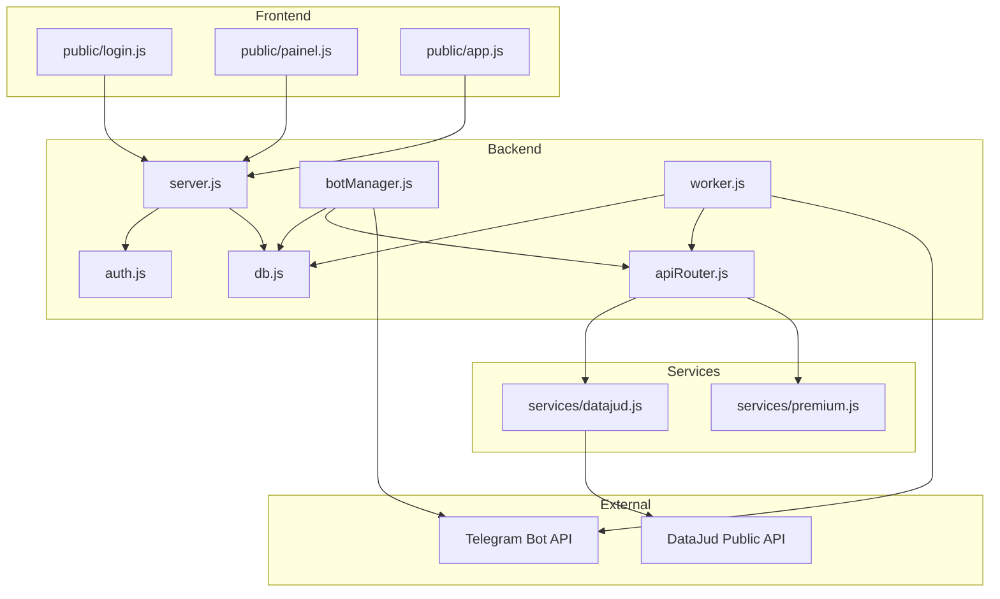
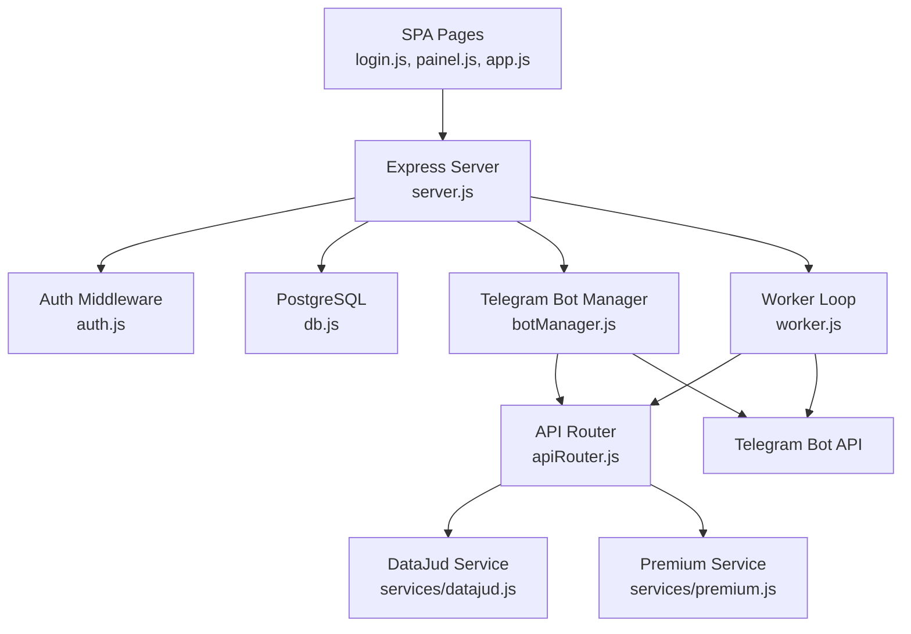
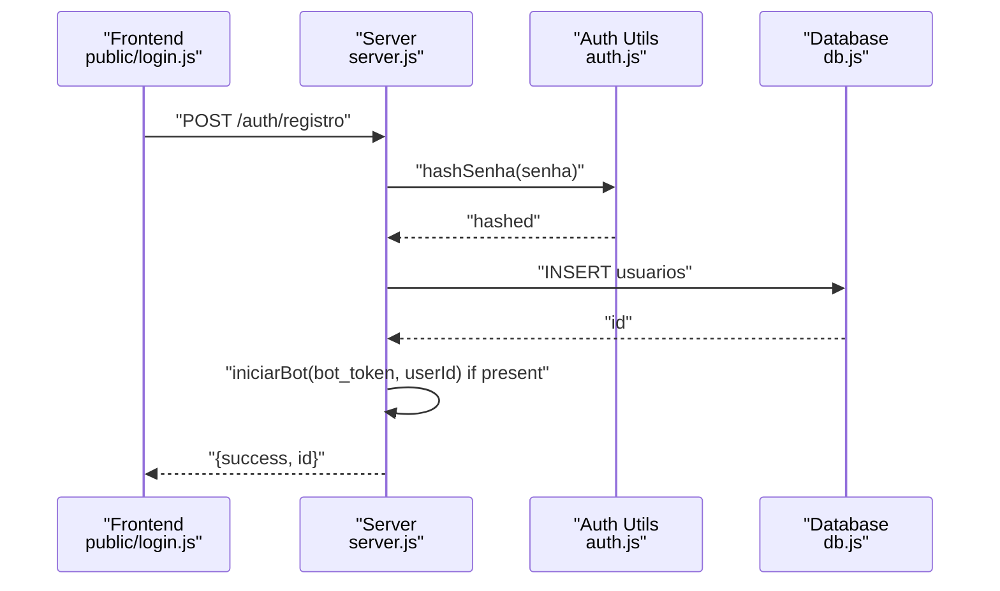
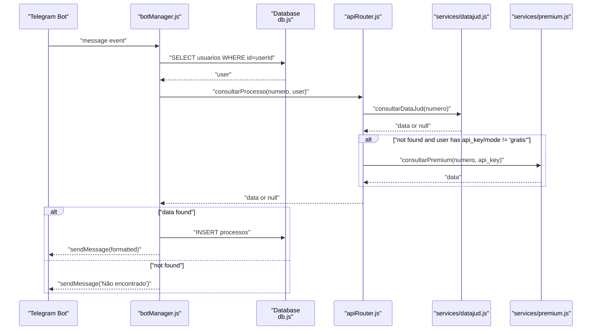
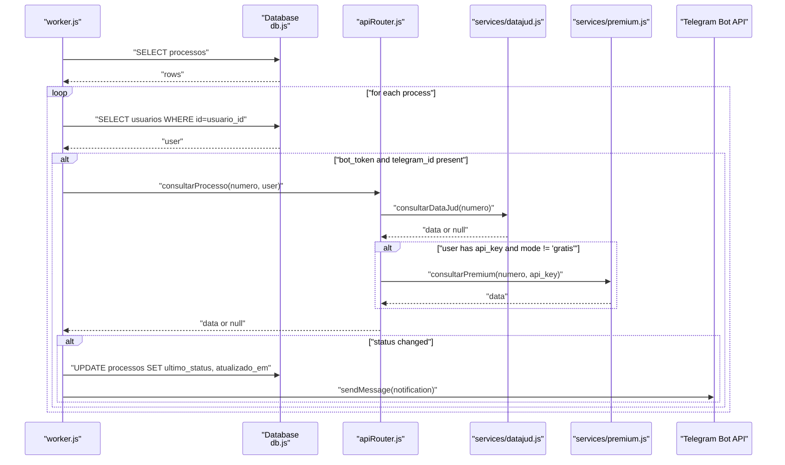
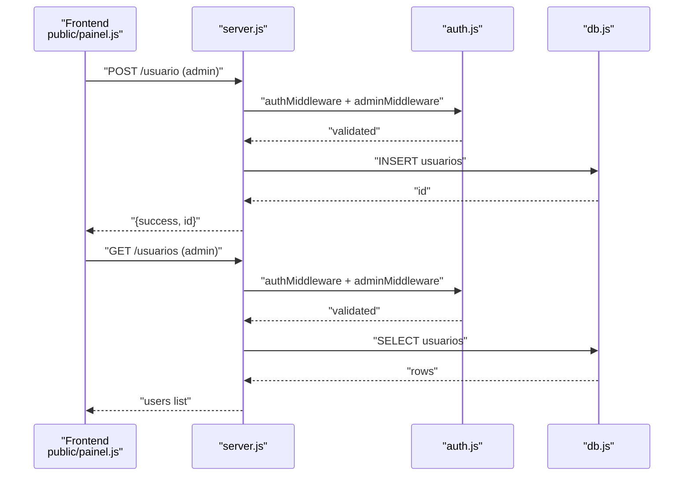
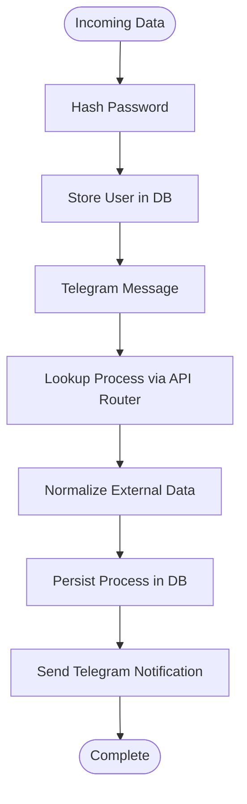
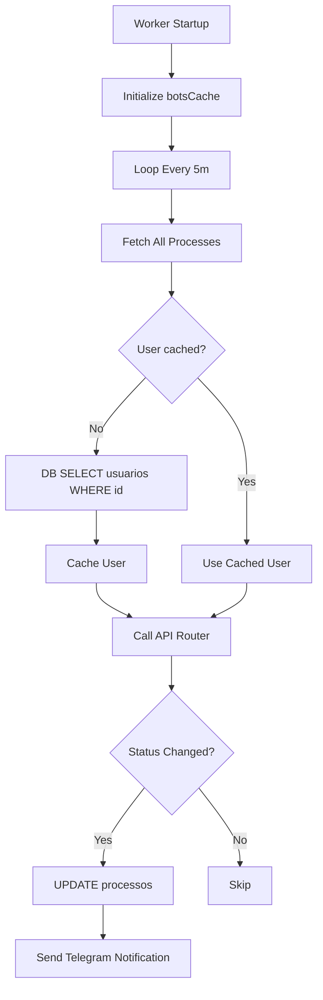
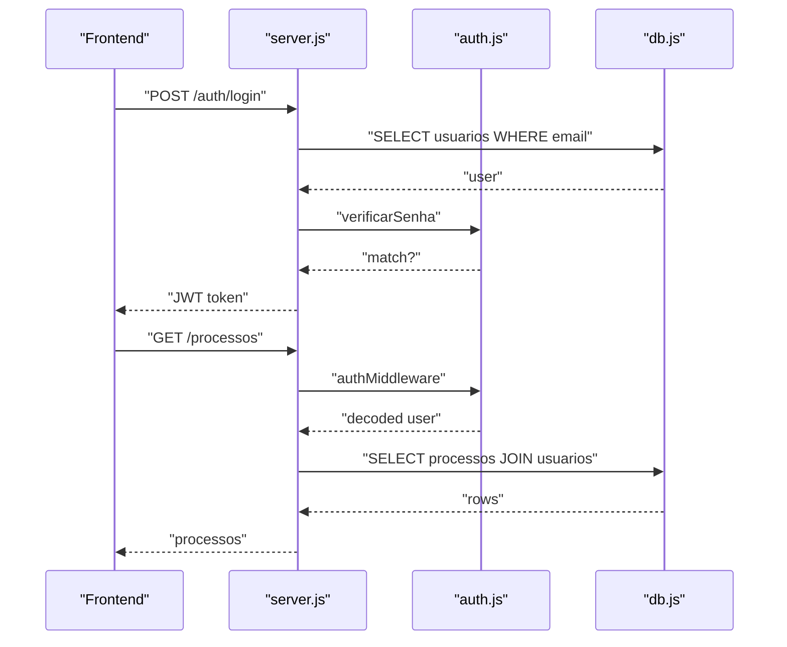
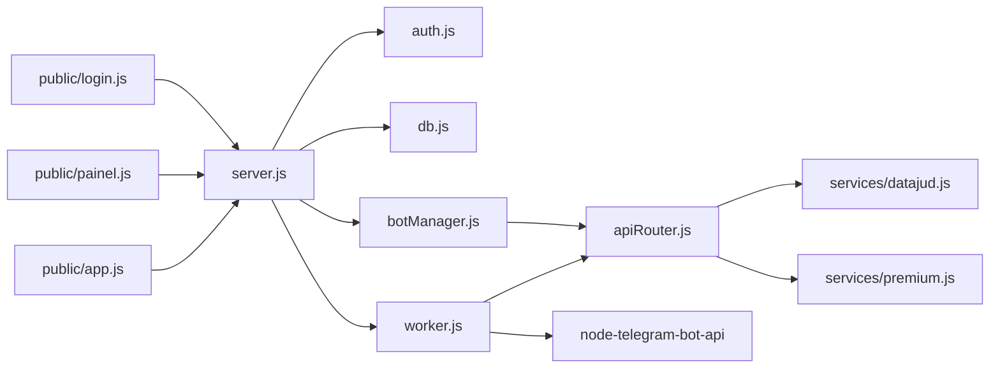

# Data Flow and Processing

<cite>
**Referenced Files in This Document**
- [server.js](file://server.js)
- [botManager.js](file://botManager.js)
- [apiRouter.js](file://apiRouter.js)
- [db.js](file://db.js)
- [worker.js](file://worker.js)
- [services/datajud.js](file://services/datajud.js)
- [services/premium.js](file://services/premium.js)
- [auth.js](file://auth.js)
- [database.sql](file://database.sql)
- [public/app.js](file://public/app.js)
- [public/painel.js](file://public/painel.js)
- [public/login.js](file://public/login.js)
- [package.json](file://package.json)
</cite>

## Table of Contents
1. [Introduction](#introduction)
2. [Project Structure](#project-structure)
3. [Core Components](#core-components)
4. [Architecture Overview](#architecture-overview)
5. [Detailed Component Analysis](#detailed-component-analysis)
6. [Dependency Analysis](#dependency-analysis)
7. [Performance Considerations](#performance-considerations)
8. [Troubleshooting Guide](#troubleshooting-guide)
9. [Conclusion](#conclusion)

## Introduction
This document describes the data flow architecture of the Legal Process Monitoring System. It traces how data moves through the system from Telegram message reception to bot processing, API service calls, database updates, and notification delivery. It covers user registration flows, process monitoring workflows, and administrative operations, including request-response cycles, data transformation stages, caching mechanisms, and asynchronous processing patterns. Sequence diagrams illustrate typical user interactions, error propagation paths, and data consistency measures.

## Project Structure
The system consists of:
- Backend API server exposing REST endpoints for authentication, user management, and process listing
- Telegram bot manager that listens for messages and triggers process lookup
- Worker process that periodically checks for updates and sends notifications
- Services that integrate with external APIs (free and premium tiers)
- PostgreSQL database storing users and monitored processes
- Frontend SPA pages for login, registration, and dashboard

**Diagram sources**
- [server.js:1-162](file://server.js#L1-L162)
- [botManager.js:1-53](file://botManager.js#L1-L53)
- [apiRouter.js:1-19](file://apiRouter.js#L1-L19)
- [worker.js:1-70](file://worker.js#L1-L70)
- [services/datajud.js:1-32](file://services/datajud.js#L1-L32)
- [services/premium.js:1-12](file://services/premium.js#L1-L12)
- [auth.js:1-59](file://auth.js#L1-L59)
- [db.js:1-11](file://db.js#L1-L11)

**Section sources**
- [server.js:1-162](file://server.js#L1-L162)
- [botManager.js:1-53](file://botManager.js#L1-L53)
- [apiRouter.js:1-19](file://apiRouter.js#L1-L19)
- [worker.js:1-70](file://worker.js#L1-L70)
- [services/datajud.js:1-32](file://services/datajud.js#L1-L32)
- [services/premium.js:1-12](file://services/premium.js#L1-L12)
- [auth.js:1-59](file://auth.js#L1-L59)
- [db.js:1-11](file://db.js#L1-L11)
- [database.sql:1-25](file://database.sql#L1-L25)

## Core Components
- Authentication and Authorization: JWT-based middleware validates tokens and enforces admin-only routes. Password hashing and verification are handled securely.
- API Server: Exposes endpoints for user registration, login, admin user creation, process listing, user listing, and profile retrieval.
- Telegram Bot Manager: Polls Telegram for incoming messages, resolves user context from the database, queries process data, persists new processes, and responds to users.
- Worker: Periodically polls all monitored processes, compares last known status with fresh data, updates records, and notifies users via Telegram.
- External Services: Free tier queries a public CNJ API; premium tier uses a configurable API key and mode flag.
- Database: Stores users and monitored processes with foreign key relationships and timestamps.

**Section sources**
- [auth.js:1-59](file://auth.js#L1-L59)
- [server.js:11-135](file://server.js#L11-L135)
- [botManager.js:7-42](file://botManager.js#L7-L42)
- [worker.js:17-61](file://worker.js#L17-L61)
- [apiRouter.js:4-16](file://apiRouter.js#L4-L16)
- [services/datajud.js:3-29](file://services/datajud.js#L3-L29)
- [services/premium.js:1-12](file://services/premium.js#L1-L12)
- [db.js:1-11](file://db.js#L1-L11)
- [database.sql:5-24](file://database.sql#L5-L24)

## Architecture Overview
The system follows a layered architecture:
- Presentation Layer: HTML/JavaScript SPA handles user login, registration, and dashboard interactions.
- Application Layer: Express server with route handlers and middleware.
- Domain Layer: Business logic for authentication, process monitoring, and administrative operations.
- Integration Layer: External API calls for free and premium data sources.
- Persistence Layer: PostgreSQL database with two primary tables.

**Diagram sources**
- [server.js:1-162](file://server.js#L1-L162)
- [auth.js:1-59](file://auth.js#L1-L59)
- [db.js:1-11](file://db.js#L1-L11)
- [botManager.js:1-53](file://botManager.js#L1-L53)
- [worker.js:1-70](file://worker.js#L1-L70)
- [apiRouter.js:1-19](file://apiRouter.js#L1-L19)
- [services/datajud.js:1-32](file://services/datajud.js#L1-L32)
- [services/premium.js:1-12](file://services/premium.js#L1-L12)

## Detailed Component Analysis

### User Registration Data Flow
End-to-end flow for user registration and bot initialization:
1. Frontend submits registration form with credentials and Telegram/bot configuration.
2. Server hashes the password and inserts a new user record.
3. If a bot token is provided, the server initializes a Telegram bot instance for the user.
4. The server responds with success and user ID.

**Diagram sources**
- [public/login.js:48-90](file://public/login.js#L48-L90)
- [server.js:12-36](file://server.js#L12-L36)
- [auth.js:41-44](file://auth.js#L41-L44)
- [db.js:1-11](file://db.js#L1-L11)

**Section sources**
- [public/login.js:48-90](file://public/login.js#L48-L90)
- [server.js:12-36](file://server.js#L12-L36)
- [auth.js:41-44](file://auth.js#L41-L44)
- [db.js:1-11](file://db.js#L1-L11)

### Telegram Message Reception and Process Lookup
When a user sends a process number to the Telegram bot:
1. The bot receives a message and extracts the number.
2. It retrieves the user context from the database.
3. It queries the process data via the API router (free tier first, then premium if configured).
4. If found, it persists the process and replies with formatted details.

**Diagram sources**
- [botManager.js:13-39](file://botManager.js#L13-L39)
- [db.js:1-11](file://db.js#L1-L11)
- [apiRouter.js:4-16](file://apiRouter.js#L4-L16)
- [services/datajud.js:3-29](file://services/datajud.js#L3-L29)
- [services/premium.js:1-12](file://services/premium.js#L1-L12)

**Section sources**
- [botManager.js:13-39](file://botManager.js#L13-L39)
- [apiRouter.js:4-16](file://apiRouter.js#L4-L16)
- [services/datajud.js:3-29](file://services/datajud.js#L3-L29)
- [services/premium.js:1-12](file://services/premium.js#L1-L12)

### Worker Loop: Asynchronous Monitoring and Notifications
The worker runs periodically to check for process updates:
1. Fetches all monitored processes.
2. Groups by user to minimize repeated queries and caches user records.
3. For each process, retrieves the associated user and verifies Telegram configuration.
4. Queries the latest status via the API router.
5. If status changed, updates the database and sends a Telegram notification.

**Diagram sources**
- [worker.js:17-61](file://worker.js#L17-L61)
- [db.js:1-11](file://db.js#L1-L11)
- [apiRouter.js:4-16](file://apiRouter.js#L4-L16)
- [services/datajud.js:3-29](file://services/datajud.js#L3-L29)
- [services/premium.js:1-12](file://services/premium.js#L1-L12)

**Section sources**
- [worker.js:17-61](file://worker.js#L17-L61)
- [apiRouter.js:4-16](file://apiRouter.js#L4-L16)
- [services/datajud.js:3-29](file://services/datajud.js#L3-L29)
- [services/premium.js:1-12](file://services/premium.js#L1-L12)

### Administrative Operations
Administrative users can create other users and list all users/processes:
- Create user endpoint requires both authentication and admin privileges.
- User listing endpoint returns all users with metadata.
- Process listing respects role-based visibility (users see only their own, admins see all).

**Diagram sources**
- [public/painel.js:110-146](file://public/painel.js#L110-L146)
- [server.js:70-92](file://server.js#L70-L92)
- [auth.js:16-39](file://auth.js#L16-L39)
- [db.js:1-11](file://db.js#L1-L11)

**Section sources**
- [public/painel.js:110-146](file://public/painel.js#L110-L146)
- [server.js:70-92](file://server.js#L70-L92)
- [auth.js:16-39](file://auth.js#L16-L39)
- [db.js:1-11](file://db.js#L1-L11)

### Data Transformation Stages
- Authentication: Passwords are hashed before storage; JWT tokens encode user identity and type.
- Process lookup: External API responses are normalized into a unified shape with number, court, class, and last update timestamp.
- Telegram notifications: Process details are formatted into human-readable messages.

**Diagram sources**
- [auth.js:41-49](file://auth.js#L41-L49)
- [services/datajud.js:19-24](file://services/datajud.js#L19-L24)
- [botManager.js:31-38](file://botManager.js#L31-L38)

**Section sources**
- [auth.js:41-49](file://auth.js#L41-L49)
- [services/datajud.js:19-24](file://services/datajud.js#L19-L24)
- [botManager.js:31-38](file://botManager.js#L31-L38)

### Caching Mechanisms
- Worker cache of Telegram bot instances avoids recreating clients.
- Worker caches user records per user_id to reduce repeated database queries.
- Bot manager caches active bot instances keyed by token.

**Diagram sources**
- [worker.js:6-15](file://worker.js#L6-L15)
- [worker.js:22-34](file://worker.js#L22-L34)
- [botManager.js:5-42](file://botManager.js#L5-L42)

**Section sources**
- [worker.js:6-15](file://worker.js#L6-L15)
- [worker.js:22-34](file://worker.js#L22-L34)
- [botManager.js:5-42](file://botManager.js#L5-L42)

### Request-Response Cycles
- Login: Frontend posts credentials; server verifies and returns JWT.
- Registration: Frontend posts registration payload; server hashes password and creates user.
- Dashboard: Frontend lists processes; server returns filtered rows based on role.
- Admin operations: Frontend posts to create users; server validates permissions and persists.

**Diagram sources**
- [public/login.js:18-46](file://public/login.js#L18-L46)
- [server.js:38-68](file://server.js#L38-L68)
- [server.js:94-110](file://server.js#L94-L110)
- [auth.js:16-31](file://auth.js#L16-L31)
- [db.js:1-11](file://db.js#L1-L11)

**Section sources**
- [public/login.js:18-46](file://public/login.js#L18-L46)
- [server.js:38-68](file://server.js#L38-L68)
- [server.js:94-110](file://server.js#L94-L110)
- [auth.js:16-31](file://auth.js#L16-L31)
- [db.js:1-11](file://db.js#L1-L11)

## Dependency Analysis
The system exhibits clear separation of concerns:
- server.js depends on auth.js for middleware, db.js for persistence, botManager.js for Telegram integration, and apiRouter.js for process lookup.
- botManager.js depends on db.js and apiRouter.js.
- apiRouter.js depends on services/datajud.js and services/premium.js.
- worker.js depends on db.js, apiRouter.js, and node-telegram-bot-api.
- Frontend pages depend on the backend API endpoints.

**Diagram sources**
- [server.js:1-162](file://server.js#L1-L162)
- [auth.js:1-59](file://auth.js#L1-L59)
- [db.js:1-11](file://db.js#L1-L11)
- [botManager.js:1-53](file://botManager.js#L1-L53)
- [worker.js:1-70](file://worker.js#L1-L70)
- [apiRouter.js:1-19](file://apiRouter.js#L1-L19)
- [services/datajud.js:1-32](file://services/datajud.js#L1-L32)
- [services/premium.js:1-12](file://services/premium.js#L1-L12)

**Section sources**
- [server.js:1-162](file://server.js#L1-L162)
- [auth.js:1-59](file://auth.js#L1-L59)
- [db.js:1-11](file://db.js#L1-L11)
- [botManager.js:1-53](file://botManager.js#L1-L53)
- [worker.js:1-70](file://worker.js#L1-L70)
- [apiRouter.js:1-19](file://apiRouter.js#L1-L19)
- [services/datajud.js:1-32](file://services/datajud.js#L1-L32)
- [services/premium.js:1-12](file://services/premium.js#L1-L12)

## Performance Considerations
- Database pooling: The PostgreSQL pool is configured centrally and reused across modules to minimize connection overhead.
- Worker batching: Grouping processes by user_id reduces redundant queries and improves throughput.
- Caching: Telegram bot instances and user records are cached in memory to avoid repeated initialization and lookups.
- Rate limiting: The worker runs every 5 minutes; adjust interval based on workload and external API quotas.
- Asynchronous processing: Bot message handling and worker loops are non-blocking, enabling concurrent operations.

[No sources needed since this section provides general guidance]

## Troubleshooting Guide
Common issues and resolution paths:
- Authentication failures: Verify JWT presence and validity; ensure secret is configured and consistent across deployments.
- Duplicate user registration: Unique constraint on email prevents duplicates; handle 23505 errors gracefully.
- Missing Telegram configuration: Worker skips notifications if bot_token or telegram_id are absent; ensure user profiles are complete.
- External API errors: Free tier may return null; premium tier requires valid api_key and non-free mode; implement fallback logic.
- Database connectivity: Confirm connection parameters and network access; verify pool configuration.

**Section sources**
- [server.js:30-35](file://server.js#L30-L35)
- [auth.js:16-31](file://auth.js#L16-L31)
- [worker.js:39-43](file://worker.js#L39-L43)
- [services/datajud.js:26-28](file://services/datajud.js#L26-L28)
- [db.js:4-10](file://db.js#L4-L10)

## Conclusion
The Legal Process Monitoring System implements a robust data flow architecture combining Telegram bot interactions, asynchronous monitoring, and secure authentication. The design emphasizes clear separation of concerns, caching for performance, and resilient fallbacks across free and premium tiers. The documented flows and diagrams provide a blueprint for extending functionality, adding new integrations, and maintaining data consistency across the system.