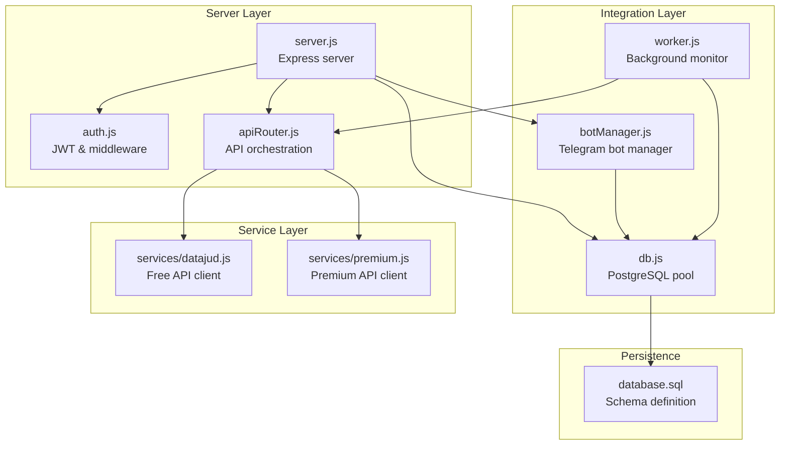
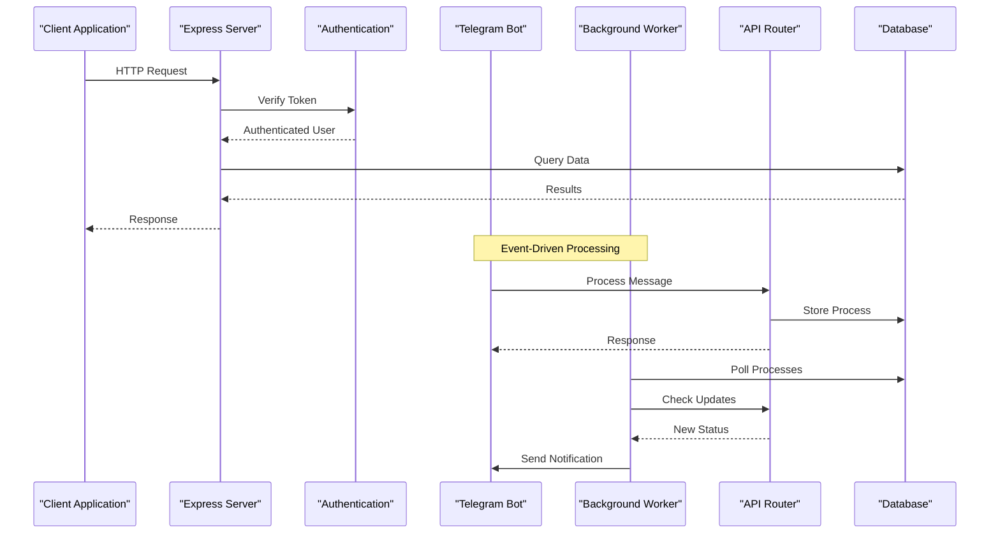
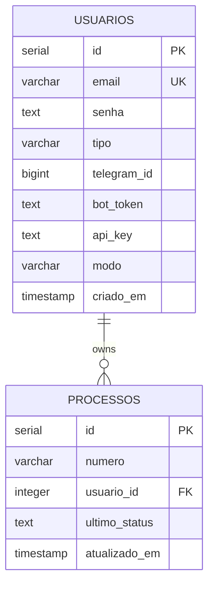
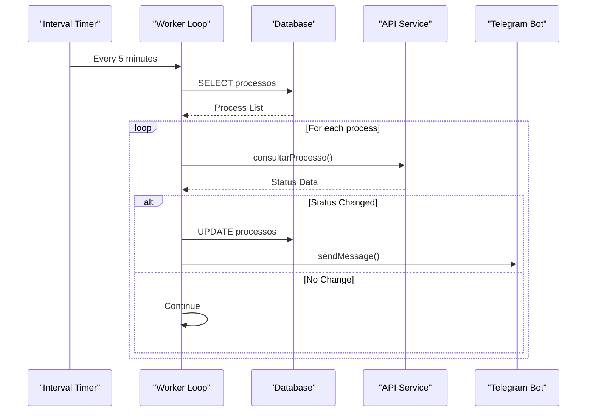
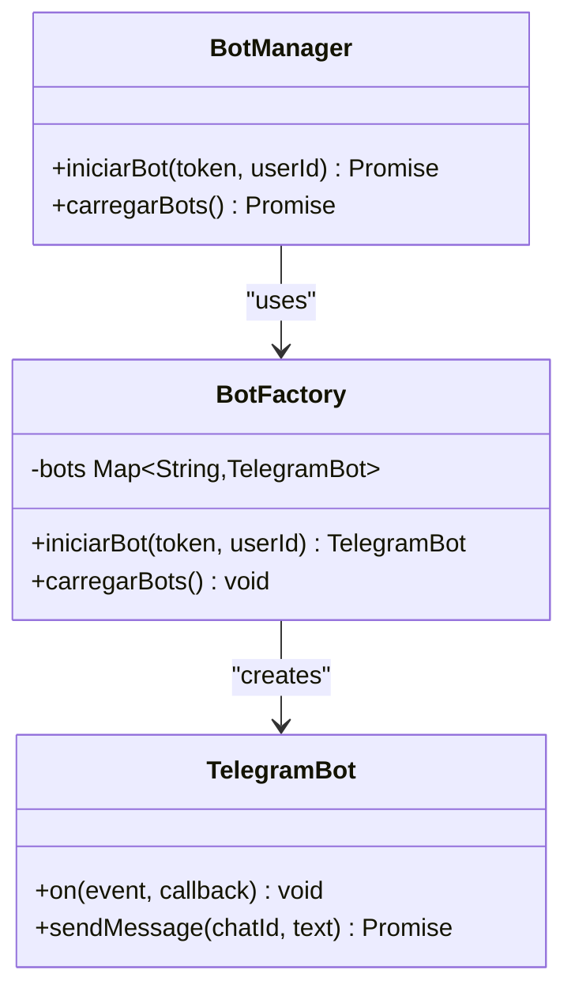
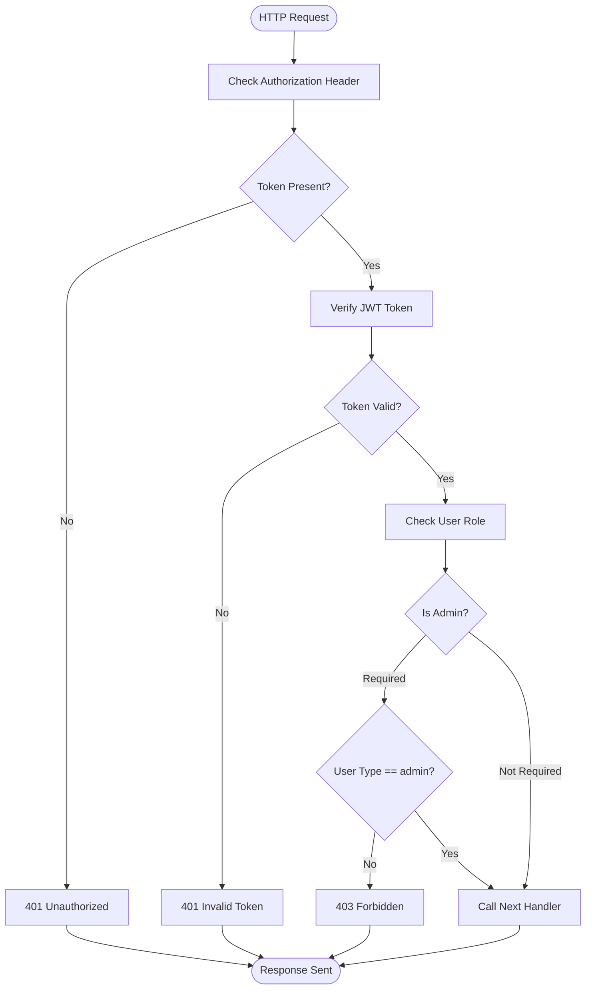
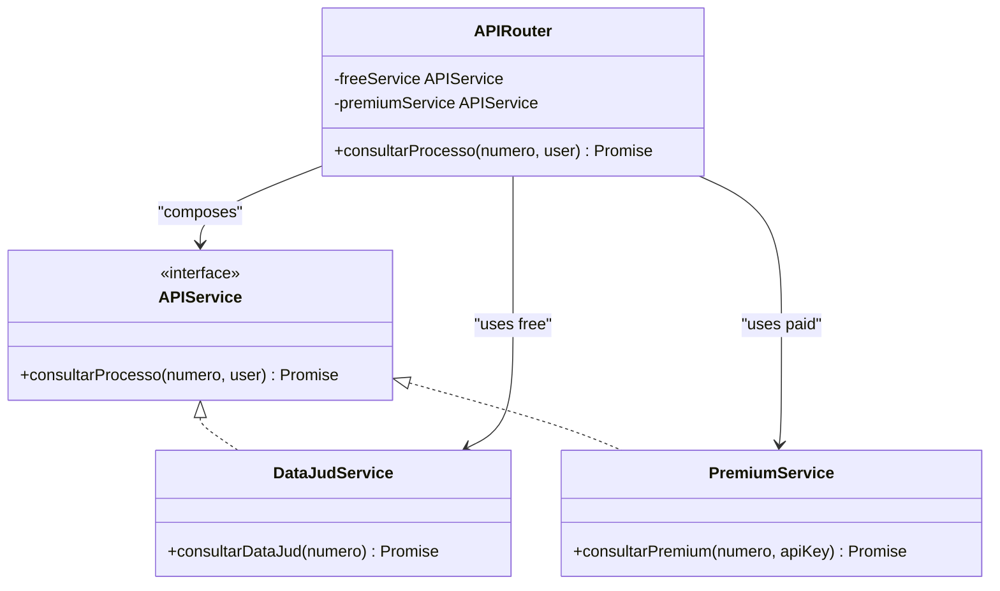
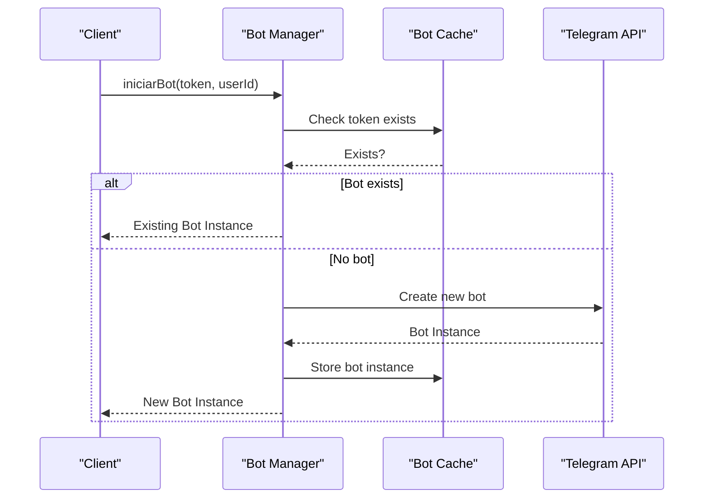
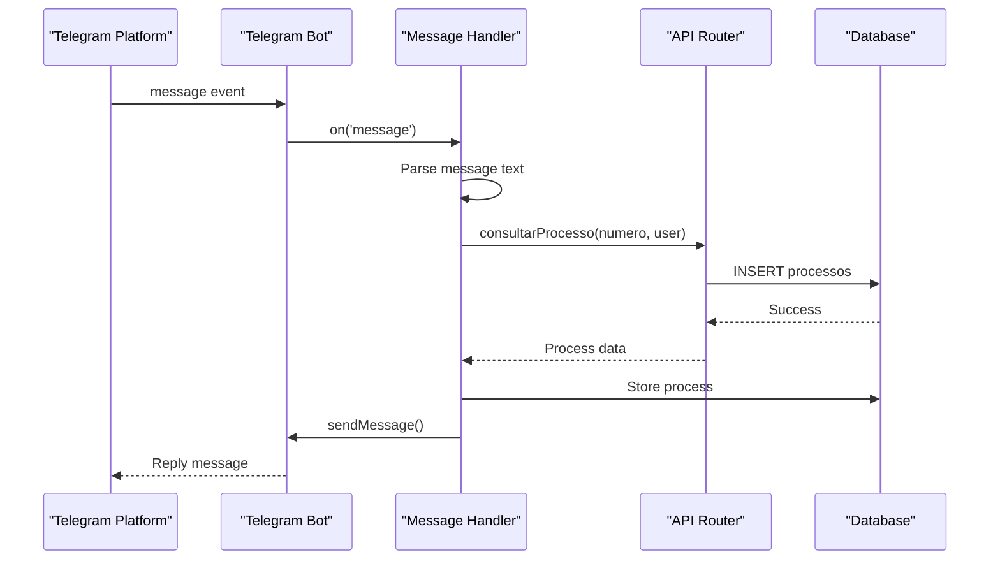
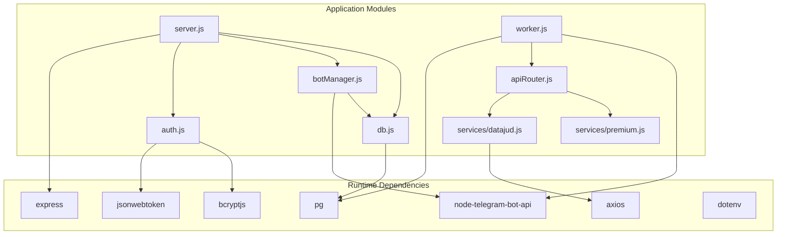

# Design Patterns and Architectural Principles

<cite>
**Referenced Files in This Document**
- [server.js](file://server.js)
- [botManager.js](file://botManager.js)
- [worker.js](file://worker.js)
- [db.js](file://db.js)
- [auth.js](file://auth.js)
- [apiRouter.js](file://apiRouter.js)
- [services/datajud.js](file://services/datajud.js)
- [services/premium.js](file://services/premium.js)
- [database.sql](file://database.sql)
- [package.json](file://package.json)
</cite>

## Table of Contents
1. [Introduction](#introduction)
2. [Project Structure](#project-structure)
3. [Core Components](#core-components)
4. [Architecture Overview](#architecture-overview)
5. [Detailed Component Analysis](#detailed-component-analysis)
6. [Dependency Analysis](#dependency-analysis)
7. [Performance Considerations](#performance-considerations)
8. [Troubleshooting Guide](#troubleshooting-guide)
9. [Conclusion](#conclusion)

## Introduction
This document analyzes the design patterns and architectural principles implemented in the Legal Process Monitoring System. The system monitors legal process updates through Telegram bots, integrates with external APIs, and manages user authentication and authorization. The analysis focuses on how the system separates concerns using MVC-like patterns, implements observer and event-driven architectures, and applies factory, middleware, plugin, singleton, and observer patterns to achieve scalability, maintainability, and extensibility.

## Project Structure
The project follows a modular structure with clear separation of concerns:
- Server entry point and routing logic
- Bot management and Telegram integration
- Background worker for periodic monitoring
- Authentication and authorization middleware
- Database abstraction and connection pooling
- API service integration with plugin-style composition
- PostgreSQL schema for persistent storage

**Diagram sources**
- [server.js:1-162](file://server.js#L1-L162)
- [botManager.js:1-53](file://botManager.js#L1-L53)
- [worker.js:1-70](file://worker.js#L1-L70)
- [db.js:1-11](file://db.js#L1-L11)
- [auth.js:1-59](file://auth.js#L1-L59)
- [apiRouter.js:1-19](file://apiRouter.js#L1-L19)
- [services/datajud.js:1-32](file://services/datajud.js#L1-L32)
- [services/premium.js:1-12](file://services/premium.js#L1-L12)
- [database.sql:1-25](file://database.sql#L1-L25)

**Section sources**
- [package.json:1-21](file://package.json#L1-L21)
- [server.js:1-162](file://server.js#L1-L162)

## Core Components
The system comprises several core components that implement distinct design patterns:

### Server Component (MVC Controller)
The Express server acts as the primary controller, handling HTTP requests and coordinating between authentication, database operations, and bot management. It implements:
- Request routing and response handling
- Authentication middleware integration
- Business logic coordination
- Error handling and validation

### Bot Manager Component (Factory Pattern)
The bot manager implements a factory pattern for dynamic bot creation and management:
- Creates Telegram bot instances on demand
- Manages bot lifecycle and caching
- Handles message processing and user interactions
- Supports multiple concurrent bot instances

### Worker Component (Observer Pattern)
The background worker implements an observer pattern for continuous monitoring:
- Periodically polls process statuses
- Observes changes in legal process data
- Notifies users via Telegram when updates occur
- Implements caching strategies for performance

### Authentication Component (Middleware Pattern)
The authentication module implements middleware pattern for security:
- JWT token generation and verification
- Request authentication middleware
- Role-based authorization middleware
- Password hashing and verification

### API Router Component (Plugin Pattern)
The API router implements a plugin pattern for service integration:
- Composes multiple API services
- Provides fallback mechanisms
- Supports extensible service architecture
- Enables easy addition of new API providers

**Section sources**
- [server.js:11-135](file://server.js#L11-L135)
- [botManager.js:7-42](file://botManager.js#L7-L42)
- [worker.js:9-67](file://worker.js#L9-L67)
- [auth.js:8-39](file://auth.js#L8-L39)
- [apiRouter.js:4-16](file://apiRouter.js#L4-L16)

## Architecture Overview
The system follows an event-driven architecture with clear separation of concerns:

**Diagram sources**
- [server.js:12-68](file://server.js#L12-L68)
- [botManager.js:13-39](file://botManager.js#L13-L39)
- [worker.js:17-60](file://worker.js#L17-L60)
- [apiRouter.js:4-16](file://apiRouter.js#L4-L16)

## Detailed Component Analysis

### MVC Pattern Implementation

#### Model Layer (Database Models)
The database layer implements data models through PostgreSQL tables with clear relationships:

**Diagram sources**
- [database.sql:5-24](file://database.sql#L5-L24)

#### View Layer (Client Interface)
The client-side interface consists of static HTML pages with JavaScript for user interaction:
- Login page for authentication
- Dashboard for process monitoring
- Real-time updates via Telegram integration

#### Controller Layer (Server.js)
The server implements controller responsibilities through route handlers:
- Authentication routes (/auth/*)
- User management routes (/usuario)
- Process management routes (/processos)
- Profile routes (/auth/me)

**Section sources**
- [database.sql:5-24](file://database.sql#L5-L24)
- [server.js:12-135](file://server.js#L12-L135)

### Observer Pattern Implementation

#### Background Worker Observer
The worker implements an observer pattern for continuous monitoring:

**Diagram sources**
- [worker.js:17-60](file://worker.js#L17-L60)
- [apiRouter.js:4-16](file://apiRouter.js#L4-L16)

Key observer characteristics:
- Event-driven polling mechanism
- Automatic detection of state changes
- Decoupled notification system
- Caching strategies for performance optimization

**Section sources**
- [worker.js:17-67](file://worker.js#L17-L67)

### Factory Pattern Implementation

#### Dynamic Bot Creation
The bot manager implements a factory pattern for dynamic bot instantiation:

**Diagram sources**
- [botManager.js:5-42](file://botManager.js#L5-L42)

Benefits of factory pattern:
- Centralized bot creation and management
- Prevents duplicate bot instances
- Supports dynamic bot scaling
- Encapsulates Telegram API complexity

**Section sources**
- [botManager.js:7-42](file://botManager.js#L7-L42)

### Middleware Pattern Implementation

#### Authentication and Authorization
The authentication module implements middleware pattern for security:

**Diagram sources**
- [auth.js:17-39](file://auth.js#L17-L39)

Middleware characteristics:
- Modular security enforcement
- Reusable across multiple routes
- Clear separation of concerns
- Extensible role-based access control

**Section sources**
- [auth.js:8-39](file://auth.js#L8-L39)
- [server.js:71-92](file://server.js#L71-L92)

### Plugin Pattern Implementation

#### API Service Integration
The API router implements a plugin pattern for service integration:

**Diagram sources**
- [apiRouter.js:1-19](file://apiRouter.js#L1-L19)
- [services/datajud.js:3-29](file://services/datajud.js#L3-L29)
- [services/premium.js:1-12](file://services/premium.js#L1-L12)

Plugin pattern benefits:
- Easy addition of new API services
- Fallback mechanism implementation
- Service abstraction layer
- Configurable service selection

**Section sources**
- [apiRouter.js:4-16](file://apiRouter.js#L4-L16)

### Singleton Pattern Implementation

#### Bot Instance Management
The bot manager implements a singleton pattern for bot instance management:

**Diagram sources**
- [botManager.js:7-42](file://botManager.js#L7-L42)

Singleton characteristics:
- Single instance per bot token
- Centralized bot lifecycle management
- Memory efficiency
- Thread-safe access patterns

**Section sources**
- [botManager.js:5-42](file://botManager.js#L5-L42)

### Event-Driven Architecture

#### Telegram Message Processing
The system implements event-driven architecture for Telegram integration:

**Diagram sources**
- [botManager.js:13-39](file://botManager.js#L13-L39)
- [apiRouter.js:4-16](file://apiRouter.js#L4-L16)

Event-driven benefits:
- Asynchronous message processing
- Non-blocking operation handling
- Scalable message throughput
- Decoupled component communication

**Section sources**
- [botManager.js:13-39](file://botManager.js#L13-L39)

## Dependency Analysis

**Diagram sources**
- [package.json:11-19](file://package.json#L11-L19)
- [server.js:1-6](file://server.js#L1-L6)
- [botManager.js:1-3](file://botManager.js#L1-L3)
- [worker.js:1-4](file://worker.js#L1-L4)
- [auth.js:1-3](file://auth.js#L1-L3)
- [apiRouter.js:1-2](file://apiRouter.js#L1-L2)

**Section sources**
- [package.json:11-19](file://package.json#L11-L19)

## Performance Considerations
The system implements several performance optimization strategies:

### Caching Strategies
- Bot instance caching to prevent recreation overhead
- User data caching to reduce database queries
- API response caching for frequently accessed data

### Database Optimization
- Connection pooling for efficient database connections
- Prepared statements for repeated queries
- Index-friendly query patterns

### Asynchronous Processing
- Non-blocking API calls
- Event-driven message handling
- Background worker for periodic tasks

## Troubleshooting Guide

### Common Issues and Solutions

#### Authentication Problems
- **Issue**: 401 Unauthorized token errors
- **Cause**: Missing or invalid JWT tokens
- **Solution**: Verify token presence and validity in authorization header

#### Bot Registration Issues
- **Issue**: Duplicate bot instances
- **Cause**: Multiple registrations for same bot token
- **Solution**: Check existing bot cache before creating new instances

#### API Integration Failures
- **Issue**: Process lookup failures
- **Cause**: External API unavailability or rate limiting
- **Solution**: Implement fallback mechanisms and retry logic

#### Database Connection Problems
- **Issue**: Connection pool exhaustion
- **Cause**: High concurrent request volume
- **Solution**: Monitor connection pool usage and adjust pool size

**Section sources**
- [auth.js:17-31](file://auth.js#L17-L31)
- [botManager.js:9-42](file://botManager.js#L9-L42)
- [worker.js:17-60](file://worker.js#L17-L60)

## Conclusion
The Legal Process Monitoring System demonstrates a well-architected application that successfully implements multiple design patterns to achieve scalability, maintainability, and extensibility. The MVC separation ensures clear responsibility distribution, while the Observer pattern enables efficient background monitoring. The Factory, Middleware, Plugin, Singleton, and Event-Driven patterns work together to create a robust, scalable system capable of handling legal process monitoring with Telegram integration. The modular architecture allows for easy extension and maintenance, making it suitable for production deployment and future enhancements.