# Integration Points and External Systems

<cite>
**Referenced Files in This Document**
- [apiRouter.js](file://apiRouter.js)
- [botManager.js](file://botManager.js)
- [services/datajud.js](file://services/datajud.js)
- [services/premium.js](file://services/premium.js)
- [server.js](file://server.js)
- [worker.js](file://worker.js)
- [auth.js](file://auth.js)
- [db.js](file://db.js)
- [database.sql](file://database.sql)
- [package.json](file://package.json)
- [README.md](file://README.md)
</cite>

## Table of Contents
1. [Introduction](#introduction)
2. [Project Structure](#project-structure)
3. [Core Components](#core-components)
4. [Architecture Overview](#architecture-overview)
5. [Detailed Component Analysis](#detailed-component-analysis)
6. [Dependency Analysis](#dependency-analysis)
7. [Performance Considerations](#performance-considerations)
8. [Troubleshooting Guide](#troubleshooting-guide)
9. [Conclusion](#conclusion)

## Introduction
This document describes the integration architecture connecting the Legal Process Monitoring System to external services and platforms. It focuses on:
- Telegram Bot API integration for message processing and notifications
- DataJud free API service for legal process consultation
- Premium paid service as a fallback enhancement
- The API gateway pattern implemented in apiRouter.js that abstracts external service differences
- Webhook-less polling-based real-time update mechanism via a worker
- Graceful degradation strategy when premium services are unavailable
- Authentication, rate limiting considerations, error handling for external failures, and monitoring approaches for third-party dependencies

## Project Structure
The system is organized around a small set of focused modules:
- API gateway and orchestration: apiRouter.js
- Telegram bot integration: botManager.js
- External service adapters: services/datajud.js, services/premium.js
- Web server and admin APIs: server.js
- Background monitoring worker: worker.js
- Authentication and middleware: auth.js
- Database connection: db.js
- Database schema: database.sql
- Dependencies and scripts: package.json
- Documentation: README.md

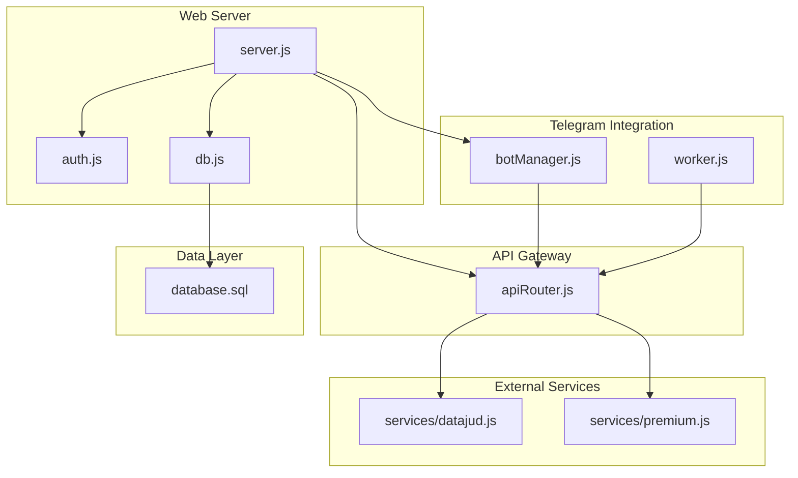

**Diagram sources**
- [server.js:1-162](file://server.js#L1-L162)
- [botManager.js:1-53](file://botManager.js#L1-L53)
- [worker.js:1-70](file://worker.js#L1-L70)
- [apiRouter.js:1-19](file://apiRouter.js#L1-L19)
- [services/datajud.js:1-32](file://services/datajud.js#L1-L32)
- [services/premium.js:1-12](file://services/premium.js#L1-L12)
- [db.js:1-11](file://db.js#L1-L11)
- [database.sql:1-25](file://database.sql#L1-L25)

**Section sources**
- [README.md:1-56](file://README.md#L1-L56)
- [package.json:1-21](file://package.json#L1-L21)

## Core Components
- API Gateway (apiRouter.js): Provides a unified interface for legal process lookup, attempting free DataJud first, then premium fallback when configured.
- Telegram Bot Integration (botManager.js): Handles incoming messages, resolves user context, invokes the API gateway, persists results, and sends formatted responses.
- External Service Adapters:
  - DataJud adapter (services/datajud.js): Queries the DataJud free API and maps results to internal format.
  - Premium adapter (services/premium.js): Placeholder for premium service integration returning enriched data.
- Web Server (server.js): Exposes REST endpoints for user registration/login, admin operations, and process listing; initializes Telegram bots on startup.
- Background Worker (worker.js): Periodically checks monitored processes, compares statuses, and notifies users via Telegram when updates occur.
- Authentication (auth.js): JWT-based authentication and admin middleware.
- Database (db.js, database.sql): PostgreSQL-backed persistence for users and monitored processes.

**Section sources**
- [apiRouter.js:1-19](file://apiRouter.js#L1-L19)
- [botManager.js:1-53](file://botManager.js#L1-L53)
- [services/datajud.js:1-32](file://services/datajud.js#L1-L32)
- [services/premium.js:1-12](file://services/premium.js#L1-L12)
- [server.js:1-162](file://server.js#L1-L162)
- [worker.js:1-70](file://worker.js#L1-L70)
- [auth.js:1-59](file://auth.js#L1-L59)
- [db.js:1-11](file://db.js#L1-L11)
- [database.sql:1-25](file://database.sql#L1-L25)

## Architecture Overview
The system follows a layered architecture:
- Presentation and orchestration: server.js and botManager.js
- API gateway: apiRouter.js orchestrates free and premium services
- External service adapters: services/datajud.js and services/premium.js
- Persistence: PostgreSQL via db.js and database.sql
- Background processing: worker.js for periodic monitoring

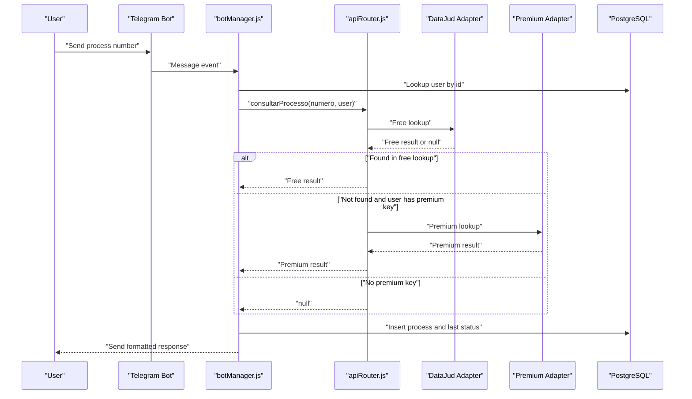

**Diagram sources**
- [botManager.js:13-39](file://botManager.js#L13-L39)
- [apiRouter.js:4-16](file://apiRouter.js#L4-L16)
- [services/datajud.js:3-29](file://services/datajud.js#L3-L29)
- [services/premium.js:1-9](file://services/premium.js#L1-L9)
- [db.js:1-11](file://db.js#L1-L11)

## Detailed Component Analysis

### API Gateway Pattern (apiRouter.js)
The API gateway encapsulates external service differences behind a single function that:
- Attempts free DataJud lookup first
- Falls back to premium service when the user has an API key and mode allows it
- Returns null when no data is available

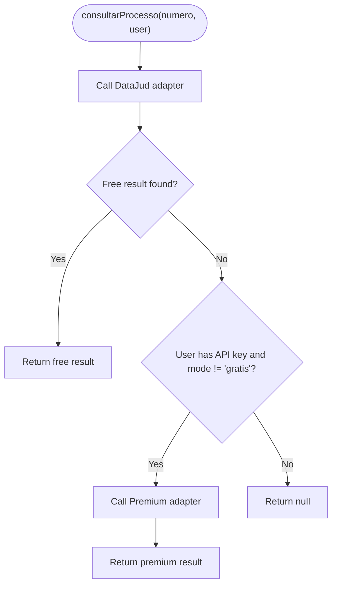

**Diagram sources**
- [apiRouter.js:4-16](file://apiRouter.js#L4-L16)

**Section sources**
- [apiRouter.js:1-19](file://apiRouter.js#L1-L19)

### Telegram Bot Integration (botManager.js)
Key responsibilities:
- Initialize and cache Telegram bots keyed by token
- Handle message events, extract process number, resolve user context from database
- Invoke the API gateway for lookup
- Persist process and last status, send formatted response
- Load existing bots on server startup

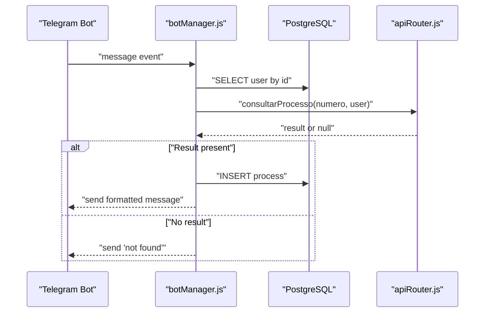

**Diagram sources**
- [botManager.js:13-39](file://botManager.js#L13-L39)
- [apiRouter.js:4-16](file://apiRouter.js#L4-L16)
- [db.js:1-11](file://db.js#L1-L11)

**Section sources**
- [botManager.js:1-53](file://botManager.js#L1-L53)

### DataJud Free API Adapter (services/datajud.js)
Behavior:
- Performs a POST request to the DataJud endpoint with a match query on the process number
- Extracts the first hit and maps fields to internal structure
- Returns null on any failure or empty results

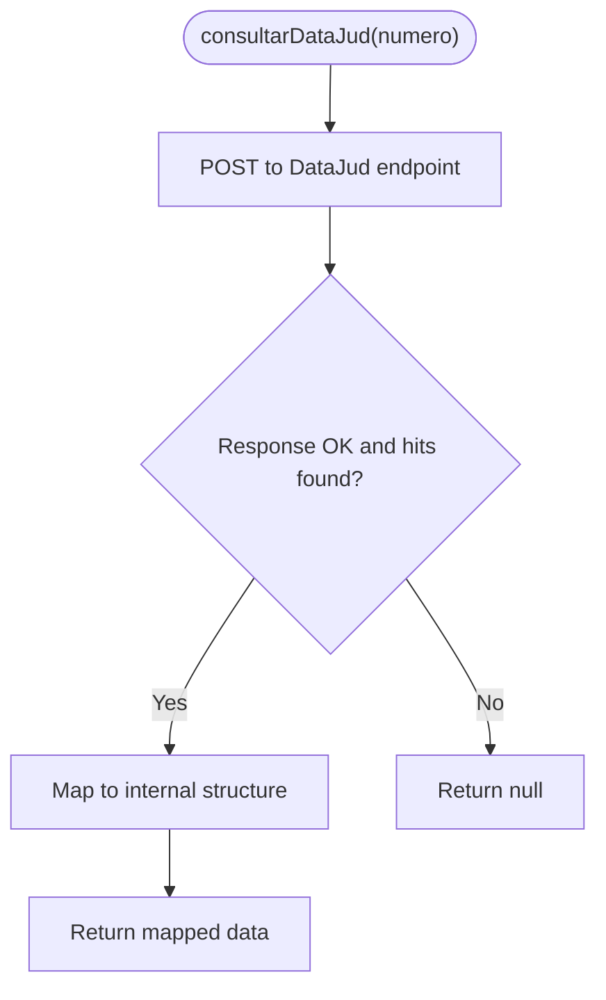

**Diagram sources**
- [services/datajud.js:3-29](file://services/datajud.js#L3-L29)

**Section sources**
- [services/datajud.js:1-32](file://services/datajud.js#L1-L32)

### Premium Adapter (services/premium.js)
Behavior:
- Placeholder implementation returns a structured object with premium-like fields
- Intended to integrate with a real premium service (e.g., Jusbrasil) in production

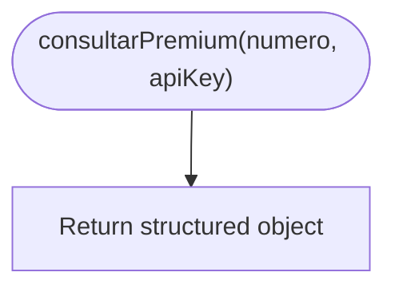

**Diagram sources**
- [services/premium.js:1-9](file://services/premium.js#L1-L9)

**Section sources**
- [services/premium.js:1-12](file://services/premium.js#L1-L12)

### Web Server and Admin APIs (server.js)
Responsibilities:
- User registration and login with JWT tokens
- Admin endpoints for creating users and listing users/processes
- Static serving for admin panel
- Startup initialization of Telegram bots
- Default admin creation if not present

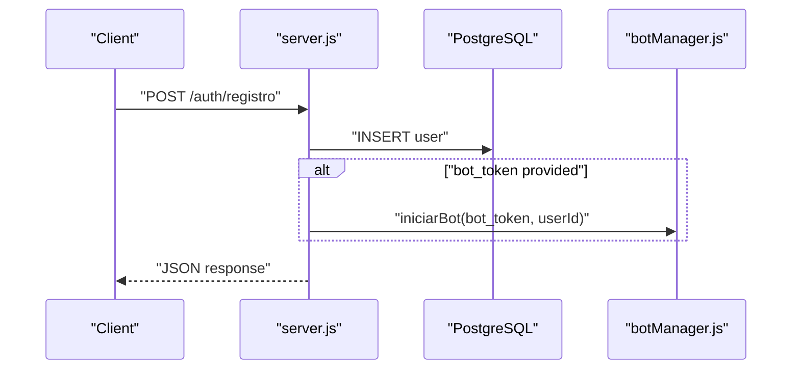

**Diagram sources**
- [server.js:12-36](file://server.js#L12-L36)
- [botManager.js:7-42](file://botManager.js#L7-L42)
- [db.js:1-11](file://db.js#L1-L11)

**Section sources**
- [server.js:1-162](file://server.js#L1-L162)

### Background Worker (worker.js)
Responsibilities:
- Periodic polling (every 5 minutes) of monitored processes
- Grouping by user to minimize repeated lookups
- Comparing last known status with latest from API gateway
- Sending Telegram notifications when updates are detected
- Caching bot instances by token

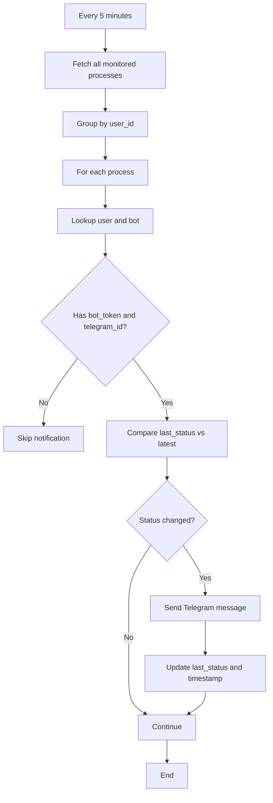

**Diagram sources**
- [worker.js:17-61](file://worker.js#L17-L61)

**Section sources**
- [worker.js:1-70](file://worker.js#L1-L70)

### Authentication and Authorization (auth.js)
- JWT token generation and verification
- Middleware for protecting routes and enforcing admin-only access
- Password hashing and verification using bcrypt

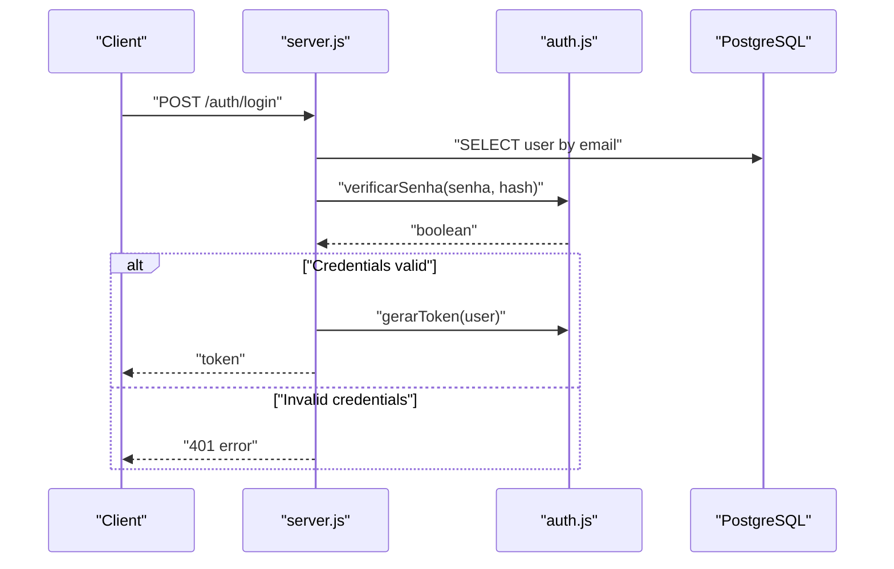

**Diagram sources**
- [auth.js:8-31](file://auth.js#L8-L31)
- [server.js:39-68](file://server.js#L39-L68)

**Section sources**
- [auth.js:1-59](file://auth.js#L1-L59)

### Database Schema and Connections (db.js, database.sql)
- Users table stores authentication, Telegram identifiers, API keys, and mode preferences
- Processes table tracks monitored process numbers, associated users, and last status timestamps
- PostgreSQL connection managed via environment variables

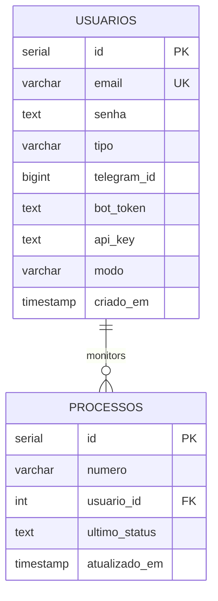

**Diagram sources**
- [database.sql:5-24](file://database.sql#L5-L24)

**Section sources**
- [db.js:1-11](file://db.js#L1-L11)
- [database.sql:1-25](file://database.sql#L1-L25)

## Dependency Analysis
External dependencies and their roles:
- axios: HTTP client for DataJud adapter
- node-telegram-bot-api: Telegram bot SDK for message handling and notifications
- express: Web server framework for REST endpoints
- jsonwebtoken: JWT token generation and verification
- bcryptjs: Password hashing and verification
- pg: PostgreSQL client for database connectivity

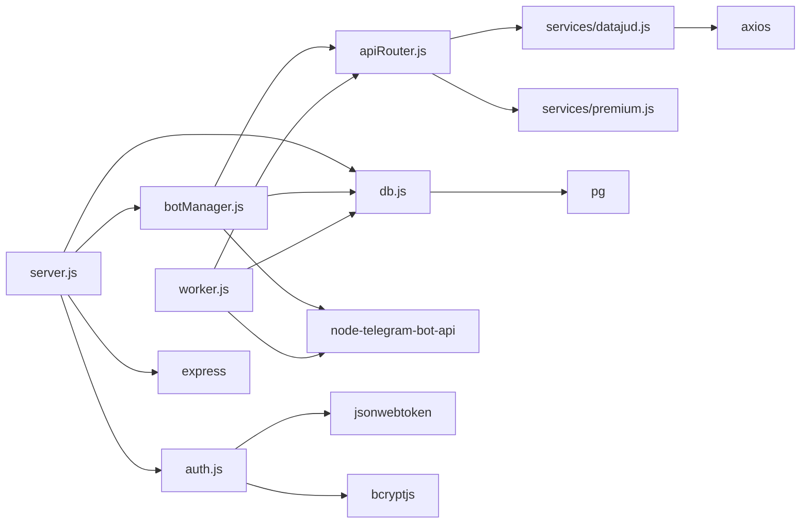

**Diagram sources**
- [apiRouter.js:1-2](file://apiRouter.js#L1-L2)
- [services/datajud.js:1](file://services/datajud.js#L1)
- [services/premium.js:1](file://services/premium.js#L1)
- [botManager.js:1](file://botManager.js#L1)
- [worker.js:1-4](file://worker.js#L1-L4)
- [server.js:2-6](file://server.js#L2-L6)
- [auth.js:1-3](file://auth.js#L1-L3)
- [db.js:1](file://db.js#L1)
- [package.json:11-19](file://package.json#L11-L19)

**Section sources**
- [package.json:1-21](file://package.json#L1-L21)

## Performance Considerations
- Polling interval: The worker runs every 5 minutes. This reduces load on external APIs while maintaining reasonable freshness. Consider adjusting interval based on usage patterns and acceptable staleness.
- Caching: The worker caches user records per batch and bot instances by token to minimize repeated lookups and bot initialization overhead.
- Database batching: Grouping processes by user avoids redundant user queries during a single iteration.
- External service timeouts: The DataJud adapter returns null on exceptions, enabling quick failover without blocking the worker.
- Rate limiting: No explicit rate limiting is implemented in the code. For production, consider:
  - Implementing exponential backoff on external service errors
  - Adding circuit breaker logic for transient failures
  - Applying per-user or per-key rate limits
  - Using a queue/job system to serialize external calls

[No sources needed since this section provides general guidance]

## Troubleshooting Guide
Common issues and resolutions:
- Telegram notifications not sent:
  - Verify bot_token and telegram_id are stored for the user
  - Confirm the worker is running and has access to environment variables
  - Check that the user’s mode allows notifications
- Free lookup returns null:
  - Ensure the process number format matches DataJud expectations
  - Confirm DataJud API availability and network connectivity
- Premium fallback not triggered:
  - Verify user.api_key is set and user.modo is not 'gratis'
  - Confirm the premium adapter implementation is replaced with a real service
- Authentication failures:
  - Check JWT_SECRET environment variable
  - Ensure tokens are included in Authorization header as "Bearer <token>"
- Database connectivity:
  - Verify DB_HOST, DB_USER, DB_PASSWORD, DB_NAME, DB_PORT environment variables
  - Confirm PostgreSQL is reachable and credentials are correct

**Section sources**
- [worker.js:39-59](file://worker.js#L39-L59)
- [botManager.js:22-38](file://botManager.js#L22-L38)
- [apiRouter.js:11-13](file://apiRouter.js#L11-L13)
- [auth.js:17-31](file://auth.js#L17-L31)
- [db.js:4-10](file://db.js#L4-L10)

## Conclusion
The Legal Process Monitoring System integrates external services through a clean API gateway pattern that abstracts differences between free and premium providers. Telegram bots handle user interactions and notifications, while a background worker ensures continuous monitoring with minimal overhead. The design supports graceful degradation by prioritizing free services and falling back to premium when configured. For production hardening, implement explicit rate limiting, circuit breakers, and robust monitoring of external dependencies.