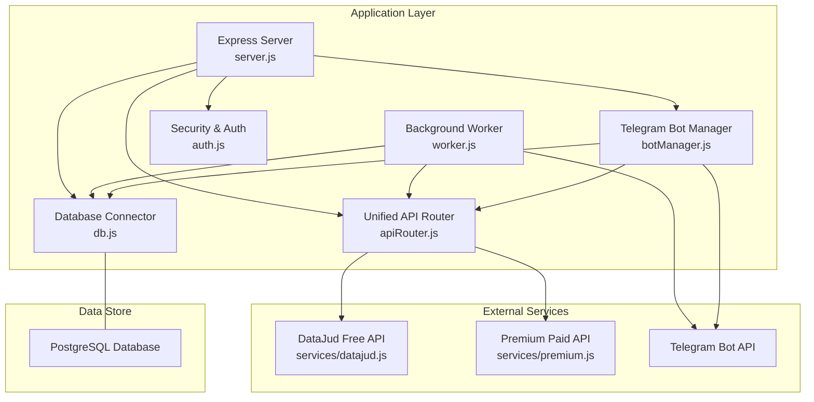
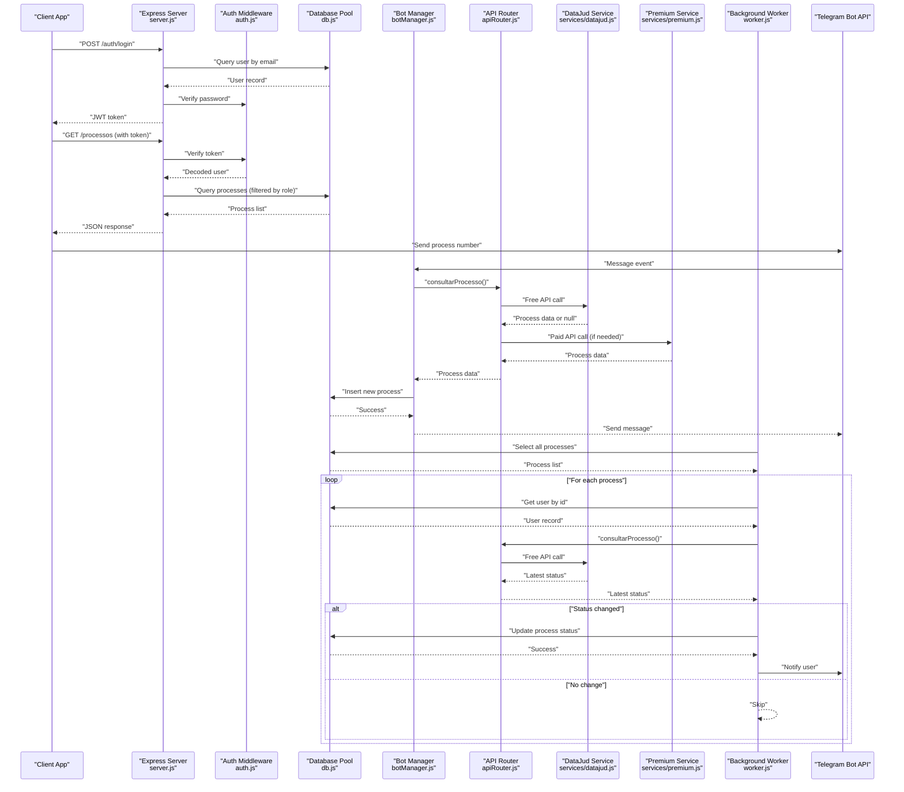
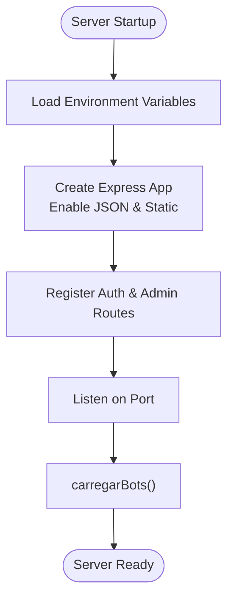
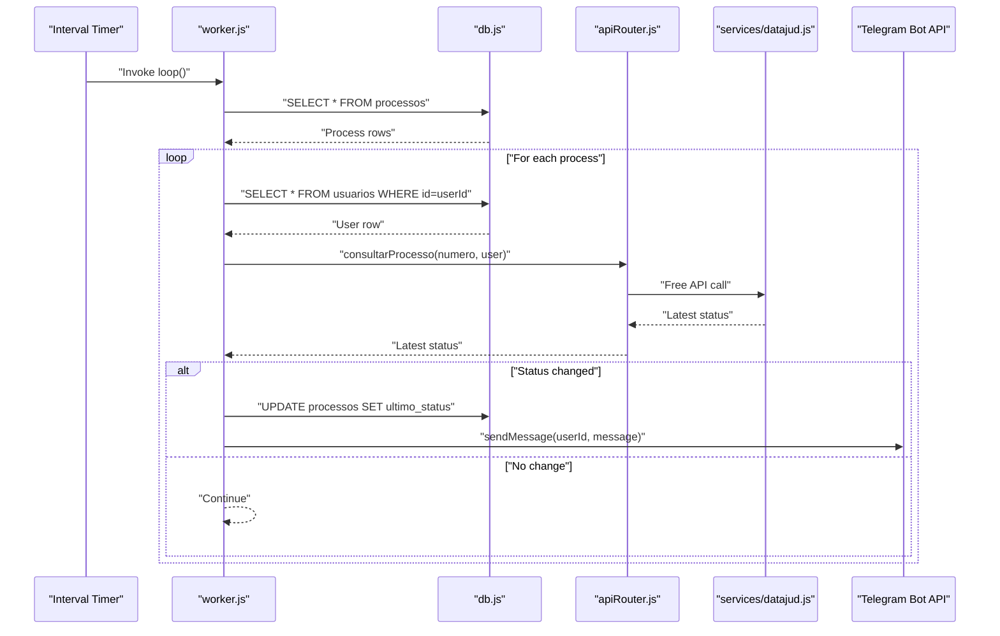
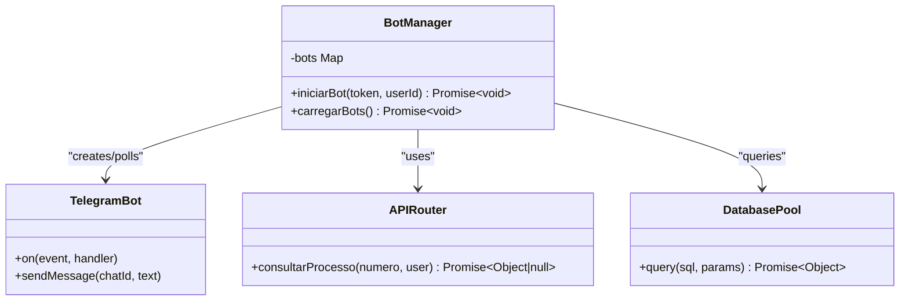
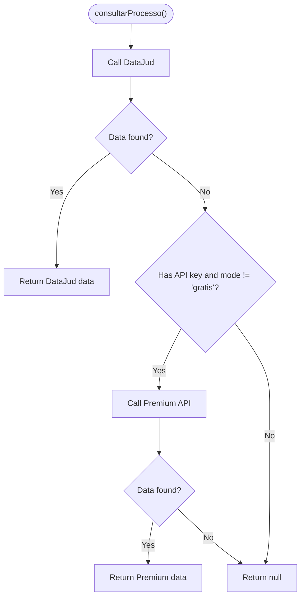
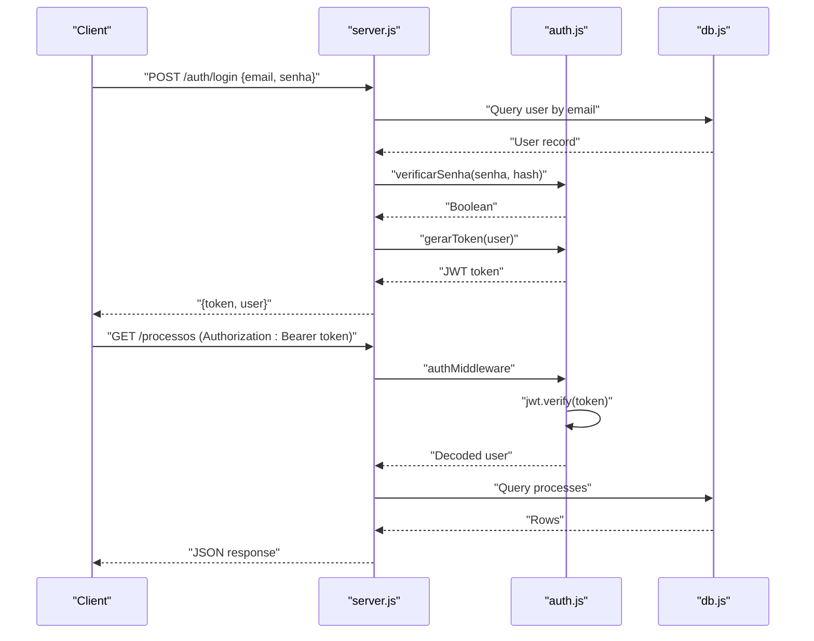
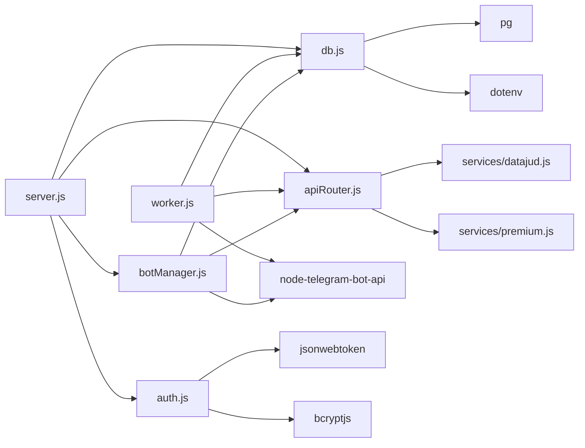

# System Components

<cite>
**Referenced Files in This Document**
- [server.js](file://server.js)
- [worker.js](file://worker.js)
- [botManager.js](file://botManager.js)
- [apiRouter.js](file://apiRouter.js)
- [auth.js](file://auth.js)
- [db.js](file://db.js)
- [datajud.js](file://services/datajud.js)
- [premium.js](file://services/premium.js)
- [database.sql](file://database.sql)
- [package.json](file://package.json)
- [README.md](file://README.md)
</cite>

## Table of Contents
1. [Introduction](#introduction)
2. [Project Structure](#project-structure)
3. [Core Components](#core-components)
4. [Architecture Overview](#architecture-overview)
5. [Detailed Component Analysis](#detailed-component-analysis)
6. [Dependency Analysis](#dependency-analysis)
7. [Performance Considerations](#performance-considerations)
8. [Troubleshooting Guide](#troubleshooting-guide)
9. [Conclusion](#conclusion)

## Introduction
This document provides comprehensive documentation for the core system components of the Legal Process Monitoring System. The system is a SaaS multi-user platform that enables judicial process monitoring via Telegram bots, with optional paid APIs for enhanced data retrieval. It consists of a central Express server, a background worker for automated monitoring, a Telegram bot manager, a unified API router, an authentication/security layer, and a PostgreSQL database connector. These components form a modular architecture where each module has distinct responsibilities, initialization sequences, and interdependencies.

## Project Structure
The project follows a feature-based and layer-based organization:
- Entry point server.js initializes the Express application, sets up middleware, routes, and starts background services.
- Background worker.js runs periodic checks against monitored processes and sends Telegram notifications.
- botManager.js orchestrates Telegram bot instances per user and handles inbound messages.
- apiRouter.js provides a unified interface to external judicial data sources (free and paid).
- auth.js implements JWT-based authentication and authorization middleware.
- db.js manages PostgreSQL connection pooling.
- Services under services/ encapsulate integrations with external APIs (DataJud free tier and Premium paid tier).
- database.sql defines the relational schema for users and monitored processes.
- package.json defines scripts for development and production execution.

**Diagram sources**
- [server.js:1-162](file://server.js#L1-L162)
- [worker.js:1-70](file://worker.js#L1-L70)
- [botManager.js:1-53](file://botManager.js#L1-L53)
- [apiRouter.js:1-19](file://apiRouter.js#L1-L19)
- [auth.js:1-59](file://auth.js#L1-L59)
- [db.js:1-11](file://db.js#L1-L11)
- [datajud.js:1-32](file://services/datajud.js#L1-L32)
- [premium.js:1-12](file://services/premium.js#L1-L12)

**Section sources**
- [README.md:1-56](file://README.md#L1-L56)
- [package.json:1-21](file://package.json#L1-L21)
- [database.sql:1-25](file://database.sql#L1-L25)

## Core Components
This section documents each core component, its responsibilities, initialization sequences, lifecycle management, error handling strategies, and performance considerations.

### server.js - Central Express Application
Responsibilities:
- Provides REST endpoints for user registration, login, user creation (admin), process listing, user listing, and profile retrieval.
- Implements JSON parsing middleware and serves static assets.
- Initializes the application on startup, loads default admin credentials, and triggers bot loading.

Initialization sequence:
- Loads environment variables via dotenv.
- Creates Express app and configures JSON parsing and static asset serving.
- Registers authentication and authorization middleware for protected routes.
- Defines routes for authentication, user management, and process administration.
- Starts the HTTP server on configured port and immediately loads existing Telegram bots.
- Creates a default admin account if none exists.

Lifecycle management:
- Runs continuously after startup.
- On shutdown, the process exits gracefully; no explicit cleanup handlers are implemented.

Error handling:
- Routes return structured JSON errors with appropriate HTTP status codes.
- Specific database constraint violations (e.g., duplicate email) are handled with dedicated responses.
- General server errors return 500 with error messages.

Performance considerations:
- Uses a single database pool instance shared across requests.
- Avoids synchronous blocking operations in route handlers.
- Static assets served directly by Express reduce application overhead.

**Section sources**
- [server.js:1-162](file://server.js#L1-L162)

### worker.js - Background Process Monitoring
Responsibilities:
- Periodically checks all monitored processes for updates.
- Compares stored last status with latest data and notifies users via Telegram when changes occur.
- Manages Telegram bot instances using an internal cache keyed by bot token.

Initialization sequence:
- Loads environment variables via dotenv.
- Establishes database connection via db.js.
- Imports apiRouter.js for process data retrieval.
- Initializes a global cache for Telegram bot instances.
- Executes an immediate scan upon startup.
- Schedules periodic scans every 5 minutes.

Lifecycle management:
- Runs continuously in a Node.js process.
- Maintains an in-memory cache of Telegram bots to avoid recreating instances.

Error handling:
- Logs informational messages about scanning intervals.
- Skips records missing required Telegram configuration.
- Continues processing subsequent items if individual checks fail.

Performance considerations:
- Groups process checks by user to minimize repeated user lookups.
- Reuses cached Telegram bot instances to reduce overhead.
- Uses batched database queries to minimize round trips.

**Section sources**
- [worker.js:1-70](file://worker.js#L1-L70)

### botManager.js - Telegram Bot Orchestration
Responsibilities:
- Manages Telegram bot instances per user.
- Handles incoming Telegram messages containing process numbers.
- Validates user context, retrieves process data, persists new monitoring entries, and responds to users.

Initialization sequence:
- Loads TelegramBot library and database pool.
- Exposes functions to initialize a bot for a given token and user, and to load all existing bots on startup.

Lifecycle management:
- Stores active bot instances in memory keyed by token.
- Prevents duplicate bot initialization for the same token.

Error handling:
- Ignores duplicate initialization attempts for existing tokens.
- Handles missing user records gracefully during message processing.
- Sends standardized "Not found" responses when process data is unavailable.

Performance considerations:
- Reuses cached bot instances to avoid repeated polling initialization.
- Performs user lookups per message to ensure context-aware responses.

**Section sources**
- [botManager.js:1-53](file://botManager.js#L1-L53)

### apiRouter.js - Unified API Access
Responsibilities:
- Provides a single entry point for retrieving judicial process data.
- Attempts free DataJud API first, then falls back to premium API if configured and allowed.

Processing logic:
- Calls DataJud free API; if successful, returns the result.
- If free API fails and user has a valid API key and is not in "gratis" mode, calls premium API.
- Returns null if no data is available.

Error handling:
- Gracefully handles failures in free API calls.
- Gracefully handles failures in premium API calls.
- Returns null to caller when no data is found.

Performance considerations:
- Short-circuits to free API first to reduce cost and latency.
- Delegates actual API calls to service modules.

**Section sources**
- [apiRouter.js:1-19](file://apiRouter.js#L1-L19)

### auth.js - Security Layer
Responsibilities:
- Implements JWT-based authentication and authorization.
- Provides middleware to protect routes and enforce admin-only access.
- Handles password hashing and verification.

Processing logic:
- Generates JWT tokens with expiration for authenticated users.
- Extracts bearer tokens from Authorization headers and validates them.
- Enforces role-based access control for administrative endpoints.

Error handling:
- Returns 401 for missing or invalid tokens.
- Returns 403 for unauthorized administrative access.
- Propagates errors from JWT verification and bcrypt operations.

Performance considerations:
- Uses bcrypt for secure password hashing.
- Lightweight JWT verification in middleware.

**Section sources**
- [auth.js:1-59](file://auth.js#L1-L59)

### db.js - Database Connectivity
Responsibilities:
- Manages a PostgreSQL connection pool using environment variables for configuration.
- Exports a single pool instance for use across the application.

Initialization sequence:
- Loads environment variables via dotenv.
- Creates a pg.Pool with host, user, password, database, and port from environment.

Lifecycle management:
- Pool remains active for the lifetime of the process.
- No explicit pool close logic is implemented.

Performance considerations:
- Connection pooling reduces connection overhead.
- Single pool shared across all modules.

**Section sources**
- [db.js:1-11](file://db.js#L1-L11)

## Architecture Overview
The system architecture is layered and modular:
- Presentation and API Layer: Express routes in server.js handle HTTP requests and delegate to auth, bot management, and API routing.
- Business Logic Layer: apiRouter.js coordinates free and paid data retrieval.
- Integration Layer: services/datajud.js and services/premium.js encapsulate external API calls.
- Infrastructure Layer: botManager.js manages Telegram bot lifecycles; worker.js performs background monitoring.
- Persistence Layer: db.js provides a shared PostgreSQL connection pool; database.sql defines schema.

**Diagram sources**
- [server.js:12-135](file://server.js#L12-L135)
- [auth.js:16-39](file://auth.js#L16-L39)
- [botManager.js:7-42](file://botManager.js#L7-L42)
- [apiRouter.js:4-16](file://apiRouter.js#L4-L16)
- [datajud.js:3-29](file://services/datajud.js#L3-L29)
- [premium.js:1-12](file://services/premium.js#L1-L12)
- [worker.js:17-61](file://worker.js#L17-L61)

## Detailed Component Analysis

### Component A Analysis: server.js
Key responsibilities:
- Authentication endpoints for registration and login.
- Administrative endpoints for user creation and listing.
- Process listing with role-based filtering.
- Profile endpoint using JWT claims.
- Startup tasks: loading bots and creating default admin.

Implementation patterns:
- Route handlers are asynchronous and use try/catch blocks for error handling.
- Uses database pool for all queries.
- Applies authMiddleware and adminMiddleware to protect routes.

Data structures:
- Uses arrays for query parameters and rows returned by database queries.

Error handling:
- Distinguishes database constraint violations (e.g., duplicate email) with specific HTTP status codes.
- Returns generic 500 errors for unexpected exceptions.

Performance considerations:
- Single database pool instance prevents connection thrashing.
- Static asset serving reduces application overhead.

**Diagram sources**
- [server.js:137-140](file://server.js#L137-L140)
- [server.js:142-162](file://server.js#L142-L162)

**Section sources**
- [server.js:1-162](file://server.js#L1-L162)

### Component B Analysis: worker.js
Key responsibilities:
- Periodic monitoring of all monitored processes.
- Status comparison and Telegram notification on changes.
- Bot instance caching to avoid recreation.

Implementation patterns:
- Uses setInterval for periodic execution.
- Groups user lookups to minimize database queries.
- Caches Telegram bot instances by token.

Data structures:
- Uses a plain object cache for Telegram bots.
- Iterates over process rows and user rows.

Error handling:
- Continues processing even if individual checks fail.
- Skips records missing Telegram configuration.

Performance considerations:
- Batched queries and user caching reduce database load.
- Reused bot instances reduce initialization overhead.

**Diagram sources**
- [worker.js:17-61](file://worker.js#L17-L61)
- [apiRouter.js:4-16](file://apiRouter.js#L4-L16)
- [datajud.js:3-29](file://services/datajud.js#L3-L29)

**Section sources**
- [worker.js:1-70](file://worker.js#L1-L70)

### Component C Analysis: botManager.js
Key responsibilities:
- Initialize Telegram bots per user with polling enabled.
- Handle inbound messages containing process numbers.
- Retrieve process data, persist new monitoring entries, and respond to users.

Implementation patterns:
- Stores active bot instances in memory keyed by token.
- Prevents duplicate initialization for the same token.
- Uses database queries to resolve user context for each message.

Data structures:
- Uses a plain object to cache bot instances.
- Processes arrays of user records to initialize bots.

Error handling:
- Ignores duplicate initialization attempts.
- Sends standardized "Not found" messages when process data is unavailable.

Performance considerations:
- Reuses cached bot instances to avoid repeated polling setup.
- Performs user lookups per message to ensure correct context.

**Diagram sources**
- [botManager.js:1-53](file://botManager.js#L1-L53)
- [apiRouter.js:1-19](file://apiRouter.js#L1-L19)
- [db.js:1-11](file://db.js#L1-L11)

**Section sources**
- [botManager.js:1-53](file://botManager.js#L1-L53)

### Component D Analysis: apiRouter.js
Key responsibilities:
- Unified interface for retrieving judicial process data.
- Free tier first, paid tier fallback strategy.

Implementation patterns:
- Sequential evaluation: free API first, then paid API if conditions are met.
- Returns null when no data is available.

Data structures:
- Returns normalized objects with fields: numero, tribunal, classe, data.

Error handling:
- Gracefully handles failures in both free and paid API calls.
- Returns null to caller when no data is found.

Performance considerations:
- Short-circuit evaluation minimizes unnecessary paid API calls.
- Delegation to service modules keeps logic modular.

**Diagram sources**
- [apiRouter.js:4-16](file://apiRouter.js#L4-L16)

**Section sources**
- [apiRouter.js:1-19](file://apiRouter.js#L1-L19)

### Component E Analysis: auth.js
Key responsibilities:
- JWT token generation and verification.
- Authentication and authorization middleware.
- Password hashing and verification.

Implementation patterns:
- Uses jsonwebtoken for signing and verifying tokens.
- Uses bcrypt for secure password hashing and comparison.
- Middleware extracts token from Authorization header and verifies it.

Data structures:
- Tokens carry user identity and role information.
- Passwords are hashed with bcrypt.

Error handling:
- Returns 401 for missing or invalid tokens.
- Returns 403 for unauthorized administrative access.
- Propagates errors from JWT and bcrypt operations.

Performance considerations:
- Lightweight JWT verification in middleware.
- Secure but computationally expensive password hashing handled during registration/login.

**Diagram sources**
- [auth.js:8-31](file://auth.js#L8-L31)
- [server.js:39-68](file://server.js#L39-L68)

**Section sources**
- [auth.js:1-59](file://auth.js#L1-L59)

### Component F Analysis: db.js
Key responsibilities:
- Provide a PostgreSQL connection pool configured via environment variables.
- Export a single pool instance for use across the application.

Implementation patterns:
- Uses pg.Pool constructor with host, user, password, database, and port.
- Loads environment variables via dotenv.

Data structures:
- Pool instance with default connection settings.

Error handling:
- No explicit error handling in module; errors propagate from pool usage.

Performance considerations:
- Connection pooling reduces connection overhead.
- Single pool instance prevents connection thrashing.

**Section sources**
- [db.js:1-11](file://db.js#L1-L11)

## Dependency Analysis
The system exhibits clear module boundaries and controlled coupling:
- server.js depends on db.js, botManager.js, auth.js, and apiRouter.js.
- worker.js depends on db.js, apiRouter.js, and TelegramBot library.
- botManager.js depends on db.js, apiRouter.js, and TelegramBot library.
- apiRouter.js depends on services/datajud.js and services/premium.js.
- auth.js depends on jsonwebtoken and bcryptjs.
- db.js depends on pg and dotenv.

**Diagram sources**
- [server.js:1-6](file://server.js#L1-L6)
- [worker.js:1-4](file://worker.js#L1-L4)
- [botManager.js:1-3](file://botManager.js#L1-L3)
- [apiRouter.js:1-2](file://apiRouter.js#L1-L2)
- [auth.js:1-3](file://auth.js#L1-L3)
- [db.js:1-2](file://db.js#L1-L2)

**Section sources**
- [server.js:1-6](file://server.js#L1-L6)
- [worker.js:1-4](file://worker.js#L1-L4)
- [botManager.js:1-3](file://botManager.js#L1-L3)
- [apiRouter.js:1-2](file://apiRouter.js#L1-L2)
- [auth.js:1-3](file://auth.js#L1-L3)
- [db.js:1-2](file://db.js#L1-L2)

## Performance Considerations
- Database pooling: db.js exports a single pool instance used across modules to reduce connection overhead.
- Caching: worker.js caches Telegram bot instances by token to avoid repeated initialization.
- Query batching: worker.js groups user lookups to minimize database round trips.
- Short-circuit evaluation: apiRouter.js prioritizes free API calls to reduce cost and latency.
- Static asset serving: server.js serves static assets directly via Express to reduce application processing.
- Interval scheduling: worker.js uses a fixed interval (5 minutes) to balance responsiveness and resource usage.

## Troubleshooting Guide
Common issues and resolutions:
- Authentication failures:
  - Missing or invalid Authorization header results in 401 responses.
  - Invalid tokens trigger 401 responses.
  - Unauthorized admin access returns 403.
  - Verify JWT_SECRET environment variable and token validity.

- Registration conflicts:
  - Duplicate email triggers a 400 response with a specific error message.
  - Ensure unique email addresses during registration.

- Database connectivity:
  - Verify DB_HOST, DB_USER, DB_PASSWORD, DB_NAME, and DB_PORT environment variables.
  - Confirm PostgreSQL is running and accessible.

- Telegram bot configuration:
  - Missing bot_token or telegram_id prevents notifications.
  - Ensure bot is initialized and polling is active for user accounts.

- API retrieval failures:
  - Free API failures are handled gracefully; check external service availability.
  - Premium API requires a valid API key and non-"gratis" mode.

**Section sources**
- [server.js:30-36](file://server.js#L30-L36)
- [server.js:49-52](file://server.js#L49-L52)
- [auth.js:17-31](file://auth.js#L17-L31)
- [worker.js:39-44](file://worker.js#L39-L44)
- [apiRouter.js:7-13](file://apiRouter.js#L7-L13)

## Conclusion
The Legal Process Monitoring System demonstrates a clean, modular architecture where each component has a well-defined responsibility. server.js acts as the central hub for HTTP operations, authentication, and orchestration. worker.js provides automated monitoring with caching and efficient database usage. botManager.js manages Telegram bot lifecycles and user interactions. apiRouter.js abstracts external API integrations with a clear fallback strategy. auth.js enforces security policies via JWT and role-based access control. db.js supplies a robust connection pool for persistent storage. Together, these components deliver a scalable, maintainable solution for judicial process monitoring with clear separation of concerns and practical performance optimizations.