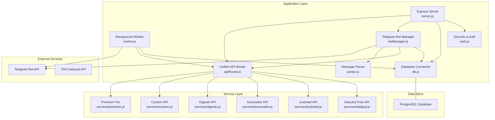
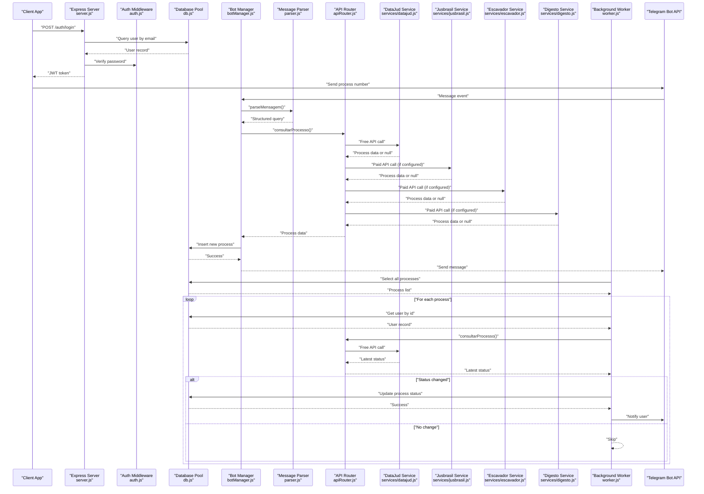
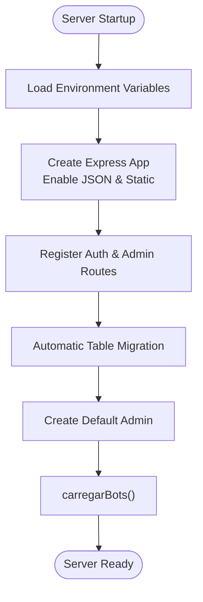
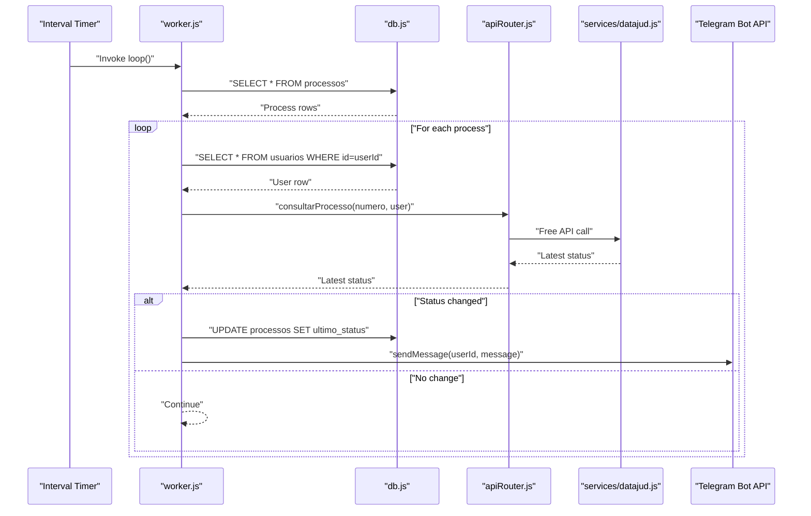
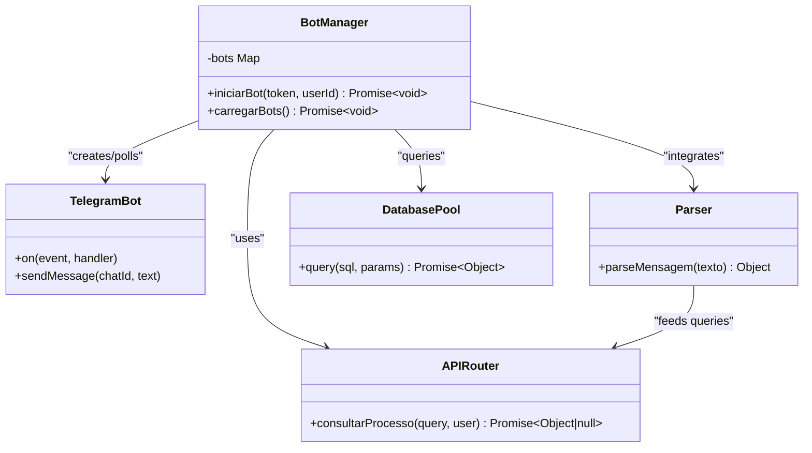
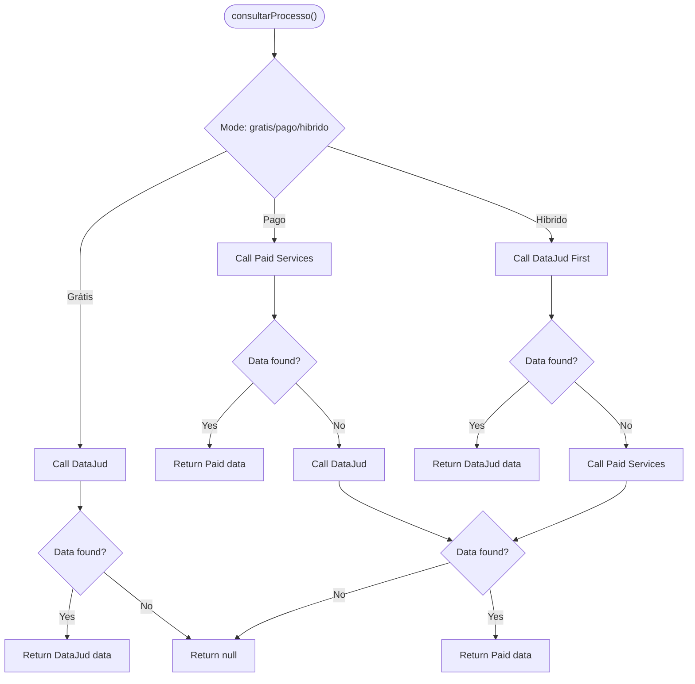
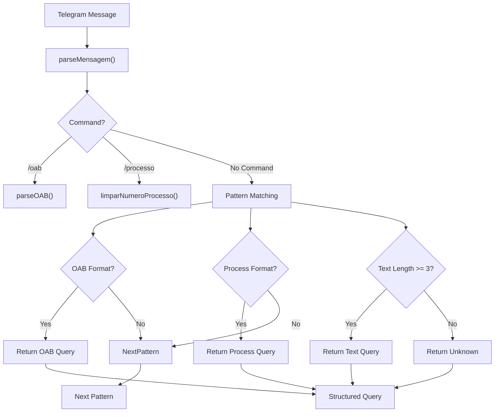
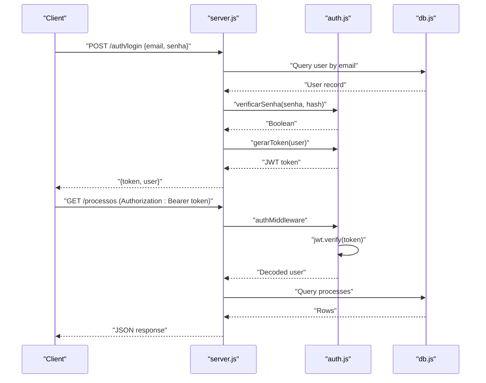
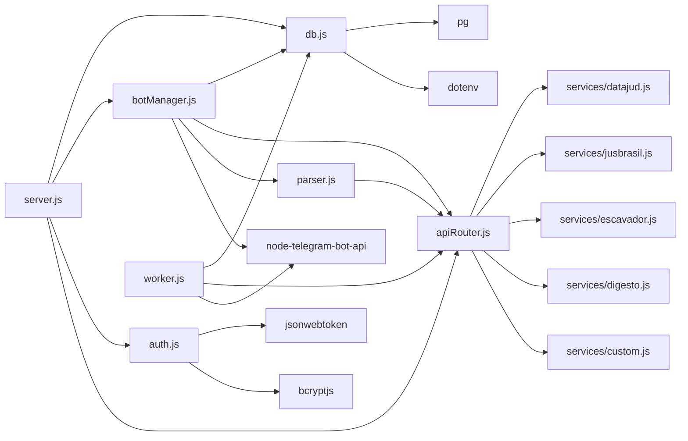

# System Components

<cite>
**Referenced Files in This Document**
- [server.js](file://server.js)
- [worker.js](file://worker.js)
- [botManager.js](file://botManager.js)
- [apiRouter.js](file://apiRouter.js)
- [auth.js](file://auth.js)
- [db.js](file://db.js)
- [parser.js](file://parser.js)
- [datajud.js](file://services/datajud.js)
- [jusbrasil.js](file://services/jusbrasil.js)
- [escavador.js](file://services/escavador.js)
- [digesto.js](file://services/digesto.js)
- [custom.js](file://services/custom.js)
- [premium.js](file://services/premium.js)
- [database.sql](file://database.sql)
- [package.json](file://package.json)
- [README.md](file://README.md)
</cite>

## Update Summary
**Changes Made**
- Added new parser.js module for Telegram message parsing and query extraction
- Enhanced apiRouter.js with support for multiple paid service modules (Jusbrasil, Escavador, Digesto, Custom)
- Expanded service architecture with modular payment tiers (gratis, pago, hibrido)
- Updated worker.js with improved caching and error handling
- Enhanced server.js with automatic table migration and admin creation
- Added comprehensive rate limiting and retry mechanisms in datajud.js

## Table of Contents
1. [Introduction](#introduction)
2. [Project Structure](#project-structure)
3. [Core Components](#core-components)
4. [Architecture Overview](#architecture-overview)
5. [Detailed Component Analysis](#detailed-component-analysis)
6. [Dependency Analysis](#dependency-analysis)
7. [Performance Considerations](#performance-considerations)
8. [Troubleshooting Guide](#troubleshooting-guide)
9. [Conclusion](#conclusion)

## Introduction
This document provides comprehensive documentation for the core system components of the Legal Process Monitoring System. The system is a SaaS multi-user platform that enables judicial process monitoring via Telegram bots, with optional paid APIs for enhanced data retrieval. It consists of a central Express server, a background worker for automated monitoring, a Telegram bot manager, a unified API router with modular service architecture, a parser system for message processing, an authentication/security layer, and a PostgreSQL database connector. These components form a modular architecture where each module has distinct responsibilities, initialization sequences, and interdependencies.

## Project Structure
The project follows a feature-based and layer-based organization:
- Entry point server.js initializes the Express application, sets up middleware, routes, and starts background services with automatic database migrations.
- Background worker.js runs periodic checks against monitored processes with enhanced caching and error handling.
- botManager.js orchestrates Telegram bot instances per user with advanced message parsing and processing.
- apiRouter.js provides a unified interface to external judicial data sources with support for multiple paid services and hybrid modes.
- parser.js extracts structured queries from Telegram messages using sophisticated pattern matching.
- auth.js implements JWT-based authentication and authorization middleware.
- db.js manages PostgreSQL connection pooling with support for DATABASE_URL environment variable.
- Services under services/ encapsulate integrations with external APIs including DataJud free tier, multiple paid services (Jusbrasil, Escavador, Digesto, Custom), and premium tier.
- database.sql defines the relational schema for users and monitored processes with automatic migration support.
- package.json defines scripts for development and production execution.

**Diagram sources**
- [server.js:1-326](file://server.js#L1-L326)
- [worker.js:1-74](file://worker.js#L1-L74)
- [botManager.js:1-169](file://botManager.js#L1-L169)
- [apiRouter.js:1-73](file://apiRouter.js#L1-L73)
- [parser.js:1-95](file://parser.js#L1-L95)
- [auth.js:1-59](file://auth.js#L1-L59)
- [db.js:1-19](file://db.js#L1-L19)
- [datajud.js:1-265](file://services/datajud.js#L1-L265)
- [jusbrasil.js:1-39](file://services/jusbrasil.js#L1-L39)
- [escavador.js:1-28](file://services/escavador.js#L1-L28)
- [digesto.js:1-25](file://services/digesto.js#L1-L25)
- [custom.js:1-26](file://services/custom.js#L1-L26)
- [premium.js:1-12](file://services/premium.js#L1-L12)

**Section sources**
- [README.md:1-56](file://README.md#L1-L56)
- [package.json:1-21](file://package.json#L1-L21)
- [database.sql:1-25](file://database.sql#L1-L25)

## Core Components
This section documents each core component, its responsibilities, initialization sequences, lifecycle management, error handling strategies, and performance considerations.

### server.js - Central Express Application
Responsibilities:
- Provides REST endpoints for user registration, login, user creation (admin), process listing, user listing, and profile retrieval.
- Implements JSON parsing middleware and serves static assets.
- Initializes the application on startup, loads default admin credentials, triggers bot loading, and performs automatic database migrations.
- Supports user account activation/deactivation and role management.

Initialization sequence:
- Loads environment variables via dotenv.
- Creates Express app and configures JSON parsing and static asset serving.
- Registers authentication and authorization middleware for protected routes.
- Defines routes for authentication, user management, and process administration.
- Performs automatic database table creation and migration checks.
- Creates a default admin account if none exists.
- Starts the HTTP server on configured port and immediately loads existing Telegram bots.

Lifecycle management:
- Runs continuously after startup.
- On shutdown, the process exits gracefully; no explicit cleanup handlers are implemented.
- Automatic database migrations ensure schema consistency across deployments.

Error handling:
- Routes return structured JSON errors with appropriate HTTP status codes.
- Specific database constraint violations (e.g., duplicate email) are handled with dedicated responses.
- General server errors return 500 with error messages.
- User account deactivation prevents login access.

Performance considerations:
- Uses a single database pool instance shared across requests.
- Avoids synchronous blocking operations in route handlers.
- Static assets served directly by Express reduce application overhead.
- Automatic migrations prevent runtime schema errors.

**Section sources**
- [server.js:1-326](file://server.js#L1-L326)

### worker.js - Background Process Monitoring
Responsibilities:
- Periodically checks all monitored processes for updates with enhanced caching.
- Compares stored last status with latest data and notifies users via Telegram when changes occur.
- Manages Telegram bot instances using an internal cache keyed by bot token.
- Implements improved error handling and user lookup optimization.

Initialization sequence:
- Loads environment variables via dotenv.
- Establishes database connection via db.js.
- Imports apiRouter.js for process data retrieval.
- Initializes a global cache for Telegram bot instances.
- Executes an immediate scan upon startup.
- Schedules periodic scans every 5 minutes.

Lifecycle management:
- Runs continuously in a Node.js process.
- Maintains an in-memory cache of Telegram bots to avoid recreating instances.
- Optimizes user lookups using a local cache to minimize database queries.

Error handling:
- Logs informational messages about scanning intervals.
- Skips records missing required Telegram configuration.
- Continues processing subsequent items if individual checks fail.
- Handles null or empty API responses gracefully.

Performance considerations:
- Groups process checks by user to minimize repeated user lookups using local cache.
- Reuses cached Telegram bot instances to reduce overhead.
- Uses batched database queries to minimize round trips.
- Implements rate limiting for API calls.

**Section sources**
- [worker.js:1-74](file://worker.js#L1-L74)

### botManager.js - Telegram Bot Orchestration
Responsibilities:
- Manages Telegram bot instances per user with advanced message parsing.
- Handles incoming Telegram messages containing process numbers, OAB numbers, or names.
- Validates user context, retrieves process data, persists new monitoring entries, and responds to users.
- Integrates with parser.js for intelligent message interpretation.

Initialization sequence:
- Loads TelegramBot library, database pool, and parser module.
- Exposes functions to initialize a bot for a given token and user, and to load all existing bots on startup.

Lifecycle management:
- Stores active bot instances in memory keyed by token.
- Prevents duplicate bot initialization for the same token.
- Integrates with parser.js for comprehensive message processing.

Error handling:
- Ignores duplicate initialization attempts for existing tokens.
- Handles missing user records gracefully during message processing.
- Sends standardized "Not found" responses when process data is unavailable.
- Implements graceful error handling for API failures.

Performance considerations:
- Reuses cached bot instances to avoid repeated polling initialization.
- Performs user lookups per message to ensure context-aware responses.
- Integrates parser.js for efficient message processing.
- Limits response count to prevent Telegram flooding.

**Section sources**
- [botManager.js:1-169](file://botManager.js#L1-L169)

### apiRouter.js - Unified API Access
Responsibilities:
- Provides a single entry point for retrieving judicial process data with support for multiple service tiers.
- Attempts free DataJud API first, then falls back to premium API if configured and allowed.
- Supports multiple paid service providers (Jusbrasil, Escavador, Digesto, Custom) with automatic configuration detection.

Processing logic:
- Calls DataJud free API; if successful, returns the result.
- If free API fails and user has a valid API key and is not in "gratis" mode, calls premium API.
- Supports hybrid mode that tries DataJud first, then paid services.
- Returns null if no data is available.

Error handling:
- Gracefully handles failures in free API calls.
- Gracefully handles failures in premium API calls with detailed logging.
- Returns null to caller when no data is found.
- Automatically skips unconfigured services.

Performance considerations:
- Short-circuits to free API first to reduce cost and latency.
- Delegates actual API calls to service modules.
- Supports multiple paid services with automatic configuration detection.
- Implements fallback strategies for different service tiers.

**Section sources**
- [apiRouter.js:1-73](file://apiRouter.js#L1-L73)

### parser.js - Message Parsing System
Responsibilities:
- Extracts structured queries from Telegram messages using sophisticated pattern matching.
- Identifies process numbers, OAB numbers, and free-text searches.
- Normalizes input formats and validates query types before forwarding to API router.

Processing logic:
- Supports command-based queries (/oab, /processo, /p).
- Detects OAB numbers in various formats (UF NUMERO, UFNUMERO).
- Extracts CNJ process numbers with or without masking.
- Handles numeric-only inputs by converting to CNJ format.
- Falls back to free-text searches for names and parties.

Error handling:
- Returns structured objects with detected query type and parameters.
- Handles malformed inputs gracefully with unknown type detection.
- Preserves original text for debugging and logging.

Performance considerations:
- Uses regular expressions for efficient pattern matching.
- Implements early termination for known query types.
- Provides comprehensive validation before API calls.

**Section sources**
- [parser.js:1-95](file://parser.js#L1-L95)

### auth.js - Security Layer
Responsibilities:
- Implements JWT-based authentication and authorization.
- Provides middleware to protect routes and enforce admin-only access.
- Handles password hashing and verification.

Processing logic:
- Generates JWT tokens with expiration for authenticated users.
- Extracts bearer tokens from Authorization headers and validates them.
- Enforces role-based access control for administrative endpoints.

Error handling:
- Returns 401 for missing or invalid tokens.
- Returns 403 for unauthorized administrative access.
- Propagates errors from JWT verification and bcrypt operations.

Performance considerations:
- Uses bcrypt for secure password hashing.
- Lightweight JWT verification in middleware.

**Section sources**
- [auth.js:1-59](file://auth.js#L1-L59)

### db.js - Database Connectivity
Responsibilities:
- Manages a PostgreSQL connection pool using environment variables for configuration.
- Exports a single pool instance for use across the application.
- Supports DATABASE_URL environment variable for cloud deployments.

Initialization sequence:
- Loads environment variables via dotenv.
- Creates a pg.Pool with host, user, password, database, and port from environment.
- Supports DATABASE_URL for Render, Heroku, and similar platforms.

Lifecycle management:
- Pool remains active for the lifetime of the process.
- No explicit pool close logic is implemented.

Performance considerations:
- Connection pooling reduces connection overhead.
- Single pool shared across all modules.
- SSL support for cloud database connections.

**Section sources**
- [db.js:1-19](file://db.js#L1-L19)

## Architecture Overview
The system architecture is layered and modular with enhanced service integration:
- Presentation and API Layer: Express routes in server.js handle HTTP requests and delegate to auth, bot management, and API routing with automatic migrations.
- Business Logic Layer: apiRouter.js coordinates free and paid data retrieval with support for multiple service providers.
- Integration Layer: services/datajud.js, services/jusbrasil.js, services/escavador.js, services/digesto.js, and services/custom.js encapsulate external API calls with rate limiting and retry logic.
- Processing Layer: parser.js extracts structured queries from Telegram messages for intelligent bot responses.
- Infrastructure Layer: botManager.js manages Telegram bot lifecycles with advanced message parsing; worker.js performs background monitoring with caching.
- Persistence Layer: db.js provides a shared PostgreSQL connection pool with automatic migration support; database.sql defines schema.

**Diagram sources**
- [server.js:54-91](file://server.js#L54-L91)
- [botManager.js:65-86](file://botManager.js#L65-L86)
- [parser.js:10-63](file://parser.js#L10-L63)
- [apiRouter.js:14-55](file://apiRouter.js#L14-L55)
- [datajud.js:117-138](file://services/datajud.js#L117-L138)
- [jusbrasil.js:7-32](file://services/jusbrasil.js#L7-L32)
- [escavador.js:7-21](file://services/escavador.js#L7-L21)
- [digesto.js:5-18](file://services/digesto.js#L5-L18)
- [worker.js:17-65](file://worker.js#L17-L65)

## Detailed Component Analysis

### Component A Analysis: server.js
Key responsibilities:
- Authentication endpoints for registration and login with automatic admin creation.
- Administrative endpoints for user creation and listing with activation controls.
- Process listing with role-based filtering and automatic database migrations.
- Profile endpoint using JWT claims with last login tracking.
- Startup tasks: automatic table creation, default admin setup, and bot loading.

Implementation patterns:
- Route handlers are asynchronous and use try/catch blocks for error handling.
- Uses database pool for all queries with automatic migration support.
- Applies authMiddleware and adminMiddleware to protect routes.
- Implements automatic database schema creation and migration.

Data structures:
- Uses arrays for query parameters and rows returned by database queries.
- Supports user activation/deactivation through boolean flags.

Error handling:
- Distinguishes database constraint violations (e.g., duplicate email) with specific HTTP status codes.
- Returns generic 500 errors for unexpected exceptions.
- Handles user deactivation with 403 responses.

Performance considerations:
- Single database pool instance prevents connection thrashing.
- Static asset serving reduces application overhead.
- Automatic migrations prevent runtime schema errors.

**Diagram sources**
- [server.js:243-248](file://server.js#L243-L248)
- [server.js:250-306](file://server.js#L250-L306)
- [server.js:309-325](file://server.js#L309-L325)

**Section sources**
- [server.js:1-326](file://server.js#L1-L326)

### Component B Analysis: worker.js
Key responsibilities:
- Periodic monitoring of all monitored processes with enhanced caching.
- Status comparison and Telegram notification on changes.
- Bot instance caching to avoid recreation.
- Optimized user lookup caching to minimize database queries.

Implementation patterns:
- Uses setInterval for periodic execution.
- Groups user lookups using local cache to minimize database queries.
- Caches Telegram bot instances by token.
- Implements improved error handling and user validation.

Data structures:
- Uses a plain object cache for Telegram bots.
- Uses a local cache for user lookups to avoid repeated queries.
- Iterates over process rows and user rows with validation.

Error handling:
- Continues processing even if individual checks fail.
- Skips records missing Telegram configuration.
- Handles null API responses gracefully.

Performance considerations:
- Batched queries and user caching reduce database load.
- Reused bot instances reduce initialization overhead.
- Local user cache minimizes repeated database lookups.

**Diagram sources**
- [worker.js:17-65](file://worker.js#L17-L65)
- [apiRouter.js:14-55](file://apiRouter.js#L14-L55)
- [datajud.js:117-138](file://services/datajud.js#L117-L138)

**Section sources**
- [worker.js:1-74](file://worker.js#L1-L74)

### Component C Analysis: botManager.js
Key responsibilities:
- Initialize Telegram bots per user with polling enabled.
- Handle inbound messages containing process numbers, OAB numbers, or names.
- Integrate with parser.js for intelligent message interpretation.
- Retrieve process data, persist new monitoring entries, and respond to users.

Implementation patterns:
- Stores active bot instances in memory keyed by token.
- Prevents duplicate initialization for the same token.
- Uses database queries to resolve user context for each message.
- Integrates parser.js for comprehensive message processing.

Data structures:
- Uses a plain object to cache bot instances.
- Processes arrays of user records to initialize bots.
- Integrates parser.js for structured query extraction.

Error handling:
- Ignores duplicate initialization attempts.
- Sends standardized "Not found" messages when process data is unavailable.
- Handles parser.js errors gracefully.

Performance considerations:
- Reuses cached bot instances to avoid repeated polling setup.
- Performs user lookups per message to ensure correct context.
- Integrates parser.js for efficient message processing.
- Limits response count to prevent Telegram flooding.

**Diagram sources**
- [botManager.js:1-169](file://botManager.js#L1-L169)
- [apiRouter.js:1-73](file://apiRouter.js#L1-L73)
- [parser.js:1-95](file://parser.js#L1-L95)
- [db.js:1-19](file://db.js#L1-L19)

**Section sources**
- [botManager.js:1-169](file://botManager.js#L1-L169)

### Component D Analysis: apiRouter.js
Key responsibilities:
- Unified interface for retrieving judicial process data with support for multiple service tiers.
- Free tier first, paid tier fallback strategy with automatic configuration detection.
- Support for multiple paid service providers (Jusbrasil, Escavador, Digesto, Custom).

Implementation patterns:
- Sequential evaluation: free API first, then paid API if conditions are met.
- Supports three modes: gratis (only DataJud), pago (paid services only), hibrido (DataJud first, then paid).
- Returns null when no data is available.
- Automatically detects configured services via environment variables.

Data structures:
- Returns normalized objects with fields: numero, tribunal, classe, data, fonte.
- Supports both string and object query formats for backward compatibility.

Error handling:
- Gracefully handles failures in both free and paid API calls with detailed logging.
- Returns null to caller when no data is found.
- Automatically skips unconfigured services.

Performance considerations:
- Short-circuit evaluation minimizes unnecessary paid API calls.
- Delegation to service modules keeps logic modular.
- Automatic service configuration detection prevents runtime errors.

**Diagram sources**
- [apiRouter.js:14-55](file://apiRouter.js#L14-L55)

**Section sources**
- [apiRouter.js:1-73](file://apiRouter.js#L1-L73)

### Component E Analysis: parser.js
Key responsibilities:
- Extracts structured queries from Telegram messages using sophisticated pattern matching.
- Identifies process numbers, OAB numbers, and free-text searches.
- Normalizes input formats and validates query types before forwarding to API router.

Implementation patterns:
- Uses regular expressions for efficient pattern matching.
- Supports multiple input formats for OAB numbers (UF NUMERO, UFNUMERO).
- Extracts CNJ process numbers with or without masking.
- Handles numeric-only inputs by converting to CNJ format.
- Falls back to free-text searches for names and parties.

Data structures:
- Returns structured objects with properties: tipo, uf, numero, texto, original.
- Supports both string and object query formats.

Error handling:
- Returns structured objects with detected query type and parameters.
- Handles malformed inputs gracefully with unknown type detection.
- Preserves original text for debugging and logging.

Performance considerations:
- Uses regular expressions for efficient pattern matching.
- Implements early termination for known query types.
- Provides comprehensive validation before API calls.

**Diagram sources**
- [parser.js:10-63](file://parser.js#L10-L63)

**Section sources**
- [parser.js:1-95](file://parser.js#L1-L95)

### Component F Analysis: auth.js
Key responsibilities:
- JWT token generation and verification.
- Authentication and authorization middleware.
- Password hashing and verification.

Implementation patterns:
- Uses jsonwebtoken for signing and verifying tokens.
- Uses bcrypt for secure password hashing and comparison.
- Middleware extracts token from Authorization header and verifies it.

Data structures:
- Tokens carry user identity and role information.
- Passwords are hashed with bcrypt.

Error handling:
- Returns 401 for missing or invalid tokens.
- Returns 403 for unauthorized administrative access.
- Propagates errors from JWT and bcrypt operations.

Performance considerations:
- Lightweight JWT verification in middleware.
- Secure but computationally expensive password hashing handled during registration/login.

**Diagram sources**
- [auth.js:8-31](file://auth.js#L8-L31)
- [server.js:54-91](file://server.js#L54-L91)

**Section sources**
- [auth.js:1-59](file://auth.js#L1-L59)

### Component G Analysis: db.js
Key responsibilities:
- Provide a PostgreSQL connection pool configured via environment variables.
- Export a single pool instance for use across the application.
- Support DATABASE_URL environment variable for cloud deployments.

Implementation patterns:
- Uses pg.Pool constructor with host, user, password, database, and port.
- Loads environment variables via dotenv.
- Supports DATABASE_URL for Render, Heroku, and similar platforms.

Data structures:
- Pool instance with configurable SSL settings for cloud deployments.

Error handling:
- No explicit error handling in module; errors propagate from pool usage.

Performance considerations:
- Connection pooling reduces connection overhead.
- Single pool instance prevents connection thrashing.
- SSL support for cloud database connections.

**Section sources**
- [db.js:1-19](file://db.js#L1-L19)

## Dependency Analysis
The system exhibits clear module boundaries and controlled coupling with enhanced service integration:
- server.js depends on db.js, botManager.js, auth.js, apiRouter.js, and automatic migration utilities.
- worker.js depends on db.js, apiRouter.js, and TelegramBot library.
- botManager.js depends on db.js, apiRouter.js, TelegramBot library, and parser.js.
- apiRouter.js depends on services/datajud.js and multiple paid service modules (jusbrasil, escavador, digesto, custom).
- parser.js depends on apiRouter.js for query processing.
- auth.js depends on jsonwebtoken and bcryptjs.
- db.js depends on pg and dotenv.

**Diagram sources**
- [server.js:1-6](file://server.js#L1-L6)
- [worker.js:1-4](file://worker.js#L1-L4)
- [botManager.js:1-4](file://botManager.js#L1-L4)
- [apiRouter.js:1-11](file://apiRouter.js#L1-L11)
- [parser.js:1](file://parser.js#L1)
- [auth.js:1-3](file://auth.js#L1-L3)
- [db.js:1-2](file://db.js#L1-L2)

**Section sources**
- [server.js:1-6](file://server.js#L1-L6)
- [worker.js:1-4](file://worker.js#L1-L4)
- [botManager.js:1-4](file://botManager.js#L1-L4)
- [apiRouter.js:1-11](file://apiRouter.js#L1-L11)
- [parser.js:1](file://parser.js#L1)
- [auth.js:1-3](file://auth.js#L1-L3)
- [db.js:1-2](file://db.js#L1-L2)

## Performance Considerations
- Database pooling: db.js exports a single pool instance used across modules to reduce connection overhead.
- Caching: worker.js caches Telegram bot instances by token and user lookups locally to avoid repeated initialization and queries.
- Query batching: worker.js groups user lookups to minimize database round trips.
- Short-circuit evaluation: apiRouter.js prioritizes free API calls to reduce cost and latency.
- Static asset serving: server.js serves static assets directly via Express to reduce application processing.
- Interval scheduling: worker.js uses a fixed interval (5 minutes) to balance responsiveness and resource usage.
- Rate limiting: datajud.js implements rate limiting and exponential backoff for API calls.
- Service configuration: apiRouter.js automatically detects configured services to prevent runtime errors.
- Message parsing: parser.js uses efficient regular expressions for query extraction.

## Troubleshooting Guide
Common issues and resolutions:
- Authentication failures:
  - Missing or invalid Authorization header results in 401 responses.
  - Invalid tokens trigger 401 responses.
  - Unauthorized admin access returns 403.
  - Verify JWT_SECRET environment variable and token validity.

- Registration conflicts:
  - Duplicate email triggers a 400 response with a specific error message.
  - Ensure unique email addresses during registration.

- Database connectivity:
  - Verify DB_HOST, DB_USER, DB_PASSWORD, DB_NAME, and DB_PORT environment variables.
  - For cloud deployments, configure DATABASE_URL instead.
  - Confirm PostgreSQL is running and accessible.

- Telegram bot configuration:
  - Missing bot_token or telegram_id prevents notifications.
  - Ensure bot is initialized and polling is active for user accounts.
  - Check bot token validity and permissions.

- API retrieval failures:
  - Free API failures are handled gracefully; check external service availability.
  - Premium API requires a valid API key and non-"gratis" mode.
  - Verify service-specific API keys (JUSBRASIL_API_KEY, ESCAVADOR_API_KEY, etc.).

- Service configuration:
  - Unconfigured services are automatically skipped with no errors.
  - Check environment variables for service API keys.
  - Services without keys return null gracefully.

- Rate limiting:
  - DataJud API implements rate limiting to prevent throttling.
  - Monitor API response logs for rate limit warnings.

**Section sources**
- [server.js:46-50](file://server.js#L46-L50)
- [server.js:65-72](file://server.js#L65-L72)
- [auth.js:17-31](file://auth.js#L17-L31)
- [worker.js:39-44](file://worker.js#L39-L44)
- [apiRouter.js:57-70](file://apiRouter.js#L57-L70)
- [datajud.js:32-43](file://services/datajud.js#L32-L43)

## Conclusion
The Legal Process Monitoring System demonstrates a clean, modular architecture with enhanced service integration and intelligent message processing. server.js acts as the central hub for HTTP operations, authentication, and orchestration with automatic database migrations. worker.js provides automated monitoring with improved caching, optimized user lookups, and robust error handling. botManager.js manages Telegram bot lifecycles with advanced message parsing capabilities through parser.js. apiRouter.js abstracts external API integrations with a flexible multi-tier service architecture supporting gratis, pago, and hibrido modes. parser.js provides sophisticated message interpretation for intelligent bot responses. auth.js enforces security policies via JWT and role-based access control. db.js supplies a robust connection pool with cloud deployment support for persistent storage. Together, these components deliver a scalable, maintainable solution for judicial process monitoring with clear separation of concerns, practical performance optimizations, and comprehensive service integration.