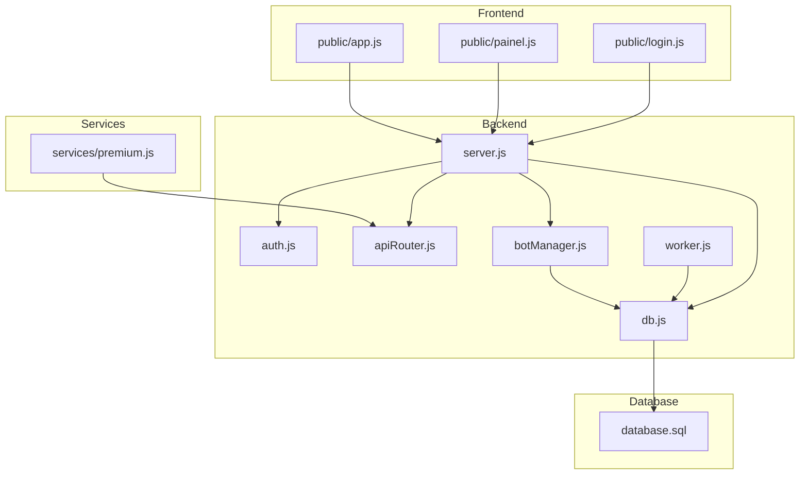
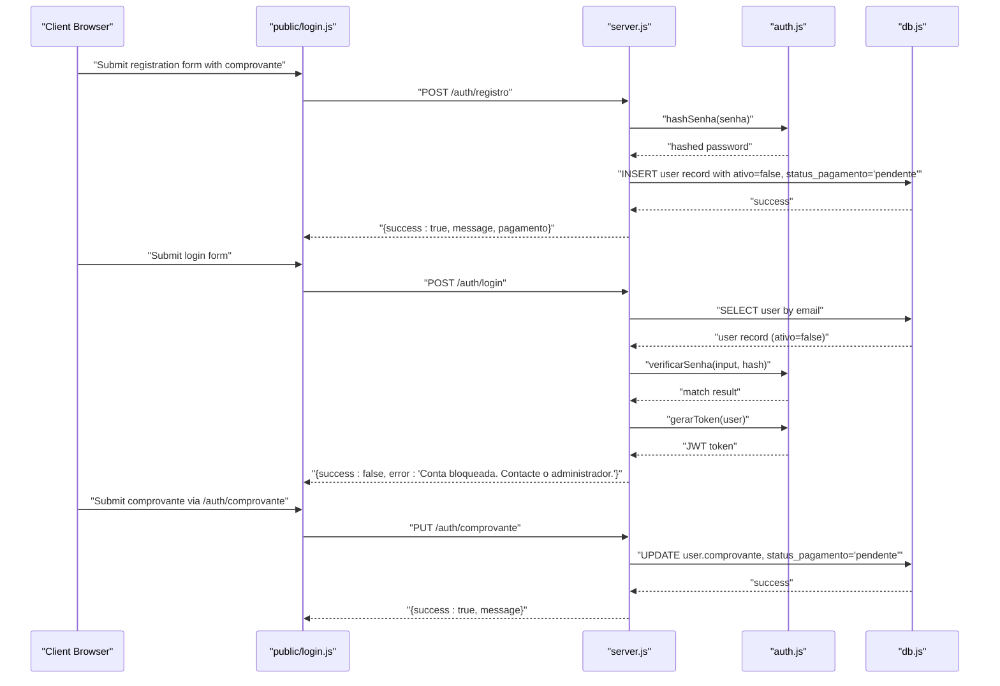
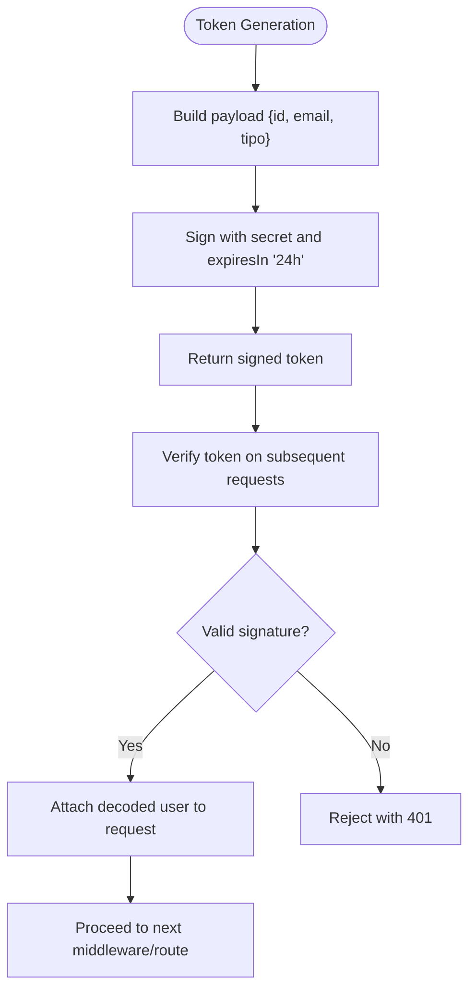
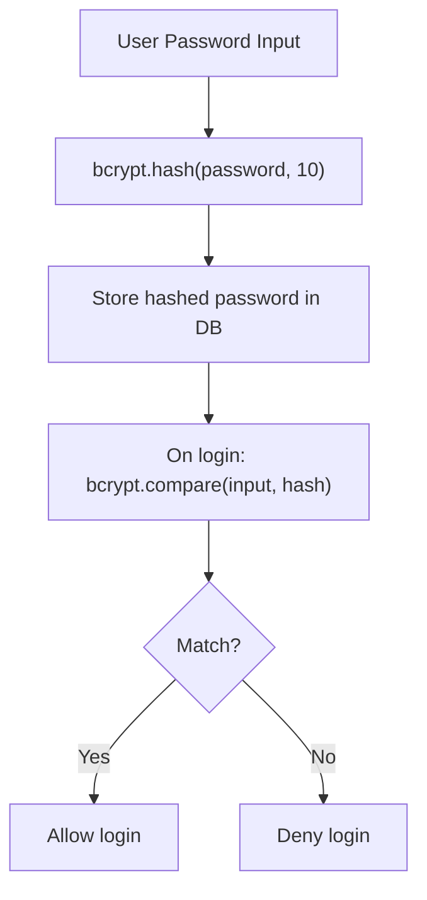
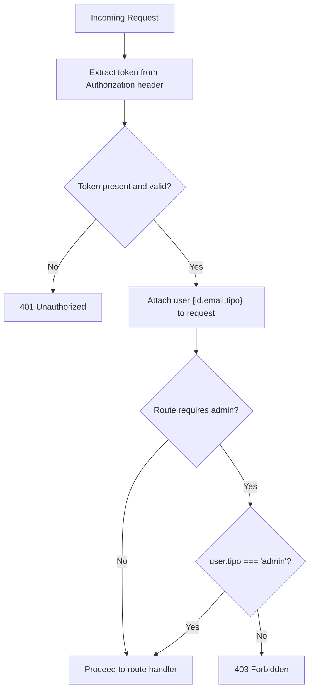
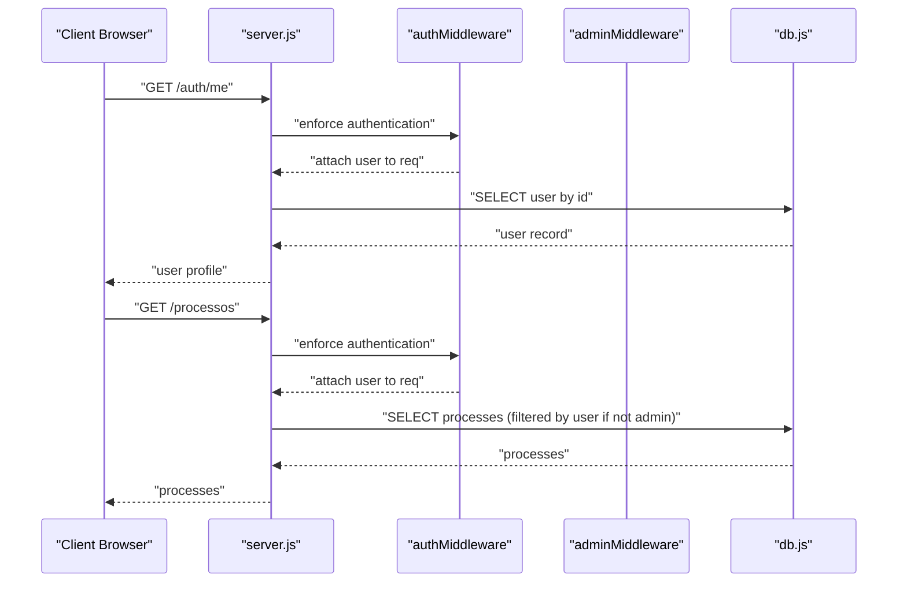
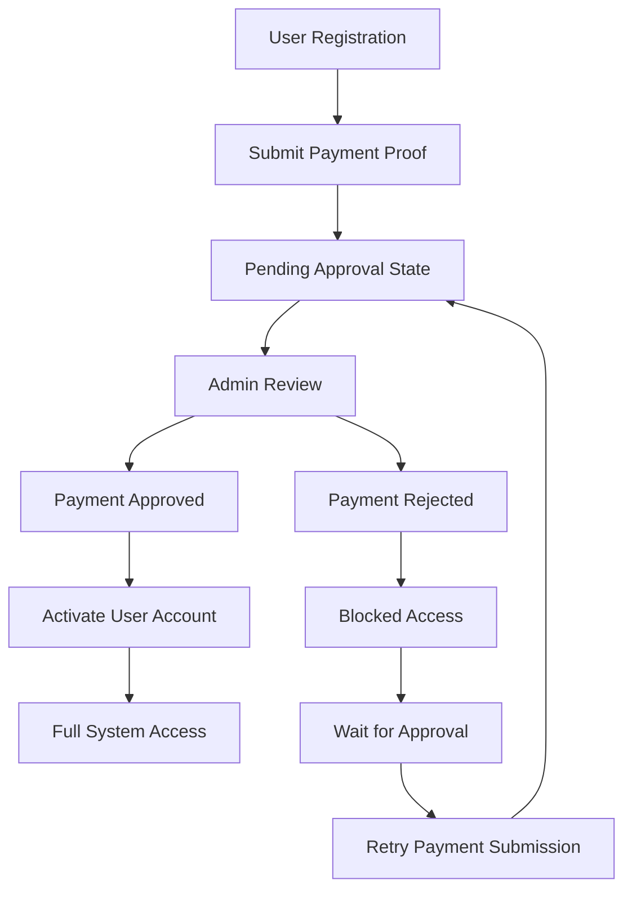
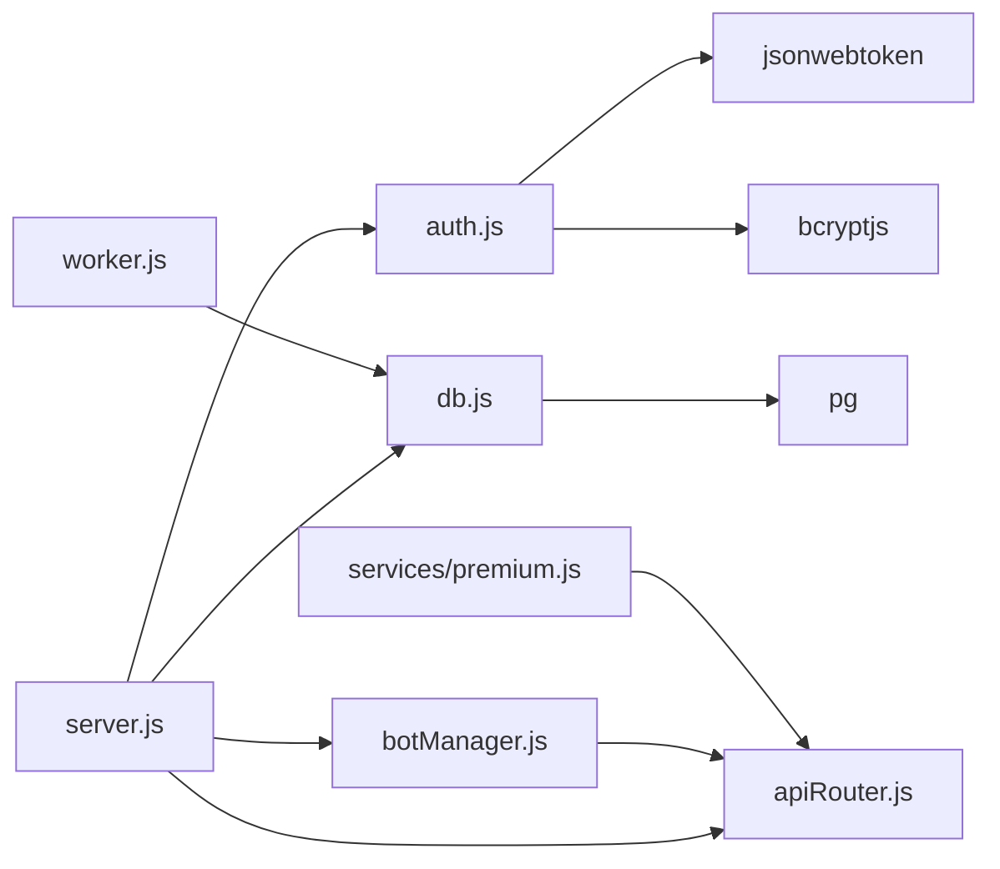

# Authentication System

<cite>
**Referenced Files in This Document**
- [auth.js](file://auth.js)
- [server.js](file://server.js)
- [db.js](file://db.js)
- [database.sql](file://database.sql)
- [apiRouter.js](file://apiRouter.js)
- [botManager.js](file://botManager.js)
- [worker.js](file://worker.js)
- [package.json](file://package.json)
- [public/login.js](file://public/login.js)
- [public/painel.js](file://public/painel.js)
- [public/app.js](file://public/app.js)
- [services/premium.js](file://services/premium.js)
</cite>

## Update Summary
**Changes Made**
- Added comprehensive payment verification workflow documentation
- Enhanced authentication endpoints section with payment-related fields
- Updated database schema to include payment tracking columns
- Added payment status management endpoints and UI components
- Expanded security considerations to cover payment verification flows

## Table of Contents
1. [Introduction](#introduction)
2. [Project Structure](#project-structure)
3. [Core Components](#core-components)
4. [Architecture Overview](#architecture-overview)
5. [Detailed Component Analysis](#detailed-component-analysis)
6. [Payment Verification Workflow](#payment-verification-workflow)
7. [Dependency Analysis](#dependency-analysis)
8. [Performance Considerations](#performance-considerations)
9. [Security Considerations](#security-considerations)
10. [Troubleshooting Guide](#troubleshooting-guide)
11. [Conclusion](#conclusion)

## Introduction
This document provides comprehensive authentication system documentation for a multi-user SaaS platform that enables users to register, log in, and manage judicial process monitoring via Telegram bots. The system implements JWT-based authentication, bcrypt password hashing, role-based access control (RBAC), and secure session management. **Enhanced with payment verification workflow**, the system now includes payment status checks during login, user activation based on payment approval, and comprehensive payment verification logic. It covers the complete authentication flow from user registration through login to token validation, along with middleware usage in API routes, token refresh mechanisms, and session management. Practical examples of authentication endpoints are included with request/response schemas, and security considerations address token expiration, CSRF protection, and secure transport requirements.

## Project Structure
The authentication system spans backend services, database schema, and frontend client applications. Key components include:
- Authentication utilities: JWT token generation and verification, bcrypt password hashing, and middleware for authentication and RBAC
- API server: Express-based endpoints for registration, login, protected resource access, and user management
- Database: PostgreSQL schema for storing user credentials, roles, monitored processes, and payment verification data
- Frontend clients: Login and dashboard pages that handle token storage, payment verification UI, and protected route access

**Diagram sources**
- [server.js:1-162](file://server.js#L1-L162)
- [auth.js:1-59](file://auth.js#L1-L59)
- [db.js:1-11](file://db.js#L1-L11)
- [database.sql:1-25](file://database.sql#L1-L25)
- [apiRouter.js:1-19](file://apiRouter.js#L1-L19)
- [botManager.js:1-53](file://botManager.js#L1-L53)
- [worker.js:1-70](file://worker.js#L1-L70)
- [public/login.js:1-91](file://public/login.js#L1-L91)
- [public/painel.js:1-158](file://public/painel.js#L1-L158)
- [public/app.js:1-53](file://public/app.js#L1-L53)
- [services/premium.js:1-12](file://services/premium.js#L1-L12)

**Section sources**
- [server.js:1-162](file://server.js#L1-L162)
- [auth.js:1-59](file://auth.js#L1-L59)
- [db.js:1-11](file://db.js#L1-L11)
- [database.sql:1-25](file://database.sql#L1-L25)
- [package.json:1-21](file://package.json#L1-L21)

## Core Components
This section outlines the primary authentication components and their responsibilities:
- JWT utilities: token generation with expiration and verification
- Password hashing: bcrypt-based hashing and comparison
- Authentication middleware: extracting and validating tokens from requests
- Role-based middleware: enforcing admin-only access
- API endpoints: registration, login, protected profile retrieval, and administrative user creation
- Frontend integration: token storage and protected route access
- **Payment verification workflow**: payment proof submission, status tracking, and user activation

Key implementation patterns:
- Token payload includes user identity and role for efficient authorization checks
- Passwords are hashed with bcrypt before persistence
- Middleware enforces authentication and role checks before accessing protected resources
- Frontend stores tokens locally and attaches Authorization headers to protected requests
- **Payment verification flow includes comprovante submission and status tracking**

**Section sources**
- [auth.js:1-59](file://auth.js#L1-L59)
- [server.js:11-68](file://server.js#L11-L68)
- [server.js:124-135](file://server.js#L124-L135)
- [public/login.js:18-46](file://public/login.js#L18-L46)
- [public/painel.js:37-42](file://public/painel.js#L37-L42)

## Architecture Overview
The authentication architecture integrates frontend clients, backend API, middleware, and database. The flow begins with user registration and login, proceeds through token issuance, and continues with protected resource access enforced by middleware. **Enhanced with payment verification workflow**, users must submit payment proof and wait for admin approval before gaining full access.

**Diagram sources**
- [server.js:11-68](file://server.js#L11-L68)
- [auth.js:41-49](file://auth.js#L41-L49)
- [auth.js:7-14](file://auth.js#L7-L14)
- [db.js:1-11](file://db.js#L1-L11)
- [public/login.js:18-46](file://public/login.js#L18-L46)

## Detailed Component Analysis

### JWT Token Implementation
The JWT implementation provides secure token generation and verification:
- Token payload includes user identity and role for immediate authorization decisions
- Secret key is configurable via environment variables
- Tokens expire after 24 hours to limit exposure windows

**Diagram sources**
- [auth.js:7-14](file://auth.js#L7-L14)
- [auth.js:17-31](file://auth.js#L17-L31)

**Section sources**
- [auth.js:5-14](file://auth.js#L5-L14)
- [auth.js:17-31](file://auth.js#L17-L31)

### Password Hashing with bcrypt
Password hashing ensures sensitive credentials are stored securely:
- Salt rounds are configured at 10 for balanced security/performance
- Hashing occurs during registration and administrative user creation
- Verification compares input passwords against stored hashes

**Diagram sources**
- [auth.js:41-49](file://auth.js#L41-L49)
- [server.js:15-21](file://server.js#L15-L21)
- [server.js:149-153](file://server.js#L149-L153)

**Section sources**
- [auth.js:41-49](file://auth.js#L41-L49)
- [server.js:15-21](file://server.js#L15-L21)
- [server.js:149-153](file://server.js#L149-L153)

### Role-Based Access Control (RBAC)
RBAC distinguishes between admin and client users:
- Authentication middleware extracts token and validates it
- Admin middleware checks user role before granting access
- Protected routes enforce either authentication or admin privileges

**Diagram sources**
- [auth.js:17-39](file://auth.js#L17-L39)
- [server.js:70-92](file://server.js#L70-L92)
- [server.js:112-122](file://server.js#L112-L122)

**Section sources**
- [auth.js:17-39](file://auth.js#L17-L39)
- [server.js:70-92](file://server.js#L70-L92)
- [server.js:112-122](file://server.js#L112-L122)

### Authentication Middleware Usage in API Routes
Protected routes demonstrate middleware chaining:
- `/auth/me`: Requires authentication to retrieve user profile
- `/processos`: Requires authentication; admin sees all, client sees own records
- `/usuarios`: Requires both authentication and admin role
- `/usuario`: Admin-only endpoint for creating users

**Diagram sources**
- [server.js:124-135](file://server.js#L124-L135)
- [server.js:94-110](file://server.js#L94-L110)
- [server.js:112-122](file://server.js#L112-L122)
- [auth.js:17-31](file://auth.js#L17-L31)

**Section sources**
- [server.js:94-135](file://server.js#L94-L135)
- [auth.js:17-31](file://auth.js#L17-L31)

### Token Refresh Mechanisms and Session Management
Current implementation uses short-lived JWT tokens with 24-hour expiration. While explicit refresh endpoints are not implemented, the system supports:
- Token storage in browser local storage for persistent sessions
- Automatic token attachment via Authorization headers in protected requests
- Logout functionality that clears stored tokens

Practical considerations:
- Implement refresh endpoints to issue new tokens while maintaining session continuity
- Consider sliding expiration or refresh token rotation for enhanced security
- Enforce secure, same-site cookies for token storage in production environments

**Section sources**
- [public/login.js:37-39](file://public/login.js#L37-L39)
- [public/painel.js:148-152](file://public/painel.js#L148-L152)
- [auth.js:11-13](file://auth.js#L11-L13)

### Authentication Endpoints and Schemas
The system exposes the following authentication-related endpoints:

- POST /auth/registro
  - Purpose: Register a new user with hashed password and optional Telegram bot configuration
  - Request body: email, senha, telegram_id, bot_token, api_key, modo, comprovante
  - Response: success flag, user id, message, pagamento (payment instructions)
  - Security: Password hashed before insertion; duplicate email detection handled
  - **Enhanced**: User created with ativo=false and status_pagamento='pendente'

- POST /auth/login
  - Purpose: Authenticate user and return JWT token
  - Request body: email, senha
  - Response: success flag, token, user {id, email, tipo, ativo, status_pagamento}
  - Security: Password verified against stored hash; token issued with 24h expiration
  - **Enhanced**: Login blocked for inactive users (ativo=false)

- GET /auth/me
  - Purpose: Retrieve authenticated user's profile
  - Headers: Authorization: Bearer <token>
  - Response: user profile fields including role, mode, and payment status
  - Security: Requires valid JWT; user id extracted from token payload

- POST /usuario (admin)
  - Purpose: Create a new user (admin-only)
  - Headers: Authorization: Bearer <token>
  - Request body: email, senha, telegram_id, bot_token, api_key, modo, tipo
  - Response: success flag, user id, message
  - Security: Requires admin role; password hashed before insertion

- GET /processos
  - Purpose: List processes; clients see only their own, admins see all
  - Headers: Authorization: Bearer <token>
  - Response: array of process records with optional user email column for admins
  - Security: Requires authentication; query filtered by user id for non-admins

- GET /usuarios (admin)
  - Purpose: List all users (admin-only)
  - Headers: Authorization: Bearer <token>
  - Response: array of user records including payment status and comprovante
  - Security: Requires admin role

- PUT /auth/comprovante (authenticated)
  - Purpose: Submit payment proof for user account verification
  - Headers: Authorization: Bearer <token>
  - Request body: comprovante (payment proof URL)
  - Response: success flag, message indicating pending approval
  - Security: Requires authentication; updates comprovante and status_pagamento fields

- PUT /usuario/:id (admin)
  - Purpose: Update user account settings (admin-only)
  - Headers: Authorization: Bearer <token>
  - Request body: ativo, modo, tipo, status_pagamento
  - Response: success flag, message
  - Security: Requires admin role; allows payment status updates

**Section sources**
- [server.js:11-68](file://server.js#L11-L68)
- [server.js:61-101](file://server.js#L61-L101)
- [server.js:70-92](file://server.js#L70-L92)
- [server.js:94-122](file://server.js#L94-L122)
- [server.js:124-135](file://server.js#L124-L135)
- [server.js:259-273](file://server.js#L259-L273)
- [server.js:165-206](file://server.js#L165-L206)

## Payment Verification Workflow

**Updated** Enhanced authentication system now includes comprehensive payment verification workflow

The payment verification workflow adds a crucial layer to the authentication system, enabling subscription-based access control:

### Payment Flow Architecture

**Diagram sources**
- [server.js:25-59](file://server.js#L25-L59)
- [server.js:61-101](file://server.js#L61-L101)
- [server.js:165-206](file://server.js#L165-L206)
- [public/login.js:37-40](file://public/login.js#L37-L40)

### Database Schema Enhancements
The user table has been enhanced with payment-related fields:

- **comprovante**: Stores payment proof URL or identifier
- **status_pagamento**: Tracks payment verification status (pendente, aprovado, rejeitado)
- **ativo**: Controls account activation state (true/false)

Migration script automatically adds these columns to existing installations.

### Frontend Payment UI Components
The login interface provides clear feedback for payment-pending accounts:

- **Payment Instructions**: Displays Pix payment details when account is pending approval
- **Status Indicators**: Shows payment status in user dashboard
- **Comprovante Upload**: Allows users to submit payment proof

### Admin Payment Management
Administrators can manage payment verification through the dashboard:

- **Payment Status View**: Color-coded status indicators (green for approved, yellow for pending, red for rejected)
- **Direct Approve/Reject**: One-click payment approval or rejection
- **Comprovante Preview**: Links to submitted payment proof documents

**Section sources**
- [server.js:25-59](file://server.js#L25-L59)
- [server.js:61-101](file://server.js#L61-L101)
- [server.js:165-206](file://server.js#L165-L206)
- [public/login.js:37-40](file://public/login.js#L37-L40)
- [public/painel.js:96-136](file://public/painel.js#L96-L136)

## Dependency Analysis
The authentication system relies on several external libraries and internal modules:
- jsonwebtoken: JWT token signing and verification
- bcryptjs: Password hashing and comparison
- dotenv: Environment variable loading
- express: Web framework for API endpoints
- pg: PostgreSQL client for database operations

**Diagram sources**
- [server.js:1-10](file://server.js#L1-L10)
- [auth.js:1-3](file://auth.js#L1-L3)
- [db.js:1-11](file://db.js#L1-L11)
- [botManager.js:1-4](file://botManager.js#L1-L4)
- [worker.js:1-5](file://worker.js#L1-L5)
- [package.json:11-19](file://package.json#L11-L19)
- [services/premium.js:1-12](file://services/premium.js#L1-L12)

**Section sources**
- [package.json:11-19](file://package.json#L11-L19)
- [server.js:1-10](file://server.js#L1-L10)
- [auth.js:1-3](file://auth.js#L1-L3)

## Performance Considerations
- Token verification overhead: Minimal cost due to symmetric signing; cache decoded user data in request scope if needed
- Password hashing cost: bcrypt cost factor 10 balances security and performance; adjust based on hardware capabilities
- Database queries: Use prepared statements and parameterized queries to prevent SQL injection and improve performance
- Middleware chain: Keep middleware lightweight; avoid heavy computations in auth middlewares
- Frontend caching: Cache user data locally to reduce repeated API calls for the same session
- **Payment verification**: Index payment-related fields for faster admin dashboard queries

## Security Considerations
- Token expiration: JWT tokens expire after 24 hours; consider implementing refresh endpoints for continuous sessions
- Transport security: Enforce HTTPS in production to protect tokens in transit
- Token storage: Local storage is convenient but vulnerable to XSS; consider secure, same-site cookies for production
- CSRF protection: Implement CSRF tokens for state-changing requests; validate Origin/CORS headers
- Input validation: Sanitize and validate all user inputs; enforce strong password policies
- Role enforcement: Always verify user roles before granting administrative access
- Secret management: Store JWT_SECRET and database credentials in environment variables
- Rate limiting: Implement rate limiting on authentication endpoints to prevent brute force attacks
- Audit logging: Log authentication events and failed attempts for security monitoring
- **Payment security**: Store payment proof URLs securely; implement access controls for admin-only payment review
- **Account activation**: Prevent login for inactive users until payment is verified

## Troubleshooting Guide
Common authentication issues and resolutions:
- 401 Token not provided: Ensure Authorization header includes Bearer token
- 401 Invalid token: Verify token was generated with correct secret and hasn't expired
- 403 Access restricted to administrators: Confirm user role is set to admin
- 400 Email already registered: Handle duplicate email errors gracefully in frontend
- 401 Email or password incorrect: Verify credentials match stored hash
- **403 Conta bloqueada**: User account pending payment verification; contact administrator
- **500 Payment verification errors**: Check payment proof URL format and admin approval status
- Token not persisting: Check browser local storage permissions and CORS configuration

Debugging steps:
- Verify environment variables are loaded correctly
- Check database connectivity and user table structure
- Validate JWT secret configuration
- Inspect network tab for Authorization header presence
- Review server logs for authentication errors
- **Check payment verification fields**: Verify comprovante and status_pagamento values in database

**Section sources**
- [server.js:20-35](file://server.js#L20-L35)
- [server.js:49-52](file://server.js#L49-L52)
- [auth.js:17-31](file://auth.js#L17-L31)
- [public/login.js:37-42](file://public/login.js#L37-L42)

## Conclusion
The authentication system provides a robust foundation for user registration, login, and role-based access control. **Enhanced with payment verification workflow**, the system now supports subscription-based access control with comprehensive payment proof submission, admin approval processes, and automated user activation. JWT tokens with 24-hour expiration, bcrypt password hashing, and middleware-based authorization create a secure and scalable solution. The frontend integration demonstrates practical token storage, payment UI components, and protected route access. For production deployment, consider implementing refresh endpoints, secure cookie storage, CSRF protection, and enhanced input validation to meet enterprise security requirements. The payment verification workflow adds significant business value while maintaining the system's security and scalability.