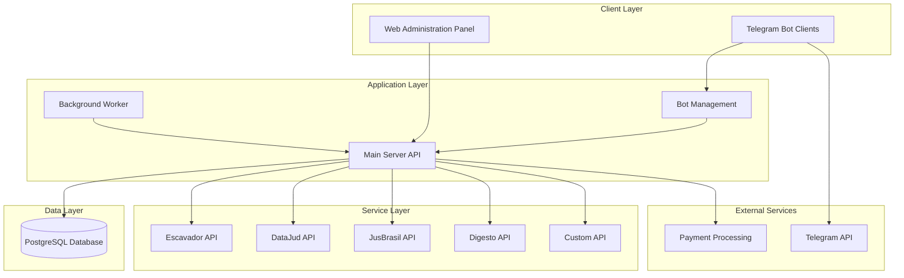
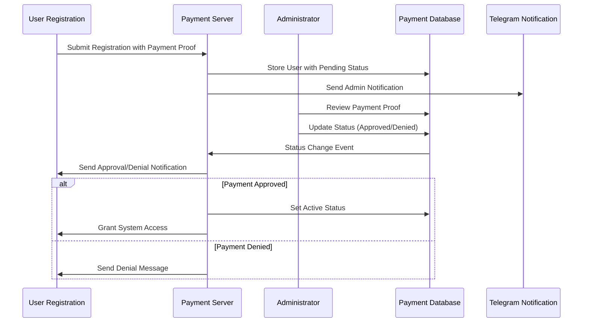
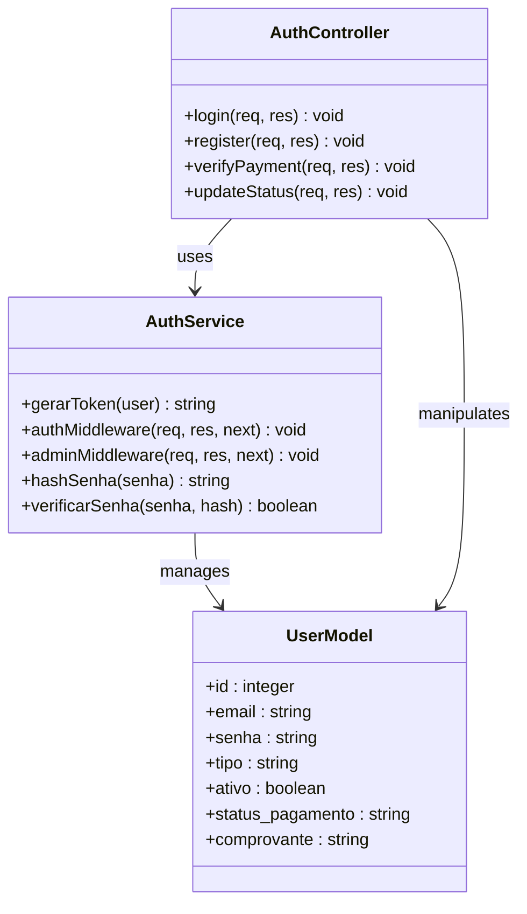
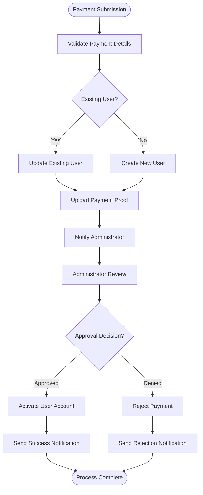
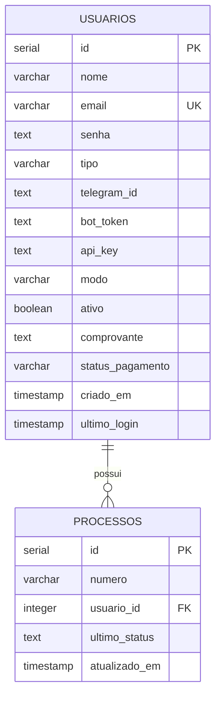
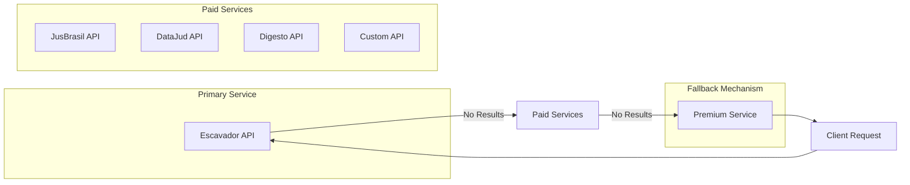

# Payment Verification System

<cite>
**Referenced Files in This Document**
- [README.md](file://README.md)
- [package.json](file://package.json)
- [server.js](file://server.js)
- [auth.js](file://auth.js)
- [db.js](file://db.js)
- [database.sql](file://database.sql)
- [apiRouter.js](file://apiRouter.js)
- [botManager.js](file://botManager.js)
- [worker.js](file://worker.js)
- [services/escavador.js](file://services/escavador.js)
- [services/datajud.js](file://services/datajud.js)
- [services/jusbrasil.js](file://services/jusbrasil.js)
- [services/digesto.js](file://services/digesto.js)
- [services/custom.js](file://services/custom.js)
- [services/premium.js](file://services/premium.js)
</cite>

## Table of Contents
1. [Introduction](#introduction)
2. [System Architecture](#system-architecture)
3. [Payment Verification Workflow](#payment-verification-workflow)
4. [Core Components](#core-components)
5. [Database Schema](#database-schema)
6. [Service Integration](#service-integration)
7. [Security Implementation](#security-implementation)
8. [Operational Management](#operational-management)
9. [Troubleshooting Guide](#troubleshooting-guide)
10. [Conclusion](#conclusion)

## Introduction

The Payment Verification System is a comprehensive SaaS platform designed for judicial process monitoring and management via Telegram bots. This system provides multi-user functionality with individual Telegram bots, integrates with both free and paid legal databases, offers an administrative dashboard, and includes automated monitoring capabilities for legal case updates.

The platform operates as a multi-tenant solution where users can register, pay for service access, and receive notifications about legal case developments through Telegram channels. The system supports three pricing modes: free, hybrid, and paid, with flexible payment verification mechanisms.

## System Architecture

The Payment Verification System follows a modular microservices architecture with clear separation of concerns:

**Diagram sources**
- [server.js:1-366](file://server.js#L1-L366)
- [worker.js:1-74](file://worker.js#L1-L74)
- [botManager.js:1-190](file://botManager.js#L1-L190)

The architecture consists of four primary layers:

1. **Presentation Layer**: Web administration panel and Telegram bot interfaces
2. **Application Layer**: Core business logic and API endpoints
3. **Service Layer**: Integration with external legal databases
4. **Data Layer**: Persistent storage and session management

## Payment Verification Workflow

The payment verification system implements a comprehensive approval workflow that ensures proper payment validation before granting system access:

**Diagram sources**
- [server.js:25-59](file://server.js#L25-L59)
- [server.js:259-273](file://server.js#L259-L273)
- [server.js:165-206](file://server.js#L165-L206)

The payment verification workflow includes several key stages:

### Registration and Initial Validation
Users submit registration requests with payment proof attachments. The system validates email uniqueness and stores the registration with pending status while awaiting administrator review.

### Administrator Review Process
Administrators receive notifications about new payment submissions and can review payment proofs. The system maintains detailed audit trails of all payment verification activities.

### Automated Status Updates
Once payment verification is complete, the system automatically updates user status and sends appropriate notifications through Telegram channels.

**Section sources**
- [server.js:25-59](file://server.js#L25-L59)
- [server.js:259-273](file://server.js#L259-L273)
- [server.js:165-206](file://server.js#L165-L206)

## Core Components

### Authentication and Authorization System

The system implements a robust JWT-based authentication mechanism with role-based access control:

**Diagram sources**
- [auth.js:1-59](file://auth.js#L1-L59)
- [server.js:62-101](file://server.js#L62-L101)

The authentication system provides:

- **JWT Token Generation**: Secure token creation with 24-hour expiration
- **Role-Based Access Control**: Admin and client role differentiation
- **Password Security**: bcrypt-based password hashing with salt
- **Middleware Protection**: Request validation and authorization enforcement

### Payment Processing Module

The payment processing module handles various payment verification scenarios:

**Diagram sources**
- [server.js:25-59](file://server.js#L25-L59)
- [server.js:259-273](file://server.js#L259-L273)

**Section sources**
- [auth.js:1-59](file://auth.js#L1-L59)
- [server.js:62-101](file://server.js#L62-L101)

## Database Schema

The system utilizes a PostgreSQL database with comprehensive user and payment tracking capabilities:

**Diagram sources**
- [database.sql:5-24](file://database.sql#L5-L24)
- [server.js:282-346](file://server.js#L282-L346)

The database schema supports:

- **User Management**: Comprehensive user profiles with role-based permissions
- **Payment Tracking**: Detailed payment verification and status tracking
- **Process Monitoring**: Association between users and monitored legal processes
- **Audit Trail**: Complete logging of user activities and system events

**Section sources**
- [database.sql:5-24](file://database.sql#L5-L24)
- [server.js:282-346](file://server.js#L282-L346)

## Service Integration

The system integrates with multiple legal database services, implementing a tiered approach to data retrieval:

**Diagram sources**
- [apiRouter.js:14-37](file://apiRouter.js#L14-L37)
- [services/escavador.js:10-25](file://services/escavador.js#L10-L25)
- [services/jusbrasil.js:10-25](file://services/jusbrasil.js#L10-L25)

### Service Configuration

Each service requires specific API keys configured through environment variables:

| Service | Environment Variable | Purpose |
|---------|---------------------|---------|
| Escavador | ESCAVADOR_API_KEY | Primary legal database access |
| DataJud | DATAJUD_API_KEY | CNJ public database access |
| JusBrasil | JUSBRASIL_API_KEY | Advanced legal research |
| Digesto | DIGESTO_API_KEY | Legal document processing |
| Custom | TJ_API_KEY | Custom tribunal integration |

**Section sources**
- [apiRouter.js:14-37](file://apiRouter.js#L14-L37)
- [services/escavador.js:3-7](file://services/escavador.js#L3-L7)
- [services/datajud.js:3-5](file://services/datajud.js#L3-L5)

## Security Implementation

The system implements multiple layers of security to protect user data and maintain system integrity:

### Authentication Security
- **JWT Token Management**: Secure token generation with expiration handling
- **Password Protection**: bcrypt hashing with salt for all password storage
- **Request Validation**: Comprehensive input sanitization and validation

### Authorization Controls
- **Role-Based Access**: Admin-only operations restricted through middleware
- **User Isolation**: Client users can only access their own data
- **Token Verification**: Real-time JWT validation for all protected routes

### Data Protection
- **Environment Variables**: All sensitive configuration stored securely
- **Database Encryption**: Passwords hashed, not stored in plaintext
- **Audit Logging**: Complete tracking of all system operations

**Section sources**
- [auth.js:8-31](file://auth.js#L8-L31)
- [server.js:104-127](file://server.js#L104-L127)

## Operational Management

### Administrative Dashboard
The system provides a comprehensive administrative interface for managing users, monitoring system performance, and overseeing payment verification processes.

### User Management
Administrators can:
- View all registered users with payment status
- Approve or deny payment verification requests
- Modify user account configurations
- Monitor system usage and performance metrics

### System Monitoring
The worker component continuously monitors legal processes and sends automated notifications to users via Telegram channels.

**Section sources**
- [server.js:148-163](file://server.js#L148-L163)
- [worker.js:17-65](file://worker.js#L17-L65)

## Troubleshooting Guide

### Common Issues and Solutions

**Payment Verification Failures**
- Verify payment proof upload and administrator notification
- Check database connection and user record creation
- Confirm email notification delivery to administrators

**Service Integration Problems**
- Validate API key configuration in environment variables
- Check service availability and rate limiting
- Review service-specific error messages and logs

**Telegram Bot Issues**
- Verify bot token configuration in user records
- Check Telegram API connectivity and rate limits
- Ensure proper bot initialization and polling configuration

**Database Connection Problems**
- Verify PostgreSQL connection string configuration
- Check database credentials and network connectivity
- Review migration script execution and table creation

### Performance Optimization
- Implement caching strategies for frequently accessed data
- Optimize database queries and indexing
- Monitor service response times and implement timeouts
- Configure appropriate rate limiting for external API calls

**Section sources**
- [worker.js:17-65](file://worker.js#L17-L65)
- [services/datajud.js:76-124](file://services/datajud.js#L76-L124)

## Conclusion

The Payment Verification System represents a comprehensive solution for judicial process monitoring with robust payment verification capabilities. The system's modular architecture, multi-layered security implementation, and flexible service integration provide a scalable foundation for legal technology applications.

Key strengths of the system include:

- **Flexible Pricing Model**: Support for free, hybrid, and paid service tiers
- **Comprehensive Payment Verification**: Automated approval workflow with administrator oversight
- **Multi-Service Integration**: Extensible architecture supporting various legal database providers
- **Robust Security**: Enterprise-grade authentication and authorization mechanisms
- **Scalable Architecture**: Microservices-based design supporting growth and maintenance

The system provides a solid foundation for legal technology services while maintaining flexibility for future enhancements and integration with additional legal databases and payment processing solutions.