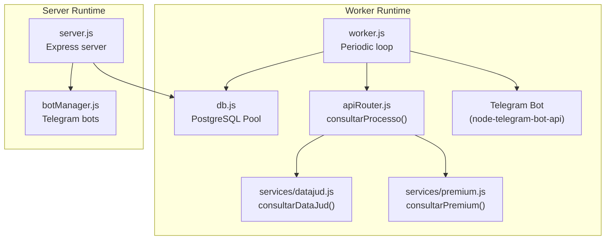
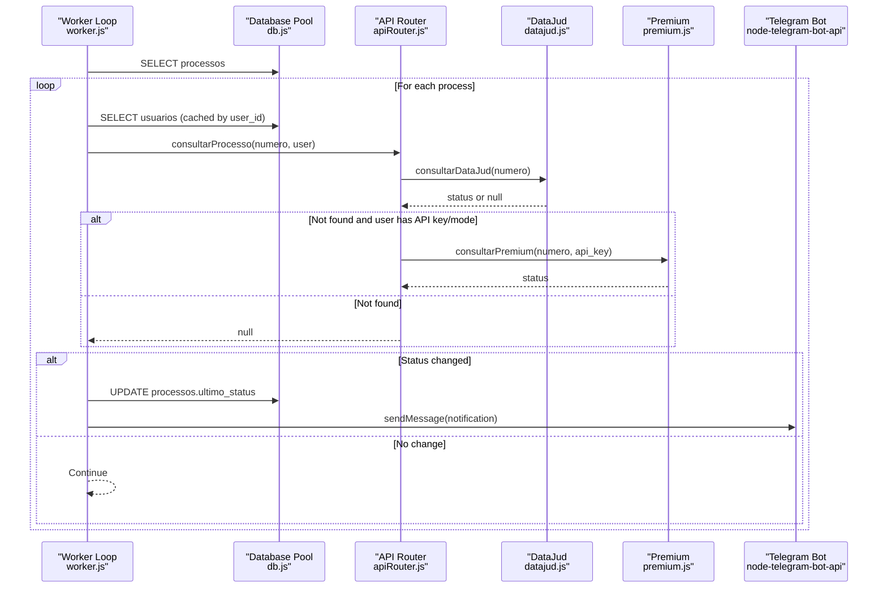
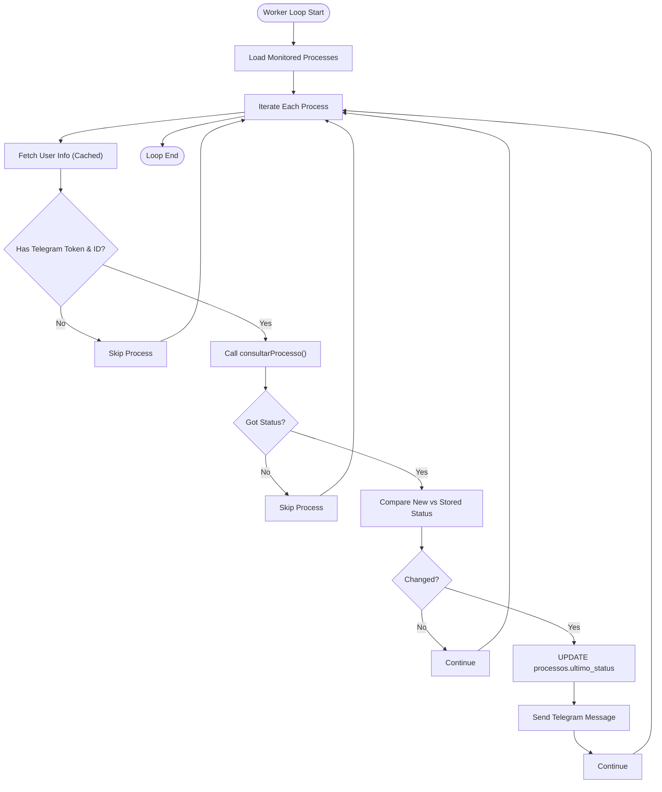
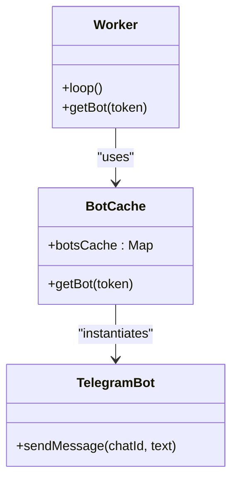
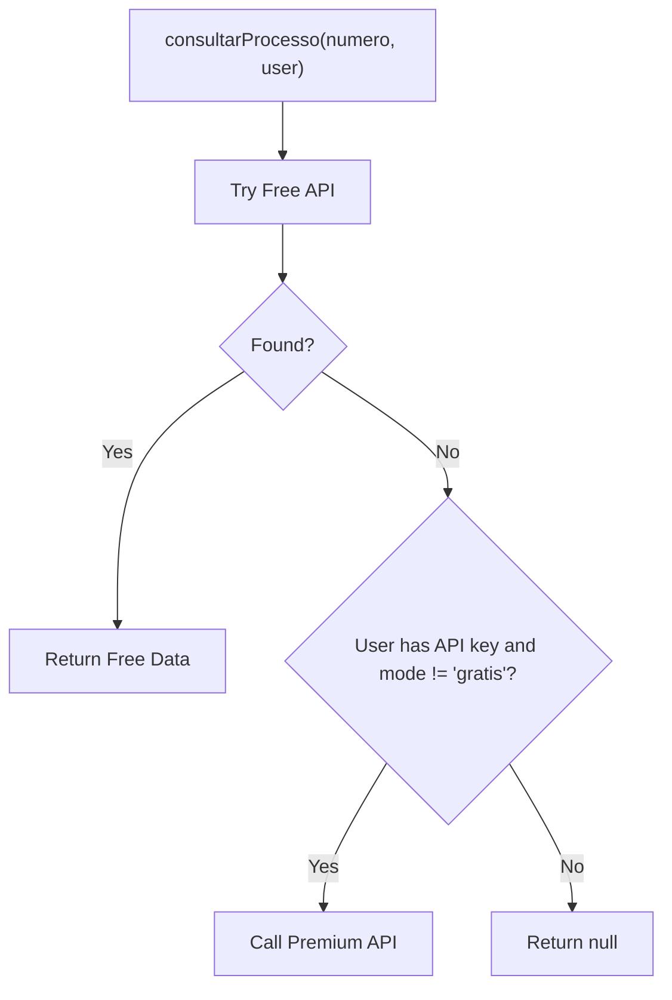
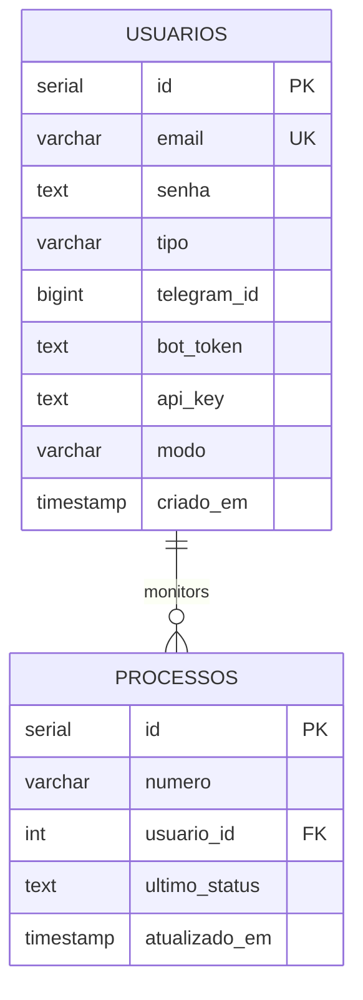
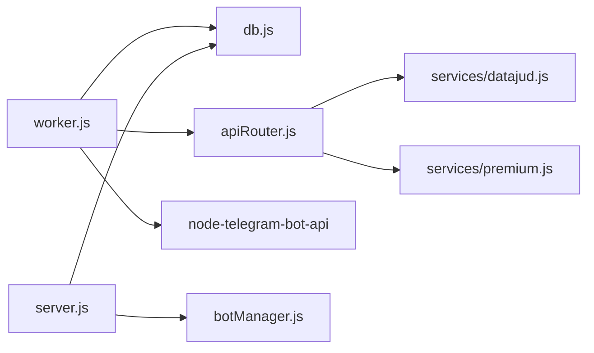

# Background Worker System

<cite>
**Referenced Files in This Document**
- [worker.js](file://worker.js)
- [apiRouter.js](file://apiRouter.js)
- [datajud.js](file://services/datajud.js)
- [premium.js](file://services/premium.js)
- [db.js](file://db.js)
- [botManager.js](file://botManager.js)
- [server.js](file://server.js)
- [database.sql](file://database.sql)
- [package.json](file://package.json)
- [README.md](file://README.md)
</cite>

## Table of Contents
1. [Introduction](#introduction)
2. [Project Structure](#project-structure)
3. [Core Components](#core-components)
4. [Architecture Overview](#architecture-overview)
5. [Detailed Component Analysis](#detailed-component-analysis)
6. [Dependency Analysis](#dependency-analysis)
7. [Performance Considerations](#performance-considerations)
8. [Troubleshooting Guide](#troubleshooting-guide)
9. [Conclusion](#conclusion)
10. [Appendices](#appendices)

## Introduction
This document describes the background worker system responsible for automatically monitoring judicial process statuses at scheduled intervals. It covers the worker architecture, process monitoring logic, status change detection, and notification delivery via Telegram. It also documents configuration, performance optimization strategies, error handling, scaling considerations, health monitoring, and graceful shutdown procedures.

## Project Structure
The worker operates as a standalone Node.js process that periodically queries monitored processes, validates their status against stored data, and sends Telegram notifications when changes are detected. It integrates with a PostgreSQL database for persistence and uses external APIs for process data retrieval.

**Diagram sources**
- [worker.js:1-70](file://worker.js#L1-L70)
- [apiRouter.js:1-19](file://apiRouter.js#L1-L19)
- [datajud.js:1-32](file://services/datajud.js#L1-L32)
- [premium.js:1-12](file://services/premium.js#L1-L12)
- [db.js:1-11](file://db.js#L1-L11)
- [botManager.js:1-53](file://botManager.js#L1-L53)
- [server.js:1-162](file://server.js#L1-L162)

**Section sources**
- [README.md:28-41](file://README.md#L28-L41)
- [package.json:7-9](file://package.json#L7-L9)

## Core Components
- Worker loop: Periodically scans monitored processes, fetches latest status, compares with stored value, updates database, and notifies via Telegram when a change is detected.
- API router: Orchestrates free and paid status checks with fallback logic.
- Data services: Free API client for CNJ and a placeholder for premium provider integration.
- Database pool: Centralized PostgreSQL connection pool for all database operations.
- Telegram bot cache: Reuses bot instances per token to avoid redundant initialization.
- Server-side bot manager: Manages long-running Telegram bots for interactive commands.

**Section sources**
- [worker.js:17-61](file://worker.js#L17-L61)
- [apiRouter.js:4-16](file://apiRouter.js#L4-L16)
- [datajud.js:3-29](file://services/datajud.js#L3-L29)
- [premium.js:1-12](file://services/premium.js#L1-L12)
- [db.js:4-10](file://db.js#L4-L10)
- [botManager.js:7-42](file://botManager.js#L7-L42)

## Architecture Overview
The worker runs independently from the main server. It performs a full scan of monitored processes, validates each entry, and triggers notifications. The server maintains interactive Telegram bots for manual commands and user onboarding.

**Diagram sources**
- [worker.js:17-61](file://worker.js#L17-L61)
- [apiRouter.js:4-16](file://apiRouter.js#L4-L16)
- [datajud.js:3-29](file://services/datajud.js#L3-L29)
- [premium.js:1-12](file://services/premium.js#L1-L12)

## Detailed Component Analysis

### Worker Loop and Monitoring Algorithm
- Initialization: Starts immediately and repeats every fixed interval.
- Data retrieval: Fetches all monitored processes and groups user data to minimize repeated queries.
- Validation: Ensures user has Telegram credentials and a valid bot token.
- API call: Uses the API router to fetch the latest status, preferring free data and falling back to paid when configured.
- Status comparison: Compares returned timestamp with the stored last status; if different, proceeds to update and notify.
- Update and notify: Writes the new status to the database and sends a Telegram message to the user.

**Diagram sources**
- [worker.js:17-61](file://worker.js#L17-L61)
- [apiRouter.js:4-16](file://apiRouter.js#L4-L16)

**Section sources**
- [worker.js:17-61](file://worker.js#L17-L61)

### Telegram Bot Management
- Caching: Bots are cached by token to avoid reinitialization overhead.
- Notification: Sends a formatted message upon status changes.
- Server-side bots: Separate long-running bots handle interactive commands; worker uses cached instances for notifications.

**Diagram sources**
- [worker.js:9-15](file://worker.js#L9-L15)

**Section sources**
- [worker.js:9-15](file://worker.js#L9-L15)
- [botManager.js:7-42](file://botManager.js#L7-L42)

### API Orchestration and Fallback Logic
- Free API: Attempts a free lookup first.
- Paid fallback: If enabled by user mode and API key exists, tries the premium provider.
- Consistent response shape: Returns normalized fields for number, court, class, and last update timestamp.

**Diagram sources**
- [apiRouter.js:4-16](file://apiRouter.js#L4-L16)

**Section sources**
- [apiRouter.js:4-16](file://apiRouter.js#L4-L16)

### Database Schema and Persistence
- Users table stores Telegram identifiers, bot tokens, API keys, and mode preferences.
- Processes table tracks monitored case numbers, references to users, last observed status, and timestamps.

**Diagram sources**
- [database.sql:5-24](file://database.sql#L5-L24)

**Section sources**
- [database.sql:5-24](file://database.sql#L5-L24)

## Dependency Analysis
- worker.js depends on:
  - Database pool for process and user queries
  - API router for status retrieval
  - Telegram bot library for notifications
- apiRouter.js depends on:
  - Free service client
  - Premium service client
- Services depend on:
  - HTTP client for external APIs
- server.js coordinates:
  - Interactive Telegram bots
  - Database initialization and admin bootstrap

**Diagram sources**
- [worker.js:1-70](file://worker.js#L1-L70)
- [apiRouter.js:1-19](file://apiRouter.js#L1-L19)
- [datajud.js:1-32](file://services/datajud.js#L1-L32)
- [premium.js:1-12](file://services/premium.js#L1-L12)
- [db.js:1-11](file://db.js#L1-L11)
- [botManager.js:1-53](file://botManager.js#L1-L53)
- [server.js:1-162](file://server.js#L1-L162)

**Section sources**
- [worker.js:1-70](file://worker.js#L1-L70)
- [apiRouter.js:1-19](file://apiRouter.js#L1-L19)
- [datajud.js:1-32](file://services/datajud.js#L1-L32)
- [premium.js:1-12](file://services/premium.js#L1-L12)
- [db.js:1-11](file://db.js#L1-L11)
- [botManager.js:1-53](file://botManager.js#L1-L53)
- [server.js:1-162](file://server.js#L1-L162)

## Performance Considerations
- Scheduling interval: The worker runs every fixed interval; adjust based on desired responsiveness and external API rate limits.
- Batch and caching:
  - Group processes by user to reduce repeated user queries.
  - Cache Telegram bot instances by token to avoid initialization overhead.
- Database efficiency:
  - Use connection pooling via the existing PostgreSQL pool.
  - Minimize round-trips by fetching user data once per user per cycle.
- External API throughput:
  - Free tier may throttle requests; consider staggering or limiting concurrent checks.
  - Premium tier can increase throughput but requires careful rate-limit handling.
- Memory management:
  - Avoid accumulating large in-memory caches; keep caches scoped (e.g., per-token bot cache).
  - Dispose of unused resources after each loop iteration.
- Concurrency:
  - Current implementation iterates sequentially; introduce concurrency controls if scaling up.
  - Consider per-user concurrency to respect external API quotas.

[No sources needed since this section provides general guidance]

## Troubleshooting Guide
- Worker does not start:
  - Verify the worker script is available and environment variables are loaded.
  - Confirm the database connection pool is configured and reachable.
- No notifications:
  - Ensure users have Telegram ID and bot token set.
  - Confirm Telegram bot token is valid and the bot is active.
- Status not updating:
  - Check that the API router returns data; free tier may not find all cases.
  - Verify the database update query executes successfully.
- API errors:
  - Free API failures return null; confirm external endpoint availability.
  - Premium API integration should handle timeouts and retries gracefully.
- Graceful shutdown:
  - Implement signal handlers to stop the interval timer and close database connections cleanly.

**Section sources**
- [worker.js:17-61](file://worker.js#L17-L61)
- [apiRouter.js:4-16](file://apiRouter.js#L4-L16)
- [db.js:4-10](file://db.js#L4-L10)

## Conclusion
The background worker system provides automated monitoring of judicial processes with efficient caching, database-driven persistence, and targeted Telegram notifications. By tuning scheduling intervals, leveraging caching, and implementing robust error handling, the system can scale to support many users while respecting external API limitations.

[No sources needed since this section summarizes without analyzing specific files]

## Appendices

### Worker Configuration and Environment
- Scheduling interval: Controlled by the periodic interval in the worker loop.
- Concurrent handling: Current implementation is single-threaded per process; consider introducing concurrency per user or per batch.
- Resource management: Leverage the shared PostgreSQL pool and bot cache to reduce overhead.
- Environment variables: Ensure database credentials and secrets are configured for the worker process.

**Section sources**
- [worker.js:63-67](file://worker.js#L63-L67)
- [db.js:4-10](file://db.js#L4-L10)
- [package.json:7-9](file://package.json#L7-L9)

### Practical Examples
- Worker initialization:
  - Start the worker process using the dedicated script.
  - The worker logs startup and begins the periodic loop immediately.
- Monitoring loop:
  - The loop fetches all monitored processes, caches user data, and iterates through each process.
- Status change notifications:
  - On detection of a change, the worker updates the database and sends a Telegram message to the user.

**Section sources**
- [README.md:34-35](file://README.md#L34-L35)
- [worker.js:17-61](file://worker.js#L17-L61)

### Scaling and Health Monitoring
- Horizontal scaling: Run multiple worker instances behind a scheduler or container orchestration platform.
- Health checks: Expose a lightweight health endpoint and monitor database connectivity and external API reachability.
- Graceful shutdown: Add SIGTERM/SIGINT handlers to clear intervals and close database connections.

[No sources needed since this section provides general guidance]