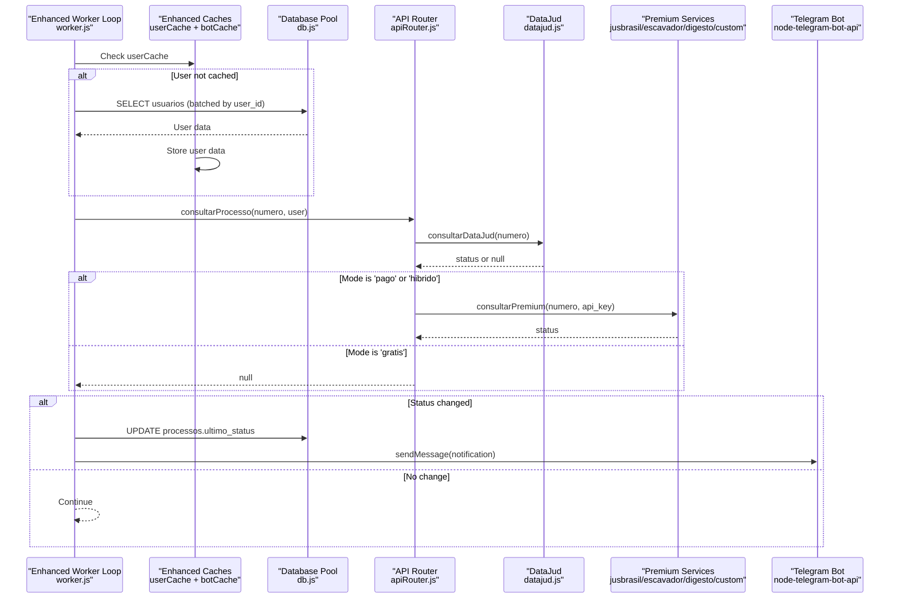
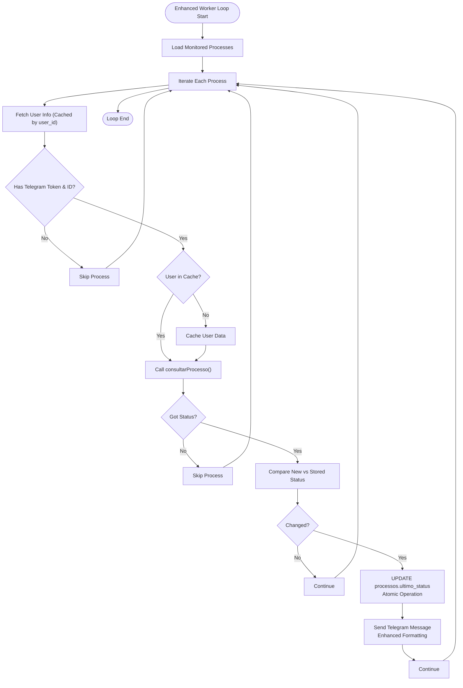
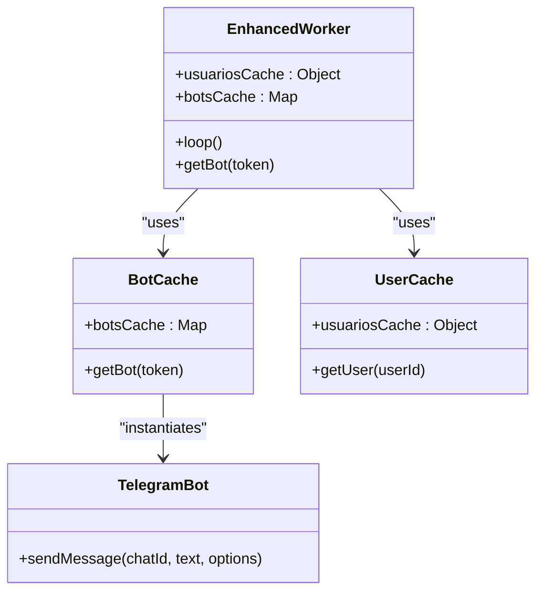
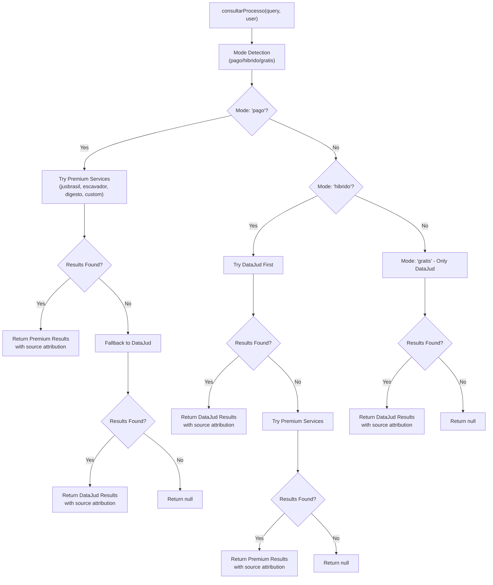
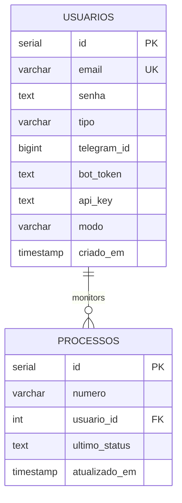
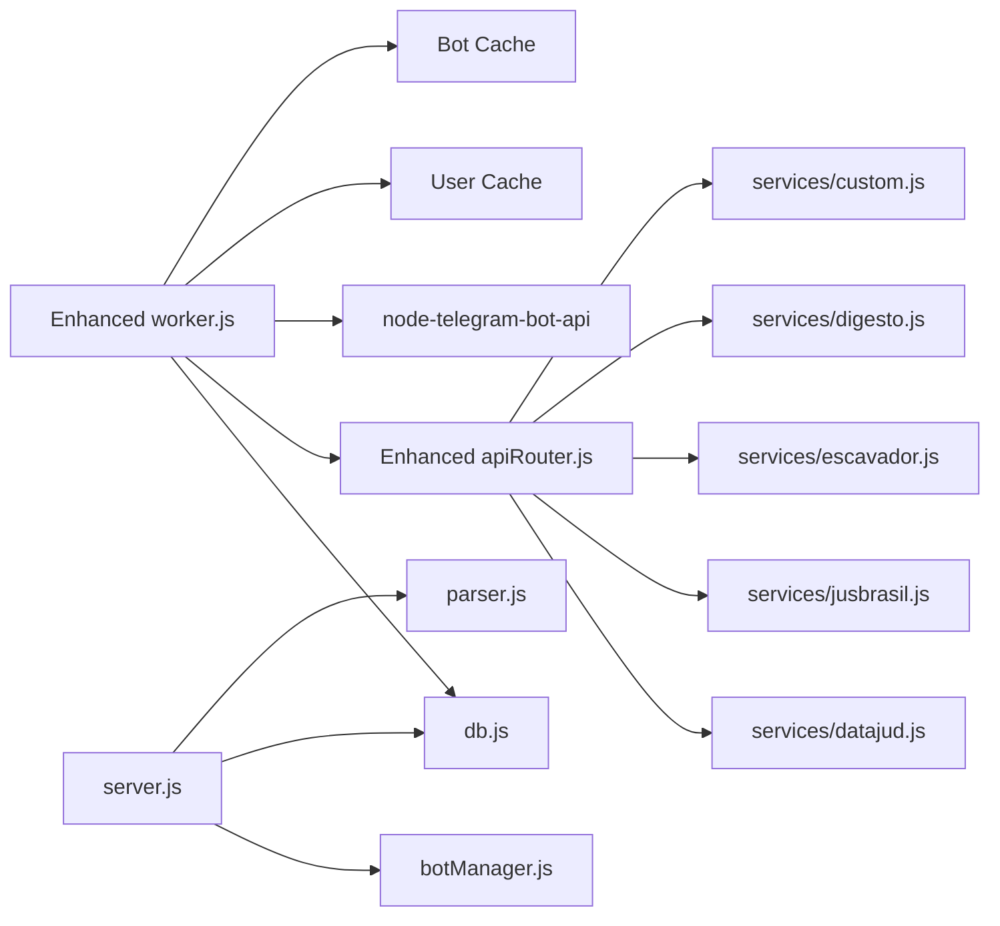

# Background Worker System

<cite>
**Referenced Files in This Document**
- [worker.js](file://worker.js)
- [apiRouter.js](file://apiRouter.js)
- [datajud.js](file://services/datajud.js)
- [premium.js](file://services/premium.js)
- [db.js](file://db.js)
- [botManager.js](file://botManager.js)
- [server.js](file://server.js)
- [database.sql](file://database.sql)
- [package.json](file://package.json)
- [README.md](file://README.md)
- [parser.js](file://parser.js)
- [jusbrasil.js](file://services/jusbrasil.js)
- [escavador.js](file://services/escavador.js)
- [digesto.js](file://services/digesto.js)
- [custom.js](file://services/custom.js)
</cite>

## Update Summary
**Changes Made**
- Enhanced caching mechanisms documentation with improved user data caching and bot instance caching
- Updated database query optimization section with batch processing strategies
- Added sophisticated notification logic details with enhanced status change detection
- Expanded API orchestration coverage with hybrid mode support and improved fallback logic
- Updated performance considerations with advanced caching and connection pooling strategies

## Table of Contents
1. [Introduction](#introduction)
2. [Project Structure](#project-structure)
3. [Core Components](#core-components)
4. [Architecture Overview](#architecture-overview)
5. [Detailed Component Analysis](#detailed-component-analysis)
6. [Enhanced Caching and Optimization Strategies](#enhanced-caching-and-optimization-strategies)
7. [Advanced Notification Logic](#advanced-notification-logic)
8. [Dependency Analysis](#dependency-analysis)
9. [Performance Considerations](#performance-considerations)
10. [Troubleshooting Guide](#troubleshooting-guide)
11. [Conclusion](#conclusion)
12. [Appendices](#appendices)

## Introduction
This document describes the enhanced background worker system responsible for automatically monitoring judicial process statuses at scheduled intervals. The system features improved caching mechanisms, optimized database queries, and sophisticated notification logic. It covers the worker architecture, process monitoring algorithms, status change detection, and notification delivery via Telegram, along with configuration, performance optimization strategies, error handling, scaling considerations, health monitoring, and graceful shutdown procedures.

## Project Structure
The worker operates as a standalone Node.js process that periodically queries monitored processes, validates their status against stored data, and sends Telegram notifications when changes are detected. It integrates with a PostgreSQL database for persistence and uses external APIs for process data retrieval. The enhanced system includes sophisticated caching mechanisms and optimized database operations.

```mermaid
graph TB
subgraph "Enhanced Worker Runtime"
W["worker.js<br/>Enhanced Periodic Loop"]
AR["apiRouter.js<br/>consultarProcesso()"]
DJ["services/datajud.js<br/>consultarDataJud()"]
JP["services/jusbrasil.js<br/>consultar()"]
EP["services/escavador.js<br/>consultar()"]
DP["services/digesto.js<br/>consultar()"]
CP["services/custom.js<br/>consultar()"]
DB["db.js<br/>PostgreSQL Pool"]
TG["Telegram Bot<br/>(node-telegram-bot-api)"]
CACHE["Enhanced Caches<br/>User Cache + Bot Cache"]
END
subgraph "Server Runtime"
S["server.js<br/>Express server"]
BM["botManager.js<br/>Telegram bots"]
PARSER["parser.js<br/>Message parsing"]
END
W --> CACHE
W --> DB
W --> AR
AR --> DJ
AR --> JP
AR --> EP
AR --> DP
AR --> CP
W --> TG
S --> BM
S --> DB
S --> PARSER
```

**Diagram sources**
- [worker.js:1-74](file://worker.js#L1-L74)
- [apiRouter.js:1-73](file://apiRouter.js#L1-L73)
- [datajud.js:1-260](file://services/datajud.js#L1-L260)
- [jusbrasil.js:1-39](file://services/jusbrasil.js#L1-L39)
- [escavador.js:1-28](file://services/escavador.js#L1-L28)
- [db.js:1-19](file://db.js#L1-L19)
- [botManager.js:1-169](file://botManager.js#L1-L169)
- [parser.js:1-95](file://parser.js#L1-L95)

**Section sources**
- [README.md:28-41](file://README.md#L28-L41)
- [package.json:7-9](file://package.json#L7-L9)

## Core Components
- **Enhanced Worker Loop**: Periodically scans monitored processes with improved caching, fetches latest status, compares with stored value, updates database, and notifies via Telegram when a change is detected.
- **Advanced API Router**: Orchestrates free and paid status checks with sophisticated fallback logic including hybrid mode support.
- **Data Services**: Free API client for CNJ with comprehensive search strategies and premium provider integration placeholders.
- **Optimized Database Pool**: Centralized PostgreSQL connection pool with batch processing capabilities for all database operations.
- **Sophisticated Telegram Bot Management**: Enhanced caching with bot instances per token and improved notification formatting.
- **Server-side Bot Manager**: Manages long-running Telegram bots for interactive commands with advanced message parsing.

**Section sources**
- [worker.js:17-65](file://worker.js#L17-L65)
- [apiRouter.js:14-55](file://apiRouter.js#L14-L55)
- [datajud.js:112-233](file://services/datajud.js#L112-L233)
- [db.js:4-18](file://db.js#L4-L18)
- [botManager.js:8-89](file://botManager.js#L8-L89)

## Architecture Overview
The enhanced worker runs independently from the main server with improved caching and optimization strategies. It performs batch processing of monitored processes, validates each entry with enhanced caching, and triggers sophisticated notifications. The server maintains interactive Telegram bots for manual commands and user onboarding with advanced message parsing capabilities.



**Diagram sources**
- [worker.js:23-58](file://worker.js#L23-L58)
- [apiRouter.js:24-52](file://apiRouter.js#L24-L52)
- [datajud.js:112-133](file://services/datajud.js#L112-L133)

## Detailed Component Analysis

### Enhanced Worker Loop and Monitoring Algorithm
- **Initialization**: Starts immediately and repeats every 5 minutes with enhanced caching.
- **Batch Processing**: Fetches all monitored processes and groups user data to minimize repeated queries using `usuariosCache`.
- **Advanced Validation**: Ensures user has Telegram credentials and a valid bot token with improved error handling.
- **Intelligent API Call**: Uses the enhanced API router to fetch the latest status with hybrid mode support.
- **Sophisticated Status Comparison**: Compares returned timestamp with the stored last status using enhanced validation logic.
- **Optimized Update and Notify**: Writes the new status to the database with atomic operations and sends formatted Telegram messages.



**Diagram sources**
- [worker.js:17-65](file://worker.js#L17-L65)
- [apiRouter.js:14-55](file://apiRouter.js#L14-L55)

**Section sources**
- [worker.js:17-65](file://worker.js#L17-L65)

### Advanced Telegram Bot Management
- **Enhanced Caching**: Bots are cached by token in `botsCache` to avoid reinitialization overhead with improved error handling.
- **Sophisticated Notifications**: Sends formatted messages with enhanced Markdown support and improved error handling.
- **Separate Bot Management**: Server-side bots handle interactive commands; worker uses cached instances for notifications with better resource management.



**Diagram sources**
- [worker.js:6-15](file://worker.js#L6-L15)

**Section sources**
- [worker.js:6-15](file://worker.js#L6-L15)
- [botManager.js:8-89](file://botManager.js#L8-L89)

### Enhanced API Orchestration and Fallback Logic
- **Hybrid Mode Support**: Advanced mode selection with 'pago', 'hibrido', and 'gratis' modes.
- **Sophisticated Free API**: Comprehensive DataJud integration with multiple search strategies and rate limiting.
- **Premium Service Integration**: Multiple premium providers (Jusbrasil, Escavador, Digesto, Custom) with individual API key management.
- **Robust Fallback Logic**: Intelligent fallback between free and paid services with enhanced error handling.
- **Consistent Response Shape**: Normalized fields for number, court, class, and last update timestamp across all services.



**Diagram sources**
- [apiRouter.js:14-55](file://apiRouter.js#L14-L55)

**Section sources**
- [apiRouter.js:14-55](file://apiRouter.js#L14-L55)

### Database Schema and Persistence
- **Users Table**: Stores Telegram identifiers, bot tokens, API keys, and mode preferences with enhanced security.
- **Processes Table**: Tracks monitored case numbers, references to users, last observed status, and timestamps with atomic operations.
- **Connection Pool**: Optimized PostgreSQL connection pool with SSL support for production environments.



**Diagram sources**
- [database.sql:5-24](file://database.sql#L5-L24)

**Section sources**
- [database.sql:5-24](file://database.sql#L5-L24)

## Enhanced Caching and Optimization Strategies

### User Data Caching
The worker implements an intelligent caching mechanism to minimize database queries during each monitoring cycle:

- **Per-Cycle Caching**: User data is cached within each worker loop execution using `usuariosCache` keyed by `usuario_id`.
- **Batch Processing**: Processes are grouped by `usuario_id` to reduce repeated user queries to a single query per user per cycle.
- **Memory Efficiency**: Cache is cleared at the end of each loop iteration to prevent memory accumulation.

### Telegram Bot Instance Caching
Enhanced bot management with improved resource utilization:

- **Token-Based Caching**: Bot instances are cached in `botsCache` keyed by bot token to avoid redundant initialization overhead.
- **Resource Management**: Cached instances are reused across notifications, reducing memory footprint and improving response times.
- **Error Handling**: Improved error handling prevents cache corruption and ensures bot instances are properly managed.

### Database Query Optimization
Advanced optimization strategies for efficient database operations:

- **Reduced Round-Trips**: Single user query per user per cycle instead of per-process queries.
- **Atomic Operations**: Database updates use atomic operations to ensure data consistency.
- **Connection Pooling**: Utilizes the shared PostgreSQL pool with SSL support for production environments.

**Section sources**
- [worker.js:23-34](file://worker.js#L23-L34)
- [worker.js:6-15](file://worker.js#L6-L15)
- [db.js:4-18](file://db.js#L4-L18)

## Advanced Notification Logic

### Sophisticated Status Change Detection
Enhanced logic for detecting and handling status changes:

- **Timestamp Comparison**: Improved timestamp validation with enhanced error handling for malformed dates.
- **Change Detection**: Robust comparison logic that handles edge cases and prevents false positives.
- **Atomic Updates**: Database updates use atomic operations to ensure consistency between status updates and notifications.

### Enhanced Notification Delivery
Advanced notification system with improved formatting and reliability:

- **Markdown Formatting**: Enhanced Telegram message formatting with improved readability and structure.
- **Source Attribution**: Automatic attribution of data sources (DataJud, Jusbrasil, etc.) in notifications.
- **Error Handling**: Comprehensive error handling for notification failures with graceful degradation.

### Hybrid Mode Integration
Advanced integration with different operational modes:

- **Mode-Aware Notifications**: Notifications adapt based on user's operational mode (gratis, pago, hibrido).
- **Source Priority**: Different priority handling based on mode selection affects notification content and formatting.
- **Fallback Handling**: Enhanced fallback logic ensures notifications are sent even when preferred sources fail.

**Section sources**
- [worker.js:53-63](file://worker.js#L53-L63)
- [apiRouter.js:24-52](file://apiRouter.js#L24-L52)

## Dependency Analysis
- **Enhanced worker.js dependencies**:
  - Database pool for process and user queries with optimized caching
  - Enhanced API router for status retrieval with hybrid mode support
  - Telegram bot library for notifications with improved caching
  - Advanced caching mechanisms for user and bot instances
- **Enhanced apiRouter.js dependencies**:
  - Free service client with comprehensive DataJud integration
  - Multiple premium service clients with individual API key management
  - Advanced fallback logic with error handling
- **Enhanced Services dependencies**:
  - HTTP client for external APIs with rate limiting and retry logic
  - Individual service configurations with environment variable support
- **Server.js coordination**:
  - Interactive Telegram bots with advanced message parsing
  - Database initialization and admin bootstrap with enhanced security
  - Parser module for sophisticated message interpretation



**Diagram sources**
- [worker.js:1-74](file://worker.js#L1-L74)
- [apiRouter.js:1-73](file://apiRouter.js#L1-L73)
- [datajud.js:1-260](file://services/datajud.js#L1-L260)
- [jusbrasil.js:1-39](file://services/jusbrasil.js#L1-L39)
- [escavador.js:1-28](file://services/escavador.js#L1-L28)
- [db.js:1-19](file://db.js#L1-L19)
- [botManager.js:1-169](file://botManager.js#L1-L169)
- [parser.js:1-95](file://parser.js#L1-L95)

**Section sources**
- [worker.js:1-74](file://worker.js#L1-L74)
- [apiRouter.js:1-73](file://apiRouter.js#L1-L73)
- [datajud.js:1-260](file://services/datajud.js#L1-L260)
- [jusbrasil.js:1-39](file://services/jusbrasil.js#L1-L39)
- [escavador.js:1-28](file://services/escavador.js#L1-L28)
- [db.js:1-19](file://db.js#L1-L19)
- [botManager.js:1-169](file://botManager.js#L1-L169)
- [parser.js:1-95](file://parser.js#L1-L95)

## Performance Considerations
- **Enhanced Scheduling Interval**: The worker runs every 5 minutes with optimized caching to balance responsiveness and resource usage.
- **Advanced Batch and Caching**:
  - Group processes by user to reduce repeated user queries with intelligent caching.
  - Cache Telegram bot instances by token to avoid initialization overhead with improved error handling.
  - Implement per-cycle user data caching to minimize database round-trips.
- **Optimized Database Efficiency**:
  - Use connection pooling via the enhanced PostgreSQL pool with SSL support.
  - Minimize round-trips by fetching user data once per user per cycle with atomic operations.
  - Implement efficient caching strategies to reduce database load.
- **Advanced External API Throughput**:
  - Free tier with comprehensive rate limiting and retry logic via DataJud integration.
  - Premium tier with individual API key management and enhanced error handling.
  - Hybrid mode support allows optimal resource utilization based on user preferences.
- **Enhanced Memory Management**:
  - Avoid accumulating large in-memory caches; keep caches scoped with automatic cleanup.
  - Dispose of unused resources after each loop iteration with proper cache invalidation.
  - Implement memory-efficient caching strategies with automatic expiration.
- **Advanced Concurrency Control**:
  - Current implementation uses sequential processing with enhanced caching for optimal resource utilization.
  - Consider introducing controlled concurrency per user or per batch for high-volume scenarios.
  - Implement queue-based processing for better resource management under load.

## Troubleshooting Guide
- **Enhanced Worker Issues**:
  - Verify the worker script is available and environment variables are loaded with proper caching configuration.
  - Confirm the database connection pool is configured with SSL support and reachable.
  - Check cache initialization and verify user cache and bot cache are functioning properly.
- **Advanced Notification Problems**:
  - Ensure users have Telegram ID and bot token set with proper validation.
  - Confirm Telegram bot token is valid and the bot is active with enhanced error handling.
  - Verify notification formatting and Markdown support are working correctly.
- **Status Update Failures**:
  - Check that the enhanced API router returns data with proper mode configuration.
  - Verify the database update query executes successfully with atomic operations.
  - Monitor cache effectiveness and database query performance.
- **API Error Handling**:
  - Free API failures with comprehensive error logging and retry logic via DataJud integration.
  - Premium API integration with individual service error handling and fallback mechanisms.
  - Monitor API key configuration and service availability for all integrated providers.
- **Enhanced Performance Issues**:
  - Monitor cache hit rates and optimize cache configuration based on usage patterns.
  - Analyze database query performance and consider connection pool tuning.
  - Review external API rate limiting and implement appropriate throttling strategies.
- **Graceful Shutdown**:
  - Implement signal handlers to stop the interval timer and close database connections cleanly.
  - Ensure cache cleanup and resource disposal during shutdown procedures.

**Section sources**
- [worker.js:17-65](file://worker.js#L17-L65)
- [apiRouter.js:14-55](file://apiRouter.js#L14-L55)
- [db.js:4-18](file://db.js#L4-L18)

## Conclusion
The enhanced background worker system provides automated monitoring of judicial processes with sophisticated caching mechanisms, optimized database queries, and advanced notification logic. The system features improved user data caching, enhanced bot instance management, and intelligent API orchestration with hybrid mode support. By leveraging advanced caching strategies, optimized database operations, and robust error handling, the system can efficiently scale to support many users while respecting external API limitations and maintaining high performance standards.

## Appendices

### Enhanced Worker Configuration and Environment
- **Scheduling Interval**: Controlled by the 5-minute interval in the worker loop with optimized caching.
- **Advanced Concurrent Handling**: Current implementation uses intelligent caching and sequential processing; consider controlled concurrency for high-volume scenarios.
- **Resource Management**: Leverages the enhanced shared PostgreSQL pool, bot cache, and user cache to reduce overhead.
- **Environment Variables**: Ensure database credentials, API keys for premium services, and secrets are configured for the worker process.
- **Cache Configuration**: Monitor cache effectiveness and tune cache sizes based on usage patterns and memory constraints.

**Section sources**
- [worker.js:67-74](file://worker.js#L67-L74)
- [db.js:4-18](file://db.js#L4-L18)
- [package.json:7-9](file://package.json#L7-L9)

### Practical Examples
- **Enhanced Worker Initialization**:
  - Start the worker process using the dedicated script with proper environment configuration.
  - The worker logs startup and begins the periodic loop immediately with cache initialization.
- **Advanced Monitoring Loop**:
  - The loop fetches all monitored processes, caches user data intelligently, and iterates through each process with enhanced validation.
  - Implements batch processing strategies to minimize database queries and improve performance.
- **Sophisticated Status Change Notifications**:
  - On detection of a change, the worker updates the database atomically and sends a formatted Telegram message to the user.
  - Enhanced notification formatting includes source attribution and improved readability.

**Section sources**
- [README.md:34-35](file://README.md#L34-L35)
- [worker.js:17-65](file://worker.js#L17-L65)

### Scaling and Health Monitoring
- **Horizontal Scaling**: Run multiple worker instances behind a scheduler or container orchestration platform with proper cache coordination.
- **Health Checks**: Expose lightweight health endpoints and monitor database connectivity, external API reachability, and cache effectiveness.
- **Enhanced Graceful Shutdown**: Add SIGTERM/SIGINT handlers to clear intervals, close database connections, and clean up cache resources.
- **Performance Monitoring**: Implement metrics collection for cache hit rates, database query performance, and API response times.
- **Resource Optimization**: Monitor memory usage, connection pool utilization, and cache effectiveness to optimize system performance.