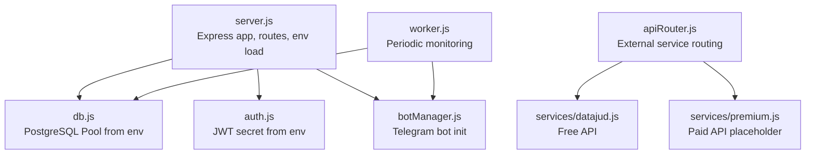
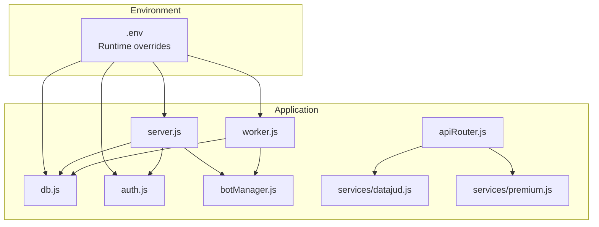
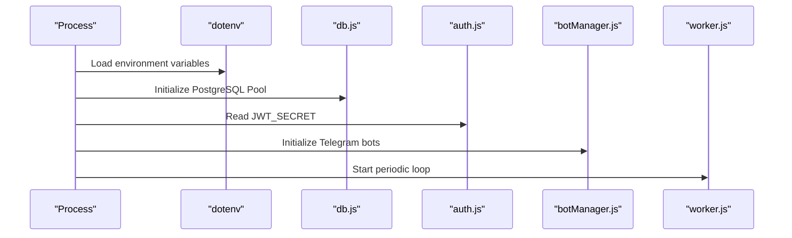
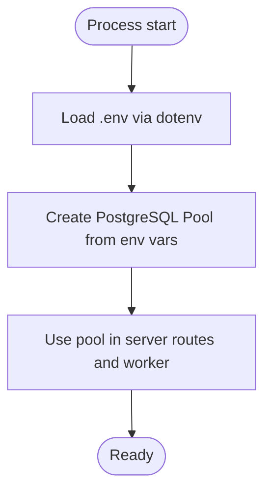
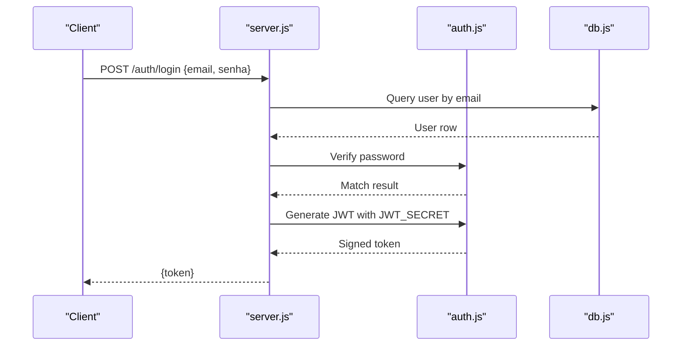
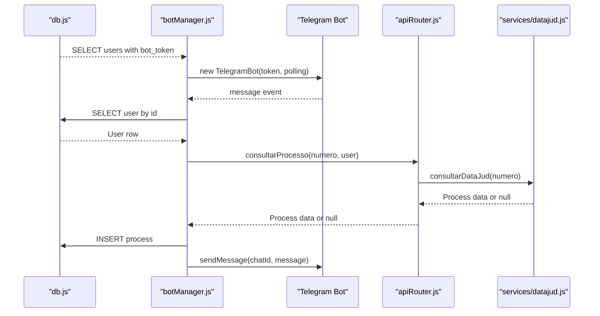
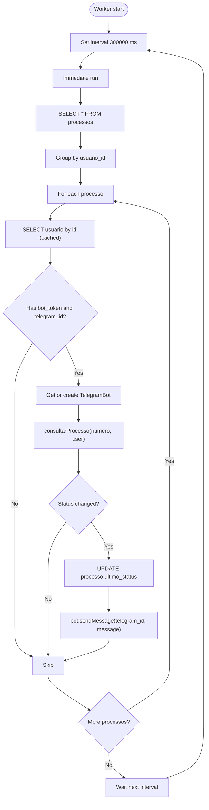
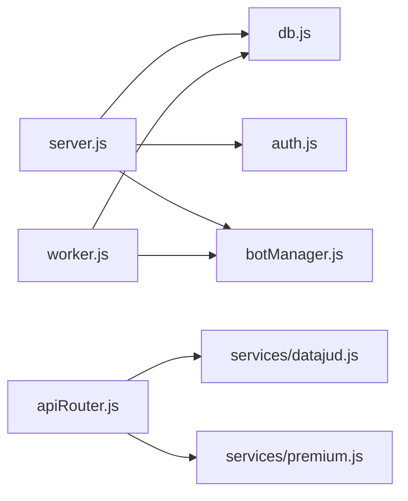

# Configuration Management

<cite>
**Referenced Files in This Document**
- [package.json](file://package.json)
- [server.js](file://server.js)
- [db.js](file://db.js)
- [auth.js](file://auth.js)
- [botManager.js](file://botManager.js)
- [worker.js](file://worker.js)
- [apiRouter.js](file://apiRouter.js)
- [database.sql](file://database.sql)
- [services/datajud.js](file://services/datajud.js)
- [services/premium.js](file://services/premium.js)
- [README.md](file://README.md)
</cite>

## Table of Contents
1. [Introduction](#introduction)
2. [Project Structure](#project-structure)
3. [Core Components](#core-components)
4. [Architecture Overview](#architecture-overview)
5. [Detailed Component Analysis](#detailed-component-analysis)
6. [Dependency Analysis](#dependency-analysis)
7. [Performance Considerations](#performance-considerations)
8. [Troubleshooting Guide](#troubleshooting-guide)
9. [Conclusion](#conclusion)
10. [Appendices](#appendices)

## Introduction
This document explains how configuration is managed across the application, focusing on environment variables, database configuration, Telegram bot settings, and security configurations. It covers required environment variables, configuration loading, validation, environment-specific overrides, and deployment strategies. Practical guidance is provided for setting up a secure and maintainable configuration lifecycle.

## Project Structure
The configuration surface spans several modules:
- Environment loading via dotenv
- Database connection pool configured from environment
- Authentication using JWT secrets from environment
- Telegram bot initialization and polling
- Worker process for periodic monitoring
- External service integrations

**Diagram sources**
- [server.js:1-162](file://server.js#L1-L162)
- [db.js:1-11](file://db.js#L1-L11)
- [auth.js:1-59](file://auth.js#L1-L59)
- [botManager.js:1-53](file://botManager.js#L1-L53)
- [worker.js:1-70](file://worker.js#L1-L70)
- [apiRouter.js:1-19](file://apiRouter.js#L1-L19)
- [services/datajud.js:1-32](file://services/datajud.js#L1-L32)
- [services/premium.js:1-12](file://services/premium.js#L1-L12)

**Section sources**
- [package.json:1-21](file://package.json#L1-L21)
- [README.md:19-27](file://README.md#L19-L27)

## Core Components
- Environment variables are loaded at process startup using dotenv.
- Database connection pool reads credentials from environment variables.
- Authentication relies on a JWT secret from environment variables.
- Telegram bots are initialized per user using bot tokens stored in the database.
- Worker process periodically checks for updates and sends Telegram notifications.

Key configuration touchpoints:
- Environment loading and scripts
- Database pool configuration
- JWT secret usage
- Telegram bot initialization
- Worker polling interval and caching

**Section sources**
- [package.json:1-21](file://package.json#L1-L21)
- [server.js:1-162](file://server.js#L1-L162)
- [db.js:1-11](file://db.js#L1-L11)
- [auth.js:1-59](file://auth.js#L1-L59)
- [botManager.js:1-53](file://botManager.js#L1-L53)
- [worker.js:1-70](file://worker.js#L1-L70)

## Architecture Overview
Configuration flows through environment variables consumed by modules responsible for database, authentication, Telegram, and worker behavior.

**Diagram sources**
- [server.js:1-162](file://server.js#L1-L162)
- [worker.js:1-70](file://worker.js#L1-L70)
- [db.js:1-11](file://db.js#L1-L11)
- [auth.js:1-59](file://auth.js#L1-L59)
- [botManager.js:1-53](file://botManager.js#L1-L53)
- [apiRouter.js:1-19](file://apiRouter.js#L1-L19)
- [services/datajud.js:1-32](file://services/datajud.js#L1-L32)
- [services/premium.js:1-12](file://services/premium.js#L1-L12)

## Detailed Component Analysis

### Environment Variables and Loading
- dotenv is used to load environment variables at module boundaries in server.js and worker.js.
- Scripts in package.json define how the app starts and runs the worker process.

Practical guidance:
- Place environment variables in a .env file at project root.
- Ensure sensitive variables are not committed to version control.
- Use separate .env files per environment (development, staging, production) and override via OS environment when deploying.

**Section sources**
- [server.js:1-162](file://server.js#L1-L162)
- [worker.js:1-70](file://worker.js#L1-L70)
- [package.json:5-10](file://package.json#L5-L10)

### Database Configuration
- The PostgreSQL connection pool is created from environment variables for host, user, password, database name, and port.
- The pool is exported for use by server routes and worker.

Recommended environment variables:
- DB_HOST
- DB_USER
- DB_PASSWORD
- DB_NAME
- DB_PORT

Connection pooling parameters:
- The pool is instantiated with defaults from the client library; no explicit pool size is set in code. Consider adding pool configuration (min, max, idle timeout, etc.) in production deployments.

**Section sources**
- [db.js:1-11](file://db.js#L1-L11)
- [database.sql:5-24](file://database.sql#L5-L24)

### Authentication and Security Configuration
- JWT secret is loaded from environment; a fallback default is present in code.
- Authentication middleware extracts token from Authorization header and verifies it against the secret.
- Password hashing uses bcrypt with a fixed salt rounds value.

Security considerations:
- Never commit JWT_SECRET to source control.
- Rotate secrets regularly and invalidate sessions after rotation.
- Enforce HTTPS in production to protect tokens in transit.
- Add rate limiting and input validation around authentication endpoints.

**Section sources**
- [auth.js:1-59](file://auth.js#L1-L59)
- [server.js:39-68](file://server.js#L39-L68)

### Telegram Bot Configuration
- Bots are initialized per user using the bot_token stored in the database.
- Message handling triggers on Telegram messages, queries external services, and persists results.
- Worker process retrieves users with bot_token and telegram_id to send notifications.

Required user-level configuration (stored in database):
- bot_token
- telegram_id

Operational settings:
- Polling mode is used for message handling.
- Worker runs at a fixed interval and caches bot instances to avoid recreation.

**Section sources**
- [botManager.js:1-53](file://botManager.js#L1-L53)
- [worker.js:1-70](file://worker.js#L1-L70)
- [database.sql:5-16](file://database.sql#L5-L16)

### External Services and API Keys
- Free API integration is handled via a dedicated service.
- Paid API integration is optional and gated by user mode and presence of api_key.

Required per-user configuration:
- api_key (optional, paid mode)
- modo (gratis, híbrido, pago)

**Section sources**
- [apiRouter.js:1-19](file://apiRouter.js#L1-L19)
- [services/datajud.js:1-32](file://services/datajud.js#L1-L32)
- [services/premium.js:1-12](file://services/premium.js#L1-L12)
- [database.sql:5-16](file://database.sql#L5-L16)

### Runtime Behavior and Scheduling
- Server listens on PORT from environment and initializes bots at startup.
- Worker runs a periodic loop to check for updates and notify users.

Important runtime variables:
- PORT (server)
- Interval for worker loop is hard-coded to 5 minutes.

**Section sources**
- [server.js:137-140](file://server.js#L137-L140)
- [worker.js:63-67](file://worker.js#L63-L67)

## Architecture Overview
The configuration architecture centers on environment-driven modules and database-backed user preferences.

**Diagram sources**
- [server.js:1-162](file://server.js#L1-L162)
- [db.js:1-11](file://db.js#L1-L11)
- [auth.js:1-59](file://auth.js#L1-L59)
- [botManager.js:1-53](file://botManager.js#L1-L53)
- [worker.js:1-70](file://worker.js#L1-L70)

## Detailed Component Analysis

### Database Connection Flow

**Diagram sources**
- [db.js:1-11](file://db.js#L1-L11)
- [server.js:1-162](file://server.js#L1-L162)
- [worker.js:1-70](file://worker.js#L1-L70)

**Section sources**
- [db.js:1-11](file://db.js#L1-L11)

### Authentication Flow

**Diagram sources**
- [server.js:39-68](file://server.js#L39-L68)
- [auth.js:1-59](file://auth.js#L1-L59)
- [db.js:1-11](file://db.js#L1-L11)

**Section sources**
- [auth.js:1-59](file://auth.js#L1-L59)
- [server.js:39-68](file://server.js#L39-L68)

### Telegram Bot Initialization and Message Handling

**Diagram sources**
- [botManager.js:1-53](file://botManager.js#L1-L53)
- [apiRouter.js:1-19](file://apiRouter.js#L1-L19)
- [services/datajud.js:1-32](file://services/datajud.js#L1-L32)
- [db.js:1-11](file://db.js#L1-L11)

**Section sources**
- [botManager.js:1-53](file://botManager.js#L1-L53)

### Worker Monitoring Loop

**Diagram sources**
- [worker.js:1-70](file://worker.js#L1-L70)
- [apiRouter.js:1-19](file://apiRouter.js#L1-L19)

**Section sources**
- [worker.js:1-70](file://worker.js#L1-L70)

## Dependency Analysis
- server.js depends on db.js for database operations, auth.js for authentication, and botManager.js for Telegram bot lifecycle.
- worker.js depends on db.js and botManager.js for periodic monitoring and notifications.
- apiRouter.js orchestrates free and paid service calls based on user configuration.

**Diagram sources**
- [server.js:1-162](file://server.js#L1-L162)
- [worker.js:1-70](file://worker.js#L1-L70)
- [db.js:1-11](file://db.js#L1-L11)
- [auth.js:1-59](file://auth.js#L1-L59)
- [botManager.js:1-53](file://botManager.js#L1-L53)
- [apiRouter.js:1-19](file://apiRouter.js#L1-L19)
- [services/datajud.js:1-32](file://services/datajud.js#L1-L32)
- [services/premium.js:1-12](file://services/premium.js#L1-L12)

**Section sources**
- [server.js:1-162](file://server.js#L1-L162)
- [worker.js:1-70](file://worker.js#L1-L70)
- [apiRouter.js:1-19](file://apiRouter.js#L1-L19)

## Performance Considerations
- Connection pooling: Consider configuring pool min/max connections, idle timeout, and connection lifetime in production.
- Worker interval: The fixed 5-minute interval balances responsiveness and load; adjust based on traffic and rate limits.
- Caching: Both server and worker cache user and bot instances to reduce repeated lookups and bot creation overhead.
- External service timeouts: Add request timeouts for external APIs to prevent blocking.

[No sources needed since this section provides general guidance]

## Troubleshooting Guide
Common configuration issues and resolutions:
- Missing environment variables:
  - Symptoms: Application fails to connect to database or JWT verification errors.
  - Resolution: Ensure .env contains required variables and scripts load dotenv before requiring dependent modules.
- Database connectivity:
  - Symptoms: Connection refused or invalid credentials.
  - Resolution: Verify DB_HOST, DB_USER, DB_PASSWORD, DB_NAME, DB_PORT; test connection externally.
- Authentication failures:
  - Symptoms: 401 Token inválido.
  - Resolution: Confirm JWT_SECRET matches across deployments and restart services after rotation.
- Telegram bot not responding:
  - Symptoms: No messages received or notifications not sent.
  - Resolution: Confirm bot_token and telegram_id are set for the user; verify polling mode and network access.
- Worker not notifying:
  - Symptoms: No updates sent despite changes.
  - Resolution: Check worker logs, confirm bot_token and telegram_id, and verify external service responses.

**Section sources**
- [db.js:1-11](file://db.js#L1-L11)
- [auth.js:1-59](file://auth.js#L1-L59)
- [botManager.js:1-53](file://botManager.js#L1-L53)
- [worker.js:1-70](file://worker.js#L1-L70)

## Conclusion
Configuration in this application is environment-driven and user-centric. By centralizing secrets in environment variables, separating concerns across modules, and validating runtime behavior, the system supports secure and scalable deployments. Adopt environment-specific .env files, enforce HTTPS, rotate secrets, and monitor worker and database performance to maintain reliability.

[No sources needed since this section summarizes without analyzing specific files]

## Appendices

### Required Environment Variables
- Database:
  - DB_HOST
  - DB_USER
  - DB_PASSWORD
  - DB_NAME
  - DB_PORT
- Authentication:
  - JWT_SECRET
- Server:
  - PORT
- Telegram:
  - bot_token (per user, stored in database)
  - telegram_id (per user, stored in database)
- External Services:
  - api_key (per user, optional for paid mode)
  - modo (gratis, híbrido, pago)

**Section sources**
- [db.js:1-11](file://db.js#L1-L11)
- [auth.js:1-59](file://auth.js#L1-L59)
- [server.js:137-140](file://server.js#L137-L140)
- [database.sql:5-16](file://database.sql#L5-L16)

### Example .env Setup
- Place a .env file at the project root with the following categories:
  - Database: DB_HOST, DB_USER, DB_PASSWORD, DB_NAME, DB_PORT
  - Security: JWT_SECRET
  - Server: PORT
  - Optional: api_key and modo for paid mode users

**Section sources**
- [README.md:19-27](file://README.md#L19-L27)

### Configuration Loading and Overrides
- dotenv loads environment variables at module boundaries.
- OS environment variables override .env values during runtime.
- Use separate .env files per environment and deploy-time overrides for production.

**Section sources**
- [server.js:1-162](file://server.js#L1-L162)
- [worker.js:1-70](file://worker.js#L1-L70)
- [package.json:5-10](file://package.json#L5-L10)

### Security Best Practices
- Secret management:
  - Store JWT_SECRET and database passwords in secure secret managers or encrypted .env files.
  - Rotate secrets periodically and invalidate active sessions after rotation.
- Transport security:
  - Enforce HTTPS in production and reject insecure HTTP requests.
- Access control:
  - Restrict administrative endpoints and enforce role-based access.
- Environment isolation:
  - Use distinct .env files for development, staging, and production.
  - Avoid committing secrets to version control.

[No sources needed since this section provides general guidance]