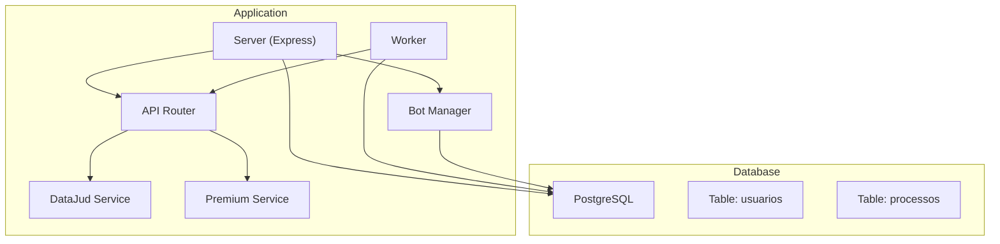
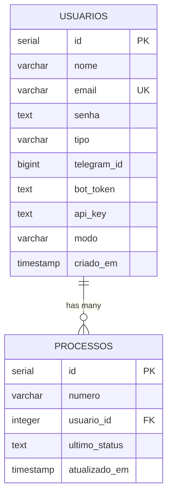
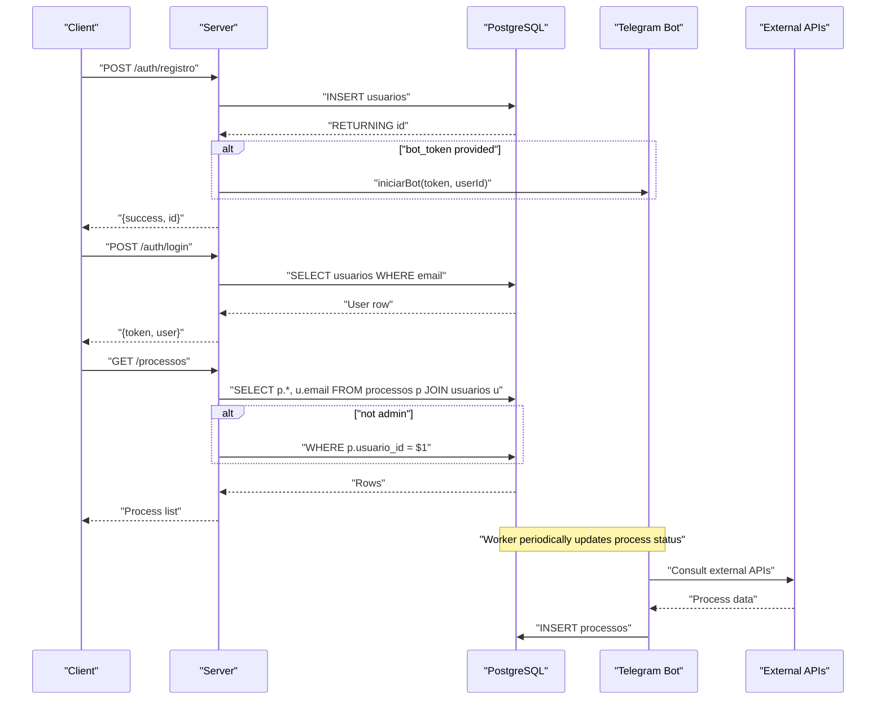
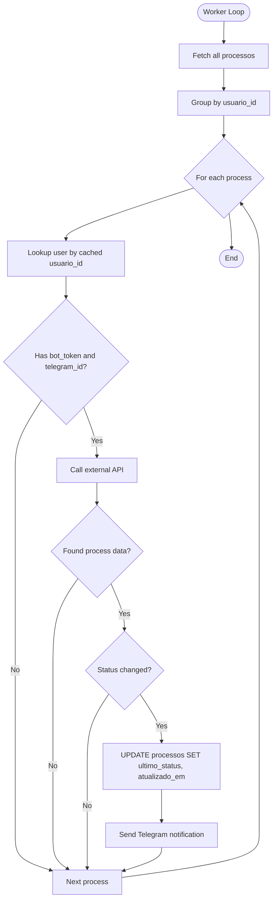
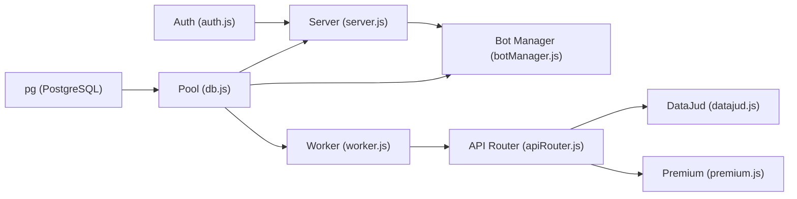

# Database Design

<cite>
**Referenced Files in This Document**
- [database.sql](file://database.sql)
- [db.js](file://db.js)
- [server.js](file://server.js)
- [auth.js](file://auth.js)
- [botManager.js](file://botManager.js)
- [worker.js](file://worker.js)
- [apiRouter.js](file://apiRouter.js)
- [datajud.js](file://services/datajud.js)
- [premium.js](file://services/premium.js)
- [package.json](file://package.json)
- [README.md](file://README.md)
</cite>

## Table of Contents
1. [Introduction](#introduction)
2. [Project Structure](#project-structure)
3. [Core Components](#core-components)
4. [Architecture Overview](#architecture-overview)
5. [Detailed Component Analysis](#detailed-component-analysis)
6. [Dependency Analysis](#dependency-analysis)
7. [Performance Considerations](#performance-considerations)
8. [Troubleshooting Guide](#troubleshooting-guide)
9. [Conclusion](#conclusion)
10. [Appendices](#appendices)

## Introduction
This document describes the PostgreSQL database schema and data model for the judicial process monitoring SaaS. It covers entity definitions, relationships, constraints, indexes, validation rules, access patterns, connection pooling, performance considerations, data lifecycle, and security controls. The system supports multi-user accounts, Telegram bot integrations, and automated process tracking with fallback APIs.

## Project Structure
The database schema is defined in a SQL script and consumed by the backend server and worker processes. The server exposes REST endpoints for user registration, login, and process listing, while the worker periodically checks for updates and notifies users via Telegram.

**Diagram sources**
- [server.js:1-162](file://server.js#L1-L162)
- [worker.js:1-70](file://worker.js#L1-L70)
- [botManager.js:1-53](file://botManager.js#L1-L53)
- [apiRouter.js:1-19](file://apiRouter.js#L1-L19)
- [datajud.js:1-32](file://services/datajud.js#L1-L32)
- [premium.js:1-12](file://services/premium.js#L1-L12)
- [database.sql:1-25](file://database.sql#L1-L25)

**Section sources**
- [README.md:1-56](file://README.md#L1-L56)
- [package.json:1-21](file://package.json#L1-L21)

## Core Components
- Database schema definition and initialization script.
- Connection pooling configuration for PostgreSQL.
- Application-level data access patterns via server and worker.
- Authentication and authorization middleware.
- Telegram bot integration and process tracking.

**Section sources**
- [database.sql:1-25](file://database.sql#L1-L25)
- [db.js:1-11](file://db.js#L1-L11)
- [server.js:1-162](file://server.js#L1-L162)
- [auth.js:1-59](file://auth.js#L1-L59)
- [botManager.js:1-53](file://botManager.js#L1-L53)
- [worker.js:1-70](file://worker.js#L1-L70)

## Architecture Overview
The system uses a relational model with two primary tables: usuarios and processos. Users can register and log in, configure Telegram bot credentials, and receive notifications. The worker periodically queries external APIs to update process statuses and sends Telegram messages to users.

**Diagram sources**
- [database.sql:5-24](file://database.sql#L5-L24)
- [server.js:112-122](file://server.js#L112-L122)
- [worker.js:20-60](file://worker.js#L20-L60)

## Detailed Component Analysis

### Database Schema and Constraints
- usuarios table
  - Primary key: id (SERIAL)
  - Unique constraint: email (UNIQUE)
  - Not-null constraints: email, senha
  - Default values: tipo='cliente', modo='gratis', criado_em=CURRENT_TIMESTAMP
  - Optional fields: nome, telegram_id, bot_token, api_key
- processos table
  - Primary key: id (SERIAL)
  - Foreign key: usuario_id references usuarios(id)
  - Not-null constraint: numero (implied by INSERT usage)
  - Defaults: atualizado_em=CURRENT_TIMESTAMP
  - Additional fields: ultimo_status

Validation rules observed in application code:
- Email uniqueness enforced at database and application level (duplicate email handling).
- Password hashing performed before insertion.
- Mode selection influences fallback API usage.
- Telegram bot and API key are optional; required for notifications and paid mode.

Indexes and performance considerations:
- No explicit indexes are defined in the schema. Recommended indexes:
  - Index on usuarios(email) for login and user lookup.
  - Index on processos(usuario_id) for filtering user-specific processes.
  - Index on processos(numero) for efficient lookups by process number.

**Section sources**
- [database.sql:5-24](file://database.sql#L5-L24)
- [server.js:12-36](file://server.js#L12-L36)
- [server.js:39-68](file://server.js#L39-L68)
- [botManager.js:31-39](file://botManager.js#L31-L39)
- [worker.js:49-59](file://worker.js#L49-L59)

### Entity Relationships
- usuarios and processos have a one-to-many relationship via usuario_id.
- The join in server GET /processos ensures clients only see their own processes unless admin.

**Diagram sources**
- [server.js:12-36](file://server.js#L12-L36)
- [server.js:39-68](file://server.js#L39-L68)
- [server.js:94-110](file://server.js#L94-L110)
- [botManager.js:7-42](file://botManager.js#L7-L42)
- [worker.js:17-61](file://worker.js#L17-L61)

### Data Access Patterns
- Registration and login insert/update user records and manage tokens.
- Listing processes uses a JOIN with optional WHERE clause for non-admin users.
- Worker loops through all processes, groups by user, and updates status if changed.

**Diagram sources**
- [worker.js:17-61](file://worker.js#L17-L61)
- [apiRouter.js:4-16](file://apiRouter.js#L4-L16)
- [datajud.js:3-29](file://services/datajud.js#L3-L29)
- [premium.js:1-12](file://services/premium.js#L1-L12)

### Field Definitions and Types
- usuarios
  - id: serial (primary key)
  - nome: varchar(100)
  - email: varchar(255) (unique, not null)
  - senha: text (not null)
  - tipo: varchar(20) default 'cliente'
  - telegram_id: bigint
  - bot_token: text
  - api_key: text
  - modo: varchar(20) default 'gratis'
  - criado_em: timestamp default current_timestamp
- processos
  - id: serial (primary key)
  - numero: varchar(50) (not null in practice)
  - usuario_id: integer (foreign key to usuarios.id)
  - ultimo_status: text
  - atualizado_em: timestamp default current_timestamp

Validation rules:
- Email must be unique; application handles duplicate key errors.
- Password is hashed before storage.
- Process number is inserted by Telegram bot message handling.
- Mode affects whether paid API fallback is attempted.

**Section sources**
- [database.sql:5-24](file://database.sql#L5-L24)
- [server.js:12-36](file://server.js#L12-L36)
- [server.js:39-68](file://server.js#L39-L68)
- [botManager.js:31-39](file://botManager.js#L31-L39)
- [apiRouter.js:11-13](file://apiRouter.js#L11-L13)

### Sample Data
Sample rows for demonstration purposes:
- usuarios
  - id: 1
  - email: "user@example.com"
  - senha: "<hashed>"
  - tipo: "cliente"
  - telegram_id: 123456789
  - bot_token: "123456789:ABC-DEF1234ghIkl-mnopQR-stUVWxyzABC-DEF"
  - api_key: "premium-api-key-if-paid-mode"
  - modo: "pago"
  - criado_em: "2025-01-01 10:00:00"
- processos
  - id: 1
  - numero: "0000000-00.0000.0.00-00"
  - usuario_id: 1
  - ultimo_status: "2025-01-01T12:00:00Z"
  - atualizado_em: "2025-01-01 12:00:00"

**Section sources**
- [database.sql:5-24](file://database.sql#L5-L24)

## Dependency Analysis
- PostgreSQL driver (pg) is used for connection pooling.
- Environment variables define database connection parameters.
- Express routes depend on database queries for CRUD operations.
- Worker depends on Telegram bot SDK and external APIs.
- Authentication middleware depends on JWT and bcrypt.

**Diagram sources**
- [db.js:1-11](file://db.js#L1-L11)
- [server.js:1-162](file://server.js#L1-L162)
- [worker.js:1-70](file://worker.js#L1-L70)
- [botManager.js:1-53](file://botManager.js#L1-L53)
- [auth.js:1-59](file://auth.js#L1-L59)
- [apiRouter.js:1-19](file://apiRouter.js#L1-L19)
- [datajud.js:1-32](file://services/datajud.js#L1-L32)
- [premium.js:1-12](file://services/premium.js#L1-L12)

**Section sources**
- [package.json:11-18](file://package.json#L11-L18)
- [db.js:1-11](file://db.js#L1-L11)

## Performance Considerations
- Connection pooling: The application uses a single pool configured with host, user, password, database, and port from environment variables. Consider tuning pool size and timeouts for production load.
- Indexes: Add indexes on usuarios(email), processos(usuario_id), and processos(numero) to optimize lookups and joins.
- Queries: The worker iterates all processes; consider paginating or partitioning large datasets.
- Caching: The worker caches user lookups per iteration; extend caching for bot instances and process lookups.
- External API calls: Rate limit and handle failures gracefully; consider exponential backoff.

[No sources needed since this section provides general guidance]

## Troubleshooting Guide
Common issues and resolutions:
- Duplicate email during registration: The application catches a specific error code and responds with a user-friendly message. Ensure the email uniqueness constraint is intact.
- Invalid or missing token: Authentication middleware returns 401 if token is absent or invalid.
- Access denied: Admin-only endpoints return 403 if the requesting user is not admin.
- Worker not notifying: Verify bot_token and telegram_id presence in usuarios and that the worker loop is running.

**Section sources**
- [server.js:31-35](file://server.js#L31-L35)
- [auth.js:17-31](file://auth.js#L17-L31)
- [auth.js:34-39](file://auth.js#L34-L39)
- [worker.js:40-43](file://worker.js#L40-L43)

## Conclusion
The database design supports a clean relational model for user management and process tracking, integrated with Telegram notifications and external APIs. By adding recommended indexes, optimizing connection pooling, and implementing robust caching and error handling, the system can scale effectively while maintaining security and reliability.

[No sources needed since this section summarizes without analyzing specific files]

## Appendices

### Data Lifecycle
- User account management
  - Registration: Hash password, insert user record, optionally start Telegram bot.
  - Login: Authenticate against stored hash, issue JWT.
  - Admin creation: On startup, create default admin if not present.
- Process tracking
  - Telegram message triggers lookup; insert process record with initial status.
  - Worker periodically updates status and notifies users.
- Audit logging
  - Timestamps (criado_em, atualizado_em) capture creation and last update.
  - Consider adding a dedicated audit table for sensitive operations.

**Section sources**
- [server.js:12-36](file://server.js#L12-L36)
- [server.js:39-68](file://server.js#L39-L68)
- [server.js:142-161](file://server.js#L142-L161)
- [botManager.js:31-39](file://botManager.js#L31-L39)
- [worker.js:49-59](file://worker.js#L49-L59)

### Security Measures
- Password hashing: bcrypt is used for secure password storage.
- Token-based authentication: JWT with expiration and verification.
- Access control: Admin-only endpoints enforce role-based access.
- Environment configuration: Database credentials and secrets are loaded from environment variables.

**Section sources**
- [auth.js:42-49](file://auth.js#L42-L49)
- [auth.js:8-14](file://auth.js#L8-L14)
- [auth.js:34-39](file://auth.js#L34-L39)
- [db.js:4-10](file://db.js#L4-L10)

### Backup Strategies
- Logical backups: Use pg_dump for scheduled snapshots.
- Point-in-time recovery: Enable WAL archiving and base backups.
- Secrets protection: Store database credentials and JWT secret in secure vaults.

[No sources needed since this section provides general guidance]

### Connection Pooling Configuration
- Current configuration loads connection parameters from environment variables.
- Recommendations:
  - Set pool min/max connections based on expected concurrency.
  - Configure idle timeout and max lifetime to prevent resource leaks.
  - Use separate pools for write-heavy and read-heavy workloads if needed.

**Section sources**
- [db.js:4-10](file://db.js#L4-L10)