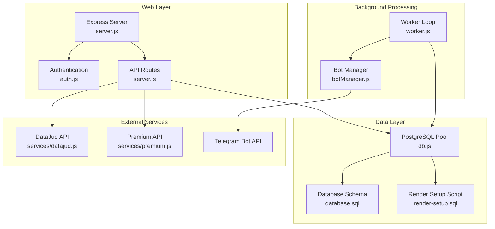
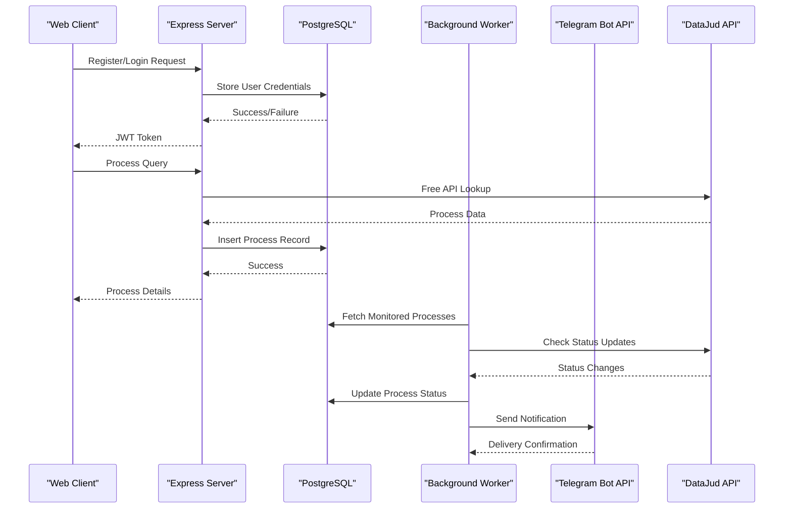
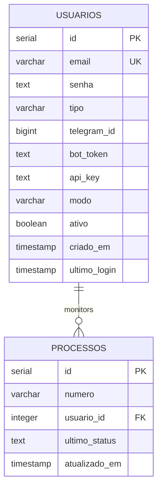
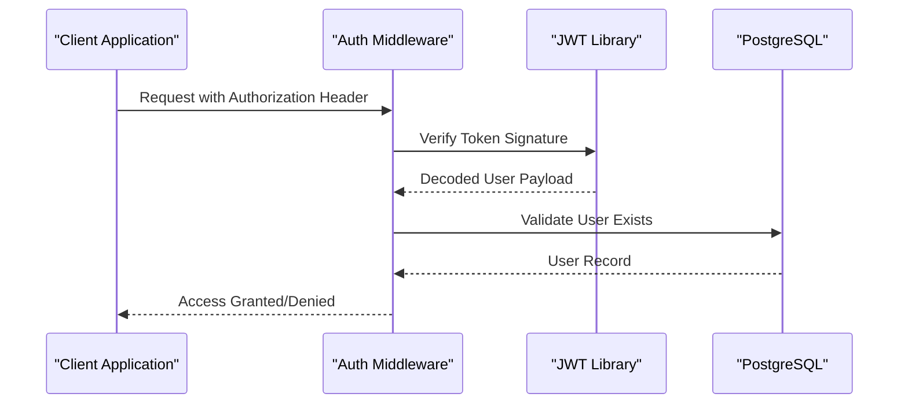
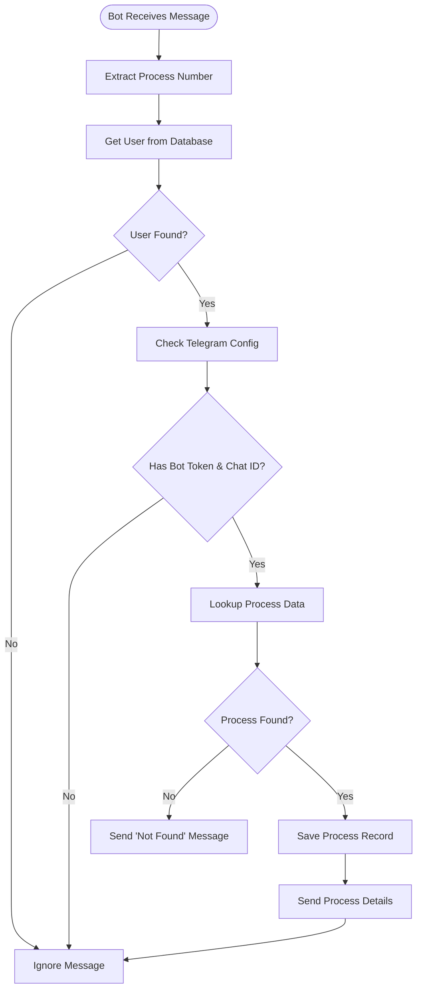

# Deployment Guide

<cite>
**Referenced Files in This Document**
- [package.json](file://package.json)
- [server.js](file://server.js)
- [worker.js](file://worker.js)
- [db.js](file://db.js)
- [auth.js](file://auth.js)
- [botManager.js](file://botManager.js)
- [apiRouter.js](file://apiRouter.js)
- [services/datajud.js](file://services/datajud.js)
- [services/premium.js](file://services/premium.js)
- [database.sql](file://database.sql)
- [render-setup.sql](file://render-setup.sql)
- [README.md](file://README.md)
</cite>

## Update Summary
**Changes Made**
- Added comprehensive Render Platform deployment section with specialized setup procedures
- Updated database initialization section to cover both traditional and Render-specific deployment methods
- Enhanced environment setup documentation with Render-specific configuration requirements
- Added platform-specific deployment strategies and best practices

## Table of Contents
1. [Introduction](#introduction)
2. [Project Structure](#project-structure)
3. [Core Components](#core-components)
4. [Architecture Overview](#architecture-overview)
5. [Detailed Component Analysis](#detailed-component-analysis)
6. [Environment Setup](#environment-setup)
7. [Production Deployment Strategies](#production-deployment-strategies)
8. [Platform-Specific Deployment](#platform-specific-deployment)
9. [Scaling Considerations](#scaling-considerations)
10. [Monitoring and Maintenance](#monitoring-and-maintenance)
11. [Backup and Disaster Recovery](#backup-and-disaster-recovery)
12. [Security Hardening](#security-hardening)
13. [Troubleshooting Guide](#troubleshooting-guide)
14. [Conclusion](#conclusion)

## Introduction
This guide provides comprehensive deployment instructions for the Judicial Process Monitoring SaaS application. It covers production environment requirements, containerization, process management, scaling, monitoring, backups, and security hardening. The system consists of a web server, a background worker, PostgreSQL database, and Telegram bot integrations. Recent enhancements include specialized deployment procedures for the Render platform, making cloud deployment more streamlined and accessible.

## Project Structure
The application follows a modular Node.js architecture with clear separation of concerns:
- Web server handles HTTP requests and user authentication
- Background worker performs periodic monitoring tasks
- Database connection pool manages PostgreSQL connectivity
- Authentication middleware enforces access control
- Bot manager orchestrates Telegram bot instances
- API router coordinates free and paid data sources



**Diagram sources**
- [server.js:1-326](file://server.js#L1-L326)
- [worker.js:1-70](file://worker.js#L1-L70)
- [db.js:1-11](file://db.js#L1-L11)
- [auth.js:1-59](file://auth.js#L1-L59)
- [botManager.js:1-53](file://botManager.js#L1-L53)
- [apiRouter.js:1-19](file://apiRouter.js#L1-L19)
- [services/datajud.js:1-32](file://services/datajud.js#L1-L32)
- [services/premium.js:1-12](file://services/premium.js#L1-L12)
- [database.sql:1-25](file://database.sql#L1-L25)
- [render-setup.sql:1-37](file://render-setup.sql#L1-L37)

**Section sources**
- [README.md:1-56](file://README.md#L1-L56)
- [package.json:1-21](file://package.json#L1-L21)

## Core Components
The system comprises several interconnected components that work together to provide judicial process monitoring capabilities:

### Web Server
The Express server provides REST endpoints for user management, authentication, and process monitoring. It serves static assets and handles JSON requests with proper error handling.

### Background Worker
A scheduled task that periodically checks for process updates and sends Telegram notifications. It implements caching mechanisms to optimize database queries and reduce external API calls.

### Database Layer
PostgreSQL stores user accounts, Telegram configurations, and monitored process records. The connection pool manages database connections efficiently. The system now supports both traditional database initialization and Render-specific deployment procedures.

### Authentication System
JWT-based authentication with role-based access control. Password hashing ensures secure credential storage.

### Bot Management
Telegram bot orchestration with automatic startup for existing users and message processing for process queries.

**Section sources**
- [server.js:1-326](file://server.js#L1-L326)
- [worker.js:1-70](file://worker.js#L1-L70)
- [db.js:1-11](file://db.js#L1-L11)
- [auth.js:1-59](file://auth.js#L1-L59)
- [botManager.js:1-53](file://botManager.js#L1-L53)

## Architecture Overview
The system operates on a client-server model with background processing:



**Diagram sources**
- [server.js:25-91](file://server.js#L25-L91)
- [worker.js:17-61](file://worker.js#L17-L61)
- [apiRouter.js:4-16](file://apiRouter.js#L4-L16)
- [services/datajud.js:3-29](file://services/datajud.js#L3-L29)

## Detailed Component Analysis

### Database Schema
The system requires two primary tables for operation with enhanced support for different deployment platforms:



**Diagram sources**
- [database.sql:5-24](file://database.sql#L5-L24)
- [server.js:254-302](file://server.js#L254-L302)

**Section sources**
- [database.sql:1-25](file://database.sql#L1-L25)
- [render-setup.sql:6-25](file://render-setup.sql#L6-L25)
- [server.js:254-302](file://server.js#L254-L302)

### Authentication Flow
The authentication system implements JWT-based session management with role verification:



**Diagram sources**
- [auth.js:17-31](file://auth.js#L17-L31)
- [auth.js:51-58](file://auth.js#L51-L58)

**Section sources**
- [auth.js:1-59](file://auth.js#L1-L59)

### Bot Message Processing
Telegram bot message handling follows a structured flow:



**Diagram sources**
- [botManager.js:13-39](file://botManager.js#L13-L39)

**Section sources**
- [botManager.js:1-53](file://botManager.js#L1-L53)

## Environment Setup

### Production Requirements
The application requires the following runtime dependencies:

**Node.js Version**: The project uses modern JavaScript features compatible with Node.js 16+ LTS. Ensure deployment environments use Node.js 16.x or 18.x for optimal performance and security.

**PostgreSQL Database**: Version 12 or higher is recommended. The application requires:
- Database creation permissions
- Table creation privileges
- Connection pooling support

**System Dependencies**:
- OpenSSL for HTTPS/TLS operations
- libc6 for system-level operations
- Git for deployment automation

### Environment Variables
Configure the following environment variables for production:

**Database Configuration**:
- `DB_HOST`: PostgreSQL hostname
- `DB_PORT`: Database port (default: 5432)
- `DB_NAME`: Database name
- `DB_USER`: Database username
- `DB_PASSWORD`: Database password

**Application Configuration**:
- `PORT`: Server listening port (default: 3000)
- `JWT_SECRET`: Cryptographic key for JWT signing

**Telegram Integration**:
- `TELEGRAM_BOT_TOKEN`: Default bot token for system operations

**Section sources**
- [db.js:4-10](file://db.js#L4-L10)
- [auth.js:5](file://auth.js#L5)
- [server.js:243-248](file://server.js#L243-L248)

## Production Deployment Strategies

### Docker Containerization
Containerize the application for consistent deployments:

**Multi-stage Build**:
- Base image: node:18-alpine
- Install dependencies with npm ci
- Copy application code
- Remove development dependencies
- Set non-root user for security

**Docker Compose Configuration**:
- Separate services for web server and worker
- PostgreSQL service with persistent volumes
- Health checks for all services
- Environment variable management

**Container Security**:
- Run as non-root user
- Disable unnecessary capabilities
- Use read-only filesystem
- Limit resource usage

### PM2 Process Management
Deploy with PM2 for production stability:

**Process Configuration**:
- Enable cluster mode for multi-core utilization
- Configure auto-restart on failure
- Set memory thresholds for graceful restarts
- Enable logging rotation

**Process Groups**:
- Web server process group
- Worker process group
- Separate logging for each group

### Load Balancing Considerations
Implement horizontal scaling with load balancing:

**Stateless Design**:
- Database remains the single source of truth
- Session tokens stored server-side
- Shared cache layer for bot instances

**Scaling Patterns**:
- Horizontal pod autoscaling in containerized environments
- Round-robin DNS for simple setups
- Application load balancers for advanced routing

**Section sources**
- [package.json:5-10](file://package.json#L5-L10)
- [server.js:243-248](file://server.js#L243-L248)

## Platform-Specific Deployment

### Render Platform Deployment
The application now includes specialized deployment procedures for the Render platform, streamlining cloud deployment:

#### Render Setup Script
The `render-setup.sql` script provides a comprehensive setup procedure specifically designed for Render's PostgreSQL environment:

**Script Features**:
- Creates both `usuarios` and `processos` tables with proper constraints
- Includes automatic admin user creation with predefined credentials
- Uses conditional logic to prevent duplicate admin creation
- Compatible with Render's PostgreSQL shell interface

**Admin Account Setup**:
- Email: `admin@sistema.com`
- Password: `admin123` (bcrypt hashed)
- Automatic creation when tables don't exist

#### Deployment Steps for Render

**Step 1: Database Preparation**
1. Create a PostgreSQL database on Render
2. Navigate to the Database dashboard
3. Open the SQL Shell
4. Copy and paste the entire `render-setup.sql` script
5. Execute the script to create tables and admin user

**Step 2: Environment Configuration**
1. Set up environment variables in Render:
   - `DB_HOST`, `DB_PORT`, `DB_NAME`, `DB_USER`, `DB_PASSWORD`
   - `JWT_SECRET` (random secure key)
   - `TELEGRAM_BOT_TOKEN` (your Telegram bot token)
2. Configure build settings:
   - Build command: `npm install`
   - Start command: `npm start`
   - Node version: 18.x

**Step 3: Application Deployment**
1. Connect your GitHub repository to Render
2. Configure automatic deploys on branch push
3. Set up health checks pointing to `/health` endpoint
4. Configure domain mapping for production access

**Step 4: Worker Configuration**
1. Deploy the worker process separately
2. Configure environment variables identical to web server
3. Set up scheduling for periodic monitoring tasks

#### Render-Specific Advantages
- **Automatic Database Provisioning**: Render automatically creates and manages PostgreSQL instances
- **Integrated Environment Variables**: Seamless environment variable management through Render's dashboard
- **Health Monitoring**: Built-in health check integration for automatic restarts
- **Auto-scaling**: Horizontal scaling based on traffic demand
- **SSL/TLS**: Automatic HTTPS certificate provisioning
- **Git Integration**: One-click deployments from GitHub repositories

**Section sources**
- [render-setup.sql:1-37](file://render-setup.sql#L1-L37)
- [server.js:250-325](file://server.js#L250-L325)

### Traditional PostgreSQL Deployment
For environments without Render's managed services:

**Database Initialization**:
1. Create database using `database.sql` script
2. Execute table creation commands
3. Configure user permissions and constraints
4. Set up initial admin account manually

**Manual Setup Process**:
```bash
# Connect to PostgreSQL
psql -U postgres -d postgres

# Execute database.sql
\i database.sql
```

**Section sources**
- [database.sql:1-25](file://database.sql#L1-L25)
- [README.md:19-27](file://README.md#L19-L27)

## Scaling Considerations

### Database Connection Management
Optimize PostgreSQL connections for high concurrency:

**Connection Pool Configuration**:
- Maximum connections: 20-50 depending on hardware
- Idle timeout: 300 seconds
- Connection lifetime: 1800 seconds
- Queue timeout: 60 seconds

**Connection Optimization**:
- Use prepared statements for repeated queries
- Implement connection reuse
- Monitor connection pool metrics

### Concurrent Bot Instances
Scale Telegram bot operations efficiently:

**Bot Instance Management**:
- Cache bot instances by token to avoid recreation
- Implement rate limiting for API calls
- Use exponential backoff for failed requests

**Message Processing**:
- Batch process messages for efficiency
- Implement message queuing for high throughput
- Monitor Telegram API limits

### Worker Scalability
Handle multiple monitoring loops:

**Worker Architecture**:
- Single worker process with periodic intervals
- Database-level locking for concurrent operations
- Graceful shutdown handling

**Resource Management**:
- Monitor CPU and memory usage
- Implement circuit breakers for external APIs
- Set up alerting for performance degradation

**Section sources**
- [worker.js:6-15](file://worker.js#L6-L15)
- [worker.js:17-61](file://worker.js#L17-L61)
- [botManager.js:5](file://botManager.js#L5)

## Monitoring and Maintenance

### Health Checks
Implement comprehensive health monitoring:

**Application Health**:
- Database connectivity check endpoint
- External API availability monitoring
- Memory usage and garbage collection metrics
- Request latency and throughput metrics

**System Health**:
- Disk space monitoring
- CPU and memory utilization
- Network connectivity to external services
- Process uptime and restart counts

### Log Management
Structured logging for operational visibility:

**Log Levels**:
- Error: Critical failures and exceptions
- Warn: Recoverable issues and warnings
- Info: Normal operational events
- Debug: Detailed diagnostic information

**Log Structure**:
- Timestamp and correlation ID
- Component and module identification
- Request/response metadata
- Error stack traces for failures

### Performance Metrics
Key metrics to monitor:

**Database Metrics**:
- Query execution time percentiles
- Connection pool utilization
- Transaction throughput
- Lock wait times

**Application Metrics**:
- Request response times
- Error rates by endpoint
- Bot message processing rates
- External API call success rates

### Maintenance Procedures
Regular maintenance tasks:

**Database Maintenance**:
- Index optimization and statistics updates
- Log file cleanup and archival
- Backup verification procedures
- Schema migration testing

**Application Maintenance**:
- Dependency updates and security patches
- Configuration drift detection
- Certificate renewal monitoring
- Cache invalidation strategies

**Section sources**
- [server.js:243-248](file://server.js#L243-L248)
- [worker.js:17-61](file://worker.js#L17-L61)

## Backup and Disaster Recovery

### Database Backup Strategy
Implement comprehensive database protection:

**Automated Backups**:
- Full database dumps daily at off-peak hours
- Incremental backups hourly for critical data
- Encrypted backup storage in multiple locations
- Automated restore testing procedures

**Backup Verification**:
- Regular restore drills for backup integrity
- Cross-region replication for geographic redundancy
- Point-in-time recovery capabilities

### Application Data Protection
Protect application-specific data:

**Configuration Management**:
- Environment variable encryption
- Secret rotation procedures
- Configuration change audit trails
- Disaster recovery playbooks

**Data Retention**:
- Process history retention policies
- User data lifecycle management
- Audit log retention requirements
- Compliance with data protection regulations

### Disaster Recovery Plan
Comprehensive recovery procedures:

**Recovery Time Objectives**:
- Critical systems: under 15 minutes
- Secondary systems: under 2 hours
- Data restoration: under 4 hours

**Recovery Steps**:
- Isolate failed components
- Restore database from latest backup
- Restart application services
- Validate system functionality
- Monitor recovery progress

**Section sources**
- [database.sql:1-25](file://database.sql#L1-L25)
- [db.js:4-10](file://db.js#L4-L10)

## Security Hardening

### Application Security
Implement robust security controls:

**Authentication Security**:
- JWT token expiration and refresh mechanisms
- Rate limiting for authentication attempts
- Secure cookie configuration for sessions
- Two-factor authentication support

**Authorization Controls**:
- Role-based access control (RBAC)
- API endpoint authorization
- Resource-level permissions
- Audit logging for sensitive actions

**Input Validation**:
- Parameter validation and sanitization
- SQL injection prevention through prepared statements
- XSS protection in HTML rendering
- CSRF protection for state-changing operations

### Database Security
Secure database communications:

**Connection Security**:
- SSL/TLS encryption for database connections
- Network-level firewall restrictions
- Database user privilege minimization
- Audit logging for administrative actions

**Data Protection**:
- Encryption at rest for sensitive data
- Field-level encryption for credentials
- Secure backup storage and transmission
- Data masking for development environments

### Infrastructure Security
Protect deployment infrastructure:

**Container Security**:
- Image scanning for vulnerabilities
- Runtime security monitoring
- Network segmentation and isolation
- Secrets management and rotation

**Network Security**:
- HTTPS enforcement with strong ciphers
- Firewall rules for minimal exposure
- DDoS protection and rate limiting
- Network monitoring and anomaly detection

**Section sources**
- [auth.js:51-58](file://auth.js#L51-L58)
- [db.js:4-10](file://db.js#L4-L10)
- [server.js:25-91](file://server.js#L25-L91)

## Troubleshooting Guide

### Common Issues and Solutions

**Database Connectivity Problems**:
- Verify connection string format and credentials
- Check network connectivity to database server
- Monitor connection pool exhaustion
- Review PostgreSQL logs for errors

**Telegram Bot Issues**:
- Validate bot token and permissions
- Check Telegram API rate limits
- Monitor bot polling status
- Verify webhook configuration if used

**Performance Degradation**:
- Monitor database query performance
- Check external API response times
- Review memory usage patterns
- Analyze request processing bottlenecks

**Authentication Failures**:
- Verify JWT secret consistency across instances
- Check token expiration and renewal
- Review user account status
- Monitor authentication rate limits

**Render Platform Specific Issues**:
- Verify database connection string format
- Check environment variable configuration
- Monitor PostgreSQL instance health
- Validate automatic admin user creation

### Diagnostic Commands
Essential commands for troubleshooting:

**Database Diagnostics**:
- Connection status verification
- Query performance analysis
- Tablespace usage monitoring
- Transaction log inspection

**Application Diagnostics**:
- Process health and resource usage
- Log file analysis and filtering
- API endpoint response validation
- External service connectivity tests

**Infrastructure Diagnostics**:
- Network connectivity and latency
- DNS resolution and routing
- SSL certificate validation
- Load balancer health checks

**Section sources**
- [server.js:243-326](file://server.js#L243-L326)
- [worker.js:17-61](file://worker.js#L17-L61)
- [auth.js:17-31](file://auth.js#L17-L31)

## Conclusion
This deployment guide provides a comprehensive framework for operating the Judicial Process Monitoring SaaS application in production. The recent addition of Render platform deployment capabilities significantly simplifies cloud deployment while maintaining the robustness of the original architecture. By following the outlined strategies for containerization, process management, scaling, monitoring, and security hardening, you can achieve reliable, scalable, and maintainable operations.

The specialized `render-setup.sql` script eliminates much of the complexity traditionally associated with PostgreSQL setup, while the enhanced environment configuration ensures seamless operation across different deployment platforms. The modular architecture supports gradual scaling while maintaining system stability, and the comprehensive monitoring approach enables proactive issue resolution.

Regular maintenance, backup procedures, and security hardening practices ensure long-term operational success, whether deploying to traditional infrastructure or leveraging modern cloud platforms like Render. The dual deployment strategy provides flexibility for different organizational requirements while maintaining consistent functionality and reliability.