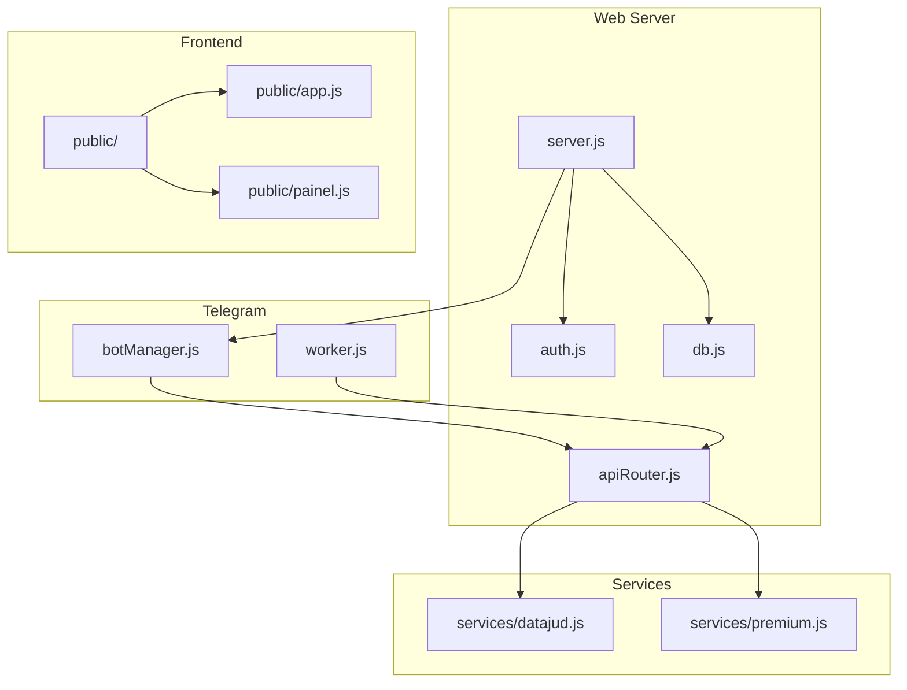
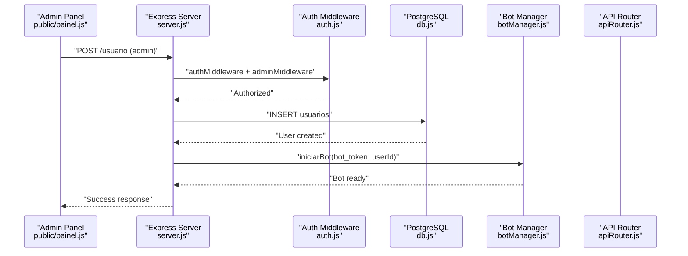
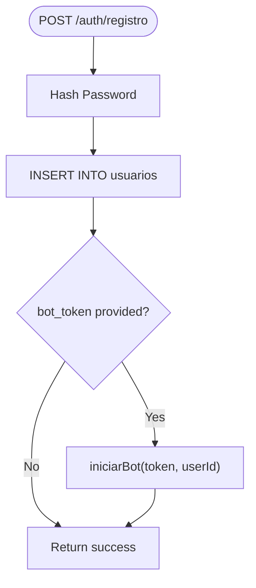
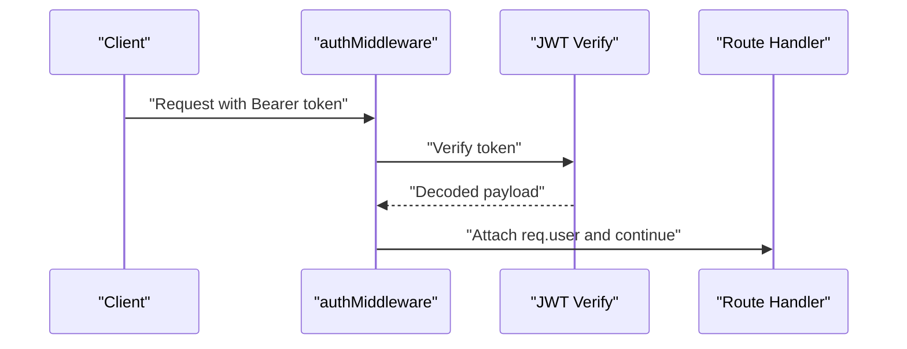
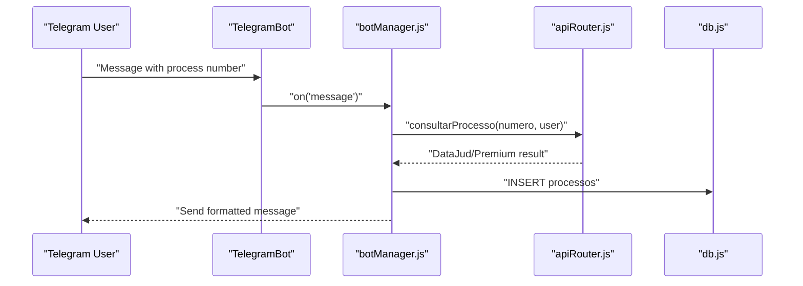
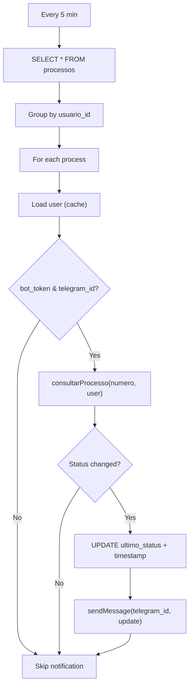
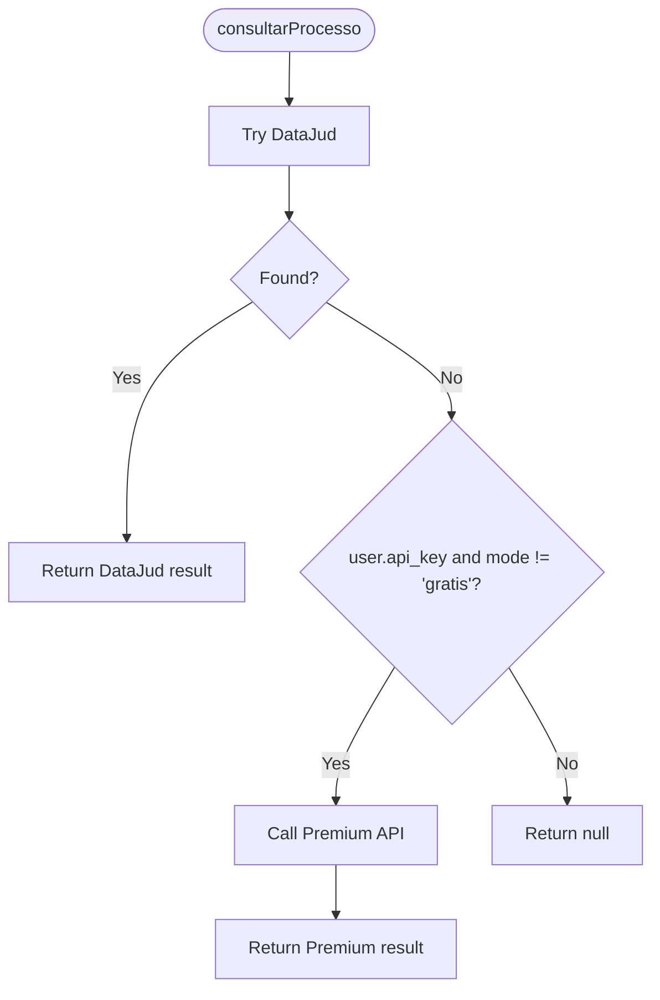
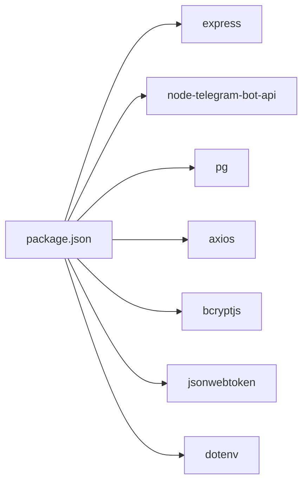

# Development Guidelines

<cite>
**Referenced Files in This Document**
- [README.md](file://README.md)
- [package.json](file://package.json)
- [server.js](file://server.js)
- [botManager.js](file://botManager.js)
- [worker.js](file://worker.js)
- [auth.js](file://auth.js)
- [apiRouter.js](file://apiRouter.js)
- [services/datajud.js](file://services/datajud.js)
- [services/premium.js](file://services/premium.js)
- [db.js](file://db.js)
- [database.sql](file://database.sql)
- [public/app.js](file://public/app.js)
- [public/painel.js](file://public/painel.js)
</cite>

## Table of Contents
1. [Introduction](#introduction)
2. [Project Structure](#project-structure)
3. [Core Components](#core-components)
4. [Architecture Overview](#architecture-overview)
5. [Detailed Component Analysis](#detailed-component-analysis)
6. [Dependency Analysis](#dependency-analysis)
7. [Performance Considerations](#performance-considerations)
8. [Testing Strategies](#testing-strategies)
9. [Debugging Techniques](#debugging-techniques)
10. [Contribution Guidelines](#contribution-guidelines)
11. [Development Environment Setup](#development-environment-setup)
12. [Code Quality Standards](#code-quality-standards)
13. [Documentation Requirements](#documentation-requirements)
14. [Continuous Integration Practices](#continuous-integration-practices)
15. [Troubleshooting Guide](#troubleshooting-guide)
16. [Conclusion](#conclusion)

## Introduction
This document provides comprehensive development guidelines for the Judicial Process Monitoring SaaS system. It covers code standards, testing strategies, contributing workflows, debugging techniques, environment setup, and operational practices. The system integrates a Telegram bot, a web administration panel, a PostgreSQL backend, and external APIs for judicial data retrieval.

## Project Structure
The project follows a modular structure:
- Backend server and routing in server.js
- Telegram bot orchestration in botManager.js
- Background monitoring worker in worker.js
- Authentication and middleware in auth.js
- API routing and fallback logic in apiRouter.js
- Service integrations in services/datajud.js and services/premium.js
- Database connection and schema in db.js and database.sql
- Frontend assets and client-side scripts in public/

**Diagram sources**
- [server.js:1-162](file://server.js#L1-L162)
- [auth.js:1-59](file://auth.js#L1-L59)
- [apiRouter.js:1-19](file://apiRouter.js#L1-L19)
- [botManager.js:1-53](file://botManager.js#L1-L53)
- [worker.js:1-70](file://worker.js#L1-L70)
- [services/datajud.js:1-32](file://services/datajud.js#L1-L32)
- [services/premium.js:1-12](file://services/premium.js#L1-L12)
- [db.js:1-11](file://db.js#L1-L11)
- [public/app.js:1-53](file://public/app.js#L1-L53)
- [public/painel.js:1-158](file://public/painel.js#L1-L158)

**Section sources**
- [README.md:1-56](file://README.md#L1-L56)
- [package.json:1-21](file://package.json#L1-L21)

## Core Components
- Web Server: Express-based API with authentication, user management, and process listing.
- Telegram Bot Manager: Polling-based bot handler per user with message processing and insertion of monitored processes.
- Worker: Periodic background job that checks for updates and notifies users via Telegram.
- Authentication: JWT-based middleware with bcrypt password hashing and role-based access control.
- API Router: Free tier (DataJud) with fallback to paid service based on user mode and API key.
- Services: DataJud free API integration and placeholder for premium provider.
- Database: PostgreSQL schema with users and monitored processes.
- Frontend: Minimal client scripts for registration and admin panel interactions.

**Section sources**
- [server.js:1-162](file://server.js#L1-L162)
- [botManager.js:1-53](file://botManager.js#L1-L53)
- [worker.js:1-70](file://worker.js#L1-L70)
- [auth.js:1-59](file://auth.js#L1-L59)
- [apiRouter.js:1-19](file://apiRouter.js#L1-L19)
- [services/datajud.js:1-32](file://services/datajud.js#L1-L32)
- [services/premium.js:1-12](file://services/premium.js#L1-L12)
- [db.js:1-11](file://db.js#L1-L11)
- [database.sql:1-25](file://database.sql#L1-L25)
- [public/app.js:1-53](file://public/app.js#L1-L53)
- [public/painel.js:1-158](file://public/painel.js#L1-L158)

## Architecture Overview
The system comprises three primary runtime processes:
- Web server: Handles HTTP requests, authentication, and serves static assets.
- Telegram bot manager: Initializes and manages user-specific bots.
- Worker: Periodically polls for process updates and sends Telegram notifications.

**Diagram sources**
- [public/painel.js:110-146](file://public/painel.js#L110-L146)
- [server.js:70-92](file://server.js#L70-L92)
- [auth.js:16-39](file://auth.js#L16-L39)
- [db.js:1-11](file://db.js#L1-L11)
- [botManager.js:7-42](file://botManager.js#L7-L42)

## Detailed Component Analysis

### Web Server and Routes
- Registration endpoint creates users, hashes passwords, optionally starts a Telegram bot, and returns success metadata.
- Login endpoint validates credentials, generates JWT tokens, and returns user profile.
- Admin endpoints manage users and list processes with role-based filtering.
- Profile endpoint verifies token and returns current user details.
- On startup, loads existing bots and seeds an admin account if missing.

**Diagram sources**
- [server.js:11-36](file://server.js#L11-L36)
- [botManager.js:7-42](file://botManager.js#L7-L42)

**Section sources**
- [server.js:11-135](file://server.js#L11-L135)

### Authentication and Authorization
- JWT generation and verification with secret from environment.
- Middleware extracts token from Authorization header and decodes payload.
- Admin-only routes enforced by role check after authentication.

**Diagram sources**
- [auth.js:17-31](file://auth.js#L17-L31)

**Section sources**
- [auth.js:1-59](file://auth.js#L1-L59)

### Telegram Bot Management
- Maintains a cache of bot instances keyed by token.
- Processes incoming messages, queries DataJud, inserts monitored processes, and responds to users.
- Loads and initializes bots for existing users on server startup.

**Diagram sources**
- [botManager.js:13-39](file://botManager.js#L13-L39)
- [apiRouter.js:4-16](file://apiRouter.js#L4-L16)
- [db.js:1-11](file://db.js#L1-L11)

**Section sources**
- [botManager.js:1-53](file://botManager.js#L1-L53)

### Worker Monitoring Loop
- Periodic polling (every 5 minutes) checks all monitored processes.
- Groups by user to minimize repeated queries and caches user data.
- Sends Telegram notifications when status changes and updates last status.

**Diagram sources**
- [worker.js:17-61](file://worker.js#L17-L61)
- [apiRouter.js:4-16](file://apiRouter.js#L4-L16)

**Section sources**
- [worker.js:1-70](file://worker.js#L1-L70)

### API Routing and Fallback Logic
- Attempts free DataJud lookup first.
- Falls back to premium provider when user has API key and mode is not 'gratis'.

**Diagram sources**
- [apiRouter.js:4-16](file://apiRouter.js#L4-L16)
- [services/datajud.js:3-29](file://services/datajud.js#L3-L29)
- [services/premium.js:1-12](file://services/premium.js#L1-L12)

**Section sources**
- [apiRouter.js:1-19](file://apiRouter.js#L1-L19)

### Frontend Scripts
- Minimal client script for admin panel handles navigation, data loading, user creation, and logout.
- Basic client script for registration flow posts to admin endpoint and resets form on success.

**Section sources**
- [public/painel.js:1-158](file://public/painel.js#L1-L158)
- [public/app.js:1-53](file://public/app.js#L1-L53)

## Dependency Analysis
External dependencies include Express, node-telegram-bot-api, pg, axios, bcryptjs, jsonwebtoken, and dotenv. Scripts define separate processes for server and worker.

**Diagram sources**
- [package.json:11-19](file://package.json#L11-L19)

**Section sources**
- [package.json:1-21](file://package.json#L1-L21)

## Performance Considerations
- Bot caching: Reuse TelegramBot instances keyed by token to avoid recreation overhead.
- User cache: Worker groups processes by user and caches user records to reduce database queries.
- Rate limiting: The polling interval is set to 5 minutes; adjust based on API quotas and latency.
- Database connections: Use connection pooling via pg.Pool configured in db.js.
- Frontend polling: Client-side periodic refresh reduces manual reloads but should be tuned to avoid excessive load.

[No sources needed since this section provides general guidance]

## Testing Strategies
Unit tests:
- Test authentication middleware behavior with valid/invalid/expired tokens.
- Mock bcrypt and JWT to isolate logic and assert side effects.
- Validate password hashing and comparison functions.

Integration tests:
- Test registration flow: POST /auth/registro with valid/invalid inputs and database constraints.
- Test login flow: Verify token generation and user profile retrieval.
- Test admin user creation: Ensure proper role enforcement and bot initialization.

End-to-end tests:
- Simulate Telegram message flow: Send process number, verify database insert, and notification delivery.
- Worker loop: Insert monitored process, trigger loop, and assert status change and notification.

API contract tests:
- Validate DataJud and premium service responses and error handling paths.
- Ensure apiRouter fallback logic behaves as expected under various user modes.

[No sources needed since this section provides general guidance]

## Debugging Techniques
Database connectivity:
- Verify environment variables for database connection and confirm pool configuration.
- Check connection logs and ensure the database is reachable from the host.

Telegram bot communication:
- Confirm bot token validity and webhook/polling configuration.
- Validate chat ID and message formatting.
- Inspect bot instance caching and initialization order.

API integration problems:
- Log request/response bodies for DataJud and premium services.
- Handle network errors and timeouts gracefully.
- Validate fallback logic and user mode conditions.

Frontend issues:
- Inspect Authorization headers and token persistence in localStorage.
- Verify CORS and route permissions for admin endpoints.

[No sources needed since this section provides general guidance]

## Contribution Guidelines
Code review checklist:
- Adhere to consistent naming conventions and module structure.
- Validate error handling and logging across asynchronous flows.
- Ensure environment variables are properly documented and secured.

Pull request process:
- Branch naming: feature/short-description, fix/issue-number.
- Commit messages: present tense, concise, include issue reference.
- Squash commits before merging to maintain clean history.

Feature development workflow:
- Create feature branch from develop.
- Add unit/integration tests alongside new logic.
- Update documentation and README changes.
- Request review from maintainers and address feedback promptly.

[No sources needed since this section provides general guidance]

## Development Environment Setup
Prerequisites:
- Node.js LTS and npm.
- PostgreSQL server and credentials.
- Telegram Bot token from BotFather.

Steps:
- Install dependencies: npm install.
- Initialize database: run database.sql against a PostgreSQL instance.
- Configure environment variables (.env): database credentials, JWT secret, Telegram tokens.
- Start services:
  - Web server and bots: npm start (or concurrently run server and worker).
  - Worker only: npm run worker.
  - Development: npm run dev.

IDE configuration:
- Enable ESLint and Prettier extensions.
- Configure Node.js runtime and environment variables in IDE.
- Set breakpoints in server.js, botManager.js, and worker.js for debugging.

[No sources needed since this section provides general guidance]

## Code Quality Standards
JavaScript standards:
- Use strict equality checks (===) and consistent indentation.
- Prefer async/await over callbacks for readability.
- Centralize error handling and return structured error responses.

File organization:
- Keep modules cohesive and single-responsibility.
- Place shared utilities in centralized modules (e.g., auth.js, db.js).

Module structure:
- Route handlers in server.js, business logic in dedicated modules.
- Service integrations in services/ with clear function boundaries.

[No sources needed since this section provides general guidance]

## Documentation Requirements
- Inline comments for complex logic in server.js, botManager.js, and worker.js.
- README updates for new features, environment variables, and operational procedures.
- API documentation for endpoints with request/response schemas.

[No sources needed since this section provides general guidance]

## Continuous Integration Practices
- Automated linting and formatting checks on pull requests.
- Unit and integration tests in CI pipeline.
- Security scanning for dependencies.
- Deployment pipeline for staging and production environments.

[No sources needed since this section provides general guidance]

## Troubleshooting Guide
Common issues and resolutions:
- Database connection failures: verify DB_HOST, DB_USER, DB_PASSWORD, DB_NAME, DB_PORT.
- Authentication errors: ensure JWT_SECRET is set and tokens are sent with Bearer scheme.
- Telegram bot not responding: confirm bot_token correctness and polling configuration.
- API quota exceeded: implement retry/backoff and monitor fallback behavior.
- Frontend not loading data: check Authorization headers and CORS policies.

**Section sources**
- [db.js:1-11](file://db.js#L1-L11)
- [auth.js:17-31](file://auth.js#L17-L31)
- [botManager.js:11-13](file://botManager.js#L11-L13)
- [apiRouter.js:4-16](file://apiRouter.js#L4-L16)
- [public/painel.js:110-146](file://public/painel.js#L110-L146)

## Conclusion
These guidelines establish a consistent development workflow, robust error handling, and scalable architecture for the Judicial Process Monitoring SaaS. By following the outlined standards, testing strategies, and debugging techniques, contributors can efficiently extend functionality while maintaining system reliability and performance.