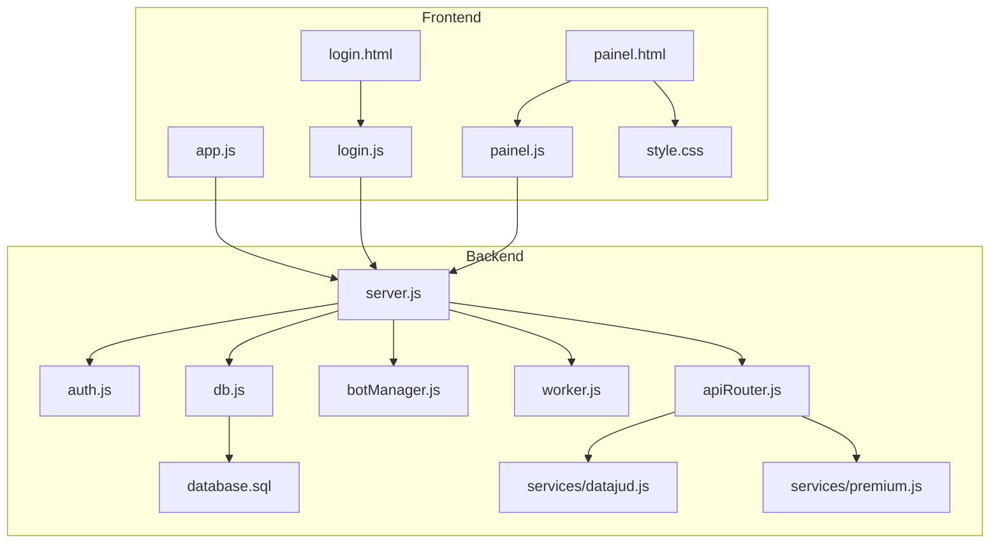
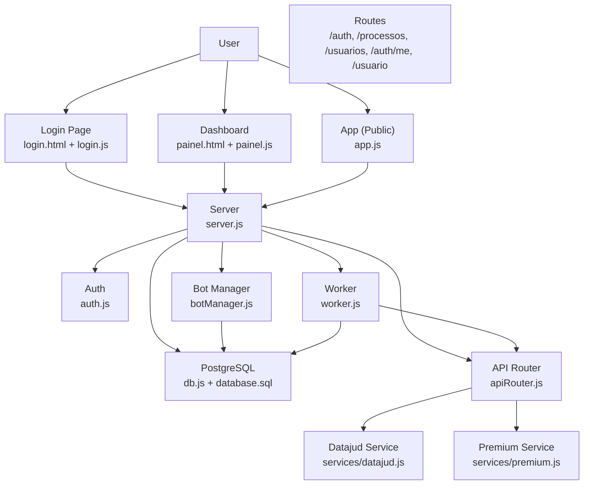
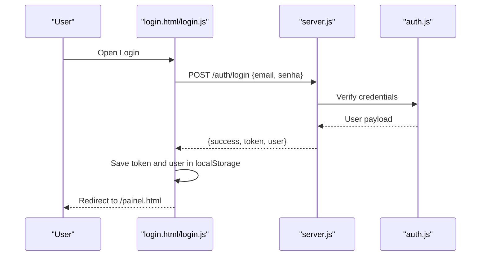
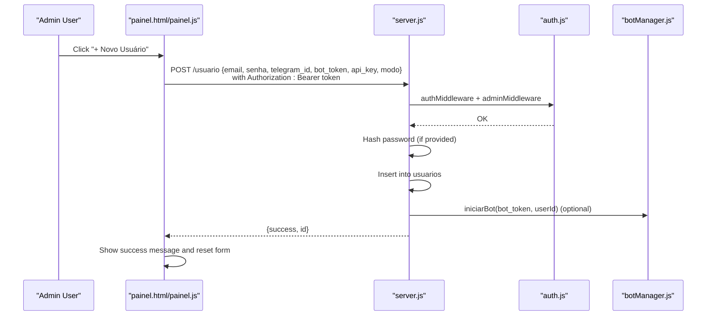
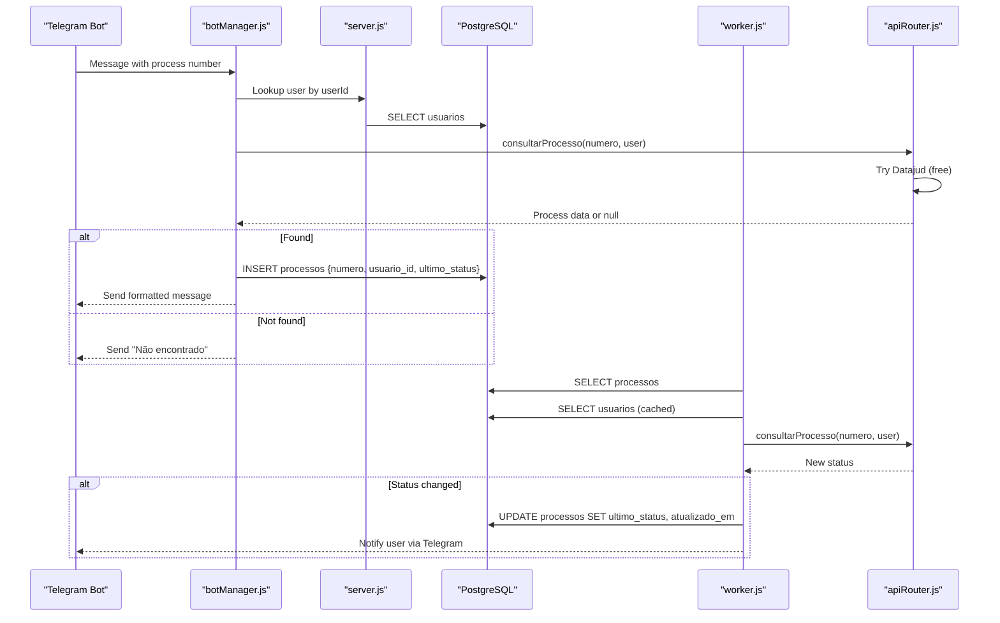
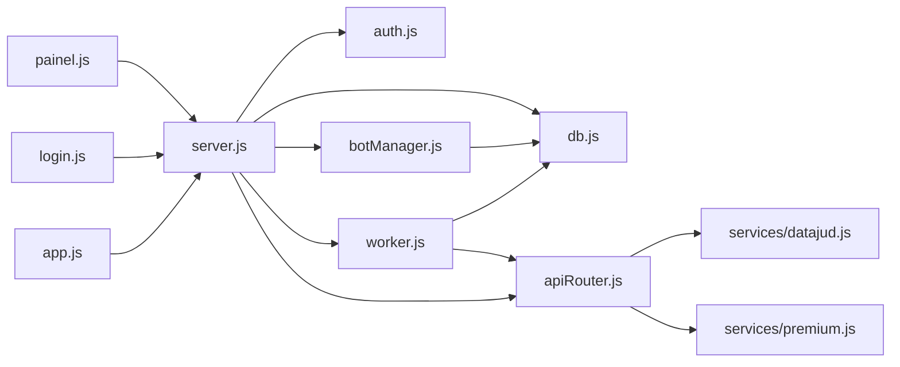

# Admin Panel

<cite>
**Referenced Files in This Document**
- [public/painel.html](file://public/painel.html)
- [public/painel.js](file://public/painel.js)
- [public/app.js](file://public/app.js)
- [public/style.css](file://public/style.css)
- [public/login.html](file://public/login.html)
- [public/login.js](file://public/login.js)
- [server.js](file://server.js)
- [auth.js](file://auth.js)
- [apiRouter.js](file://apiRouter.js)
- [botManager.js](file://botManager.js)
- [worker.js](file://worker.js)
- [services/datajud.js](file://services/datajud.js)
- [services/premium.js](file://services/premium.js)
- [db.js](file://db.js)
- [database.sql](file://database.sql)
</cite>

## Table of Contents
1. [Introduction](#introduction)
2. [Project Structure](#project-structure)
3. [Core Components](#core-components)
4. [Architecture Overview](#architecture-overview)
5. [Detailed Component Analysis](#detailed-component-analysis)
6. [Dependency Analysis](#dependency-analysis)
7. [Performance Considerations](#performance-considerations)
8. [Troubleshooting Guide](#troubleshooting-guide)
9. [Conclusion](#conclusion)

## Introduction
This document describes the admin panel interface for managing users, monitoring processes, and administering the system. It covers the main admin page structure, user creation forms, process monitoring dashboards, and administrative controls. It also explains the JavaScript implementation for user CRUD operations, process search functionality, and real-time data updates, along with CSS styling patterns, responsive design elements, and user experience optimizations. Administrative-only features, security considerations, and practical examples of form submissions and AJAX requests are included.

## Project Structure
The admin panel is a client-server application with a frontend built in HTML/CSS/JavaScript and a backend implemented in Node.js with PostgreSQL. The frontend includes:
- Login page and logic
- Admin dashboard with navigation, user listing, user creation, process monitoring, and configuration
- Shared styles for dark theme, responsive layout, and interactive UI

The backend exposes REST endpoints for authentication, user management, process retrieval, and profile information, protected by JWT-based middleware and role checks.

**Diagram sources**
- [public/login.html](file://public/login.html)
- [public/login.js](file://public/login.js)
- [public/painel.html](file://public/painel.html)
- [public/painel.js](file://public/painel.js)
- [public/app.js](file://public/app.js)
- [public/style.css](file://public/style.css)
- [server.js](file://server.js)
- [auth.js](file://auth.js)
- [db.js](file://db.js)
- [database.sql](file://database.sql)
- [botManager.js](file://botManager.js)
- [worker.js](file://worker.js)
- [apiRouter.js](file://apiRouter.js)
- [services/datajud.js](file://services/datajud.js)
- [services/premium.js](file://services/premium.js)

**Section sources**
- [public/painel.html](file://public/painel.html)
- [public/painel.js](file://public/painel.js)
- [public/app.js](file://public/app.js)
- [public/style.css](file://public/style.css)
- [public/login.html](file://public/login.html)
- [public/login.js](file://public/login.js)
- [server.js](file://server.js)
- [auth.js](file://auth.js)
- [apiRouter.js](file://apiRouter.js)
- [botManager.js](file://botManager.js)
- [worker.js](file://worker.js)
- [services/datajud.js](file://services/datajud.js)
- [services/premium.js](file://services/premium.js)
- [db.js](file://db.js)
- [database.sql](file://database.sql)

## Core Components
- Admin dashboard page with role-based navigation and sections
- User creation form for administrators
- Process monitoring table with automatic refresh
- Client configuration view
- Authentication flow with JWT tokens stored locally
- Real-time notifications via Telegram bot integration
- Worker process for periodic status updates and notifications

Key implementation highlights:
- Role-based UI visibility and access control
- Fetch-based AJAX for endpoints with Authorization headers
- Automatic polling for live updates
- Telegram bot initialization per user with caching
- Premium fallback after free tier lookup

**Section sources**
- [public/painel.html](file://public/painel.html)
- [public/painel.js](file://public/painel.js)
- [public/app.js](file://public/app.js)
- [public/style.css](file://public/style.css)
- [public/login.html](file://public/login.html)
- [public/login.js](file://public/login.js)
- [server.js](file://server.js)
- [auth.js](file://auth.js)
- [botManager.js](file://botManager.js)
- [worker.js](file://worker.js)

## Architecture Overview
The system follows a layered architecture:
- Presentation layer: HTML pages and JavaScript clients
- Application layer: Express routes and middleware
- Domain services: Process lookup orchestration
- Infrastructure: Database and external APIs

**Diagram sources**
- [public/login.html](file://public/login.html)
- [public/login.js](file://public/login.js)
- [public/painel.html](file://public/painel.html)
- [public/painel.js](file://public/painel.js)
- [public/app.js](file://public/app.js)
- [server.js](file://server.js)
- [auth.js](file://auth.js)
- [db.js](file://db.js)
- [database.sql](file://database.sql)
- [worker.js](file://worker.js)
- [botManager.js](file://botManager.js)
- [apiRouter.js](file://apiRouter.js)
- [services/datajud.js](file://services/datajud.js)
- [services/premium.js](file://services/premium.js)

## Detailed Component Analysis

### Admin Dashboard Page (painel.html)
- Contains two role-specific menus: admin menu (Processos, Usuários, + Novo Usuário) and client menu (Meus Processos, Configurações)
- Sections for:
  - Processos table with columns Number, Status, Updated, and optional User column for admins
  - Usuários table for admin listing
  - Cadastrar Novo Usuário form for admin
  - Configurações section for current user
- Uses local storage for token and user info to drive UI visibility and data loading

**Section sources**
- [public/painel.html](file://public/painel.html)

### Admin Dashboard Script (painel.js)
Responsibilities:
- Load token and user from localStorage; redirect to login if missing
- Configure UI based on user role (admin vs client)
- Switch active sections and trigger data loads
- Load processes with optional user column for admins
- Load users (admin-only)
- Load current user configuration
- Submit new user creation via POST to /usuario with Authorization header
- Periodic refresh of process list every 5 seconds

AJAX and endpoints:
- GET /processos with Authorization header
- GET /usuarios with Authorization header (admin-only)
- GET /auth/me with Authorization header
- POST /usuario with Authorization and admin middleware

Real-time behavior:
- carregarProcessos runs immediately and repeats every 5000 ms

Security:
- Uses Authorization: Bearer token for protected endpoints

**Section sources**
- [public/painel.js](file://public/painel.js)
- [server.js](file://server.js)
- [auth.js](file://auth.js)

### Public App Script (app.js)
Responsibilities:
- Submit new user registration for public sign-up (no admin privileges)
- Load and poll process list for public view
- Clear form fields on successful registration

AJAX and endpoints:
- POST /usuario (public registration)
- GET /processos (public list)

Polling:
- carregar runs immediately and repeats every 5000 ms

**Section sources**
- [public/app.js](file://public/app.js)
- [server.js](file://server.js)

### Login Page and Script (login.html, login.js)
Responsibilities:
- Toggle between Login and Cadastro tabs
- Authenticate existing users and persist token/user
- Register new users with validation and optional bot/API configuration
- Redirect to dashboard upon successful login

AJAX and endpoints:
- POST /auth/login
- POST /auth/registro

Validation:
- Password confirmation check before registration

**Section sources**
- [public/login.html](file://public/login.html)
- [public/login.js](file://public/login.js)
- [server.js](file://server.js)

### Backend Routes and Security (server.js, auth.js)
Endpoints:
- POST /auth/registro: Creates user, hashes password, optionally starts bot, returns success
- POST /auth/login: Validates credentials, generates JWT, returns token and user info
- POST /usuario: Admin-only endpoint to create users with optional bot startup
- GET /processos: Returns processes; admins see all, clients see only theirs
- GET /usuarios: Admin-only listing of users
- GET /auth/me: Returns current user profile

Security:
- authMiddleware validates JWT
- adminMiddleware restricts access to admin
- Password hashing and comparison helpers

**Section sources**
- [server.js](file://server.js)
- [auth.js](file://auth.js)

### Process Lookup Orchestration (apiRouter.js)
Responsibilities:
- Attempt free lookup via Datajud
- Fallback to premium lookup when configured and mode allows
- Return normalized process data

**Section sources**
- [apiRouter.js](file://apiRouter.js)
- [services/datajud.js](file://services/datajud.js)
- [services/premium.js](file://services/premium.js)

### Telegram Bot Integration (botManager.js)
Responsibilities:
- Initialize Telegram bots per user token
- Handle incoming messages as process numbers
- Store initial process records and send formatted messages
- Rehydrate bots on server restart

**Section sources**
- [botManager.js](file://botManager.js)

### Worker for Notifications (worker.js)
Responsibilities:
- Periodically check all processes for updates
- Compare last known status with latest lookup
- Update status and notify users via Telegram when changed
- Cache users and bots to reduce repeated queries and instances

**Section sources**
- [worker.js](file://worker.js)

### Database Schema (database.sql, db.js)
Tables:
- usuarios: id, email, senha, tipo, telegram_id, bot_token, api_key, modo, criado_em
- processos: id, numero, usuario_id, ultimo_status, atualizado_em

Indexes and relationships:
- processos.usuario_id references usuarios.id

**Section sources**
- [database.sql](file://database.sql)
- [db.js](file://db.js)

### CSS Styling Patterns (style.css)
Design characteristics:
- Dark theme with high contrast text and backgrounds
- Responsive container and flexible inputs/buttons
- Tabbed forms with active state indicators
- Badge styling for role labels (admin/client)
- Hidden class for conditional visibility
- Table styling with borders and alternating rows
- Hover effects on buttons

Responsive elements:
- Flexbox layouts for navbar and login container
- Full-width inputs and buttons
- Max widths for containers

**Section sources**
- [public/style.css](file://public/style.css)

## Architecture Overview

### Authentication Flow

**Diagram sources**
- [public/login.html](file://public/login.html)
- [public/login.js](file://public/login.js)
- [server.js](file://server.js)
- [auth.js](file://auth.js)

### Admin User Creation Flow

**Diagram sources**
- [public/painel.html](file://public/painel.html)
- [public/painel.js](file://public/painel.js)
- [server.js](file://server.js)
- [auth.js](file://auth.js)
- [botManager.js](file://botManager.js)

### Process Monitoring and Notifications

**Diagram sources**
- [botManager.js](file://botManager.js)
- [server.js](file://server.js)
- [worker.js](file://worker.js)
- [apiRouter.js](file://apiRouter.js)
- [services/datajud.js](file://services/datajud.js)
- [services/premium.js](file://services/premium.js)
- [db.js](file://db.js)

## Dependency Analysis
- Frontend depends on backend endpoints and stores JWT in localStorage
- Backend depends on:
  - auth.js for JWT and password utilities
  - db.js for PostgreSQL connection
  - botManager.js for Telegram integration
  - worker.js for periodic tasks
  - apiRouter.js for process lookup orchestration
  - services/datajud.js and services/premium.js for external APIs

**Diagram sources**
- [public/painel.js](file://public/painel.js)
- [public/login.js](file://public/login.js)
- [public/app.js](file://public/app.js)
- [server.js](file://server.js)
- [auth.js](file://auth.js)
- [db.js](file://db.js)
- [botManager.js](file://botManager.js)
- [worker.js](file://worker.js)
- [apiRouter.js](file://apiRouter.js)
- [services/datajud.js](file://services/datajud.js)
- [services/premium.js](file://services/premium.js)

**Section sources**
- [public/painel.js](file://public/painel.js)
- [public/login.js](file://public/login.js)
- [public/app.js](file://public/app.js)
- [server.js](file://server.js)
- [auth.js](file://auth.js)
- [apiRouter.js](file://apiRouter.js)
- [botManager.js](file://botManager.js)
- [worker.js](file://worker.js)
- [services/datajud.js](file://services/datajud.js)
- [services/premium.js](file://services/premium.js)
- [db.js](file://db.js)

## Performance Considerations
- Polling intervals:
  - Dashboard processes refresh every 5 seconds; adjust based on load and UX needs
- Database queries:
  - Worker caches user lookups per batch to avoid repeated queries
  - Bot manager caches Telegram bot instances by token
- External API calls:
  - Free tier lookup first, then paid fallback only when configured and allowed
- UI rendering:
  - Append-only DOM updates for tables; consider virtualization for very large datasets
- Network:
  - Use Authorization headers consistently; handle network errors gracefully

## Troubleshooting Guide
Common issues and resolutions:
- Unauthorized access:
  - Ensure Authorization: Bearer token is present for protected endpoints
  - Confirm user role is admin for /usuarios and /usuario
- Token expiration:
  - JWT expires in 24 hours; re-login when receiving 401 Token inválido
- Duplicate email:
  - Registration returns Email already registered; change email
- No updates in dashboard:
  - Verify polling is active and network connectivity
  - Confirm Telegram bot is configured for user notifications
- Worker not notifying:
  - Check that user has telegram_id and bot_token set
  - Ensure worker is running and scheduled interval is effective

**Section sources**
- [server.js](file://server.js)
- [auth.js](file://auth.js)
- [public/painel.js](file://public/painel.js)
- [worker.js](file://worker.js)
- [botManager.js](file://botManager.js)

## Conclusion
The admin panel provides a secure, role-aware interface for managing users, monitoring processes, and configuring accounts. It leverages JWT-based authentication, protected endpoints, and real-time Telegram notifications to deliver an efficient operational experience. The frontend uses straightforward AJAX flows and periodic polling to keep data fresh, while the backend orchestrates process lookups, maintains user and process state, and scales bot integrations. Administrators can efficiently oversee multiple users and processes with clear dashboards and streamlined controls.