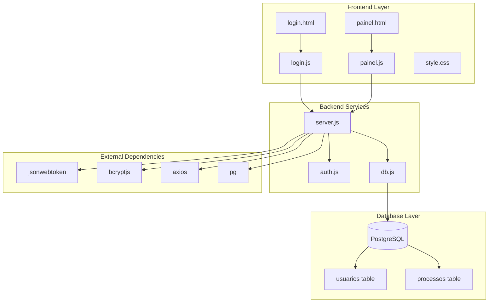
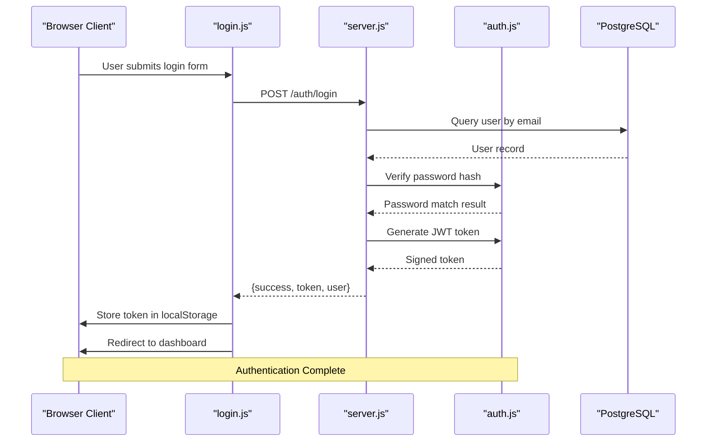
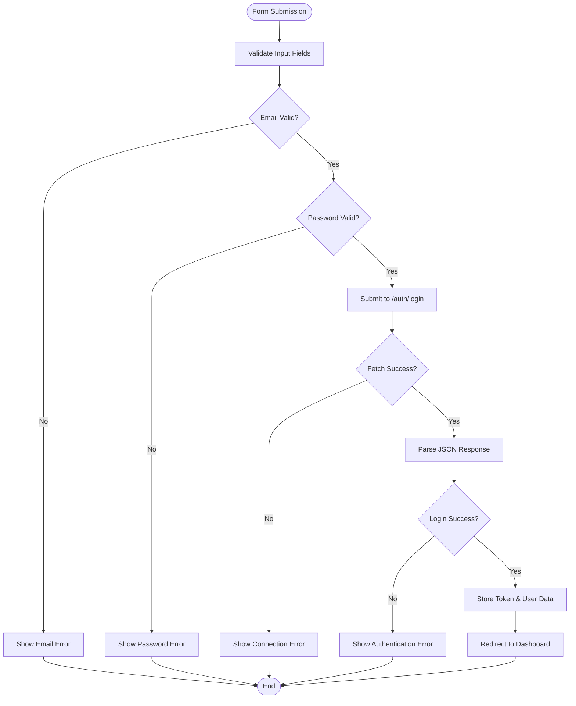
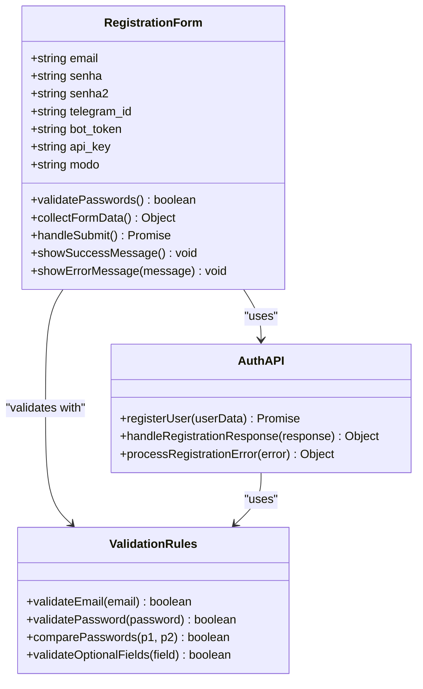
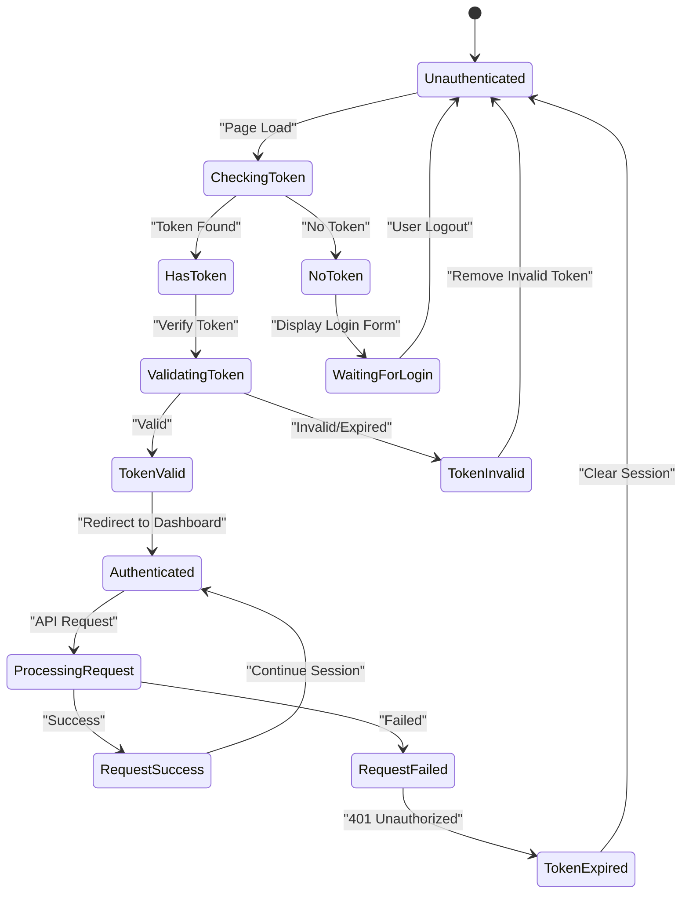
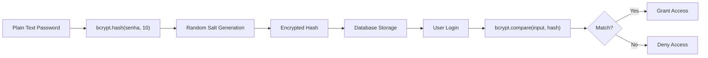
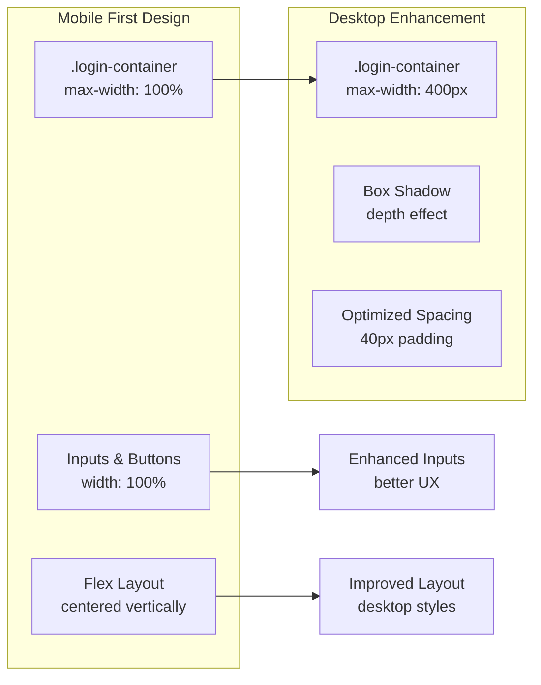
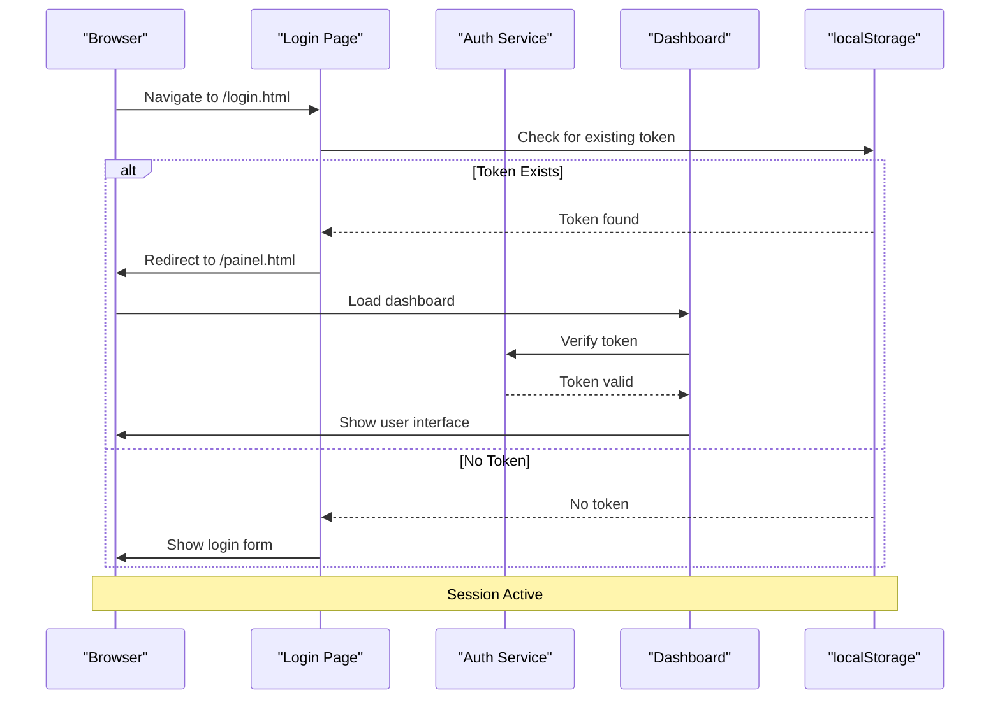
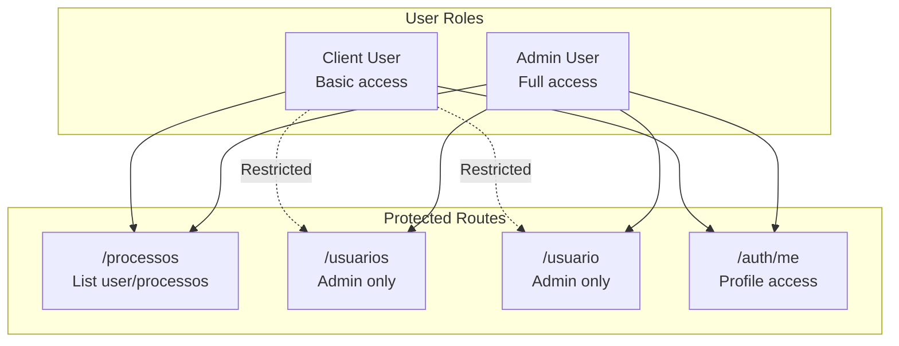

# Authentication Interface

<cite>
**Referenced Files in This Document**
- [login.html](file://public/login.html)
- [login.js](file://public/login.js)
- [style.css](file://public/style.css)
- [auth.js](file://auth.js)
- [server.js](file://server.js)
- [painel.html](file://public/painel.html)
- [painel.js](file://public/painel.js)
- [db.js](file://db.js)
- [database.sql](file://database.sql)
- [package.json](file://package.json)
</cite>

## Table of Contents
1. [Introduction](#introduction)
2. [Project Structure](#project-structure)
3. [Core Components](#core-components)
4. [Architecture Overview](#architecture-overview)
5. [Detailed Component Analysis](#detailed-component-analysis)
6. [Security Implementation](#security-implementation)
7. [User Experience Design](#user-experience-design)
8. [Session Management](#session-management)
9. [API Integration](#api-integration)
10. [Troubleshooting Guide](#troubleshooting-guide)
11. [Conclusion](#conclusion)

## Introduction

The Authentication Interface is a comprehensive login and registration system built with modern web technologies. This system provides secure user authentication using JWT tokens, responsive design for mobile devices, and robust session management. The interface supports both client and administrative user roles with role-based access control and real-time data synchronization.

The system consists of three main components: a clean login interface with tabbed navigation, a secure backend authentication service, and a responsive dashboard for authenticated users. The authentication flow ensures secure credential handling, password encryption, and persistent session management.

## Project Structure

The authentication system follows a modular architecture with clear separation between frontend presentation, backend services, and database management.



**Diagram sources**
- [login.html:1-48](file://public/login.html#L1-L48)
- [server.js:1-162](file://server.js#L1-L162)
- [auth.js:1-59](file://auth.js#L1-L59)

**Section sources**
- [login.html:1-48](file://public/login.html#L1-L48)
- [server.js:1-162](file://server.js#L1-L162)
- [package.json:1-21](file://package.json#L1-L21)

## Core Components

### Frontend Authentication Interface

The authentication interface consists of two primary pages: the login page and the user dashboard.

**Login Page Features:**
- Tabbed interface for login and registration
- Email and password validation
- Real-time error feedback
- Responsive design for all devices
- Smooth transitions between forms

**Dashboard Features:**
- Role-based navigation menus
- Real-time data synchronization
- User profile management
- Administrative user management
- Session-aware routing

**Section sources**
- [login.html:17-42](file://public/login.html#L17-L42)
- [painel.html:18-92](file://public/painel.html#L18-L92)

### Backend Authentication Service

The backend service provides comprehensive authentication functionality including user registration, login validation, token generation, and role-based access control.

**Key Services:**
- JWT token generation and verification
- Password hashing and comparison
- User registration with validation
- Login authentication workflow
- Middleware for protected routes

**Section sources**
- [auth.js:1-59](file://auth.js#L1-L59)
- [server.js:11-68](file://server.js#L11-L68)

### Database Schema

The system uses PostgreSQL for data persistence with a normalized schema supporting user management and process tracking.

**User Management:**
- Email-based authentication
- Role-based access control
- Optional Telegram integration
- Subscription tier management

**Process Tracking:**
- Case number management
- Status updates
- Timestamp tracking
- User association

**Section sources**
- [database.sql:5-24](file://database.sql#L5-L24)

## Architecture Overview

The authentication system implements a client-server architecture with JWT-based stateless authentication and local storage for session persistence.



**Diagram sources**
- [login.js:19-46](file://public/login.js#L19-L46)
- [server.js:38-68](file://server.js#L38-L68)
- [auth.js:8-14](file://auth.js#L8-L14)

The architecture ensures secure authentication while maintaining good user experience through immediate feedback and seamless navigation.

## Detailed Component Analysis

### Login Form Implementation

The login form provides a clean, intuitive interface with comprehensive validation and error handling.



**Diagram sources**
- [login.js:19-46](file://public/login.js#L19-L46)

**Key Features:**
- Real-time form validation
- Comprehensive error handling
- Secure password transmission
- Immediate user feedback
- Tab switching functionality

**Section sources**
- [login.html:18-23](file://public/login.html#L18-L23)
- [login.js:19-46](file://public/login.js#L19-L46)

### Registration Form Implementation

The registration form extends the login functionality with additional user profile fields and enhanced validation.



**Diagram sources**
- [login.js:48-90](file://public/login.js#L48-L90)
- [login.html:25-42](file://public/login.html#L25-L42)

**Section sources**
- [login.html:25-42](file://public/login.html#L25-L42)
- [login.js:48-90](file://public/login.js#L48-L90)

### JWT Token Management

The system implements secure token-based authentication with automatic refresh and validation.



**Diagram sources**
- [login.js:1-5](file://public/login.js#L1-L5)
- [painel.js:1-6](file://public/painel.js#L1-L6)

**Section sources**
- [auth.js:8-14](file://auth.js#L8-L14)
- [server.js:17-31](file://server.js#L17-L31)

### Session Persistence Strategy

The authentication system uses localStorage for client-side session management with automatic cleanup on logout.

**Storage Implementation:**
- Token storage: `localStorage.setItem('token', token)`
- User data: `localStorage.setItem('user', JSON.stringify(user))`
- Cleanup: `localStorage.removeItem('token')` and `localStorage.removeItem('user')`

**Section sources**
- [login.js:37-38](file://public/login.js#L37-L38)
- [painel.js:148-151](file://public/painel.js#L148-L151)

## Security Implementation

### Password Security

The system implements industry-standard password security measures including bcrypt hashing and salted encryption.



**Diagram sources**
- [auth.js:42-49](file://auth.js#L42-L49)

**Security Features:**
- bcrypt hashing with 10 rounds
- Salt generation for each password
- Secure token expiration (24 hours)
- HTTPS-ready architecture
- Input sanitization

**Section sources**
- [auth.js:42-49](file://auth.js#L42-L49)
- [server.js:15-21](file://server.js#L15-L21)

### Token-Based Authentication

JWT tokens provide stateless authentication with automatic expiration and validation.

**Token Structure:**
- Payload: `{ id, email, tipo }`
- Expiration: 24 hours
- Signature: HMAC SHA256
- Secret: Environment-controlled

**Middleware Protection:**
- `authMiddleware`: Validates bearer tokens
- `adminMiddleware`: Restricts admin-only routes
- Automatic user context injection

**Section sources**
- [auth.js:8-31](file://auth.js#L8-L31)
- [server.js:71-92](file://server.js#L71-L92)

### Input Validation and Sanitization

The system implements comprehensive input validation at multiple layers.

**Frontend Validation:**
- HTML5 required attributes
- Real-time field validation
- Password confirmation matching
- Email format validation

**Backend Validation:**
- Database constraint enforcement
- Duplicate email prevention
- Type validation
- Length restrictions

**Section sources**
- [login.html:19-38](file://public/login.html#L19-L38)
- [server.js:30-36](file://server.js#L30-L36)

## User Experience Design

### Responsive Design Implementation

The authentication interface provides optimal user experience across all device sizes.



**Diagram sources**
- [style.css:17-24](file://public/style.css#L17-L24)

**Design Principles:**
- Mobile-first responsive approach
- Dark theme optimized for developer environments
- Consistent spacing and typography
- Accessible color contrast
- Touch-friendly button sizing

**Section sources**
- [style.css:1-213](file://public/style.css#L1-L213)

### Tab Navigation System

The tabbed interface provides seamless switching between login and registration forms.

**Implementation Details:**
- Dynamic form activation/deactivation
- Active state management
- Smooth transitions
- Keyboard accessibility

**Section sources**
- [login.html:12-16](file://public/login.html#L12-L16)
- [login.js:8-16](file://public/login.js#L8-L16)

### Error Handling and Feedback

The system provides comprehensive error handling with user-friendly messaging.

**Error Categories:**
- Network connectivity errors
- Authentication failures
- Validation errors
- Server-side errors

**Feedback Mechanisms:**
- Inline error messages
- Success notifications
- Loading indicators
- Form state persistence

**Section sources**
- [login.js:21-45](file://public/login.js#L21-L45)
- [login.js:52-89](file://public/login.js#L52-L89)

## Session Management

### Authentication State Lifecycle

The authentication system manages user sessions through a well-defined lifecycle.



**Diagram sources**
- [login.js:1-5](file://public/login.js#L1-L5)
- [painel.js:1-6](file://public/painel.js#L1-L6)

### Token Refresh and Renewal

The system handles token expiration gracefully with automatic renewal mechanisms.

**Token Management:**
- 24-hour expiration
- Automatic logout on expiration
- Seamless re-authentication flow
- Graceful degradation on failure

**Section sources**
- [auth.js:10-13](file://auth.js#L10-L13)
- [painel.js:39-40](file://public/painel.js#L39-L40)

### Role-Based Access Control

The system implements comprehensive role-based access control with clear permission boundaries.



**Diagram sources**
- [server.js:94-135](file://server.js#L94-L135)

**Section sources**
- [server.js:33-39](file://server.js#L33-L39)
- [server.js:113-122](file://server.js#L113-L122)

## API Integration

### Authentication Endpoints

The system provides RESTful endpoints for authentication and user management.

**Authentication Endpoints:**
- `POST /auth/login` - User authentication
- `POST /auth/registro` - User registration
- `GET /auth/me` - User profile retrieval

**Protected Endpoints:**
- `GET /processos` - Process listing
- `GET /usuarios` - User management (admin)
- `POST /usuario` - User creation (admin)

**Section sources**
- [server.js:11-68](file://server.js#L11-L68)
- [server.js:70-135](file://server.js#L70-L135)

### Request/Response Patterns

The API follows consistent patterns for authentication requests and responses.

**Login Request Pattern:**
```javascript
// Request
{
  email: "user@example.com",
  senha: "securePassword123"
}

// Success Response
{
  success: true,
  token: "jwt.token.here",
  user: {
    id: 1,
    email: "user@example.com",
    tipo: "cliente"
  }
}

// Error Response
{
  error: "Email ou senha incorretos"
}
```

**Section sources**
- [server.js:38-68](file://server.js#L38-L68)
- [login.js:36-42](file://public/login.js#L36-L42)

### Error Handling Strategy

The system implements comprehensive error handling across all API interactions.

**Error Categories:**
- Authentication errors (401)
- Validation errors (400)
- Authorization errors (403)
- Server errors (500)

**Error Response Format:**
```javascript
{
  error: "Descriptive error message"
}
```

**Section sources**
- [server.js:30-36](file://server.js#L30-L36)
- [server.js:50-52](file://server.js#L50-L52)

## Troubleshooting Guide

### Common Authentication Issues

**Login Failures:**
- Incorrect email/password combination
- Account not yet registered
- Database connection issues
- Token validation failures

**Registration Issues:**
- Duplicate email addresses
- Password mismatch errors
- Database constraint violations
- Network connectivity problems

**Session Problems:**
- Token expiration
- Local storage corruption
- Browser cache issues
- Cross-origin problems

**Section sources**
- [login.js:40-45](file://public/login.js#L40-L45)
- [login.js:84-89](file://public/login.js#L84-L89)

### Debugging Authentication Flow

**Frontend Debugging Steps:**
1. Check browser console for JavaScript errors
2. Verify network requests in developer tools
3. Inspect localStorage contents
4. Monitor authentication state changes

**Backend Debugging Steps:**
1. Review server logs for authentication attempts
2. Check database connection status
3. Verify JWT secret configuration
4. Monitor bcrypt hash operations

**Section sources**
- [login.js:43-45](file://public/login.js#L43-L45)
- [server.js:156-158](file://server.js#L156-L158)

### Performance Optimization

**Frontend Optimizations:**
- Debounced form submissions
- Efficient DOM manipulation
- Minimal re-renders
- Optimized CSS delivery

**Backend Optimizations:**
- Database connection pooling
- JWT token caching
- Efficient query patterns
- Response compression

**Section sources**
- [painel.js:157-158](file://public/painel.js#L157-L158)
- [db.js:4-10](file://db.js#L4-L10)

## Conclusion

The Authentication Interface provides a robust, secure, and user-friendly solution for managing user access to the process management system. The implementation combines modern web technologies with established security practices to deliver a reliable authentication experience.

**Key Strengths:**
- Secure JWT-based authentication
- Comprehensive error handling
- Responsive design for all devices
- Role-based access control
- Persistent session management
- Clean separation of concerns

**Security Features:**
- bcrypt password hashing
- JWT token validation
- Input sanitization
- CORS protection
- HTTPS readiness

**Future Enhancements:**
- Two-factor authentication support
- Password reset functionality
- Session timeout warnings
- Enhanced audit logging
- Multi-device sync capabilities

The system successfully balances security requirements with user experience, providing a foundation for scalable authentication in enterprise environments.