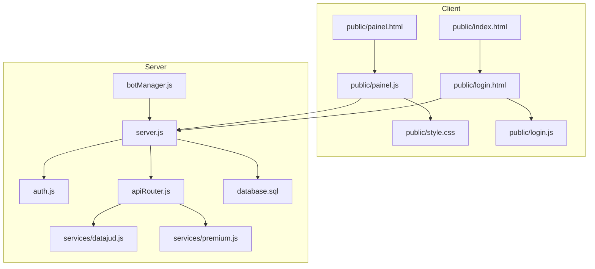
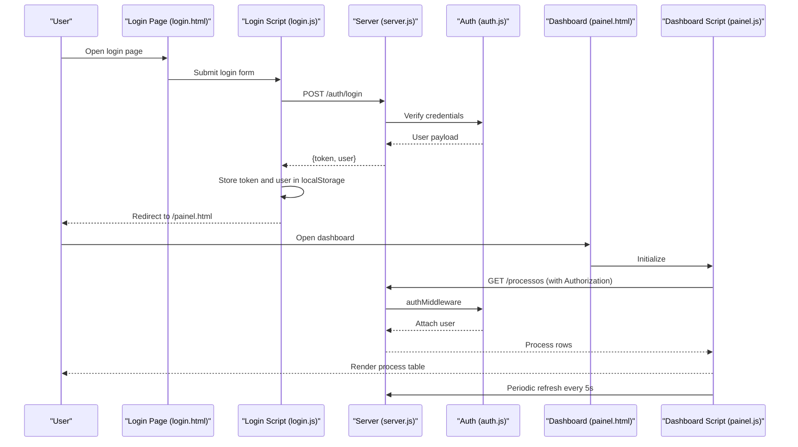
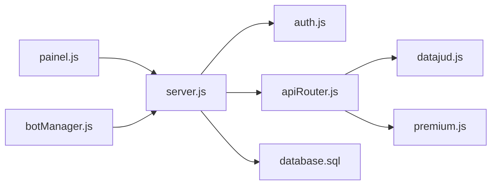

# Dashboard Interface

<cite>
**Referenced Files in This Document**
- [painel.html](file://public/painel.html)
- [painel.js](file://public/painel.js)
- [style.css](file://public/style.css)
- [login.html](file://public/login.html)
- [login.js](file://public/login.js)
- [server.js](file://server.js)
- [auth.js](file://auth.js)
- [apiRouter.js](file://apiRouter.js)
- [botManager.js](file://botManager.js)
- [database.sql](file://database.sql)
- [datajud.js](file://services/datajud.js)
- [premium.js](file://services/premium.js)
- [index.html](file://public/index.html)
</cite>

## Table of Contents
1. [Introduction](#introduction)
2. [Project Structure](#project-structure)
3. [Core Components](#core-components)
4. [Architecture Overview](#architecture-overview)
5. [Detailed Component Analysis](#detailed-component-analysis)
6. [Dependency Analysis](#dependency-analysis)
7. [Performance Considerations](#performance-considerations)
8. [Troubleshooting Guide](#troubleshooting-guide)
9. [Conclusion](#conclusion)
10. [Appendices](#appendices)

## Introduction
This document describes the user dashboard interface for monitoring legal processes, displaying statuses, and managing personal account settings. It covers the dashboard layout, process list visualization, status indicators, and interactive elements. It also explains the JavaScript implementation in painel.js for process refresh, real-time-like updates, and user interaction handling, along with CSS styling, responsive design, and visual presentation of legal process information. Practical examples of AJAX calls for retrieving process data, notifying status changes, and managing user preferences are included. Finally, it addresses customization options, performance optimization for large process lists, and accessibility considerations.

## Project Structure
The dashboard is a client-side SPA served statically by the backend. The frontend consists of:
- A landing page with marketing content
- A login page and associated logic
- A dashboard page (painel.html) with navigation, sections, and tables
- A JavaScript module (painel.js) that handles UI logic, user roles, and AJAX requests
- Shared styles (style.css) for dark theme, navigation, menus, and tables
- Backend routes for authentication, user management, and process retrieval
- Authentication middleware and token handling
- Services for external APIs (DataJUD and Premium)
- Database schema for users and processes

**Diagram sources**
- [index.html](file://public/index.html)
- [login.html](file://public/login.html)
- [login.js](file://public/login.js)
- [painel.html](file://public/painel.html)
- [painel.js](file://public/painel.js)
- [style.css](file://public/style.css)
- [server.js](file://server.js)
- [auth.js](file://auth.js)
- [apiRouter.js](file://apiRouter.js)
- [botManager.js](file://botManager.js)
- [database.sql](file://database.sql)
- [datajud.js](file://services/datajud.js)
- [premium.js](file://services/premium.js)

**Section sources**
- [index.html](file://public/index.html)
- [login.html](file://public/login.html)
- [login.js](file://public/login.js)
- [painel.html](file://public/painel.html)
- [painel.js](file://public/painel.js)
- [style.css](file://public/style.css)
- [server.js](file://server.js)
- [auth.js](file://auth.js)
- [apiRouter.js](file://apiRouter.js)
- [botManager.js](file://botManager.js)
- [database.sql](file://database.sql)
- [datajud.js](file://services/datajud.js)
- [premium.js](file://services/premium.js)

## Core Components
- Navigation and user info: Displays logged-in user email and role badge; provides logout action.
- Role-based menus:
  - Admin menu: Processos, Usuários, Cadastrar Usuário
  - Client menu: Meus Processos, Configurações
- Sections:
  - Processos: Table with columns Number, Status, Updated At, and optionally User (admin)
  - Usuários (admin): Table with user listing and metadata
  - Cadastrar Usuário (admin): Form to register new users
  - Config (client): Personal profile and settings summary
- Interactive elements:
  - Tab switching for sections
  - Form submission for user registration (client)
  - Logout action
- AJAX-driven data:
  - Load process list with periodic refresh
  - Load user list (admin)
  - Load personal profile (client)
  - Admin user creation form submission

**Section sources**
- [painel.html](file://public/painel.html)
- [painel.js](file://public/painel.js)
- [style.css](file://public/style.css)

## Architecture Overview
The dashboard relies on a JWT-based authentication flow. After login, the client stores token and user data in localStorage. The dashboard uses fetch to call protected endpoints, passing the Authorization header. Admin users gain access to additional sections and actions.

**Diagram sources**
- [login.html](file://public/login.html)
- [login.js](file://public/login.js)
- [server.js](file://server.js)
- [auth.js](file://auth.js)
- [painel.html](file://public/painel.html)
- [painel.js](file://public/painel.js)

## Detailed Component Analysis

### Dashboard Layout and Sections
- Navigation bar displays branding, user info, and logout.
- Two role-specific menus:
  - Admin: Processos, Usuários, Cadastrar Usuário
  - Client: Meus Processos, Configurações
- Sections are toggled via buttons and rendered as HTML blocks with class activation.
- Process table includes Number, Status, Updated At, and optional User column for admins.

**Section sources**
- [painel.html](file://public/painel.html)
- [style.css](file://public/style.css)

### Process List Visualization and Status Indicators
- The process list is populated by fetching /processos and iterating over returned rows.
- Each row shows:
  - Number
  - Last Status
  - Updated At (formatted date/time)
  - User Email (admin-only column)
- Status badges are styled via CSS classes applied conditionally.

**Section sources**
- [painel.html](file://public/painel.html)
- [painel.js](file://public/painel.js)
- [style.css](file://public/style.css)

### Interactive Elements and User Interaction Handling
- Section switching:
  - Active section and button states are managed by toggling CSS classes.
  - On switching to Usuários, the script loads user list.
  - On switching to Config, the script loads personal profile.
- User registration (admin):
  - Admin form posts to /usuario with Authorization header.
  - Success or error messages are shown with appropriate classes.
- Logout:
  - Removes token and user from localStorage and redirects to login.

**Section sources**
- [painel.html](file://public/painel.html)
- [painel.js](file://public/painel.js)

### JavaScript Implementation in painel.js
Key responsibilities:
- Authentication guard: checks token presence and redirects to login if missing.
- UI configuration based on user role: shows/hides admin menu and columns.
- Section switching: toggles visibility of sections and buttons.
- Data loading:
  - Load processes: GET /processos with Authorization header
  - Load users (admin): GET /usuarios with Authorization header
  - Load profile: GET /auth/me with Authorization header
- Form submission: POST /usuario with Authorization header
- Periodic refresh: setInterval triggers process reload every 5 seconds.

AJAX patterns demonstrated:
- Authorization header usage
- JSON parsing and DOM updates
- Error handling with console logging

**Section sources**
- [painel.js](file://public/painel.js)
- [server.js](file://server.js)
- [auth.js](file://auth.js)

### CSS Styling Approach and Responsive Design
- Dark theme with high contrast for readability.
- Navigation bar with branding and user controls.
- Menu with active state styling.
- Tables with striped borders and centered headers.
- Badge styling for role indication.
- Responsive adjustments for mobile devices (e.g., grid layout changes, spacing adjustments).

**Section sources**
- [style.css](file://public/style.css)
- [index.html](file://public/index.html)

### Real-Time Status Updates and Refresh Mechanism
- The dashboard performs a periodic fetch to /processos every 5 seconds.
- The backend serves the latest rows from the database; the client renders the updated table.
- No WebSocket or server-sent events are implemented; updates occur on schedule.

**Section sources**
- [painel.js](file://public/painel.js)
- [server.js](file://server.js)

### User Account Management
- Profile view: GET /auth/me returns user details for display.
- Admin user creation: POST /usuario with Authorization header; includes optional Telegram ID, Bot Token, and API Key.
- Role-based access: admin-only endpoints and UI elements.

**Section sources**
- [painel.js](file://public/painel.js)
- [server.js](file://server.js)
- [auth.js](file://auth.js)

### External API Integration for Process Data
- The backend consolidates free and paid sources:
  - Free: DataJUD API
  - Paid fallback: Premium API (placeholder)
- The dashboard does not directly call external APIs; it retrieves pre-stored or computed data from the backend.

**Section sources**
- [apiRouter.js](file://apiRouter.js)
- [datajud.js](file://services/datajud.js)
- [premium.js](file://services/premium.js)
- [botManager.js](file://botManager.js)

### Database Schema and Data Model
- Users table: stores credentials, roles, Telegram/Bot/API settings, and mode.
- Processes table: stores process number, associated user, last status, and update timestamps.

**Section sources**
- [database.sql](file://database.sql)

### Authentication Flow
- Login endpoint verifies credentials and returns a signed JWT.
- Protected routes use authMiddleware to decode and attach user to request.
- Admin-only routes use adminMiddleware to restrict access.

**Section sources**
- [login.js](file://public/login.js)
- [server.js](file://server.js)
- [auth.js](file://auth.js)

## Dependency Analysis
The dashboard depends on:
- Backend routes for data and user management
- Authentication middleware for route protection
- External services for process data retrieval
- Database for persistence

**Diagram sources**
- [painel.js](file://public/painel.js)
- [server.js](file://server.js)
- [auth.js](file://auth.js)
- [apiRouter.js](file://apiRouter.js)
- [datajud.js](file://services/datajud.js)
- [premium.js](file://services/premium.js)
- [botManager.js](file://botManager.js)
- [database.sql](file://database.sql)

**Section sources**
- [painel.js](file://public/painel.js)
- [server.js](file://server.js)
- [auth.js](file://auth.js)
- [apiRouter.js](file://apiRouter.js)
- [datajud.js](file://services/datajud.js)
- [premium.js](file://services/premium.js)
- [botManager.js](file://botManager.js)
- [database.sql](file://database.sql)

## Performance Considerations
- Current behavior:
  - Dashboard fetches the entire process list every 5 seconds and rebuilds the table body.
  - No pagination or virtualization is implemented.
- Recommendations for large lists:
  - Pagination: limit rows per page and load incrementally.
  - Virtual scrolling: render only visible rows.
  - Debounced refresh: coalesce frequent updates.
  - Efficient DOM updates: use document fragments or a templating library.
  - Caching: cache responses and diff against previous payloads.
  - Lazy loading: defer non-critical sections until needed.

[No sources needed since this section provides general guidance]

## Troubleshooting Guide
Common issues and resolutions:
- Unauthorized access:
  - Symptom: Redirect to login after navigating to dashboard.
  - Cause: Missing or invalid token in localStorage.
  - Resolution: Re-authenticate and ensure token is stored.
- Empty process list:
  - Symptom: Blank table despite having processes.
  - Cause: User lacks permissions or backend query returns empty set.
  - Resolution: Confirm user role and verify database entries.
- Network errors:
  - Symptom: Console logs indicate fetch failures.
  - Cause: Server downtime or CORS issues.
  - Resolution: Check server logs and network connectivity.
- Admin-only features unavailable:
  - Symptom: Usuários and Cadastrar Usuário sections hidden.
  - Cause: Non-admin user role.
  - Resolution: Log in as admin or adjust user role.

**Section sources**
- [painel.js](file://public/painel.js)
- [server.js](file://server.js)
- [auth.js](file://auth.js)

## Conclusion
The dashboard provides a clean, role-aware interface for monitoring legal processes and managing accounts. Its current design leverages periodic AJAX refreshes to simulate near real-time updates. With minor enhancements—such as pagination, virtualization, and improved error messaging—the interface can scale effectively for larger datasets while maintaining a strong user experience.

[No sources needed since this section summarizes without analyzing specific files]

## Appendices

### Practical Examples of AJAX Calls
- Retrieve process list:
  - Method: GET
  - Endpoint: /processos
  - Headers: Authorization: Bearer <token>
  - Purpose: Populate process table
- Retrieve user list (admin):
  - Method: GET
  - Endpoint: /usuarios
  - Headers: Authorization: Bearer <token>
  - Purpose: Populate users table
- Retrieve personal profile:
  - Method: GET
  - Endpoint: /auth/me
  - Headers: Authorization: Bearer <token>
  - Purpose: Display user details
- Create user (admin):
  - Method: POST
  - Endpoint: /usuario
  - Headers: Content-Type: application/json, Authorization: Bearer <token>
  - Body: { email, senha, telegram_id, bot_token, api_key, modo }
  - Purpose: Register new user and optionally start Telegram bot

**Section sources**
- [painel.js](file://public/painel.js)
- [server.js](file://server.js)
- [auth.js](file://auth.js)

### Accessibility Considerations
- Keyboard navigation: ensure focus order is logical and tabbable elements are reachable.
- Screen reader support: add ARIA roles and labels where appropriate.
- Color contrast: maintain sufficient contrast for text and interactive elements.
- Focus indicators: ensure visible focus rings for interactive elements.
- Semantic markup: use proper headings and tables for content structure.

[No sources needed since this section provides general guidance]