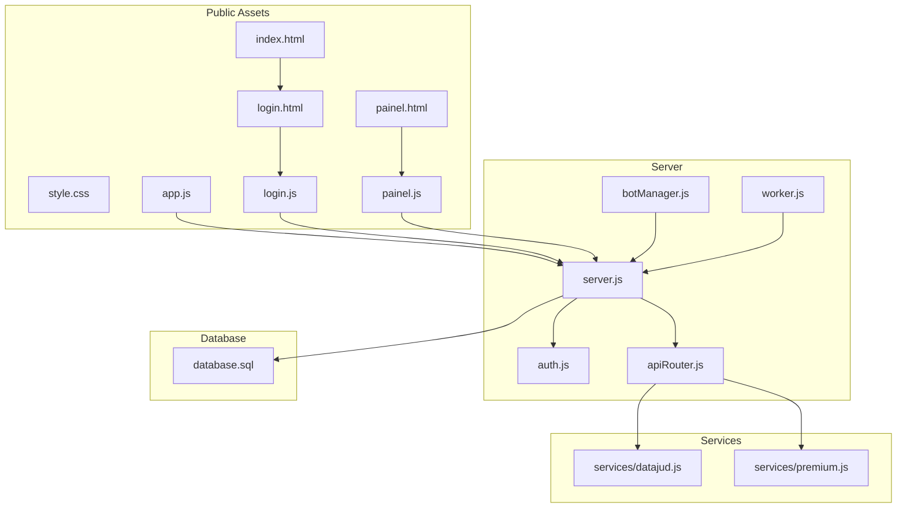
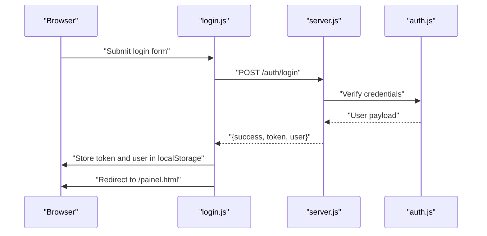
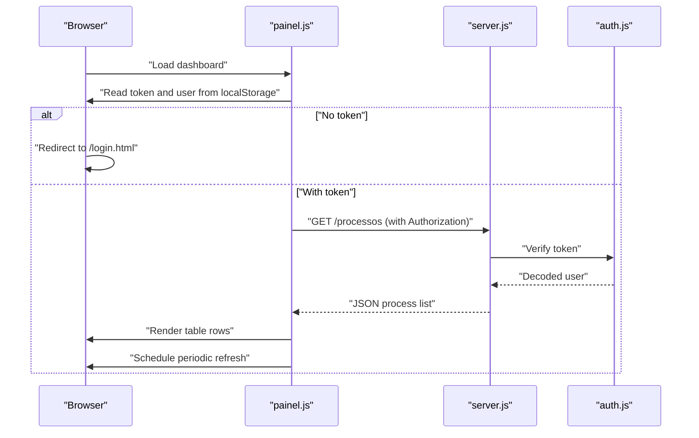
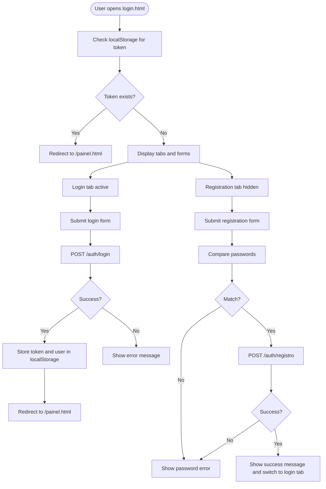
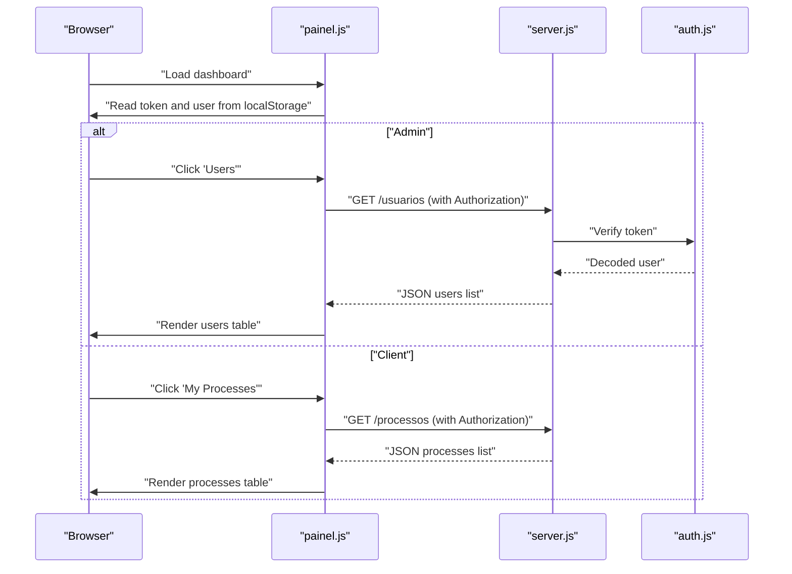
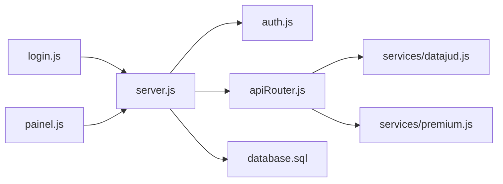
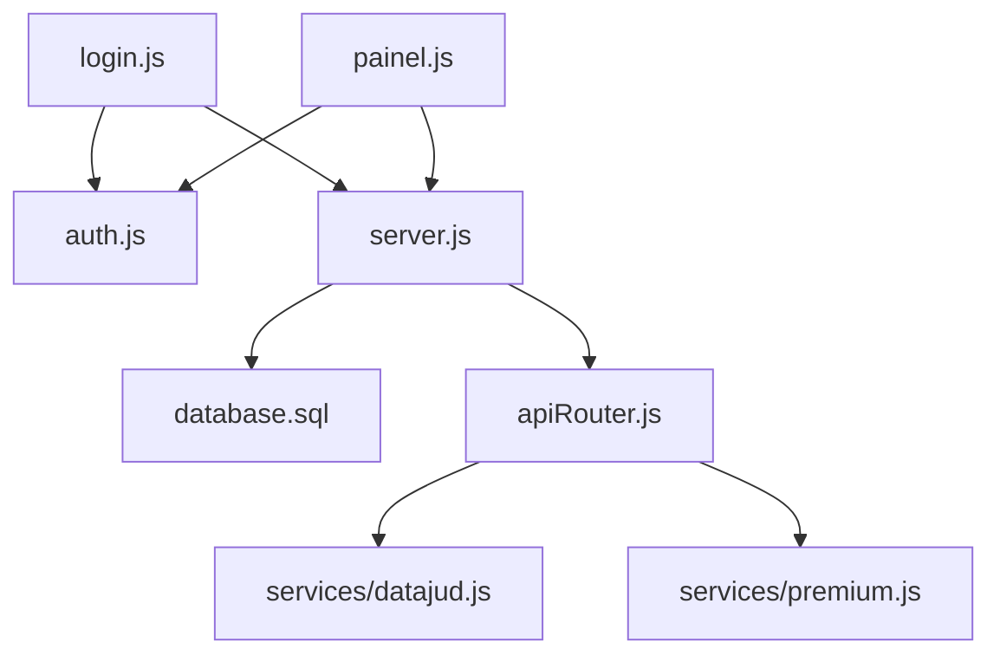

# Frontend Interface

<cite>
**Referenced Files in This Document**
- [index.html](file://public/index.html)
- [login.html](file://public/login.html)
- [painel.html](file://public/painel.html)
- [style.css](file://public/style.css)
- [login.js](file://public/login.js)
- [painel.js](file://public/painel.js)
- [app.js](file://public/app.js)
- [server.js](file://server.js)
- [auth.js](file://auth.js)
- [apiRouter.js](file://apiRouter.js)
- [botManager.js](file://botManager.js)
- [worker.js](file://worker.js)
- [database.sql](file://database.sql)
- [services/datajud.js](file://services/datajud.js)
- [services/premium.js](file://services/premium.js)
</cite>

## Table of Contents
1. [Introduction](#introduction)
2. [Project Structure](#project-structure)
3. [Core Components](#core-components)
4. [Architecture Overview](#architecture-overview)
5. [Detailed Component Analysis](#detailed-component-analysis)
6. [Dependency Analysis](#dependency-analysis)
7. [Performance Considerations](#performance-considerations)
8. [Troubleshooting Guide](#troubleshooting-guide)
9. [Conclusion](#conclusion)
10. [Appendices](#appendices)

## Introduction
This document describes the frontend interface for the “Process Management” application. It covers the admin panel, user dashboard, login interface, and the JavaScript interactions that power them. It also documents CSS styling patterns, responsive design considerations, and user experience optimizations. Practical examples illustrate form submissions, AJAX requests, data visualization, and periodic updates. Guidance is included for cross-browser compatibility, accessibility, and performance.

## Project Structure
The frontend assets reside under the public directory and are served statically by the Express server. The main pages are:
- Index redirect page
- Login page
- Dashboard page
- Shared styles
- JavaScript modules for each page and shared logic

**Diagram sources**
- [index.html](file://public/index.html)
- [login.html](file://public/login.html)
- [painel.html](file://public/painel.html)
- [style.css](file://public/style.css)
- [login.js](file://public/login.js)
- [painel.js](file://public/painel.js)
- [app.js](file://public/app.js)
- [server.js](file://server.js)
- [auth.js](file://auth.js)
- [apiRouter.js](file://apiRouter.js)
- [botManager.js](file://botManager.js)
- [worker.js](file://worker.js)
- [database.sql](file://database.sql)
- [services/datajud.js](file://services/datajud.js)
- [services/premium.js](file://services/premium.js)

**Section sources**
- [index.html](file://public/index.html)
- [login.html](file://public/login.html)
- [painel.html](file://public/painel.html)
- [style.css](file://public/style.css)
- [login.js](file://public/login.js)
- [painel.js](file://public/painel.js)
- [app.js](file://public/app.js)
- [server.js](file://server.js)
- [auth.js](file://auth.js)
- [apiRouter.js](file://apiRouter.js)
- [botManager.js](file://botManager.js)
- [worker.js](file://worker.js)
- [database.sql](file://database.sql)
- [services/datajud.js](file://services/datajud.js)
- [services/premium.js](file://services/premium.js)

## Core Components
- Admin Panel (index.html): Redirects to the login page.
- Login Interface (login.html): Tabbed login and registration forms with client-side validation and server communication.
- Dashboard (painel.html): Role-based navigation, process lists, user management (admin), user configuration, and real-time updates.
- Styles (style.css): Dark theme, responsive layout, tab switching, badges, and table presentation.
- JavaScript:
  - login.js: Tab switching, login and registration submission, token storage, redirection.
  - painel.js: Role-based UI, section switching, fetching and rendering lists, user creation, logout.
  - app.js: Legacy admin page logic for process listing and periodic refresh.

**Section sources**
- [index.html](file://public/index.html)
- [login.html](file://public/login.html)
- [painel.html](file://public/painel.html)
- [style.css](file://public/style.css)
- [login.js](file://public/login.js)
- [painel.js](file://public/painel.js)
- [app.js](file://public/app.js)

## Architecture Overview
The frontend communicates with the backend via REST endpoints. Authentication uses JWT tokens stored in localStorage. The dashboard supports two roles: admin and client. Admins can manage users and view all processes; clients see only their own processes and configuration.

**Diagram sources**
- [login.js](file://public/login.js)
- [server.js](file://server.js)
- [auth.js](file://auth.js)

**Diagram sources**
- [painel.js](file://public/painel.js)
- [server.js](file://server.js)
- [auth.js](file://auth.js)

## Detailed Component Analysis

### Admin Panel Redirect (index.html)
- Purpose: Redirects the root path to the login page.
- Behavior: Uses a meta refresh to navigate immediately.
- UX: Minimal; ensures all users reach authentication before accessing protected areas.

**Section sources**
- [index.html](file://public/index.html)

### Login Interface (login.html)
- Features:
  - Tabbed interface: Login and Registration.
  - Validation: Password confirmation mismatch detection.
  - Feedback: Error and success messages.
  - Persistence: Token and user info stored in localStorage after successful login.
- JavaScript interactions:
  - Tab switching toggles active form visibility.
  - Login form posts credentials to the backend and stores the returned token.
  - Registration form validates passwords and submits registration data; on success, switches back to login tab.

**Diagram sources**
- [login.html](file://public/login.html)
- [login.js](file://public/login.js)
- [server.js](file://server.js)

**Section sources**
- [login.html](file://public/login.html)
- [login.js](file://public/login.js)
- [server.js](file://server.js)

### Dashboard (painel.html)
- Role-based UI:
  - Admin menu: Processes, Users, New User.
  - Client menu: My Processes, Settings.
- Sections:
  - Processes: Displays number, last status, and last updated time; admin sees associated user email.
  - Users (admin): Lists users with type, mode, and creation date.
  - New User (admin): Form to create users with optional Telegram and API fields.
  - Settings (client): Shows current user profile and metadata.
- JavaScript interactions:
  - Loads token and user from localStorage; redirects to login if missing.
  - Switches between sections and triggers data loading.
  - Fetches and renders processes, users, and profile data.
  - Submits new user creation with authorization header.
  - Periodic refresh of process list every 5 seconds.

**Diagram sources**
- [painel.html](file://public/painel.html)
- [painel.js](file://public/painel.js)
- [server.js](file://server.js)
- [auth.js](file://auth.js)

**Section sources**
- [painel.html](file://public/painel.html)
- [painel.js](file://public/painel.js)
- [server.js](file://server.js)

### JavaScript Interactions

#### login.js
- Tab switching: Toggles active tab buttons and form visibility.
- Login:
  - Prevents default form submission.
  - Posts email and password to /auth/login.
  - On success, stores token and user, then redirects to dashboard.
- Registration:
  - Validates password confirmation.
  - Posts registration data to /auth/registro.
  - On success, shows success message and switches to login tab.

**Section sources**
- [login.js](file://public/login.js)
- [server.js](file://server.js)

#### painel.js
- Initialization:
  - Reads token and user from localStorage.
  - Redirects to login if token is missing.
  - Configures UI based on user role.
- Section switching:
  - Manages active section and active menu button.
  - Triggers data loading for Users and Settings sections.
- Data loading:
  - Processes: GET /processos with Authorization header.
  - Users (admin): GET /usuarios with Authorization header.
  - Profile: GET /auth/me with Authorization header.
- User creation (admin):
  - POST /usuario with Authorization header and user payload.
  - Shows success/error feedback.
- Logout:
  - Clears localStorage and redirects to login.

**Section sources**
- [painel.js](file://public/painel.js)
- [server.js](file://server.js)

#### app.js (Legacy Admin Page)
- Periodic refresh:
  - Fetches /processos and renders a simple table.
  - Refreshes every 5 seconds.

**Section sources**
- [app.js](file://public/app.js)
- [server.js](file://server.js)

### CSS Styling Patterns and Responsive Design
- Color scheme: Dark theme with accent colors for badges and highlights.
- Layout:
  - Flexbox-based navbar and login container.
  - Grid-like sections controlled by display toggles.
  - Tables with borders and centered headers.
- Responsive considerations:
  - Full-width inputs and buttons.
  - Max widths for containers and forms.
  - Flexible gaps and padding for spacing.
- Accessibility:
  - Sufficient color contrast.
  - Focusable buttons and inputs.
  - Semantic headings and labels.
- Cross-browser compatibility:
  - Standard CSS properties used.
  - No experimental features; relies on widely supported APIs.

**Section sources**
- [style.css](file://public/style.css)

### Backend Integration and Data Flows
- Authentication:
  - Tokens are sent in the Authorization header as Bearer tokens.
  - Protected routes enforce middleware checks.
- Endpoints used by frontend:
  - POST /auth/login: Returns token and user info.
  - POST /auth/registro: Registers new user.
  - GET /processos: Lists processes; admin sees all, client sees own.
  - GET /usuarios: Lists all users (admin only).
  - GET /auth/me: Returns current user profile.
  - POST /usuario: Creates a new user (admin only).
- Data services:
  - Free tier: Datajud API lookup.
  - Premium fallback: Premium API lookup when configured.

**Diagram sources**
- [login.js](file://public/login.js)
- [painel.js](file://public/painel.js)
- [server.js](file://server.js)
- [auth.js](file://auth.js)
- [apiRouter.js](file://apiRouter.js)
- [services/datajud.js](file://services/datajud.js)
- [services/premium.js](file://services/premium.js)
- [database.sql](file://database.sql)

**Section sources**
- [server.js](file://server.js)
- [auth.js](file://auth.js)
- [apiRouter.js](file://apiRouter.js)
- [services/datajud.js](file://services/datajud.js)
- [services/premium.js](file://services/premium.js)
- [database.sql](file://database.sql)

## Dependency Analysis
- Frontend-to-backend:
  - login.js depends on /auth/login and /auth/registro.
  - painel.js depends on /processos, /usuarios, /auth/me, and /usuario.
- Backend-to-auth:
  - server.js routes use authMiddleware and adminMiddleware.
- Backend-to-services:
  - apiRouter orchestrates free and premium lookups.
- Backend-to-database:
  - All endpoints query the PostgreSQL schema defined in database.sql.

**Diagram sources**
- [login.js](file://public/login.js)
- [painel.js](file://public/painel.js)
- [auth.js](file://auth.js)
- [server.js](file://server.js)
- [database.sql](file://database.sql)
- [apiRouter.js](file://apiRouter.js)
- [services/datajud.js](file://services/datajud.js)
- [services/premium.js](file://services/premium.js)

**Section sources**
- [login.js](file://public/login.js)
- [painel.js](file://public/painel.js)
- [auth.js](file://auth.js)
- [server.js](file://server.js)
- [database.sql](file://database.sql)
- [apiRouter.js](file://apiRouter.js)
- [services/datajud.js](file://services/datajud.js)
- [services/premium.js](file://services/premium.js)

## Performance Considerations
- Minimize DOM updates:
  - Batch innerHTML updates when rendering lists.
- Reduce network requests:
  - Reuse Authorization header consistently.
  - Debounce or throttle rapid user actions.
- Optimize polling:
  - Dashboard refresh interval is set to 5 seconds; adjust based on load.
- Image and asset optimization:
  - Keep assets minimal; avoid unnecessary resources.
- Memory management:
  - Avoid accumulating event listeners; remove old ones when switching sections.
- Caching:
  - Cache user and token in localStorage to avoid repeated logins.
- Accessibility:
  - Ensure keyboard navigation and screen reader support.
- Cross-browser testing:
  - Validate behavior across modern browsers; polyfill where necessary.

[No sources needed since this section provides general guidance]

## Troubleshooting Guide
- Login fails:
  - Verify email and password correctness.
  - Check server logs for authentication errors.
- Registration fails:
  - Confirm passwords match.
  - Ensure unique email is used.
- Dashboard shows blank data:
  - Confirm token exists in localStorage.
  - Verify Authorization header is present in requests.
- Admin features unavailable:
  - Confirm user role is admin.
- Real-time updates not appearing:
  - Check periodic refresh logic and network connectivity.
  - Review worker and bot manager logs for failures.

**Section sources**
- [login.js](file://public/login.js)
- [painel.js](file://public/painel.js)
- [server.js](file://server.js)
- [auth.js](file://auth.js)
- [worker.js](file://worker.js)
- [botManager.js](file://botManager.js)

## Conclusion
The frontend provides a clean, role-aware interface with robust authentication and real-time updates. The login and dashboard pages are structured for maintainability and scalability, while the CSS offers a cohesive dark-theme experience. By following the recommended practices and troubleshooting steps, teams can ensure reliable performance and a positive user experience across devices and browsers.

[No sources needed since this section summarizes without analyzing specific files]

## Appendices

### API Reference Summary
- POST /auth/login
  - Body: { email, senha }
  - Success: { success, token, user: { id, email, tipo } }
- POST /auth/registro
  - Body: { email, senha, telegram_id, bot_token, api_key, modo }
  - Success: { success, id }
- GET /processos
  - Headers: Authorization: Bearer <token>
  - Success: Array of process objects
- GET /usuarios
  - Headers: Authorization: Bearer <token>
  - Success: Array of user objects
- GET /auth/me
  - Headers: Authorization: Bearer <token>
  - Success: User profile object
- POST /usuario
  - Headers: Authorization: Bearer <token>
  - Body: { email, senha, telegram_id, bot_token, api_key, modo }
  - Success: { success, id }

**Section sources**
- [server.js](file://server.js)
- [auth.js](file://auth.js)

### Database Schema Summary
- usuarios: id, email (unique), senha, tipo (default cliente), telegram_id, bot_token, api_key, modo (default gratis), criado_em
- processos: id, numero, usuario_id (FK), ultimo_status, atualizado_em

**Section sources**
- [database.sql](file://database.sql)