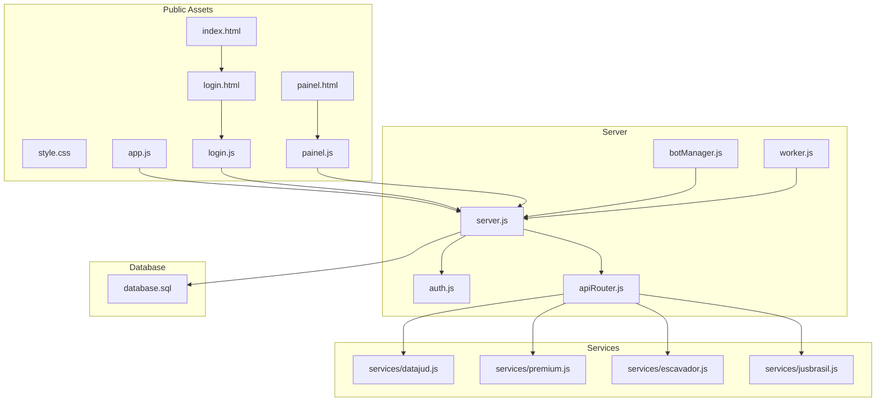
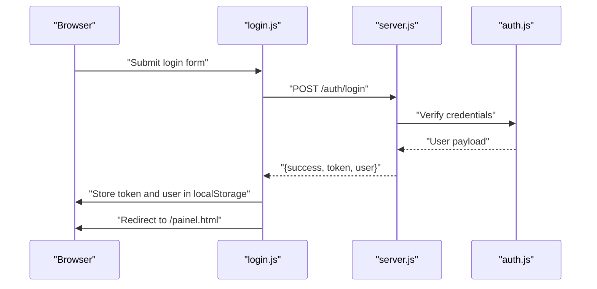
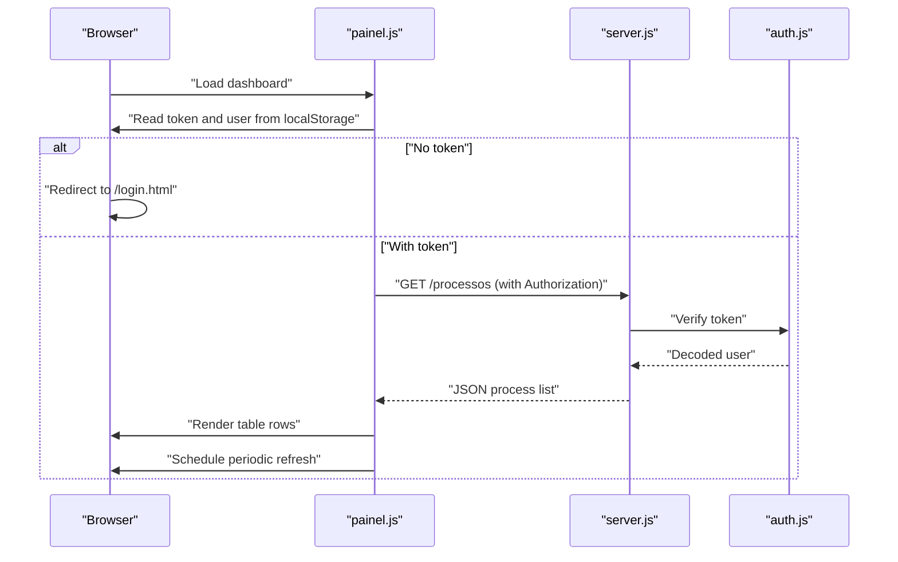
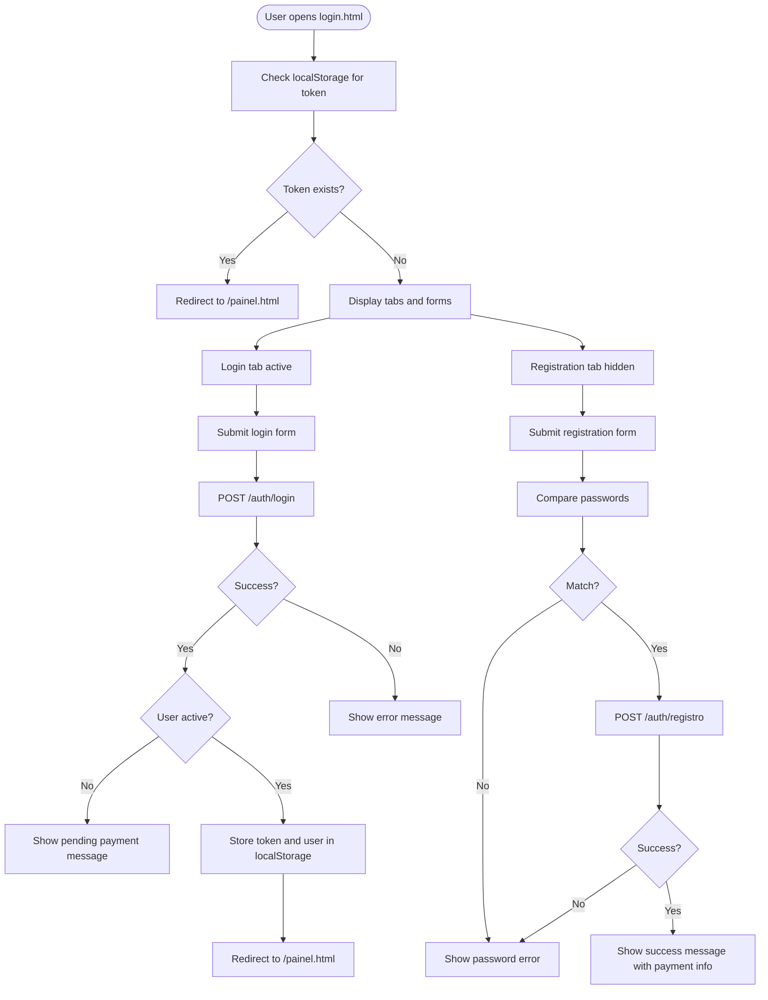
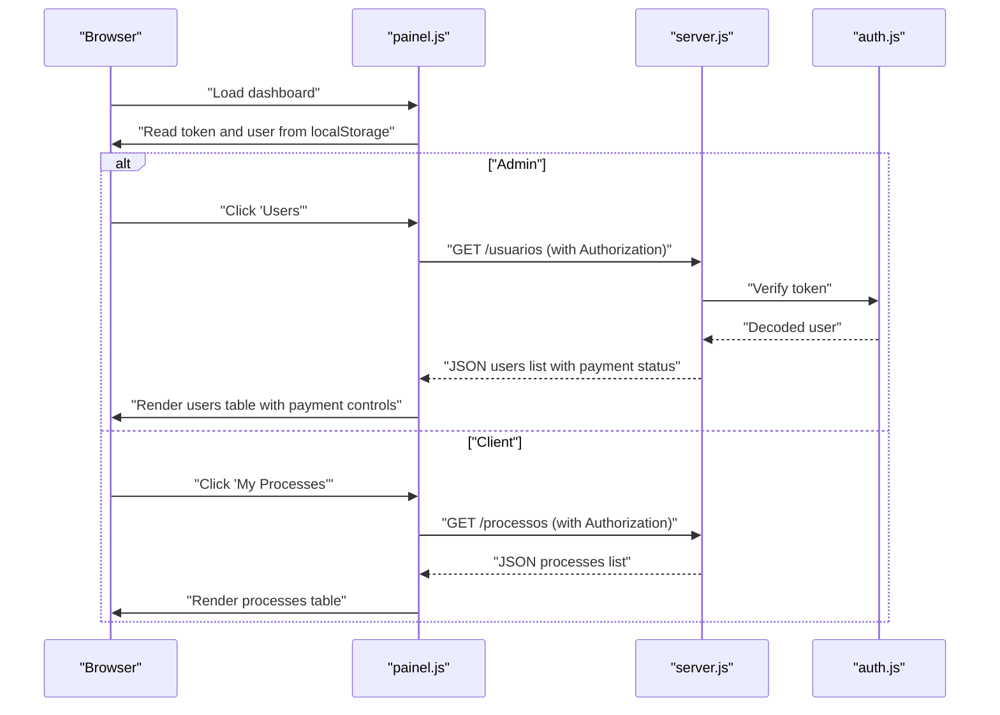
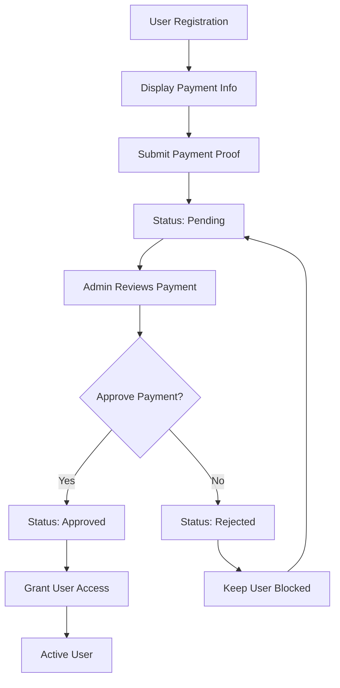
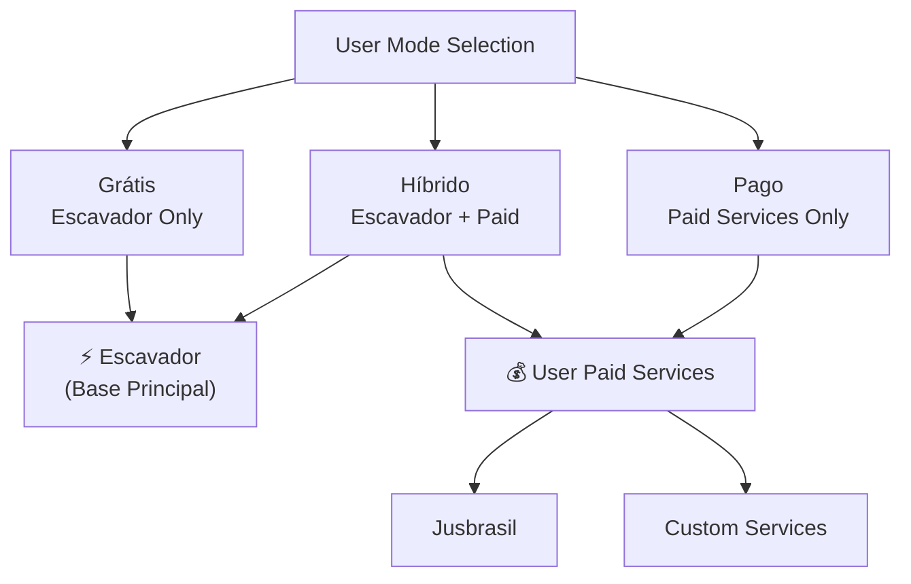
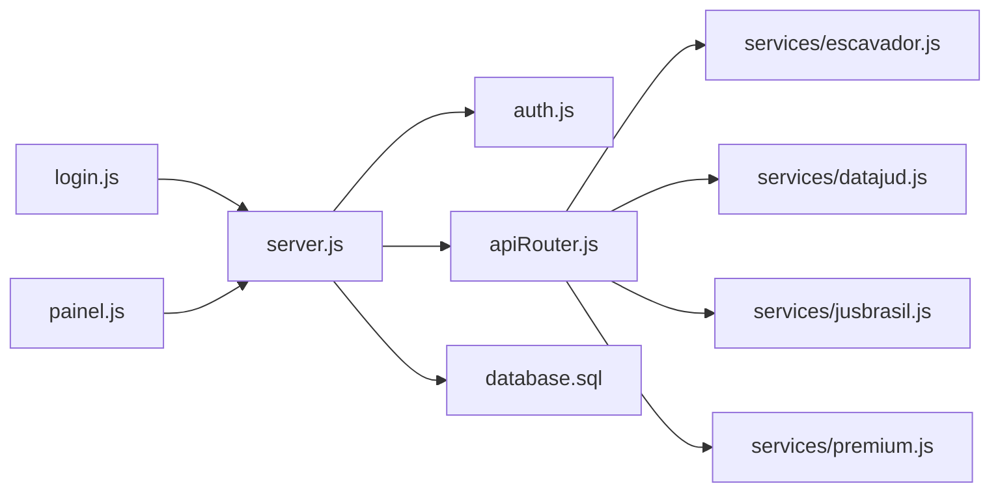
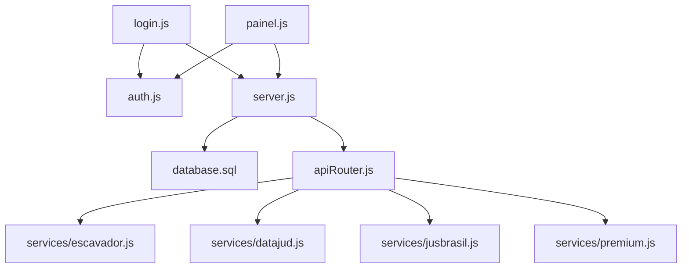

# Frontend Interface

<cite>
**Referenced Files in This Document**
- [index.html](file://public/index.html)
- [login.html](file://public/login.html)
- [painel.html](file://public/painel.html)
- [style.css](file://public/style.css)
- [login.js](file://public/login.js)
- [painel.js](file://public/painel.js)
- [app.js](file://public/app.js)
- [server.js](file://server.js)
- [auth.js](file://auth.js)
- [apiRouter.js](file://apiRouter.js)
- [botManager.js](file://botManager.js)
- [worker.js](file://worker.js)
- [database.sql](file://database.sql)
- [services/datajud.js](file://services/datajud.js)
- [services/premium.js](file://services/premium.js)
- [services/escavador.js](file://services/escavador.js)
- [services/jusbrasil.js](file://services/jusbrasil.js)
</cite>

## Update Summary
**Changes Made**
- Added comprehensive payment verification features documentation
- Updated admin panel with payment management capabilities
- Enhanced login interface with payment proof submission functionality
- Documented payment status tracking and approval workflow
- Added payment information display and payment proof submission features

## Table of Contents
1. [Introduction](#introduction)
2. [Project Structure](#project-structure)
3. [Core Components](#core-components)
4. [Architecture Overview](#architecture-overview)
5. [Detailed Component Analysis](#detailed-component-analysis)
6. [Payment Verification System](#payment-verification-system)
7. [Service Architecture and Configuration](#service-architecture-and-configuration)
8. [Dependency Analysis](#dependency-analysis)
9. [Performance Considerations](#performance-considerations)
10. [Troubleshooting Guide](#troubleshooting-guide)
11. [Conclusion](#conclusion)
12. [Appendices](#appendices)

## Introduction
This document describes the frontend interface for the "Process Management" application. It covers the admin panel, user dashboard, login interface, and the JavaScript interactions that power them. The system now features a dual-service architecture where Escavador serves as the base principal service automatically configured by administrators, while optional user-configured paid services provide enhanced functionality. It also documents the comprehensive payment verification system including payment information display, payment proof submission functionality, and enhanced admin panel with payment management capabilities. The system includes payment status tracking, approval workflows, and real-time payment verification features. It documents CSS styling patterns, responsive design considerations, and user experience optimizations. Practical examples illustrate form submissions, AJAX requests, data visualization, and real-time updates. Guidance is included for cross-browser compatibility, accessibility, and performance.

## Project Structure
The frontend assets reside under the public directory and are served statically by the Express server. The main pages are:
- Home page with pricing and payment information
- Login page with payment proof submission
- Dashboard page with payment management
- Shared styles
- JavaScript modules for each page and shared logic

**Diagram sources**
- [index.html](file://public/index.html)
- [login.html](file://public/login.html)
- [painel.html](file://public/painel.html)
- [style.css](file://public/style.css)
- [login.js](file://public/login.js)
- [painel.js](file://public/painel.js)
- [app.js](file://public/app.js)
- [server.js](file://server.js)
- [auth.js](file://auth.js)
- [apiRouter.js](file://apiRouter.js)
- [botManager.js](file://botManager.js)
- [worker.js](file://worker.js)
- [database.sql](file://database.sql)
- [services/datajud.js](file://services/datajud.js)
- [services/premium.js](file://services/premium.js)
- [services/escavador.js](file://services/escavador.js)
- [services/jusbrasil.js](file://services/jusbrasil.js)

**Section sources**
- [index.html](file://public/index.html)
- [login.html](file://public/login.html)
- [painel.html](file://public/painel.html)
- [style.css](file://public/style.css)
- [login.js](file://public/login.js)
- [painel.js](file://public/painel.js)
- [app.js](file://public/app.js)
- [server.js](file://server.js)
- [auth.js](file://auth.js)
- [apiRouter.js](file://apiRouter.js)
- [botManager.js](file://botManager.js)
- [worker.js](file://worker.js)
- [database.sql](file://database.sql)
- [services/datajud.js](file://services/datajud.js)
- [services/premium.js](file://services/premium.js)
- [services/escavador.js](file://services/escavador.js)
- [services/jusbrasil.js](file://services/jusbrasil.js)

## Core Components
- Home Page (index.html): Features pricing plans, payment options, and payment information display.
- Login Interface (login.html): Tabbed login and registration forms with payment proof submission and payment status checking.
- Dashboard (painel.html): Role-based navigation, process lists, user management (admin), user configuration, payment management, and real-time updates.
- Styles (style.css): Dark theme, responsive layout, tab switching, badges, and table presentation.
- JavaScript:
  - login.js: Tab switching, login and registration submission, payment proof handling, token storage, redirection.
  - painel.js: Role-based UI, section switching, fetching and rendering lists, user creation, payment management, logout.
  - app.js: Legacy admin page logic for process listing and periodic refresh.

**Section sources**
- [index.html](file://public/index.html)
- [login.html](file://public/login.html)
- [painel.html](file://public/painel.html)
- [style.css](file://public/style.css)
- [login.js](file://public/login.js)
- [painel.js](file://public/painel.js)
- [app.js](file://public/app.js)

## Architecture Overview
The frontend communicates with the backend via REST endpoints. Authentication uses JWT tokens stored in localStorage. The dashboard supports two roles: admin and client. Admins can manage users, view all processes, and handle payment verification; clients see only their own processes, configuration, and payment status. The system now implements a dual-service architecture where Escavador serves as the base principal service automatically configured by administrators, while optional user-configured paid services provide enhanced functionality. The payment verification system includes payment proof submission, status tracking, and admin approval workflows.

**Diagram sources**
- [login.js](file://public/login.js)
- [server.js](file://server.js)
- [auth.js](file://auth.js)

**Diagram sources**
- [painel.js](file://public/painel.js)
- [server.js](file://server.js)
- [auth.js](file://auth.js)

## Detailed Component Analysis

### Home Page (index.html)
- Purpose: Marketing page displaying pricing plans and payment options.
- Features:
  - Pricing cards with multiple payment options (à vista, 6x, 12x)
  - Payment information display with Pix key details
  - Service compatibility showcase
  - Responsive design with animated particles
- Payment Information: Displays payment methods, bank details, and account holder information.

**Section sources**
- [index.html](file://public/index.html)

### Login Interface (login.html)
- Features:
  - Tabbed interface: Login and Registration.
  - Payment proof submission: Registration form includes payment proof field.
  - Payment information display: Shows Pix payment details during registration.
  - Validation: Password confirmation mismatch detection.
  - Feedback: Error and success messages with payment information.
  - Persistence: Token and user info stored in localStorage after successful login.
- Payment Verification:
  - Registration includes payment proof submission field.
  - Payment information displayed during registration process.
  - Login prevents access for pending payment users.

**Diagram sources**
- [login.html](file://public/login.html)
- [login.js](file://public/login.js)
- [server.js](file://server.js)

**Section sources**
- [login.html](file://public/login.html)
- [login.js](file://public/login.js)
- [server.js](file://server.js)

### Dashboard (painel.html)
- Role-based UI:
  - Admin menu: Processes, Users, New User.
  - Client menu: My Processes, Settings.
- Sections:
  - Processes: Displays number, last status, and last updated time; admin sees associated user email.
  - Users (admin): Lists users with type, mode, payment status, and creation date; includes payment verification controls.
  - New User (admin): Form to create users with optional Telegram and API fields.
  - Settings (client): Shows current user profile, payment status, and metadata.
- Payment Management:
  - Payment status display with color-coded indicators (pending, approved, rejected).
  - Payment proof viewing with truncated proof IDs.
  - Admin controls for approving or rejecting payments.
- JavaScript interactions:
  - Loads token and user from localStorage; redirects to login if missing.
  - Switches between sections and triggers data loading.
  - Fetches and renders processes, users, and profile data.
  - Submits new user creation with authorization header.
  - Handles payment verification approvals and rejections.
  - Periodic refresh of process list every 5 seconds.

**Diagram sources**
- [painel.html](file://public/painel.html)
- [painel.js](file://public/painel.js)
- [server.js](file://server.js)
- [auth.js](file://auth.js)

**Section sources**
- [painel.html](file://public/painel.html)
- [painel.js](file://public/painel.js)
- [server.js](file://server.js)

### JavaScript Interactions

#### login.js
- Tab switching: Toggles active tab buttons and form visibility.
- Login:
  - Prevents default form submission.
  - Posts email and password to /auth/login.
  - On success, stores token and user, then redirects to dashboard.
  - Blocks login for inactive users with pending payment status.
- Registration:
  - Validates password confirmation.
  - Posts registration data to /auth/registro including payment proof.
  - On success, shows success message with payment information and resets form.

**Section sources**
- [login.js](file://public/login.js)
- [server.js](file://server.js)

#### painel.js
- Initialization:
  - Reads token and user from localStorage.
  - Redirects to login if token is missing.
  - Configures UI based on user role.
- Section switching:
  - Manages active section and active menu button.
  - Triggers data loading for Users and Settings sections.
- Data loading:
  - Processes: GET /processos with Authorization header.
  - Users (admin): GET /usuarios with Authorization header including payment status.
  - Profile: GET /auth/me with Authorization header.
- User creation (admin):
  - POST /usuario with Authorization header and user payload.
  - Shows success/error feedback.
- Payment management (admin):
  - Approve payment: PUT /usuario/:id with status_pagamento='aprovado'.
  - Reject payment: PUT /usuario/:id with status_pagamento='rejeitado'.
  - Toggle user activation/deactivation.
- Logout:
  - Clears localStorage and redirects to login.

**Section sources**
- [painel.js](file://public/painel.js)
- [server.js](file://server.js)

#### app.js (Legacy Admin Page)
- Periodic refresh:
  - Fetches /processos and renders a simple table.
  - Refreshes every 5 seconds.

**Section sources**
- [app.js](file://public/app.js)
- [server.js](file://server.js)

### CSS Styling Patterns and Responsive Design
- Color scheme: Dark theme with accent colors for badges and highlights.
- Layout:
  - Flexbox-based navbar and login container.
  - Grid-like sections controlled by display toggles.
  - Tables with borders and centered headers.
  - Payment status indicators with color-coded badges.
- Responsive considerations:
  - Full-width inputs and buttons.
  - Max widths for containers and forms.
  - Flexible gaps and padding for spacing.
- Accessibility:
  - Sufficient color contrast.
  - Focusable buttons and inputs.
  - Semantic headings and labels.
- Cross-browser compatibility:
  - Standard CSS properties used.
  - No experimental features; relies on widely supported APIs.

**Section sources**
- [style.css](file://public/style.css)

## Payment Verification System

### Payment Status Tracking
The system implements a comprehensive payment verification workflow with three payment states:
- Pending: User registered but payment not yet verified
- Approved: Payment verified and user access granted
- Rejected: Payment verification failed or declined

### Payment Proof Submission
Users can submit payment proofs during registration or later through their profile settings:
- Registration form includes payment proof field
- Users can update payment proof via their profile settings
- Payment proof is stored and displayed in admin panel

### Admin Payment Management
Administrators have full control over payment verification:
- View payment proofs with truncated identifiers
- Approve payments to grant access
- Reject payments to keep users blocked
- Monitor payment status in user listings

### Payment Information Display
The system displays payment information in multiple locations:
- Registration success messages with payment details
- Login error messages for pending users
- Admin user listings with payment status indicators
- Payment proof display with file previews

**Diagram sources**
- [login.js](file://public/login.js)
- [painel.js](file://public/painel.js)
- [server.js](file://server.js)

**Section sources**
- [login.js](file://public/login.js)
- [painel.js](file://public/painel.js)
- [server.js](file://server.js)

## Service Architecture and Configuration

### Escavador Service Configuration
The system implements a dual-service architecture where Escavador serves as the base principal service automatically configured by administrators. This service is always available and doesn't require user configuration.

**Key Characteristics:**
- **Server-configured**: Automatically configured by administrators via environment variables
- **Base principal**: Primary service that powers all user searches
- **Always available**: No user configuration required
- **Automatic fallback**: Used as the foundation for all process lookups

**Configuration Details:**
- API Key managed server-side via `ESCAVADOR_API_KEY` environment variable
- Automatically initialized during server startup
- Provides essential DataJud functionality as the base service
- Works independently of user API keys

### User-Configured Paid Services
In addition to the Escavador base service, users can optionally configure paid services for enhanced functionality. These services are user-configurable and provide additional capabilities.

**Supported Paid Services:**
- **Jusbrasil**: Premium legal research platform
- **Custom Services**: User-defined API integrations
- **Digesto**: Legal database integration

**Configuration Options:**
- Available in "Híbrido" (Hybrid) and "Pago" (Paid) modes
- Configured per-user basis
- Optional API keys for enhanced functionality
- Can be disabled if not needed

### Service Priority and Mode Selection
The system supports three operational modes that determine service priority:

**Free Mode (`gratis`)**: Only Escavador service is used
**Hybrid Mode (`hibrido`)**: Escavador + user-configured paid services if available
**Paid Mode (`pago`)**: User-configured paid services take priority over Escavador

**Diagram sources**
- [apiRouter.js](file://apiRouter.js)
- [services/escavador.js](file://services/escavador.js)
- [services/jusbrasil.js](file://services/jusbrasil.js)

**Section sources**
- [painel.html](file://public/painel.html)
- [apiRouter.js](file://apiRouter.js)
- [services/escavador.js](file://services/escavador.js)
- [services/jusbrasil.js](file://services/jusbrasil.js)

## Backend Integration and Data Flows
- Authentication:
  - Tokens are sent in the Authorization header as Bearer tokens.
  - Protected routes enforce middleware checks.
- Endpoints used by frontend:
  - POST /auth/login: Returns token and user info, blocks pending users.
  - POST /auth/registro: Registers new user with payment proof, starts blocked.
  - GET /processos: Lists processes; admin sees all, client sees own.
  - GET /usuarios: Lists all users (admin only) with payment status.
  - GET /auth/me: Returns current user profile.
  - POST /usuario: Creates a new user (admin only).
  - PUT /auth/comprovante: Updates user payment proof.
  - PUT /usuario/:id: Updates user payment status and activation.
- Data services:
  - **Escavador**: Base principal service automatically configured by administrators.
  - **DataJud**: Free tier service integrated with Escavador.
  - **Jusbrasil**: Optional user-configured paid service.
  - **Premium**: Placeholder for premium API integrations.

**Diagram sources**
- [login.js](file://public/login.js)
- [painel.js](file://public/painel.js)
- [server.js](file://server.js)
- [auth.js](file://auth.js)
- [apiRouter.js](file://apiRouter.js)
- [services/escavador.js](file://services/escavador.js)
- [services/datajud.js](file://services/datajud.js)
- [services/jusbrasil.js](file://services/jusbrasil.js)
- [services/premium.js](file://services/premium.js)
- [database.sql](file://database.sql)

**Section sources**
- [server.js](file://server.js)
- [auth.js](file://auth.js)
- [apiRouter.js](file://apiRouter.js)
- [services/escavador.js](file://services/escavador.js)
- [services/datajud.js](file://services/datajud.js)
- [services/jusbrasil.js](file://services/jusbrasil.js)
- [services/premium.js](file://services/premium.js)
- [database.sql](file://database.sql)

## Dependency Analysis
- Frontend-to-backend:
  - login.js depends on /auth/login and /auth/registro with payment features.
  - painel.js depends on /processos, /usuarios, /auth/me, /usuario, and payment endpoints.
- Backend-to-auth:
  - server.js routes use authMiddleware and adminMiddleware.
- Backend-to-services:
  - apiRouter orchestrates Escavador base service and user-configured paid services.
- Backend-to-database:
  - All endpoints query the PostgreSQL schema defined in database.sql with payment columns.

**Diagram sources**
- [login.js](file://public/login.js)
- [painel.js](file://public/painel.js)
- [auth.js](file://auth.js)
- [server.js](file://server.js)
- [database.sql](file://database.sql)
- [apiRouter.js](file://apiRouter.js)
- [services/escavador.js](file://services/escavador.js)
- [services/datajud.js](file://services/datajud.js)
- [services/jusbrasil.js](file://services/jusbrasil.js)
- [services/premium.js](file://services/premium.js)

**Section sources**
- [login.js](file://public/login.js)
- [painel.js](file://public/painel.js)
- [auth.js](file://auth.js)
- [server.js](file://server.js)
- [database.sql](file://database.sql)
- [apiRouter.js](file://apiRouter.js)
- [services/escavador.js](file://services/escavador.js)
- [services/datajud.js](file://services/datajud.js)
- [services/jusbrasil.js](file://services/jusbrasil.js)
- [services/premium.js](file://services/premium.js)

## Performance Considerations
- Minimize DOM updates:
  - Batch innerHTML updates when rendering lists.
- Reduce network requests:
  - Reuse Authorization header consistently.
  - Debounce or throttle rapid user actions.
- Optimize polling:
  - Dashboard refresh interval is set to 5 seconds; adjust based on load.
- Image and asset optimization:
  - Keep assets minimal; avoid unnecessary resources.
- Memory management:
  - Avoid accumulating event listeners; remove old ones when switching sections.
- Caching:
  - Cache user and token in localStorage to avoid repeated logins.
- Payment verification:
  - Efficient payment status updates and admin approval workflows.
  - Optimized payment proof display and truncation.
- Accessibility:
  - Ensure keyboard navigation and screen reader support.
  - Color contrast for payment status indicators.
- Cross-browser testing:
  - Validate behavior across modern browsers; polyfill where necessary.

## Troubleshooting Guide
- Login fails:
  - Verify email and password correctness.
  - Check server logs for authentication errors.
- Registration fails:
  - Confirm passwords match.
  - Ensure unique email is used.
- Payment verification issues:
  - Verify payment proof submission format.
  - Check admin approval status.
  - Confirm payment amount matches plan.
- Dashboard shows blank data:
  - Confirm token exists in localStorage.
  - Verify Authorization header is present in requests.
- Admin features unavailable:
  - Confirm user role is admin.
- Real-time updates not appearing:
  - Check periodic refresh logic and network connectivity.
  - Review worker and bot manager logs for failures.
- Escavador service issues:
  - Verify server-side API key configuration.
  - Check administrator logs for service initialization errors.
- Paid service configuration problems:
  - Ensure user has selected appropriate mode (Híbrido/Pago).
  - Verify API key format and validity.
  - Check service availability and rate limits.
- Payment status not updating:
  - Verify admin approval workflow completion.
  - Check database payment status column updates.
  - Confirm frontend payment status rendering logic.

**Section sources**
- [login.js](file://public/login.js)
- [painel.js](file://public/painel.js)
- [server.js](file://server.js)
- [auth.js](file://auth.js)
- [worker.js](file://worker.js)
- [botManager.js](file://botManager.js)

## Conclusion
The frontend provides a clean, role-aware interface with robust authentication, payment verification, and real-time updates. The login and dashboard pages are structured for maintainability and scalability, while the CSS offers a cohesive dark-theme experience. The new dual-service architecture with Escavador as the base principal service and optional user-configured paid services provides flexibility while maintaining simplicity for users. The comprehensive payment verification system adds professional billing capabilities with payment proof submission, status tracking, and admin approval workflows. By following the recommended practices and troubleshooting steps, teams can ensure reliable performance and a positive user experience across devices and browsers.

## Appendices

### API Reference Summary
- POST /auth/login
  - Body: { email, senha }
  - Success: { success, token, user: { id, email, tipo, ativo, status_pagamento } }
  - Note: Blocks inactive users with pending payment
- POST /auth/registro
  - Body: { email, senha, telegram_id, bot_token, api_key, modo, comprovante }
  - Success: { success, id, message, pagamento: { chave, banco, titular } }
- GET /processos
  - Headers: Authorization: Bearer <token>
  - Success: Array of process objects
- GET /usuarios
  - Headers: Authorization: Bearer <token>
  - Success: Array of user objects with payment status
- GET /auth/me
  - Headers: Authorization: Bearer <token>
  - Success: User profile object with payment fields
- POST /usuario
  - Headers: Authorization: Bearer <token>
  - Body: { email, senha, telegram_id, bot_token, api_key, modo, tipo }
  - Success: { success, id }
- PUT /auth/comprovante
  - Headers: Authorization: Bearer <token>
  - Body: { comprovante }
  - Success: { success, message }
- PUT /usuario/:id
  - Headers: Authorization: Bearer <token>
  - Body: { ativo, status_pagamento }
  - Success: { success, message }

**Section sources**
- [server.js](file://server.js)
- [auth.js](file://auth.js)

### Database Schema Summary
- usuarios: id, email (unique), senha, tipo (default cliente), telegram_id, bot_token, api_key, modo (default gratis), ativo (default true), criado_em, ultimo_login, comprovante, status_pagamento (default pendente)
- processos: id, numero, usuario_id (FK), ultimo_status, atualizado_em

**Section sources**
- [database.sql](file://database.sql)

### Payment System Configuration Guide
**Payment Status States**
- Pending: User registered but payment not verified (default state)
- Approved: Payment verified and access granted
- Rejected: Payment verification failed or declined

**Payment Proof Submission**
- Users can submit payment proofs during registration
- Payment proofs are stored and displayed in admin panel
- Admins can view and verify payment proofs

**Admin Payment Management**
- Admins can approve or reject user payments
- Approval grants user access to the system
- Rejection keeps users blocked until payment is resolved

**Payment Information Display**
- Payment details shown during registration
- Payment status visible in user listings
- Payment proof display with truncated identifiers

**Section sources**
- [login.js](file://public/login.js)
- [painel.js](file://public/painel.js)
- [server.js](file://server.js)

### Service Configuration Guide
**Escavador Service (Base Principal)**
- Automatically configured by administrators
- Server-side API key management
- No user configuration required
- Always available as fallback service

**User-Configured Paid Services**
- Available in Híbrido and Pago modes
- Optional API keys for enhanced functionality
- Configured per user basis
- Can be disabled if not needed

**Mode Selection Impact**
- Grátis: Only Escavador service used
- Híbrido: Escavador + user-configured paid services
- Pago: User-configured paid services only

**Section sources**
- [painel.html](file://public/painel.html)
- [apiRouter.js](file://apiRouter.js)
- [services/escavador.js](file://services/escavador.js)
- [services/jusbrasil.js](file://services/jusbrasil.js)