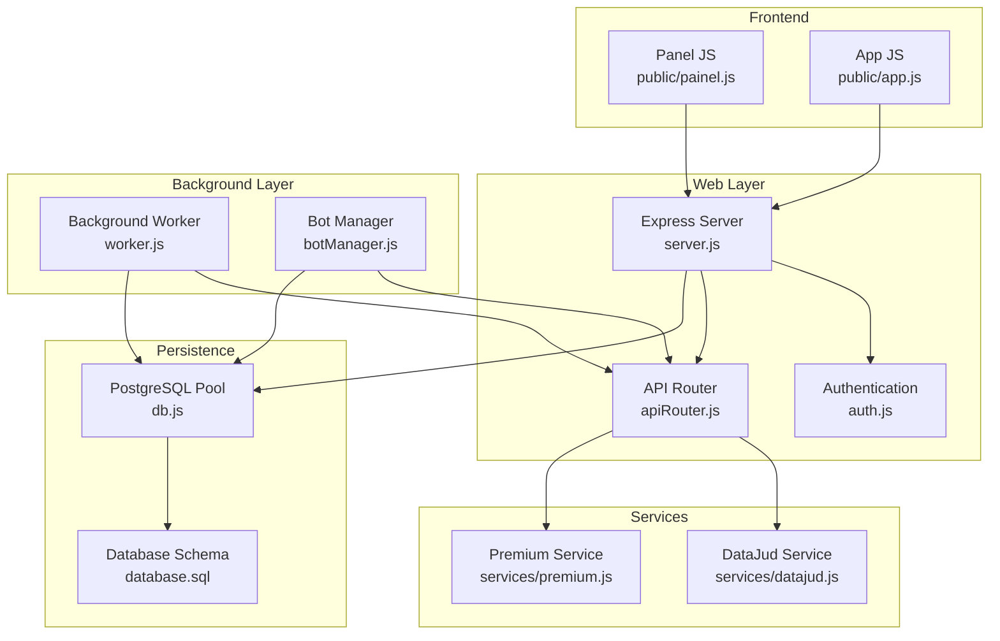
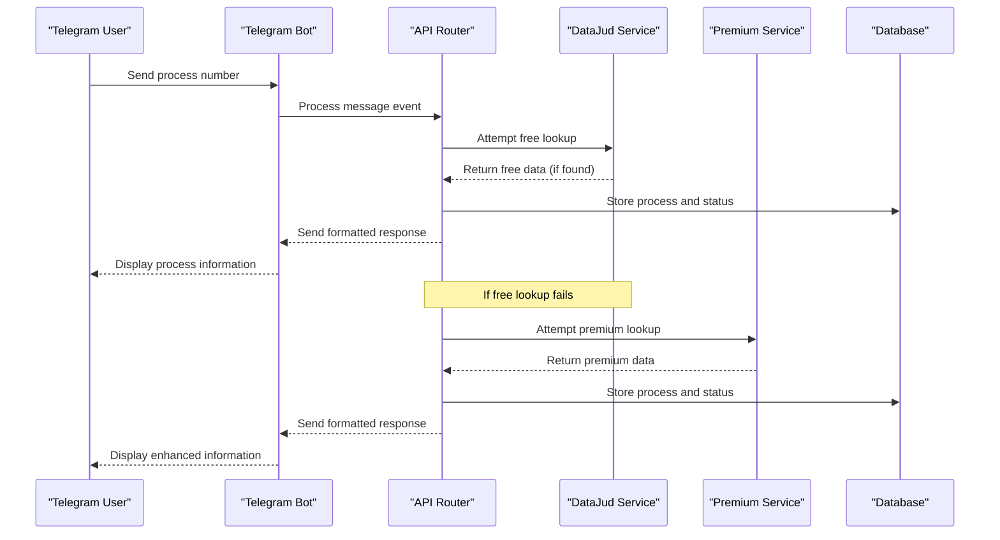
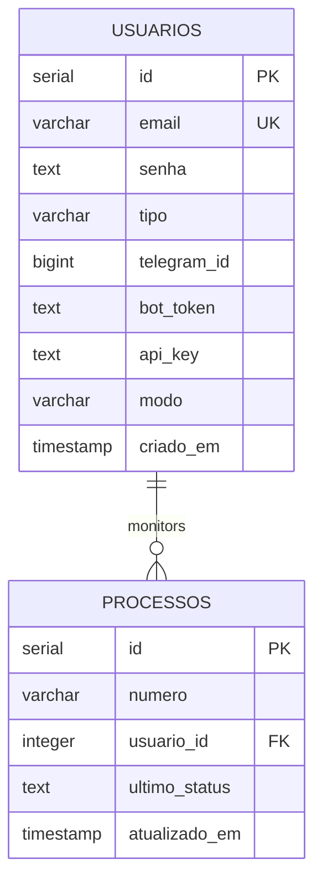
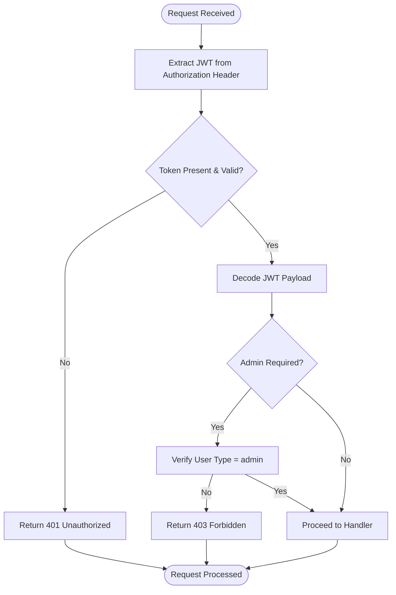
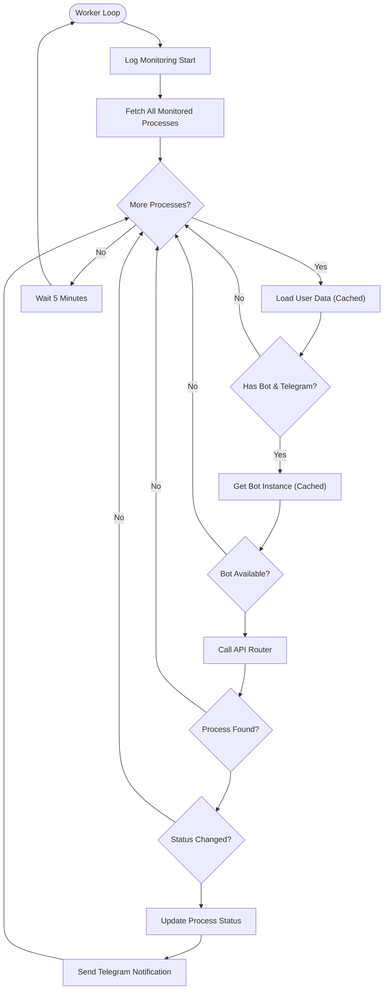
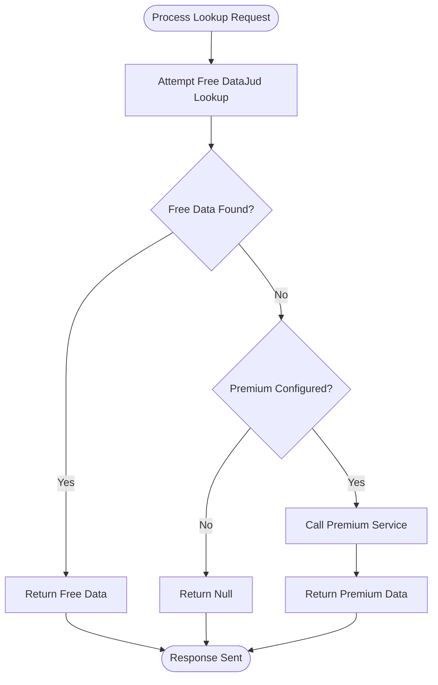
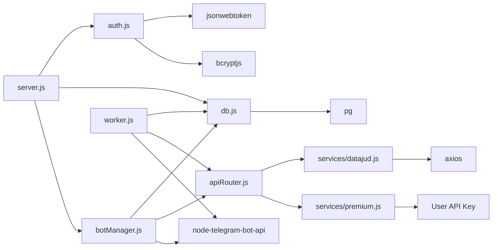

# Architecture Overview

<cite>
**Referenced Files in This Document**
- [server.js](file://server.js)
- [worker.js](file://worker.js)
- [botManager.js](file://botManager.js)
- [apiRouter.js](file://apiRouter.js)
- [services/datajud.js](file://services/datajud.js)
- [services/premium.js](file://services/premium.js)
- [db.js](file://db.js)
- [auth.js](file://auth.js)
- [database.sql](file://database.sql)
- [package.json](file://package.json)
- [public/app.js](file://public/app.js)
- [public/painel.js](file://public/painel.js)
- [README.md](file://README.md)
</cite>

## Table of Contents
1. [Introduction](#introduction)
2. [Project Structure](#project-structure)
3. [Core Components](#core-components)
4. [Architecture Overview](#architecture-overview)
5. [Detailed Component Analysis](#detailed-component-analysis)
6. [Dependency Analysis](#dependency-analysis)
7. [Performance Considerations](#performance-considerations)
8. [Troubleshooting Guide](#troubleshooting-guide)
9. [Conclusion](#conclusion)

## Introduction
This document presents the architecture overview of the Legal Process Monitoring System, a modular monolith designed to monitor Brazilian judicial processes via Telegram. The system integrates a web server, background worker, Telegram bot management, and a dual-tier API router that seamlessly switches between free DataJud services and premium paid services. It employs event-driven design for Telegram message handling and observer-like patterns for background monitoring, while maintaining a PostgreSQL database with connection pooling and pragmatic caching strategies.

## Project Structure
The system follows a modular monolith layout with clear separation of concerns:
- Web server: Express-based HTTP API with authentication middleware and administrative endpoints
- Background worker: Periodic monitoring process that checks for updates and notifies users via Telegram
- Telegram bot manager: Event-driven message handler that processes user commands and maintains bot instances
- API router: Dual-tier orchestration that attempts free DataJud first, then falls back to premium services when configured
- Services: External API integrations for DataJud and premium providers
- Database: PostgreSQL schema with connection pooling via pg.Pool
- Frontend: Minimal client-side JavaScript for administrative panel interactions

**Diagram sources**
- [server.js:1-162](file://server.js#L1-L162)
- [worker.js:1-70](file://worker.js#L1-L70)
- [botManager.js:1-53](file://botManager.js#L1-L53)
- [apiRouter.js:1-19](file://apiRouter.js#L1-L19)
- [services/datajud.js:1-32](file://services/datajud.js#L1-L32)
- [services/premium.js:1-12](file://services/premium.js#L1-L12)
- [db.js:1-11](file://db.js#L1-L11)
- [database.sql:1-25](file://database.sql#L1-L25)
- [public/painel.js:1-158](file://public/painel.js#L1-L158)
- [public/app.js:1-53](file://public/app.js#L1-L53)

**Section sources**
- [README.md:1-56](file://README.md#L1-L56)
- [package.json:1-21](file://package.json#L1-L21)

## Core Components
The system comprises four primary architectural components:

### Web Server (Express)
The Express server provides:
- Authentication endpoints for registration and login
- Administrative endpoints for user and process management
- Protected routes with JWT-based authentication middleware
- Static asset serving for the administrative panel
- Startup initialization including admin account creation and bot loading

Key responsibilities:
- Route definition and request handling
- Integration with authentication middleware
- Database interactions for user and process data
- Server lifecycle management and initialization

### Background Worker
The background worker implements a periodic monitoring system:
- Scheduled execution every 5 minutes
- Batch processing of monitored processes
- User and process caching to minimize database queries
- Telegram notification dispatch upon status changes
- Graceful startup with immediate execution

### Telegram Bot Manager
The bot manager handles event-driven interactions:
- Polling-based message processing
- Message event handlers for process number submissions
- User lookup and process validation
- Real-time notifications via Telegram API
- Bot instance caching to avoid recreation overhead

### API Router
The API router implements a dual-tier strategy:
- Free tier: DataJud integration for public court data
- Premium tier: Paid service fallback when configured
- Sequential fallback logic with user mode validation
- Unified response format across both tiers

**Section sources**
- [server.js:1-162](file://server.js#L1-L162)
- [worker.js:1-70](file://worker.js#L1-L70)
- [botManager.js:1-53](file://botManager.js#L1-L53)
- [apiRouter.js:1-19](file://apiRouter.js#L1-L19)

## Architecture Overview
The system employs a modular monolith architecture with clear separation between server, worker, bot management, and API router components. The design emphasizes:

### Event-Driven Design Pattern
Telegram bot message handling follows an event-driven pattern:
- Message events trigger asynchronous processing
- Non-blocking message handling prevents queue blocking
- Event-driven architecture enables scalable bot management
- Message handlers encapsulate business logic for process lookup

### Observer Pattern for Background Monitoring
Background monitoring implements an observer-like pattern:
- Periodic polling acts as the observer
- Process state changes trigger notifications
- Decoupled monitoring from user interactions
- Efficient batch processing reduces API load

### Dual-Tier API Architecture
The API router seamlessly switches between free and premium services:
- Free tier prioritization ensures maximum coverage
- Premium fallback requires valid API key and mode configuration
- Transparent service selection maintains consistent user experience
- Fallback logic prevents service failures from breaking the system

### Database Integration with Connection Pooling
PostgreSQL integration utilizes connection pooling:
- Centralized pool configuration for resource efficiency
- Environment-based credential management
- Robust transaction handling across components
- Schema designed for concurrent access patterns

**Diagram sources**
- [botManager.js:13-39](file://botManager.js#L13-L39)
- [apiRouter.js:4-16](file://apiRouter.js#L4-L16)
- [services/datajud.js:3-29](file://services/datajud.js#L3-L29)
- [services/premium.js:1-12](file://services/premium.js#L1-L12)
- [server.js:31-36](file://server.js#L31-L36)

## Detailed Component Analysis

### Database Layer Architecture
The database layer implements connection pooling and maintains two primary tables:

**Diagram sources**
- [database.sql:5-24](file://database.sql#L5-L24)

Key database characteristics:
- Connection pooling via pg.Pool for efficient resource utilization
- Environment-based configuration for deployment flexibility
- Foreign key relationships enabling referential integrity
- Timestamp fields for audit trails and monitoring

### Authentication and Authorization Flow
The authentication system implements JWT-based security:

**Diagram sources**
- [auth.js:16-39](file://auth.js#L16-L39)

Security features:
- JWT token generation with expiration
- Password hashing with bcrypt
- Role-based access control
- Middleware-based route protection

### Background Monitoring Workflow
The worker implements a continuous monitoring cycle:

**Diagram sources**
- [worker.js:17-61](file://worker.js#L17-L61)

Monitoring optimizations:
- User data caching to reduce repeated queries
- Bot instance caching to prevent recreation overhead
- Batch processing for efficiency
- Immediate startup execution for rapid coverage

### API Router Orchestration
The API router implements a strategic fallback mechanism:

**Diagram sources**
- [apiRouter.js:4-16](file://apiRouter.js#L4-L16)

Service integration:
- Free tier prioritization maximizes public data access
- Premium fallback requires valid API key and non-free mode
- Consistent response format across both services
- Error handling prevents cascading failures

**Section sources**
- [db.js:1-11](file://db.js#L1-L11)
- [auth.js:1-59](file://auth.js#L1-L59)
- [worker.js:1-70](file://worker.js#L1-L70)
- [apiRouter.js:1-19](file://apiRouter.js#L1-L19)

## Dependency Analysis
The system exhibits clean dependency relationships with low coupling and high cohesion:

**Diagram sources**
- [server.js:1-6](file://server.js#L1-L6)
- [worker.js:1-4](file://worker.js#L1-L4)
- [botManager.js:1-3](file://botManager.js#L1-L3)
- [apiRouter.js:1-2](file://apiRouter.js#L1-L2)
- [db.js:1](file://db.js#L1)
- [auth.js:1-3](file://auth.js#L1-L3)

Dependency characteristics:
- Clear separation between components
- Minimal cross-dependencies
- External library isolation
- Environment configuration abstraction

**Section sources**
- [package.json:11-19](file://package.json#L11-L19)

## Performance Considerations
The system implements several performance optimization strategies:

### Connection Pooling
- Centralized PostgreSQL connection pool reduces resource overhead
- Efficient connection reuse across multiple components
- Configurable pool parameters for optimal throughput

### Caching Strategies
- Bot instance caching prevents repeated Telegram API initialization
- User data caching minimizes database queries during monitoring
- Response caching opportunities for frequently accessed data

### Asynchronous Processing
- Non-blocking message handling prevents queue bottlenecks
- Parallel processing of independent user requests
- Background monitoring decouples from user interactions

### Resource Management
- Environment-based configuration for deployment flexibility
- Graceful error handling prevents resource leaks
- Periodic cleanup of stale connections and caches

## Troubleshooting Guide
Common issues and resolution strategies:

### Database Connectivity
- Verify PostgreSQL service availability
- Check environment variables for credentials
- Confirm database schema initialization
- Review connection pool limits and timeouts

### Authentication Issues
- Validate JWT secret configuration
- Check token expiration and format
- Verify user credentials and roles
- Review middleware chain execution order

### Telegram Integration Problems
- Confirm bot token validity and permissions
- Verify webhook or polling configuration
- Check Telegram API rate limits
- Validate chat ID accessibility

### API Service Failures
- Monitor external service availability
- Implement retry mechanisms for transient errors
- Validate API keys and service configurations
- Check network connectivity and firewall rules

**Section sources**
- [server.js:30-36](file://server.js#L30-L36)
- [auth.js:17-31](file://auth.js#L17-L31)
- [worker.js:42-43](file://worker.js#L42-L43)

## Conclusion
The Legal Process Monitoring System demonstrates a well-architected modular monolith that effectively balances simplicity with scalability. The event-driven bot management, observer-like background monitoring, and dual-tier API routing create a robust foundation for judicial process monitoring. The PostgreSQL integration with connection pooling, combined with pragmatic caching strategies, ensures efficient resource utilization. The clear separation of concerns across server, worker, bot management, and API router components provides maintainable architecture suitable for continued evolution and scaling.