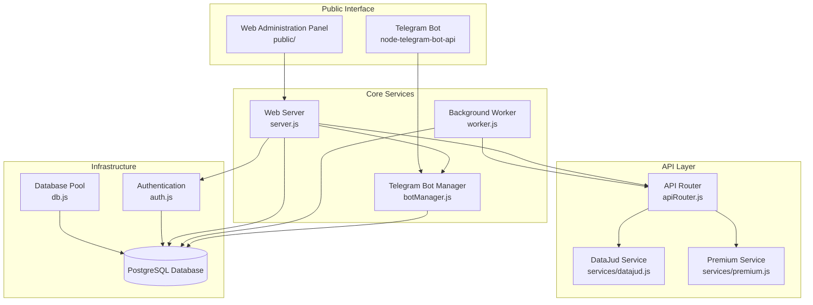
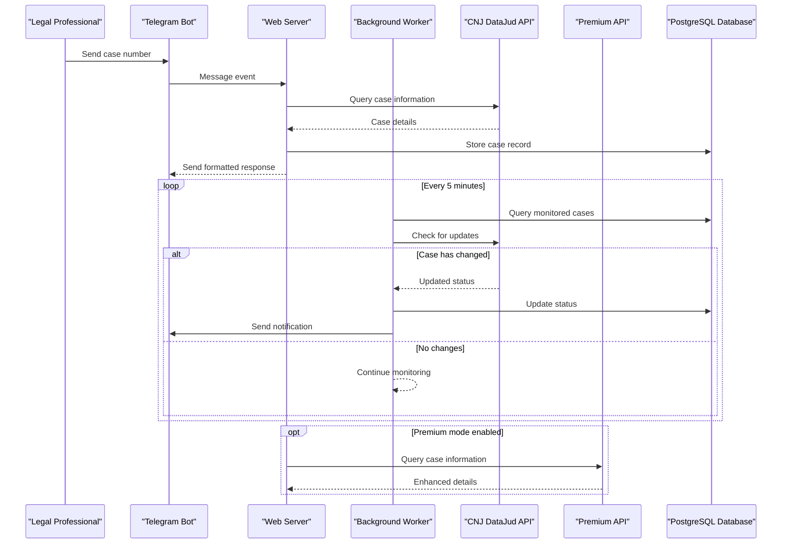
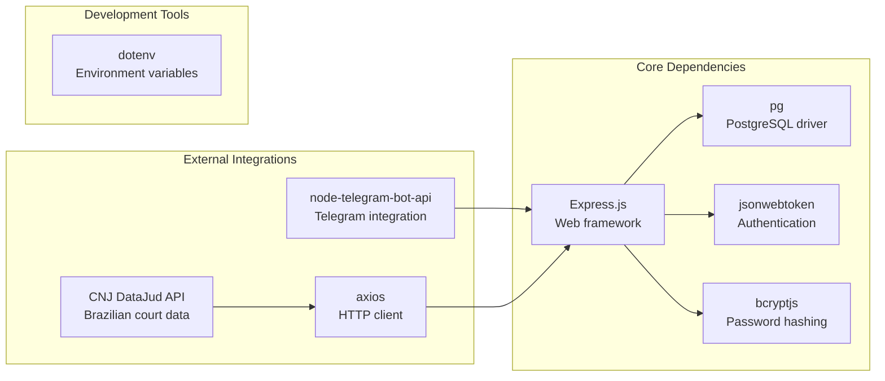

# Introduction

<cite>
**Referenced Files in This Document**
- [README.md](file://README.md)
- [package.json](file://package.json)
- [server.js](file://server.js)
- [botManager.js](file://botManager.js)
- [apiRouter.js](file://apiRouter.js)
- [services/datajud.js](file://services/datajud.js)
- [services/premium.js](file://services/premium.js)
- [worker.js](file://worker.js)
- [auth.js](file://auth.js)
- [db.js](file://db.js)
- [database.sql](file://database.sql)
</cite>

## Table of Contents
1. [Introduction](#introduction)
2. [Project Structure](#project-structure)
3. [Core Components](#core-components)
4. [Architecture Overview](#architecture-overview)
5. [Detailed Component Analysis](#detailed-component-analysis)
6. [Dependency Analysis](#dependency-analysis)
7. [Performance Considerations](#performance-considerations)
8. [Troubleshooting Guide](#troubleshooting-guide)
9. [Conclusion](#conclusion)

## Introduction

The Legal Process Monitoring System is a multi-user Software-as-a-Service (SaaS) platform designed to revolutionize how legal professionals track and monitor judicial processes through the convenience of Telegram. This system addresses a critical pain point in legal practice: the time-intensive manual monitoring of case statuses across multiple courts and jurisdictions.

### Problem Statement

Legal practitioners face significant challenges in maintaining oversight of ongoing judicial proceedings. Traditionally, attorneys, researchers, and court staff must manually check court websites, subscribe to multiple notification systems, and continuously monitor case updates across different judicial systems. This fragmented approach leads to missed deadlines, delayed responses to procedural developments, and inefficient resource allocation.

The Brazilian legal system, governed by the National Council of Justice (CNJ), presents unique complexities with its decentralized structure across 27 states plus the Federal District. Each jurisdiction maintains separate court systems with varying update frequencies and notification protocols, creating a particularly challenging environment for comprehensive legal process monitoring.

### Solution Overview

The Legal Process Monitoring System provides an automated solution that consolidates judicial process tracking through:

- **Telegram Bot Integration**: Leverages the widespread adoption of Telegram among legal professionals for instant, reliable notifications
- **Multi-API Architecture**: Combines free CNJ DataJud API access with premium alternatives for comprehensive coverage
- **Real-time Monitoring**: Automated background workers continuously poll for case status changes
- **Multi-user Management**: Supports individual user accounts with role-based access controls

### Target Audience

The platform serves three primary user segments within the legal ecosystem:

**Legal Practitioners**: Attorneys managing multiple cases who require real-time updates without manual intervention
**Legal Researchers**: Scholars and paralegals conducting litigation research requiring comprehensive case tracking
**Court Staff**: Judicial personnel monitoring case progress and procedural compliance across multiple dockets

### Key Value Proposition

The system eliminates the manual burden of judicial process monitoring through intelligent automation. Users simply register their Telegram bot credentials, submit case numbers, and receive instant notifications when case statuses change. This approach reduces administrative overhead while ensuring compliance with legal deadlines and procedural requirements.

### Mission Statement

The Legal Process Monitoring System aims to streamline legal process tracking through intelligent automation and real-time notifications. By integrating Telegram's communication infrastructure with CNJ's judicial data sources, the platform enables legal professionals to focus on substantive legal work rather than administrative case monitoring tasks.

The system's architecture ensures reliability through redundant API access, secure user authentication, and scalable multi-user support designed for the demanding requirements of legal practice environments.

**Section sources**
- [README.md:1-56](file://README.md#L1-L56)
- [package.json:1-21](file://package.json#L1-L21)

## Project Structure

The Legal Process Monitoring System follows a modular architecture designed for scalability and maintainability. The project structure supports concurrent development of web services, Telegram bot functionality, and background monitoring processes.

**Diagram sources**
- [server.js:1-162](file://server.js#L1-L162)
- [botManager.js:1-53](file://botManager.js#L1-L53)
- [worker.js:1-70](file://worker.js#L1-L70)
- [apiRouter.js:1-19](file://apiRouter.js#L1-L19)
- [services/datajud.js:1-32](file://services/datajud.js#L1-L32)
- [services/premium.js:1-12](file://services/premium.js#L1-L12)
- [auth.js:1-59](file://auth.js#L1-L59)
- [db.js:1-11](file://db.js#L1-L11)

**Section sources**
- [server.js:1-162](file://server.js#L1-L162)
- [botManager.js:1-53](file://botManager.js#L1-L53)
- [worker.js:1-70](file://worker.js#L1-L70)
- [database.sql:1-25](file://database.sql#L1-L25)

## Core Components

The Legal Process Monitoring System comprises several interconnected components that work together to provide comprehensive judicial process tracking capabilities.

### Web Server Infrastructure

The central web server ([server.js](file://server.js)) manages user authentication, administrative functions, and API endpoints. It implements role-based access control with JWT tokens for secure user sessions and supports both client-side and administrative user management.

### Telegram Bot Integration

The Telegram bot manager ([botManager.js](file://botManager.js)) handles real-time message processing from users. It processes case number submissions, queries external APIs for case information, and responds with formatted case details. The system supports multiple concurrent bot instances, each associated with individual user accounts.

### Background Monitoring System

The worker process ([worker.js](file://worker.js)) operates independently from the web server to perform continuous monitoring of tracked cases. Running at five-minute intervals, it queries external APIs for status changes and sends Telegram notifications when updates occur.

### API Integration Layer

The API router ([apiRouter.js](file://apiRouter.js)) orchestrates data retrieval from multiple sources. It prioritizes free CNJ DataJud API access while providing fallback to premium services for enhanced coverage, ensuring comprehensive case tracking regardless of jurisdictional limitations.

**Section sources**
- [server.js:1-162](file://server.js#L1-L162)
- [botManager.js:1-53](file://botManager.js#L1-L53)
- [worker.js:1-70](file://worker.js#L1-L70)
- [apiRouter.js:1-19](file://apiRouter.js#L1-L19)

## Architecture Overview

The Legal Process Monitoring System employs a distributed architecture that separates concerns across multiple specialized components while maintaining seamless integration.

**Diagram sources**
- [botManager.js:13-39](file://botManager.js#L13-L39)
- [server.js:11-36](file://server.js#L11-L36)
- [worker.js:17-61](file://worker.js#L17-L61)
- [services/datajud.js:3-29](file://services/datajud.js#L3-L29)
- [services/premium.js:1-12](file://services/premium.js#L1-L12)

The architecture ensures high availability through independent service components, fault tolerance through API redundancy, and scalability through database-backed session management.

**Section sources**
- [server.js:1-162](file://server.js#L1-L162)
- [worker.js:1-70](file://worker.js#L1-L70)
- [botManager.js:1-53](file://botManager.js#L1-L53)

## Detailed Component Analysis

### Authentication and Authorization System

The authentication module ([auth.js](file://auth.js)) implements JWT-based security with role-based access controls. It provides secure user registration, login functionality, and administrative access verification. The system supports both client and administrative user roles with appropriate permission boundaries.

### Database Schema Design

The PostgreSQL schema ([database.sql](file://database.sql)) defines two primary tables: users and cases. The users table stores authentication credentials, Telegram integration data, and subscription modes. The cases table maintains tracking records with foreign key relationships to user accounts and status timestamps.

### Telegram Bot Communication Protocol

The bot manager ([botManager.js](file://botManager.js)) establishes persistent connections with Telegram's API using polling mechanisms. It processes incoming messages, validates case numbers against external APIs, and formats responses according to legal information standards.

### API Integration Strategy

The API router ([apiRouter.js](file://apiRouter.js)) implements a tiered approach to data retrieval. It first attempts free CNJ DataJud API access, falling back to premium services when available. This strategy maximizes accessibility while providing enhanced functionality for paying users.

**Section sources**
- [auth.js:1-59](file://auth.js#L1-L59)
- [database.sql:5-24](file://database.sql#L5-L24)
- [botManager.js:7-42](file://botManager.js#L7-L42)
- [apiRouter.js:4-16](file://apiRouter.js#L4-L16)

## Dependency Analysis

The Legal Process Monitoring System relies on several key dependencies that enable its core functionality and integration capabilities.

**Diagram sources**
- [package.json:11-19](file://package.json#L11-L19)

The dependency structure supports modularity while maintaining clear separation between authentication, database operations, external API integrations, and user interface components.

**Section sources**
- [package.json:1-21](file://package.json#L1-L21)

## Performance Considerations

The Legal Process Monitoring System is designed with performance optimization in mind, particularly for the background monitoring workload that scales with user base growth.

### Background Worker Efficiency

The worker process ([worker.js](file://worker.js)) implements several optimization strategies:
- Batch processing of case checks to minimize API calls
- User data caching to reduce database queries
- Bot instance caching to avoid repeated Telegram API initialization
- Configurable polling intervals for different load scenarios

### Database Optimization

The PostgreSQL implementation includes:
- Proper indexing on frequently queried columns
- Connection pooling for efficient database access
- Asynchronous query execution for non-blocking operations
- Efficient UPDATE operations with timestamp tracking

### Scalability Architecture

The system architecture supports horizontal scaling through:
- Stateless web server components
- Shared database backend
- Independent worker processes
- Modular service design enabling microservice deployment

## Troubleshooting Guide

Common operational issues and their resolution strategies:

### Telegram Bot Connectivity Issues

**Symptoms**: Users report missing notifications or bot unresponsiveness
**Resolution Steps**:
1. Verify bot token validity in user registration
2. Check Telegram bot status and connectivity
3. Review worker process logs for API errors
4. Confirm database entries for monitored cases

### API Integration Problems

**Symptoms**: Case information not updating or returning empty results
**Resolution Steps**:
1. Verify CNJ DataJud API availability
2. Check premium API key validity for paid users
3. Review rate limiting and quota restrictions
4. Examine network connectivity to external APIs

### Database Connection Issues

**Symptoms**: Application crashes or timeout errors
**Resolution Steps**:
1. Verify PostgreSQL service availability
2. Check connection string parameters
3. Review database user permissions
4. Monitor connection pool exhaustion

**Section sources**
- [worker.js:17-61](file://worker.js#L17-L61)
- [botManager.js:13-39](file://botManager.js#L13-L39)
- [db.js:4-10](file://db.js#L4-L10)

## Conclusion

The Legal Process Monitoring System represents a comprehensive solution to the challenges of judicial process tracking in modern legal practice. By combining Telegram's instant communication capabilities with automated background monitoring and robust API integration, the platform delivers significant value to legal professionals seeking efficient case management solutions.

The system's architecture supports scalability, reliability, and maintainability while providing essential features for legal practice including real-time notifications, multi-user support, and flexible API access strategies. Its integration with Brazilian legal data sources positions it specifically to serve the needs of practitioners within the CNJ framework.

Through intelligent automation and user-friendly interfaces, the platform transforms the traditionally manual and time-consuming process of judicial monitoring into an efficient, reliable, and scalable service that enhances legal practice productivity and compliance.