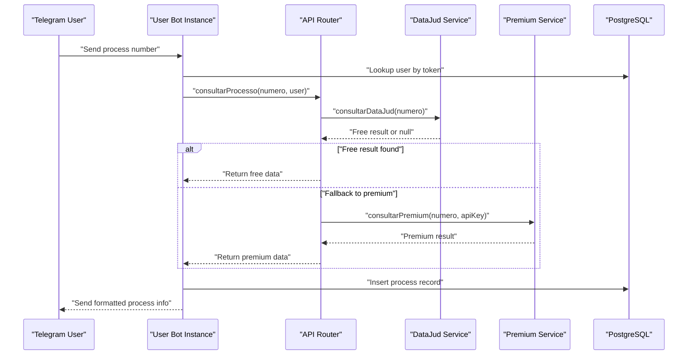
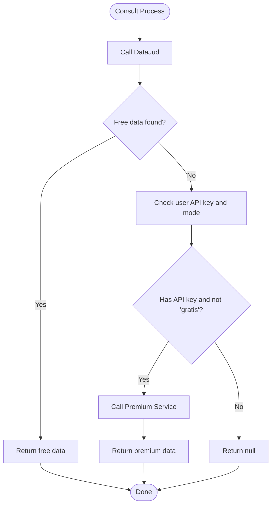
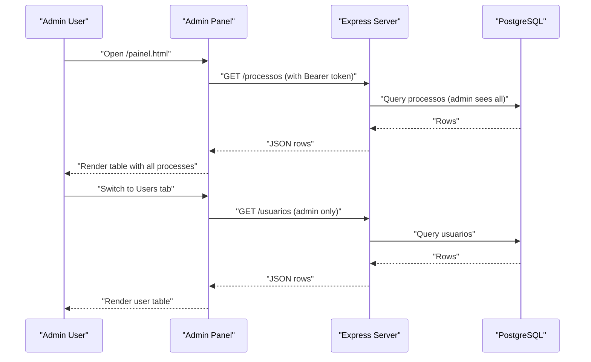
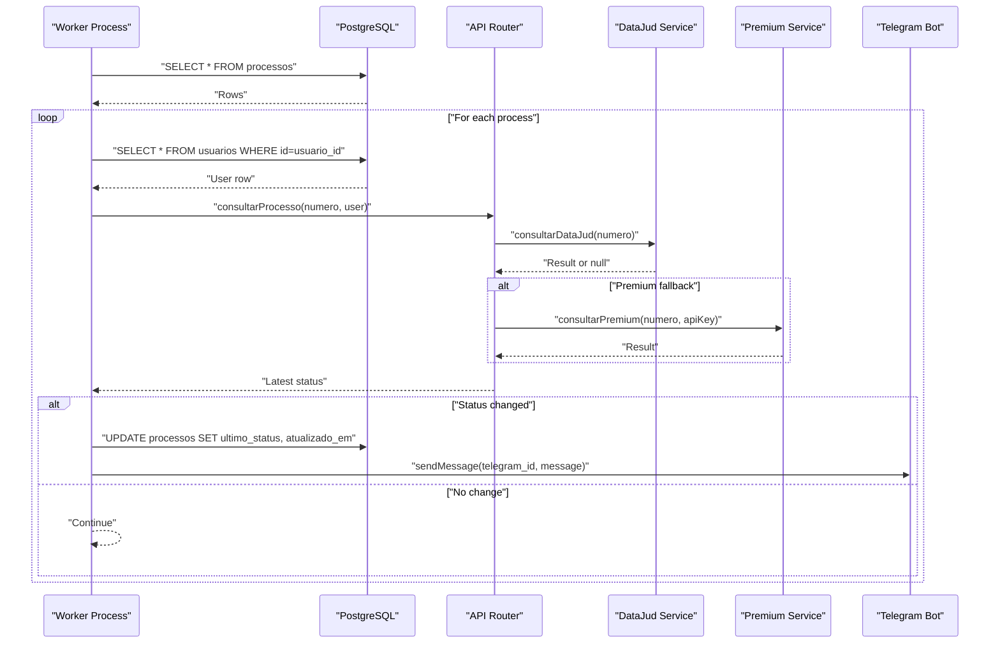
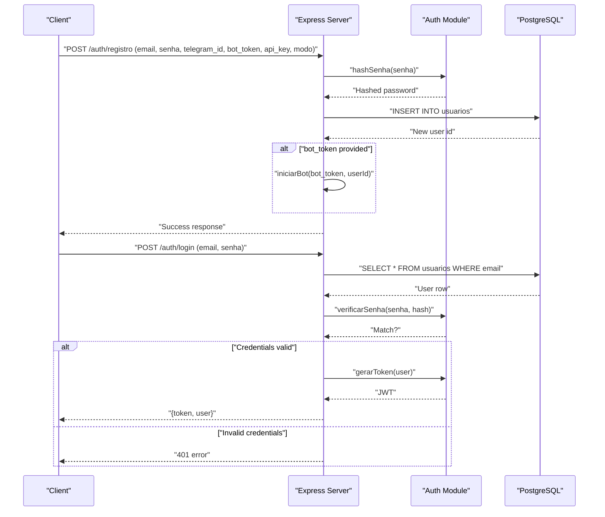
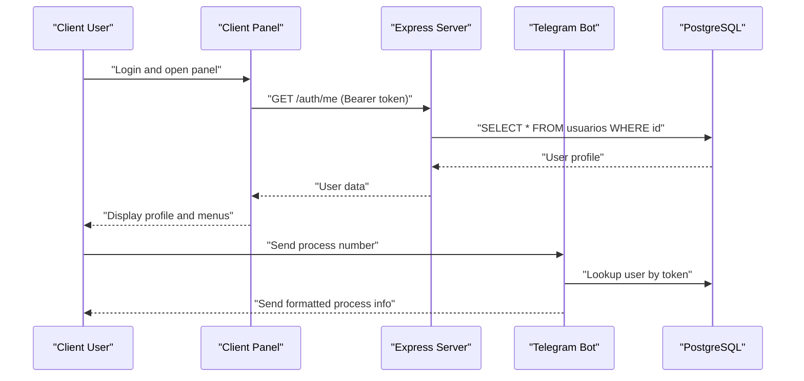
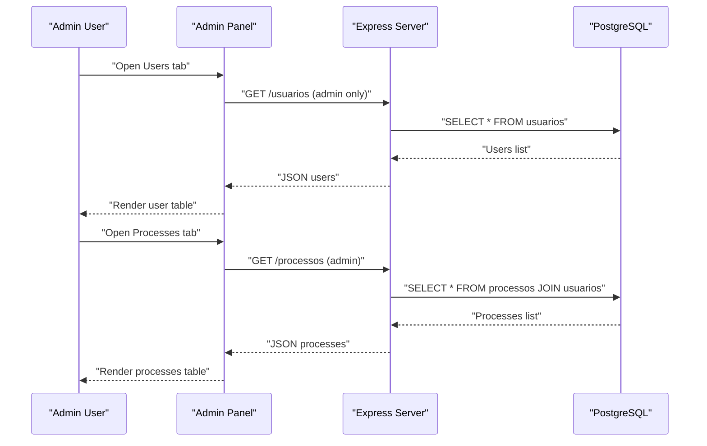

# Key Features

<cite>
**Referenced Files in This Document**
- [server.js](file://server.js)
- [botManager.js](file://botManager.js)
- [apiRouter.js](file://apiRouter.js)
- [auth.js](file://auth.js)
- [worker.js](file://worker.js)
- [services/datajud.js](file://services/datajud.js)
- [services/premium.js](file://services/premium.js)
- [db.js](file://db.js)
- [database.sql](file://database.sql)
- [public/painel.html](file://public/painel.html)
- [public/painel.js](file://public/painel.js)
- [public/app.js](file://public/app.js)
- [README.md](file://README.md)
</cite>

## Table of Contents
1. [Introduction](#introduction)
2. [Multi-User Architecture with Individual Telegram Bots](#multi-user-architecture-with-individual-telegram-bots)
3. [Dual-Tier API Approach: Free DataJud Integration and Premium Fallback](#dual-tier-api-approach-free-datajud-integration-and-premium-fallback)
4. [Web Administration Panel and Real-Time Process Monitoring](#web-administration-panel-and-real-time-process-monitoring)
5. [Automatic Update Detection and Instant Telegram Notifications](#automatic-update-detection-and-instant-telegram-notifications)
6. [User Registration, Authentication, Role-Based Access Control, and Administrative Management](#user-registration-authentication-role-based-access-control-and-administrative-management)
7. [Feature Workflows and Benefits by User Type](#feature-workflows-and-benefits-by-user-type)
8. [Conclusion](#conclusion)

## Introduction
This document outlines the key features of the Legal Process Monitoring System, focusing on its multi-user architecture with individual Telegram bots per user, dual-tier API approach integrating free DataJud and optional premium services, the web administration panel, real-time process monitoring, automatic update detection, instant notifications, and robust user registration and role-based access control.

## Multi-User Architecture with Individual Telegram Bots
The system supports multiple users, each with their own Telegram bot instance. Each user’s bot is isolated and runs independently, enabling:
- Scalability: New users can be onboarded without affecting existing users.
- Isolation: Each user’s bot operates separately, reducing cross-user interference.
- Personalization: Users can configure Telegram IDs, bot tokens, and API keys per account.

Key implementation highlights:
- Per-user bot initialization and persistence in the database.
- On-demand bot startup when a user registers or when the server restarts.
- Message handling routes incoming Telegram messages to the appropriate user context.

**Diagram sources**
- [botManager.js:13-39](file://botManager.js#L13-L39)
- [apiRouter.js:4-16](file://apiRouter.js#L4-L16)
- [services/datajud.js:3-29](file://services/datajud.js#L3-L29)
- [services/premium.js:1-12](file://services/premium.js#L1-L12)

**Section sources**
- [botManager.js:7-42](file://botManager.js#L7-L42)
- [server.js:12-36](file://server.js#L12-L36)
- [database.sql:5-24](file://database.sql#L5-L24)

## Dual-Tier API Approach: Free DataJud Integration and Premium Fallback
The system integrates a two-tier API strategy:
- Free tier: Uses DataJud CNJ public API to retrieve initial process data.
- Premium fallback: If free data is unavailable and the user has a valid API key and mode set to non-free, the system attempts a premium service.

Benefits:
- Cost-effective for basic usage.
- Extensible for advanced users requiring richer data.

**Diagram sources**
- [apiRouter.js:4-16](file://apiRouter.js#L4-L16)
- [services/datajud.js:3-29](file://services/datajud.js#L3-L29)
- [services/premium.js:1-12](file://services/premium.js#L1-L12)

**Section sources**
- [apiRouter.js:4-16](file://apiRouter.js#L4-L16)
- [services/datajud.js:3-29](file://services/datajud.js#L3-L29)
- [services/premium.js:1-12](file://services/premium.js#L1-L12)

## Web Administration Panel and Real-Time Process Monitoring
The web administration panel provides:
- Role-based navigation: Admin menu includes user management and process listings; client menu focuses on personal processes and configuration.
- Real-time updates: Automatic refresh of process lists and user lists at short intervals.
- Administrative capabilities: Create users, assign roles, configure modes (free, hybrid, paid), and manage Telegram and API integrations.

**Diagram sources**
- [public/painel.html:19-31](file://public/painel.html#L19-L31)
- [public/painel.js:37-62](file://public/painel.js#L37-L62)
- [public/painel.js:64-89](file://public/painel.js#L64-L89)
- [server.js:94-122](file://server.js#L94-L122)

**Section sources**
- [public/painel.html:19-31](file://public/painel.html#L19-L31)
- [public/painel.js:37-62](file://public/painel.js#L37-L62)
- [public/painel.js:64-89](file://public/painel.js#L64-L89)
- [server.js:94-122](file://server.js#L94-L122)

## Automatic Update Detection and Instant Telegram Notifications
The worker periodically checks for process updates and sends instant Telegram notifications:
- Periodic polling: Runs every 5 minutes with immediate startup.
- Grouping and caching: Groups processes by user to minimize repeated queries and caches user records.
- Notification delivery: Sends alerts when a process status changes.

**Diagram sources**
- [worker.js:17-61](file://worker.js#L17-L61)
- [apiRouter.js:4-16](file://apiRouter.js#L4-L16)
- [services/datajud.js:3-29](file://services/datajud.js#L3-L29)
- [services/premium.js:1-12](file://services/premium.js#L1-L12)

**Section sources**
- [worker.js:17-61](file://worker.js#L17-L61)
- [apiRouter.js:4-16](file://apiRouter.js#L4-L16)

## User Registration, Authentication, Role-Based Access Control, and Administrative Management
The system provides secure user lifecycle management:
- Registration: New users can register via the web interface or admin endpoint. Passwords are hashed, and optional Telegram bot configuration is supported.
- Authentication: JWT-based authentication with middleware enforcing token verification.
- Authorization: Role-based access control differentiates admins from clients; admin-only endpoints are protected.
- Administrative management: Admins can create users, assign roles, and configure modes and integrations.

**Diagram sources**
- [server.js:12-36](file://server.js#L12-L36)
- [server.js:39-68](file://server.js#L39-L68)
- [auth.js:8-31](file://auth.js#L8-L31)
- [auth.js:42-49](file://auth.js#L42-L49)

**Section sources**
- [server.js:12-36](file://server.js#L12-L36)
- [server.js:39-68](file://server.js#L39-L68)
- [auth.js:8-31](file://auth.js#L8-L31)
- [auth.js:33-39](file://auth.js#L33-L39)

## Feature Workflows and Benefits by User Type
Below are concrete workflows and benefits tailored to different user types.

### Client User Workflow
- Registration and Setup:
  - Register via the web interface or admin endpoint with Telegram ID, bot token, and API key if desired.
  - Receive a JWT token upon login for authenticated access.
- Process Monitoring:
  - Send a process number to the Telegram bot.
  - Receive formatted process details instantly.
  - View monitored processes in the client section of the admin panel.
- Benefits:
  - Quick access to legal process information via Telegram.
  - Real-time updates delivered automatically without manual checks.

**Diagram sources**
- [public/painel.js:91-108](file://public/painel.js#L91-L108)
- [botManager.js:13-39](file://botManager.js#L13-L39)
- [server.js:124-135](file://server.js#L124-L135)

**Section sources**
- [public/painel.js:91-108](file://public/painel.js#L91-L108)
- [botManager.js:13-39](file://botManager.js#L13-L39)
- [server.js:124-135](file://server.js#L124-L135)

### Admin User Workflow
- User Management:
  - Create new users with roles, Telegram IDs, bot tokens, API keys, and modes.
  - View all users and their configurations.
- Process Oversight:
  - Access all monitored processes across users.
  - Verify system behavior and troubleshoot issues.
- Benefits:
  - Centralized control over users and processes.
  - Efficient onboarding and operational oversight.

**Diagram sources**
- [public/painel.js:64-89](file://public/painel.js#L64-L89)
- [public/painel.js:37-62](file://public/painel.js#L37-L62)
- [server.js:113-122](file://server.js#L113-L122)
- [server.js:94-110](file://server.js#L94-L110)

**Section sources**
- [public/painel.js:64-89](file://public/painel.js#L64-L89)
- [public/painel.js:37-62](file://public/painel.js#L37-L62)
- [server.js:113-122](file://server.js#L113-L122)
- [server.js:94-110](file://server.js#L94-L110)

## Conclusion
The Legal Process Monitoring System delivers a scalable, secure, and efficient solution for legal process tracking. Its multi-user architecture with individual Telegram bots ensures isolation and growth potential. The dual-tier API approach balances cost and capability, while the web administration panel and real-time monitoring provide transparency and automation. Robust authentication and role-based access control enable safe and flexible management, benefiting both individual clients and administrators.