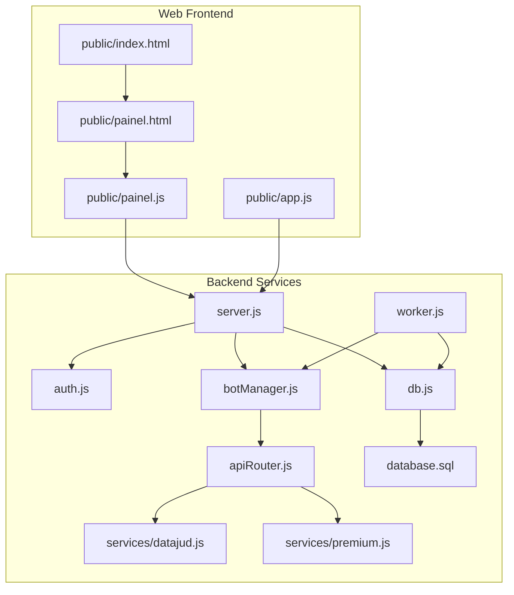
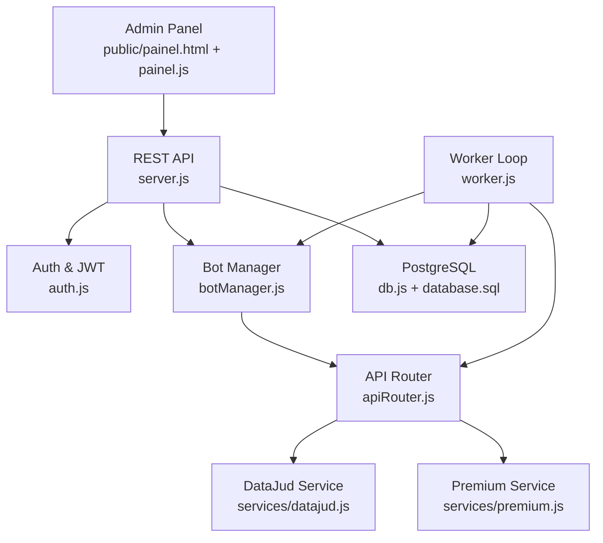
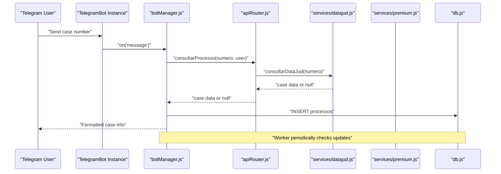
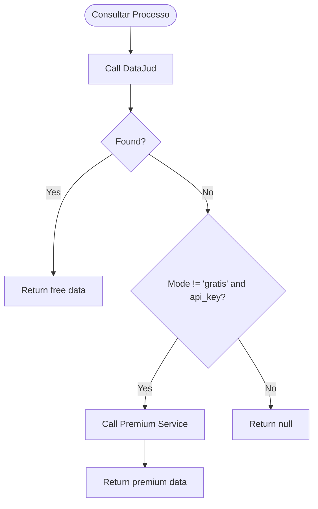
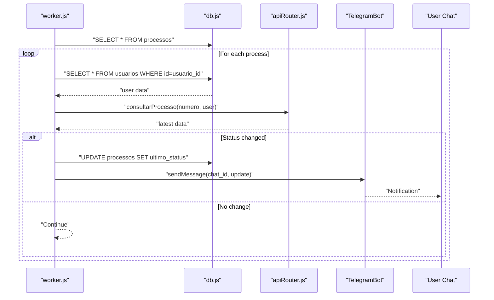
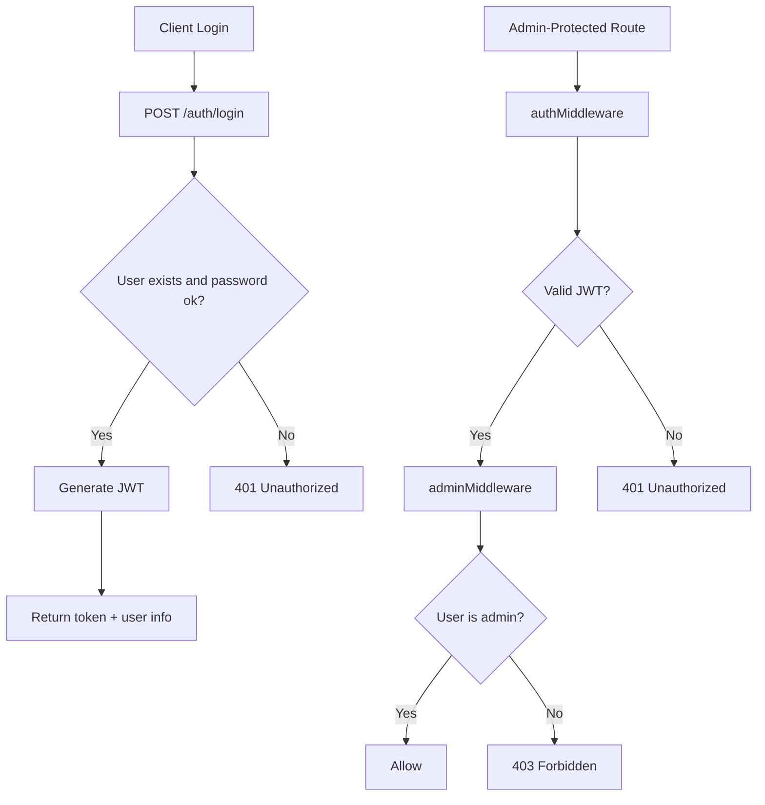
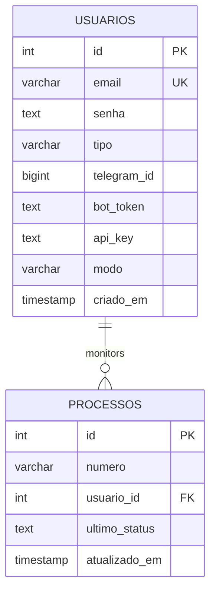
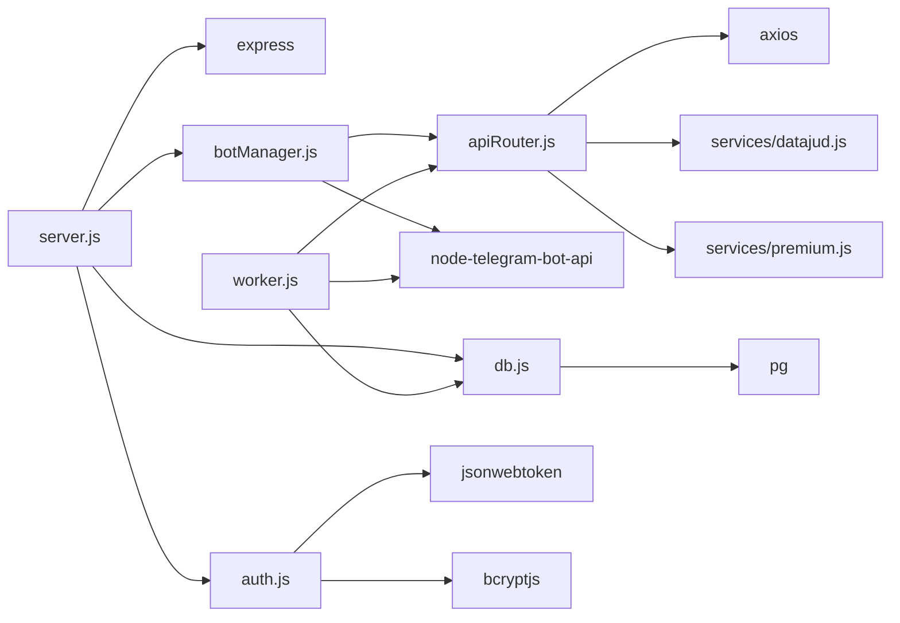

# Project Overview

<cite>
**Referenced Files in This Document**
- [README.md](file://README.md)
- [package.json](file://package.json)
- [server.js](file://server.js)
- [botManager.js](file://botManager.js)
- [apiRouter.js](file://apiRouter.js)
- [services/datajud.js](file://services/datajud.js)
- [services/premium.js](file://services/premium.js)
- [worker.js](file://worker.js)
- [auth.js](file://auth.js)
- [db.js](file://db.js)
- [database.sql](file://database.sql)
- [public/index.html](file://public/index.html)
- [public/painel.html](file://public/painel.html)
- [public/painel.js](file://public/painel.js)
- [public/app.js](file://public/app.js)
</cite>

## Table of Contents
1. [Introduction](#introduction)
2. [Project Structure](#project-structure)
3. [Core Components](#core-components)
4. [Architecture Overview](#architecture-overview)
5. [Detailed Component Analysis](#detailed-component-analysis)
6. [Dependency Analysis](#dependency-analysis)
7. [Performance Considerations](#performance-considerations)
8. [Troubleshooting Guide](#troubleshooting-guide)
9. [Conclusion](#conclusion)
10. [Appendices](#appendices)

## Introduction
Legal Process Monitoring System is a multi-user SaaS platform designed to track Brazilian judicial processes via Telegram. It integrates a Telegram bot for user interaction, a web administration panel for managing users and subscriptions, and a dual-tier API approach powered by DataJud (free tier) and optional premium services. The system enables legal professionals and researchers to receive timely updates on case statuses with minimal operational overhead.

Key value proposition:
- Seamless Telegram-based monitoring for legal professionals and researchers
- Dual-tier API strategy: free access via DataJud with optional paid fallback for richer data
- Real-time notifications delivered directly to users’ Telegram chats
- Web-based administration for user provisioning and subscription management

Target audience:
- Legal practitioners who need continuous updates on case timelines
- Researchers and paralegals tracking multiple cases across jurisdictions
- Organizations requiring centralized monitoring dashboards

Differentiators:
- Integrated Telegram bot for immediate process lookup and subscription
- Hybrid mode support enabling flexible access tiers (gratis, híbrido, pago)
- Dedicated worker process for periodic checks and real-time alerts
- Lightweight, modular architecture with clear separation of concerns

## Project Structure
The project follows a modular backend architecture with a small but functional frontend for administration. The backend exposes REST endpoints, manages Telegram bots, orchestrates API lookups, and runs a worker for periodic monitoring. The frontend provides a web-based admin panel for user and process management.

**Diagram sources**
- [server.js:1-162](file://server.js#L1-L162)
- [botManager.js:1-53](file://botManager.js#L1-L53)
- [apiRouter.js:1-19](file://apiRouter.js#L1-L19)
- [services/datajud.js:1-32](file://services/datajud.js#L1-L32)
- [services/premium.js:1-12](file://services/premium.js#L1-L12)
- [worker.js:1-70](file://worker.js#L1-L70)
- [auth.js:1-59](file://auth.js#L1-L59)
- [db.js:1-11](file://db.js#L1-L11)
- [database.sql:1-25](file://database.sql#L1-L25)
- [public/index.html:1-11](file://public/index.html#L1-L11)
- [public/painel.html:1-97](file://public/painel.html#L1-L97)
- [public/painel.js:1-158](file://public/painel.js#L1-L158)
- [public/app.js:1-53](file://public/app.js#L1-L53)

**Section sources**
- [README.md:1-56](file://README.md#L1-L56)
- [package.json:1-21](file://package.json#L1-L21)
- [server.js:1-162](file://server.js#L1-L162)
- [botManager.js:1-53](file://botManager.js#L1-L53)
- [apiRouter.js:1-19](file://apiRouter.js#L1-L19)
- [services/datajud.js:1-32](file://services/datajud.js#L1-L32)
- [services/premium.js:1-12](file://services/premium.js#L1-L12)
- [worker.js:1-70](file://worker.js#L1-L70)
- [auth.js:1-59](file://auth.js#L1-L59)
- [db.js:1-11](file://db.js#L1-L11)
- [database.sql:1-25](file://database.sql#L1-L25)
- [public/index.html:1-11](file://public/index.html#L1-L11)
- [public/painel.html:1-97](file://public/painel.html#L1-L97)
- [public/painel.js:1-158](file://public/painel.js#L1-L158)
- [public/app.js:1-53](file://public/app.js#L1-L53)

## Core Components
- Telegram bot integration: Users send case numbers to their individual bot, which responds with basic case metadata and persists monitoring records.
- Administration panel: A web-based dashboard for admins to manage users, set subscription modes, and view monitored cases.
- Dual-tier API router: Attempts free DataJud lookup first, then falls back to premium services when configured.
- Worker process: Periodically checks for status changes and sends Telegram notifications.
- Authentication and authorization: JWT-based session management with role-based access control.
- Database schema: Stores users, Telegram tokens, API keys, subscription modes, and monitored cases.

Practical example workflow:
- Setup: Create a Telegram bot via BotFather, register it in the admin panel with Telegram ID, bot token, and subscription mode.
- Registration: Users sign up and receive a JWT token for accessing the admin panel.
- Monitoring: Users send case numbers to their bot; the system queries DataJud (or premium), stores the record, and starts periodic checks.
- Notifications: The worker detects updates and sends real-time alerts to the user’s Telegram chat.

**Section sources**
- [README.md:47-56](file://README.md#L47-L56)
- [server.js:11-92](file://server.js#L11-L92)
- [botManager.js:7-42](file://botManager.js#L7-L42)
- [apiRouter.js:4-16](file://apiRouter.js#L4-L16)
- [worker.js:17-61](file://worker.js#L17-L61)
- [auth.js:8-39](file://auth.js#L8-L39)
- [database.sql:5-24](file://database.sql#L5-L24)

## Architecture Overview
The system comprises a web server exposing REST endpoints, a Telegram bot manager, a dual-tier API resolver, a worker for periodic checks, and a PostgreSQL-backed persistence layer. The frontend provides a single-page admin experience.

**Diagram sources**
- [server.js:1-162](file://server.js#L1-L162)
- [auth.js:1-59](file://auth.js#L1-L59)
- [botManager.js:1-53](file://botManager.js#L1-L53)
- [apiRouter.js:1-19](file://apiRouter.js#L1-L19)
- [services/datajud.js:1-32](file://services/datajud.js#L1-L32)
- [services/premium.js:1-12](file://services/premium.js#L1-L12)
- [worker.js:1-70](file://worker.js#L1-L70)
- [db.js:1-11](file://db.js#L1-L11)
- [database.sql:1-25](file://database.sql#L1-L25)

## Detailed Component Analysis

### Telegram Bot Integration
The bot listens for messages containing case numbers, queries the dual-tier API, persists the case, and replies with a formatted summary. On subsequent runs, the worker compares stored timestamps and notifies users of changes.

**Diagram sources**
- [botManager.js:13-39](file://botManager.js#L13-L39)
- [apiRouter.js:4-16](file://apiRouter.js#L4-L16)
- [services/datajud.js:3-29](file://services/datajud.js#L3-L29)
- [services/premium.js:1-12](file://services/premium.js#L1-L12)
- [db.js:1-11](file://db.js#L1-L11)

**Section sources**
- [botManager.js:7-42](file://botManager.js#L7-L42)
- [apiRouter.js:4-16](file://apiRouter.js#L4-L16)
- [services/datajud.js:3-29](file://services/datajud.js#L3-L29)
- [services/premium.js:1-12](file://services/premium.js#L1-L12)

### Dual-Tier API Approach
The API router attempts a free lookup first and falls back to premium services when enabled by the user’s subscription mode and API key.

**Diagram sources**
- [apiRouter.js:4-16](file://apiRouter.js#L4-L16)
- [services/datajud.js:3-29](file://services/datajud.js#L3-L29)
- [services/premium.js:1-12](file://services/premium.js#L1-L12)

**Section sources**
- [apiRouter.js:4-16](file://apiRouter.js#L4-L16)
- [services/datajud.js:3-29](file://services/datajud.js#L3-L29)
- [services/premium.js:1-12](file://services/premium.js#L1-L12)

### Worker and Real-Time Notifications
The worker periodically queries all monitored cases, compares timestamps, and sends Telegram notifications when updates are detected. It caches bot instances and user data to optimize performance.

**Diagram sources**
- [worker.js:17-61](file://worker.js#L17-L61)
- [apiRouter.js:4-16](file://apiRouter.js#L4-L16)
- [db.js:1-11](file://db.js#L1-L11)

**Section sources**
- [worker.js:17-61](file://worker.js#L17-L61)
- [apiRouter.js:4-16](file://apiRouter.js#L4-L16)

### Authentication and Authorization
The system uses JWT for session management and enforces role-based access control for administrative endpoints. Passwords are hashed using bcrypt before storage.

**Diagram sources**
- [auth.js:8-39](file://auth.js#L8-L39)
- [server.js:39-68](file://server.js#L39-L68)

**Section sources**
- [auth.js:8-39](file://auth.js#L8-L39)
- [server.js:39-68](file://server.js#L39-L68)

### Database Schema
The schema supports users with Telegram credentials and subscription modes, and a separate table for monitored cases with timestamps for change detection.

**Diagram sources**
- [database.sql:5-24](file://database.sql#L5-L24)

**Section sources**
- [database.sql:5-24](file://database.sql#L5-L24)
- [db.js:1-11](file://db.js#L1-L11)

## Dependency Analysis
External dependencies include Express for the web server, node-telegram-bot-api for Telegram integration, pg for PostgreSQL connectivity, axios for HTTP requests to DataJud, bcryptjs for password hashing, and jsonwebtoken for JWT operations.

**Diagram sources**
- [server.js:1-162](file://server.js#L1-L162)
- [botManager.js:1-53](file://botManager.js#L1-L53)
- [apiRouter.js:1-19](file://apiRouter.js#L1-L19)
- [services/datajud.js:1-32](file://services/datajud.js#L1-L32)
- [services/premium.js:1-12](file://services/premium.js#L1-L12)
- [worker.js:1-70](file://worker.js#L1-L70)
- [auth.js:1-59](file://auth.js#L1-L59)
- [db.js:1-11](file://db.js#L1-L11)
- [package.json:11-19](file://package.json#L11-L19)

**Section sources**
- [package.json:11-19](file://package.json#L11-L19)
- [server.js:1-162](file://server.js#L1-L162)
- [botManager.js:1-53](file://botManager.js#L1-L53)
- [apiRouter.js:1-19](file://apiRouter.js#L1-L19)
- [services/datajud.js:1-32](file://services/datajud.js#L1-L32)
- [services/premium.js:1-12](file://services/premium.js#L1-L12)
- [worker.js:1-70](file://worker.js#L1-L70)
- [auth.js:1-59](file://auth.js#L1-L59)
- [db.js:1-11](file://db.js#L1-L11)

## Performance Considerations
- Worker interval: The worker runs every five minutes to balance responsiveness with resource usage.
- Caching: The worker caches bot instances and user data per loop to reduce repeated initialization and database queries.
- Pagination and filtering: The admin panel lists users and cases with server-side filters to limit payload sizes.
- Network resilience: Free tier relies on DataJud; premium fallback ensures continuity when free tier is unavailable.

[No sources needed since this section provides general guidance]

## Troubleshooting Guide
Common issues and resolutions:
- Missing Telegram credentials: Ensure both bot token and Telegram ID are configured in the admin panel; the worker requires both to send notifications.
- Authentication failures: Verify JWT token validity and that the Authorization header is present in admin requests.
- API availability: If DataJud is unreachable, confirm premium mode and API key are set; otherwise, free lookups will fail.
- Database connectivity: Confirm PostgreSQL connection parameters and that the schema is initialized.

**Section sources**
- [worker.js:39-44](file://worker.js#L39-L44)
- [auth.js:17-31](file://auth.js#L17-L31)
- [apiRouter.js:11-13](file://apiRouter.js#L11-L13)
- [db.js:4-10](file://db.js#L4-L10)

## Conclusion
Legal Process Monitoring System delivers a practical, extensible solution for legal professionals and researchers to track judicial processes via Telegram. Its dual-tier API approach, real-time notifications, and web-based administration provide a robust foundation for scalable monitoring with minimal friction.

[No sources needed since this section summarizes without analyzing specific files]

## Appendices

### Getting Started (Beginner-Friendly)
- Install dependencies and start the server and worker processes as described in the repository documentation.
- Access the admin panel at the local address indicated in the documentation.
- Register users, configure Telegram credentials, and choose subscription modes (gratis, híbrido, pago).
- Send case numbers to your Telegram bot to initiate monitoring; the worker will detect and notify updates automatically.

**Section sources**
- [README.md:13-41](file://README.md#L13-L41)
- [README.md:47-56](file://README.md#L47-L56)

### Developer Highlights
- Modular service boundaries: DataJud and premium services are isolated for easy replacement or extension.
- Role-based admin endpoints: Use middleware to protect sensitive routes.
- Event-driven bot: Uses Telegram polling to handle user messages synchronously.
- Scheduled monitoring: Worker loop decouples long-running checks from the web server.

**Section sources**
- [services/datajud.js:1-32](file://services/datajud.js#L1-L32)
- [services/premium.js:1-12](file://services/premium.js#L1-L12)
- [auth.js:33-39](file://auth.js#L33-L39)
- [botManager.js:11-13](file://botManager.js#L11-L13)
- [worker.js:63-67](file://worker.js#L63-L67)