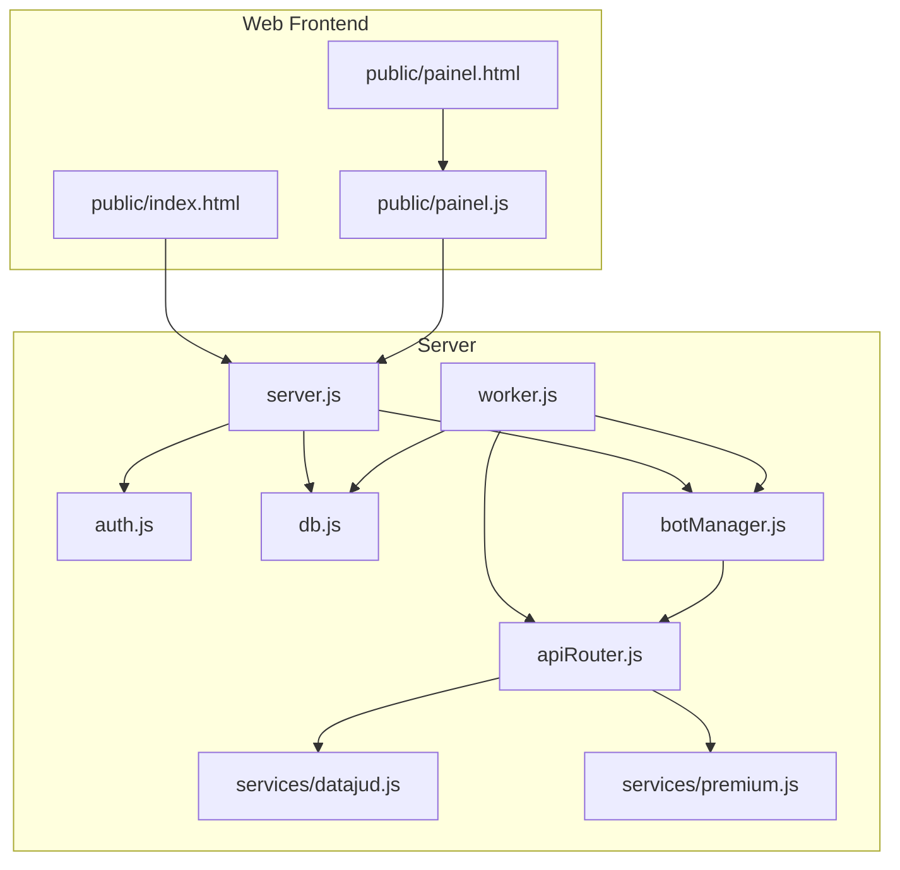
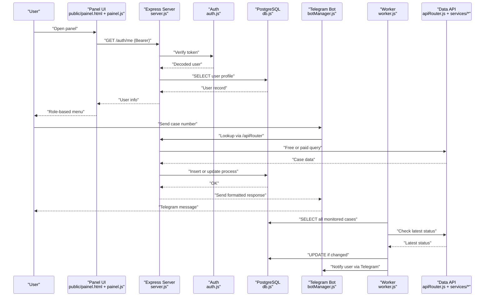
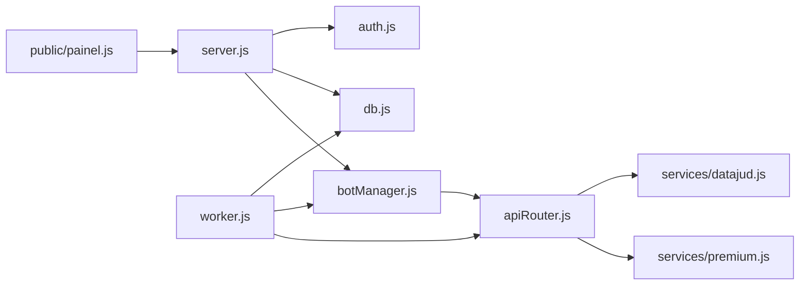
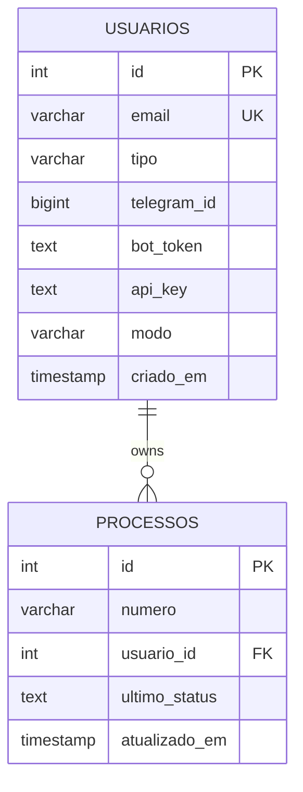

# Target Audience

<cite>
**Referenced Files in This Document**
- [README.md](file://README.md)
- [database.sql](file://database.sql)
- [server.js](file://server.js)
- [auth.js](file://auth.js)
- [botManager.js](file://botManager.js)
- [worker.js](file://worker.js)
- [apiRouter.js](file://apiRouter.js)
- [services/datajud.js](file://services/datajud.js)
- [services/premium.js](file://services/premium.js)
- [public/index.html](file://public/index.html)
- [public/painel.html](file://public/painel.html)
- [public/painel.js](file://public/painel.js)
- [db.js](file://db.js)
- [package.json](file://package.json)
</cite>

## Table of Contents
1. [Introduction](#introduction)
2. [Project Structure](#project-structure)
3. [Core Components](#core-components)
4. [Architecture Overview](#architecture-overview)
5. [Detailed Component Analysis](#detailed-component-analysis)
6. [Dependency Analysis](#dependency-analysis)
7. [Performance Considerations](#performance-considerations)
8. [Troubleshooting Guide](#troubleshooting-guide)
9. [Conclusion](#conclusion)
10. [Appendices](#appendices)

## Introduction
This document identifies and describes the Legal Process Monitoring System’s target audience. It focuses on primary users (lawyers, legal researchers, court staff, paralegals) who need real-time judicial process tracking, and secondary users (legal secretaries, compliance officers, legal tech enthusiasts). It outlines distinct user personas, their specific needs, use cases, skill expectations, and how the system addresses legal professionals’ unique monitoring challenges.

## Project Structure
The system is a SaaS platform with:
- A web administration panel for user and process management
- A Telegram bot for direct process lookup and notifications
- A background worker that periodically checks for updates and sends alerts
- An API layer that integrates free and paid data sources

**Diagram sources**
- [public/index.html:1-377](file://public/index.html#L1-L377)
- [public/painel.html:1-97](file://public/painel.html#L1-L97)
- [public/painel.js:1-158](file://public/painel.js#L1-L158)
- [server.js:1-162](file://server.js#L1-L162)
- [auth.js:1-59](file://auth.js#L1-L59)
- [db.js:1-11](file://db.js#L1-L11)
- [botManager.js:1-53](file://botManager.js#L1-L53)
- [worker.js:1-70](file://worker.js#L1-L70)
- [apiRouter.js:1-19](file://apiRouter.js#L1-L19)
- [services/datajud.js:1-32](file://services/datajud.js#L1-L32)
- [services/premium.js:1-12](file://services/premium.js#L1-L12)

**Section sources**
- [README.md:1-56](file://README.md#L1-L56)
- [package.json:1-21](file://package.json#L1-L21)

## Core Components
- Web administration panel: Provides role-based navigation, process lists, user management (admin), and user profile configuration.
- Telegram bot: Enables users to send case numbers and receive instant results; supports automated alerts for updates.
- Background worker: Periodically checks all monitored cases and notifies users via Telegram when updates occur.
- Authentication and authorization: JWT-based login, role-based access control (admin/client), and secure password hashing.
- Data sources: Free CNJ DataJud API with optional paid fallback for richer data.

These components collectively support real-time monitoring, alerting, and portfolio management for legal professionals.

**Section sources**
- [public/painel.html:1-97](file://public/painel.html#L1-L97)
- [public/painel.js:1-158](file://public/painel.js#L1-L158)
- [botManager.js:1-53](file://botManager.js#L1-L53)
- [worker.js:1-70](file://worker.js#L1-L70)
- [auth.js:1-59](file://auth.js#L1-L59)
- [apiRouter.js:1-19](file://apiRouter.js#L1-L19)

## Architecture Overview
The system separates concerns across frontend, backend, and external APIs. Users authenticate, manage their cases via the panel, and receive Telegram notifications when monitored cases change.

**Diagram sources**
- [public/painel.html:1-97](file://public/painel.html#L1-L97)
- [public/painel.js:1-158](file://public/painel.js#L1-L158)
- [server.js:1-162](file://server.js#L1-L162)
- [auth.js:1-59](file://auth.js#L1-L59)
- [db.js:1-11](file://db.js#L1-L11)
- [botManager.js:1-53](file://botManager.js#L1-L53)
- [worker.js:1-70](file://worker.js#L1-L70)
- [apiRouter.js:1-19](file://apiRouter.js#L1-L19)
- [services/datajud.js:1-32](file://services/datajud.js#L1-L32)
- [services/premium.js:1-12](file://services/premium.js#L1-L12)

## Detailed Component Analysis

### Primary Users: Lawyers, Legal Researchers, Court Staff, Paralegals
- Needs:
  - Real-time judicial process tracking
  - Instant alerts on status changes
  - Quick lookup via Telegram
  - Centralized dashboard for multiple cases
- Use cases:
  - Monitoring ongoing cases for status updates
  - Tracking deadlines and procedural milestones
  - Managing client portfolios with multiple cases
- Skill level expectations:
  - Basic computer literacy
  - Familiarity with Telegram and web forms
  - Minimal technical setup (register, configure Telegram, set mode)
- How the system helps:
  - Telegram bot for immediate case lookup
  - Automated alerts every five minutes
  - Dashboard for centralized visibility

**Section sources**
- [README.md:3-11](file://README.md#L3-L11)
- [public/index.html:300-332](file://public/index.html#L300-L332)
- [public/painel.html:32-46](file://public/painel.html#L32-L46)
- [botManager.js:13-39](file://botManager.js#L13-L39)
- [worker.js:49-59](file://worker.js#L49-L59)

### Secondary Users: Legal Secretaries, Compliance Officers, Legal Tech Enthusiasts
- Needs:
  - Administrative oversight of multiple users/cases
  - Bulk user provisioning and configuration
  - Mode selection (free, hybrid, paid) for cost control
  - Audit trail via timestamps and user records
- Use cases:
  - Onboarding clients and assigning Telegram bots
  - Monitoring team-wide case portfolios
  - Ensuring compliance with data access modes
- Skill level expectations:
  - Intermediate web interface usage
  - Understanding of role-based permissions
  - Basic familiarity with Telegram bot tokens and API keys
- How the system helps:
  - Admin menu for user and process listings
  - Role-based filtering and visibility
  - Mode configuration per user

**Section sources**
- [public/painel.html:19-31](file://public/painel.html#L19-L31)
- [public/painel.html:48-62](file://public/painel.html#L48-L62)
- [public/painel.js:13-22](file://public/painel.js#L13-L22)
- [server.js:112-122](file://server.js#L112-L122)
- [server.js:94-110](file://server.js#L94-L110)

### User Personas and Their Specific Needs

#### Individual Practitioner (Personal Process Tracking)
- Persona: Solo practitioner or associate handling a small to moderate number of cases
- Needs:
  - Personal dashboard with recent updates
  - Quick Telegram lookup for urgent matters
  - Cost-effective free tier option
- Use cases:
  - Daily check of key cases
  - Immediate alerts for critical procedural steps
- Skill level: Low to medium

**Section sources**
- [public/painel.html:26-31](file://public/painel.html#L26-L31)
- [public/painel.js:37-62](file://public/painel.js#L37-L62)
- [apiRouter.js:6-13](file://apiRouter.js#L6-L13)

#### Administrative User (Managing Multiple Clients)
- Persona: Legal secretary, compliance officer, or team lead
- Needs:
  - View and manage all client cases
  - Provision users and configure Telegram bots
  - Choose pricing modes per client
- Use cases:
  - Batch onboarding of clients
  - Oversight of team case portfolios
  - Billing and resource allocation via mode selection
- Skill level: Medium to high

**Section sources**
- [public/painel.html:19-31](file://public/painel.html#L19-L31)
- [public/painel.html:64-85](file://public/painel.html#L64-L85)
- [public/painel.js:110-146](file://public/painel.js#L110-L146)
- [server.js:70-92](file://server.js#L70-L92)

### Use Case Scenarios

#### Monitoring Ongoing Cases
- Scenario: A lawyer monitors a high-priority case daily via Telegram and receives alerts when status changes.
- Steps:
  - Register and configure Telegram bot
  - Send case number to bot
  - Receive instant result and automatic subscription
  - Wait for periodic alerts from worker
- Outcomes:
  - Reduced manual checking
  - Proactive awareness of procedural changes

**Section sources**
- [botManager.js:13-39](file://botManager.js#L13-L39)
- [worker.js:49-59](file://worker.js#L49-L59)

#### Tracking Deadlines
- Scenario: A legal secretary tracks deadlines across multiple cases for a compliance team.
- Steps:
  - Admin creates users for team members
  - Team members add cases via Telegram
  - Worker sends alerts on updates
  - Dashboard shows last updated timestamps
- Outcomes:
  - Improved deadline awareness
  - Centralized visibility for compliance

**Section sources**
- [public/painel.html:32-46](file://public/painel.html#L32-L46)
- [public/painel.js:37-62](file://public/painel.js#L37-L62)
- [worker.js:17-61](file://worker.js#L17-L61)

#### Managing Client Portfolios
- Scenario: A paralegal manages dozens of cases for multiple clients.
- Steps:
  - Admin adds clients and assigns Telegram bots
  - Clients add cases via Telegram
  - Worker updates statuses and notifies clients
  - Admin views consolidated lists and user modes
- Outcomes:
  - Efficient portfolio management
  - Transparent cost allocation via modes

**Section sources**
- [public/painel.html:48-62](file://public/painel.html#L48-L62)
- [public/painel.js:64-89](file://public/painel.js#L64-L89)
- [server.js:112-122](file://server.js#L112-L122)

### Skill Level Requirements and Technical Comfort
- Primary users:
  - Minimal setup: register, configure Telegram, select mode
  - Daily use: Telegram bot and dashboard
  - Comfort: low to medium
- Secondary users:
  - Admin tasks: user creation, bot configuration, mode selection
  - Dashboard navigation: process and user listings
  - Comfort: medium to high

**Section sources**
- [README.md:43-56](file://README.md#L43-L56)
- [public/painel.html:19-31](file://public/painel.html#L19-L31)
- [public/painel.js:110-146](file://public/painel.js#L110-L146)

### How the System Addresses Unique Challenges
- Challenge: Time-intensive manual monitoring
  - Solution: Automated polling and Telegram alerts
- Challenge: Multiple data sources and inconsistent formats
  - Solution: Unified API routing with free and paid fallback
- Challenge: Managing multiple clients and cases
  - Solution: Role-based dashboards and admin controls
- Challenge: Cost control and transparency
  - Solution: Mode selection per user

**Section sources**
- [worker.js:17-61](file://worker.js#L17-L61)
- [apiRouter.js:4-16](file://apiRouter.js#L4-L16)
- [public/painel.html:19-31](file://public/painel.html#L19-L31)
- [server.js:70-92](file://server.js#L70-L92)

## Dependency Analysis
The system relies on:
- Express for the REST API and static serving
- PostgreSQL for persistence
- Telegram Bot SDK for messaging
- Axios for external API calls
- JWT and bcrypt for auth and security

**Diagram sources**
- [server.js:1-162](file://server.js#L1-L162)
- [auth.js:1-59](file://auth.js#L1-L59)
- [db.js:1-11](file://db.js#L1-L11)
- [botManager.js:1-53](file://botManager.js#L1-L53)
- [worker.js:1-70](file://worker.js#L1-L70)
- [apiRouter.js:1-19](file://apiRouter.js#L1-L19)
- [services/datajud.js:1-32](file://services/datajud.js#L1-L32)
- [services/premium.js:1-12](file://services/premium.js#L1-L12)
- [public/painel.js:1-158](file://public/painel.js#L1-L158)

**Section sources**
- [package.json:11-19](file://package.json#L11-L19)

## Performance Considerations
- Polling interval: The worker checks for updates every five minutes, balancing responsiveness with resource usage.
- Caching: Bots and user records are cached to reduce repeated initialization and database queries.
- Data sources: Free API is prioritized; paid fallback is used only when configured and necessary.

**Section sources**
- [worker.js:63-67](file://worker.js#L63-L67)
- [worker.js:23-34](file://worker.js#L23-L34)
- [apiRouter.js:6-13](file://apiRouter.js#L6-L13)

## Troubleshooting Guide
- Authentication failures:
  - Missing or invalid token leads to unauthorized access errors.
  - Verify token presence and validity.
- Authorization failures:
  - Non-admin attempts to access admin endpoints receive forbidden responses.
- Database connectivity:
  - Ensure environment variables for PostgreSQL are configured correctly.
- Telegram bot configuration:
  - Confirm bot token and Telegram ID are set; missing credentials prevent notifications.
- API availability:
  - Free API may occasionally fail; paid mode requires a valid API key.

**Section sources**
- [auth.js:16-31](file://auth.js#L16-L31)
- [auth.js:33-39](file://auth.js#L33-L39)
- [db.js:4-10](file://db.js#L4-L10)
- [botManager.js:39-40](file://botManager.js#L39-L40)
- [apiRouter.js:11-13](file://apiRouter.js#L11-L13)

## Conclusion
The Legal Process Monitoring System targets legal professionals who need reliable, real-time judicial process tracking. It offers a streamlined experience for individual practitioners and robust administrative capabilities for teams and compliance officers. Through Telegram integration, automated alerts, and flexible pricing modes, it reduces manual overhead and improves case management outcomes.

## Appendices

### Database Schema Overview
- Users table stores credentials, roles, Telegram identifiers, API keys, and mode preferences.
- Processes table links cases to users and tracks last known status and timestamps.

**Diagram sources**
- [database.sql:5-24](file://database.sql#L5-L24)

**Section sources**
- [database.sql:5-24](file://database.sql#L5-L24)