# Bot Management System

<cite>
**Referenced Files in This Document**
- [botManager.js](file://botManager.js)
- [server.js](file://server.js)
- [db.js](file://db.js)
- [worker.js](file://worker.js)
- [apiRouter.js](file://apiRouter.js)
- [auth.js](file://auth.js)
- [database.sql](file://database.sql)
- [services/datajud.js](file://services/datajud.js)
- [services/premium.js](file://services/premium.js)
- [parser.js](file://parser.js)
- [public/app.js](file://public/app.js)
- [public/painel.js](file://public/painel.js)
- [package.json](file://package.json)
</cite>

## Update Summary
**Changes Made**
- Enhanced bot management interface with comprehensive CPF/CNPJ search instructions
- Added new emoji-based labeling system (🪪) for improved user experience
- Detailed examples for masked/unmasked number searches
- Updated message parsing logic to support CPF/CNPJ detection
- Enhanced help documentation with specific CPF/CNPJ usage examples

## Table of Contents
1. [Introduction](#introduction)
2. [Project Structure](#project-structure)
3. [Core Components](#core-components)
4. [Architecture Overview](#architecture-overview)
5. [Detailed Component Analysis](#detailed-component-analysis)
6. [Dependency Analysis](#dependency-analysis)
7. [Performance Considerations](#performance-considerations)
8. [Troubleshooting Guide](#troubleshooting-guide)
9. [Conclusion](#conclusion)

## Introduction
This document describes the Telegram bot management system responsible for initializing Telegram bots per user, managing bot instances, and handling notifications. It covers the dynamic creation of user-specific bots using unique bot tokens, the caching mechanism to prevent duplicate instances, and the process for loading existing bot configurations at startup. The system now includes enhanced support for CPF/CNPJ (Brazilian individual and corporate tax identification numbers) searches with emoji-based labeling and comprehensive usage instructions.

## Project Structure
The system is organized around a Node.js backend with PostgreSQL for persistence, Express for HTTP APIs, and two distinct runtime components:
- A primary server that handles user registration, authentication, and bot initialization on demand.
- A worker process that periodically checks for updates and sends Telegram notifications to users.

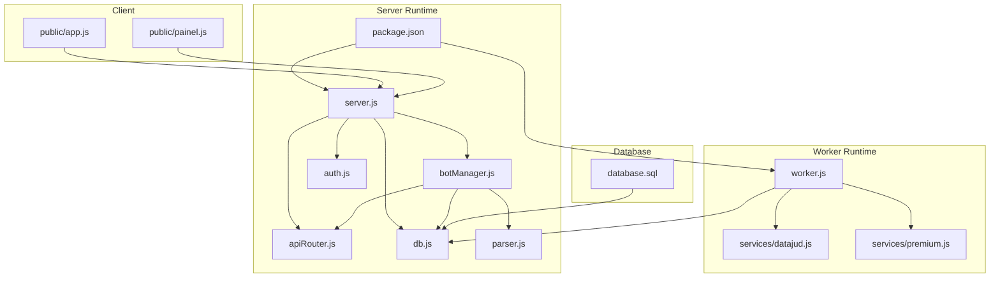

**Diagram sources**
- [server.js:1-162](file://server.js#L1-L162)
- [botManager.js:1-53](file://botManager.js#L1-L53)
- [apiRouter.js:1-19](file://apiRouter.js#L1-L19)
- [auth.js:1-59](file://auth.js#L1-L59)
- [db.js:1-11](file://db.js#L1-L11)
- [worker.js:1-70](file://worker.js#L1-L70)
- [services/datajud.js:1-32](file://services/datajud.js#L1-L32)
- [services/premium.js:1-12](file://services/premium.js#L1-L12)
- [database.sql:1-25](file://database.sql#L1-L25)
- [public/app.js:1-53](file://public/app.js#L1-L53)
- [public/painel.js:1-158](file://public/painel.js#L1-L158)
- [package.json:1-21](file://package.json#L1-L21)
- [parser.js:1-102](file://parser.js#L1-L102)

**Section sources**
- [server.js:1-162](file://server.js#L1-L162)
- [botManager.js:1-53](file://botManager.js#L1-L53)
- [worker.js:1-70](file://worker.js#L1-L70)
- [database.sql:1-25](file://database.sql#L1-L25)

## Core Components
- Bot Manager: Initializes Telegram bots per user, manages message handlers, prevents duplicate instances via a token-based cache, and supports CPF/CNPJ search functionality with emoji-based labeling.
- Server: Exposes REST endpoints for user registration, login, and bot startup, and loads existing bot configurations at startup.
- Worker: Periodically checks for process updates and sends Telegram notifications using cached bot instances.
- Database: Stores user profiles, bot tokens, Telegram IDs, monitored process records, and supports CPF/CNPJ data storage.
- Authentication: JWT-based authentication and middleware enforcement.
- Services: Integrations with external APIs for process lookup (free and premium tiers).
- Parser: Enhanced message parsing with CPF/CNPJ detection and formatting.

Key responsibilities:
- Dynamic bot creation per user with unique bot tokens.
- Instance caching to avoid duplicate TelegramBot instances.
- Loading existing bot configurations at server startup.
- Storing and retrieving bot tokens from the database.
- Handling bot startup errors and duplicate initialization.
- Managing memory by avoiding redundant bot instances.
- **Enhanced**: CPF/CNPJ search support with automatic detection and emoji-based labeling.
- **Enhanced**: Comprehensive help documentation with specific usage examples for all search types.

**Section sources**
- [botManager.js:1-53](file://botManager.js#L1-L53)
- [server.js:1-162](file://server.js#L1-L162)
- [worker.js:1-70](file://worker.js#L1-L70)
- [database.sql:1-25](file://database.sql#L1-L25)
- [auth.js:1-59](file://auth.js#L1-L59)
- [parser.js:1-102](file://parser.js#L1-L102)

## Architecture Overview
The system initializes Telegram bots when users register or when the server starts. Each bot is uniquely identified by its token and cached to prevent duplicate instances. The worker process periodically queries the database for monitored processes, consults external APIs for updates, and notifies users via Telegram messages using the cached bot instances. The enhanced system now includes comprehensive CPF/CNPJ search capabilities with automatic number detection and emoji-based labeling for improved user experience.

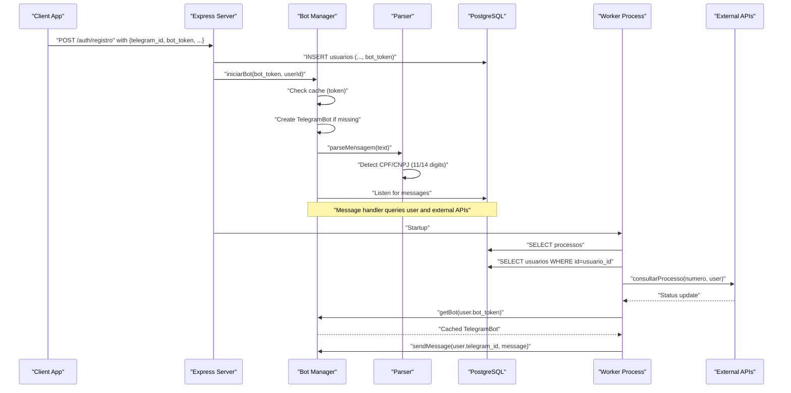

**Diagram sources**
- [server.js:11-36](file://server.js#L11-L36)
- [botManager.js:7-42](file://botManager.js#L7-L42)
- [parser.js:10-70](file://parser.js#L10-L70)
- [worker.js:17-67](file://worker.js#L17-L67)
- [apiRouter.js:4-16](file://apiRouter.js#L4-L16)
- [services/datajud.js:3-29](file://services/datajud.js#L3-L29)
- [services/premium.js:1-12](file://services/premium.js#L1-L12)

## Detailed Component Analysis

### Enhanced Bot Initialization and Caching
The bot initialization function creates a TelegramBot instance for a given token and sets up a message handler. It prevents duplicate initialization by checking a global cache keyed by token. The cache ensures only one TelegramBot instance per token exists during the server lifetime. The system now includes enhanced help commands with comprehensive CPF/CNPJ search instructions and emoji-based labeling.

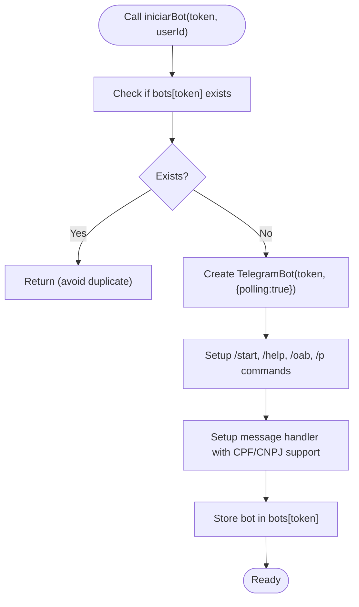

**Diagram sources**
- [botManager.js:7-42](file://botManager.js#L7-L42)

**Section sources**
- [botManager.js:5-42](file://botManager.js#L5-L42)

### Enhanced Message Handler and External API Integration
When a Telegram message arrives, the handler now includes enhanced support for CPF/CNPJ detection:
- Retrieves the user record by userId.
- Calls the enhanced parser to detect and format CPF/CNPJ numbers automatically.
- Calls the external API lookup function to fetch process details.
- Inserts or updates process records in the database.
- Sends a formatted message back to the user with emoji-based labeling.

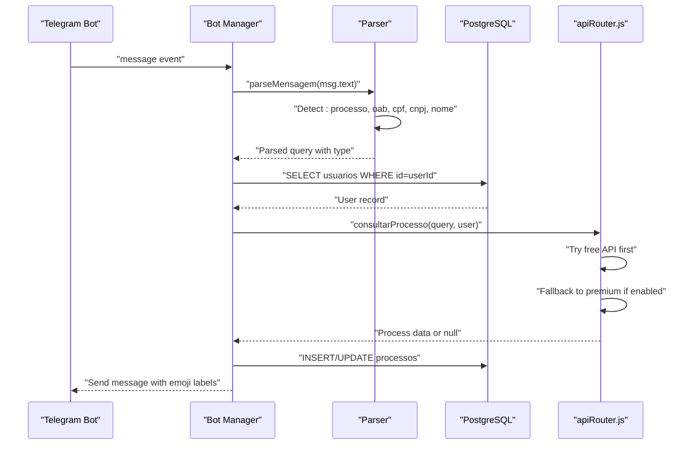

**Diagram sources**
- [botManager.js:13-39](file://botManager.js#L13-L39)
- [parser.js:10-70](file://parser.js#L10-L70)
- [apiRouter.js:4-16](file://apiRouter.js#L4-L16)
- [services/datajud.js:3-29](file://services/datajud.js#L3-L29)
- [services/premium.js:1-12](file://services/premium.js#L1-L12)

**Section sources**
- [botManager.js:13-39](file://botManager.js#L13-L39)
- [parser.js:10-70](file://parser.js#L10-L70)
- [apiRouter.js:4-16](file://apiRouter.js#L4-L16)

### Enhanced CPF/CNPJ Search Processing
The system now includes comprehensive support for CPF (11 digits) and CNPJ (14 digits) searches with automatic detection and emoji-based labeling:

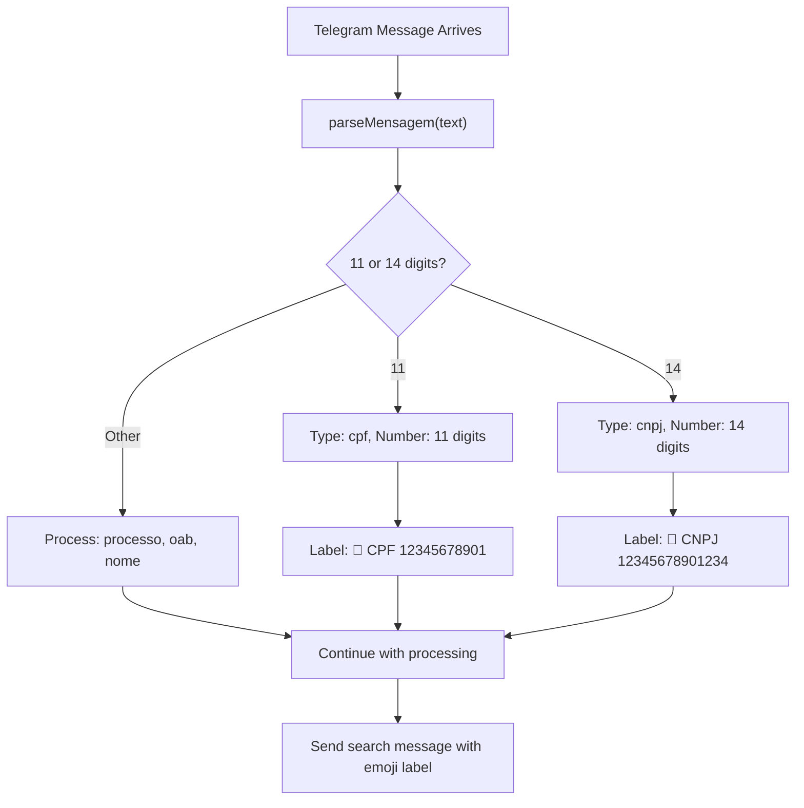

**Diagram sources**
- [parser.js:47-62](file://parser.js#L47-L62)
- [botManager.js:82-87](file://botManager.js#L82-L87)

**Section sources**
- [parser.js:47-62](file://parser.js#L47-L62)
- [botManager.js:82-87](file://botManager.js#L82-L87)

### Loading Existing Bot Configurations
On server startup, the system loads all users who have a bot token configured and initializes a bot for each. This ensures that previously registered users with tokens remain active after restart.

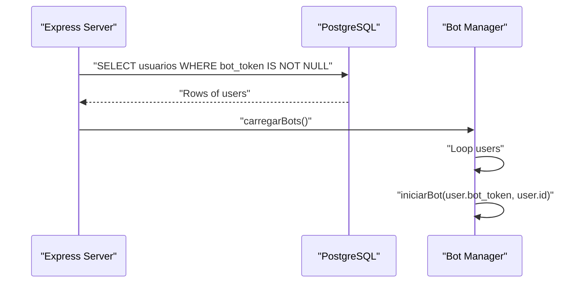

**Diagram sources**
- [server.js:137-140](file://server.js#L137-L140)
- [botManager.js:44-50](file://botManager.js#L44-L50)

**Section sources**
- [server.js:137-140](file://server.js#L137-L140)
- [botManager.js:44-50](file://botManager.js#L44-L50)

### Worker Notifications and Bot Instance Reuse
The worker process periodically:
- Queries all monitored processes.
- Groups by user to minimize repeated user lookups.
- Validates that the user has both a bot token and Telegram ID.
- Retrieves or creates a TelegramBot instance from a cache keyed by token.
- Compares last known status with the latest data and sends a notification if changed.

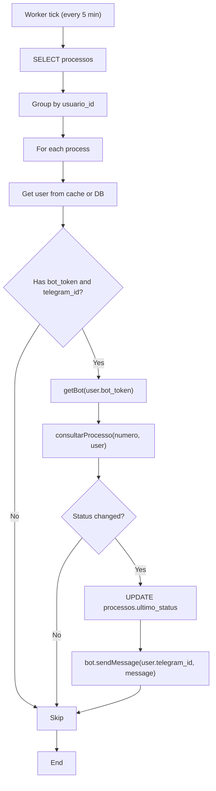

**Diagram sources**
- [worker.js:17-67](file://worker.js#L17-L67)
- [apiRouter.js:4-16](file://apiRouter.js#L4-L16)
- [services/datajud.js:3-29](file://services/datajud.js#L3-L29)
- [services/premium.js:1-12](file://services/premium.js#L1-L12)

**Section sources**
- [worker.js:17-67](file://worker.js#L17-L67)

### Database Schema and User-Bot Mapping
The database schema defines two primary tables:
- usuarios: stores user credentials, Telegram ID, bot token, API key, mode (gratis/premium), and timestamps.
- processos: stores monitored process numbers, links to users, last status, and timestamps.

Relationships:
- usuarios.id is a foreign key in processos.usuario_id.
- bot_token and telegram_id are required for notifications.

**Updated** The database schema remains unchanged, but the system now supports CPF/CNPJ data storage through the existing processos table structure.

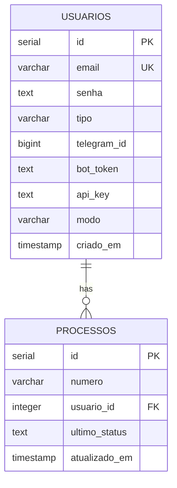

**Diagram sources**
- [database.sql:5-24](file://database.sql#L5-L24)

**Section sources**
- [database.sql:5-24](file://database.sql#L5-L24)

### Authentication and Authorization
The system uses JWT for authentication and enforces role-based access control:
- authMiddleware validates and decodes JWT tokens.
- adminMiddleware restricts administrative endpoints to users with tipo=admin.
- hashSenha and verificarSenha manage password hashing and verification.

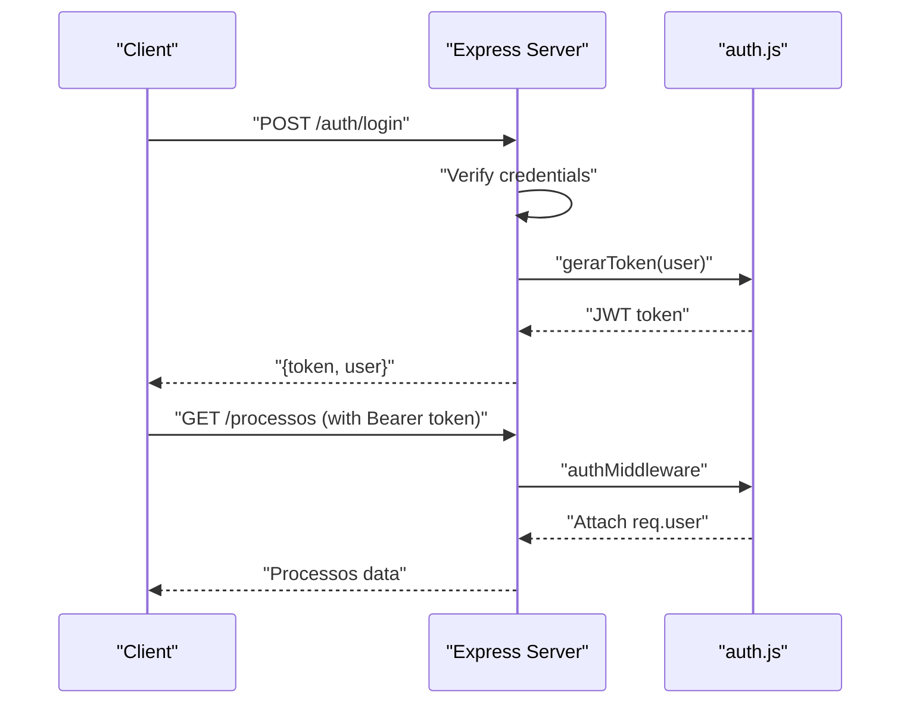

**Diagram sources**
- [server.js:39-68](file://server.js#L39-L68)
- [auth.js:8-31](file://auth.js#L8-L31)

**Section sources**
- [auth.js:8-31](file://auth.js#L8-L31)
- [server.js:39-68](file://server.js#L39-L68)

### Client-Side Integration
The client-side scripts demonstrate how users interact with the system:
- public/app.js handles user registration and process listing.
- public/painel.js manages navigation, user configuration, and administrative views.

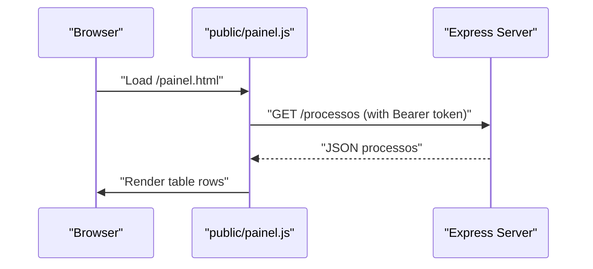

**Diagram sources**
- [public/painel.js:37-62](file://public/painel.js#L37-L62)
- [server.js:94-110](file://server.js#L94-L110)

**Section sources**
- [public/app.js:1-53](file://public/app.js#L1-L53)
- [public/painel.js:1-158](file://public/painel.js#L1-L158)
- [server.js:94-110](file://server.js#L94-L110)

## Dependency Analysis
The system relies on several key dependencies:
- node-telegram-bot-api: Telegram bot SDK for message handling and sending.
- pg: PostgreSQL client for database operations.
- express: Web framework for REST endpoints.
- jsonwebtoken and bcryptjs: JWT and password hashing.
- axios: HTTP client for external API calls.

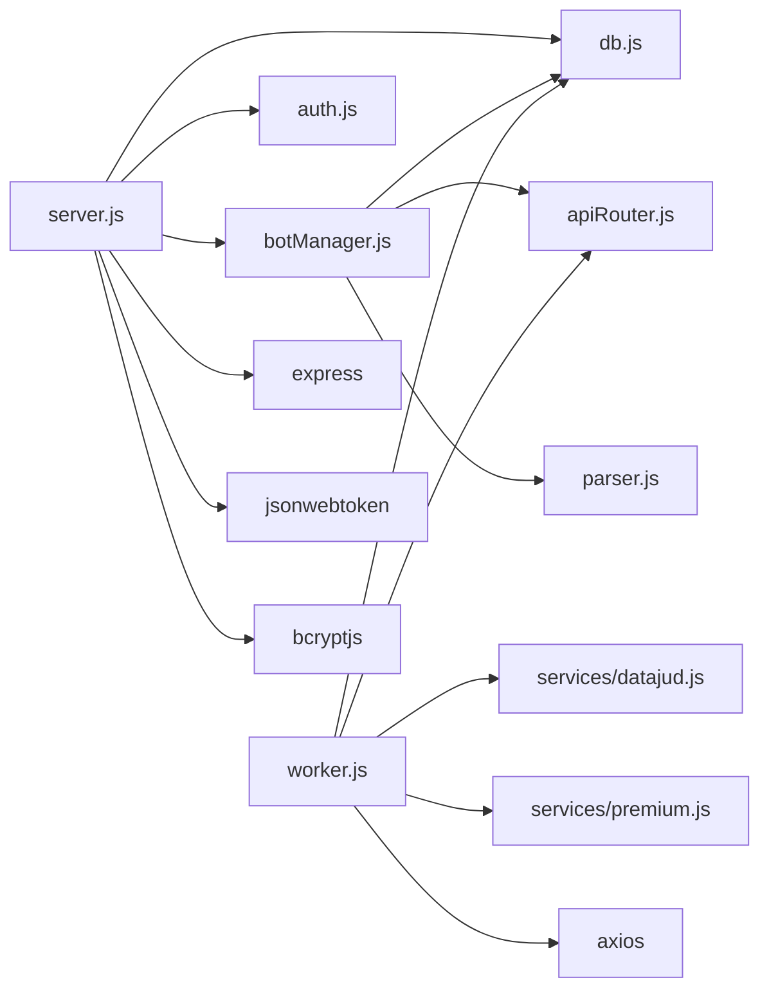

**Diagram sources**
- [server.js:1-162](file://server.js#L1-L162)
- [botManager.js:1-53](file://botManager.js#L1-L53)
- [worker.js:1-70](file://worker.js#L1-L70)
- [apiRouter.js:1-19](file://apiRouter.js#L1-L19)
- [services/datajud.js:1-32](file://services/datajud.js#L1-L32)
- [services/premium.js:1-12](file://services/premium.js#L1-L12)
- [auth.js:1-59](file://auth.js#L1-L59)
- [db.js:1-11](file://db.js#L1-L11)
- [package.json:11-19](file://package.json#L11-L19)
- [parser.js:1-102](file://parser.js#L1-L102)

**Section sources**
- [package.json:11-19](file://package.json#L11-L19)

## Performance Considerations
- Instance caching: Both the server and worker cache TelegramBot instances keyed by token to avoid redundant connections and reduce overhead.
- Query grouping: The worker groups monitored processes by user to minimize repeated user lookups and database queries.
- Polling vs webhook: The server uses polling for simplicity; consider switching to webhooks for lower latency and reduced CPU usage in production.
- Interval tuning: The worker runs every 5 minutes; adjust intervals based on workload and external API rate limits.
- Memory management: Avoid holding references to unused users or bots; rely on the token-keyed caches to keep memory bounded.
- **Enhanced**: CPF/CNPJ detection optimization: The parser efficiently detects 11-digit CPF and 14-digit CNPJ numbers without performance impact.

## Troubleshooting Guide
Common issues and resolutions:
- Duplicate bot initialization: The cache prevents duplicate instances. If a bot appears to be restarted, verify that the token is unique and not reused elsewhere.
- Token validation failures: Ensure bot_token is valid and associated with a Telegram bot. Confirm that the bot is active and has permissions to send messages.
- Missing Telegram ID: Notifications require telegram_id. Verify that users have set their Telegram ID in the usuarios table.
- Database connectivity: Confirm database connection parameters and that the usuarios and processos tables exist.
- External API timeouts: Free tier may have rate limits; consider enabling premium mode with a valid api_key for higher throughput.
- Authentication errors: Ensure JWT_SECRET is configured and tokens are provided in the Authorization header.
- **Enhanced**: CPF/CNPJ search issues: Ensure users send 11-digit numbers for CPF and 14-digit numbers for CNPJ. The system automatically formats masked/unmasked numbers.
- **Enhanced**: Emoji labeling problems: The system automatically adds 🪪 emoji for CPF/CNPJ searches. If labels appear incorrectly, check the parser logic for digit length detection.

**Section sources**
- [botManager.js:9](file://botManager.js#L9)
- [worker.js:40](file://worker.js#L40)
- [database.sql:5-24](file://database.sql#L5-L24)
- [auth.js:5](file://auth.js#L5)
- [parser.js:47-62](file://parser.js#L47-L62)

## Conclusion
The Telegram bot management system provides a robust foundation for user-specific bot initialization, caching, and notification delivery. The enhanced system now includes comprehensive CPF/CNPJ search capabilities with automatic detection, emoji-based labeling (🪪), and detailed usage instructions. By leveraging token-based caching, grouped database queries, and layered authentication, it scales efficiently while maintaining reliability. The separation of concerns between the server and worker enables asynchronous monitoring and timely user notifications. The addition of emoji-based labeling improves user experience by providing clear visual indicators for different search types. Proper configuration of tokens, Telegram IDs, and database credentials is essential for smooth operation, along with understanding the enhanced CPF/CNPJ search functionality.