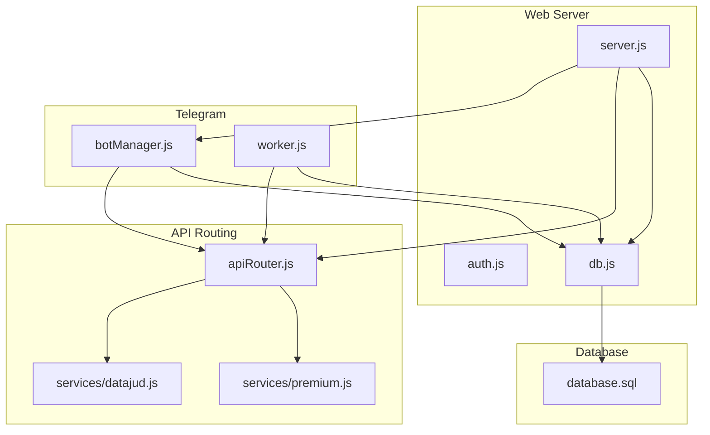
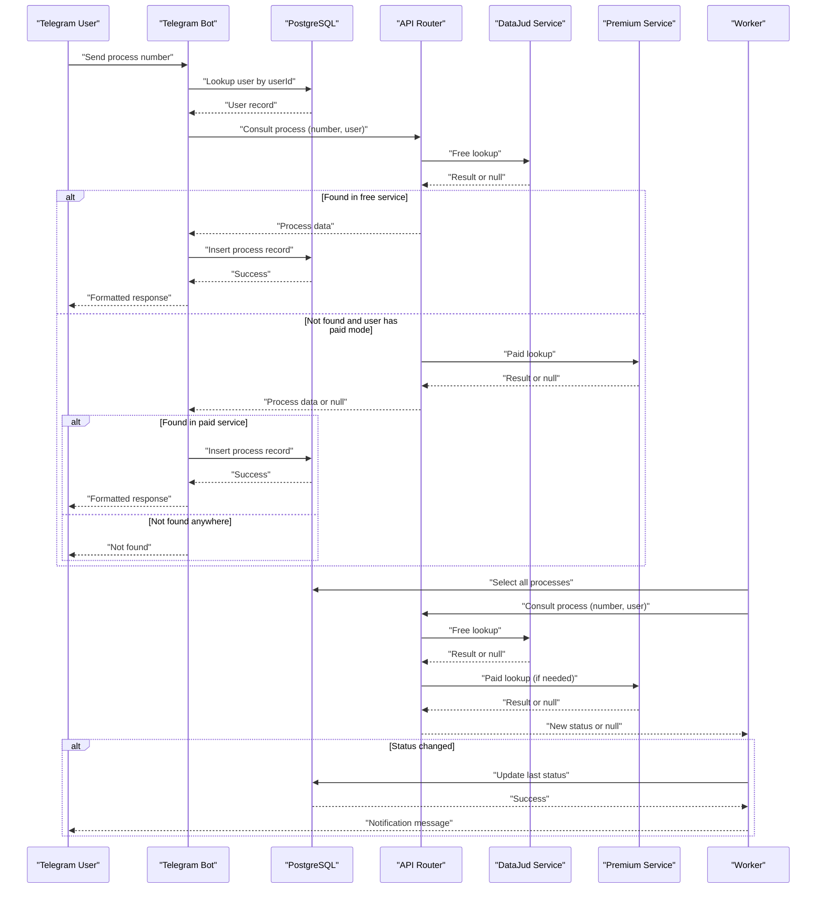
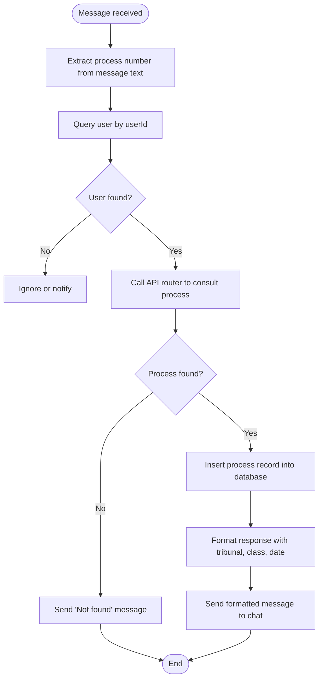
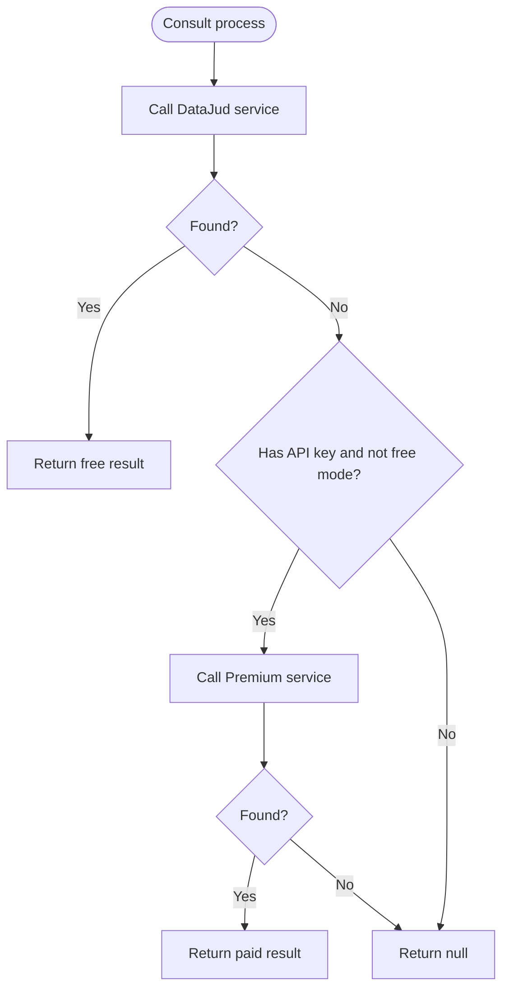
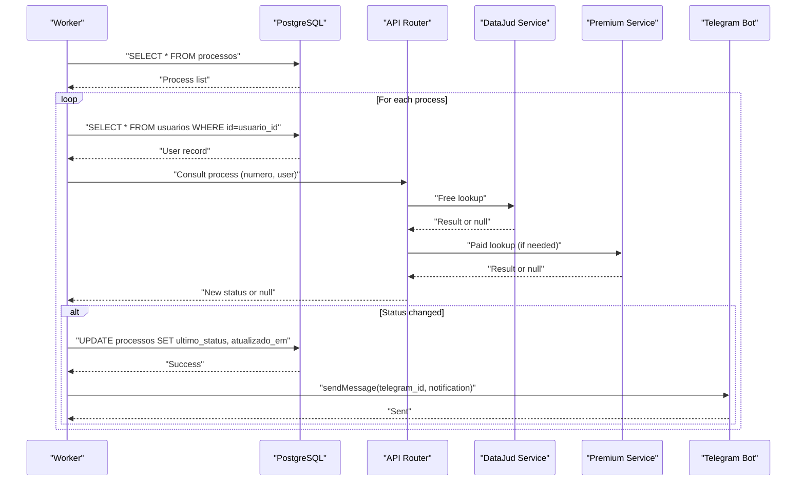
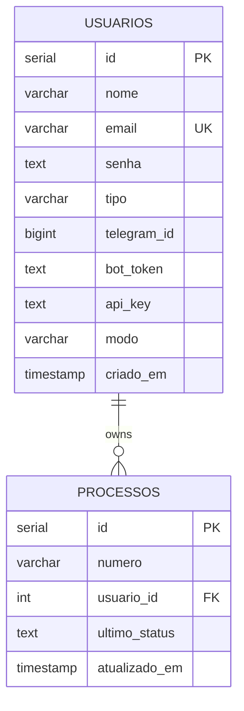
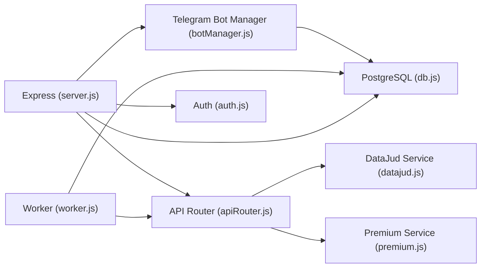

# Message Processing Workflow

<cite>
**Referenced Files in This Document**
- [server.js](file://server.js)
- [botManager.js](file://botManager.js)
- [apiRouter.js](file://apiRouter.js)
- [services/datajud.js](file://services/datajud.js)
- [services/premium.js](file://services/premium.js)
- [worker.js](file://worker.js)
- [db.js](file://db.js)
- [auth.js](file://auth.js)
- [database.sql](file://database.sql)
- [README.md](file://README.md)
- [package.json](file://package.json)
</cite>

## Table of Contents
1. [Introduction](#introduction)
2. [Project Structure](#project-structure)
3. [Core Components](#core-components)
4. [Architecture Overview](#architecture-overview)
5. [Detailed Component Analysis](#detailed-component-analysis)
6. [Dependency Analysis](#dependency-analysis)
7. [Performance Considerations](#performance-considerations)
8. [Troubleshooting Guide](#troubleshooting-guide)
9. [Conclusion](#conclusion)

## Introduction
This document explains the complete Telegram message processing workflow from message reception to response delivery. It covers how user input is captured, validated, processed, and transformed into actionable legal process consultations. The system integrates Telegram bots, a PostgreSQL database, and external legal databases (free and paid APIs). It documents the message event handler, message parsing logic, user context validation, API routing, response formatting, error handling, and database operations for storing process records.

## Project Structure
The project is organized around a Node.js backend with Express, PostgreSQL, and Telegram bot integration. Key areas:
- Web server and user management endpoints
- Telegram bot manager for message handling
- API router coordinating free and paid legal database integrations
- Worker for periodic monitoring and notifications
- Database connection and schema
- Authentication middleware and utilities
- Service modules for external legal database integrations

**Diagram sources**
- [server.js:1-162](file://server.js#L1-L162)
- [botManager.js:1-53](file://botManager.js#L1-L53)
- [apiRouter.js:1-19](file://apiRouter.js#L1-L19)
- [services/datajud.js:1-32](file://services/datajud.js#L1-L32)
- [services/premium.js:1-12](file://services/premium.js#L1-L12)
- [worker.js:1-70](file://worker.js#L1-L70)
- [db.js:1-11](file://db.js#L1-L11)
- [database.sql:1-25](file://database.sql#L1-L25)

**Section sources**
- [README.md:1-56](file://README.md#L1-L56)
- [package.json:1-21](file://package.json#L1-L21)

## Core Components
- Telegram bot message handler: Receives Telegram messages, validates user context, and triggers legal process lookup.
- API router: Orchestrates free and paid legal database queries with fallback logic.
- Free legal database service: Queries DataJud (CNJ) for public judicial process information.
- Paid legal database service: Placeholder for premium legal database integration.
- Worker: Periodically checks for process updates and notifies users via Telegram.
- Database: Stores users, process records, and maintains last known status for monitoring.
- Authentication: JWT-based authentication for protected routes and admin controls.

**Section sources**
- [botManager.js:7-42](file://botManager.js#L7-L42)
- [apiRouter.js:4-16](file://apiRouter.js#L4-L16)
- [services/datajud.js:3-29](file://services/datajud.js#L3-L29)
- [services/premium.js:1-12](file://services/premium.js#L1-L12)
- [worker.js:17-61](file://worker.js#L17-L61)
- [db.js:4-10](file://db.js#L4-L10)
- [auth.js:8-31](file://auth.js#L8-L31)

## Architecture Overview
The message processing workflow spans multiple components:
- Telegram message arrives at a bot instance
- The bot validates the user context from the database
- The API router attempts a free legal database lookup
- If unsuccessful and user has paid mode enabled, it falls back to the paid service
- On success, the system stores the process record and sends a formatted response
- The worker periodically checks for updates and notifies users

**Diagram sources**
- [botManager.js:13-39](file://botManager.js#L13-L39)
- [apiRouter.js:4-16](file://apiRouter.js#L4-L16)
- [services/datajud.js:3-29](file://services/datajud.js#L3-L29)
- [services/premium.js:1-12](file://services/premium.js#L1-L12)
- [worker.js:20-61](file://worker.js#L20-L61)

## Detailed Component Analysis

### Telegram Message Handler
The bot listens for Telegram messages and processes them as follows:
- Extracts the message text as the process number
- Retrieves the user record from the database using the provided userId
- Calls the API router to consult the legal database
- Handles not-found responses and inserts process records on success
- Sends a formatted response to the Telegram chat

**Diagram sources**
- [botManager.js:13-39](file://botManager.js#L13-L39)

**Section sources**
- [botManager.js:7-42](file://botManager.js#L7-L42)

### API Router and Legal Database Integration
The API router coordinates free and paid legal database lookups:
- First attempts a free lookup via DataJud
- If not found and the user has a valid API key and is not in free mode, attempts a paid lookup
- Returns null if no data is found

**Diagram sources**
- [apiRouter.js:4-16](file://apiRouter.js#L4-L16)
- [services/datajud.js:3-29](file://services/datajud.js#L3-L29)
- [services/premium.js:1-12](file://services/premium.js#L1-L12)

**Section sources**
- [apiRouter.js:4-16](file://apiRouter.js#L4-L16)

### Free Legal Database Service (DataJud)
The free service queries the CNJ DataJud API:
- Sends a match query for the process number
- Parses the first hit to extract tribunal, class, and last update timestamp
- Returns null on any failure or empty results

**Section sources**
- [services/datajud.js:3-29](file://services/datajud.js#L3-L29)

### Paid Legal Database Service (Premium)
The paid service is a placeholder that returns a standardized result with a premium tribunal label and current timestamp. In a production environment, this would integrate with a real legal database provider.

**Section sources**
- [services/premium.js:1-12](file://services/premium.js#L1-L12)

### Worker Monitoring and Notifications
The worker performs periodic checks for process updates:
- Selects all processes from the database
- Groups by user to minimize repeated queries
- Retrieves user data and ensures bot token and Telegram ID are present
- Uses cached bot instances to avoid recreating connections
- Calls the API router to check for updates
- If the status changed, updates the database and sends a notification message to the user

**Diagram sources**
- [worker.js:17-61](file://worker.js#L17-L61)
- [apiRouter.js:4-16](file://apiRouter.js#L4-L16)
- [services/datajud.js:3-29](file://services/datajud.js#L3-L29)
- [services/premium.js:1-12](file://services/premium.js#L1-L12)

**Section sources**
- [worker.js:17-61](file://worker.js#L17-L61)

### Database Schema and Operations
The database stores users and process records:
- Users table includes Telegram ID, bot token, API key, and mode (free/paid/hybrid)
- Processes table links to users and tracks the last known status and timestamps
- The bot inserts process records on successful lookups
- The worker updates last status and timestamps on changes

**Diagram sources**
- [database.sql:5-24](file://database.sql#L5-L24)

**Section sources**
- [database.sql:5-24](file://database.sql#L5-L24)
- [botManager.js:31-34](file://botManager.js#L31-L34)
- [worker.js:51-54](file://worker.js#L51-L54)

### Authentication and Authorization
Authentication is handled via JWT tokens:
- Registration hashes passwords and creates user records
- Login verifies credentials and issues JWT tokens
- Protected routes use middleware to validate tokens and enforce admin privileges
- The bot uses stored user IDs to validate context

**Section sources**
- [server.js:12-36](file://server.js#L12-L36)
- [server.js:39-68](file://server.js#L39-L68)
- [auth.js:8-31](file://auth.js#L8-L31)

## Dependency Analysis
Key dependencies and their roles:
- Express: Web server framework for user management and admin endpoints
- node-telegram-bot-api: Telegram bot client for message handling and notifications
- axios: HTTP client for external legal database requests
- pg: PostgreSQL client for database operations
- jsonwebtoken: JWT token generation and verification
- bcryptjs: Password hashing and verification

**Diagram sources**
- [server.js:1-162](file://server.js#L1-L162)
- [botManager.js:1-53](file://botManager.js#L1-L53)
- [apiRouter.js:1-19](file://apiRouter.js#L1-L19)
- [services/datajud.js:1-32](file://services/datajud.js#L1-L32)
- [services/premium.js:1-12](file://services/premium.js#L1-L12)
- [worker.js:1-70](file://worker.js#L1-70)
- [db.js:1-11](file://db.js#L1-L11)
- [auth.js:1-59](file://auth.js#L1-L59)

**Section sources**
- [package.json:11-19](file://package.json#L11-L19)

## Performance Considerations
- Bot instance caching: The worker caches Telegram bot instances by token to avoid recreating clients.
- Query deduplication: The worker groups processes by user to reduce repeated user queries.
- Polling intervals: The worker runs every five minutes; adjust interval based on latency requirements and rate limits.
- Database indexing: Consider adding indexes on frequently queried columns (e.g., process number, user ID) to improve lookup performance.
- External API rate limits: Respect external legal database rate limits and implement retries with exponential backoff.

[No sources needed since this section provides general guidance]

## Troubleshooting Guide
Common issues and debugging techniques:
- Telegram bot not responding:
  - Verify bot token and webhook/polling configuration
  - Check that the bot is loaded at startup and that user records include bot tokens
- User not found or unauthorized:
  - Confirm user ID resolution and that the database contains the correct user record
  - Ensure authentication middleware is applied to protected routes
- Process not found:
  - Validate the process number format and correctness
  - Check free service availability and paid mode configuration
  - Review API router fallback logic and user mode settings
- Database errors:
  - Confirm connection parameters and that the database is initialized with the schema
  - Check for unique constraint violations during registration
- Worker not sending notifications:
  - Ensure Telegram ID is set for the user
  - Verify bot token and that the worker has access to user records
  - Check that the last status differs from the newly fetched status

**Section sources**
- [botManager.js:17-22](file://botManager.js#L17-L22)
- [apiRouter.js:11-13](file://apiRouter.js#L11-L13)
- [worker.js:39-43](file://worker.js#L39-L43)
- [db.js:4-10](file://db.js#L4-L10)

## Conclusion
The Telegram message processing workflow integrates Telegram bots, a PostgreSQL database, and external legal databases to provide users with process lookup and monitoring capabilities. The system handles message reception, user validation, free and paid legal database queries, response formatting, and periodic notifications. By following the documented architecture and troubleshooting steps, administrators can deploy and maintain a reliable process monitoring solution.