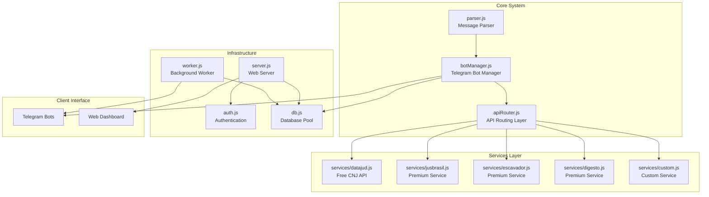
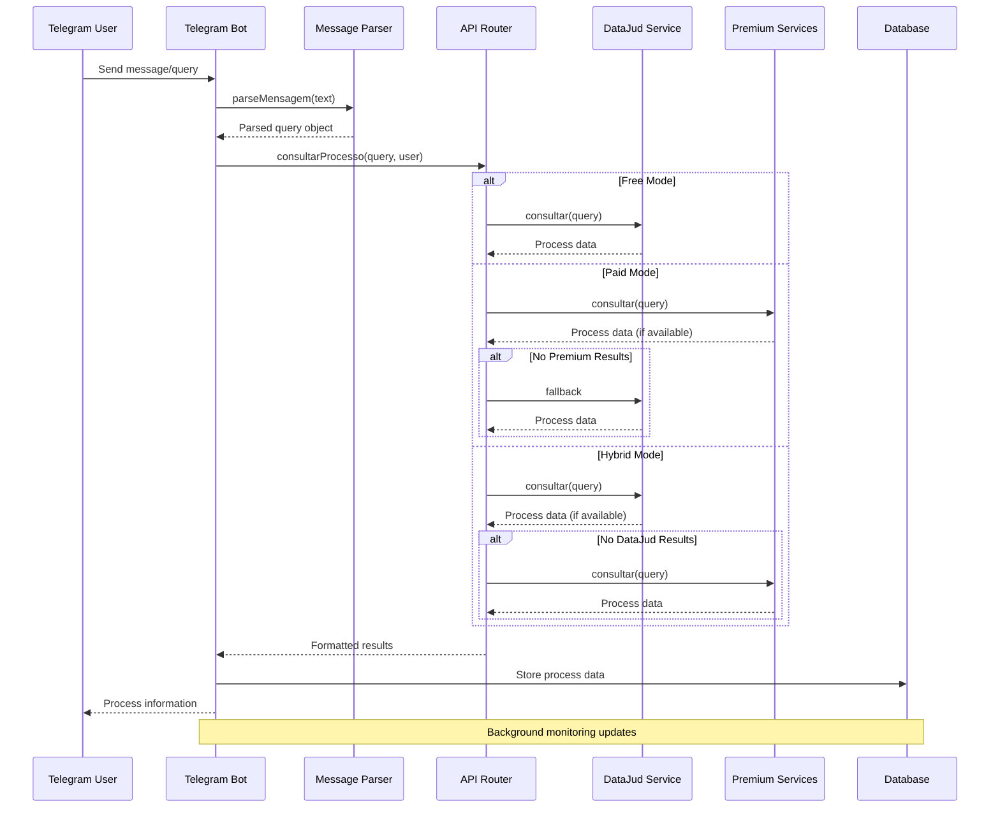
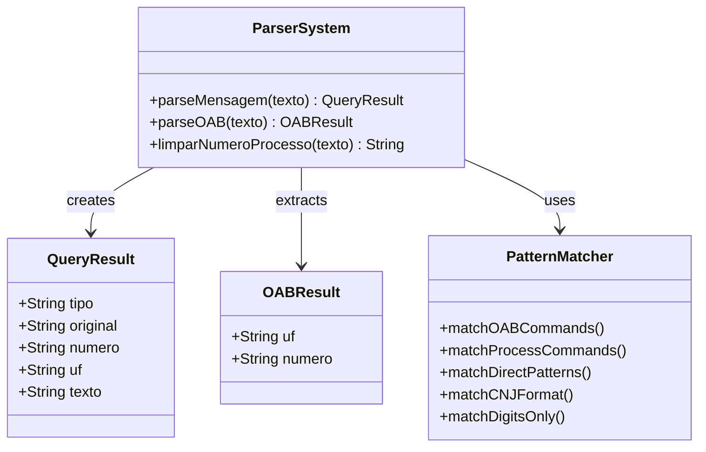
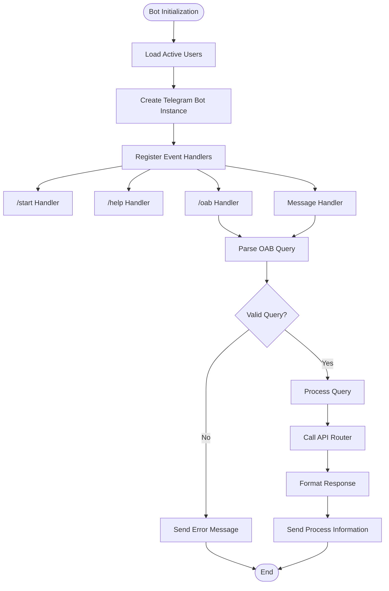
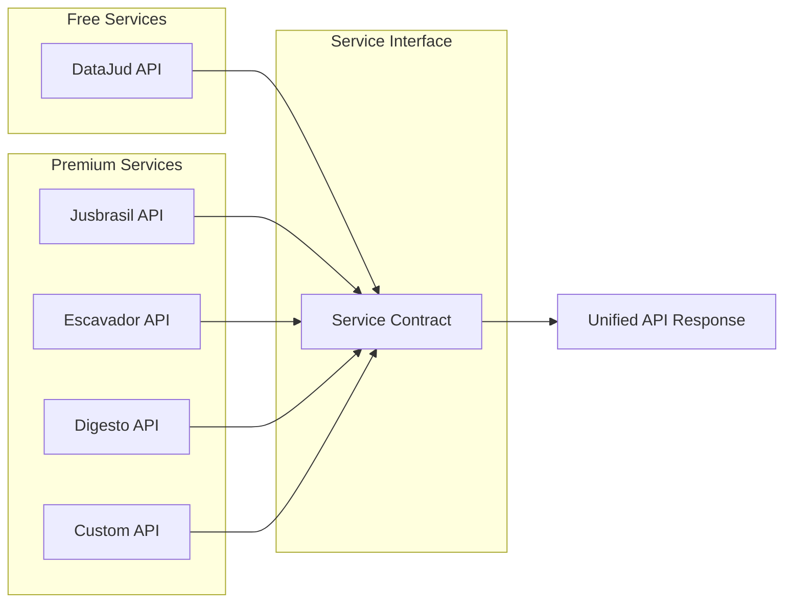
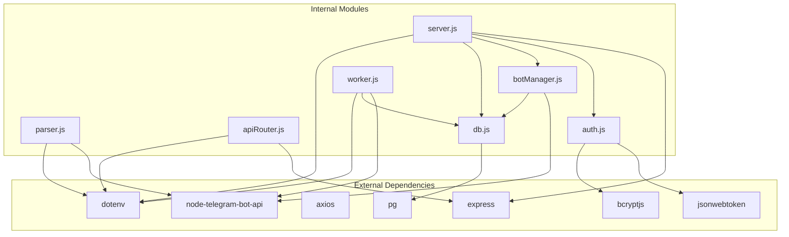

# Parser System

<cite>
**Referenced Files in This Document**
- [parser.js](file://parser.js)
- [botManager.js](file://botManager.js)
- [apiRouter.js](file://apiRouter.js)
- [services/datajud.js](file://services/datajud.js)
- [server.js](file://server.js)
- [worker.js](file://worker.js)
- [auth.js](file://auth.js)
- [db.js](file://db.js)
- [package.json](file://package.json)
- [README.md](file://README.md)
</cite>

## Table of Contents
1. [Introduction](#introduction)
2. [Project Structure](#project-structure)
3. [Core Components](#core-components)
4. [Architecture Overview](#architecture-overview)
5. [Detailed Component Analysis](#detailed-component-analysis)
6. [Dependency Analysis](#dependency-analysis)
7. [Performance Considerations](#performance-considerations)
8. [Troubleshooting Guide](#troubleshooting-guide)
9. [Conclusion](#conclusion)

## Introduction
The Parser System is a core component of the Judicial Process Monitoring SaaS platform that handles natural language processing and query extraction from Telegram messages. It serves as the primary interface between user input and the judicial data retrieval system, enabling users to search for legal processes through various query formats including CNJ process numbers, OAB lawyer registrations, and party names.

The system operates within a multi-user Telegram bot ecosystem that provides judicial process monitoring capabilities with support for both free and premium API services. Users can interact with the system through Telegram commands and natural language queries, while administrators can manage users and monitor system performance through a web dashboard.

## Project Structure
The project follows a modular architecture with clear separation of concerns across different functional areas:

**Diagram sources**
- [parser.js:1-95](file://parser.js#L1-L95)
- [botManager.js:1-169](file://botManager.js#L1-L169)
- [apiRouter.js:1-73](file://apiRouter.js#L1-L73)
- [services/datajud.js:1-265](file://services/datajud.js#L1-L265)
- [server.js:1-326](file://server.js#L1-L326)
- [worker.js:1-74](file://worker.js#L1-L74)

**Section sources**
- [README.md:1-56](file://README.md#L1-L56)
- [package.json:1-21](file://package.json#L1-L21)

## Core Components

### Parser Module
The Parser module serves as the central intelligence for extracting meaningful queries from user messages. It implements sophisticated pattern matching to handle multiple input formats while maintaining backward compatibility.

**Primary Functions:**
- **parseMensagem()**: Main parsing function that analyzes user input and determines query type
- **parseOAB()**: Specialized parser for OAB (Brazilian Bar Association) registration numbers
- **limparNumeroProcesso()**: Process number normalization and formatting

**Supported Query Types:**
1. **Processo CNJ**: Validates and formats Brazilian court process numbers
2. **OAB Registration**: Extracts state and lawyer registration numbers
3. **Name Search**: Handles free-text searches for parties or lawyers
4. **Command Processing**: Supports Telegram command syntax (/processo, /oab)

**Section sources**
- [parser.js:10-63](file://parser.js#L10-L63)
- [parser.js:66-77](file://parser.js#L66-L77)
- [parser.js:80-92](file://parser.js#L80-L92)

### Telegram Bot Integration
The bot system provides a conversational interface for users to interact with the judicial monitoring system. It handles multiple interaction patterns including command-based queries and natural language processing.

**Key Features:**
- **Command Recognition**: Supports /start, /help, /oab, and /processo commands
- **Message Processing**: Real-time parsing of user messages
- **Response Formatting**: Structured Markdown responses with process information
- **Error Handling**: Graceful handling of malformed queries

**Section sources**
- [botManager.js:8-89](file://botManager.js#L8-L89)
- [botManager.js:91-146](file://botManager.js#L91-L146)

### API Routing System
The API routing layer manages the selection and execution of appropriate data sources based on user preferences and availability.

**Strategic Modes:**
1. **Grátis (Free)**: Uses DataJud API exclusively
2. **Pago (Paid)**: Uses premium services first, falls back to DataJud
3. **Híbrido (Hybrid)**: Tries DataJud first, then premium services

**Section sources**
- [apiRouter.js:14-55](file://apiRouter.js#L14-L55)
- [apiRouter.js:57-70](file://apiRouter.js#L57-L70)

## Architecture Overview

**Diagram sources**
- [botManager.js:91-146](file://botManager.js#L91-L146)
- [apiRouter.js:14-55](file://apiRouter.js#L14-L55)
- [services/datajud.js:226-238](file://services/datajud.js#L226-L238)

The system architecture demonstrates a clear separation between user interaction, query processing, and data retrieval layers. The parser acts as the gateway for all user input, while the API router coordinates between free and premium services based on user configuration.

## Detailed Component Analysis

### Parser Implementation Analysis

**Diagram sources**
- [parser.js:10-63](file://parser.js#L10-L63)
- [parser.js:66-77](file://parser.js#L66-L77)
- [parser.js:80-92](file://parser.js#L80-L92)

The parser implements a sophisticated multi-stage matching algorithm that prioritizes different query patterns:

1. **Command Detection**: Identifies Telegram command syntax (/oab, /processo)
2. **Direct Pattern Matching**: Handles OAB formats (UF + number) and CNJ numbers
3. **Fallback Processing**: Processes numeric-only inputs and free-text queries

**Section sources**
- [parser.js:15-62](file://parser.js#L15-L62)

### Telegram Bot Management

**Diagram sources**
- [botManager.js:8-89](file://botManager.js#L8-L89)
- [botManager.js:91-146](file://botManager.js#L91-L146)

The bot management system provides comprehensive Telegram integration with sophisticated error handling and user experience features.

**Section sources**
- [botManager.js:14-48](file://botManager.js#L14-L48)
- [botManager.js:65-86](file://botManager.js#L65-L86)

### API Service Integration

**Diagram sources**
- [services/datajud.js:260-265](file://services/datajud.js#L260-L265)
- [services/jusbrasil.js:34-39](file://services/jusbrasil.js#L34-L39)
- [apiRouter.js:6-11](file://apiRouter.js#L6-L11)

The service architecture provides a unified interface for multiple judicial data sources while maintaining individual service configurations and error handling.

**Section sources**
- [apiRouter.js:1-73](file://apiRouter.js#L1-L73)
- [services/datajud.js:1-265](file://services/datajud.js#L1-L265)

## Dependency Analysis

**Diagram sources**
- [package.json:11-19](file://package.json#L11-L19)
- [parser.js:1-2](file://parser.js#L1-L2)
- [botManager.js:1-4](file://botManager.js#L1-L4)
- [apiRouter.js:1](file://apiRouter.js#L1)

The dependency graph reveals a well-structured system with clear boundaries between external libraries and internal modules. The design promotes maintainability and allows for easy replacement of individual components.

**Section sources**
- [package.json:1-21](file://package.json#L1-L21)

## Performance Considerations

### Rate Limiting and Throttling
The system implements comprehensive rate limiting mechanisms to prevent API abuse and ensure reliable service delivery:

- **DataJud Rate Limiting**: 400ms delay between requests to respect API limits
- **Telegram Flood Protection**: 300ms delays between message sends for large result sets
- **Background Worker Interval**: 5-minute polling cycle for process updates

### Memory Management
The worker system employs caching strategies to minimize database queries and improve response times:

- **Bot Instance Caching**: Prevents recreation of Telegram bot instances
- **User Data Caching**: Reduces repeated database queries for user information
- **Connection Pooling**: Efficient database connection management

### Error Recovery
The system implements robust error handling with exponential backoff for transient failures:

- **Retry Mechanisms**: Automatic retry for 429 and 5xx errors up to 3 attempts
- **Graceful Degradation**: Fallback to alternative services when primary fails
- **Timeout Handling**: 20-second timeouts for API requests

## Troubleshooting Guide

### Common Issues and Solutions

**Parser Not Recognizing Queries**
- Verify query format matches supported patterns
- Check for proper spacing in OAB format (UF NUMBER)
- Ensure CNJ numbers follow the correct 20-digit format

**Telegram Bot Not Responding**
- Confirm bot token is valid and active
- Verify webhook or polling configuration
- Check Telegram API connectivity

**API Service Failures**
- Verify API keys are properly configured
- Check service availability and rate limits
- Review error logs for specific failure reasons

**Database Connection Problems**
- Verify PostgreSQL credentials and connection string
- Check database availability and network connectivity
- Review connection pool configuration

**Section sources**
- [botManager.js:142-145](file://botManager.js#L142-L145)
- [services/datajud.js:81-99](file://services/datajud.js#L81-L99)

### Debugging Strategies

**Enable Debug Logging**
- Set NODE_ENV to development for detailed logging
- Monitor console output for error messages and warnings
- Use structured logging for API request/response debugging

**Query Validation**
- Test parser functions independently with various input formats
- Validate database schema and relationships
- Monitor service health and response times

**Performance Monitoring**
- Track API response times and error rates
- Monitor memory usage and connection pool utilization
- Analyze worker performance and update frequency

## Conclusion

The Parser System represents a sophisticated solution for judicial process monitoring that successfully bridges the gap between user-friendly interfaces and complex legal data systems. The modular architecture ensures maintainability while providing flexibility for future enhancements and service integrations.

Key strengths of the system include:

- **Robust Parsing Engine**: Sophisticated pattern matching handles diverse query formats
- **Flexible Service Architecture**: Supports multiple data sources with intelligent fallback
- **Scalable Infrastructure**: Well-designed for multi-user environments with background processing
- **Comprehensive Error Handling**: Resilient design with graceful degradation
- **Security Considerations**: Proper authentication, authorization, and data protection

The system provides a solid foundation for judicial process monitoring with clear extension points for additional services and enhanced functionality. Its modular design facilitates future development while maintaining reliability and performance standards.