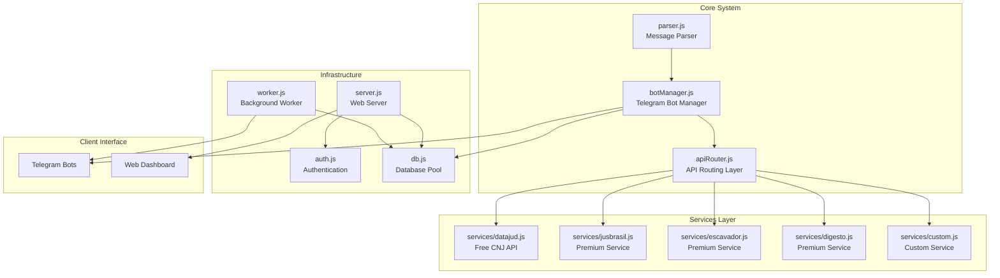
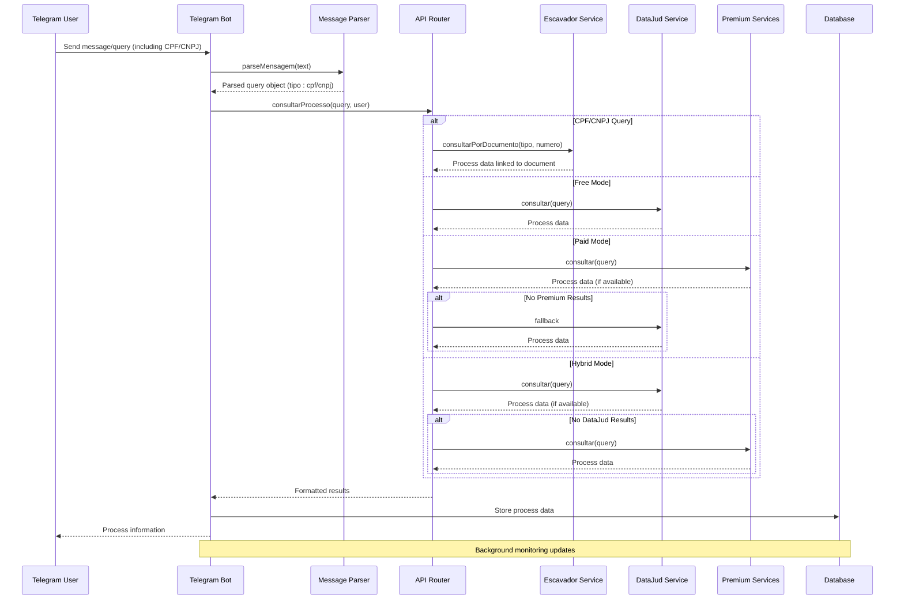
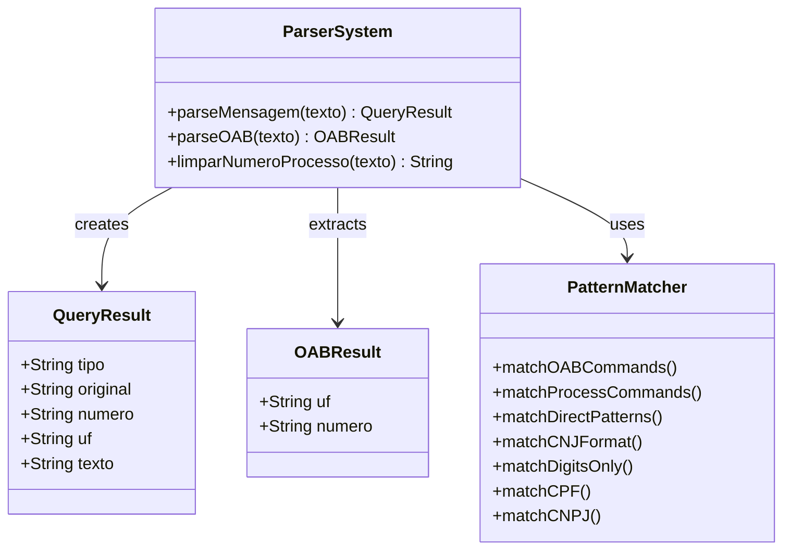
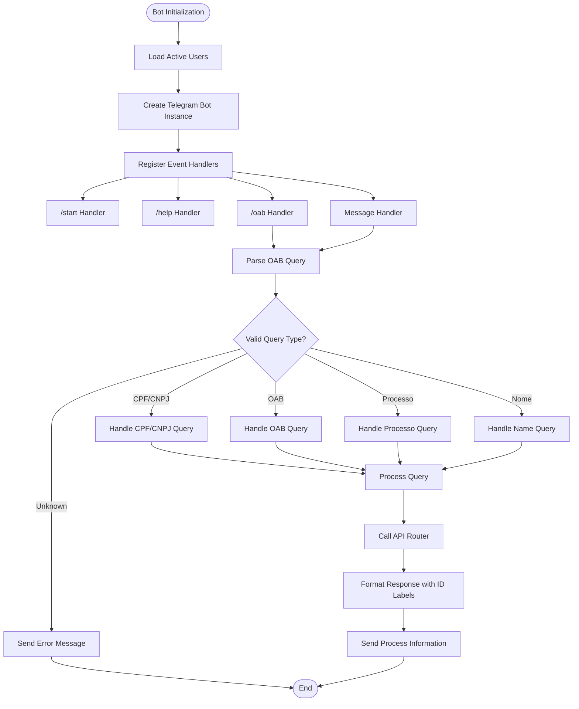
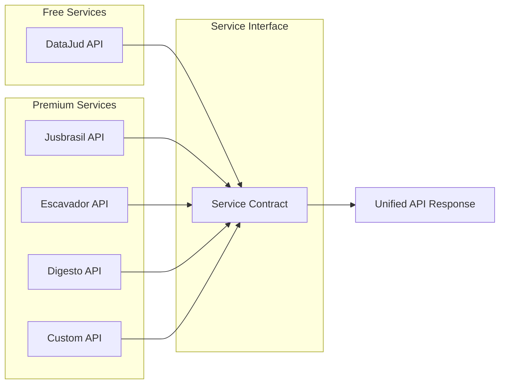
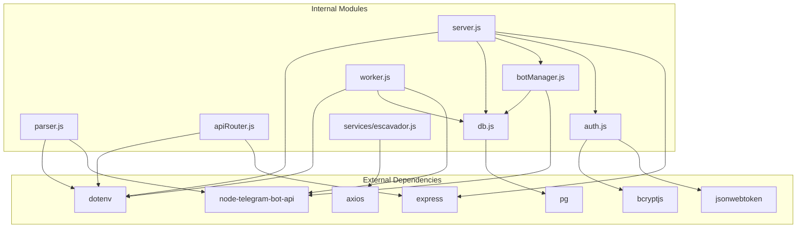

# Parser System

<cite>
**Referenced Files in This Document**
- [parser.js](file://parser.js)
- [botManager.js](file://botManager.js)
- [apiRouter.js](file://apiRouter.js)
- [services/datajud.js](file://services/datajud.js)
- [services/escavador.js](file://services/escavador.js)
- [server.js](file://server.js)
- [worker.js](file://worker.js)
- [auth.js](file://auth.js)
- [db.js](file://db.js)
- [package.json](file://package.json)
- [README.md](file://README.md)
</cite>

## Update Summary
**Changes Made**
- Enhanced parser system with new CPF (11 digits) and CNPJ (14 digits) search capabilities
- Added sophisticated number detection logic in parseMensagem function to categorize digit-only inputs based on length
- Updated Telegram bot documentation to include CPF/CNPJ search instructions
- Integrated CPF/CNPJ support in Escavador service for document-based searches

## Table of Contents
1. [Introduction](#introduction)
2. [Project Structure](#project-structure)
3. [Core Components](#core-components)
4. [Architecture Overview](#architecture-overview)
5. [Detailed Component Analysis](#detailed-component-analysis)
6. [Dependency Analysis](#dependency-analysis)
7. [Performance Considerations](#performance-considerations)
8. [Troubleshooting Guide](#troubleshooting-guide)
9. [Conclusion](#conclusion)

## Introduction
The Parser System is a core component of the Judicial Process Monitoring SaaS platform that handles natural language processing and query extraction from Telegram messages. It serves as the primary interface between user input and the judicial data retrieval system, enabling users to search for legal processes through various query formats including CNJ process numbers, OAB lawyer registrations, party names, and now CPF (11-digit) and CNPJ (14-digit) identification numbers.

The system operates within a multi-user Telegram bot ecosystem that provides judicial process monitoring capabilities with support for both free and premium API services. Users can interact with the system through Telegram commands and natural language queries, while administrators can manage users and monitor system performance through a web dashboard. The enhanced parser now supports direct CPF and CNPJ searches, expanding the system's capability to handle Brazilian identification numbers alongside traditional legal queries.

## Project Structure
The project follows a modular architecture with clear separation of concerns across different functional areas:

**Diagram sources**
- [parser.js:1-102](file://parser.js#L1-L102)
- [botManager.js:1-195](file://botManager.js#L1-L195)
- [apiRouter.js:1-55](file://apiRouter.js#L1-L55)
- [services/datajud.js:1-265](file://services/datajud.js#L1-L265)
- [server.js:1-326](file://server.js#L1-L326)
- [worker.js:1-74](file://worker.js#L1-L74)

**Section sources**
- [README.md:1-56](file://README.md#L1-L56)
- [package.json:1-21](file://package.json#L1-L21)

## Core Components

### Parser Module
The Parser module serves as the central intelligence for extracting meaningful queries from user messages. It implements sophisticated pattern matching to handle multiple input formats while maintaining backward compatibility and now includes enhanced support for Brazilian identification numbers.

**Updated** Enhanced with CPF (11 digits) and CNPJ (14 digits) detection capabilities

**Primary Functions:**
- **parseMensagem()**: Main parsing function that analyzes user input and determines query type
- **parseOAB()**: Specialized parser for OAB (Brazilian Bar Association) registration numbers
- **limparNumeroProcesso()**: Process number normalization and formatting

**Enhanced Supported Query Types:**
1. **Processo CNJ**: Validates and formats Brazilian court process numbers
2. **OAB Registration**: Extracts state and lawyer registration numbers
3. **CPF (11 digits)**: Direct Brazilian individual taxpayer registry numbers
4. **CNPJ (14 digits)**: Direct Brazilian corporate taxpayer registry numbers
5. **Name Search**: Handles free-text searches for parties or lawyers
6. **Command Processing**: Supports Telegram command syntax (/processo, /oab)

**Section sources**
- [parser.js:10-70](file://parser.js#L10-L70)
- [parser.js:72-84](file://parser.js#L72-L84)
- [parser.js:86-99](file://parser.js#L86-L99)

### Telegram Bot Integration
The bot system provides a conversational interface for users to interact with the judicial monitoring system. It handles multiple interaction patterns including command-based queries, natural language processing, and now direct CPF/CNPJ searches.

**Updated** Enhanced with CPF/CNPJ search instructions and response handling

**Key Features:**
- **Command Recognition**: Supports /start, /help, /oab, and /processo commands
- **Message Processing**: Real-time parsing of user messages including CPF/CNPJ numbers
- **Response Formatting**: Structured Markdown responses with process information and CPF/CNPJ labels
- **Error Handling**: Graceful handling of malformed queries and unknown formats

**Section sources**
- [botManager.js:14-51](file://botManager.js#L14-L51)
- [botManager.js:67-91](file://botManager.js#L67-L91)
- [botManager.js:82-87](file://botManager.js#L82-L87)

### API Routing System
The API routing layer manages the selection and execution of appropriate data sources based on user preferences and availability. The system now routes CPF and CNPJ queries to the Escavador service for document-based searches.

**Updated** Enhanced with CPF/CNPJ query routing to Escavador service

**Strategic Modes:**
1. **Grátis (Free)**: Uses DataJud API exclusively
2. **Pago (Paid)**: Uses premium services first, falls back to DataJud
3. **Híbrido (Hybrid)**: Tries DataJud first, then premium services

**Section sources**
- [apiRouter.js:14-37](file://apiRouter.js#L14-L37)
- [apiRouter.js:39-52](file://apiRouter.js#L39-L52)

## Architecture Overview

**Diagram sources**
- [botManager.js:67-91](file://botManager.js#L67-L91)
- [parser.js:47-62](file://parser.js#L47-L62)
- [apiRouter.js:14-37](file://apiRouter.js#L14-L37)
- [services/escavador.js:10-40](file://services/escavador.js#L10-L40)

The system architecture demonstrates a clear separation between user interaction, query processing, and data retrieval layers. The enhanced parser now recognizes CPF and CNPJ numbers as distinct query types, routing them appropriately through the Escavador service for document-based searches while maintaining the existing flow for other query types.

## Detailed Component Analysis

### Enhanced Parser Implementation Analysis

**Diagram sources**
- [parser.js:10-70](file://parser.js#L10-L70)
- [parser.js:72-84](file://parser.js#L72-L84)
- [parser.js:86-99](file://parser.js#L86-L99)

The enhanced parser implements a sophisticated multi-stage matching algorithm that prioritizes different query patterns with expanded support for Brazilian identification numbers:

1. **Command Detection**: Identifies Telegram command syntax (/oab, /processo)
2. **Direct Pattern Matching**: Handles OAB formats (UF + number) and CNJ numbers
3. **CPF/CNPJ Detection**: Sophisticated digit-only number categorization based on length
4. **Fallback Processing**: Processes numeric-only inputs and free-text queries

**Updated** Added dedicated CPF (11 digits) and CNPJ (14 digits) detection logic in the digit-only processing stage

**Section sources**
- [parser.js:15-69](file://parser.js#L15-L69)

### Enhanced Telegram Bot Management

**Diagram sources**
- [botManager.js:14-51](file://botManager.js#L14-L51)
- [botManager.js:67-91](file://botManager.js#L67-L91)
- [botManager.js:82-87](file://botManager.js#L82-L87)

The enhanced bot management system provides comprehensive Telegram integration with sophisticated error handling, user experience features, and improved response formatting for CPF/CNPJ queries.

**Section sources**
- [botManager.js:14-51](file://botManager.js#L14-L51)
- [botManager.js:67-91](file://botManager.js#L67-L91)
- [botManager.js:82-87](file://botManager.js#L82-L87)

### Enhanced API Service Integration

**Diagram sources**
- [services/datajud.js:260-265](file://services/datajud.js#L260-L265)
- [services/jusbrasil.js:34-39](file://services/jusbrasil.js#L34-L39)
- [apiRouter.js:1-55](file://apiRouter.js#L1-L55)

The enhanced service architecture provides a unified interface for multiple judicial data sources while maintaining individual service configurations and error handling. The Escavador service now includes dedicated CPF and CNPJ search capabilities.

**Section sources**
- [apiRouter.js:1-55](file://apiRouter.js#L1-L55)
- [services/datajud.js:1-265](file://services/datajud.js#L1-L265)
- [services/escavador.js:10-40](file://services/escavador.js#L10-L40)

## Dependency Analysis

**Diagram sources**
- [package.json:11-19](file://package.json#L11-L19)
- [parser.js:1-2](file://parser.js#L1-L2)
- [botManager.js:1-4](file://botManager.js#L1-L4)
- [apiRouter.js:1](file://apiRouter.js#L1)
- [services/escavador.js:1](file://services/escavador.js#L1)

The enhanced dependency graph reveals a well-structured system with clear boundaries between external libraries and internal modules. The design promotes maintainability and allows for easy replacement of individual components, with the Escavador service now including HTTP client dependencies for document-based searches.

**Section sources**
- [package.json:1-21](file://package.json#L1-L21)

## Performance Considerations

### Rate Limiting and Throttling
The system implements comprehensive rate limiting mechanisms to prevent API abuse and ensure reliable service delivery:

- **DataJud Rate Limiting**: 400ms delay between requests to respect API limits
- **Telegram Flood Protection**: 300ms delays between message sends for large result sets
- **Background Worker Interval**: 5-minute polling cycle for process updates
- **Escavador API Rate Limits**: Appropriate timeout settings (30s for document searches, 15s for process queries)

### Memory Management
The worker system employs caching strategies to minimize database queries and improve response times:

- **Bot Instance Caching**: Prevents recreation of Telegram bot instances
- **User Data Caching**: Reduces repeated database queries for user information
- **Connection Pooling**: Efficient database connection management

### Error Recovery
The system implements robust error handling with exponential backoff for transient failures:

- **Retry Mechanisms**: Automatic retry for 429 and 5xx errors up to 3 attempts
- **Graceful Degradation**: Fallback to alternative services when primary fails
- **Timeout Handling**: 20-second timeouts for API requests, with specialized timeouts for Escavador services

## Troubleshooting Guide

### Common Issues and Solutions

**Enhanced** Added troubleshooting guidance for CPF/CNPJ functionality

**Parser Not Recognizing Queries**
- Verify query format matches supported patterns
- Check for proper spacing in OAB format (UF NUMBER)
- Ensure CNJ numbers follow the correct 20-digit format
- **New**: For CPF/CNPJ: verify the number has exactly 11 digits (CPF) or 14 digits (CNPJ)

**Telegram Bot Not Responding**
- Confirm bot token is valid and active
- Verify webhook or polling configuration
- Check Telegram API connectivity

**API Service Failures**
- Verify API keys are properly configured
- Check service availability and rate limits
- Review error logs for specific failure reasons
- **New**: For CPF/CNPJ queries, verify ESCAVADOR_API_KEY is configured for document searches

**Database Connection Problems**
- Verify PostgreSQL credentials and connection string
- Check database availability and network connectivity
- Review connection pool configuration

**Section sources**
- [botManager.js:142-145](file://botManager.js#L142-L145)
- [services/datajud.js:81-99](file://services/datajud.js#L81-L99)

### Debugging Strategies

**Enable Debug Logging**
- Set NODE_ENV to development for detailed logging
- Monitor console output for error messages and warnings
- Use structured logging for API request/response debugging

**Query Validation**
- Test parser functions independently with various input formats
- Validate database schema and relationships
- Monitor service health and response times
- **New**: Test CPF/CNPJ detection with 11-digit and 14-digit numbers

**Performance Monitoring**
- Track API response times and error rates
- Monitor memory usage and connection pool utilization
- Analyze worker performance and update frequency
- **New**: Monitor Escavador API performance for document-based searches

## Conclusion

The enhanced Parser System represents a sophisticated solution for judicial process monitoring that successfully bridges the gap between user-friendly interfaces and complex legal data systems. The recent addition of CPF (11 digits) and CNPJ (14 digits) search capabilities significantly expands the system's utility for Brazilian users, providing seamless integration with identification number-based legal searches.

Key strengths of the enhanced system include:

- **Robust Parsing Engine**: Sophisticated pattern matching now handles diverse query formats including Brazilian identification numbers
- **Flexible Service Architecture**: Supports multiple data sources with intelligent fallback and dedicated CPF/CNPJ routing
- **Scalable Infrastructure**: Well-designed for multi-user environments with background processing
- **Comprehensive Error Handling**: Resilient design with graceful degradation
- **Security Considerations**: Proper authentication, authorization, and data protection
- **Enhanced User Experience**: Improved Telegram bot responses with CPF/CNPJ labeling

The system provides a solid foundation for judicial process monitoring with clear extension points for additional services and enhanced functionality. The modular design facilitates future development while maintaining reliability and performance standards. The addition of CPF/CNPJ search capabilities positions the system to serve a broader range of Brazilian legal research needs, from individual taxpayer searches to corporate legal monitoring.