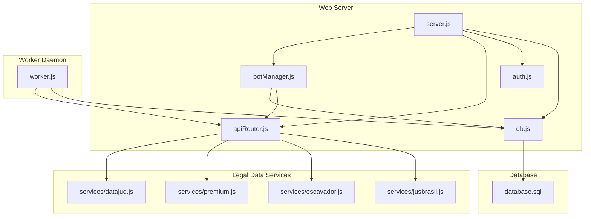
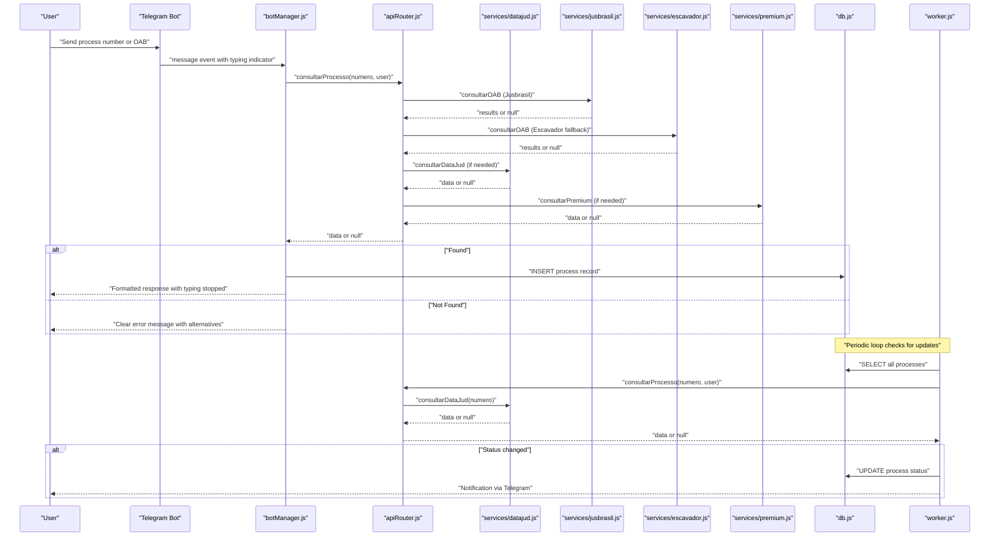
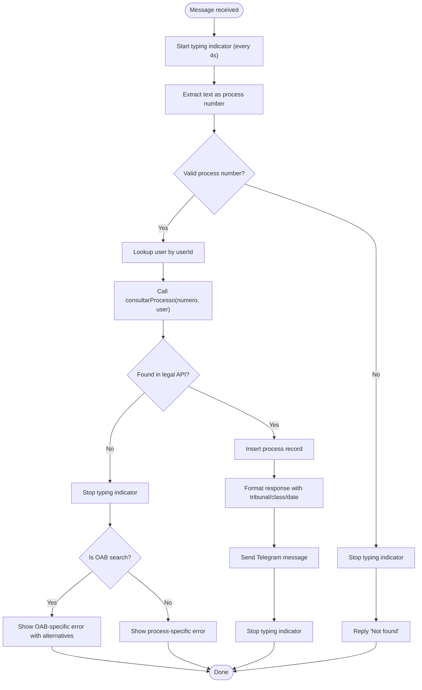
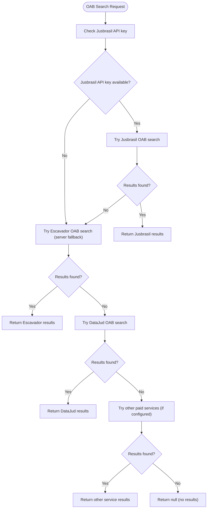
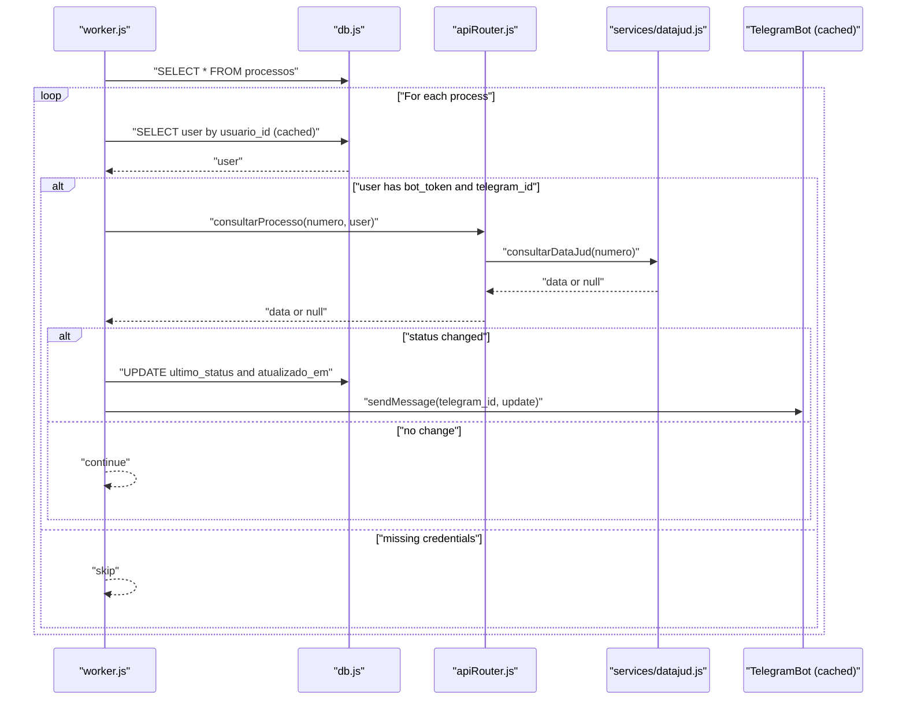
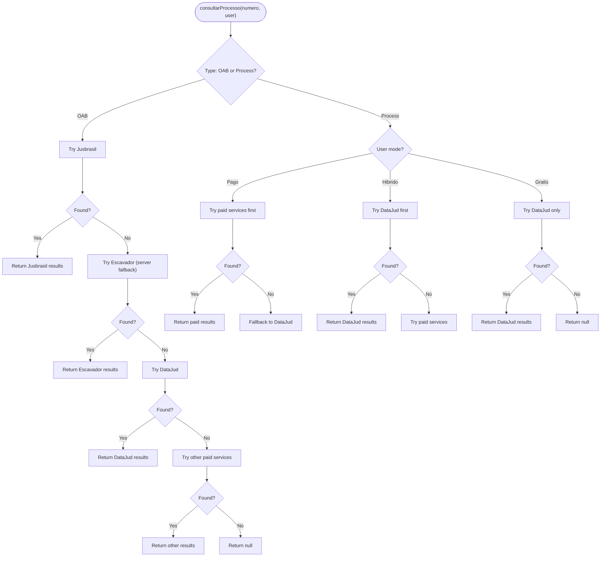
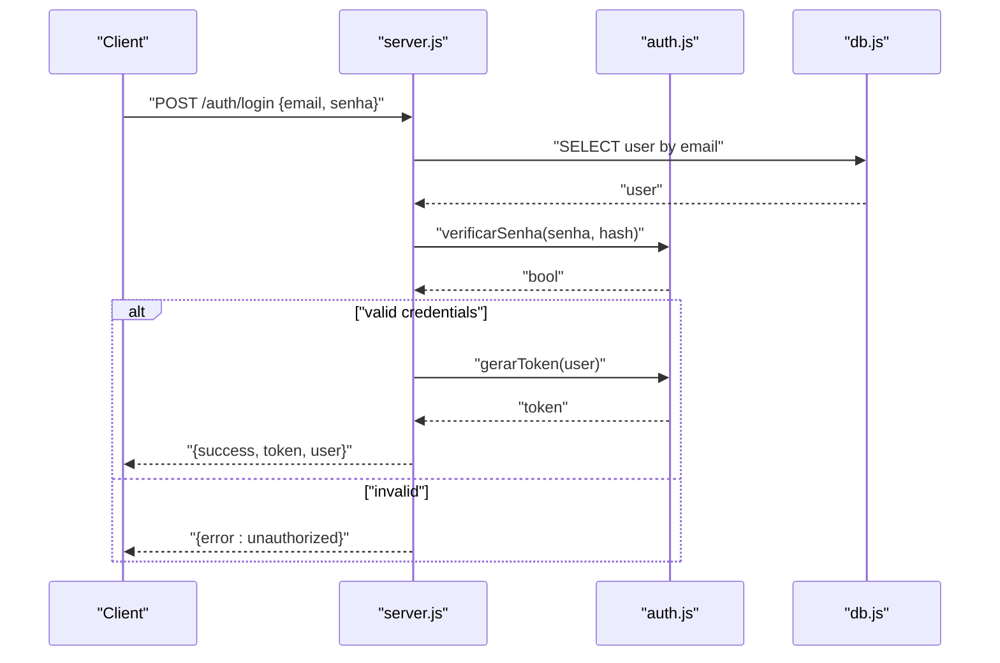
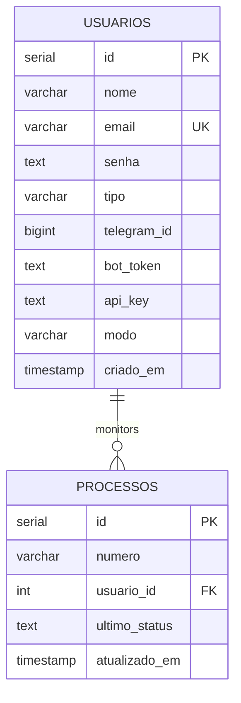
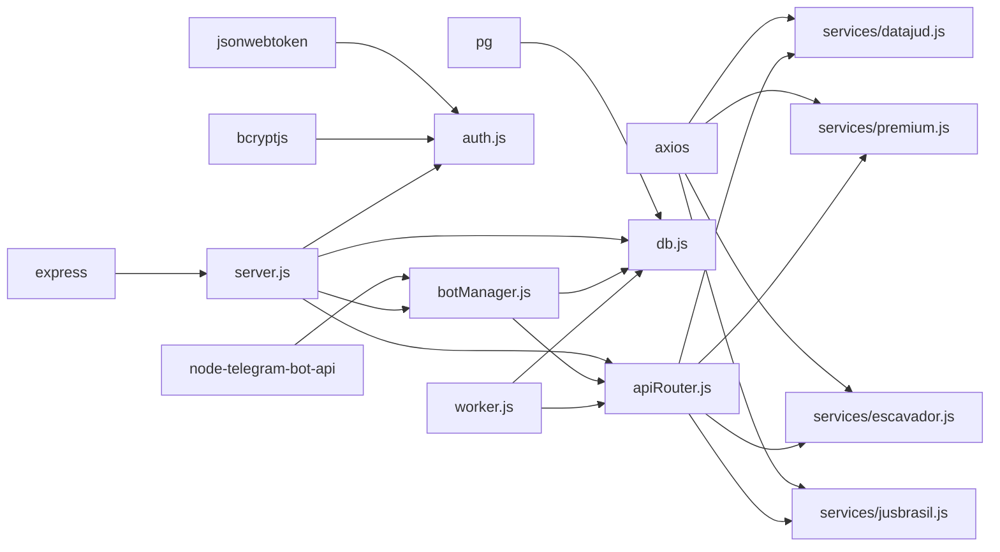

# Telegram Bot Integration

<cite>
**Referenced Files in This Document**
- [server.js](file://server.js)
- [botManager.js](file://botManager.js)
- [worker.js](file://worker.js)
- [apiRouter.js](file://apiRouter.js)
- [services/datajud.js](file://services/datajud.js)
- [services/premium.js](file://services/premium.js)
- [services/escavador.js](file://services/escavador.js)
- [services/jusbrasil.js](file://services/jusbrasil.js)
- [auth.js](file://auth.js)
- [db.js](file://db.js)
- [database.sql](file://database.sql)
- [parser.js](file://parser.js)
- [package.json](file://package.json)
- [README.md](file://README.md)
</cite>

## Update Summary
**Changes Made**
- Enhanced Telegram bot with typing indicators (every 4 seconds) for improved user experience
- Improved error handling for OAB searches with better fallback mechanisms
- Added support for OAB fallback search through Escavador when server API key is configured
- Enhanced user feedback mechanisms with clearer error messages and alternative search options
- Updated message processing workflow to include continuous typing indicators during searches

## Table of Contents
1. [Introduction](#introduction)
2. [Project Structure](#project-structure)
3. [Core Components](#core-components)
4. [Architecture Overview](#architecture-overview)
5. [Detailed Component Analysis](#detailed-component-analysis)
6. [Dependency Analysis](#dependency-analysis)
7. [Performance Considerations](#performance-considerations)
8. [Troubleshooting Guide](#troubleshooting-guide)
9. [Conclusion](#conclusion)
10. [Appendices](#appendices)

## Introduction
This document explains the Telegram bot integration for a multi-user SaaS platform that monitors Brazilian judicial processes. It covers bot creation and configuration, message processing workflows, event handling, dynamic per-user bot instances, caching strategies, message parsing, validation against legal databases, bot management commands, user interaction patterns, response formatting, and the worker system that monitors process updates and sends real-time notifications. The system now features enhanced user experience with typing indicators, improved error handling for OAB searches, and better fallback mechanisms through Escavador integration.

## Project Structure
The system consists of:
- Web server and bot manager for user registration, login, and dynamic bot initialization
- Worker daemon that periodically checks for process updates and notifies users
- API router orchestrating free and paid legal data sources with enhanced OAB fallback
- Services for free (DataJud CNJ) and paid (premium) legal data retrieval
- Enhanced Telegram bot with typing indicators and improved error handling
- Authentication middleware and database connection
- PostgreSQL schema for users and monitored processes

**Diagram sources**
- [server.js:1-162](file://server.js#L1-L162)
- [botManager.js:1-190](file://botManager.js#L1-L190)
- [worker.js:1-70](file://worker.js#L1-L70)
- [apiRouter.js:1-111](file://apiRouter.js#L1-L111)
- [services/datajud.js:1-32](file://services/datajud.js#L1-L32)
- [services/premium.js:1-12](file://services/premium.js#L1-L12)
- [services/escavador.js:1-108](file://services/escavador.js#L1-L108)
- [services/jusbrasil.js:1-197](file://services/jusbrasil.js#L1-L197)
- [db.js:1-11](file://db.js#L1-L11)
- [database.sql:1-25](file://database.sql#L1-L25)

**Section sources**
- [README.md:1-56](file://README.md#L1-L56)
- [package.json:1-21](file://package.json#L1-L21)

## Core Components
- Dynamic Bot Manager: Creates and caches Telegram bot instances per user token, listens for messages, validates input, queries legal APIs, persists process records, and responds to users with enhanced typing indicators and improved error handling.
- Worker Daemon: Periodically polls legal APIs for process updates, compares with stored statuses, and sends Telegram notifications.
- API Router: Orchestrates free and paid legal data sources with enhanced OAB fallback logic through Escavador integration.
- Legal Data Services: Free DataJud CNJ integration, Jusbrasil premium integration, and Escavador fallback service for OAB searches.
- Authentication and Authorization: JWT-based authentication, password hashing, and admin middleware.
- Database Layer: PostgreSQL connection and schema for users and monitored processes.

**Section sources**
- [botManager.js:1-190](file://botManager.js#L1-L190)
- [worker.js:1-70](file://worker.js#L1-L70)
- [apiRouter.js:1-111](file://apiRouter.js#L1-L111)
- [services/datajud.js:1-32](file://services/datajud.js#L1-L32)
- [services/premium.js:1-12](file://services/premium.js#L1-L12)
- [services/escavador.js:1-108](file://services/escavador.js#L1-L108)
- [services/jusbrasil.js:1-197](file://services/jusbrasil.js#L1-L197)
- [auth.js:1-59](file://auth.js#L1-L59)
- [db.js:1-11](file://db.js#L1-L11)
- [database.sql:1-25](file://database.sql#L1-L25)

## Architecture Overview
The system integrates Telegram bots with a backend that manages users, processes, and legal data retrieval. Two primary runtime components coexist with enhanced user experience features:
- Web server initializes bots and exposes admin endpoints with improved error handling
- Worker daemon runs independently to monitor and notify
- Enhanced typing indicators provide real-time feedback during searches
- OAB fallback mechanism ensures comprehensive search capabilities

**Diagram sources**
- [botManager.js:91-167](file://botManager.js#L91-L167)
- [apiRouter.js:26-58](file://apiRouter.js#L26-L58)
- [services/datajud.js:3-29](file://services/datajud.js#L3-L29)
- [services/jusbrasil.js:31-68](file://services/jusbrasil.js#L31-L68)
- [services/escavador.js:29-66](file://services/escavador.js#L29-L66)
- [services/premium.js:1-12](file://services/premium.js#L1-L12)
- [worker.js:17-61](file://worker.js#L17-L61)
- [db.js:1-11](file://db.js#L1-L11)

## Detailed Component Analysis

### Enhanced Telegram Bot with Typing Indicators
- Per-user bot tokens: Each user can register a Telegram bot token and a Telegram chat ID. On registration or admin creation, the system initializes a Telegram bot instance keyed by token and cached in memory.
- Message event handling: The bot listens for incoming messages, extracts the text as a potential process number, validates it against legal databases, persists the record, and replies with formatted information.
- Enhanced typing indicators: The bot now sends typing indicators every 4 seconds during search operations to provide real-time feedback to users.
- Caching: Bots are cached by token to avoid recreating instances. This reduces overhead and ensures consistent message handling per user.

**Diagram sources**
- [botManager.js:91-167](file://botManager.js#L91-L167)
- [apiRouter.js:26-58](file://apiRouter.js#L26-L58)
- [services/datajud.js:3-29](file://services/datajud.js#L3-L29)

**Section sources**
- [botManager.js:91-167](file://botManager.js#L91-L167)
- [server.js:12-36](file://server.js#L12-L36)
- [server.js:70-92](file://server.js#L70-L92)

### Enhanced OAB Search with Fallback Mechanisms
- Priority-based OAB search: The system now follows a strict priority order for OAB searches: Jusbrasil (user's premium service) → Escavador (server fallback) → DataJud (free) → Other paid services (if configured).
- Escavador fallback: When a user's Jusbrasil API key is unavailable, the system automatically attempts OAB searches through Escavador using the server's configured API key.
- Improved error handling: Clear error messages are displayed when OAB searches fail, with suggestions for alternative search methods.
- Real-time feedback: Users receive immediate feedback about the search progress and any fallback attempts.

**Diagram sources**
- [apiRouter.js:26-58](file://apiRouter.js#L26-L58)
- [services/jusbrasil.js:31-68](file://services/jusbrasil.js#L31-L68)
- [services/escavador.js:29-66](file://services/escavador.js#L29-L66)
- [services/datajud.js:3-29](file://services/datajud.js#L3-L29)

**Section sources**
- [apiRouter.js:26-58](file://apiRouter.js#L26-L58)
- [services/jusbrasil.js:31-68](file://services/jusbrasil.js#L31-L68)
- [services/escavador.js:29-66](file://services/escavador.js#L29-L66)
- [botManager.js:110-129](file://botManager.js#L110-L129)

### Worker System for Monitoring Updates
- Periodic polling: The worker runs a loop every 5 minutes to check for process updates.
- Grouping and caching: Processes are grouped by user to minimize repeated queries. A user cache avoids redundant database lookups.
- Notification delivery: When a newer status is detected, the worker updates the database and sends a Telegram notification to the user's chat ID using the cached bot instance.

**Diagram sources**
- [worker.js:17-61](file://worker.js#L17-L61)
- [apiRouter.js:60-93](file://apiRouter.js#L60-L93)
- [services/datajud.js:3-29](file://services/datajud.js#L3-L29)

**Section sources**
- [worker.js:6-15](file://worker.js#L6-L15)
- [worker.js:17-67](file://worker.js#L17-L67)

### Enhanced API Router and Legal Data Integration
- Priority-based search strategy: The router attempts searches in a specific order based on user mode and available API keys.
- Enhanced OAB fallback: For OAB searches, the system tries Jusbrasil first, then Escavador (server fallback), then DataJud, and finally other paid services.
- Error handling improvements: Better error messages and fallback mechanisms ensure users always receive meaningful feedback.
- Premium integration: A placeholder for premium legal API is provided; replace with a real integration endpoint and authentication.

**Diagram sources**
- [apiRouter.js:16-93](file://apiRouter.js#L16-L93)
- [services/datajud.js:3-29](file://services/datajud.js#L3-L29)
- [services/jusbrasil.js:31-68](file://services/jusbrasil.js#L31-L68)
- [services/escavador.js:29-66](file://services/escavador.js#L29-L66)
- [services/premium.js:1-12](file://services/premium.js#L1-L12)

**Section sources**
- [apiRouter.js:16-93](file://apiRouter.js#L16-L93)
- [services/datajud.js:3-29](file://services/datajud.js#L3-L29)
- [services/jusbrasil.js:31-68](file://services/jusbrasil.js#L31-L68)
- [services/escavador.js:29-66](file://services/escavador.js#L29-L66)
- [services/premium.js:1-12](file://services/premium.js#L1-L12)

### Authentication and Authorization
- JWT-based authentication: Tokens are generated with expiration and verified on protected routes.
- Password hashing: Bcrypt is used for secure password storage.
- Admin middleware: Restricts administrative endpoints to users with admin type.

**Diagram sources**
- [server.js:39-68](file://server.js#L39-L68)
- [auth.js:8-31](file://auth.js#L8-L31)
- [db.js:1-11](file://db.js#L1-L11)

**Section sources**
- [auth.js:8-31](file://auth.js#L8-L31)
- [auth.js:34-39](file://auth.js#L34-L39)
- [server.js:39-68](file://server.js#L39-L68)

### Database Schema and Data Model
- Users table stores authentication credentials, Telegram identifiers, bot token, API key, and mode.
- Processes table tracks monitored process numbers, links to users, last known status, and timestamps.

**Diagram sources**
- [database.sql:5-24](file://database.sql#L5-L24)

**Section sources**
- [database.sql:5-24](file://database.sql#L5-L24)

## Dependency Analysis
External libraries and their roles:
- Express: Web server and routing
- node-telegram-bot-api: Telegram bot client for message handling and notifications with enhanced typing support
- axios: HTTP client for legal API calls including OAB fallback services
- jsonwebtoken: JWT token generation and verification
- bcryptjs: Password hashing
- pg: PostgreSQL client for database operations

**Diagram sources**
- [package.json:11-19](file://package.json#L11-L19)
- [server.js:1-10](file://server.js#L1-L10)
- [botManager.js:1](file://botManager.js#L1)
- [services/datajud.js:1](file://services/datajud.js#L1)
- [services/premium.js:1](file://services/premium.js#L1)
- [services/escavador.js:1](file://services/escavador.js#L1)
- [services/jusbrasil.js:1](file://services/jusbrasil.js#L1)
- [auth.js:1-3](file://auth.js#L1-L3)
- [db.js:1-10](file://db.js#L1-L10)
- [worker.js:1-4](file://worker.js#L1-L4)

**Section sources**
- [package.json:11-19](file://package.json#L11-L19)

## Performance Considerations
- Bot instance caching: Prevents recreation overhead by storing Telegram bot instances keyed by token.
- User cache in worker: Reduces repeated database queries by caching user records per user ID during a loop cycle.
- Polling interval: The worker runs every 5 minutes; adjust based on acceptable latency and API quotas.
- Database batching: Group operations where possible to reduce round trips.
- Rate limiting: Consider adding throttling around Telegram API calls to avoid rate limits.
- Typing indicator optimization: Continuous typing indicators every 4 seconds provide better user experience without excessive API calls.
- Enhanced error handling: Improved error handling reduces unnecessary retries and improves overall system performance.

## Troubleshooting Guide
Common bot-related issues and resolutions:
- Webhook vs polling: The current implementation uses polling. If you switch to webhooks, configure the Telegram bot to use webhook URLs and disable polling.
- Message rate limits: Telegram may throttle frequent messages. Implement backoff and batching in bot responses.
- Missing credentials: Ensure users have both bot_token and telegram_id set; otherwise, notifications cannot be sent.
- API timeouts: Add retry logic and circuit breaker patterns for legal API calls.
- Database connectivity: Verify PostgreSQL connection parameters and network access.
- Token invalidation: If a user revokes bot permissions, remove bot_token and telegram_id from the user record.
- OAB search failures: When Jusbrasil API key is unavailable, the system automatically falls back to Escavador. Check server configuration for ESCAVADOR_API_KEY.
- Typing indicator issues: If typing indicators stop working, verify that the interval timer is properly cleared on completion or error.

**Section sources**
- [botManager.js:91-167](file://botManager.js#L91-L167)
- [worker.js:39-43](file://worker.js#L39-L43)
- [db.js:4-10](file://db.js#L4-L10)
- [services/escavador.js:11-14](file://services/escavador.js#L11-L14)
- [services/jusbrasil.js:11-14](file://services/jusbrasil.js#L11-L14)

## Conclusion
The Telegram bot integration provides a robust foundation for multi-user judicial process monitoring with enhanced user experience features. The system now includes continuous typing indicators for real-time feedback, improved OAB search capabilities with Escavador fallback, and better error handling mechanisms. It dynamically creates per-user bots, validates and parses process numbers, integrates with free and paid legal APIs following priority-based fallback strategies, persists data, and notifies users of updates. The worker daemon ensures continuous monitoring with caching and efficient database access. By following the configuration steps and addressing common issues, you can deploy a scalable and reliable solution with superior user experience.

## Appendices

### Bot Configuration and Setup
- Create a Telegram bot via BotFather and note the bot token.
- Obtain your Telegram user ID via a bot like @userinfobot.
- Register or create a user with the bot token and Telegram ID, and set the desired mode (gratis, híbrido, pago).
- Configure API keys for enhanced functionality: JUSBRASIL_API_KEY for premium OAB searches and ESCAVADOR_API_KEY for server-level OAB fallback.
- Start the server and worker processes as described in the README.

**Section sources**
- [README.md:49-56](file://README.md#L49-L56)
- [server.js:12-36](file://server.js#L12-L36)
- [server.js:70-92](file://server.js#L70-L92)

### Enhanced Message Processing Logic Example
- User sends a process number or OAB to the Telegram bot.
- The bot starts typing indicators every 4 seconds to show active search.
- The bot extracts the text, determines the search type, looks up the user, queries legal APIs with priority-based fallback, inserts the process into the database, stops typing indicators, and replies with formatted information.

**Section sources**
- [botManager.js:91-167](file://botManager.js#L91-L167)
- [apiRouter.js:26-58](file://apiRouter.js#L26-L58)

### Worker Monitoring Workflow Example
- The worker selects all monitored processes, groups by user, checks legal APIs for updates, updates the database when status changes, and sends Telegram notifications.

**Section sources**
- [worker.js:17-61](file://worker.js#L17-L61)

### Enhanced Integration with External Legal APIs
- Free integration: DataJud CNJ via HTTP POST with a match query on the process number.
- Premium integration: Jusbrasil API with comprehensive OAB monitoring and process linkage.
- Escavador fallback: Server-level OAB search capability when user's premium service is unavailable.
- Paid integration: Replace the premium service placeholder with a real legal API endpoint and authentication.

**Section sources**
- [services/datajud.js:3-29](file://services/datajud.js#L3-L29)
- [services/jusbrasil.js:31-68](file://services/jusbrasil.js#L31-L68)
- [services/escavador.js:29-66](file://services/escavador.js#L29-L66)
- [services/premium.js:1-12](file://services/premium.js#L1-L12)
- [apiRouter.js:26-58](file://apiRouter.js#L26-L58)

### Enhanced User Feedback and Error Handling
- Typing indicators: Automatic "typing..." indicators every 4 seconds during search operations.
- Clear error messages: Specific feedback for OAB vs process searches with alternative suggestions.
- Fallback mechanisms: Automatic progression through available search methods with user-friendly messaging.
- Timeout handling: Proper cleanup of typing indicators and error reporting on API failures.

**Section sources**
- [botManager.js:91-167](file://botManager.js#L91-L167)
- [services/escavador.js:11-14](file://services/escavador.js#L11-L14)
- [services/jusbrasil.js:11-14](file://services/jusbrasil.js#L11-L14)