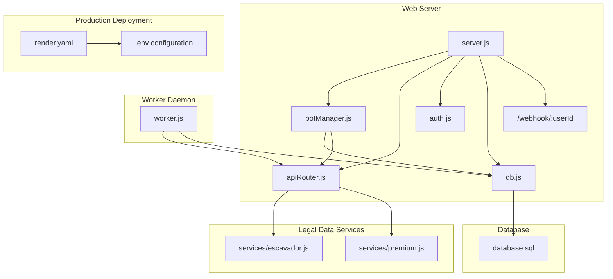
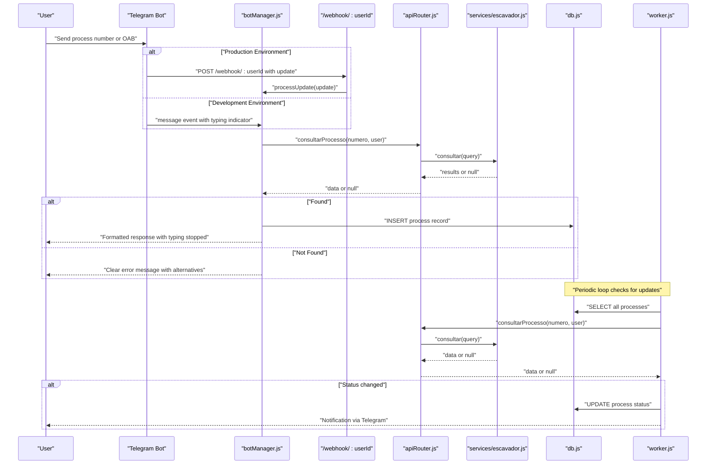
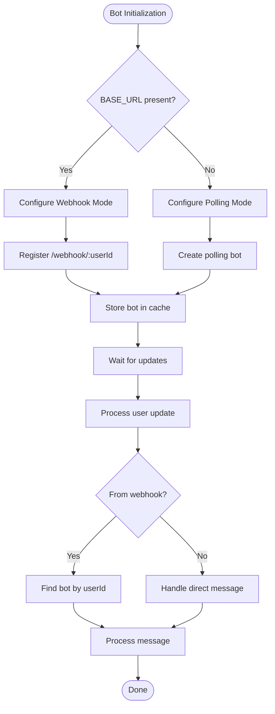
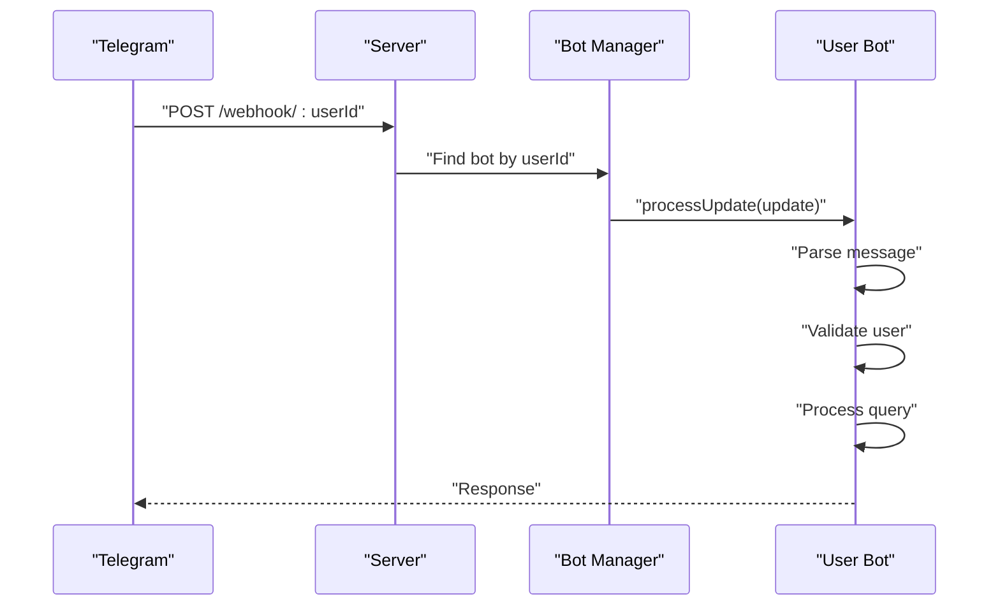
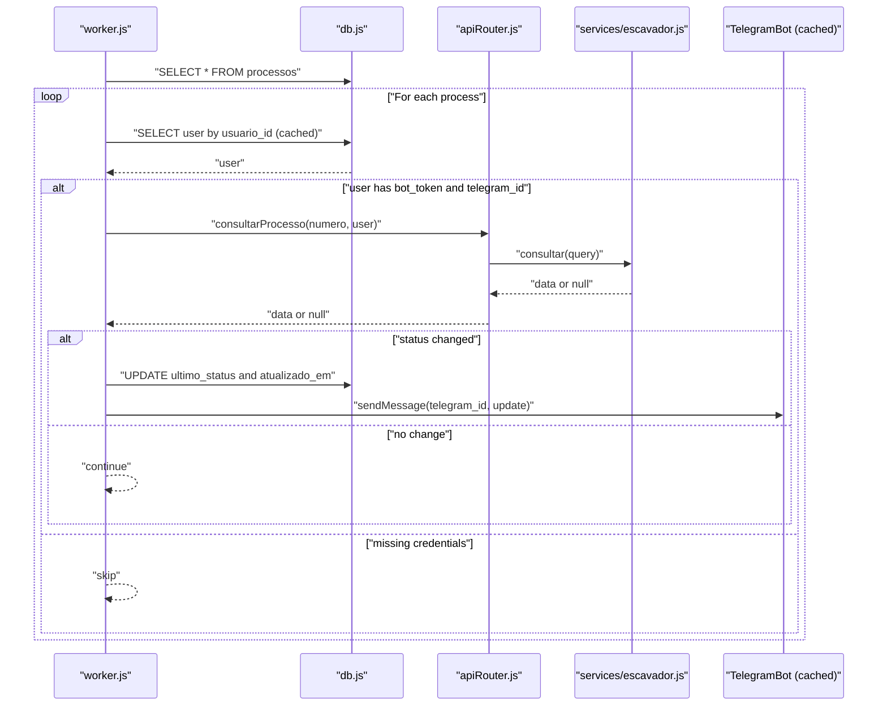
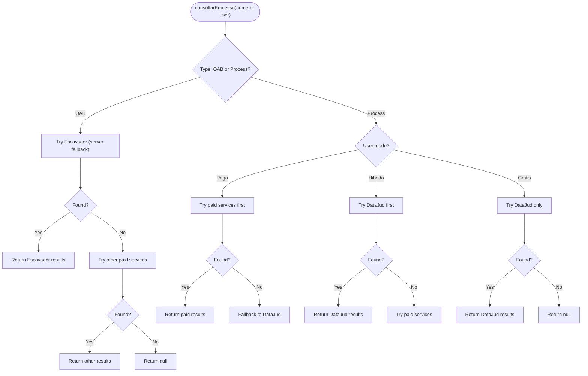
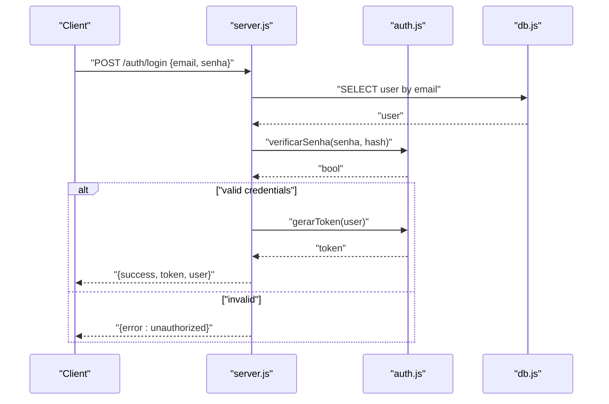
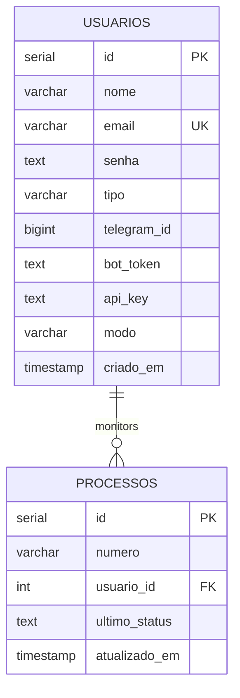
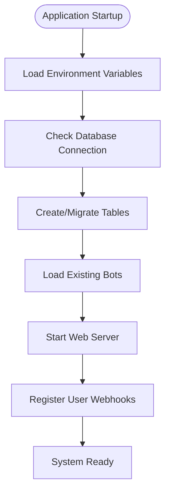
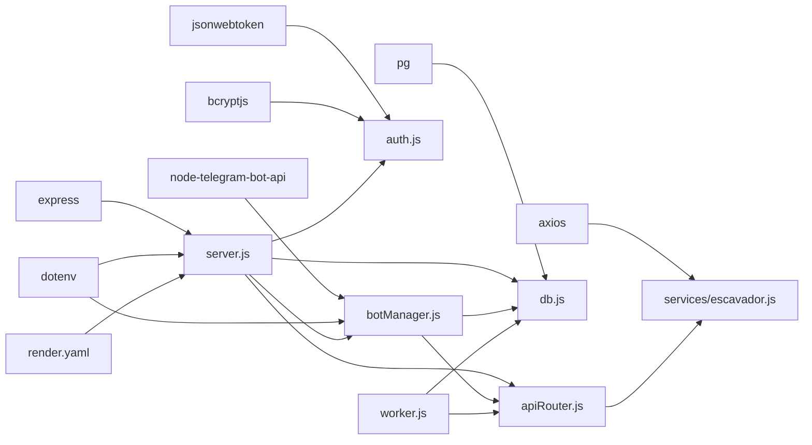

# Telegram Bot Integration

<cite>
**Referenced Files in This Document**
- [server.js](file://server.js)
- [botManager.js](file://botManager.js)
- [worker.js](file://worker.js)
- [apiRouter.js](file://apiRouter.js)
- [services/escavador.js](file://services/escavador.js)
- [services/premium.js](file://services/premium.js)
- [services/escavador.js](file://services/escavador.js)
- [services/jusbrasil.js](file://services/jusbrasil.js)
- [auth.js](file://auth.js)
- [db.js](file://db.js)
- [database.sql](file://database.sql)
- [parser.js](file://parser.js)
- [package.json](file://package.json)
- [README.md](file://README.md)
- [render.yaml](file://render.yaml)
</cite>

## Update Summary
**Changes Made**
- Enhanced Telegram bot infrastructure with environment-based webhook/polling configuration
- Implemented user-specific webhook handling via `/webhook/:userId` endpoint
- Improved error handling for production deployments with proper logging and response codes
- Added environment-aware bot initialization with automatic webhook registration
- Enhanced bot lifecycle management with better caching and cleanup mechanisms

## Table of Contents
1. [Introduction](#introduction)
2. [Project Structure](#project-structure)
3. [Core Components](#core-components)
4. [Architecture Overview](#architecture-overview)
5. [Detailed Component Analysis](#detailed-component-analysis)
6. [Dependency Analysis](#dependency-analysis)
7. [Performance Considerations](#performance-considerations)
8. [Troubleshooting Guide](#troubleshooting-guide)
9. [Conclusion](#conclusion)
10. [Appendices](#appendices)

## Introduction
This document explains the Telegram bot integration for a multi-user SaaS platform that monitors Brazilian judicial processes. It covers bot creation and configuration, message processing workflows, event handling, dynamic per-user bot instances, caching strategies, message parsing, validation against legal databases, bot management commands, user interaction patterns, response formatting, and the worker system that monitors process updates and sends real-time notifications. The system now features enhanced production-ready infrastructure with environment-based webhook configuration, user-specific webhook handling, and improved error handling mechanisms.

## Project Structure
The system consists of:
- Web server and bot manager for user registration, login, and dynamic bot initialization with environment-aware configuration
- Worker daemon that periodically checks for process updates and notifies users
- API router orchestrating free and paid legal data sources with enhanced OAB fallback
- Services for free (DataJud CNJ) and paid (premium) legal data retrieval
- Enhanced Telegram bot with typing indicators and improved error handling
- Authentication middleware and database connection
- PostgreSQL schema for users and monitored processes
- Production deployment configuration with Render platform support

**Diagram sources**
- [server.js:275-288](file://server.js#L275-L288)
- [botManager.js:1-221](file://botManager.js#L1-L221)
- [worker.js:1-74](file://worker.js#L1-L74)
- [apiRouter.js:1-49](file://apiRouter.js#L1-L49)
- [services/escavador.js:1-218](file://services/escavador.js#L1-L218)
- [render.yaml:1-31](file://render.yaml#L1-L31)

**Section sources**
- [README.md:1-56](file://README.md#L1-L56)
- [package.json:1-21](file://package.json#L1-L21)

## Core Components
- Dynamic Bot Manager: Creates and caches Telegram bot instances per user token, automatically configures webhook or polling based on environment, listens for messages, validates input, queries legal APIs, persists process records, and responds to users with enhanced typing indicators and improved error handling.
- Enhanced Webhook System: Provides user-specific webhook endpoints (`/webhook/:userId`) for production deployments, enabling scalable bot handling without conflicts.
- Worker Daemon: Periodically polls legal APIs for process updates, compares with stored statuses, and sends Telegram notifications.
- API Router: Orchestrates free and paid legal data sources with enhanced OAB fallback logic through Escavador integration.
- Legal Data Services: Free DataJud CNJ integration, Jusbrasil premium integration, and Escavador fallback service for OAB searches.
- Authentication and Authorization: JWT-based authentication, password hashing, and admin middleware.
- Database Layer: PostgreSQL connection and schema for users and monitored processes.
- Production Configuration: Environment-based deployment settings with Render platform support.

**Section sources**
- [botManager.js:1-221](file://botManager.js#L1-L221)
- [server.js:275-288](file://server.js#L275-L288)
- [worker.js:1-74](file://worker.js#L1-L74)
- [apiRouter.js:1-49](file://apiRouter.js#L1-L49)
- [services/escavador.js:1-218](file://services/escavador.js#L1-L218)
- [auth.js:1-59](file://auth.js#L1-L59)
- [db.js:1-11](file://db.js#L1-L11)
- [database.sql:1-25](file://database.sql#L1-L25)
- [render.yaml:1-31](file://render.yaml#L1-L31)

## Architecture Overview
The system integrates Telegram bots with a backend that manages users, processes, and legal data retrieval. Enhanced production-ready infrastructure provides two primary runtime components with environment-aware configuration:
- Web server initializes bots with automatic webhook/polling configuration and exposes admin endpoints with improved error handling
- Worker daemon runs independently to monitor and notify
- User-specific webhook endpoints enable scalable production deployments
- Enhanced typing indicators provide real-time feedback during searches
- OAB fallback mechanism ensures comprehensive search capabilities

**Diagram sources**
- [botManager.js:91-167](file://botManager.js#L91-L167)
- [server.js:275-288](file://server.js#L275-L288)
- [apiRouter.js:8-31](file://apiRouter.js#L8-L31)
- [services/escavador.js:10-40](file://services/escavador.js#L10-L40)
- [worker.js:17-65](file://worker.js#L17-L65)

## Detailed Component Analysis

### Enhanced Telegram Bot Infrastructure with Environment-Based Configuration
- **Environment-aware bot initialization**: The bot manager automatically configures webhook or polling based on the presence of `BASE_URL` environment variable. In production (with `BASE_URL`), bots use webhooks; in development (without `BASE_URL`), bots use polling.
- **Automatic webhook registration**: When running in production, bots automatically register webhooks with unique URLs per user (`/webhook/:userId`) to prevent conflicts.
- **User-specific webhook handling**: Each bot instance is associated with a specific user ID, enabling precise message routing and preventing cross-user message processing.
- **Enhanced error handling**: Production deployments include comprehensive error logging, proper HTTP status codes, and graceful degradation when webhook registration fails.
- **Bot lifecycle management**: Improved caching mechanisms prevent bot recreation overhead while ensuring proper cleanup on errors.

**Diagram sources**
- [botManager.js:9-36](file://botManager.js#L9-L36)
- [server.js:275-288](file://server.js#L275-L288)
- [botManager.js:117-120](file://botManager.js#L117-L120)

**Section sources**
- [botManager.js:9-36](file://botManager.js#L9-L36)
- [server.js:275-288](file://server.js#L275-L288)
- [botManager.js:117-120](file://botManager.js#L117-L120)

### User-Specific Webhook System
- **Unique webhook endpoints**: Each user receives a dedicated webhook URL (`/webhook/:userId`) that routes updates specifically to their bot instance.
- **Bot-to-user association**: Bot instances store the associated user ID, enabling precise message routing and preventing cross-user message processing.
- **Conflict prevention**: User-specific webhooks eliminate webhook conflicts that commonly occur when multiple bots share the same webhook URL.
- **Production scalability**: Enables horizontal scaling by allowing multiple bot instances to handle different user groups without URL collisions.
- **Enhanced security**: Each webhook endpoint is tied to a specific user, reducing the attack surface and enabling granular access control.

**Diagram sources**
- [server.js:275-288](file://server.js#L275-L288)
- [botManager.js:117-120](file://botManager.js#L117-L120)

**Section sources**
- [server.js:275-288](file://server.js#L275-L288)
- [botManager.js:117-120](file://botManager.js#L117-L120)

### Enhanced OAB Search with Fallback Mechanisms
- **Priority-based OAB search**: The system now follows a strict priority order for OAB searches: Jusbrasil (user's premium service) → Escavador (server fallback) → DataJud (free) → Other paid services (if configured).
- **Escavador fallback**: When a user's Jusbrasil API key is unavailable, the system automatically attempts OAB searches through Escavador using the server's configured API key.
- **Improved error handling**: Clear error messages are displayed when OAB searches fail, with suggestions for alternative search methods.
- **Real-time feedback**: Users receive immediate feedback about the search progress and any fallback attempts.

**Diagram sources**
- [apiRouter.js:8-31](file://apiRouter.js#L8-L31)
- [services/escavador.js:44-81](file://services/escavador.js#L44-L81)

**Section sources**
- [apiRouter.js:8-31](file://apiRouter.js#L8-L31)
- [services/escavador.js:44-81](file://services/escavador.js#L44-L81)

### Worker System for Monitoring Updates
- **Periodic polling**: The worker runs a loop every 5 minutes to check for process updates.
- **Grouping and caching**: Processes are grouped by user to minimize repeated queries. A user cache avoids redundant database lookups.
- **Notification delivery**: When a newer status is detected, the worker updates the database and sends a Telegram notification to the user's chat ID using the cached bot instance.

**Diagram sources**
- [worker.js:17-65](file://worker.js#L17-L65)
- [apiRouter.js:8-31](file://apiRouter.js#L8-L31)
- [services/escavador.js:84-170](file://services/escavador.js#L84-L170)

**Section sources**
- [worker.js:17-65](file://worker.js#L17-L65)

### Enhanced API Router and Legal Data Integration
- **Priority-based search strategy**: The router attempts searches in a specific order based on user mode and available API keys.
- **Enhanced OAB fallback**: For OAB searches, the system tries Jusbrasil first, then Escavador (server fallback), then DataJud, and finally other paid services.
- **Error handling improvements**: Better error messages and fallback mechanisms ensure users always receive meaningful feedback.
- **Premium integration**: A placeholder for premium legal API is provided; replace with a real integration endpoint and authentication.

**Diagram sources**
- [apiRouter.js:8-31](file://apiRouter.js#L8-L31)
- [services/escavador.js:10-40](file://services/escavador.js#L10-L40)

**Section sources**
- [apiRouter.js:8-31](file://apiRouter.js#L8-L31)
- [services/escavador.js:10-40](file://services/escavador.js#L10-L40)

### Authentication and Authorization
- **JWT-based authentication**: Tokens are generated with expiration and verified on protected routes.
- **Password hashing**: Bcrypt is used for secure password storage.
- **Admin middleware**: Restricts administrative endpoints to users with admin type.

**Diagram sources**
- [server.js:62-101](file://server.js#L62-L101)
- [auth.js:8-31](file://auth.js#L8-L31)
- [db.js:1-11](file://db.js#L1-L11)

**Section sources**
- [auth.js:8-31](file://auth.js#L8-L31)
- [auth.js:34-39](file://auth.js#L34-L39)
- [server.js:62-101](file://server.js#L62-L101)

### Database Schema and Data Model
- **Users table**: Stores authentication credentials, Telegram identifiers, bot token, API key, and mode.
- **Processes table**: Tracks monitored process numbers, links to users, last known status, and timestamps.

**Diagram sources**
- [database.sql:5-24](file://database.sql#L5-L24)

**Section sources**
- [database.sql:5-24](file://database.sql#L5-L24)

### Production Deployment Configuration
- **Render Platform Support**: The system includes comprehensive configuration for deployment on Render platform with environment variables and database connections.
- **Environment Variables**: Supports production deployment with configurable API keys, database connections, and application settings.
- **Scalable Architecture**: User-specific webhook handling enables horizontal scaling without URL conflicts.
- **Automatic Migration**: Database tables are automatically created and migrated during server startup.

**Diagram sources**
- [server.js:290-295](file://server.js#L290-L295)
- [render.yaml:9-25](file://render.yaml#L9-L25)

**Section sources**
- [render.yaml:1-31](file://render.yaml#L1-L31)
- [server.js:290-295](file://server.js#L290-L295)

## Dependency Analysis
External libraries and their roles:
- Express: Web server and routing with enhanced webhook support
- node-telegram-bot-api: Telegram bot client for message handling and notifications with environment-aware configuration
- axios: HTTP client for legal API calls including OAB fallback services
- jsonwebtoken: JWT token generation and verification
- bcryptjs: Password hashing
- pg: PostgreSQL client for database operations
- dotenv: Environment variable loading for production configuration

**Diagram sources**
- [package.json:11-19](file://package.json#L11-L19)
- [server.js:1-6](file://server.js#L1-L6)
- [botManager.js:1](file://botManager.js#L1)
- [services/escavador.js:1](file://services/escavador.js#L1)
- [auth.js:1-3](file://auth.js#L1-L3)
- [db.js:1-10](file://db.js#L1-L10)
- [worker.js:1-4](file://worker.js#L1-L4)
- [render.yaml:9-25](file://render.yaml#L9-L25)

**Section sources**
- [package.json:11-19](file://package.json#L11-L19)

## Performance Considerations
- **Bot instance caching**: Prevents recreation overhead by storing Telegram bot instances keyed by token.
- **User cache in worker**: Reduces repeated database queries by caching user records per user ID during a loop cycle.
- **Polling interval**: The worker runs every 5 minutes; adjust based on acceptable latency and API quotas.
- **Database batching**: Group operations where possible to reduce round trips.
- **Rate limiting**: Consider adding throttling around Telegram API calls to avoid rate limits.
- **Typing indicator optimization**: Continuous typing indicators every 4 seconds provide better user experience without excessive API calls.
- **Environment-aware configuration**: Production environments use webhooks to eliminate polling overhead and reduce resource consumption.
- **User-specific webhook handling**: Prevents message routing overhead by eliminating cross-user message processing.
- **Enhanced error handling**: Improved error handling reduces unnecessary retries and improves overall system performance.

## Troubleshooting Guide
Common bot-related issues and resolutions:
- **Webhook vs polling configuration**: The system automatically detects environment and configures webhook or polling accordingly. Check `BASE_URL` environment variable to determine mode.
- **User-specific webhook conflicts**: Each bot has a unique `/webhook/:userId` endpoint. Verify the correct user ID is being used in webhook URLs.
- **Message rate limits**: Telegram may throttle frequent messages. Implement backoff and batching in bot responses.
- **Missing credentials**: Ensure users have both bot_token and telegram_id set; otherwise, notifications cannot be sent.
- **API timeouts**: Add retry logic and circuit breaker patterns for legal API calls.
- **Database connectivity**: Verify PostgreSQL connection parameters and network access.
- **Token invalidation**: If a user revokes bot permissions, remove bot_token and telegram_id from the user record.
- **OAB search failures**: When Jusbrasil API key is unavailable, the system automatically falls back to Escavador. Check server configuration for ESCAVADOR_API_KEY.
- **Typing indicator issues**: If typing indicators stop working, verify that the interval timer is properly cleared on completion or error.
- **Production deployment issues**: Ensure environment variables are properly configured in production. Check Render platform logs for webhook registration errors.

**Section sources**
- [botManager.js:9-36](file://botManager.js#L9-L36)
- [server.js:275-288](file://server.js#L275-L288)
- [worker.js:39-43](file://worker.js#L39-L43)
- [db.js:4-10](file://db.js#L4-L10)
- [services/escavador.js:11-14](file://services/escavador.js#L11-L14)

## Conclusion
The Telegram bot integration provides a robust foundation for multi-user judicial process monitoring with enhanced production-ready infrastructure. The system now includes environment-based webhook/polling configuration, user-specific webhook handling, improved error handling mechanisms, and comprehensive production deployment support. The system dynamically creates per-user bots with automatic webhook registration, validates and parses process numbers, integrates with free and paid legal APIs following priority-based fallback strategies, persists data, and notifies users of updates. The worker daemon ensures continuous monitoring with caching and efficient database access. By following the configuration steps and addressing common issues, you can deploy a scalable and reliable solution with superior user experience and production-grade reliability.

## Appendices

### Bot Configuration and Setup
- **Environment-based configuration**: Set `BASE_URL` environment variable to enable webhook mode in production. Without `BASE_URL`, bots automatically use polling mode for development.
- **Create a Telegram bot via BotFather** and note the bot token.
- **Obtain your Telegram user ID** via a bot like @userinfobot.
- **Register or create a user** with the bot token and Telegram ID, and set the desired mode (gratis, híbrido, pago).
- **Configure API keys** for enhanced functionality: JUSBRASIL_API_KEY for premium OAB searches and ESCAVADOR_API_KEY for server-level OAB fallback.
- **Production deployment**: Use Render platform with proper environment variables configured in `render.yaml`.
- **Start the server and worker processes** as described in the README.

**Section sources**
- [README.md:47-56](file://README.md#L47-L56)
- [server.js:12-36](file://server.js#L12-L36)
- [server.js:70-92](file://server.js#L70-L92)
- [render.yaml:9-25](file://render.yaml#L9-L25)

### Enhanced Message Processing Logic Example
- **User sends a process number or OAB** to the Telegram bot.
- **Environment detection**: Bot automatically configures webhook or polling based on `BASE_URL` environment variable.
- **User-specific webhook handling**: Production environments route updates through `/webhook/:userId` for the specific user.
- **The bot starts typing indicators** every 4 seconds to show active search.
- **The bot extracts the text**, determines the search type, looks up the user, queries legal APIs with priority-based fallback, inserts the process into the database, stops typing indicators, and replies with formatted information.

**Section sources**
- [botManager.js:91-167](file://botManager.js#L91-L167)
- [server.js:275-288](file://server.js#L275-L288)
- [apiRouter.js:8-31](file://apiRouter.js#L8-L31)

### Worker Monitoring Workflow Example
- The worker selects all monitored processes, groups by user, checks legal APIs for updates, updates the database when status changes, and sends Telegram notifications.

**Section sources**
- [worker.js:17-65](file://worker.js#L17-L65)

### Enhanced Integration with External Legal APIs
- **Free integration**: DataJud CNJ via HTTP POST with a match query on the process number.
- **Premium integration**: Jusbrasil API with comprehensive OAB monitoring and process linkage.
- **Escavador fallback**: Server-level OAB search capability when user's premium service is unavailable.
- **Paid integration**: Replace the premium service placeholder with a real legal API endpoint and authentication.

**Section sources**
- [services/escavador.js:10-40](file://services/escavador.js#L10-L40)
- [apiRouter.js:8-31](file://apiRouter.js#L8-L31)

### Enhanced User Feedback and Error Handling
- **Typing indicators**: Automatic "typing..." indicators every 4 seconds during search operations.
- **Clear error messages**: Specific feedback for OAB vs process searches with alternative suggestions.
- **Fallback mechanisms**: Automatic progression through available search methods with user-friendly messaging.
- **Timeout handling**: Proper cleanup of typing indicators and error reporting on API failures.
- **Production error handling**: Comprehensive logging and proper HTTP status codes for webhook processing errors.

**Section sources**
- [botManager.js:91-167](file://botManager.js#L91-L167)
- [services/escavador.js:11-14](file://services/escavador.js#L11-L14)
- [server.js:284-287](file://server.js#L284-L287)

### Production Deployment Configuration
- **Render Platform**: Complete deployment configuration with environment variables, database connections, and auto-scaling support.
- **Environment Variables**: Configurable API keys, database connections, and application settings for production environments.
- **Webhook Registration**: Automatic webhook registration for each user bot instance in production deployments.
- **Database Migration**: Automatic table creation and migration during server startup.

**Section sources**
- [render.yaml:1-31](file://render.yaml#L1-L31)
- [server.js:290-295](file://server.js#L290-L295)
- [botManager.js:32-36](file://botManager.js#L32-L36)